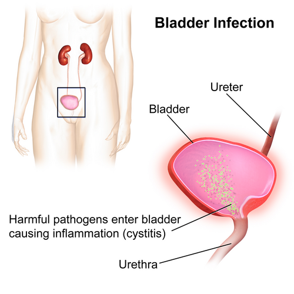
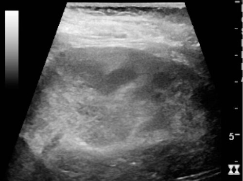

# ITU E PIELONEFRITE NA GESTAÇÃO

Para entender a Infecção do Trato Urinário (ITU) na gestação, você precisa primeiro esquecer a ideia de que a grávida é apenas uma paciente comum com um útero maior. Na obstetrícia, as alterações fisiológicas ditam a regra do jogo. Se você não compreender por que a gestante está vulnerável, você vai decorar doses e esquecer a conduta na hora da prova.

A ITU é a complicação infecciosa mais comum do período gestacional. Quando falamos de provas de residência, o foco recai sobre três entidades: a Bacteriúria Assintomática (BA), a Cistite e a Pielonefrite. O grande "pulo do gato" aqui é entender que, na gestante, a bacteriúria assintomática é tratada como se fosse uma doença ativa, algo que não fazemos na população geral (exceto em procedimentos urológicos).

## Alterações Fisiológicas: O Porquê da Vulnerabilidade

Por que a gestante faz tanta ITU? Não é apenas falta de higiene ou azar. Existe uma tríade de fatores que transforma o trato urinário materno em um meio de cultura ideal.

Primeiro, temos as alterações hormonais. A progesterona, o hormônio soberano da gravidez, tem um efeito relaxante sobre a musculatura lisa. Isso inclui os ureteres. O resultado é uma redução do peristaltismo ureteral, levando a uma estase urinária. Urina parada é convite para proliferação bacteriana.

Segundo, há o fator mecânico. À medida que o útero cresce, ele comprime os ureteres contra a linha inominada da bacia. Essa compressão é mais acentuada à direita. Por que? Porque o cólon sigmoide protege o ureter esquerdo, enquanto o útero sofre uma dextrorrotação fisiológica. Guarde isso: a dilatação ureteral e a hidronefrose fisiológica da gestação são mais comuns e intensas à direita. Se a prova mostrar uma hidronefrose bilateral leve, é fisiológico. Se for unilateral esquerda importante, desconfie de patologia, como nefrolitíase.

Terceiro, a composição da urina muda. Temos um aumento da filtração glomerular que leva à glicosúria e aminoacidúria fisiológicas. Mesmo gestantes não diabéticas podem ter glicose na urina. Esse "caldo nutritivo", somado ao aumento do pH urinário (pela maior excreção de bicarbonato), facilita o crescimento de patógenos, especialmente a *Escherichia coli*.

*Figura 1 - Mecanismo da ITU: bactérias ascendem pela uretra até a bexiga. Na gestação, as alterações anatômicas e hormonais facilitam a estase urinária e a ascensão bacteriana. Fonte: BruceBlaus, CC BY-SA 4.0 | Wikimedia Commons*

## Bacteriúria Assintomática (BA)

Este é o tema preferido das bancas. A definição de BA na gestação é a presença de colonização bacteriana persistente no trato urinário, em contagens iguais ou superiores a 100.000 (10^5) Unidades Formadoras de Colônias (UFC) por mililitro de urina, coletada em jato médio, na ausência de sintomas urinários.

### O Rastreio Obrigatório

Diferente de mulheres não grávidas, onde ignoramos a BA, na gestante o rastreio é universal e obrigatório. Segundo o Manual de Gestação de Alto Risco do Ministério da Saúde e as diretrizes da FEBRASGO, o rastreio deve ser feito com urocultura na primeira consulta de pré-natal (idealmente no primeiro trimestre).

Muitos alunos erram ao achar que o Sumário de Urina (EAS) serve para rastreio. Cuidado: o teste de nitrito na urina e a presença de leucocitúria têm baixo valor preditivo positivo para BA. O padrão-ouro é a urocultura. Se a urocultura vier positiva (>10^5 UFC/mL), você deve tratar, mesmo que a paciente jure que não sente nada.

### Por que tratar a BA?

Se não tratarmos, cerca de 20% a 40% dessas gestantes evoluirão para pielonefrite aguda. Além disso, a BA está associada a desfechos obstétricos desfavoráveis, como o Trabalho de Parto Pré-termo (TPP) e a Rotura Prematura de Membranas (RPM). O tratamento reduz o risco de pielonefrite para menos de 3%.

Aqui no MedEvo, sempre reforçamos: tratou a BA? Peça urocultura de controle (teste de cura) 7 a 14 dias após o término do antibiótico. A gestante que teve BA deve manter uroculturas mensais até o parto, pois o risco de recorrência é alto.

## Cistite Aguda na Gestação

A cistite é a infecção sintomática da bexiga. Diferente da BA, aqui a paciente apresenta o quadro clássico: disúria, polaciúria, urgência miccional e dor suprapúbica. Importante notar que a febre costuma estar ausente. Se houver febre, sua suspeita deve subir para os rins (pielonefrite).

O agente etiológico em 70% a 90% dos casos é a *Escherichia coli*. Outros agentes comuns incluem *Klebsiella pneumoniae*, *Proteus mirabilis* e o *Streptococcus agalactiae* (Grupo B).

### O Alerta do Streptococcus do Grupo B (SGB)

Atenção para esta pérola clínica: qualquer crescimento de *Streptococcus agalactiae* na urina da gestante, em qualquer contagem (mesmo < 10^5 UFC/mL), é diagnóstico de colonização intensa. O que isso muda na sua conduta?

- Você deve tratar a infecção atual.

- Essa paciente tem indicação formal de antibioticoprofilaxia intraparto para prevenir a sepse neonatal pelo SGB, independentemente de fazer o swab vaginal/anal na 35ª-37ª semana. Ela já é considerada "positiva" por definição.

## Pielonefrite Aguda: A Emergência

A pielonefrite é a principal causa de internação não obstétrica em gestantes. É uma doença sistêmica grave. O quadro clínico envolve a tríade: febre alta (geralmente com calafrios), dor lombar (punho percussão lombar dolorosa ou sinal de Giordano positivo) e náuseas/vômitos.

### Conduta na Pielonefrite

Diferente da cistite, que tratamos em casa, a pielonefrite na gestante exige internação hospitalar. Por que? Porque o risco de complicações é altíssimo. A gestante com pielonefrite pode evoluir rapidamente para choque séptico e Síndrome do Desconforto Respiratório Agudo (SARA), devido à liberação de endotoxinas bacterianas que lesam a membrana alvéolo-capilar.

A conduta imediata inclui:

- Internação e repouso.

- Hidratação venosa vigorosa (lembre-se: gestante com sepse e hipotensão faz IRA pré-renal facilmente).

- Coleta de urocultura e hemoculturas.

- Antibioticoterapia intravenosa empírica.

Se a paciente não melhorar após 48-72 horas de antibiótico adequado, você deve investigar obstrução urinária (nefrolitíase) ou abscesso renal através de ultrassonografia. Em casos de pielonefrite obstrutiva com sepse ou falha terapêutica, a desobstrução urinária de emergência (stent duplo J ou nefrostomia) é mandatória.

## Antibioticoterapia: O que usar e o que evitar

Aqui é onde as bancas testam seu conhecimento de farmacologia aplicada à obstetrícia. Nem todo antibiótico que funciona na urina pode ser usado na gestante.

### Opções Seguras (Primeira Escolha)

- **Nitrofurantoína:** Excelente para BA e cistite. Dose: 100mg de 6/6h ou 12/12h (apresentação macrocristais) por 7 dias.

- *Cuidado:* É contraindicada no termo (acima de 37-38 semanas) pelo risco de anemia hemolítica neonatal devido à imaturidade enzimática dos eritrócitos do feto (deficiência de G6PD).

- **Fosfomicina Trometamol:** Dose única de 3g. Ótima adesão. Muito cobrada em prova como opção eficaz e segura.

- **Cefalosporinas (Cefalexina, Cefuroxima, Ceftriaxona):** São seguras em qualquer trimestre. A Ceftriaxona (1g ou 2g IV) é a droga de escolha para tratamento hospitalar da pielonefrite.

- **Amoxicilina:** Pode ser usada, mas a resistência da *E. coli* é alta, então só use se o antibiograma confirmar sensibilidade.

### O que evitar ou usar com cautela

- **Quinolonas (Norfloxacina, Ciprofloxacina):** Contraindicação relativa/evitar. Estão associadas a lesões de cartilagem em modelos animais. Só usamos em casos de resistência extrema onde não há alternativa.

- **Sulfametoxazol-Trimetoprima (SMX-TMP):**

- No 1º trimestre: Evitar, pois é antagonista do ácido fólico (risco de defeitos do tubo neural).

- No 3º trimestre: Evitar, pois compete com a bilirrubina pela albumina, aumentando o risco de kernicterus (icterícia nuclear) no recém-nascido.

- **Aminoglicosídeos (Gentamicina):** Podem ser usados na pielonefrite grave, mas com cautela pelo risco de ototoxicidade e nefrotoxicidade fetal.

| Patologia | Conduta Inicial | Antibiótico Sugerido | Duração |
| --- | --- | --- | --- |
| Bacteriúria Assintomática | Ambulatorial | Nitrofurantoína ou Fosfomicina | 7 dias (ou dose única) |
| Cistite Aguda | Ambulatorial | Cefalexina ou Nitrofurantoína | 7 dias |
| Pielonefrite | Hospitalar | Ceftriaxona IV | 10-14 dias (total) |
| ITU Recorrente | Profilaxia | Nitrofurantoína (noite) | Até o parto |

*Figura 2 - US renal na pielonefrite aguda: aumento da ecogenicidade cortical e borramento do polo superior. Na gestante, a pielonefrite é a forma mais grave de ITU e requer internação hospitalar. Fonte: Hansen et al., CC BY 4.0 | Wikimedia Commons*

## Diagnóstico Diferencial e Situações Especiais

O Dr. Will sempre lembra nas aulas: "Nem toda dor no flanco na grávida é rim". Precisamos estar atentos aos diferenciais.

### Apendicite Aguda

É a causa mais comum de abdome agudo cirúrgico na gestação. A pegadinha de prova aqui é a localização da dor. Como o útero cresce, o apêndice é empurrado para cima e para fora. Na gestante avançada, a dor da apendicite pode ser no flanco direito ou até no hipocôndrio direito, mimetizando uma pielonefrite ou colecistite. O diagnóstico é clínico + USG (primeira escolha). Se houver abscesso ou apendicite confirmada, a apendicectomia videolaparoscópica é preferencial e segura.

### Nefrolitíase

A dor da cólica nefrética é súbita e excruciante, diferente da dor surda e contínua da pielonefrite. Se houver suspeita de cálculo, a USG de rins e vias urinárias é o exame inicial. Lembre-se: a Litotripsia Extracorpórea por Ondas de Choque (LECO) é contraindicada na gestação.

### Doença Renal Crônica (DRC)

Gestantes com DRC prévia têm risco altíssimo de pré-eclâmpsia sobreposta e agravamento da função renal. Nesses casos, a avaliação da função renal (creatinina, proteinúria) deve ser mensal, e não trimestral.

## Outras Infecções e Intercorrências (Conceitos Correlatos)

As bancas costumam misturar temas de infecções na gestação. Vamos pontuar o que você não pode esquecer:

-

**Toxoplasmose:**

- IgG negativo e IgM negativo = Gestante suscetível. Orientar não comer carne crua e evitar contato com fezes de gatos.

- Soroconversão (IgM+ e IgG+ com avidez baixa): Iniciar Espiramicina imediatamente e solicitar amniocentese (PCR para o feto).

- Feto infectado: Trocar para o esquema tríplice (Sulfadiazina + Pirimetamina + Ácido Folínico).

-

**Vaginose Bacteriana:** Corrimento acinzentado com odor fétido. Deve ser tratada na gestante (Metronidazol oral) para reduzir o risco de parto prematuro.

-

**Trabalho de Parto Pré-termo (TPP):** A infecção urinária é um dos principais gatilhos. Se a paciente chega com contrações e colo curto (< 25mm), sempre peça urocultura. Se houver história de TPP anterior e colo curto atual, a indicação pode ser progesterona vaginal ou cerclagem, dependendo do caso.

## Profilaxia de ITU Recorrente

Consideramos ITU recorrente quando a gestante apresenta 2 ou mais episódios de ITU (incluindo BA) na mesma gestação. Nesses casos, após o tratamento do episódio agudo, indicamos a antibioticoprofilaxia contínua até o final da gravidez.

O esquema mais utilizado é a Nitrofurantoína 100mg, via oral, uma vez ao dia (geralmente à noite, para maior tempo de permanência na bexiga). Outra opção é a Cefalexina 250mg. Lembre-se de suspender a Nitrofurantoína próximo ao termo (37 semanas) e substituir por Cefalexina se necessário.

## Resumo de Condutas Farmacológicas

Para facilitar sua memorização, organizei as doses e indicações conforme as diretrizes nacionais:

### Tratamento Ambulatorial (BA e Cistite)

- **Fosfomicina trometamol:** 3g, dose única (excelente para BA).

- **Nitrofurantoína:** 100mg, 6/6h, por 7 dias (macrocristais 100mg 12/12h).

- **Cefalexina:** 500mg, 6/6h, por 7 dias.

- **Amoxicilina:** 500mg, 8/8h, por 7 dias (se sensível).

### Tratamento Hospitalar (Pielonefrite)

- **Ceftriaxona:** 1 a 2g, IV ou IM, a cada 24h.

- **Cefalotina:** 1g, IV, a cada 6h.

- **Ampicilina + Gentamicina:** Esquema clássico para casos mais graves, embora as cefalosporinas de 3ª geração sejam mais práticas.

A transição para a via oral pode ser feita após 24 a 48 horas de afebrilidade, completando um total de 10 a 14 dias de tratamento.

## Pontos-Chave para Prova

- **Agente mais comum:** *Escherichia coli* (70-90%).

- **Critério BA:** Urocultura com ≥ 10^5 UFC/mL em paciente assintomática.

- **Rastreio:** Obrigatório no 1º trimestre com urocultura. EAS não substitui.

- **SGB na urina:** Independente da contagem, tratar e fazer profilaxia intraparto para sepse neonatal.

- **Pielonefrite:** Internação hospitalar é obrigatória. Risco de choque e SARA.

- **Nitrofurantoína:** Contraindicada no termo (>37-38 semanas) por risco de hemólise fetal.

- **Quinolonas (Cipro/Norfloxacina):** Evitar na gestação (lesão de cartilagem).

- **SMX-TMP:** Evitar no 1º tri (defeito tubo neural) e no 3º tri (kernicterus).

- **Hidronefrose fisiológica:** Mais comum à direita devido à dextrorrotação uterina.

- **Teste de cura:** Sempre solicitar urocultura 7-14 dias após o tratamento de qualquer ITU na gestação.

- **Profilaxia:** Indicada após 2 episódios de ITU na gestação. Nitrofurantoína 100mg/dia é a droga de escolha.

- **Apendicite na gestante:** Dor pode ser no flanco ou hipocôndrio direito. USG é o primeiro exame.

- **Sepse por Pielonefrite:** Hidratação venosa imediata para prevenir IRA pré-renal.

- **Diferencial de dor lombar:** Se houver febre e Giordano, Pielonefrite. Se dor súbita sem febre, Nefrolitíase.

- **Tratamento de BA:** Reduz o risco de evolução para Pielonefrite de 40% para <3%.

- **Urocultura mensal:** Recomendada para gestantes que já trataram BA ou cistite. 🩺

Este material foi estruturado para que você compreenda a lógica por trás das condutas. Na prova, as questões de ITU na gestação costumam ser diretas, mas exigem atenção aos detalhes farmacológicos e à obrigatoriedade do tratamento da bacteriúria assintomática. Mantenha o foco no binômio mãe-feto e você não errará essas questões.

 Cópia offline para consulta pessoal.
 Fonte original:
 [https://www.medevo.com.br/material-apoio/ler/76f1bb8a-e8ad-4fd5-bc73-6857e0534e9c](https://www.medevo.com.br/material-apoio/ler/76f1bb8a-e8ad-4fd5-bc73-6857e0534e9c)
