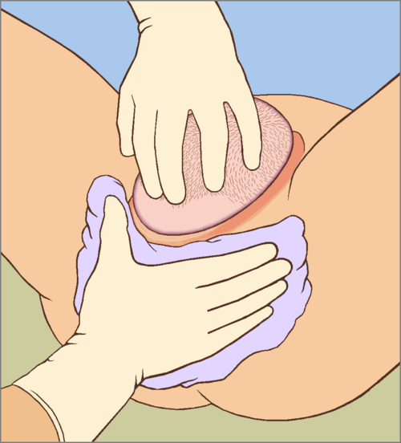
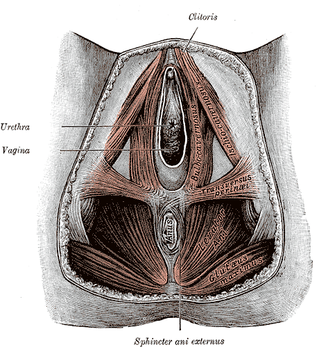

# LACERAÇÕES PERINEAIS: CLASSIFICAÇÃO E REPARO

Para entender as lacerações perineais, precisamos primeiro revisitar a anatomia do assoalho pélvico. Se você não souber o que está lá embaixo, não saberá o que está costurando. O períneo é dividido em dois triângulos por uma linha imaginária entre as tuberosidades isquiáticas: o triângulo urogenital (anterior) e o triângulo anal (posterior). No centro disso tudo, temos o corpo perineal, uma massa fibromuscular onde vários músculos se inserem.

Quando o feto passa pelo canal de parto, ele exerce uma pressão radial enorme. Se os tecidos não forem complacentes ou se o desprendimento for súbito, o tecido rompe. É aqui que entra a classificação de Sultan, que é a bíblia das provas de residência.

*Figura 1 - Proteção perineal durante o período expulsivo do parto: a técnica de suporte manual visa prevenir lacerações perineais graves. Fonte: Sciencia58, CC0 | Wikimedia Commons*

## Anatomia Aplicada ao Trauma Obstétrico

Muitos alunos erram questões de anatomia porque tentam decorar nomes sem visualizar a função. No parto, os músculos mais comumente lesados ou seccionados na episiotomia são o bulboesponjoso (ou bulbocavernoso), o transverso superficial do períneo e, em casos mais profundos, o feixe puborretal do músculo levantador do ânus.

O esfíncter anal externo (EAE) é um anel de músculo estriado, voluntário. Já o esfíncter anal interno (EAI) é uma continuação da musculatura lisa circular do reto, sendo involuntário. Guarde essa diferença: a lesão do EAI (grau 3c) é um marcador de gravidade maior para incontinência fecal futura.

Dica de prova: O nervo pudendo é o responsável pela inervação dessa região. O ponto de referência para o seu bloqueio anestésico é a espinha ciática (ou isquiática). Se a questão mencionar "anestesia para episiotomia", procure pela espinha ciática nas alternativas.

*Figura 2 - A classificação das lacerações perineais (1º a 4º grau) depende do conhecimento anatômico das estruturas envolvidas: pele, mucosa, músculos do períneo e esfíncter anal. Fonte: Sciencia58, CC0 | Wikimedia Commons*

## Classificação das Lacerações Perineais

A classificação adotada pela FEBRASGO e pela Organização Mundial da Saúde (OMS) divide as lacerações em quatro graus. Este é o tópico mais cobrado em provas, e a banca vai tentar confundir você nos detalhes do terceiro grau.

### Laceração de Primeiro Grau

Acomete apenas a pele do períneo e/ou a mucosa vaginal. Não há envolvimento da musculatura. Muitas vezes, se não houver sangramento ativo, essas lacerações nem precisam de sutura, pois cicatrizam bem por segunda intenção.

### Laceração de Segundo Grau

Aqui o bicho começa a pegar. A lesão atinge a musculatura perineal (bulboesponjoso e transverso superficial), mas o esfíncter anal permanece intacto. É a laceração que mimetiza a anatomia de uma episiotomia. O reparo deve ser feito em camadas: primeiro a mucosa vaginal, depois a musculatura e, por fim, a pele.

### Laceração de Terceiro Grau

Este é o ponto onde as reprovações acontecem. A laceração de terceiro grau envolve o complexo do esfíncter anal. Ela é subdividida em:

- 3a: Lesão de menos de 50% da espessura do esfíncter anal externo (EAE).

- 3b: Lesão de mais de 50% da espessura do EAE.

- 3c: Lesão que atinge também o esfíncter anal interno (EAI).

Por que essa divisão é importante? Porque o prognóstico muda. Uma lesão 3c tem um risco muito maior de evoluir com incontinência a flatos e fezes. Como dizemos no MedEvo, o diagnóstico aqui é clínico e exige o toque retal após o parto para garantir que o esfíncter está íntegro.

### Laceração de Quarto Grau

É a lesão total. Envolve o complexo esfincteriano (EAE e EAI) e a mucosa retal, expondo a luz do reto. O risco de fístula retovaginal aqui é altíssimo se o reparo não for perfeito.

**Tabela 1: Resumo da Classificação de Sultan**

| Grau | Estruturas Acometidas | Conduta Típica |
| --- | --- | --- |
| 1º Grau | Pele e mucosa vaginal apenas | Observação ou sutura simples |
| 2º Grau | Musculatura perineal (sem esfíncter) | Sutura por planos |
| 3º Grau | Esfíncter Anal (3a, 3b, 3c) | Reparo especializado (técnica overlap ou topo a topo) |
| 4º Grau | Esfíncter Anal + Mucosa Retal | Reparo complexo + Antibioticoprofilaxia |

## Episiotomia: O Fim da Rotina

Antigamente, acreditava-se que a episiotomia (incisão cirúrgica do períneo) prevenia lacerações graves e protegia o assoalho pélvico. Hoje, as evidências mostram o contrário. A episiotomia rotineira aumenta o risco de lacerações de 3º e 4º graus, além de causar mais dor, infecção e dispareunia.

A recomendação atual da FEBRASGO e da OMS é a episiotomia seletiva. Ela só deve ser feita em casos específicos, como sofrimento fetal agudo (necessidade de abreviar o período expulsivo) ou em partos instrumentados (fórceps) onde o períneo é claramente restritivo.

### Tipos de Episiotomia

Existem dois tipos principais que caem em prova: a mediana e a médio-lateral.

-

**Episiotomia Mediana:** É feita na linha média, em direção ao ânus.

- Vantagens: Menos dor, melhor cicatrização estática, menos perda sanguínea.

- Desvantagem fatal: É o maior fator de risco para lacerações de 4º grau. Se a incisão "correr", ela vai direto para o reto.

-

**Episiotomia Médio-Lateral:** É feita em um ângulo de 45 a 60 graus em relação à linha média.

- Vantagens: Protege o esfíncter anal. Se a laceração aumentar, ela se afasta do ânus.

- Desvantagens: Mais dor no pós-operatório, maior perda sanguínea e maior taxa de dispareunia (dor na relação sexual).

Cuidado com a pegadinha: A alternativa vai dizer que a episiotomia mediana é a melhor porque dói menos. No entanto, para a segurança do esfíncter anal, a médio-lateral é a preferida nas diretrizes brasileiras quando a intervenção é necessária.

## Técnica de Reparo e Materiais

O Dr. Will sempre reforça: o objetivo do reparo não é apenas "fechar o buraco", mas restaurar a anatomia funcional.

Para lacerações de 1º e 2º grau, o fio de escolha é o categute cromado ou, preferencialmente, o poliglactina 910 (Vicryl) de absorção rápida. A sutura contínua é superior à sutura de pontos separados, pois causa menos dor e tem menor necessidade de reintervenção.

No reparo do esfíncter anal (3º e 4º graus), existem duas técnicas:

- **Topo a topo (end-to-end):** As extremidades do músculo são aproximadas.

- **Sobreposição (overlap):** As extremidades são sobrepostas e suturadas.

A técnica de sobreposição parece ter resultados ligeiramente melhores para a continência fecal a longo prazo em lesões 3b e 3c, mas o mais importante para a prova é saber que essas lesões exigem antibioticoprofilaxia (geralmente cefalosporina de 2ª geração ou clindamicina + gentamicina) devido ao risco de contaminação por germes entéricos.

## Complicações e Diagnóstico Diferencial

Se o reparo falhar ou se uma lesão passar despercebida, teremos complicações. As mais temidas são as fístulas e a incontinência.

### Fístulas Geniturinárias e Retovaginais

Imagine uma paciente que, após um parto distócico ou uma histerectomia, começa a apresentar perda constante de urina pela vagina. Ela diz que "não sente a bexiga cheia, a urina simplesmente escorre". Isso é clássico de fístula vesicovaginal.

Como diagnosticar? O teste do azul de metileno é o favorito das bancas.

- Coloca-se um tampão na vagina.

- Instila-se azul de metileno na bexiga via sonda.

- Se o tampão sair azul → Fístula vesicovaginal.

- Se o tampão sair molhado, mas sem cor (urina clara) → A fístula pode ser ureterovaginal (o azul não chega ao ureter).

### Deiscência e Infecção

A deiscência da episiotomia ou do reparo perineal geralmente ocorre por infecção. O tratamento inicial não é suturar de novo imediatamente! Primeiro, limpamos a ferida, prescrevemos banhos de assento e, se houver celulite, antibióticos. A ressutura só deve ser feita quando o tecido estiver limpo e com tecido de granulação saudável.

**Tabela 2: Comparativo de Episiotomias**

| Característica | Mediana | Médio-Lateral |
| --- | --- | --- |
| Risco de Lesão Esfincteriana | Muito Alto | Baixo |
| Dor Pós-Operatória | Menor | Maior |
| Perda Sanguínea | Menor | Maior |
| Cicatrização | Excelente | Regular |
| Dispareunia | Rara | Mais comum |

## Traumatismos de Parto no Recém-Nascido

Muitas vezes, a questão de laceração perineal vem acompanhada de uma pergunta sobre o feto. Se o parto foi difícil a ponto de rasgar o períneo, o bebê também pode ter sofrido. Você precisa diferenciar as coleções hemáticas na cabeça do RN.

- **Bossa Serossanguínea (Caput Succedaneum):** É um edema do tecido subcutâneo. É fisiológico, aparece no momento do parto e, o mais importante: **ultrapassa as linhas de sutura craniana**. Desaparece em 24 a 48 horas.

- **Céfalo-hematoma:** É uma hemorragia subperióstea. **Não ultrapassa as suturas**, pois o periósteo é aderido ao osso. Demora semanas para sumir e pode causar icterícia neonatal pela reabsorção do sangue.

Erro clássico: Achar que a bossa é grave. Não é. O céfalo-hematoma é que exige mais vigilância para hiperbilirrubinemia.

## Insuficiência Istmocervical e Cerclagem

Embora pareça um tema distante, as bancas conectam lacerações cervicais com insuficiência istmocervical (IIC). Se uma paciente teve uma laceração de colo uterino não reparada ou um parto muito traumático, ela pode desenvolver IIC.

O quadro clínico é de perdas gestacionais tardias (segundo trimestre), com expulsão fetal rápida, indolor e sem contrações prévias. O tratamento é a cerclagem de MacDonald, realizada idealmente entre 12 e 16 semanas de gestação. Lembre-se: a cerclagem é um "fio de bolsa" em torno do colo para mantê-lo fechado mecanicamente.

**Tabela 3: Diagnóstico Diferencial de Coleções Cranianas no RN**

| Característica | Bossa Serossanguínea | Céfalo-hematoma |
| --- | --- | --- |
| Localização | Subcutâneo | Subperiósteo |
| Limites | Ultrapassa suturas | Respeita suturas |
| Surgimento | No nascimento | Horas após o parto |
| Resolução | 24-48 horas | Semanas a meses |
| Risco de Icterícia | Baixo | Elevado |

## Assistência ao Segundo Período do Parto

Para evitar as lacerações que estamos estudando, a assistência deve ser técnica. A Manobra de Ritgen Modificada é frequentemente citada. Ela consiste em controlar a deflexão da cabeça fetal com uma mão sobre o occipital e a outra exercendo pressão sobre o períneo posterior (protegendo-o com uma compressa). Isso evita que a cabeça "exploda" para fora, dando tempo para os tecidos se dilatarem.

Além disso, variedades de posição occipitoposteriores aumentam muito o risco de trauma perineal, pois os diâmetros da cabeça fetal que se apresentam ao períneo são maiores.

## Aspectos Éticos e Violência Obstétrica

A episiotomia sem consentimento ou realizada de forma rotineira e abusiva é classificada por muitos conselhos e diretrizes como violência obstétrica. O plano de parto e o consentimento esclarecido são ferramentas fundamentais. Se a prova trouxer um cenário onde o médico faz a episiotomia "para ajudar" sem avisar a paciente, a questão provavelmente está caminhando para o tema de ética e autonomia.

Em casos de suspeita de abuso sexual em crianças ou adolescentes que chegam com lacerações genitais, a conduta é clara: notificação compulsória, acionamento do Conselho Tutelar e exame pericial/hospitalar imediato. Não tente resolver sozinho no consultório.

## Manejo Pós-Reparo

Após suturar uma laceração de 2º, 3º ou 4º grau, o manejo da dor é essencial.

- **Analgesia:** AINEs (como o ibuprofeno) e paracetamol são a primeira linha. Em lacerações graves, o uso de AINEs retais pode ser considerado se não houver lesão de mucosa retal (grau 1 a 3b).

- **Higiene:** Apenas água e sabão. Não há necessidade de antissépticos tópicos.

- **Dieta:** Em lesões de 3º e 4º grau, prescrevemos laxativos formadores de bolo ou amaciantes de fezes (como óleo de vaselina ou lactulose) para evitar que a paciente faça esforço evacuatório e rompa os pontos do esfíncter.

Muitos alunos acham que em lesão de 4º grau a paciente deve ficar em dieta zero ou sem evacuar. Errado! Ela deve evacuar fezes macias para não causar pressão sobre a sutura.

**Tabela 4: Diagnóstico de Fístulas Pós-Parto/Cirurgia**

| Teste | Resultado | Diagnóstico Provável |
| --- | --- | --- |
| Azul de Metileno (via sonda) | Tampão vaginal azul | Fístula Vesicovaginal |
| Azul de Metileno (via sonda) | Tampão vaginal molhado/claro | Fístula Ureterovaginal |
| Exame Físico com Espéculo | Fezes na vagina | Fístula Retovaginal |

## Considerações sobre o Parto Instrumentado

O uso de fórceps ou vácuo-extrator está intimamente ligado ao aumento das lacerações perineais. O fórceps de Simpson, por exemplo, ocupa espaço nas paredes vaginais, aumentando a tensão no períneo. Nesses casos, a episiotomia médio-lateral é frequentemente indicada de forma seletiva para evitar que uma laceração de 4º grau ocorra de forma descontrolada.

No entanto, o vácuo-extrator está associado a menores taxas de lacerações maternas graves quando comparado ao fórceps, embora possa causar mais bossa serossanguínea no recém-nascido.

## Incontinência Urinária Pós-Parto

A incontinência urinária de esforço é comum no puerpério imediato devido ao estiramento das fibras nervosas e musculares do assoalho pélvico. A maioria dos casos resolve-se espontaneamente em 6 meses com fisioterapia pélvica.

Diferencie isso da incontinência extra-uretral (fístulas). Na incontinência de esforço, a paciente perde urina ao tossir ou espirrar. Na fístula, a perda é contínua, dia e noite, independente do esforço. Essa é a "chave" para matar a questão.

## Pontos-Chave para Prova

- **Classificação de Sultan:** Memorize os subgrupos do 3º grau (3a < 50% EAE, 3b > 50% EAE, 3c = EAI).

- **Episiotomia:** Não é rotina. A médio-lateral é preferível à mediana por proteger o esfíncter anal, apesar de ser mais dolorosa.

- **Músculos da Episiotomia:** Bulboesponjoso e transverso superficial do períneo são os principais.

- **Anestesia:** O bloqueio do nervo pudendo usa a espinha ciática como ponto de reparo.

- **Fio de Sutura:** Poliglactina 910 (Vicryl) de absorção rápida é o padrão-ouro; sutura contínua sempre que possível.

- **Antibioticoprofilaxia:** Obrigatória em lacerações de 3º e 4º graus.

- **Laxativos:** Indicados no pós-operatório de lesões esfincterianas para garantir fezes macias.

- **Bossa vs. Céfalo-hematoma:** Bossa cruza suturas e é precoce; céfalo-hematoma respeita suturas e é tardio.

- **Fístula Vesicovaginal:** Suspeite em perda urinária contínua pós-parto distócico; confirme com teste do azul de metileno.

- **Cerclagem:** Técnica de MacDonald entre 12-16 semanas para insuficiência istmocervical.

- **Manobra de Ritgen Modificada:** Técnica de proteção perineal durante o desprendimento da cabeça fetal.

- **Incontinência Fecal:** É a principal sequela de lacerações de 3º grau não diagnosticadas ou mal reparadas.

- **Variedade de Posição:** Occitoposteriores aumentam o risco de trauma perineal grave.

- **Conduta na Deiscência:** Não ressuturar imediatamente se houver sinais de infecção; priorizar limpeza e banhos de assento.

- **Contraindicação Absoluta:** Nunca faça episiotomia rotineira em todos os partos; isso é considerado má prática. 🩺

Ao revisar este material, você percebe que o segredo das lacerações perineais não é apenas a classificação, mas a compreensão de como a anatomia se altera durante o parto e como nossas intervenções (como a episiotomia) podem ajudar ou prejudicar essa dinâmica. Foque nas tabelas comparativas, elas resumem 80% do que as bancas gostam de cobrar.

 Cópia offline para consulta pessoal.
 Fonte original:
 [https://www.medevo.com.br/material-apoio/ler/15cf4d76-70ad-4863-a22d-345ff28ac9fa](https://www.medevo.com.br/material-apoio/ler/15cf4d76-70ad-4863-a22d-345ff28ac9fa)
