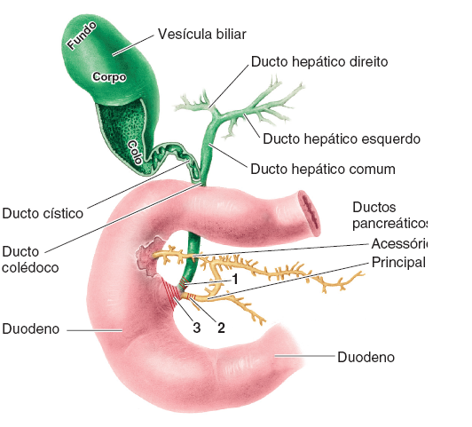
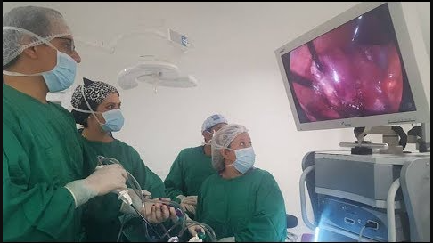
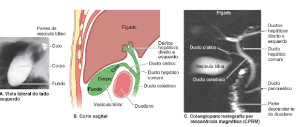
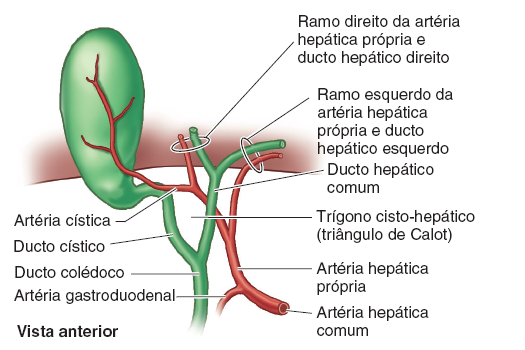
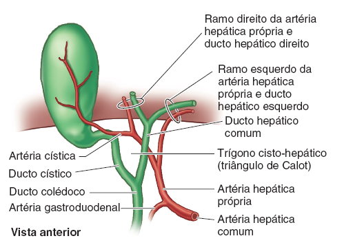
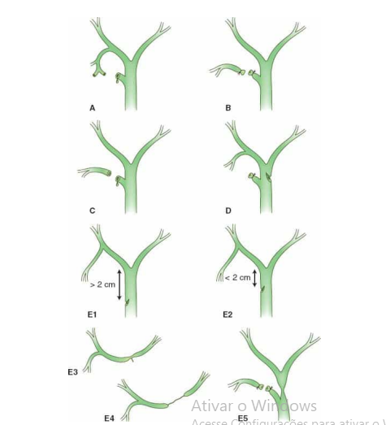
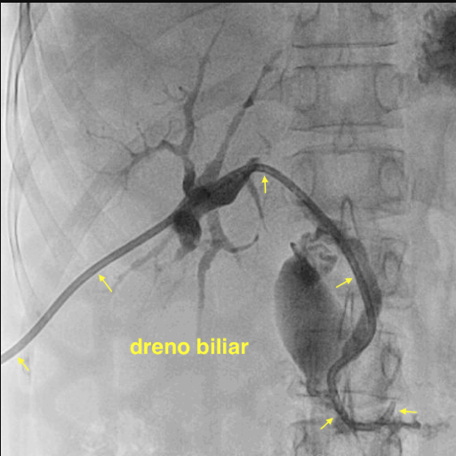
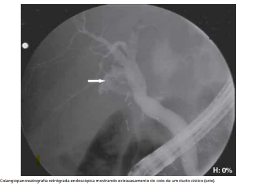
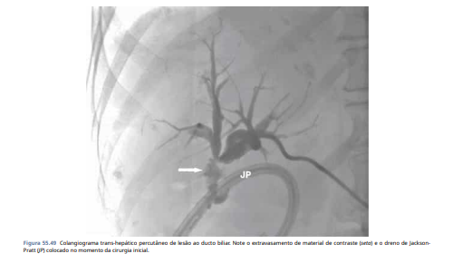

# LESÃO IATROGÊNICA DE VIA BILIAR

A lesão iatrogênica da via biliar (LIVB) é, sem dúvida, o maior pesadelo do cirurgião geral e do aparelho digestivo. Não apenas pela gravidade técnica, mas pelo impacto devastador na qualidade de vida do paciente e pelas implicações médico-legais. Se você está estudando para a residência, precisa entender que as bancas não querem apenas que você decore uma classificação; elas querem que você saiba **quando suspeitar, como prevenir e qual a sequência lógica de conduta**.

Historicamente, a incidência de lesões aumentou com a introdução da colecistectomia videolaparoscópica (CVL). Na era da cirurgia aberta, a taxa era de 0,1% a 0,2%. Com a laparoscopia, esse número subiu para 0,3% a 0,6%. Por que isso aconteceu? Pela perda da percepção de profundidade (visão 2D) e, principalmente, por erros de percepção visual. Como o Dr. Will costuma dizer em nossas mentorias no MedEvo, o cirurgião não corta o colédoco porque é negligente, mas porque ele *tem certeza* de que aquela estrutura é o ducto cístico.

*Figura 1 - Anatomia da via biliar: estruturas fundamentais durante a colecistectomia videolaparoscópica.*

*Figura 2 - Visão intraoperatória: identificação das estruturas biliares durante a CVL.*

## Colecistectomia Videolaparoscópica (CVL)

Fala, futuro residente! A Colecistectomia Videolaparoscópica é o procedimento "padrão-ouro" para colelitíase e um dos temas mais recorrentes em provas de Cirurgia Geral. Mais do que decorar passos, você precisa entender a lógica da segurança cirúrgica.

Vamos decompor a cirurgia nos seus tempos fundamentais:

- Acesso e Pneumoperitôneo
O objetivo aqui é criar espaço de trabalho usando CO2, mantendo a pressão entre 12-15 mmHg.

● Técnica de Veress (Fechada): Punção "às cegas" com agulha na região umbilical. Cuidado com grandes vasos!
● Técnica de Hasson (Aberta): Dissecção por planos até a aponeurose e abertura do peritônio sob visão direta. Dica de prova: É a preferencial em pacientes com cirurgias abdominais prévias (devido ao risco de aderências).
2. Portais (Trocartes)
A configuração clássica utiliza 4 trocartes, mas guarde a função de cada um:

Portal Localização Função Principal
10 mm Umbilical Óptica (Câmera)
10 mm Epigástrico Mão direita do cirurgião (Trabalho/Dissecção)
5 mm Linha Hemiclavicular D Mão esquerda do cirurgião (Tração do Infundíbulo)
5 mm Linha Axilar Anterior D Auxiliar (Tração do Fundo da Vesícula)
3. Exposição e o Trígono de Calot
Para operar com segurança, precisamos expor o Trígono de Calot. Ele é limitado por:

- Ducto Cístico (inferior)

- Ducto Hepático Comum (medial)

- Borda inferior do Fígado (superior)

*Figura 3 - Trígono de Calot: limites anatômicos fundamentais para a dissecção segura.*

*Figura 4 - Exposição do Trígono de Calot: tração do infundíbulo para visualização das estruturas.*

A manobra chave: O auxiliar traciona o fundo da vesícula para cima (cranial), enquanto o cirurgião traciona o infundíbulo (bolsa de Hartmann) para fora e para baixo (lateral e caudal). Isso "abre" o triângulo para a dissecção.

- A Regra de Ouro: Visão Crítica de Segurança (Strasberg)
Este é o ponto que mais cai em provas! Para evitar lesões iatrogênicas da via biliar, o cirurgião só deve clipar as estruturas após obter a Visão Crítica, que exige 3 critérios:

- Limpeza completa de toda gordura e tecido fibroso do Trígono de Calot.

- Descolamento da parte inferior da vesícula do leito hepático (placa cística).

- Identificação de APENAS duas (e somente duas) estruturas entrando na vesícula: o ducto cístico e a artéria cística.

- Clipagem e Exérese
Após a visão crítica:

● Clipagem: Colocamos clipes no ducto e na artéria (geralmente 2 proximais e 1 distal em cada).
● Seção: Cortamos entre os clipes.
● Descolamento: A vesícula é separada do fígado (fossa cística) usando eletrocautério.
6. Finalização
● Hemostasia: Revisão do leito hepático para garantir que não há sangramentos ou escape de bile.
● Extração: A vesícula é colocada em uma bolsa (Endobag) e retirada, geralmente pelo portal umbilical.
● Drenagem: Não é rotina! Só deixamos dreno (tipo Portovac ou Blake) se houver dúvida sobre sangramento ou fístula biliar.
⚠️ Alerta de Prova: "Deu ruim, e agora?"
Se a inflamação estiver tão intensa que impede a identificação segura das estruturas (o famoso "congelado"), a conduta correta para evitar lesão da via biliar é:

- Colecistectomia Subtotal: Remove-se apenas parte da vesícula e fecha-se o cístico por dentro.

- Conversão para cirurgia aberta: Sempre uma opção de segurança, nunca um erro!

## Anatomia Aplicada e o Triângulo de Calot

Para entender a lesão, você precisa dominar o cenário onde ela ocorre. O **Triângulo de Calot** é o marco anatômico fundamental. Seus limites são:

- Ducto cístico (inferior);

- Ducto hepático comum (medial);

- Borda inferior do fígado (superior).

*Figura 5 - Anatomia do Triângulo de Calot: ducto cístico, ducto hepático comum e borda hepática delimitam o triângulo.*

**Cuidado com a pegadinha:** Muitos livros antigos e algumas questões desatualizadas citam a artéria cística como limite superior (formando o Triângulo de Budde). Para as provas atuais, o limite superior é a borda do fígado. Dentro desse triângulo, encontramos a artéria cística e, frequentemente, o linfonodo de Mascagni.

Lembre-se: a via biliar tem um suprimento arterial quase exclusivo e muito frágil, vindo principalmente das artérias hepática direita e gastroduodenal (as famosas artérias das 3 e 9 horas). Uma lesão arterial concomitante, especialmente da artéria hepática direita, ocorre em até 25% das lesões biliares e agrava drasticamente o prognóstico, levando à isquemia e estenose biliar grave.

## Fisiopatologia: Por que a lesão acontece?

A causa número um é a **identificação errônea da anatomia**. O erro clássico é a "colecistectomia clássica invertida": o cirurgião traciona excessivamente o fundo da vesícula para cima, o que alinha o ducto cístico com o colédoco. Ao clipar o que ele pensa ser o cístico, ele está, na verdade, clipando e seccionando o ducto hepático comum ou o colédoco.

Outros fatores de risco incluem:

- **Inflamação aguda ou crônica:** A colecistite aguda "apaga" os planos de clivagem.

- **Variações anatômicas:** Ductos hepáticos direitos anômalos que drenam diretamente no cístico ou na vesícula.

- **Obesidade (IMC elevado):** Exige instrumentais longos e dificulta a tração adequada.

- **Sangramento intraoperatório:** A tentativa cega de clipar um vaso que sangra é uma fábrica de lesões biliares.

## Prevenção: A Visão Crítica de Segurança (Strasberg)

Este é o conceito mais cobrado em provas sobre prevenção. Para considerar uma colecistectomia segura, o cirurgião deve obter a **Visão Crítica de Segurança**, que consiste em três critérios obrigatórios:

- **Limpeza do Triângulo de Calot:** Toda a gordura e tecido fibroso devem ser removidos do triângulo.

- **Descolamento da base da vesícula:** O terço inferior da vesícula deve ser separado do leito hepático (o "plano cístico").

- **Duas e apenas duas estruturas:** Apenas o ducto cístico e a artéria cística devem ser vistos entrando na vesícula.

Se você não enxerga o leito hepático entre as estruturas e a base da vesícula, você não tem a visão crítica. A tração lateral e caudal do infundíbulo é essencial para abrir o triângulo e evitar o alinhamento perigoso entre o cístico e o colédoco.

## Classificações de Strasberg e Bismuth

Aqui o aluno costuma travar, mas vamos simplificar. A classificação de **Strasberg** é a mais completa para lesões agudas, enquanto a de **Bismuth** foca em estenoses (lesões tardias).

### Classificação de Strasberg

- **Tipo A:** Vazamento de ducto pequeno em continuidade com a via biliar principal (geralmente ducto cístico mal clipado ou ducto de Luschka no leito hepático).

- **Tipo B:** Oclusão de uma parte da árvore biliar (geralmente um ducto hepático direito aberrante). É uma lesão isquêmica/obstrutiva.

- **Tipo C:** Vazamento de um ducto hepático direito aberrante (seccionado e não ligado).

- **Tipo D:** Lesão lateral da via biliar principal (tangencial), sem perda de continuidade, acometendo < 50% da circunferência.

- **Tipo E:** Lesão circunferencial com perda de continuidade da via biliar principal. É subdividida pela classificação de Bismuth.

*Figura 6 - Classificação de Strasberg: tipos A (fístula), B-C (ductos aberrantes), D (lesão lateral) e E (transecção completa).*

### Classificação de Bismuth (Subtipos do Strasberg E)

Esta classificação avalia a distância da lesão em relação à confluência dos ductos hepáticos (hilo):

- **E1:** Coto do ducto hepático comum > 2 cm da confluência.

- **E2:** Coto do ducto hepático comum < 2 cm da confluência.

- **E3:** Lesão na própria confluência (hilo), mas os ductos hepáticos direito e esquerdo ainda estão comunicados.

- **E4:** Lesão que separa a confluência (os ductos direito e esquerdo perdem a comunicação entre si).

- **E5:** Envolve a confluência e um ducto setorial direito (lesão complexa).

**Tabela 1: Resumo Rápido para Prova - Strasberg E**

| Tipo | Localização da Lesão | Dica de Memorização |
| --- | --- | --- |
| **E1** | > 2 cm da confluência | "Longe" do hilo |
| **E2** | < 2 cm da confluência | "Perto" do hilo |
| **E3** | Na confluência | Destrói a união |
| **E4** | Acima da confluência | Separa D de E |
| **E5** | Confluência + Ducto aberrante | A mais complexa |

## Quadro Clínico: O "Timing" do Diagnóstico

A lesão pode ser identificada em três momentos distintos, e a prova vai te dar pistas sobre qual deles é:

### 1. Intraoperatório

O cirurgião percebe a saída de bile em local anômalo ou nota uma anatomia "estranha" após cortar uma estrutura.
**Conduta imediata:** Realizar Colangiografia Intraoperatória (CIO). Se confirmada a lesão e o cirurgião não for experiente em reconstrução biliar complexa, ele deve drenar a cavidade e encaminhar para um centro de referência. **Nunca tente consertar o que você não domina**, pois a primeira tentativa de reparo é a que tem maior chance de sucesso.

*Figura 7 - Colangiografia intraoperatória: exame realizado no ato cirúrgico para confirmar lesão biliar.*

### 2. Pós-operatório Precoce (2º ao 7º dia)

O paciente não evolui bem. Apresenta dor abdominal persistente, náuseas, febre e, às vezes, icterícia leve.

- **Se houver dreno:** Saída de bile pelo dreno (bilirrubina no líquido do dreno > bilirrubina sérica).

- **Se não houver dreno:** Coleção biliar intraperitoneal (biloma), causando irritação peritoneal.

### 3. Pós-operatório Tardio (Semanas a Meses)

O paciente abre um quadro de **icterícia obstrutiva progressiva**. Isso sugere uma estenose benigna da via biliar, geralmente por isquemia ou clipagem parcial que evoluiu com fibrose. É a causa mais comum de estenose benigna de via biliar principal em adultos.

## Diagnóstico: A Escada de Exames

Se você suspeita de lesão biliar no pós-operatório, a sequência diagnóstica é fundamental:

- **Laboratório:** Aumento de enzimas canaliculares (Fosfatase Alcalina e GGT) e Bilirrubina Direta.

- **Ultrassonografia (USG):** Primeiro exame de imagem. Bom para ver dilatação de vias biliares ou coleções (bilomas).

- **Tomografia (TC):** Melhor para avaliar coleções e a anatomia abdominal como um todo.

- **Colangiorressonância (CPRM):** É o **padrão-ouro para diagnóstico e mapeamento anatômico**. Não é invasiva e mostra exatamente onde está a interrupção ou a fístula.

- **Colangiografia Endoscópica Retrógrada (CPRE):** Tem papel diagnóstico, mas é principalmente **terapêutica**. Ótima para fístulas de baixo débito e lesões laterais (Strasberg A e D).

*Figura 8 - CPRE: papel diagnóstico e terapêutico em fístulas de baixo débito e lesões laterais (Strasberg A e D).*

- **Colangiografia Trans-hepática Percutânea (CTP):** Reservada para quando a via biliar está muito dilatada e a CPRE não consegue ultrapassar a obstrução (lesões Strasberg E).

*Figura 9 - Colangiografia trans-hepática percutânea: indicada quando a CPRE não ultrapassa a obstrução (lesões Strasberg E).*

**Tabela 2: Diagnóstico Diferencial de Saída de Bile pelo Dreno**

| Cenário | Diagnóstico Provável | Conduta Inicial |
| --- | --- | --- |
| Estável, débito < 50ml/dia, colangiografia normal | Ducto de Luschka | Observação/Drenagem |
| Estável, débito > 50ml/dia | Fístula de cístico ou lesão lateral | CPRE + Papilotomia |
| Instável, sinais de peritonite | Lesão maior ou deiscência | Reintervenção urgente |
| Pós-gastrectomia (Billroth II/Y de Roux) | Deiscência de coto duodenal | Drenagem + Suporte |

## Manejo e Tratamento: O que fazer com cada lesão?

O tratamento depende do tipo de lesão e do estado clínico do paciente.

### Lesões Menores (Fístulas) - Strasberg A e D

O objetivo é diminuir a pressão na via biliar para que a bile flua para o duodeno e não para fora do ducto.

- **Conduta:** CPRE com papilotomia (esfincterotomia) associada ou não à colocação de endoprótese (stent). Isso resolve a maioria das fístulas de ducto cístico e ducto de Luschka.

### Lesões Maiores (Transecções) - Strasberg E

Aqui o tratamento é cirúrgico.

- **Lesão < 50% da circunferência (Strasberg D):** Pode-se tentar o reparo primário sobre um dreno de Kher (dreno em T), mas há risco de estenose futura.

- **Lesão completa (Strasberg E):** O padrão-ouro é a **Hepaticojejunostomia em Y de Roux**.

- Por que não fazer anastomose término-terminal do colédoco? Porque a tensão é alta e a vascularização é precária, o que invariavelmente leva à estenose.

- **Timing:** Se a lesão for vista na hora, repara-se na hora (se houver expertise). Se for vista dias depois, o abdome está inflamado. A conduta é drenar o biloma, tratar a sepse e aguardar 6 a 8 semanas para a reconstrução definitiva.

### Cistos de Colédoco (Classificação de Todani)

Embora não sejam iatrogenias, as bancas adoram misturar esse tema.

- **Tipo I:** Dilatação fusiforme da via biliar extra-hepática (mais comum). Tratamento: Ressecção completa do cisto + Hepaticojejunostomia em Y de Roux (para prevenir colangiocarcinoma).

- **Tipo III (Coledococele):** Dilatação da porção intraduodenal. Tratamento: Papilotomia endoscópica.

- **Tipo IVA:** Cistos intra e extra-hepáticos.

- **Tipo V (Doença de Caroli):** Cistos apenas intra-hepáticos.

## Situações Especiais e Complicações

### Colangite Aguda

Se o paciente com lesão biliar evoluir com a Tríade de Charcot (dor, febre, icterícia), ele tem uma colangite.
**Tratamento:** Antibioticoterapia de amplo espectro (cobertura para Gram-negativos, enterococos e anaeróbios) + **Desobstrução biliar de urgência** (seja por CPRE, CTP ou cirurgia).

### Fístulas Digestivas (Gástricas/Duodenais)

Em cirurgias como gastrectomias, a saída de bile pelo dreno pode indicar deiscência do coto duodenal.

- Se o paciente estiver estável e a fístula for de baixo débito (< 500 ml/dia), o manejo é conservador: NPT/Nutrição enteral distal, octreotide (discutível) e drenagem.

- Fístulas com obstrução distal, neoplasia ou corpo estranho têm mau prognóstico de fechamento espontâneo.

**Tabela 3: Fatores de Prognóstico em Fístulas Digestivas**

| Bom Prognóstico | Mau Prognóstico |
| --- | --- |
| Trajeto longo (> 2 cm) | Trajeto curto |
| Débito < 500 ml/dia | Débito > 500 ml/dia |
| Localização: Esôfago cervical | Localização: Estômago, Íleo |
| Ausência de obstrução distal | Obstrução distal presente |
| Paciente nutrido | Desnutrição grave / Sepse |

## Pontos-Chave para Prova

- **Principal causa de estenose benigna de via biliar:** Lesão iatrogênica pós-colecistectomia (isquemia ou trauma).

- **Visão Crítica de Segurança (Strasberg):** 1. Limpar triângulo de Calot; 2. Descolar base da vesícula; 3. Ver apenas 2 estruturas entrando na vesícula.

- **Strasberg A:** Fístula de ducto cístico ou ducto de Luschka. Conduta: CPRE + Papilotomia.

- **Strasberg E2:** Lesão do ducto hepático comum a menos de 2 cm da confluência.

- **Strasberg D:** Lesão lateral < 50% da circunferência.

- **Icterícia obstrutiva tardia pós-CVL:** Suspeitar fortemente de estenose iatrogênica.

- **Padrão-ouro para mapear a lesão:** Colangiorressonância (CPRM).

- **Tratamento de escolha para transecção completa (Strasberg E):** Hepaticojejunostomia em Y de Roux.

- **Ducto de Luschka:** Pequeno ducto biliar no leito hepático da vesícula; causa fístula biliar com colangiografia normal.

- **Cisto de Colédoco Tipo I:** Ressecção total + Y de Roux (risco de malignização se não retirar).

- **Cisto de Colédoco Tipo III (Coledococele):** Único tratado por via endoscópica (CPRE).

- **Triângulo de Calot:** Ducto cístico, ducto hepático comum e borda hepática.

- **Erro clássico de prova:** Achar que toda fístula biliar precisa de cirurgia imediata. Se for baixo débito ou lateral, a CPRE resolve.

- **Contraindicação absoluta de reparo primário simples:** Perda de tecido biliar ou tensão na anastomose.

- **Sinal de "pingo de vela":** Esteatonecrose na pancreatite aguda (não confundir com lesão biliar).

- **Síndrome de Fitz-Hugh-Curtis:** Aderências em "corda de violino" entre o fígado e a parede abdominal (sequela de DIP), vista na laparoscopia.

- **Agulha de Veress:** Etapa de maior risco para lesões vasculares e viscerais inadvertidas na laparoscopia inicial. 💡

 Cópia offline para consulta pessoal.
 Fonte original:
 [https://www.medevo.com.br/material-apoio/ler/b9b60dcf-0f4f-4709-a61b-828c1d355e65](https://www.medevo.com.br/material-apoio/ler/b9b60dcf-0f4f-4709-a61b-828c1d355e65)
