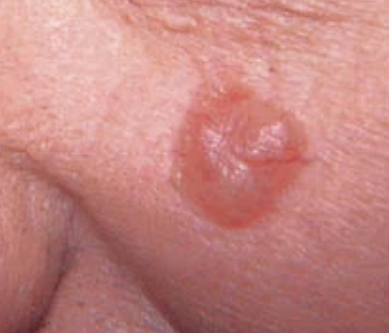
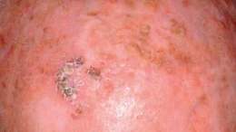
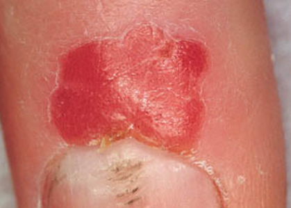
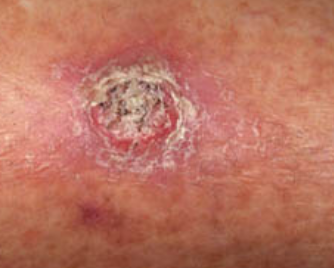
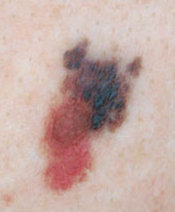
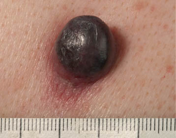
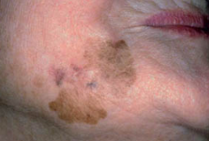

# LESÕES CUTÂNEAS MALIGNAS

Para entender o câncer de pele, você precisa primeiro entender o sol. A radiação ultravioleta é a grande vilã aqui, mas as bancas de residência amam cobrar a diferença entre os tipos de raios. Guarde isso: o **UV-A** penetra profundamente, sendo o principal responsável pelo fotoenvelhecimento (rugas e manchas), enquanto o **UV-B** é mais superficial, causa as queimaduras solares e é o maior culpado direto pelas mutações que levam ao câncer de pele.

Nas provas brasileiras, o tema é dividido em dois grandes grupos: o Câncer de Pele Não Melanoma (CPNM), que inclui o Carcinoma Basocelular e o Carcinoma Espinocelular, e o Melanoma. Vamos dissecar cada um deles com o olhar de quem decide a conduta no consultório e marca o X na questão.

## Carcinoma Basocelular (CBC)

O CBC é o câncer mais comum do ser humano. Se você atender 10 casos de câncer de pele hoje, provavelmente 7 ou 8 serão CBC. A boa notícia, que cai sempre em prova, é que ele tem **baixíssimo potencial metastático**. Ele é localmente invasivo e destrutivo, mas raramente "viaja" para outros órgãos.

### Fisiopatologia e Fatores de Risco

Por que o CBC surge? Ele nasce das células da camada basal da epiderme. O principal fator de risco é a exposição solar **intermitente e intensa** (aquela queimadura solar na infância que fez bolha) em indivíduos de pele clara (Fitzpatrick I e II).

### Quadro Clínico: O que buscar no exame físico?

A descrição clássica de prova para o CBC é: "Pápula ou nódulo de aspecto **perolado** (brilhante), com presença de **telangiectasias** na superfície e, muitas vezes, uma ulceração central".

*Figura 1 - Carcinoma basocelular: observe o aspecto perolado típico e as telangiectasias arboriformes. Fonte: Bolognia, Dermatologia Essencial.*

Existem vários subtipos, mas três caem muito:

- **Nodular-ulcerativo:** É o mais comum. Aquela "feridinha" na face que não cicatriza, sangra ao trauma e tem bordas elevadas e peroladas.

- **Superficial:** Comum no tronco. Parece uma mancha eritemato-escamosa. Cuidado: o aluno desatento confunde com psoríase ou eczema, mas a lesão do CBC superficial é fixa e não responde a corticoides.

- **Esclerodermiforme (ou infiltrativo):** É o "lobo em pele de cordeiro". Parece uma cicatriz plana, esbranquiçada e endurecida. É o subtipo mais agressivo localmente e com maiores taxas de recidiva porque suas margens são mal definidas.

### Diagnóstico e Conduta

O diagnóstico é clínico e dermatoscópico, mas a confirmação é sempre **histopatológica**.

**Dica do Dr. Will:** Se a questão te der uma lesão suspeita na face de um idoso, com bordas peroladas, a conduta inicial é a **biópsia**. Se a lesão for pequena e em área de baixo risco, pode-se fazer a biópsia excisional (já retira tudo). Se for grande ou em área nobre (pálpebra, nariz), faz-se a incisional para planejar a cirurgia.

O tratamento de escolha é a **exérese cirúrgica com margens de segurança**. Para CBCs de baixo risco, margens de 4 mm costumam ser suficientes. Em áreas críticas da face, a Cirurgia Micrográfica de Mohs é o padrão-ouro, pois avalia 100% das margens durante o ato cirúrgico.

**Erro clássico de prova:** A alternativa vai dizer que o tratamento de primeira linha para CBC é quimioterapia sistêmica (como cisplatina). Isso está errado! Quimioterapia quase nunca é usada para CBC, exceto em casos raríssimos de doença metastática ou síndrome do nevo basocelular.

## Carcinoma Espinocelular (CEC)

Se o CBC é o "bonzinho" que só destrói o local, o CEC é o primo mais agressivo. Ele nasce dos queratinócitos da camada espinhosa e **tem potencial de metatização linfonodal**.

### Fatores de Risco e Lesões Precursoras

Diferente do CBC, o CEC está mais ligado à exposição solar **cumulativa** ao longo da vida (o trabalhador rural que tomou sol por 40 anos).

Aqui, as lesões precursoras são fundamentais:

- **Queratose Actínica:** Aquela lesão áspera, "em lixa", em áreas expostas. É um CEC *in situ* incipiente.

- **Doença de Bowen:** É o CEC *in situ* propriamente dito. Uma placa eritematosa bem delimitada. A apresentação mais comum é a de uma mancha eritematosa apesar de haver variantes mais raras pigmentadas ou com descamação.

- **Úlcera de Marjolin:** Grave! É o CEC que surge sobre uma cicatriz de queimadura antiga ou úlcera crônica de perna. Sempre que uma cicatriz antiga começar a ulcerar ou vegetar, você deve biopsiar pensando em CEC.

*Figura 2 - Queratose actínica em couro cabeludo: lesões com base eritematosa e escamas, precursoras do CEC. Fonte: Bolognia, Dermatologia Essencial.*

*Figura 3 - CEC in situ (Doença de Bowen) junto à dobra ungueal: placa eritematosa bem delimitada. Fonte: Bolognia, Dermatologia Essencial.*

### Quadro Clínico

O CEC costuma se apresentar como uma lesão **queratósica, vegetante ou ulcerada**. Ele tem um aspecto mais "sujo" que o CBC, com crostas hemáticas e hiperqueratose (massa de queratina).

*Figura 4 - Carcinoma espinocelular: lesão queratósica com crostas hemáticas. Fonte: Bolognia, Dermatologia Essencial.*

**Cenário de prova:** Paciente tabagista com lesão ulcerada no **lábio inferior**. Isso é CEC até que se prove o contrário. Lembre-se: lábio inferior é CEC (sol + tabaco); lábio superior é mais comum o CBC.

### Tratamento do CEC

A base é a cirurgia. As margens dependem do risco da lesão:

- Baixo risco: Margens de 4 a 6 mm.

- Alto risco (maior que 2cm, invasão perineural, subtipos agressivos): Margens de 10 mm (1 cm).

Diferente do CBC, no CEC precisamos palpar as cadeias linfonodais. Se houver linfonodo suspeito, a investigação com punção ou biópsia é obrigatória.

| Característica | Carcinoma Basocelular (CBC) | Carcinoma Espinocelular (CEC) |
| --- | --- | --- |
| **Origem** | Células basais da epiderme | Queratinócitos (camada espinhosa) |
| **Exposição Solar** | Intermitente / Aguda (queimaduras) | Crônica / Cumulativa |
| **Aspecto Típico** | Pápula perolada com telangiectasias | Placa queratósica, ulcerada ou vegetante |
| **Metástase** | Raríssima | Possível (principalmente linfonodal) |
| **Localização Comum** | Face (acima da linha boca-orelha) | Áreas expostas, lábio inferior, cicatrizes |

## Melanoma Maligno

Este é o tópico que define sua aprovação. O melanoma é o câncer de pele mais letal, derivado dos melanócitos. O segredo aqui é o **diagnóstico precoce**, pois a espessura da lesão (Breslow) dita o prognóstico.

### A Regra do ABCDE

Você deve aplicar isso em toda lesão pigmentada (nevo) suspeita:

- **A**ssimetria: Se traçar uma linha no meio, os dois lados são diferentes.

- **B**ordas irregulares: Limites imprecisos, "geográficos".

- **C**ores variadas: Dois ou mais tons (preto, castanho, azul, branco, vermelho).

- **D**iâmetro: > 6 mm (embora existam melanomas menores, o ponto de corte de prova é 6mm).

- **E**volução: A mudança é o critério mais importante. Cresceu? Mudou de cor? Começou a coçar ou sangrar? Biopsie.

Tente aplicar a regra ABCDE na imagem abaixo:

*Figura 5 - Melanoma extensivo superficial: observe assimetria, bordas irregulares e cores variadas (regra ABCDE). Fonte: Bolognia, Dermatologia Essencial.*

### Subtipos Histológicos

- **Extensivo Superficial (70%):** O mais comum. Cresce horizontalmente (fase radial) antes de aprofundar. Comum em jovens e adultos em dorso (homens) e pernas (mulheres).

- **Nodular:** O mais agressivo. Não tem fase de crescimento radial, já começa crescendo para baixo (fase vertical). É um nódulo enegrecido que invade rápido. Frequentemente não segue o ABCDE clássico.

- **Lentigo Maligno Melanoma:** Idosos, face, pele com muito dano solar. Evolui a partir de uma mancha (Lentigo Maligno) que fica ali por anos.

- **Lentiginoso Acral:** O mais comum em negros e asiáticos. Ocorre nas palmas, plantas e região subungueal.

*Figura 6 - Melanoma nodular: subtipo mais agressivo, já inicia com crescimento vertical. Fonte: Bolognia, Dermatologia Essencial.*

*Figura 7 - Lentigo maligno: mancha pigmentada de crescimento lento em face com dano actínico crônico. Fonte: Bolognia, Dermatologia Essencial.*

**Pegadinha de prova:** "Melanoma só ocorre em quem toma sol". Falso! O subtipo lentiginoso acral não tem relação direta com exposição solar. Se vir uma mancha escura na planta do pé ou uma faixa escura na unha (melanoníquia estriada) que está alargando (sinal de Hutchinson), suspeite de melanoma.

### Diagnóstico: A Biópsia Correta

Aqui o aluno MedEvo não erra: **Lesão pigmentada suspeita de melanoma deve ser submetida a BIÓPSIA EXCISIONAL com margens estreitas (1 a 3 mm).**

Por que não fazer incisional? Porque precisamos do **Índice de Breslow** (medida da espessura da lesão em milímetros, da camada granulosa até a célula tumoral mais profunda). Uma biópsia incisional pode pegar a parte mais fina da lesão e subestimar o problema.

**Exceção:** Lesões muito grandes em face ou áreas acrais onde a exérese total causaria grande mutilação sem diagnóstico confirmado. Nesses casos, a biópsia incisional é aceitável.

### Estadiamento e Conduta (O Índice de Breslow)

O Breslow é o fator prognóstico isolado mais importante. Ele define a margem da ampliação cirúrgica e a necessidade de Pesquisa de Linfonodo Sentinela (PLNS).

| Breslow (Espessura) | Margem de Ampliação | Pesquisa de Linfonodo Sentinela (PLNS) |
| --- | --- | --- |
| *In situ* | 0,5 cm | Não indicada |
| ≤ 1,0 mm | 1,0 cm | Geralmente não (considerar se T1b) |
| 1,01 - 2,0 mm | 1,0 a 2,0 cm | Indicada |
| > 2,0 mm | 2,0 cm | Indicada |

**O que é o T1b?** Segundo a 8ª edição do AJCC, são melanomas com Breslow < 0,8 mm com ulceração OU Breslow entre 0,8 mm e 1,0 mm (com ou sem ulceração). Nesses casos, a PLNS deve ser discutida.

**Linfonodo Sentinela:** Se o sentinela for positivo, o paciente é Estádio III. Antigamente fazíamos esvaziamento ganglionar radical para todo mundo com sentinela positivo. Hoje, após estudos como o MSLT-II, a tendência é a observação com ultrassonografia nodal seriada, reservando o esvaziamento para casos específicos ou recorrências.

## Diagnósticos Diferenciais e Condições Associadas

Muitas vezes a prova coloca o câncer de pele no meio de outras dermatoses. Você precisa saber diferenciar:

- **Queratose Seborreica:** Lesão benigna, com aspecto "ceroso" ou "graxo", parece que foi "colada" na pele. Tem pseudocistos de milium na dermatoscopia. Não é pré-maligna.

- **Nevo de Spitz:** Um nódulo eritematoso ou acastanhado, comum em crianças, de crescimento rápido. Histologicamente pode simular melanoma, mas é benigno.

- **Rosácea:** Eritema facial, telangiectasias e pápulo-pústulas. Diferença do CBC: a rosácea é difusa, simétrica e não tem o brilho perolado localizado.

- **Hanseníase:** Se a questão falar em mancha hipocrômica ou avermelhada com **alteração de sensibilidade** (térmica, dolorosa ou tátil), pare de pensar em câncer e pense em Hanseníase. O teste de sensibilidade é o divisor de águas.

### Situações Especiais: Imunossuprimidos

Pacientes transplantados ou com HIV têm um risco absurdamente maior de CEC (até 65-100 vezes maior que a população geral). Nesses pacientes, o CEC costuma ser muito mais agressivo. Se vir um paciente pós-transplante renal com uma lesão vegetante na mão, marque CEC sem medo.

### Tratamento Adjuvante no Melanoma

Para pacientes com alto risco de recorrência (estádios IIB, IIC e III), hoje utilizamos terapia-alvo (se mutação BRAF positiva, presente em cerca de 50% dos casos) ou imunoterapia (anti-PD1 como Pembrolizumabe ou Nivolumabe). Isso mudou a história da doença, que antes era uma sentença de morte em poucos meses.

## O "Pulo do Gato" na Conduta Cirúrgica

Imagine que você fez a biópsia excisional de uma lesão no dorso e o laudo veio: "Melanoma extensivo superficial, Breslow 1.2 mm, sem ulceração, margens laterais comprometidas".

O que fazer agora?

- **Ampliação de margens:** Como o Breslow é 1.2 mm, a margem final deve ser de 1 a 2 cm. Como você já tirou um pouco na biópsia, você amplia o que falta.

- **Pesquisa de Linfonodo Sentinela:** Como o Breslow é > 1 mm, você deve solicitar a PLNS no mesmo tempo cirúrgico da ampliação.

**Cuidado:** Nunca faça a ampliação de margens ANTES da pesquisa do linfonodo sentinela. A cirurgia de ampliação altera a drenagem linfática local e pode invalidar o teste do sentinela. Os dois procedimentos devem ser feitos juntos.

## Pontos-Chave para Prova

- **CBC:** Mais comum, perolado, telangiectasias, não metastatiza, biópsia para confirmar.

- **CEC:** Sol cumulativo, lábio inferior, cicatrizes (Marjolin), pode dar metástase linfonodal.

- **Melanoma:** Mais letal, regra do ABCDE, Breslow é o principal fator prognóstico.

- **Biópsia no Melanoma:** Sempre **Excisional** com margens de 1-3 mm. Nunca incisional de rotina.

- **Margens Melanoma:** *In situ* (0,5 cm), < 1mm (1 cm), 1-2 mm (1-2 cm), > 2mm (2 cm).

- **Linfonodo Sentinela:** Indicado se Breslow > 1 mm ou se T1b (0,8-1,0 mm ou < 0,8 mm com ulceração).

- **Fator de Risco:** História prévia de câncer de pele aumenta muito o risco de um novo tumor primário.

- **UV-B:** Principal responsável pelo câncer de pele e queimaduras.

- **Queratose Actínica:** Lesão precursora do CEC (CEC *in situ* inicial).

- **Lentiginoso Acral:** Subtipo de melanoma mais comum em negros e asiáticos (palmas, plantas e unhas).

- **Sinal de Hutchinson:** Pigmentação da cutícula/prega ungueal associada à melanoníquia (suspeita de melanoma).

- **Tratamento de escolha:** Para a maioria das lesões malignas cutâneas, é a **exérese cirúrgica**.

- **Líquen Escleroso:** Risco aumentado de CEC de vulva. Tratamento: Corticoide de alta potência (Clobetasol).

- **O que NÃO fazer:** Não tratar lesão pigmentada suspeita com laser ou crioterapia sem antes ter um diagnóstico histopatológico. 🩺

 Cópia offline para consulta pessoal.
 Fonte original:
 [https://www.medevo.com.br/material-apoio/ler/68bba687-db69-47a0-b448-c8f6bc5d1812](https://www.medevo.com.br/material-apoio/ler/68bba687-db69-47a0-b448-c8f6bc5d1812)
