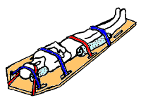
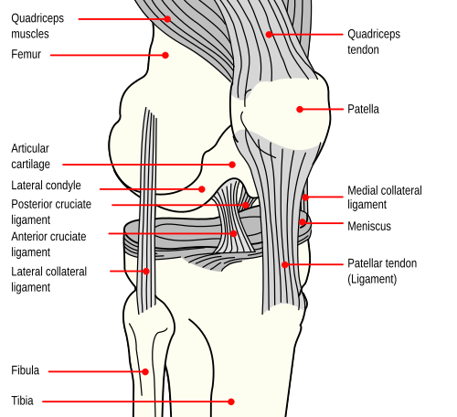

# LESÕES ESPORTIVAS

Entender as lesões esportivas para a residência médica exige que você saia da decoreba e compreenda a biomecânica e a fisiopatologia. As bancas não querem apenas que você saiba o nome da lesão, elas querem que você identifique o perfil do paciente (o corredor, o tenista, a atleta jovem) e saiba quando intervir com exames caros ou quando apenas orientar o repouso funcional. Como o Dr. Will sempre enfatiza em nossas discussões, a clínica soberana aqui economiza recursos e evita iatrogenias.

## Entorse de Tornozelo e as Regras de Ottawa

A entorse de tornozelo é, estatisticamente, a lesão traumática mais comum no esporte. O mecanismo clássico é a inversão com flexão plantar, lesionando o complexo ligamentar lateral (principalmente o ligamento talofibular anterior).

### O Dilema do Raio-X: Regras de Ottawa

O erro mais comum do recém-formado no pronto-socorro é pedir raio-x para todo tornozelo inchado. Isso é má prática e desperdício. Para decidir se o paciente precisa de imagem, usamos as Regras de Ottawa, que têm uma sensibilidade próxima de 100% para detectar fraturas clinicamente significativas.

Você deve solicitar o raio-x apenas se houver:

- Dor na zona do maléolo E um dos seguintes:

- Dor à palpação da borda posterior ou ponta (últimos 6 cm) do maléolo lateral.

- Dor à palpação da borda posterior ou ponta (últimos 6 cm) do maléolo medial.

- Incapacidade de suportar o peso (dar 4 passos) imediatamente após a lesão e no momento do exame.

- Dor na zona do mediopé E um dos seguintes:

- Dor à palpação da base do 5º metatarso (ponto clássico de fratura por avulsão).

- Dor à palpação do osso navicular.

- Incapacidade de suportar o peso (dar 4 passos).

Se o paciente não preenche nenhum desses critérios, a chance de fratura é desprezível. Aqui no MedEvo, reforçamos: se as Regras de Ottawa são negativas, a conduta é conservadora e sem imagem.

*Figura 1 - Imobilização em prancha rígida: medida de primeiro socorro fundamental em lesões esportivas com suspeita de lesão cervical ou vertebral. Fonte: Christophe Dang Ngoc Chan, CC BY-SA 3.0 | Wikimedia Commons*

## Manejo e Tratamento

Esqueça o gesso circular para entorses simples. A diretriz atual recomenda o tratamento funcional. Por que? Porque a imobilização prolongada causa atrofia muscular, rigidez articular e perda de propriocepção, aumentando o risco de novas entorses.

A conduta inicial baseia-se no protocolo de proteção, repouso relativo, gelo, compressão e elevação. O uso de Anti-inflamatórios Não Esteroidais (AINEs) é indicado por curto período (3 a 5 dias) para controle da dor e do edema, mas cuidado: o uso excessivo pode, teoricamente, interferir na fase inicial da cicatrização ligamentar.

## Rabdomiólise por Esforço e Mioglobinúria

Este é um tema "quente" em provas, pois conecta a medicina esportiva com a nefrologia. A rabdomiólise ocorre quando há uma lesão maciça do músculo esquelético, liberando conteúdo intracelular na circulação.

### Fisiopatologia e Diagnóstico

O gatilho costuma ser um esforço físico extenuante, muitas vezes em ambientes quentes (golpe de calor) ou em indivíduos descondicionados que realizam exercícios excêntricos intensos. A lise do miócito libera potássio, fosfato, creatina quinase (CK) e, crucialmente, mioglobina.

A pegadinha clássica de prova é a urina avermelhada ou cor de "chá mate". O exame de urina (fita reagente) virá positivo para "sangue/hemoglobina", mas a microscopia revelará ausência de hemácias. Por que isso acontece? Porque a fita reage com o grupo heme da mioglobina, mas como não há sangramento glomerular ou do trato urinário, não existem glóbulos vermelhos no sedimento.

O diagnóstico é confirmado pela CK sérica. Valores acima de 5 vezes o limite superior da normalidade (geralmente > 1.000 U/L) definem a rabdomiólise, mas em casos graves, vemos valores de 50.000 ou 100.000 U/L.

### Complicações e Manejo

A principal complicação é a Insuficiência Renal Aguda (IRA). A mioglobina é nefrotóxica por três mecanismos:

- Vasoconstrição renal.

- Formação de cilindros intratubulares (obstrução).

- Toxicidade direta por radicais livres.

O tratamento é hidratação agressiva. O objetivo é manter um débito urinário alto (200 a 300 ml/h) para "lavar" os túbulos renais. A solução de escolha é o Soro Fisiológico 0,9%. A alcalinização da urina com bicarbonato de sódio é descrita para evitar a precipitação da mioglobina, mas só deve ser considerada se o pH urinário estiver baixo e não houver hipocalcemia severa.

| Parâmetro | Rabdomiólise | Hematúria (Glomerular) |
| --- | --- | --- |
| Cor da Urina | Vermelho-escura / Castanha | Avermelhada |
| Fita Reagente (Sangue) | Positiva | Positiva |
| Sedimentoscopia | 0 a 2 hemácias por campo | Muitas hemácias / Dismorfismo |
| CK Sérica | Muito elevada | Normal |
| Causa Comum | Exercício intenso / Trauma | Glomerulonefrite / Cálculo |

## Tríade da Atleta Feminina e RED-S

A Tríade da Atleta Feminina é um distúrbio que afeta mulheres jovens, especialmente em esportes que enfatizam a magreza (balé, ginástica, corrida de fundo). Recentemente, o conceito foi expandido para RED-S (Deficiência Energética Relativa no Esporte), pois afeta também homens e impacta outros sistemas além do reprodutor e ósseo.

### Os Três Pilares

- Baixa Disponibilidade Energética: É a causa raiz. A atleta consome menos calorias do que gasta no treino. Não precisa necessariamente de um transtorno alimentar (anorexia/bulimia), pode ser apenas um erro de planejamento nutricional.

- Disfunção Menstrual: A baixa energia inibe o eixo hipotálamo-hipófise-gonadal, levando à Amenorreia Hipotalâmica Funcional (redução de GnRH, LH e FSH).

- Baixa Densidade Mineral Óssea (DMO): A deficiência estrogênica simula uma "menopausa precoce", impedindo o pico de massa óssea ou causando perda óssea acelerada.

*Figura 2 - Diagrama anatômico do joelho: os ligamentos cruzados (LCA e LCP), colaterais e meniscos são as estruturas mais frequentemente lesionadas em atividades esportivas. Fonte: Mysid, Domínio Público | Wikimedia Commons*

## Diagnóstico e Tratamento

Suspeite sempre que uma atleta jovem apresentar fraturas de estresse de repetição. O diagnóstico de baixa DMO em atletas é feito pelo Z-score na densitometria óssea (Z-score < -2,0 é o critério para baixa massa óssea para a idade).

O tratamento de primeira escolha é o ajuste da balança energética: aumentar a ingestão calórica e, se necessário, reduzir a carga de treinos. A reposição estrogênica com Contraceptivos Hormonais Combinados (CHC) pode ser usada para proteger o osso e regularizar o ciclo, mas atenção: o CHC não trata a causa base (o déficit de energia) e pode mascarar a persistência do problema.

## Lombalgia no Atleta: Do Jovem ao Idoso

A dor lombar é uma queixa onipresente. Nas provas, o segredo é diferenciar a dor mecânica comum das patologias específicas.

### O Atleta Jovem, Alto e Magro

Um cenário clássico de prova: adolescente, alto, em fase de estirão de crescimento, queixando-se de dor lombar crônica. Aqui, a investigação deve focar em vícios posturais e desequilíbrios musculares. O crescimento ósseo rápido muitas vezes não é acompanhado pelo alongamento muscular (especialmente de isquiotibiais), gerando uma tração excessiva na pelve e coluna lombar. O tratamento é conservador: correção postural, fortalecimento de core e alongamento.

### Hérnia Discal e o Teste de Lasègue

Quando a dor lombar irradia para o membro inferior (ciatalgia), pensamos em compressão radicular. O Teste de Elevação da Perna Reta (Lasègue) é fundamental.

- Como fazer: Paciente em decúbito dorsal, o examinador eleva a perna estendida.

- Positivo: Dor lancinante que irradia abaixo do joelho quando a perna está entre 30 e 70 graus.

- Se a dor ocorrer apenas acima de 70 graus, é provável que seja apenas encurtamento de isquiotibiais, não compressão nervosa.

Erro clássico de prova: Indicar ressonância magnética (RM) na primeira semana de uma lombalgia aguda sem sinais de alerta. Mesmo com Lasègue positivo, se o exame neurológico for normal (força e reflexos preservados), a conduta inicial é conservadora (analgesia e manter-se ativo). 90% das hérnias discais melhoram sem cirurgia em 4 a 6 semanas.

### Sinais de Alerta (Red Flags) na Lombalgia

Você só pede imagem imediata se houver:

- Trauma significativo.

- Perda de peso inexplicada ou histórico de câncer.

- Febre ou uso de drogas IV (suspeita de discite/abscesso).

- Déficit neurológico focal e progressivo (perda de força real).

- Síndrome da cauda equina (anestesia em sela, incontinência urinária/fecal).

## Epicondilites: O Cotovelo no Esporte

As epicondilites não são inflamações agudas, mas sim tendinoses (processos degenerativos por microtraumas).

- Epicondilite Lateral (Cotovelo de Tenista): É a mais comum. Afeta os tendões extensores do punho (principalmente o extensor radial curto do carpo). A dor piora com a extensão resistida do punho.

- Epicondilite Medial (Cotovelo de Golfista): Afeta os tendões flexores do punho e o pronador redondo, que se inserem no epicôndilo medial. A dor piora com a flexão resistida do punho e a pronação.

O tratamento para ambas é predominantemente conservador: modificação do gesto esportivo, fisioterapia para fortalecimento excêntrico e, em casos refratários, infiltrações ou ondas de choque.

## Fascite Plantar

Causa número um de dor plantar em corredores. A fisiopatologia envolve microtraumas na fáscia plantar, uma estrutura que sustenta o arco longitudinal do pé.

### Quadro Clínico

A dor é clássica: pior ao dar os primeiros passos pela manhã ou após longos períodos sentado. Por que? Porque durante o repouso a fáscia encurta; ao pisar, ela sofre um estiramento súbito. No exame físico, a dor é desencadeada pela palpação do tubérculo medial do calcâneo e exacerbada pela dorsiflexão do hálux (Mecanismo de Windlass).

O diagnóstico é clínico. Exames de imagem como o raio-x podem mostrar um esporão de calcâneo, mas cuidado: o esporão é um achado incidental em muitos pacientes assintomáticos e não é a causa da dor. O tratamento envolve alongamento da cadeia posterior, uso de palmilhas e, raramente, cirurgia.

## Saúde do Trabalhador: DORT e Notificação

Muitas lesões esportivas mimetizam doenças ocupacionais. Quando uma lesão (como uma epicondilite ou síndrome do túnel do carpo) é causada ou agravada pelo trabalho, ela entra na categoria de LER/DORT (Lesões por Esforços Repetitivos / Distúrbios Osteomusculares Relacionados ao Trabalho).

Ponto fundamental para o SUS: A suspeita de DORT exige notificação compulsória. Segundo a Portaria GM/MS Nº 5.201 de 2024, as doenças relacionadas ao trabalho devem ser notificadas no SINAN (Sistema de Informação de Agravos de Notificação). Isso é vital para a vigilância epidemiológica e para o planejamento de políticas de saúde pública. Se a questão de prova mencionar um trabalhador com quadro de tendinopatia crônica, a alternativa correta frequentemente passará pela notificação ao sistema de saúde.

## Distúrbios do Movimento e Parkinsonismo

A medicina esportiva também cruza com a neurologia no estudo de traumas cranianos repetitivos e distúrbios do movimento.

### Parkinsonismo e Bradicinesia

O Parkinsonismo é um distúrbio hipocinético caracterizado pela tríade: bradicinesia (lentidão do movimento), tremor de repouso e rigidez em roda dentada. No contexto esportivo, pode estar associado à Encefalopatia Traumática Crônica (comum em boxeadores). A bradicinesia é o sintoma cardinal; sem ela, você não fecha o diagnóstico clínico de síndrome parkinsoniana.

### Distonia Focal Ocupacional

Diferente do Parkinsonismo, a distonia é um distúrbio hipercinético. A distonia focal ocupacional (como a "cãibra do escrivão" ou a distonia do músico/atleta) é uma contração muscular involuntária e sustentada que ocorre apenas durante uma tarefa específica. No esporte, isso pode arruinar a carreira de um golfista ou de um arremessador, pois o cérebro "perde o controle" do gesto motor refinado.

## Emergências Térmicas: O Golpe de Calor

O exercício intenso em condições de alta temperatura e umidade pode levar ao Golpe de Calor (Heat Stroke), uma emergência médica com alta mortalidade.

### Critérios Diagnósticos

- Hipertermia grave: Temperatura central > 40°C.

- Disfunção do Sistema Nervoso Central: Desorientação, confusão mental, convulsões ou coma.

Diferencie da Exaustão pelo Calor, onde o paciente está suando muito, tem náuseas e tontura, mas o estado mental está preservado e a temperatura não atinge níveis tão críticos. No Golpe de Calor, a pele pode estar seca (falha na termorregulação).

O tratamento é o resfriamento imediato e agressivo. A imersão em água gelada é o método mais eficaz. Não espere chegar ao hospital para iniciar o resfriamento; cada minuto de hipertermia aumenta o risco de falência múltipla de órgãos e rabdomiólise severa.

## Pontos-Chave para Prova

- Regras de Ottawa: Use para excluir raio-x no tornozelo. Palpar bordas posteriores dos maléolos (6 cm), base do 5º metatarso e navicular.

- Rabdomiólise: Suspeite com urina escura + fita reagente positiva para sangue + zero hemácias na microscopia.

- CK Sérica: Valor > 5x o normal confirma rabdomiólise. O principal risco é a IRA por mioglobinúria.

- Hidratação na Rabdomiólise: Alvo de débito urinário de 200 a 300 ml/h com SF 0,9%.

- Tríade da Atleta: Baixa energia, amenorreia e baixa DMO (Z-score < -2,0). Causa fraturas de estresse.

- Tratamento da Tríade: Primeiro passo é o ajuste nutricional (aumento de calorias).

- Lombalgia Aguda: Sem red flags, não peça imagem. 90% melhoram em 4 a 6 semanas com tratamento conservador.

- Teste de Lasègue: Positivo se dor irradiada entre 30 e 70 graus de elevação da perna.

- Epicondilite Lateral: Cotovelo de tenista (extensores). Medial: Cotovelo de golfista (flexores).

- Fascite Plantar: Dor matinal ao primeiro passo. Diagnóstico clínico (Mecanismo de Windlass).

- DORT: Notificação compulsória ao SINAN é obrigatória para vigilância em saúde do trabalhador.

- Parkinsonismo: Síndrome hipocinética (bradicinesia é obrigatória).

- Golpe de Calor: Temperatura > 40°C + alteração do nível de consciência. Emergência médica.

- Contraindicação Absoluta: Não use AINEs em pacientes com insuficiência renal aguda estabelecida por rabdomiólise.

- Erro Comum: Achar que esporão de calcâneo é a causa da fascite plantar (é apenas um marcador de estresse crônico).

- Primeira Escolha no Tornozelo: Tratamento funcional (mobilização precoce com proteção) é superior ao gesso.

 Cópia offline para consulta pessoal.
 Fonte original:
 [https://www.medevo.com.br/material-apoio/ler/4541006e-f703-48bc-8a14-a4b7bdd82705](https://www.medevo.com.br/material-apoio/ler/4541006e-f703-48bc-8a14-a4b7bdd82705)
