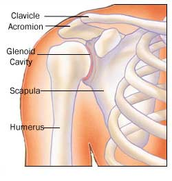

# LESÕES LIGAMENTARES

Para entender lesões ligamentares e tendíneas, você precisa primeiro diferenciar as estruturas. O ligamento une osso a osso e serve como um estabilizador estático. O tendão une músculo a osso e transmite força. Nas provas de residência, as bancas adoram misturar esses conceitos, especialmente no ombro e no joelho. Vamos começar pelo ombro, que é, disparado, o tema mais cobrado dentro da ortopedia para o clínico e o residente.

*Figura 1 - Anatomia do manguito rotador: composto por supraespinal, infraespinal, redondo menor e subescapular. A lesão do supraespinal é a mais cobrada em provas de residência. Fonte: AidMyRotatorCuff.com, Atribuição | Wikimedia Commons*

## O Complexo do Ombro e o Manguito Rotador

O ombro não é uma articulação simples; é um complexo. Quando falamos de "lesões ligamentares" no ombro, quase sempre a prova está se referindo, na verdade, às lesões do manguito rotador e às instabilidades.

### Anatomia Funcional: O Manguito Rotador

O manguito rotador é composto por quatro músculos. Você precisa decorar a função de cada um, pois a prova vai te dar a perda de um movimento e pedir o músculo lesionado.

- **Supraespinhal:** É o "queridinho" das provas. Sua função é a abdução do braço (especialmente os primeiros 30 graus). É o tendão mais comumente lesionado na Síndrome do Impacto.

- **Infraespinhal:** Realiza a rotação externa.

- **Redondo Menor:** Também realiza rotação externa (ajuda o infraespinhal).

- **Subescapular:** É o único que fica na parte anterior da escápula. Sua função é a **rotação interna**.

**Dica de Prova:** Se a questão descreve um paciente com "limitação da rotação interna", não pense duas vezes: a lesão é no Subescapular. Se a dor é na abdução, pense em Supraespinhal.

### Síndrome do Impacto e Tendinopatias

Por que o manguito rotador inflama tanto? Por causa do espaço subacromial. O tendão do supraespinhal passa em um "túnel" entre a cabeça do úmero e o acrômio. Se esse espaço diminui (por um acrômio ganchoso ou osteófitos), o tendão sofre atrito.

O diagnóstico da Síndrome do Impacto é **eminentemente clínico**. Guarde isso: a diretriz da SBOT e as questões de prova reforçam que você não precisa de ressonância magnética (RM) para iniciar o tratamento conservador. Se o paciente tem dor ao elevar o braço e os testes de impacto são positivos, o diagnóstico está feito.

### Exame Físico do Ombro: As Manobras que Caem

Aqui é onde o aluno se perde, mas o Dr. Will sempre lembra: foque no que a manobra testa.

- **Teste de Neer:** O examinador eleva passivamente o braço do paciente em rotação interna. Se doer, indica impacto subacromial.

- **Teste de Hawkins:** O braço é flexionado a 90° e o examinador realiza uma rotação interna passiva brusca. Positivo se houver dor.

- **Teste de Yokum:** O paciente coloca a mão no ombro oposto e tenta elevar o cotovelo contra resistência.

- **Teste de Jobe:** Avalia especificamente o **Supraespinhal**. O braço é colocado em abdução de 90° e rotação interna (polegar para baixo), e o paciente resiste à pressão do examinador.

- **Teste de Patte:** Avalia o Infraespinhal (rotação externa resistida).

- **Teste de Gerber (Lift-off test):** Avalia o Subescapular. O paciente coloca a mão nas costas (região lombar) e tenta afastá-la. Se não conseguir, o subescapular "já era".

**Pérola Clínica:** Se o paciente tem dor, testes de impacto positivos (Neer/Hawkins), mas a **força está preservada**, o diagnóstico é Tendinopatia. Se houver **perda de força**, suspeite de Ruptura do Manguito Rotador.

### Tendinite da Cabeça Longa do Bíceps

O tendão da cabeça longa do bíceps passa pelo **sulco intertubercular** (ou corredeira bicipital). A dor aqui é anterior.

- **Teste de Yergason:** Cotovelo a 90°, o paciente tenta fazer supinação contra resistência. Se doer no sulco, é tendinite bicipital.

- **Teste de Speed (Palm-up):** Braço estendido e palma para cima, o paciente eleva o braço contra resistência.

| Músculo | Função Principal | Teste Principal |
| --- | --- | --- |
| Supraespinhal | Abdução | Jobe |
| Infraespinhal | Rotação Externa | Patte |
| Subescapular | Rotação Interna | Gerber / Lift-off |
| Redondo Menor | Rotação Externa | Hornblower |

## Lesões Ligamentares e Meniscais do Joelho

No joelho, a prova quer saber se você sabe diferenciar uma lesão de ligamento cruzado de uma lesão de menisco. O mecanismo de trauma é a chave.

### Ligamento Cruzado Anterior (LCA)

O LCA é o principal restritor da translação anterior da tíbia.

- **Mecanismo:** Entorse com o pé fixo no chão (valgo + rotação externa). O paciente ouve um "estalo" (pop) e o joelho incha rápido (hemartrose).

- **Exame Físico:**

- **Teste da Gaveta Anterior:** Joelho a 90°, puxa-se a tíbia para frente.

- **Teste de Lachman:** O mais sensível. Joelho a 20-30°, puxa-se a tíbia para frente.

- **Pivot-Shift:** Avalia a instabilidade rotacional.

**Por que operar o LCA?** Não é apenas para o atleta voltar a jogar. Operamos para evitar que o joelho fique "frouxo" e acabe destruindo os meniscos e gerando artrose precoce. Em pacientes jovens e ativos, a reconstrução cirúrgica é a primeira escolha.

### Ligamento Cruzado Posterior (LCP)

O LCP evita a translação posterior da tíbia.

- **Mecanismo:** Trauma direto na parte anterior da tíbia com o joelho flexionado (clássico "trauma no painel" em acidentes de carro).

- **Exame Físico:** **Teste da Gaveta Posterior** (deslocamento posterior da tíbia a 90°). Outro sinal é o "Recurvatum" do joelho.

### Lesões Meniscais

Os meniscos (medial e lateral) servem para amortecer carga e estabilizar o joelho.

- **Quadro Clínico:** Dor na interlinha articular, episódios de "bloqueio" (o joelho trava) e derrame articular tardio (diferente do LCA, que é imediato).

- **Exame Físico:**

- **Teste de McMurray:** Flexão e extensão do joelho com rotação. Se houver estalido e dor, é positivo.

- **Teste de Appley:** Paciente em decúbito ventral, joelho a 90°, compressão e rotação.

**A Zona Vermelha-Vermelha:** Isso cai muito! O menisco é avascular em seus 2/3 internos (zona branca). Apenas a periferia é vascularizada (zona vermelha).

- **Sutura Meniscal:** Só fazemos se a lesão for na **zona vermelha-vermelha** (onde tem sangue para cicatrizar) e em pacientes jovens. Se for na zona branca, o tratamento é a meniscectomia parcial (retirar o pedaço lesionado), pois ali não cicatriza.

## Tornozelo e Pé

A lesão ligamentar mais comum do corpo humano é a entorse de tornozelo em **inversão**.

### Anatomia do Tornozelo

O complexo ligamentar lateral é o mais afetado:

- Ligamento Talofibular Anterior (o primeiro a romper).

- Ligamento Calcanheofibular.

- Ligamento Talofibular Posterior.

### Tendinopatia do Tibial Posterior

O músculo tibial posterior tem origem na face posterior da tíbia e fíbula e se insere no navicular e cuneiformes. Ele é o principal sustentador do arco plantar medial.

- **Falha do Tibial Posterior:** Leva ao "pé chato" adquirido no adulto. O paciente não consegue ficar na ponta do pé (Single Heel Rise Test).

## Saúde do Trabalhador: LER/DORT e Doenças Ocupacionais

Este bloco é fundamental para as provas de Medicina Preventiva e Social, mas com base na Ortopedia. No MedEvo, tratamos isso com o rigor que as bancas exigem.

### Definições Importantes

- **LER (Lesão por Esforço Repetitivo):** Termo clínico para lesões causadas por uso excessivo.

- **DORT (Distúrbio Osteomuscular Relacionado ao Trabalho):** Termo mais amplo que inclui sobrecarga não apenas por repetição, mas por postura e carga.

- **CAT (Comunicação de Acidente de Trabalho):** Se você suspeita que a lesão do paciente (ex: uma tendinite de manguito rotador em um pintor) é ocupacional, o médico **deve** emitir o relatório detalhado e a empresa deve abrir a CAT. Se a empresa não abrir, o próprio médico ou o sindicato podem fazê-lo.

### Síndrome Dolorosa Miofascial

Muitas vezes confundida com fibromialgia, mas a diferença é crucial:

- **Pontos Gatilho (Trigger Points):** São pontos localizados em uma **banda tensa** de músculo. Ao pressionar, a dor é referida (vai para longe) e reproduz o sintoma do paciente.

- **Tratamento:** Liberação miofascial, agulhamento a seco (dry needling) ou infiltração local.

### Tenossinovite de De Quervain

É a inflamação do 1º compartimento extensor do punho (Abdutor Longo do Polegar e Extensor Curto do Polegar).

- **Fator de Risco:** Movimentos repetitivos do polegar (uso de tesouras, digitar muito no celular, segurar bebês).

- **Teste de Finkelstein:** O paciente fecha a mão com o polegar "escondido" dentro dos dedos e o examinador faz um desvio ulnar do punho. Se doer muito no estiloide do rádio, é positivo.

## Segurança do Paciente e Protocolo de Cirurgia Segura

Erros de lateralidade (operar o joelho esquerdo sendo que o problema era no direito) são considerados "Never Events" – eventos que nunca deveriam ocorrer.

- **Demarcação do Sítio Cirúrgico:** Deve ser feita com o paciente acordado, antes de entrar na sala de cirurgia.

- **Time-out:** Pausa obrigatória antes da incisão cutânea para confirmar: paciente, procedimento, local, materiais e se há alergias.

- **Checklist da OMS:** Reduz drasticamente a morbimortalidade.

| Etapa | Quando ocorre? | O que checar? |
| --- | --- | --- |
| Sign-in | Antes da indução anestésica | Identificação, sítio, consentimento, oxímetro |
| Time-out | Antes da incisão cutânea | Confirmar equipe, paciente, local, antibiótico |
| Sign-out | Antes do paciente sair da sala | Contagem de compressas, rotulagem de biópsia |

*Figura 2 - Anatomia do joelho: LCA, LCP, ligamentos colaterais e meniscos. O teste de Lachman e a gaveta anterior avaliam a integridade do LCA, a lesão ligamentar mais frequente em provas. Fonte: Mysid, Domínio Público | Wikimedia Commons*

## Diagnóstico Diferencial da Dor no Ombro

Muitos alunos erram questões por não considerarem diagnósticos fora do manguito rotador.

- **Capsulite Adesiva (Ombro Congelado):** Perda de movimentos **ativos e passivos**. Na tendinite, o paciente não consegue mexer (ativo), mas se você mexer para ele (passivo), o braço vai. Na capsulite, o ombro está "travado" de verdade. Comum em diabéticos e mulheres de meia-idade.

- **Cervicobraquialgia:** Dor que irradia para além do cotovelo, com parestesia (formigamento). A dor do manguito rotador geralmente para no deltoide.

- **Instabilidade Anterior:** Comum em jovens após luxação. O teste é o da **Apreensão** (colocar o braço em posição de arremesso e o paciente sentir que vai descolar).

## Tratamento Geral das Lesões Ligamentares

### Fase Aguda (Protocolo PEACE & LOVE)

Esqueça o antigo RICE (Rest, Ice, Compression, Elevation). A tendência atual foca na reabilitação precoce.

- **Proteção:** Evitar atividades que causem dor nos primeiros 1-3 dias.

- **Elevação:** Acima do nível do coração.

- **Evitar Anti-inflamatórios (AINEs):** Cuidado aqui! A diretriz sugere evitar AINEs em altas doses na fase inicial (primeiras 48h) de lesões ligamentares puras, pois a inflamação faz parte da cicatrização inicial. Use analgésicos simples.

- **Compressão:** Para controle do edema.

- **Educação:** Ensinar o paciente sobre a lesão.

**Após a fase aguda:**

- **Load (Carga):** Retorno gradual às atividades assim que a dor permitir.

- **Optimism (Otimismo):** Fator psicológico influencia o prognóstico.

- **Vascularização:** Exercícios aeróbicos para aumentar o aporte sanguíneo.

- **Exercise (Exercício):** O pilar principal para recuperar força e propriocepção.

### Tratamento Farmacológico

- **Analgésicos:** Paracetamol (500mg-1g até 6/6h) ou Dipirona (500mg-1g até 6/6h).

- **AINEs (se necessário após 48h):** Ibuprofeno 600mg 8/8h ou Naproxeno 500mg 12/12h por 5 a 7 dias. **Contraindicação absoluta:** Insuficiência renal grave, úlcera péptica ativa, alergia severa.

- **Infiltração com Corticoide:** Pode ser considerada na Síndrome do Impacto refratária, mas **nunca** deve ser feita diretamente dentro do tendão (risco de ruptura), apenas no espaço bursa/subacromial.

## Pontos-Chave para Prova 🦴

- **Manguito Rotador:** Composto por Supraespinhal, Infraespinhal, Subescapular e Redondo Menor.

- **Subescapular:** Principal rotador interno. Lesão = Teste de Gerber positivo.

- **Supraespinhal:** Mais lesionado. Dor na abdução e Teste de Jobe positivo.

- **Síndrome do Impacto:** Diagnóstico clínico. Neer e Hawkins são os testes de "impacto".

- **Teste de Yergason:** Avalia tendinite da cabeça longa do bíceps no sulco intertubercular.

- **LCA:** Trauma com estalo + hemartrose imediata + Gaveta Anterior/Lachman positivos.

- **LCP:** Trauma no painel do carro + Gaveta Posterior positiva.

- **Menisco:** Dor na interlinha + bloqueio articular + McMurray positivo.

- **Sutura Meniscal:** Indicada para lesão longitudinal na **zona vermelha-vermelha** em pacientes jovens.

- **De Quervain:** Tenossinovite do 1º compartimento extensor. Teste de Finkelstein positivo.

- **LER/DORT:** Se houver nexo causal com o trabalho, emitir relatório e abrir CAT.

- **Síndrome Miofascial:** Presença de pontos gatilho em banda tensa com dor referida.

- **Cirurgia Segura:** Demarcação do sítio deve ser feita com o paciente acordado. O "Time-out" ocorre antes da incisão.

- **Erro de Lateralidade:** É um "Never Event". A prevenção principal é a demarcação e o checklist.

- **Tibial Posterior:** Sua insuficiência causa pé chato adquirido. Inserção principal no navicular.

- **Pegadinha de Prova:** A questão dirá que o paciente tem dor no ombro e a RM mostra "tendinopatia leve". Se ele tiver perda de força importante, a RM pode estar subestimando ou o diagnóstico é outro (como ruptura completa). O exame físico manda!

- **O que NÃO fazer:** Não solicitar RM de rotina para todo ombro doloroso antes de tentar tratamento conservador por 4-6 semanas (exceto em traumas agudos com perda de força).

- **Contraindicação de AINE:** Idosos com DRC (ClCr < 30) ou história de sangramento digestivo alto sem proteção.

 Cópia offline para consulta pessoal.
 Fonte original:
 [https://www.medevo.com.br/material-apoio/ler/894bb7d0-1118-4fcb-8ba4-f5b9579bfcff](https://www.medevo.com.br/material-apoio/ler/894bb7d0-1118-4fcb-8ba4-f5b9579bfcff)
