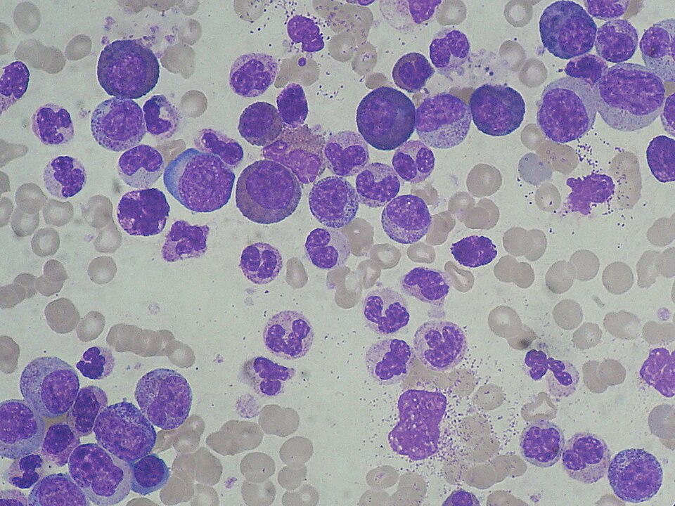
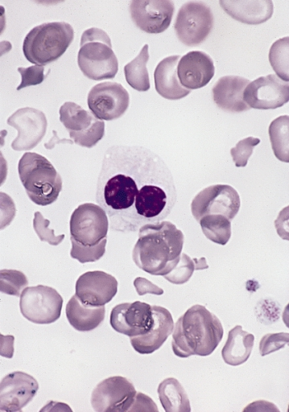

# LEUCEMIAS

Para entender as leucemias, você precisa parar de tentar decorar nomes de genes e começar a enxergar a medula óssea como uma fábrica. Imagine que essa fábrica tem duas linhas de produção principais: a linha mieloide (que faz hemácias, plaquetas e a "polícia" granulocítica) e a linha linfoide (que faz os linfócitos).

A leucemia acontece quando um desses operários sofre uma mutação, para de trabalhar e começa a se multiplicar loucamente, ocupando o espaço de quem quer produzir. Se esse erro ocorre em uma célula muito jovem (o blasto), temos uma **Leucemia Aguda**. Se ocorre em uma célula que já sabe trabalhar um pouco, mas é imortal e preguiçosa, temos uma **Leucemia Crônica**.

## O Raciocínio Diagnóstico Inicial

Quando você atende um paciente com suspeita de leucemia, o hemograma é o seu primeiro mapa. Mas cuidado: o hemograma não dá o diagnóstico definitivo, ele levanta a suspeita.

A primeira pergunta que você deve se fazer é: "A medula está falhando ou está trabalhando demais?".

- Se o paciente tem anemia, plaquetopenia e leucócitos variáveis (muitas vezes com blastos), pense em **Aguda**. A fábrica parou porque foi invadida por "bandidos" jovens.

- Se o paciente tem uma leucocitose absurda (100.000, 200.000), mas com células que parecem maduras, pense em **Crônica**. A fábrica está produzindo demais, mas de forma errada.

*Figura 1 - Comparação morfológica entre leucemia linfoblástica aguda (LLA, esquerda) e leucemia mieloide aguda (LMA, direita), útil para reconhecer diferenças entre blastos de linhagens distintas. Fonte: Makysm, CC0 | Wikimedia Commons*

## Leucemias Agudas: A Invasão dos Blastos

Nas leucemias agudas, o tempo é seu inimigo. O conceito fundamental aqui é o **hiato leucêmico**. Você verá células muito jovens (blastos) e células maduras, mas faltam as células intermediárias. Por que isso cai em prova? Porque diferencia da Leucemia Mieloide Crônica, onde você vê o "desvio à esquerda escalonado" (todas as etapas da maturação).

### Leucemia Mieloide Aguda (LMA)

A LMA é a leucemia aguda mais comum no adulto. O critério diagnóstico padrão-ouro, segundo a classificação da OMS e as diretrizes brasileiras, é a presença de **≥ 20% de blastos** na medula óssea ou no sangue periférico.

**O detalhe que salva vidas (e acerta questões):** Se você encontrar **bastonetes de Auer** no citoplasma do blasto, pense em linhagem mieloide. No contexto típico de leucemia aguda em prova, isso favorece fortemente LMA e não LLA. Se a banca colocar uma imagem ou descrever essa estrutura em "forma de agulha", marque mieloide sem medo.

#### Subtipos e a "Queridinha" das Provas: LMA M3 (Promielocítica)

A Leucemia Promielocítica Aguda (LPA) é o subtipo M3 da classificação antiga (FAB), mas que ainda é muito cobrada pelo seu comportamento único. Ela envolve a translocação **t(15;17)**, gerando o gene de fusão **PML-RARα**.

Por que você precisa saber isso? Porque a LPA causa uma **coagulopatia grave (CIVD)**. O paciente sangra e coagula ao mesmo tempo.

- **Conduta de prova:** Viu um paciente com blastos e CIVD? Inicie imediatamente o **ATRA (Ácido Transretinoico)**, antes mesmo de sair o resultado da citogenética. O ATRA "obriga" o blasto a amadurecer. Isso reduz drasticamente a mortalidade precoce por sangramento intracraniano.

#### Citogenética e Prognóstico na LMA

Aqui é onde o Dr. Will sempre reforça: a citogenética é o fator prognóstico mais importante.

- **Bom prognóstico:** t(15;17), t(8;21), inv(16).

- **Mau prognóstico:** Cariótipo complexo, mutação **FLT3-ITD**.

- **O "pulo do gato":** Se o paciente tem cariótipo normal, olhe para as mutações moleculares. NPM1 isolada é bom. FLT3 é ruim.

### Leucemia Linfoide Aguda (LLA)

A LLA é o câncer mais comum da infância, com pico entre **2 e 5 anos**. Se a prova trouxer uma criança com dor óssea (que muitos confundem com "dor de crescimento" ou febre reumática), linfonodomegalias e hepatoesplenomegalia, pense em LLA.

**Fatores de Prognóstico na LLA:**

- **Favoráveis:** Idade entre 1 e 9 anos, leucometria inicial baixa (< 50.000) e **hiperdiploidia** (> 50 cromossomos).

- **Desfavoráveis:** < 1 ano ou > 10 anos, leucometria > 50.000, e a presença do **Cromossomo Philadelphia t(9;22)**.

Sim, o Philadelphia pode aparecer na LLA (cerca de 25% dos adultos e 3% das crianças) e, ao contrário da LMC, aqui ele indica um prognóstico muito ruim.

### Tabela 1: Diferenciação das Leucemias Agudas

| Característica | LMA | LLA |
| --- | --- | --- |
| Idade comum | Adultos (média 65 anos) | Crianças (2-5 anos) |
| Morfologia | Bastonetes de Auer presentes | Ausência de bastonetes |
| Imunofenotipagem | CD13, CD33, CD117, MPO | CD10 (CALLA), CD19, CD20 (B) ou CD3, CD7 (T) |
| Clínica marcante | CIVD (na M3), infiltração gengival (M4/M5) | Dor óssea, massa mediastinal (células T), infiltração de SNC e testículo |

## Leucemias Crônicas: A Proliferação Desenfreada

Aqui a fábrica não parou. Ela está produzindo demais, mas os produtos são defeituosos ou simplesmente não morrem.

### Leucemia Mieloide Crônica (LMC)

A LMC é uma doença mieloproliferativa. O marco é a translocação **t(9;22)**, que cria o gene **BCR-ABL1**. Esse gene produz uma proteína com atividade tirosina-quinase permanentemente ligada, mandando a célula se dividir sem parar.

**O quadro clínico clássico de prova:**
Paciente de meia-idade, assintomático ou com sintomas B (febre, suor noturno, perda de peso) e uma **esplenomegalia gigantesca**. No hemograma: leucocitose extrema (> 100.000), desvio à esquerda completo (desde o blasto até o segmentado), e algo que é "carimbo" de LMC: **Basofilia e Eosinofilia**.

*Figura 2 - Leucemia mieloide crônica (LMC): leucocitose acentuada com desvio à esquerda da série granulocítica. Fonte: Paulo Henrique Orlandi Mourao, CC BY-SA 3.0 | Wikimedia Commons*

**Diagnóstico Diferencial:** Reação Leucemoide (causada por infecções graves).
Como diferenciar? Na LMC, a **Fosfatase Alcalina Leucocitária (FAL)** está **baixa**. Na reação leucemoide, a FAL está alta (os neutrófilos são normais e funcionantes). Além disso, a LMC tem o cromossomo Philadelphia.

**Tratamento:** Mudou a história da oncologia. Usamos os **Inibidores de Tirosina-Quinase (ITK)**, como o **Imatinibe**.

- **Atenção:** O Imatinibe é a primeira escolha. Se o paciente falhar ou tiver efeitos colaterais, usamos Nilotinibe ou Dasatinibe.

- **Cuidado de prova:** O Nilotinibe está associado a um risco aumentado de eventos vasculares oclusivos. Se o paciente infartar usando Nilotinibe, a conduta é suspender ou trocar o ITK.

### Leucemia Linfocítica Crônica (LLC)

A LLC é a leucemia do idoso. É um acúmulo de linfócitos B maduros que não sofrem apoptose.

**O diagnóstico é feito no sangue periférico:**

- Linfocitose persistente > 5.000/mm³.

- Imunofenotipagem mostrando clonalidade: **CD19+, CD20+ (marcadores B) E CD5+ (marcador T)**.
*Espere, CD5 em célula B?* Sim! Esse é o segredo da LLC na imunofenotipagem. Se tiver CD23+ também, o diagnóstico está selado.

No esfregaço de sangue, você verá as **Manchas de Gumprecht** (linfócitos que se rompem ao serem colocados na lâmina por serem muito frágeis).

**Quando tratar a LLC?**
Diferente das outras, na LLC a conduta inicial para o paciente assintomático (estágios precoces de Rai ou Binet) é **observar e esperar (watch and wait)**. Tratar precocemente não aumenta a sobrevida.
Tratamos apenas se houver:

- Sintomas B constitucionais.

- Anemia ou plaquetopenia progressiva (estágios avançados).

- Esplenomegalia ou linfonodomegalia volumosa/sintomática.

- Tempo de duplicação dos linfócitos < 6 meses.

### Tabela 2: Estadiamento de Binet (LLC) - Muito comum em provas

| Estágio | Definição | Prognóstico |
| --- | --- | --- |
| A | < 3 áreas linfoides acometidas | Sobrevida > 10 anos |
| B | ≥ 3 áreas linfoides acometidas | Sobrevida ~ 5 anos |
| C | Anemia (Hb < 10) ou Plaquetopenia (< 100k) | Sobrevida ~ 2 anos |

*Áreas linfoides: Cervical, axilar, inguinal, baço e fígado.*

## Outras Neoplasias Hematológicas Importantes

### Leucemia de Células Pilosas (Hairy Cell Leukemia)

É uma leucemia de linfócitos B com projeções citoplasmáticas (parecem "cabelos").

- **A tríade de prova:** Homem idoso + Esplenomegalia maciça + **Pancitopenia** (especialmente monocitopenia).

- O aspirado de medula costuma ser seco (fibrose).

- Tratamento: Cladribina (excelente resposta).

### Leucemia-Linfoma de Células T do Adulto (ATLL)

Causada pelo vírus **HTLV-1**. É muito comum no Japão e no Nordeste do Brasil.

- **Quadro:** Lesões cutâneas, linfonodomegalia, hepatoesplenomegalia e **Hipercalcemia grave**.

- O linfócito tem o núcleo em aspecto de "trevo" ou "flor".

- Prognóstico da forma aguda é muito ruim.

### Síndrome Mielodisplásica (SMD)

*Figura 3 - Neutrófilo hipogranular com núcleo pseudo-Pelger-Huët em síndrome mielodisplásica. Fonte: AFIP/PEIR Digital Library, domínio público | Wikimedia Commons*

Não é uma leucemia propriamente dita, mas uma "pré-leucemia". A medula é rica em células (hipercelular), mas elas são defeituosas (displásicas) e morrem antes de sair para o sangue.

- **Paciente:** Idoso com pancitopenia e macrocitose.

- **Risco:** Evolução para LMA (quando os blastos passam de 20%).

- **Tratamento de baixo risco:** Suporte transfusional e **Lenalidomida** (especialmente se houver a deleção 5q-).

## Complicações e Emergências Oncológicas

Como professor, eu te digo: as bancas amam ver se você sabe manejar o paciente crítico.

### Síndrome de Lise Tumoral (SLT)

Ocorre geralmente após o início da quimioterapia em tumores de alta rotatividade (LLA, Linfoma de Burkitt). A célula explode e libera tudo o que tem dentro.

- **Laboratório:** ↑ Ácido Úrico, ↑ Potássio, ↑ Fosfato e **↓ Cálcio** (o fosfato "sequestra" o cálcio).

- **Prevenção:** Hidratação vigorosa e Alopurinol (ou Rasburicase se alto risco).

### Neutropenia Febril

Definição: Neutrófilos < 500/mm³ + febre (uma medida axilar > 38.3°C ou > 38.0°C por mais de 1 hora).

- **Conduta:** É uma emergência médica. Colha culturas e inicie **Antibiótico IV de amplo espectro (Cefepime)** na primeira hora. Não espere exames de imagem.

- Se o paciente não melhorar em 4-7 dias, pense em cobertura para fungos (Anfotericina B ou Caspofungina).

### Síndrome de Leucostase

Ocorre quando os leucócitos estão tão altos (> 100.000 na LMA) que o sangue "engrossa" (hiperviscosidade).

- **Sintomas:** Dispneia (infiltrado pulmonar) e alteração neurológica (cefaleia, sonolência).

- **Tratamento:** Hidratação e Citoferese (leucoaférese) de urgência. **Evite transfusão de hemácias** antes de baixar os leucócitos, pois isso aumenta ainda mais a viscosidade.

## Diagnóstico Diferencial de Linfocitose

Muitos alunos erram ao achar que toda linfocitose é leucemia. No MedEvo, sempre ensinamos a olhar a idade e o aspecto da célula.

- **Linfocitose com atipia:** Pense em causas virais (Mononucleose, CMV, Toxoplasmose).

- **Linfocitose sem atipia (células maduras):**

- Criança: Coqueluche (pode dar 50.000 linfócitos!).

- Idoso: LLC.

- **Reação Leucemoide:** Geralmente é neutrofílica, com granulações tóxicas e vacúolos citoplasmáticos, FAL elevada.

## Transplante de Medula Óssea (TMO)

O TMO alogênico (de um doador) é a única terapia curativa para muitas leucemias agudas de alto risco e para a LMC que falhou aos ITKs.

- **DECH (Doença do Enxerto Contra o Hospedeiro):** Ocorre quando os linfócitos do doador atacam o receptor.

- **DECH Aguda:** Pele (rash/eritrodermia), Fígado (icterícia/colestase) e TGI (diarreia volumosa).

## Pontos-Chave para Prova 🎯

- **Critério LMA:** ≥ 20% de blastos na medula óssea.

- **Bastonetes de Auer:** Patognomônico de linhagem mieloide (LMA).

- **LMA M3 (LPA):** t(15;17), risco de CIVD, tratamento com ATRA.

- **LMC:** t(9;22), gene BCR-ABL1, esplenomegalia gigante, basofilia, FAL baixa.

- **Tratamento LMC:** Imatinibe (Inibidor de Tirosina-Quinase).

- **LLC:** Idoso, linfocitose > 5.000, CD5+, CD19+, CD23+, Manchas de Gumprecht.

- **Conduta LLC:** Observação se assintomático (estágios iniciais).

- **LLA:** Câncer mais comum na infância, dor óssea, risco de infiltração de SNC e testículos.

- **Síndrome de Lise Tumoral:** ↑ K, ↑ P, ↑ Ácido Úrico e ↓ Ca.

- **Neutropenia Febril:** Cefepime IV imediato (cobrir *Pseudomonas*).

- **Hairy Cell Leukemia:** Pancitopenia + Esplenomegalia + Monocitopenia.

- **ATLL:** HTLV-1, hipercalcemia, linfócitos em "trevo".

- **Pegadinha:** O cromossomo Philadelphia na LMC é bom (tem tratamento alvo), na LLA é fator de mau prognóstico.

- **Erro comum:** Transfundir hemácias em paciente com leucostase extrema antes de baixar a leucometria (risco de estase vascular fatal).

- **Esplenectomizados:** Risco de sepse por germes encapsulados (*S. pneumoniae, H. influenzae, N. meningitidis*). Vacinação é obrigatória.

- **Mutação JAK2:** Associada a Policitemia Vera e Trombocitemia Essencial, não é o marco da LMC (que é o BCR-ABL).

 Cópia offline para consulta pessoal.
 Fonte original:
 [https://www.medevo.com.br/material-apoio/ler/7ed94822-3b1f-46c5-a62f-8a351716c567](https://www.medevo.com.br/material-apoio/ler/7ed94822-3b1f-46c5-a62f-8a351716c567)
