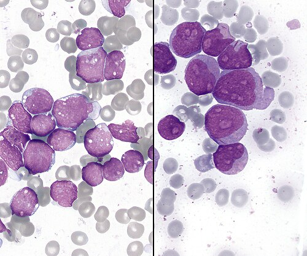
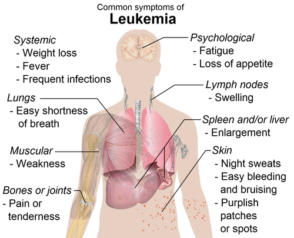

# LEUCEMIAS

Para entender as leucemias na pediatria, você precisa parar de ver o hemograma como apenas um conjunto de números e começar a enxergá-lo como o reflexo de uma "fábrica" que entrou em colapso. A medula óssea é essa fábrica. Nas leucemias agudas, o que acontece é uma falha catastrófica na linha de produção: uma única célula jovem, o blasto, sofre uma mutação, para de amadurecer e começa a se multiplicar descontroladamente.

O grande problema é que esses blastos não trabalham, eles apenas ocupam espaço. Eles "expulsam" os trabalhadores legítimos (hemácias, plaquetas e leucócitos maduros). É por isso que o paciente chega para você com palidez, sangramento e febre. Não é que o corpo parou de querer produzir sangue, é que a fábrica foi invadida por "invasores" que não deixam mais ninguém trabalhar.

## Epidemiologia e Fatores de Risco

A Leucemia Linfoide Aguda (LLA) é o câncer mais comum da infância e adolescência, representando cerca de 30% de todas as neoplasias pediátricas. Se uma questão de prova perguntar qual o câncer mais prevalente nessa faixa etária, não hesite: é a LLA. Ela tem um pico de incidência muito claro entre os 2 e 5 anos de idade.

Já a Leucemia Mieloide Aguda (LMA) é menos comum na criança (cerca de 15 a 20% das leucemias agudas), mas ganha importância em adolescentes e em certas condições genéticas.

### O fator de risco clássico: Síndrome de Down

Aqui está a primeira grande dica de prova: crianças com Síndrome de Down têm um risco absurdamente maior de desenvolver leucemia. Nos primeiros 5 anos de vida, se uma criança com Down apresentar febre, palidez, sangramentos e esplenomegalia, o diagnóstico é leucemia aguda até que se prove o contrário.

Curiosidade que cai em prova: nos primeiros 3 anos, o Down tem mais risco de LMA (especialmente o subtipo M7, a megacariocítica). Após os 5 anos, o risco maior passa a ser de LLA, igualando-se à tendência da população geral, mas ainda com incidência aumentada.

### Outras condições associadas

Além do Down, guarde estes nomes: Ataxia-telangiectasia, Síndrome de Li-Fraumeni e Anemia de Fanconi. São condições de instabilidade genética que predispõem ao surgimento de clones malignos. Se a questão citar um paciente com ataxia, telangiectasias oculares e agora uma massa mediastinal, pense em LLA de linhagem T.

*Figura 1 - Esfregaço de sangue periférico com blastos leucêmicos (LLA vs LMA). Fonte: Makysm, CC0 | Wikimedia Commons*

## Fisiopatologia: Ocupação de Espaço e Infiltração

Por que a criança sente dor óssea? Imagine a medula óssea, que fica dentro de uma cavidade rígida (o osso), sendo preenchida por bilhões de blastos em ritmo acelerado. A pressão intramedular aumenta. Isso gera a dor óssea clássica, muitas vezes noturna, que pode ser confundida com "dor de crescimento" ou artrite reumatoide juvenil.

Cuidado: a dor da leucemia costuma ser metafisária e pode causar edema articular, mas a palidez e as petéquias associadas devem te desviar do diagnóstico de reumatologia. No MedEvo, sempre reforçamos que a dor óssea que acorda a criança à noite ou que a impede de deambular é um sinal de alerta vermelho para malignidade.

Além da ocupação da medula (falência medular), os blastos caem na circulação e infiltram órgãos. É por isso que encontramos:

- Hepatoesplenomegalia (o fígado e o baço tentam retomar a hematopoese ou são apenas infiltrados).

- Linfonodomegalia (infiltração do sistema reticuloendotelial).

- Infiltração do SNC e testículos (são os chamados "santuários", onde a quimioterapia comum tem dificuldade de chegar).

## Quadro Clínico: O que as bancas cobram

O quadro clínico é uma combinação de falência medular e infiltração tecidual.

### Sinais de Falência Medular

- Anemia: Palidez, cansaço, prostração.

- Trombocitopenia: Petéquias, equimoses, sangramento gengival ou epistaxe.

- Neutropenia: Febre de origem indeterminada, infecções de repetição ou estomatites graves.

### Sinais de Infiltração

- Dor óssea: Presente em grande parte dos casos. Na radiografia, podemos ver a "rarefação metafisária" ou bandas leucêmicas (linhas radiotransparentes na metáfise).

- Linfonodomegalia: Geralmente indolor, de consistência firme. Atenção total ao linfonodo supraclavicular; ele quase nunca é reacional, quase sempre é malignidade.

- Visceromegalias: Hepatoesplenomegalia é um achado clássico.

### O Diferencial do Neuroblastoma

Essa é a pegadinha favorita das bancas. O Neuroblastoma também causa dor óssea, febre e palidez (por infiltração medular). Como diferenciar?
O Neuroblastoma costuma se manifestar como uma massa abdominal que cruza a linha média (diferente do Tumor de Wilms, que geralmente não cruza). Além disso, o Neuroblastoma tem a famosa "equimose periorbitária" (olhos de guaxinim) e proptose, devido às metástases orbitárias. Se a questão falar em massa abdominal + equimose periorbitária + dor óssea em uma criança pequena, marque Neuroblastoma. Se falar em pancitopenia franca com blastos, é Leucemia.

*Figura 2 - Diagrama dos sintomas comuns da leucemia em crianças. Fonte: Mikael Häggström, Domínio Público | Wikimedia Commons*

## Diagnóstico Laboratorial

O primeiro exame é sempre o Hemograma. Mas cuidado: o hemograma da leucemia é traiçoeiro.

- Leucócitos: Podem estar aumentados (leucocitose extrema, às vezes > 100.000), normais ou até diminuídos (leucopenia).

- Blastos: Podem aparecer no sangue periférico, mas a ausência de blastos no hemograma NÃO exclui leucemia (é a chamada leucemia aleucêmica).

- Plaquetas e Hemoglobina: Quase sempre baixas (pancitopenia).

### O Padrão-Ouro: Mielograma

Para fechar o diagnóstico, precisamos olhar a fábrica. O diagnóstico de Leucemia Aguda exige a presença de 20% ou mais de blastos na medula óssea.

Uma vez identificado o blasto, precisamos saber o "nome e sobrenome" dele. Para isso, usamos a Imunofenotipagem (Citometria de Fluxo). É aqui que definimos se a leucemia é LLA ou LMA.

| Marcador | Linhagem | Significado para a Prova |
| --- | --- | --- |
| CD10, CD19, CD20, CD22 | Linfoide B | LLA-B é a mais comum (80-85% das LLA) |
| CD3, CD7, CD5 | Linfoide T | LLA-T (15%), comum em adolescentes, massa mediastinal |
| TdT | Linfoide (geral) | Marcador de imaturidade linfoide |
| Mieloperoxidase (MPO), CD33, CD13 | Mieloide | Sugere LMA |

Dr. Will costuma lembrar: se a questão mencionar "Bastonetes de Auer" no citoplasma do blasto, o diagnóstico é LMA. Isso é patognomônico.

### Diagnóstico Diferencial de Adenomegalias e Visceromegalias

Nem tudo que brilha é ouro, e nem toda febre com baço aumentado é leucemia.

- Mononucleose Infecciosa: Tem febre, faringite e linfonodomegalia. O hemograma mostra linfocitose com atipia linfocitária (linfócitos atípicos não são blastos!).

- Leishmaniose Visceral (Calazar): Febre prolongada, hepatoesplenomegalia maciça e pancitopenia. Em áreas endêmicas, é o principal diferencial. O diagnóstico é feito pelo mielograma, mas buscando o amastigota da Leishmania, não blastos.

- Artrite Reumatoide Juvenil (forma sistêmica): Febre diária, rash cutâneo e artralgia. Mas aqui costuma haver leucocitose com neutrofilia e trombocitose (marcadores de inflamação), enquanto na leucemia temos citopenias.

## Emergências Oncológicas

Você não pode ir para a prova sem saber manejar as complicações agudas. Elas matam o paciente antes mesmo da primeira dose de quimioterapia fazer efeito.

### Síndrome de Lise Tumoral (SLT)

Ocorre quando há uma destruição maciça de células tumorais (espontânea ou pós-quimio), liberando o conteúdo intracelular no sangue.
A tríade metabólica (que vira quarteto com o cálcio) é:

- Hipercalemia (Potássio sai da célula).

- Hiperfosfatemia (Fosfato sai da célula).

- Hiperuricemia (Ácido úrico da quebra do DNA).

- Hipocalcemia (O cálcio se liga ao excesso de fosfato e precipita, baixando no sangue).

Cuidado: a banca vai dizer que a SLT causa hipocalemia ou hipofosfatemia para te enganar. Lembre-se: tudo sobe, exceto o cálcio, que cai.
O tratamento baseia-se em hiperidratação venosa (2 a 3 litros/m²/dia) e uso de alopurinol ou rasburicase (para reduzir o ácido úrico).

### Neutropenia Febril

Criança em tratamento oncológico com febre (tax ≥ 38.3°C uma vez ou ≥ 38.0°C por mais de 1 hora) e neutrófilos < 500/mm³.
Isso é uma emergência médica. A conduta é: colher culturas e iniciar antibiótico de amplo espectro (geralmente uma cefalosporina antipseudomonas, como o Cefepime) na primeira hora. Não espere exames de imagem para começar o ATB.

### Leucostase

Quando os leucócitos estão acima de 100.000/mm³, o sangue fica "viscoso". Isso pode causar infartos orgânicos, especialmente no SNC (AVC) e pulmão (insuficiência respiratória). É mais comum na LMA.

## Classificação e Prognóstico na LLA

Nem toda LLA é igual. Algumas curam em 90% dos casos, outras são muito agressivas. As bancas amam os fatores de bom e mau prognóstico.

| Fator | Bom Prognóstico | Mau Prognóstico |
| --- | --- | --- |
| Idade | 1 a 9 anos | < 1 ano (lactentes) ou ≥ 10 anos |
| Leucometria Inicial | < 50.000/mm³ | > 50.000/mm³ |
| Linhagem | Linfoide B | Linfoide T ou Mieloide |
| Citogenética | Hiperdiploidia (>50 cromossomos) | Hipodiploidia ou Cromossomo Philadelphia t(9;22) |
| Resposta à Terapia | Rápida (D7 ou D14) | Lenta (presença de Doença Residual Mínima) |

O gene BCR-ABL (Cromossomo Philadelphia) é o clássico da LMC no adulto, mas quando aparece na LLA infantil, confere um prognóstico muito reservado e indica o uso de inibidores da tirosina quinase (como o Imatinibe).

## Tratamento: Uma Maratona, não um Sprint

O tratamento da leucemia pediátrica é longo, durando cerca de 2 a 3 anos. Ele é dividido em fases:

- Indução de Remissão: O objetivo é "limpar" a medula, reduzindo os blastos a menos de 5% (remissão morfológica). Dura cerca de 4 semanas. É a fase de maior risco de Síndrome de Lise Tumoral.

- Consolidação/Intensificação: Para eliminar as células residuais que a indução não pegou.

- Profilaxia de SNC: Como a maioria das drogas não cruza a barreira hematoencefálica, fazemos quimioterapia intratecal (metotrexato, citarabina e dexametasona) para evitar que o SNC vire um refúgio para os blastos.

- Manutenção: Fase longa, com doses menores de quimio oral e venosa, para garantir que a doença não volte.

Por que fazemos quimioterapia intratecal em quase todos os pacientes, mesmo sem sintomas neurológicos? Porque a infiltração do SNC é muitas vezes subclínica no início, e se não tratarmos preventivamente, a recaída no SNC é quase certa.

## Outras Neoplasias Abdominais (Diferencial Importante)

Como as questões de leucemia muitas vezes trazem massas abdominais no diferencial, vamos organizar o pensamento:

### Tumor de Wilms (Nefroblastoma)

- Criança de 2 a 4 anos.

- Massa abdominal lisa, firme, que NÃO cruza a linha média (respeita o flanco).

- Pode ter hematúria (25%) e hipertensão (pela compressão da artéria renal e ativação do sistema renina-angiotensina).

- Frequentemente descoberto pela mãe durante o banho.

### Neuroblastoma

- Criança mais jovem (muitas vezes < 2 anos).

- Massa abdominal de contornos irregulares que CRUZA a linha média.

- Frequentemente associado a sintomas sistêmicos (febre, perda de peso) e dor óssea.

- Marcador urinário: Catecolaminas urinárias (VMA/HVA) elevadas.

## Particularidades da LLA de Linhagem T

A LLA-T merece um parágrafo à parte. Ela costuma ocorrer em adolescentes do sexo masculino. O quadro clínico clássico de prova é: um adolescente com uma grande massa no mediastino anterior/médio, que pode causar Síndrome da Veia Cava Superior (edema de face, pescoço e turgência jugular) ou desconforto respiratório.
No laboratório, costumam ter hiperleucocitose. Os marcadores na citometria são CD3 e CD7. Lembre-se: T de Tímico, T de T-cell, T de "Teenager" (adolescente) e T de Tórax (massa mediastinal).

## Resumo de Condutas em Situações Especiais

- Suspeita de Lise Tumoral: Hidratação vigorosa + Alopurinol. Se ácido úrico muito alto ou insuficiência renal, considerar Rasburicase.

- Hipercalemia na SLT: Gluconato de cálcio (para estabilizar o miocárdio, mas cuidado se o fósforo estiver muito alto pelo risco de precipitação), glicoinsulinoterapia, beta-2 agonista e, se refratário, diálise.

- Massa Mediastinal com Insuficiência Respiratória: Evitar sedação profunda (risco de colapso das vias aéreas). O tratamento definitivo é iniciar a quimioterapia ou corticoterapia o mais rápido possível para reduzir o volume do tumor.

## Diagnóstico Diferencial de Pancitopenia

Quando você encontrar uma criança com anemia, leucopenia e plaquetopenia, seu cérebro deve ativar três caminhos:

- Infiltração Medular: Leucemia (blastos), Neuroblastoma (metástase), Linfoma.

- Falência Medular (Aplasia): Anemia de Fanconi, Aplasia de Medula idiopática, Pós-viral (Hepatite). Aqui a medula está "vazia", não "invadida".

- Destruição Periférica/Sequestro: Hiperesplenismo (por hipertensão portal ou doenças de depósito), Lúpus Eritematoso Sistêmico (LES).

A biópsia de medula óssea é o que vai diferenciar se a medula está cheia de blastos (Leucemia) ou deserta (Aplasia).

## Pontos-Chave para Prova

- LLA é o câncer mais comum da infância; pico entre 2 e 5 anos.

- Diagnóstico de Leucemia Aguda: ≥ 20% de blastos no mielograma.

- Síndrome de Down: Risco aumentado de LMA (especialmente M7) nos primeiros 3 anos e LLA após os 5 anos.

- Tríade da Falência Medular: Palidez (anemia), Febre/Infecção (neutropenia), Sangramento/Petéquias (trombocitopenia).

- Dor óssea na leucemia: Frequentemente noturna, pode apresentar rarefação metafisária no RX.

- Síndrome de Lise Tumoral: ↑ Potássio, ↑ Fosfato, ↑ Ácido Úrico e ↓ Cálcio.

- LLA-T: Comum em adolescentes, associada a massa mediastinal e hiperleucocitose.

- Marcadores Linfoide B: CD10 (CALLA), CD19, CD20.

- Marcadores Linfoide T: CD3, CD7.

- Marcador de Imaturidade: TdT (positivo em quase todas as LLA).

- Bastonetes de Auer: Patognomônico de LMA.

- Fatores de Mau Prognóstico na LLA: Idade < 1 ano ou > 10 anos; Leucócitos > 50.000 ao diagnóstico; t(9;22) - Cromossomo Philadelphia.

- Neuroblastoma vs. Wilms: Neuroblastoma cruza a linha média e pode ter equimose periorbitária; Wilms não cruza a linha média e é uma massa lisa.

- Neutropenia Febril: Emergência! Antibiótico venoso (Cefepime) na primeira hora após culturas.

- Linfonodo Supraclavicular: Sempre investigar, alta suspeição de malignidade.

- O que NÃO fazer: Não retardar o início do antibiótico na neutropenia febril esperando o resultado do hemograma ou RX de tórax. 🩺

 Cópia offline para consulta pessoal.
 Fonte original:
 [https://www.medevo.com.br/material-apoio/ler/ad75014f-9bdc-466b-a18b-c27f7e231df5](https://www.medevo.com.br/material-apoio/ler/ad75014f-9bdc-466b-a18b-c27f7e231df5)
