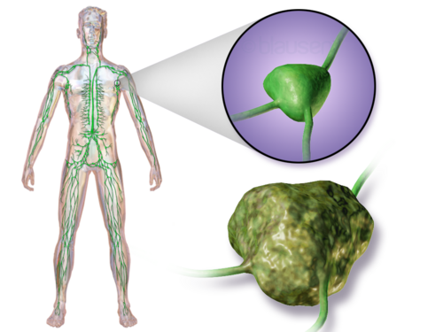
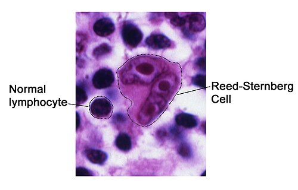

# LINFOMAS

Se você quer dominar a Hematologia para as provas de residência, precisa entender que os linfomas não são apenas "câncer no linfonodo". Eles são uma aula de fisiopatologia aplicada. Como professor, já vi muitos alunos travarem tentando decorar dezenas de subtipos da OMS. Esqueça isso. O segredo aqui é separar o joio do trigo: **Hodgkin vs. Não Hodgkin**.

Neste material, vamos dissecar o que realmente cai, focando no porquê de cada conduta. Na prática das provas, o examinador não quer saber apenas se você decorou o livro; ele quer saber se você sabe o que fazer quando um paciente jovem chega com uma massa mediastinal e tosse seca.

## O Conceito Fundamental: O que é um Linfoma?

Diferente das leucemias, que são neoplasias "líquidas" (da medula e sangue), os linfomas são neoplasias "sólidas" do sistema linfático. Eles surgem de um linfócito que, em algum momento da sua maturação no linfonodo, sofreu uma mutação e decidiu se proliferar sem controle.

**Por que isso importa?** Porque a apresentação clínica reflete onde esse linfócito "mora". Se ele mora no linfonodo, teremos adenomegalia. Se ele mora no baço, esplenomegalia. Se ele decide invadir o estômago (como no MALT), teremos sintomas dispépticos.

*Figura 1 - Ilustração de linfonodos afetados em linfoma. Fonte: BruceBlaus, CC BY 3.0 | Wikimedia Commons*

## Diagnóstico: A Regra de Ouro

Aqui está o primeiro erro que reprova: marcar "PAAF" (Punção Aspirativa por Agulha Fina) como exame diagnóstico.
**Cuidado:** A PAAF serve para citologia (ver células soltas). Para diagnosticar linfoma, precisamos da **arquitetura do linfonodo**.

A conduta correta é sempre a **Biópsia Excisional** (retirar o linfonodo inteiro). Se a banca oferecer "biópsia por agulha grossa" (core biopsy), ela só é aceitável se o linfonodo for inacessível cirurgicamente, mas o padrão-ouro absoluto é a excisional.

## Linfoma de Hodgkin (LH)

O Linfoma de Hodgkin é muito cobrado porque tem uma epidemiologia bimodal (jovens de 15-30 anos e idosos >55 anos) e um marco histopatológico clássico: a **Célula de Reed-Sternberg**. Ela é característica do linfoma de Hodgkin clássico, mas células semelhantes podem aparecer em outros contextos; por isso, o diagnóstico depende da morfologia, da imunohistoquímica e do contexto clínico.

### A Fisiopatologia do "Olho de Coruja"

A célula de Reed-Sternberg (RS) é um linfócito B que deu errado. Ela é gigante, multinucleada e parece um "olho de coruja". Mas aqui vai o detalhe técnico: no LH, a massa tumoral é composta por apenas 1% a 5% de células RS. O resto é um infiltrado inflamatório (linfócitos reativos, eosinófilos, plasmócitos) que a própria célula RS recruta.

**Ponto-chave:** A imuno-histoquímica clássica do LH é **CD30+ e CD15+**. Ela costuma ser **CD45-** (diferente dos outros linfomas).

### Subtipos Clássicos

- **Esclerose Nodular (70-80%):** O mais comum. Atente para o perfil: mulher jovem com massa mediastinal. É o que mais cai.

- **Celularidade Mista:** Associado ao EBV e HIV. Comum em idosos.

- **Rico em Linfócitos:** Melhor prognóstico.

- **Depleção Linfocítica:** Pior prognóstico, comum em pacientes com HIV avançado.

*Figura 2 - Célula de Reed-Sternberg comparada com linfócitos normais, achado clássico do Linfoma de Hodgkin. Fonte: National Cancer Institute, Domínio Público | Wikimedia Commons*

## Quadro Clínico e o Prurido "Maldito"

O paciente clássico tem uma linfonodomegalia cervical ou supraclavicular indolor, de consistência elástica.
**Pérola Clínica:** A **dor linfonodal após ingestão de álcool** é rara, mas se a questão citar isso, é Linfoma de Hodgkin até que se prove o contrário.

Além disso, temos os **Sintomas B**:

- Febre (> 38°C) persistente.

- Sudorese noturna (aquela de precisar trocar o pijama).

- Perda de peso (> 10% do peso corporal em 6 meses).

**Atenção:** O prurido no LH pode ser intenso e precede o diagnóstico em meses, mas ele **não** é considerado um sintoma B para fins de estadiamento.

## Linfomas Não Hodgkin (LNH)

Aqui o grupo é heterogêneo. Para a prova, divida-os pela agressividade. A estratégia terapêutica muda completamente conforme o "ritmo" da doença.

### 1. Linfomas Indolentes (Ex: Folicular)

Crescem devagar. O paciente pode ter linfonodos que aumentam e diminuem sozinhos por anos.

- **Paradoxo:** São incuráveis na maioria dos casos avançados, mas o paciente vive muito tempo.

- **Conduta:** Se o paciente estiver assintomático, a conduta pode ser apenas observação (*Watch and Wait*). Só tratamos se houver sintomas, citopenias ou ameaça a órgãos.

### 2. Linfomas Agressivos (Ex: Difuso de Grandes Células B - LDGCB)

É o LNH mais comum no mundo.

- **Comportamento:** Cresce rápido, mata rápido se não tratar, mas **é curável**.

- **Tratamento Padrão:** Esquema **R-CHOP** (Rituximabe + Ciclofosfamida + Doxorrubicina + Vincristina + Prednisona).

### 3. Linfomas Altamente Agressivos (Ex: Burkitt)

O campeão de velocidade. Tem o maior índice de proliferação celular (Ki-67 próximo a 100%).

- **Histologia:** Aspecto de **"Céu Estrelado"** (macrófagos fagocitando restos celulares em meio a um mar de linfócitos azuis).

- **Associação:** EBV e translocação t(8;14).

### Tabela 1: Diferenças Cruciais entre LH e LNH

| Característica | Linfoma de Hodgkin (LH) | Linfoma Não Hodgkin (LNH) |
| --- | --- | --- |
| **Célula Típica** | Reed-Sternberg (RS) | Linfócitos B ou T malignos |
| **Disseminação** | Por contiguidade (ordenada) | Hematogênica (errática/imprevisível) |
| **Acometimento Extranodal** | Raro | Comum (TGI, pele, SNC) |
| **Anel de Waldeyer/Mesentério** | Raramente envolvidos | Frequentemente envolvidos |
| **Idade** | Bimodal (jovens e idosos) | Aumenta com a idade |

## Estadiamento: O Sistema de Ann Arbor (Modificado por Cotswolds)

Você precisa saber isso de cor. O estadiamento define se o paciente vai fazer só quimioterapia ou rádio associada.

- **Estágio I:** Uma única região linfonodal ou um único órgão extranodal (IE).

- **Estágio II:** Duas ou mais regiões linfonodais do **mesmo lado** do diafragma.

- **Estágio III:** Regiões linfonodais em **ambos os lados** do diafragma.

- **Estágio IV:** Envolvimento difuso de órgãos extranodais (medula óssea, fígado, pulmão).

**Sufixos Importantes:**

- **A:** Sem sintomas B.

- **B:** Com sintomas B (Febre, sudorese, perda de peso).

- **X:** Doença volumosa (*Bulky*) -> Massa > 10 cm ou > 1/3 do diâmetro do tórax.

**Exemplo Clínico:** Paciente com linfonodo cervical esquerdo e inguinal direito. Qual o estágio? **Estágio III** (lados opostos do diafragma). Se tiver febre, é **IIIB**.

## Situações Especiais: O que as Bancas Amam

### 1. Linfoma MALT Gástrico e H. pylori

Este é o tema de hematologia que mais cai em provas de Gastroenterologia. O Linfoma MALT (Tecido Linfoide Associado à Mucosa) é um linfoma de zona marginal.

- **O "Pulo do Gato":** Ele é causado pelo estímulo antigênico crônico da bactéria *Helicobacter pylori*.

- **Tratamento:** Se for de baixo grau e localizado, o tratamento inicial é a **erradicação do H. pylori** com antibióticos e IBP. Sim, você trata um câncer com antibiótico! Se a bactéria morrer, o estímulo acaba e o linfoma regride em até 80% dos casos.

### 2. PTLD (Doença Linfoproliferativa Pós-Transplante)

Ocorre em pacientes transplantados (órgãos sólidos ou medula) devido à imunossupressão crônica.

- **Vilão:** Vírus Epstein-Barr (EBV). Sem linfócitos T para vigiar, o EBV faz a festa nos linfócitos B.

- **Conduta:** A primeira medida é tentar **reduzir a imunossupressão** (se o órgão transplantado permitir). Se não resolver, usa-se Rituximabe.

### 3. Síndrome de Sjögren

Pacientes com Sjögren têm um risco **44 vezes maior** de desenvolver LNH (geralmente MALT de parótida ou LDGCB). Se o paciente com Sjögren apresentar aumento súbito de parótida ou linfonodomegalia, biópsia nele!

### Tabela 2: Marcadores de Imuno-histoquímica

| Tipo de Linfoma | Marcadores Principais |
| --- | --- |
| **Hodgkin Clássico** | CD30+, CD15+, CD45- |
| **Linfoma de Células B (Geral)** | CD20+, CD19+ |
| **Linfoma Folicular** | CD10+, Bcl-2+ (t 14;18) |
| **Linfoma de Células do Manto** | Ciclina D1+ (t 11;14) |
| **Linfoma de Burkitt** | CD10+, c-Myc+ (t 8;14) |

## Diagnóstico Diferencial de Adenomegalias

Nem tudo que brilha é ouro, nem toda íngua é linfoma. O examinador vai colocar um caso de linfonodomegalia e você deve saber diferenciar:

- **Mononucleose (EBV):** Jovem, faringite, linfonodomegalia cervical posterior, esplenomegalia e linfocitose atípica.

- **Tuberculose Ganglionar:** Linfonodo com tendência a fistulização (coliquação), geralmente cervical, indolor.

- **Sarcoidose:** Adenomegalia mediastinal **bilateral e simétrica** + sintomas sistêmicos + eritema nodoso.

- **Doença da Arranhadura do Gato (*Bartonella*):** Linfonodo regional após contato com felinos.

- **Metástase de Tumor Sólido:** Linfonodo supraclavicular esquerdo (Virchow) sugere neoplasia abdominal (estômago, pâncreas).

## Tratamento e Emergências Oncológicas

### Síndrome de Lise Tumoral (SLT)

Comum no tratamento de linfomas agressivos (Burkitt, LDGCB). Quando a quimioterapia mata as células rápido demais, elas liberam tudo no sangue.

- **Laboratório:** ↑ Ácido Úrico, ↑ Potássio, ↑ Fósforo e ↓ Cálcio (o fósforo "sequestra" o cálcio).

- **Prevenção:** Hidratação vigorosa e Alopurinol (ou Rasburicase em alto risco).

### Compressão Mediastinal / Síndrome da Veia Cava Superior (SVCS)

Comum no LH Esclerose Nodular ou Linfoma Linfoblástico T.

- **Clínica:** Edema de face e pescoço, turgência jugular, circulação colateral no tórax.

- **Conduta:** Se houver risco iminente de vida e o paciente não responder a corticoide, a **Radioterapia de emergência** pode ser necessária antes mesmo do diagnóstico histológico definitivo (embora tentemos sempre a biópsia primeiro).

## Pontos-Chave para Prova 🎯

- **Biópsia Excisional:** É o padrão-ouro. PAAF não diagnostica linfoma.

- **Sintomas B:** Febre >38°C, sudorese noturna profusa e perda de peso >10% em 6 meses. Prurido e dor pós-álcool NÃO são sintomas B.

- **Linfoma de Hodgkin:** Célula de Reed-Sternberg (CD30+, CD15+). Subtipo Esclerose Nodular é o mais comum (mulher jovem, mediastino).

- **Linfoma MALT Gástrico:** Associado ao *H. pylori*. Tratamento inicial é a erradicação da bactéria.

- **Linfoma Difuso de Grandes Células B (LDGCB):** LNH mais comum, agressivo, mas curável com R-CHOP.

- **Linfoma de Burkitt:** Altamente agressivo, "céu estrelado", Ki-67 ~100%, translocação t(8;14).

- **Estadiamento Ann Arbor:** I (1 área), II (2 áreas mesmo lado), III (ambos os lados do diafragma), IV (medula/órgãos distantes).

- **PET-CT:** É o padrão-ouro atual para estadiamento e avaliação de resposta no LH e linfomas ávidos por glicose (Lugano).

- **LDH (Desidrogenase Lática):** Marcador de massa tumoral e turnover celular. LDH alto = pior prognóstico no LNH.

- **Linfonodo Supraclavicular:** Sempre suspeito. O esquerdo (Virchow) aponta para abdome; o direito para tórax/mama.

- **Sinal de Alerta:** Linfonodo > 2cm, endurecido, aderido a planos profundos, em região supraclavicular ou infraclavicular.

- **O que NÃO fazer:** Iniciar corticoide antes da biópsia se houver suspeita de linfoma (o corticoide pode "derreter" o linfonodo e mascarar a arquitetura, dificultando o diagnóstico).

- **Contraindicação Absoluta:** Não se faz radioterapia em áreas que já receberam dose máxima de radiação previamente (risco de necrose tecidual grave).

- **Anemia de Doença Crônica:** Comum nos linfomas. Ferro baixo, mas Ferritina alta (estoque cheio, mas "trancado" pelo processo inflamatório).

### Tabela 3: Resumo de Condutas Iniciais

| Cenário Clínico | Conduta de Escolha |
| --- | --- |
| Suspeita de Linfoma (Adenomegalia) | Biópsia Excisional de Linfonodo |
| Linfoma MALT Gástrico H. pylori (+) | Erradicação do H. pylori (ATB + IBP) |
| Massa Mediastinal com SVCS Grave | Corticoide IV + Avaliar Radioterapia |
| Estadiamento Inicial (LH/LNH Agressivo) | PET-CT (ou TC Pescoço/Tórax/Abdome/Pelve) |
| Prevenção de Lise Tumoral | Hidratação Venosa + Alopurinol |

Ao revisar este tema, lembre-se: o Linfoma de Hodgkin é a doença da "ordem" (disseminação previsível, células RS raras), enquanto o Não Hodgkin é a doença do "caos" (disseminação errática, muitos subtipos). Se você fixar essa diferença e as pérolas sobre o MALT e o estadiamento, nenhuma questão de residência será um obstáculo.

 Cópia offline para consulta pessoal.
 Fonte original:
 [https://www.medevo.com.br/material-apoio/ler/0418c0f2-8d42-4552-bf5f-c3a6f5b806a7](https://www.medevo.com.br/material-apoio/ler/0418c0f2-8d42-4552-bf5f-c3a6f5b806a7)
