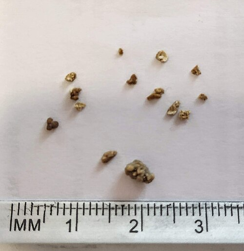

# LITÍASE URINÁRIA: DIAGNÓSTICO E ABORDAGEM

A litíase urinária não é apenas "pedra no rim". Para a sua prova de residência e para a sua vida no plantão, você precisa entender que estamos lidando com uma patologia que varia de um achado incidental assintomático a uma emergência urológica com risco de vida (urosepse).

Se você decorar apenas que "dói o flanco", você vai errar a questão que pergunta a conduta na gestante ou o critério de densidade na tomografia para indicar litotripsia. Vamos construir esse raciocínio juntos.

## Epidemiologia e Fatores de Risco

A litíase é uma doença extremamente comum, acometendo cerca de 10% a 15% da população mundial. O pico de incidência ocorre entre a 3ª e a 5ª décadas de vida. Historicamente, era muito mais comum em homens, mas essa diferença vem diminuindo devido a mudanças nos hábitos alimentares e obesidade.

Por que os cálculos se formam? O conceito fundamental aqui é a **supersaturação urinária**. Imagine um copo de água onde você joga sal; chega um momento em que o sal não dissolve mais e precipita. Na urina, isso acontece com o oxalato de cálcio, fosfato de cálcio e ácido úrico.

Os principais fatores de risco que as bancas adoram cobrar são:

- **Baixa ingestão hídrica:** O fator isolado mais importante. Menos solvente para muito soluto.

- **Dieta rica em sódio e proteína animal:** O sódio aumenta a excreção de cálcio na urina (calciúria).

- **Obesidade e Síndrome Metabólica:** Alteram o pH urinário e aumentam a excreção de oxalato.

- **História Familiar:** Quem tem um parente de primeiro grau com litíase tem o dobro de risco.

**Dica do Dr. Will:** Cuidado com a pegadinha do cálcio dietético! Antigamente, achava-se que restringir cálcio na dieta ajudava. Hoje sabemos que é o contrário: a restrição de cálcio aumenta a absorção de oxalato no intestino, piorando a litíase. Portanto, a orientação correta é manter a ingestão normal de cálcio.

*Figura 1 - Ilustração anatômica mostrando cálculos renais no trato urinário. Fonte: BruceBlaus, CC BY 3.0 | Wikimedia Commons*

## Fisiopatologia e Composição dos Cálculos

Você precisa saber de que são feitas as "pedras", pois isso define o tratamento e a prevenção.

### Oxalato de Cálcio (70-80%)

É o tipo mais comum. Frequentemente associado à hipercalciúria idiopática. No exame de urina, você verá cristais em formato de "envelope".

### Fosfato Amoniano Magnesiano (Estruvita)

Estes são os famosos **cálculos coraliformes**. Eles estão intimamente ligados a infecções urinárias por bactérias produtoras de **urease** (principalmente *Proteus mirabilis* e *Klebsiella*).
A urease quebra a ureia em amônia, elevando o pH urinário (> 7.2). Em meio alcalino, esses cristais se formam rapidamente, ocupando toda a pelve e cálices renais.

### Ácido Úrico (5-10%)

O grande diferencial aqui é que eles são **radiotransparentes** no Raio-X simples, mas aparecem na Tomografia. Estão associados a pH urinário baixo (ácido) e estados de hiperuricemia (como a gota).

### Cistina (

| Tipo de Cálculo | Frequência | pH Urinário | Característica de Imagem |
| --- | --- | --- | --- |
| Oxalato de Cálcio | 75% | Variável | Radiopaco |
| Estruvita (Coraliforme) | 10-15% | Alcalino (>7.0) | Radiopaco (aspecto em coral) |
| Ácido Úrico | 5-10% | Ácido (<5.5) | Radiotransparente (vê na TC) |
| Cistina | <1% | Ácido | Pouco radiopaco (vidro fosco) |

## Quadro Clínico: A Clássica Cólica Nefrética

A dor da cólica renal não acontece somente porque o cálculo está "arranhando" o ureter. Ela acontece pela **obstrução aguda** que gera distensão do sistema coletor e da cápsula renal. É essa distensão que ativa os quimiorreceptores e mecanorreceptores.

A dor clássica é:

- Início súbito, intensidade severa, em flanco.

- Irradiação para o abdome inferior, região inguinal ou genitália (testículo/grandes lábios).

- O paciente não consegue encontrar uma posição de alívio (diferente da peritonite, onde o paciente fica imóvel).

- Sintomas autonômicos: náuseas e vômitos são quase onipresentes.

**Anatomia e Irradiação (Cai muito!):**

- Cálculo no ureter superior: Dor no flanco e região lombar.

- Cálculo no ureter médio: Irradiação para fossa ilíaca (pode mimetizar apendicite ou diverticulite).

- Cálculo na Junção Ureterovesical (JUV): Sintomas irritativos vesicais (polaciúria, tenesmo vesical).

*Figura 2 - Cálculos renais de diferentes composições após extração cirúrgica. Fonte: Wikimedia Commons*

## Diagnóstico por Imagem

Aqui não há discussão para a prova: o **padrão-ouro é a Tomografia Computadorizada (TC) de abdome e pelve sem contraste (Protocolo para Litíase)**.

Por que a TC sem contraste?

- Detecta cálculos de até 1mm.

- Detecta cálculos de ácido úrico (que o Raio-X não vê).

- Avalia complicações (hidronefrose, densificação da gordura perirrenal).

- Permite medir a **Densidade (Unidades Hounsfield - UH)**. Isso é crucial: cálculos com > 1000 UH são muito duros e respondem mal à LECO.

**E as outras modalidades?**

- **Ultrassonografia (USG):** É o exame de escolha para **gestantes e crianças**. É bom para ver cálculos renais e hidronefrose, mas ruim para ver cálculos no ureter médio.

- **Raio-X de Abdome:** Útil apenas para acompanhamento de cálculos sabidamente radiopacos. Tem baixa sensibilidade diagnóstica inicial.

**Exemplo Clínico:** Paciente masculino, 45 anos, dor súbita em flanco esquerdo irradiada para testículo. Sem febre. Qual o próximo passo? TC de abdome sem contraste. Se a alternativa disser "Urografia Excretora", marque apenas se não houver TC, pois a urografia caiu em desuso devido ao contraste iodado e menor sensibilidade.

## Manejo da Fase Aguda (Analgesia)

O paciente chega gritando de dor. O que você faz?

- **AINEs (Anti-inflamatórios Não Esteroidais):** São a **primeira linha**. O cetoprofeno ou diclofenaco agem na causa da dor, reduzindo o edema ureteral e a pressão dentro da pelve renal ao diminuir o fluxo sanguíneo renal mediado por prostaglandinas.

- **Opioides (Tramadol, Morfina):** Usados como resgate se o AINE não resolver ou se houver contraindicação (insuficiência renal, por exemplo).

- **Antiespasmódicos (Buscopan):** Muito usados na prática brasileira, mas as diretrizes internacionais mostram pouco benefício adicional em relação aos AINEs isolados.

**Erro clássico:** "Hidratação venosa vigorosa (soro em bica)". **NÃO FAÇA ISSO.** Aumentar a oferta de líquidos na fase aguda aumenta a pressão na pelve renal obstruída e piora a dor. A hidratação deve ser apenas para repor perdas (vômitos) e manter a estabilidade.

## Terapia Expulsiva Medicamentosa (MET)

Se o cálculo é pequeno e o paciente está com a dor controlada, podemos tentar o tratamento conservador para que ele urine a pedra.

**Critérios para MET:**

- Cálculos ureterais distais.

- Tamanho entre 5mm e 10mm (cálculos < 5mm saem sozinhos em 80-90% das vezes, nem precisam de MET).

- Paciente sem sinais de infecção ou perda de função renal.

O medicamento de escolha é a **Tansulosina (0,4 mg/dia)**. Ela é um alfa-bloqueador que relaxa a musculatura lisa do ureter distal, facilitando a passagem do cálculo. O tratamento pode ser mantido por até 4 semanas.

## Quando a Litíase vira uma Emergência?

Este é o tópico mais cobrado em provas. Existem situações onde você não pode mandar o paciente para casa com analgésico. Você precisa internar e, muitas vezes, intervir imediatamente.

### 1. Obstrução + Infecção (Pielonefrite Obstrutiva)

Se o paciente tem cálculo obstrutivo e apresenta **febre, calafrios ou sinais de sepse**, isso é uma emergência urológica absoluta.
**Conduta:** Estabilização hemodinâmica + Antibiótico IV + **Descompressão imediata da via urinária**.
A descompressão pode ser feita por:

- Passagem de Cateter Duplo J (via retrógrada).

- Nefrostomia Percutânea (via anterógrada) - preferível se o paciente estiver muito instável ou se a via retrógrada falhar.

**Atenção:** No cenário de infecção, você **NUNCA** tenta retirar o cálculo ou fazer litotripsia definitiva. O objetivo é apenas drenar o pus/urina infectada. A retirada da pedra fica para um segundo momento, após a resolução da infecção.

### 2. Insuficiência Renal Aguda ou Rim Único

Se o cálculo obstrui o único rim funcional do paciente, ou se ele tem cálculos bilaterais obstruindo ambos os ureteres, ele entrará em anúria e insuficiência renal. Precisa de desobstrução urgente.

### 3. Dor Refratária

Se você fez AINE, opioide, e o paciente continua com dor insuportável (Escala Visual Analógica 10/10), ele precisa de intervenção cirúrgica para retirada do cálculo.

## Tratamento Intervencionista (Cirurgia)

Passada a fase aguda, ou se o cálculo não saiu com MET, precisamos decidir como retirá-lo. A escolha depende do tamanho, localização e densidade do cálculo.

### Litotripsia Extracorpórea por Ondas de Choque (LECO)

É o método menos invasivo (ondas de choque aplicadas sobre a pele).

- **Indicações:** Cálculos renais de até 1.5 - 2.0 cm ou ureterais proximais.

- **Contraindicações Absolutas:** Gestação, distúrbios de coagulação não corrigidos, infecção urinária ativa, aneurisma de aorta abdominal próximo ao cálculo, obstrução distal ao cálculo.

- **Fatores de mau prognóstico:** Cálculos muito duros (> 1000 UH na TC), obesidade mórbida (a onda não chega no rim), cálculos no polo inferior do rim (dificuldade de eliminação dos fragmentos pela gravidade).

### Ureterorrenoscopia (URS)

Pode ser rígida (para ureter distal) ou flexível (para ureter proximal e rim).

- **Indicações:** Padrão-ouro para cálculos ureterais médios e distais. A URS flexível com laser é excelente para cálculos renais < 2 cm, especialmente onde a LECO falharia (como no polo inferior).

- **Vantagem:** Maior taxa de "Stone-free" (paciente livre de cálculos) em uma única sessão comparada à LECO.

### Nefrolitotripsia Percutânea (NLPC)

Acesso direto ao rim através de um furo nas costas.

- **Indicações:** Cálculos renais grandes **(> 2 cm)** ou cálculos coraliformes.

- **Posicionamento:** O paciente geralmente é operado em posição prona.

| Localização/Tamanho | Primeira Escolha | Alternativa |
| --- | --- | --- |
| Ureter Distal | Ureteroscopia Rígida | MET (se < 10mm) |
| Ureter Proximal | LECO ou URS Flexível | --- |
| Rim < 2 cm | LECO ou URS Flexível | --- |
| Rim > 2 cm | Nefrolitotripsia Percutânea | URS Flexível (múltiplas sessões) |
| Coraliforme | Nefrolitotripsia Percutânea | Cirurgia Aberta (raro hoje) |

## Situações Especiais

### Gestantes

A gestante tem uma hidronefrose fisiológica (à direita > esquerda) pela compressão do útero e efeito da progesterona. Se ela tiver uma cólica renal real:

- **Diagnóstico:** Comece com USG. Se inconclusivo, a Ressonância Magnética pode ser usada. TC é evitada (radiação), mas pode ser feita em doses ultra-baixas em casos extremos no 2º/3º trimestre.

- **Tratamento:** Conservador na maioria das vezes. Se houver febre ou obstrução persistente, a conduta é a **passagem de cateter duplo J** ou nefrostomia. A cirurgia definitiva fica para o pós-parto.

### Crianças

Crianças formam cálculos geralmente por distúrbios metabólicos. A LECO funciona muito bem nelas porque o corpo é pequeno e os tecidos transmitem bem a onda de choque.

### Ácido Úrico e a Quimiólise

Lembre-se da pérola clínica: se o cálculo é de ácido úrico (visto na TC, mas não no RX, paciente com gota), o tratamento de escolha para o cálculo renal não obstrutivo é a **Alcalinização Urinária**. Usamos Citrato de Potássio para elevar o pH urinário para 6.5 - 7.0. O cálculo literalmente dissolve. Isso cai muito em prova!

## Avaliação Metabólica e Prevenção

Não adianta tratar a pedra e não evitar que ela volte. A avaliação metabólica deve ser feita em todo paciente com cálculos recorrentes, crianças, ou pacientes com rim único.

O que pedir (após 6 semanas do evento agudo):

- **Sangue:** Cálcio iônico, Ácido Úrico, Creatinina, PTH (para investigar hiperparatireoidismo).

- **Urina de 24 horas:** Volume total, Cálcio, Oxalato, Citrato (o principal inibidor), Ácido Úrico, Sódio e Magnésio.

**Orientações Gerais de Prevenção (MedEvo Checklist):**

- **Ingestão Hídrica:** Beber água suficiente para urinar > 2 a 2,5 litros por dia.

- **Redução de Sódio:** O sódio "puxa" o cálcio para a urina. Meta: < 2g de sódio/dia (5g de sal).

- **Proteína Animal:** Moderar o consumo (carne vermelha aumenta carga ácida e excreção de purinas).

- **Citrato:** Sucos de frutas cítricas (limonada) são excelentes fontes naturais de citrato.

## Pontos-Chave para Prova 💡

- **Padrão-ouro diagnóstico:** TC de abdome e pelve sem contraste.

- **Cálculo Coraliforme:** Associado a bactérias produtoras de urease (*Proteus*). pH urinário alcalino.

- **Emergência Urológica:** Cálculo obstrutivo + Febre/Sepse. Conduta: Drenagem imediata (Duplo J ou Nefrostomia). **NÃO** fazer litotripsia na infecção.

- **Analgesia de escolha:** AINEs (ex: Cetoprofeno). Evite hiper-hidratação venosa na dor aguda.

- **Terapia Expulsiva (MET):** Tansulosina para cálculos ureterais distais entre 5-10 mm.

- **Indicação de NLPC:** Cálculos renais > 2 cm ou coraliformes.

- **Indicação de LECO:** Cálculos renais < 2 cm, densidade < 1000 UH, distância pele-cálculo pequena.

- **Cálculo de Ácido Úrico:** Radiotransparente no RX. Tratamento: Alcalinização da urina com Citrato de Potássio.

- **Gestante com Sepse/Obstrução:** Drenagem de urgência (Duplo J ou Nefrostomia).

- **Cálculo < 5 mm:** Conduta inicial é expectante (alta chance de eliminação espontânea).

- **Hiperoxalúria Entérica:** Comum em pacientes com Doença de Crohn ou cirurgia bariátrica (má absorção de gordura que se liga ao cálcio, deixando o oxalato livre para ser absorvido).

- **Ponto Anatômico:** O ureter cruza os vasos ilíacos (comuns ou externos) na entrada da pelve, um local frequente de impactação de cálculos.

- **Hematúria:** Presente em 90% dos casos de cólica renal, mas sua ausência **NÃO** exclui o diagnóstico.

- **Cuidado com o Rim Único:** Qualquer obstrução em rim único é indicação de intervenção/drenagem precoce para evitar perda definitiva de função.

Ao seguir este guia, você cobre mais de 95% das questões de urolitíase das principais bancas do Brasil (USP, SURCE, ENARE, AMP). Lembre-se sempre: na dúvida, veja se o paciente tem febre. Se tiver, o jogo muda e a prioridade é drenar!

 Cópia offline para consulta pessoal.
 Fonte original:
 [https://www.medevo.com.br/material-apoio/ler/4afaa85f-8177-4cf8-8093-8f79f6ad1585](https://www.medevo.com.br/material-apoio/ler/4afaa85f-8177-4cf8-8093-8f79f6ad1585)
