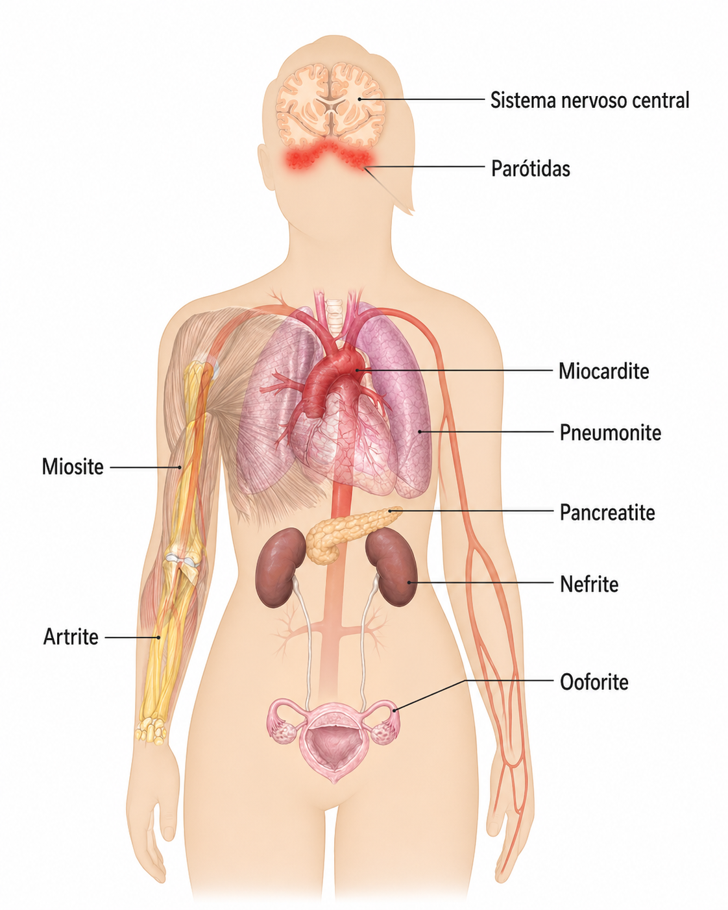

# LÚPUS ERITEMATOSO SISTÊMICO

O Lúpus Eritematoso Sistêmico (LES) é uma doença autoimune multissistêmica. Ele é chamado de “doença das mil faces” porque pode afetar pele, articulações, rins, sangue, sistema nervoso, serosas, pulmões, coração e gestação.

A lógica central é: o sistema imune perde tolerância contra componentes do próprio organismo, especialmente antígenos nucleares. Isso leva à produção de autoanticorpos, formação de imunocomplexos, ativação do complemento e inflamação tecidual.

Na atividade do LES, é comum haver **queda de C3 e C4**, porque o complemento está sendo consumido na inflamação mediada por imunocomplexos.

*Figura 1 - Eritema malar em asa de borboleta, sinal clássico do Lúpus Eritematoso Sistêmico. Fonte: Doktorinternet, CC BY-SA 4.0 | Wikimedia Commons*

### Epidemiologia e Fisiopatologia

O perfil clássico de prova é:

> Mulher jovem, em idade fértil, com sintomas em múltiplos órgãos.

O LES é muito mais comum em mulheres, especialmente entre a adolescência e a idade adulta jovem. A maior frequência em mulheres está relacionada, em parte, à influência hormonal sobre a resposta imune.

### Fatores envolvidos na fisiopatologia

O LES surge da combinação de vários fatores:

-

**Predisposição genética**
História familiar e determinados genes aumentam o risco.

-

**Fatores hormonais**
O estrogênio favorece respostas imunes humorais, ajudando a explicar a predominância em mulheres jovens.

-

**Falha na depuração de apoptose**
Restos celulares e antígenos nucleares não são removidos adequadamente, favorecendo autoanticorpos.

-

**Gatilhos ambientais**
Radiação ultravioleta, infecções, tabagismo e alguns medicamentos podem precipitar ou piorar a doença.

-

**Formação de imunocomplexos**
Os autoanticorpos se ligam a antígenos, formam imunocomplexos e se depositam em tecidos.

**Ideia-chave:**
O LES é uma doença de deposição e inflamação. Se o imunocomplexo deposita no rim, pode causar nefrite. Se deposita na pele, causa lesões cutâneas. Se acomete serosas, causa pleurite ou pericardite.

## Diagnóstico: Critérios EULAR/ACR 2019

O diagnóstico de LES é clínico-laboratorial. O FAN ajuda muito, mas **FAN positivo sozinho não fecha diagnóstico**.

Nos critérios EULAR/ACR 2019, o critério de entrada é FAN positivo em título ≥ 1:80 em células HEp-2 ou teste equivalente, pelo menos uma vez. Depois disso, o paciente precisa somar **10 pontos ou mais**, com pelo menos um critério clínico. ([PMC](https://pmc.ncbi.nlm.nih.gov/articles/PMC6827566/))

### Cuidado com o FAN

O FAN tem alta sensibilidade, mas baixa especificidade.

Pode ser positivo em:

- Pessoas saudáveis.

- Idosos.

- Outras doenças autoimunes.

- Infecções.

- Neoplasias.

- Uso de alguns medicamentos.

Títulos baixos e padrões inespecíficos devem ser interpretados com cautela.

### Critérios EULAR/ACR 2019 — Resumo Prático

| Domínio | Critério | Pontos |
| --- | --- | --- |
| Constitucional | Febre | 2 |
| Cutâneo/mucoso | Alopecia não cicatricial | 2 |
| Cutâneo/mucoso | Úlceras orais | 2 |
| Cutâneo/mucoso | Lúpus cutâneo subagudo ou discoide | 4 |
| Cutâneo/mucoso | Lúpus cutâneo agudo/rash malar | 6 |
| Articular | Artrite ou rigidez matinal em ≥ 2 articulações | 6 |
| Neurológico | Delirium | 2 |
| Neurológico | Psicose | 3 |
| Neurológico | Convulsão | 5 |
| Seroso | Derrame pleural ou pericárdico | 5 |
| Seroso | Pericardite aguda | 6 |
| Hematológico | Leucopenia < 4.000/mm³ | 3 |
| Hematológico | Trombocitopenia < 100.000/mm³ | 4 |
| Hematológico | Hemólise autoimune | 4 |
| Renal | Proteinúria > 0,5 g/24h | 4 |
| Renal | Biópsia classe II ou V | 8 |
| Renal | Biópsia classe III ou IV | 10 |
| Antifosfolípides | Anticardiolipina, anti-β2-glicoproteína I ou anticoagulante lúpico | 2 |
| Complemento | C3 ou C4 baixo | 3 |
| Complemento | C3 e C4 baixos | 4 |
| Anticorpos específicos | Anti-dsDNA ou anti-Sm | 6 |

**Dica de prova:**
FAN positivo + biópsia renal classe III ou IV já atinge 10 pontos.

## Manifestações Clínicas

O LES deve ser suspeitado quando uma paciente jovem apresenta sintomas em mais de um sistema.

Exemplo clássico:

> Mulher jovem com artralgia, fotossensibilidade, rash malar, úlceras orais, queda de cabelo, anemia/leucopenia e proteinúria.

### Manifestações Cutâneas

As manifestações cutâneas são muito cobradas.

### 1. Lúpus Cutâneo Agudo

É o padrão do rash malar.

Características:

- Eritema em asa de borboleta.

- Poupa o sulco nasolabial.

- Piora com sol.

- Geralmente acompanha atividade sistêmica.

- Não costuma deixar cicatriz.

### 2. Lúpus Cutâneo Subagudo

Características:

- Lesões anulares ou psoriasiformes.

- Fotossensibilidade importante.

- Costuma ocorrer em áreas fotoexpostas.

- Associado ao anti-Ro/SSA.

- Pode ocorrer também no lúpus induzido por alguns fármacos.

### 3. Lúpus Cutâneo Crônico / Discoide

Características:

- Placas eritematosas, descamativas e infiltradas.

- Pode deixar cicatriz.

- Pode causar alopecia cicatricial.

- Pode ocorrer isoladamente ou associado ao LES.

### Outras manifestações cutâneas

- Fotossensibilidade.

- Úlceras orais ou nasais, geralmente indolores.

- Alopecia não cicatricial.

- Livedo reticular, especialmente se houver SAF associada.

- Fenômeno de Raynaud, comum, mas não específico.

### Manifestações Articulares

A artrite do LES costuma ser:

- Simétrica.

- De pequenas articulações.

- Inflamatória.

- Dolorosa.

- Com rigidez matinal.

- Não erosiva.

Ela pode parecer artrite reumatoide, mas a diferença clássica é:

> A artrite do LES geralmente não causa erosões ósseas.

### Artropatia de Jaccoud

É uma deformidade articular redutível.

Características:

- Desvio ulnar.

- Deformidades semelhantes às da artrite reumatoide.

- Redutíveis ao exame físico.

- Causadas por frouxidão ligamentar, não por erosão óssea.

Se houver erosões no raio-X, pense em sobreposição LES + artrite reumatoide, chamada informalmente de “rhupus”.

### Manifestações Hematológicas

O hemograma pode dar várias pistas.

### Anemia

Pode ocorrer por:

- Anemia da doença crônica.

- Deficiência de ferro.

- Doença renal.

- Hemólise autoimune.

A anemia hemolítica autoimune é mais específica e costuma vir com:

- Coombs direto positivo.

- Reticulocitose.

- Aumento de DHL.

- Aumento de bilirrubina indireta.

- Queda de haptoglobina.

### Leucopenia e Linfopenia

São frequentes no LES.

A linfopenia pode acompanhar atividade de doença.

### Trombocitopenia

Pode ser manifestação inicial do LES e pode simular púrpura trombocitopênica imune.

### Manifestações Serosas

O LES pode causar inflamação de serosas.

Principais:

- Pleurite.

- Derrame pleural.

- Pericardite.

- Derrame pericárdico.

A pericardite lúpica pode causar dor torácica pleurítica, que melhora ao sentar e piora em decúbito.

### Manifestações Cardiopulmonares

Além de pleurite e pericardite, o LES pode causar:

- Miocardite.

- Endocardite de Libman-Sacks.

- Hipertensão pulmonar.

- Pneumonite lúpica.

- Hemorragia alveolar, rara e grave.

- Doença intersticial pulmonar, menos comum.

A endocardite de Libman-Sacks é uma endocardite verrucosa não infecciosa, associada ao LES e à síndrome antifosfolípide.

### Manifestações Neuropsiquiátricas

O LES pode acometer o sistema nervoso central e periférico.

Possibilidades:

- Convulsões.

- Psicose.

- Delirium.

- Cefaleia.

- Acidente vascular cerebral.

- Neuropatias.

- Mielite transversa.

- Distúrbios cognitivos.

- Depressão e ansiedade, embora nem sempre sejam atividade inflamatória direta.

### Psicose lúpica vs. Psicose por corticoide

| Característica | Psicose lúpica | Psicose por corticoide |
| --- | --- | --- |
| Contexto | Atividade sistêmica do LES | Início após dose alta de corticoide |
| Complemento | Pode estar baixo | Geralmente normal |
| Anti-dsDNA | Pode estar elevado | Não necessariamente |
| Outros sinais de atividade | Frequentes | Ausentes |
| Conduta | Imunossupressão | Reduzir/trocar corticoide se possível |

## Nefrite Lúpica

A nefrite lúpica é uma das manifestações mais importantes do LES, porque muda prognóstico e tratamento.

Todo paciente com LES deve ser monitorado com:

- Urina tipo 1.

- Relação proteína/creatinina urinária ou proteinúria de 24h.

- Creatinina.

- Sedimento urinário.

- C3, C4 e anti-dsDNA.

*Figura 2 - Diagrama das manifestações sistêmicas do Lúpus Eritematoso Sistêmico.*

### Quando suspeitar?

- Proteinúria persistente.

- Hematúria glomerular.

- Cilindros hemáticos ou celulares.

- Aumento de creatinina.

- Hipertensão nova.

- Edema.

- Queda de complemento.

- Aumento de anti-dsDNA.

### Quando biopsiar?

A biópsia renal deve ser considerada quando houver suspeita de nefrite clinicamente relevante, especialmente com proteinúria significativa, sedimento ativo ou perda de função renal. Diretrizes atuais reforçam a biópsia como ferramenta central para classificar e guiar tratamento da nefrite lúpica. ([KDIGO](https://kdigo.org/wp-content/uploads/2024/01/KDIGO-2024-Lupus-Nephritis-Guideline.pdf))

### Classificação Histológica da Nefrite Lúpica

| Classe | Nome | Quadro típico | Conduta geral |
| --- | --- | --- | --- |
| I | Mesangial mínima | Urina geralmente normal | Observação |
| II | Mesangial proliferativa | Hematúria/proteinúria leves | Tratamento conforme clínica |
| III | Proliferativa focal | < 50% dos glomérulos | Imunossupressão |
| IV | Proliferativa difusa | ≥ 50% dos glomérulos | Imunossupressão agressiva |
| V | Membranosa | Síndrome nefrótica | Imunossupressão se proteinúria importante |
| VI | Esclerosante avançada | Fibrose avançada | Manejo de DRC/diálise/transplante |

### Classe IV

É a mais cobrada.

Características:

- Proliferativa difusa.

- Geralmente mais grave.

- Consumo importante de complemento.

- Anti-dsDNA frequentemente elevado.

- Pode cursar com síndrome nefrítica, nefrótica ou quadro misto.

## Autoanticorpos no LES

### Tabela Prática

| Anticorpo | Utilidade |
| --- | --- |
| FAN | Triagem; alta sensibilidade e baixa especificidade |
| Anti-dsDNA | Específico; associado à atividade e nefrite |
| Anti-Sm | Mais específico para LES, mas pouco sensível |
| Anti-Ro/SSA | Lúpus cutâneo subagudo, Sjögren e lúpus neonatal |
| Anti-La/SSB | Frequentemente associado ao anti-Ro |
| Anti-RNP | Doença mista do tecido conjuntivo; pode aparecer no LES |
| Anti-histona | Lúpus induzido por drogas |
| Antifosfolípides | Trombose e perdas gestacionais |

### Anticorpos mais cobrados

- **Mais sensível:** FAN.

- **Mais específico:** anti-Sm.

- **Atividade/nefrite:** anti-dsDNA.

- **Neonatal/bloqueio cardíaco congênito:** anti-Ro/SSA e anti-La/SSB.

- **Lúpus induzido por drogas:** anti-histona.

- **SAF:** anticoagulante lúpico, anticardiolipina e anti-β2-glicoproteína I.

## Lúpus Induzido por Drogas

O lúpus induzido por drogas ocorre quando uma medicação desencadeia quadro semelhante ao LES.

### Drogas clássicas

- Hidralazina.

- Procainamida.

- Isoniazida.

- Minociclina.

- Anti-TNF.

- Metildopa.

- Clorpromazina.

- Quinidina.

### Quadro clínico

Costuma causar:

- Febre.

- Artralgia.

- Mialgia.

- Serosite.

- FAN positivo.

- Anti-histona positivo.

### Diferenças em relação ao LES clássico

| Característica | Lúpus induzido por drogas | LES clássico |
| --- | --- | --- |
| Rim | Raro | Pode ser grave |
| SNC | Raro | Pode ocorrer |
| Complemento | Geralmente normal | Pode estar baixo |
| Anti-histona | Muito comum | Pode ocorrer |
| Anti-dsDNA | Geralmente ausente | Pode estar presente |
| Tratamento | Suspender droga | Depende da gravidade |

## Tratamento do LES

O objetivo atual é controlar atividade, prevenir dano acumulado e usar a menor dose possível de corticoide.

As recomendações EULAR atualizadas reforçam hidroxicloroquina para todos os pacientes, salvo contraindicação, em dose-alvo de até 5 mg/kg/dia de peso real, considerando risco de surto e toxicidade retiniana. Também recomendam minimizar corticoide e usar imunossupressores/biológicos conforme órgão acometido e gravidade. ([BMJ Arthritis Research & Therapy](https://ard.bmj.com/content/83/1/15))

### Medidas Gerais

Devem ser orientadas para praticamente todos os pacientes:

- Fotoproteção rigorosa.

- Evitar tabagismo.

- Vacinação adequada, preferencialmente antes de imunossupressão intensa.

- Controle de risco cardiovascular.

- Tratar hipertensão, diabetes e dislipidemia.

- Reposição de vitamina D, se deficiência.

- Prevenção de osteoporose se uso crônico de corticoide.

- Planejamento reprodutivo.

- Monitorização regular de urina, creatinina, complemento e anti-dsDNA.

### Hidroxicloroquina

É a base do tratamento do LES.

### Benefícios

- Reduz surtos.

- Ajuda em pele e articulações.

- Reduz dano acumulado.

- Pode reduzir risco trombótico.

- Pode melhorar perfil metabólico.

- Deve ser mantida na gestação, salvo contraindicação.

### Toxicidade importante

A principal toxicidade temida é retinopatia.

Monitorização:

- Avaliação oftalmológica basal.

- Rastreamento anual após 5 anos de uso em pacientes de baixo risco.

- Rastreamento mais precoce se houver fatores de risco, como doença renal, dose alta, uso de tamoxifeno ou doença macular.

**Importante:**
Hidroxicloroquina não é corticoide e não causa úlcera péptica como efeito típico.

### Corticoides

São usados para controle rápido da inflamação.

### Uso conforme gravidade

| Situação | Exemplo de estratégia |
| --- | --- |
| Leve | Baixa dose por curto período |
| Moderada | Dose intermediária |
| Grave | Dose alta ou pulsoterapia com metilprednisolona |

Exemplos de doença grave:

- Nefrite proliferativa.

- Hemorragia alveolar.

- Neuro-lúpus grave.

- Citopenias graves.

- Miocardite.

- Vasculite grave.

### Cuidado

Corticoide salva em surto grave, mas causa dano quando usado por muito tempo.

Efeitos adversos:

- Osteoporose.

- Diabetes.

- Hipertensão.

- Ganho de peso.

- Infecção.

- Catarata/glaucoma.

- Necrose avascular.

- Psicose.

- Cushing iatrogênico.

Em regiões com risco de estrongiloidíase, considerar profilaxia antes de pulsoterapia ou imunossupressão intensa, conforme avaliação clínica e epidemiológica.

### Imunossupressores

Usados para poupar corticoide e tratar órgãos específicos.

| Droga | Uso comum | Alertas |
| --- | --- | --- |
| Metotrexato | Artrite e pele | Teratogênico; hepatotoxicidade |
| Azatioprina | Manutenção, hematológico, gestação | Mielotoxicidade; monitorar hemograma |
| Micofenolato | Nefrite lúpica, manutenção | Teratogênico; excelente opção renal |
| Ciclofosfamida | Doença grave, nefrite, SNC | Infertilidade, cistite hemorrágica, infecção |
| Belimumabe | LES ativo refratário, poupa corticoide | Melhor em atividade sorológica |
| Anifrolumabe | LES moderado/grave refratário | Atenção a infecções virais |

### Nefrite lúpica

Nas classes proliferativas III/IV, o tratamento geralmente envolve:

- Corticoide.

- Micofenolato ou ciclofosfamida.

- Hidroxicloroquina.

- Controle de pressão e proteinúria.

- Em casos selecionados, terapias adicionais, como belimumabe ou inibidor de calcineurina.

Diretrizes recentes de nefrite lúpica reforçam terapia combinada para classes ativas III/IV e V, com hidroxicloroquina como base salvo contraindicação. ([ACR Journals](https://acrjournals.onlinelibrary.wiley.com/doi/10.1002/acr.25528))

## Síndrome Antifosfolípide e LES

Muitos pacientes com LES têm anticorpos antifosfolípides, mas nem todos têm síndrome antifosfolípide.

Para ter SAF, não basta anticorpo positivo. Precisa haver evento clínico compatível.

### Anticorpos da SAF

- Anticoagulante lúpico.

- Anticardiolipina.

- Anti-β2-glicoproteína I.

### Manifestações clínicas

- Trombose venosa.

- Trombose arterial.

- AVC em jovem.

- Perdas gestacionais recorrentes.

- Morte fetal.

- Pré-eclâmpsia grave ou insuficiência placentária.

- Livedo reticular.

- Trombocitopenia.

### VDRL falso-positivo

O VDRL usa cardiolipina no teste. Por isso, pacientes com anticorpo anticardiolipina podem ter VDRL falso-positivo.

**Dica de prova:**
Mulher com LES + VDRL falso-positivo + trombose ou perdas gestacionais = pense em SAF.

### Tratamento geral

| Situação | Conduta geral |
| --- | --- |
| Anticorpo positivo sem evento | Avaliar risco; pode considerar AAS em alto risco |
| Trombose confirmada | Anticoagulação plena, geralmente varfarina |
| SAF obstétrica | AAS + heparina durante gestação |
| SAF de alto risco/triplo positivo | Evitar DOACs, especialmente rivaroxabana |

## Lúpus na Gestação

A gestação no LES é possível, mas deve ser planejada.

O ideal é engravidar com a doença em remissão ou baixa atividade por pelo menos 6 meses. Recomendações da EULAR para saúde reprodutiva reforçam planejamento, estratificação de risco, manutenção de hidroxicloroquina e atenção a anticorpos antifosfolípides e anti-Ro/La. ([PMC](https://pmc.ncbi.nlm.nih.gov/articles/PMC5446003/))

### Drogas geralmente permitidas

- Hidroxicloroquina.

- Prednisona/prednisolona.

- Azatioprina.

- AAS em baixa dose, quando indicado.

- Heparina, se SAF obstétrica ou indicação trombótica.

### Drogas contraindicadas

- Metotrexato.

- Micofenolato.

- Ciclofosfamida.

- Leflunomida.

- Inibidores da ECA/BRA durante a gestação.

### Lúpus neonatal

Ocorre pela passagem transplacentária de anticorpos maternos, principalmente anti-Ro/SSA e anti-La/SSB.

Manifestações:

- Lesões cutâneas transitórias.

- Alterações hematológicas.

- Alterações hepáticas.

- Bloqueio atrioventricular congênito.

A manifestação mais grave é o bloqueio cardíaco congênito, que pode ser irreversível.

## Diagnóstico Diferencial

### LES vs. Artrite Reumatoide

| LES | Artrite Reumatoide |
| --- | --- |
| Artrite geralmente não erosiva | Artrite erosiva |
| Pode ter rash, citopenias, nefrite | Predomínio articular |
| FAN pode ser positivo | FR/anti-CCP ajudam |
| Anti-dsDNA/anti-Sm específicos | Anti-CCP específico |

### LES vs. Esclerose Sistêmica

| LES | Esclerose Sistêmica |
| --- | --- |
| Rash malar, nefrite, citopenias | Espessamento cutâneo |
| Anti-dsDNA/anti-Sm | Anti-centrômero/anti-Scl-70 |
| Artrite não erosiva | Raynaud intenso, úlceras digitais |
| Nefrite por imunocomplexos | Crise renal esclerodérmica |

### LES vs. Dermatomiosite

| LES | Dermatomiosite |
| --- | --- |
| Rash malar, nefrite, citopenias | Fraqueza muscular proximal |
| Anti-dsDNA/anti-Sm | Enzimas musculares elevadas |
| Pode ter artrite | Pápulas de Gottron, heliotropo |

### LES vs. Infecção

Essa é uma das diferenciações mais importantes.

| Pista | Surto de LES | Infecção |
| --- | --- | --- |
| C3/C4 | Baixos | Geralmente normais |
| Anti-dsDNA | Pode subir | Não sobe por atividade lúpica |
| PCR | Pode ser normal ou pouco elevada | Frequentemente alta |
| Procalcitonina | Geralmente baixa | Pode subir |
| Febre | Pode ocorrer | Pode ocorrer |
| Conduta | Imunossupressão | Antimicrobiano |

**Dica de prova:**
No LES, VHS pode subir por atividade inflamatória. PCR muito alta deve fazer pensar em infecção, embora não seja regra absoluta.

## Padrões de FAN

| Padrão | Associação possível |
| --- | --- |
| Pontilhado grosso | Anti-Sm, anti-RNP; LES/DMTC |
| Pontilhado fino | Anti-Ro/La; Sjögren, lúpus cutâneo subagudo |
| Pontilhado fino denso | Pode ocorrer em indivíduos saudáveis |
| Homogêneo | Anti-DNA, anti-histona; LES ou lúpus induzido |
| Periférico/rim | Anti-dsDNA; LES |
| Nucleolar | Esclerose sistêmica |

**Cuidado:**
Padrão de FAN ajuda, mas não fecha diagnóstico isoladamente.

## Tabelas de Revisão Rápida

### Autoanticorpos

| Anticorpo | Principal associação |
| --- | --- |
| FAN | Triagem |
| Anti-dsDNA | Atividade e nefrite |
| Anti-Sm | Mais específico para LES |
| Anti-Ro/SSA | Lúpus subagudo e neonatal |
| Anti-La/SSB | Lúpus neonatal/Sjögren |
| Anti-RNP | Doença mista do tecido conjuntivo |
| Anti-histona | Lúpus induzido por drogas |
| Antifosfolípides | Trombose e perdas gestacionais |

### Marcadores de atividade

| Marcador | Interpretação |
| --- | --- |
| Anti-dsDNA alto | Sugere atividade, especialmente renal |
| C3/C4 baixos | Consumo de complemento |
| Urina com proteinúria/cilindros | Suspeitar nefrite |
| VHS alto | Pode acompanhar atividade |
| PCR muito alta | Pensar em infecção |

### Nefrite lúpica

| Classe | Resumo |
| --- | --- |
| I | Mesangial mínima |
| II | Mesangial proliferativa |
| III | Proliferativa focal |
| IV | Proliferativa difusa; mais grave/cobrada |
| V | Membranosa; síndrome nefrótica |
| VI | Esclerosante avançada |

## Pontos-Chave para Prova

- LES é doença autoimune multissistêmica mediada por autoanticorpos e imunocomplexos.

- Perfil clássico: mulher jovem com manifestações em múltiplos órgãos.

- FAN é triagem: sensível, mas pouco específico.

- Critério EULAR/ACR 2019: FAN ≥ 1:80 como entrada + pelo menos 10 pontos.

- Anti-Sm é o anticorpo mais específico.

- Anti-dsDNA se associa à atividade de doença e nefrite.

- C3 e C4 baixos sugerem atividade por consumo de complemento.

- Artrite do LES costuma ser não erosiva.

- Artropatia de Jaccoud causa deformidade redutível.

- Rash malar poupa o sulco nasolabial.

- Lúpus cutâneo subagudo se associa ao anti-Ro.

- Anti-Ro/Anti-La estão ligados ao lúpus neonatal e bloqueio cardíaco congênito.

- Nefrite classe IV é a mais cobrada e uma das mais graves.

- Biópsia renal define classe e guia tratamento.

- Lúpus induzido por drogas costuma ter anti-histona, complemento normal e pouco acometimento renal/SNC.

- Hidroxicloroquina é a base do tratamento, salvo contraindicação.

- Corticoide deve ser usado na menor dose e pelo menor tempo possível.

- Micofenolato e ciclofosfamida são importantes na nefrite grave.

- VDRL falso-positivo sugere anticorpo antifosfolípide.

- SAF exige evento clínico + anticorpo persistente.

- Gestação deve ser planejada com doença controlada por pelo menos 6 meses.

- Metotrexato, micofenolato e ciclofosfamida são contraindicados na gestação.

- PCR muito alta em paciente lúpico deve acender alerta para infecção.

## Resumo Final

O LES deve ser pensado quando uma mulher jovem apresenta manifestações em vários sistemas, especialmente pele, articulações, sangue e rim.

O raciocínio prático é:

- **Suspeita clínica multissistêmica.**

- **FAN como exame de triagem.**

- **Autoanticorpos específicos para confirmar perfil.**

- **C3, C4 e anti-dsDNA para avaliar atividade.**

- **Urina e creatinina sempre, porque nefrite muda prognóstico.**

- **Hidroxicloroquina como base do tratamento.**

- **Imunossupressão conforme órgão acometido e gravidade.**

O segredo da prova é integrar clínica e laboratório. FAN positivo sozinho não é lúpus; lúpus é contexto clínico compatível, autoimunidade e padrão sistêmico.

 Cópia offline para consulta pessoal.
 Fonte original:
 [https://www.medevo.com.br/material-apoio/ler/47b8c0b6-6668-400c-b95d-f4a684ee2f4c](https://www.medevo.com.br/material-apoio/ler/47b8c0b6-6668-400c-b95d-f4a684ee2f4c)
