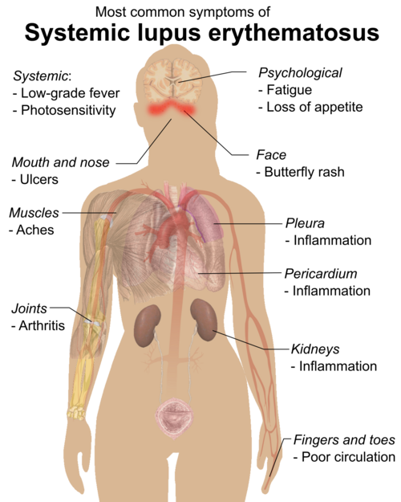

# LÚPUS ERITEMATOSO SISTÊMICO NA GESTAÇÃO

O Lúpus Eritematoso Sistêmico (LES) é o protótipo da doença autoimune multissistêmica e, por acometer preferencialmente mulheres em idade fértil (proporção de 9:1 em relação aos homens), a intersecção com a obstetrícia é um dos temas mais densos e cobrados em provas de residência.

Para entender o LES na gestação, você precisa esquecer a ideia de que a gravidez é proibida. Hoje, com o manejo adequado, a maioria das pacientes tem desfechos favoráveis. O segredo está no binômio: **Planejamento e Estabilidade**.

## O Cenário Ideal: Planejamento Pré-concepcional

Por que insistimos tanto no planejamento? Porque o maior preditor de um desfecho ruim é a atividade da doença no momento da concepção. Se a paciente engravida com o lúpus "atacado", o risco de perda fetal e exacerbação materna (flare) dispara.

Segundo a **Diretriz da FEBRASGO (2023/2025)** e da Sociedade Brasileira de Reumatologia (SBR), os critérios para liberar a gestação são:

- **Remissão clínica e laboratorial** por pelo menos 6 meses (idealmente 12 a 24 meses após o diagnóstico inicial).

- **Função renal estável** (creatinina < 1,5 mg/dL e proteinúria < 500 mg/24h).

- **Ajuste de medicações**: Substituir drogas teratogênicas por alternativas seguras.

**Dica de Prova:** As bancas adoram perguntar o tempo de remissão. Memorize: **6 meses de doença inativa** é o número mágico para reduzir riscos.

### Contraindicações Absolutas à Gestação

Existem situações em que o risco de morte materna é tão alto que a gestação deve ser formalmente desaconselhada:

- Hipertensão pulmonar grave.

- Doença pulmonar restritiva grave (Capacidade Vital < 1 litro).

- Insuficiência cardíaca grave.

- Insuficiência renal crônica avançada (Creatinina > 2,8 mg/dL).

- Acidente Vascular Cerebral (AVC) nos últimos 6 meses.

- Exacerbação grave (flare) do LES nos últimos 6 meses.

*Figura 1 - Microangiopatia trombótica renal: achado histopatológico associado à síndrome antifosfolípide, mostrando trombose microvascular que pode causar insuficiência placentária. Fonte: Nephron, CC BY-SA 3.0 | Wikimedia Commons*

## Fisiopatologia: O que acontece no corpo da gestante?

A gestação é um estado de tolerância imunológica, mas no LES, essa balança é frágil. O aumento dos níveis de estrogênio e prolactina pode estimular a resposta Th2, o que teoricamente favorece a produção de autoanticorpos.

Além disso, temos a questão dos anticorpos que atravessam a placenta. Lembra da imunoglobulina que passa para o feto? É a **IgG**. Os anticorpos **Anti-Ro/SSA** e **Anti-La/SSB** são IgG e, ao cruzarem a barreira placentária, podem causar danos ao sistema de condução cardíaca do feto e lesões cutâneas.

## Diagnóstico e Acompanhamento Pré-natal

O diagnóstico de LES segue os critérios do **ACR/EULAR 2019** (pontuação ≥ 10 com FAN positivo como critério de entrada). Na gestante, o desafio é que alguns sintomas do lúpus se confundem com a fisiologia da gravidez (edema, queda de cabelo leve, fadiga, anemia).

### Exames Iniciais no Pré-natal de Alto Risco

Ao confirmar a gravidez em uma paciente com LES, você deve solicitar um "kit básico" para estratificar o risco:

- **Função Renal**: Creatinina, ureia e proteinúria de 24 horas (ou relação proteína/creatinina).

- **Atividade Imunológica**: Complemento (C3 e C4) e Anti-dsDNA.

- **Perfil de Anticorpos**: Anti-Ro/SSA, Anti-La/SSB e pesquisa de Síndrome Antifosfolípide (Anticoagulante lúpico, Anticardiolipina e Anti-beta2-glicoproteína I).

**Atenção ao Complemento:** Em uma gestação normal, os níveis de complemento **aumentam**. Se você encontrar níveis baixos (hipocomplementemia) ou em queda, isso é um sinal fortíssimo de atividade lúpica (consumo de complemento), especialmente nefrite.

## O Grande Desafio: Atividade Lúpica vs. Pré-eclâmpsia

Este é o ponto onde o aluno mais erra em prova e o médico mais sofre no plantão. Ambas as condições podem cursar com hipertensão, proteinúria e edema. Como diferenciar?

| Achado | Atividade Lúpica (Flare) | Pré-eclâmpsia (PE) |
| --- | --- | --- |
| **Complemento (C3/C4)** | Baixo (Consumido) | Normal ou Aumentado |
| **Sedimento Urinário** | Ativo (Cilindros hemáticos, hematúria) | Inativo (Apenas proteinúria) |
| **Anti-dsDNA** | Títulos em elevação | Negativo ou estável |
| **Ácido Úrico** | Geralmente normal | Elevado |
| **Sintomas Sistêmicos** | Rash, artrite, febre | Cefaleia, escotomas, dor epigástrica |
| **Relação sFlt-1/PlGF** | Normal | Alterada (Elevada) |

**Exemplo Clínico:** Paciente com 28 semanas, LES prévio, chega com PA 150/100 mmHg e proteinúria de 1g/24h. Se o C3 estiver baixo e houver cilindros hemáticos na urina, pense em **Nefrite Lúpica**. Se o ácido úrico estiver alto e o complemento normal, pense em **Pré-eclâmpsia**.

*Figura 2 - Manifestações clínicas do Lúpus Eritematoso Sistêmico: o acometimento multissistêmico exige monitoramento especializado durante toda a gestação. Fonte: Mikael Häggström, Domínio Público | Wikimedia Commons*

## Manejo Farmacológico: O que pode e o que não pode?

Aqui o Dr. Will sempre reforça: no LES, o tratamento não é suspenso, ele é **ajustado**. Suspender a medicação por medo de teratogenia é o caminho mais rápido para um flare grave.

### 1. Hidroxicloroquina (HCQ) - A Droga de Escolha

É a "pedra angular". Deve ser mantida em **todas** as gestantes lúpicas.

- **Por que?** Reduz o risco de flares, diminui o risco de pré-eclâmpsia e, crucialmente, reduz o risco de Bloqueio Cardíaco Congênito em mães Anti-Ro positivas.

- **Dose**: Geralmente 400 mg/dia (ou 5 mg/kg/dia).

### 2. Corticosteroides

Usamos a **Prednisona** ou **Prednisolona**.

- **Detalhe Técnico**: Elas são inativadas pela enzima placentária 11-beta-hidroxiesteroide desidrogenase. Ou seja, tratam a mãe, mas pouco chega ao feto.

- **Cuidado**: Se você precisar tratar o feto (ex: maturação pulmonar), deve usar corticoides fluorados (**Betametasona ou Dexametasona**), que atravessam a placenta.

### 3. Imunossupressores Permitidos

- **Azatioprina**: É o imunossupressor de escolha na gestação se a paciente precisar de algo além do corticoide. Dose máxima de 2 mg/kg/dia.

- **Ciclosporina e Tacrolimo**: Podem ser usados em casos selecionados (ex: nefrite refratária).

### 4. Drogas Proibidas (Contraindicação Absoluta)

- **Metotrexato**: Teratogênico (defeitos de calota craniana). Suspender 3 meses antes de engravidar.

- **Micofenolato de Mofetila (MMF)**: Altamente teratogênico. Deve ser trocado por Azatioprina antes da concepção.

- **Ciclofosfamida**: Evitar, especialmente no 1º trimestre. Só usada em casos de risco de vida materno iminente.

- **Inibidores da ECA e BRA**: Contraindicados (causam oligodramnia e malformações renais fetais). Use **Metildopa, Nifedipino ou Hidralazina** para a pressão.

## Complicações Fetais e o Lúpus Neonatal

O LES aumenta o risco de Restrição de Crescimento Fetal (RCF), prematuridade e óbito fetal. O acompanhamento com Doppler de artérias uterinas e umbilicais é mandatório.

### Lúpus Neonatal e Bloqueio Atrioventricular Congênito (BAVC)

O lúpus neonatal não é LES no bebê. É uma síndrome causada pela passagem de anticorpos **Anti-Ro/SSA** e **Anti-La/SSB**.

- **Manifestações**: Rash cutâneo fotossensível (transitório, some quando os anticorpos da mãe acabam), citopenias e a complicação temida: **BAVC**.

- **O BAVC é irreversível**. Ocorre geralmente entre 16 e 26 semanas de gestação.

- **Conduta**: Se a mãe é Anti-Ro+, deve fazer **Ecocardiograma Fetal semanal ou quinzenal** entre a 16ª e 26ª semana para detectar precocemente o aumento do intervalo PR fetal.

**Pérola de Prova:** Se a questão descreve um feto com bradicardia persistente (FC 60-70 bpm) e mãe com lúpus ou apenas rash, o diagnóstico é Bloqueio Cardíaco Congênito por anticorpos maternos.

## Síndrome Antifosfolípide (SAF) Associada

Cerca de 30-40% das pacientes com LES têm anticorpos antifosfolípides positivos. Se houver critérios clínicos (trombose ou perdas gestacionais), o manejo muda:

- **SAF Obstétrica**: AAS 100 mg + Heparina em dose profilática (Enoxaparina 40 mg/dia).

- **SAF Trombótica (História de trombose prévia)**: AAS 100 mg + Heparina em dose plena (ajustada pelo peso).

Lembre-se: O AAS deve ser iniciado precocemente (idealmente entre 12 e 16 semanas) para todas as gestantes com LES para prevenir pré-eclâmpsia, conforme as diretrizes da MedEvo e FEBRASGO.

## Parto e Puerpério

A via de parto é de **indicação obstétrica**. O LES por si só não obriga a uma cesariana.
No entanto, o **puerpério é o período de maior risco para flares**. O estresse do parto e a queda hormonal podem reativar a doença.

- **Profilaxia de TVP**: O risco trombótico no pós-parto é altíssimo. Mantenha a Enoxaparina por pelo menos 6 semanas se a paciente tiver SAF ou outros fatores de risco.

- **Contracepção**: Evite estrogênio (aumenta risco de flare e trombose). Prefira DIU de cobre, DIU de levonorgestrel ou pílulas de progestagênio isolado.

## Pontos-Chave para Prova

- **Critério de Remissão**: Idealmente 6 meses de doença inativa antes de engravidar.

- **Droga Obrigatória**: Hidroxicloroquina (HCQ). Não suspender! Reduz flare e risco de BAVC.

- **Diferenciação Crítica**: Atividade lúpica consome complemento (C3/C4 baixos); Pré-eclâmpsia mantém complemento normal e aumenta ácido úrico.

- **Anti-Ro/SSA e Anti-La/SSB**: Associados ao Lúpus Neonatal e Bloqueio Cardíaco Congênito (BAVC) irreversível.

- **Vigilância do BAVC**: Ecocardiograma fetal semanal/quinzenal entre 16 e 26 semanas em mães Anti-Ro positivas.

- **Contraindicação Absoluta (Drogas)**: Metotrexato, Micofenolato, Ciclofosfamida (1º tri), IECA e BRA.

- **Imunossupressor Seguro**: Azatioprina (até 2 mg/kg/dia).

- **Prevenção de Pré-eclâmpsia**: AAS 100 mg/dia + Cálcio (1,5-2g/dia) iniciados antes de 16 semanas para todas as lúpicas.

- **SAF na Gestação**: Requer Heparina + AAS. Nunca use Varfarina (teratogênica entre 6-12 semanas).

- **Nefrite Lúpica**: É o principal fator de mau prognóstico materno-fetal.

- **Puerpério**: Período de maior risco de exacerbação (flare). Vigilância redobrada.

- **Contracepção**: Evitar estrogênio em pacientes com LES (especialmente se SAF+ ou atividade de doença).

- **Lúpus Neonatal Cutâneo**: É transitório e benigno. O BAVC é definitivo e grave.

- **Sulfassalazina**: Se usada (comum em outras colagenoses), exige suplementação reforçada de ácido fólico (5mg/dia) por reduzir sua absorção.

- **Bradicardia Fetal no LES**: Suspeite imediatamente de BAVC por anticorpos Anti-Ro/La.

- **Proteinúria de 24h**: Exame padrão-ouro para avaliar acometimento renal no LES gestacional.

 Cópia offline para consulta pessoal.
 Fonte original:
 [https://www.medevo.com.br/material-apoio/ler/483be995-a48a-4c8b-bba3-b9ea7290d30c](https://www.medevo.com.br/material-apoio/ler/483be995-a48a-4c8b-bba3-b9ea7290d30c)
