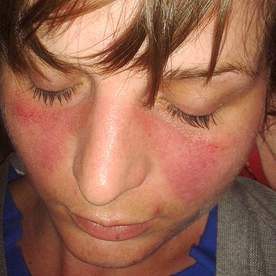
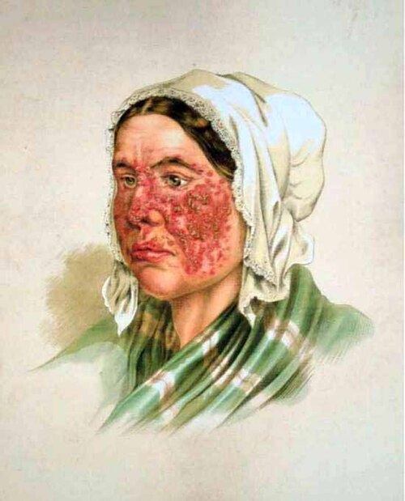

# LÚPUS ERITEMATOSO SISTÊMICO PEDIÁTRICO

O Lúpus Eritematoso Sistêmico Pediátrico, ou Juvenil (LESJ), não é apenas uma versão "em miniatura" da doença do adulto. Se você levar essa mentalidade para a prova de residência, vai errar questões. Na pediatria, o lúpus é mais agressivo, tem maior incidência de nefrite, maior envolvimento do sistema nervoso central e uma carga inflamatória muito mais alta.

Quando falamos em LESJ, estamos tratando de uma doença autoimune multissistêmica crônica, caracterizada pela produção de autoanticorpos e formação de imunocomplexos que se depositam nos tecidos, gerando inflamação. O diagnóstico é feito em pacientes que iniciam os sintomas antes dos 18 anos de idade.

## Epidemiologia e a Diferença de Gênero

Diferente da infância precoce, onde a proporção entre meninos e meninas é mais equilibrada, após a puberdade a predominância feminina explode, chegando a uma proporção de 9 para 1. Isso ocorre devido à influência estrogênica na modulação da resposta imune.

Um ponto que as bancas adoram: o LESJ representa cerca de 15% a 20% de todos os casos de lúpus. O diagnóstico antes dos 5 anos é raro e deve sempre acender um alerta para o "Lúpus Monogênico", onde uma única mutação genética (geralmente em proteínas do sistema complemento como C1q, C2 ou C4) causa a doença.

*Figura 1 - Eritema malar em asa de borboleta, manifestação cutânea clássica do Lúpus Eritematoso Sistêmico Juvenil. Fonte: Doktorinternet, CC BY-SA 4.0 | Wikimedia Commons*

## Fisiopatologia: O Porquê da Autoimunidade

Para entender o lúpus, você precisa entender o conceito de "falha na limpeza". Normalmente, nossas células entram em apoptose (morte celular programada) e o sistema imune limpa esses restos celulares de forma silenciosa.

No paciente com lúpus, existe um defeito nesse clareamento de restos apoptóticos. O material nuclear (DNA, histonas, proteínas nucleares) fica exposto ao sistema imune por mais tempo do que deveria. O corpo, então, reconhece esse material "próprio" como "estranho" e passa a produzir anticorpos contra o seu próprio núcleo. Daí vem o nome Fator Antinuclear (FAN).

Esses autoanticorpos se ligam aos antígenos circulantes, formando imunocomplexos. Esses complexos viajam pelo sangue e "entalam" em pequenos vasos, especialmente nos glomérulos renais, na pleura, no pericárdio e na pele. Onde o imunocomplexo para, ele ativa o sistema complemento, gera quimiotaxia de neutrófilos e causa destruição tecidual. É uma Reação de Hipersensibilidade Tipo III.

## Critérios Diagnósticos (ACR/EULAR 2019)

Esqueça os critérios antigos de apenas "4 de 11". A reumatologia moderna utiliza os critérios EULAR/ACR 2019, que trouxeram uma lógica de pontuação.

O primeiro passo é o **Critério de Entrada**: O paciente TEM que ter um FAN positivo (título maior ou igual a 1:80 em células HEp-2). Se o FAN for negativo, você nem continua a pontuação para lúpus, a menos que haja uma suspeita clínica absurdamente alta, mas para a prova, FAN negativo descarta LESJ.

Com o FAN positivo, somamos pontos em domínios clínicos e imunológicos. Se o paciente somar 10 ou mais pontos, o diagnóstico está firmado.

### Tabela 1: Pontuação Resumida (Critérios 2019)

| Domínio | Manifestação (Exemplos) | Pontos |
| --- | --- | --- |
| Constitucional | Febre | 2 |
| Cutâneo | Rash malar ou Lúpus discoide | 6 |
| Articular | Artrite ou rigidez matinal | 6 |
| Neurológico | Convulsão ou Psicose | 5 |
| Serosite | Derrame pleural ou pericárdico | 6 |
| Hematológico | Leucopenia ou Trombocitopenia | 4 |
| Renal | Proteinúria > 0,5g/24h ou Nefrite na biópsia | 4 a 10 |
| Imunológico | Anti-dsDNA ou Anti-Sm positivo | 6 |
| Complemento | C3 baixo E C4 baixo | 4 |

Cuidado: Você só conta a pontuação mais alta dentro de cada domínio. Se o paciente tem derrame pleural e pericárdico, ele ganha os pontos de serosite apenas uma vez.

## Manifestações Clínicas: Onde o Aluno Erra

### O Rash Malar e seus Miméticos

O exantema em "asa de borboleta" é clássico: eritema que poupa o sulco nasolabial. Se a questão descrever um exantema que envolve o sulco nasolabial, pense em outra coisa.

Aqui entra uma pegadinha clássica de prova: o **Eritema Infeccioso (Quinta Doença)**, causado pelo Parvovírus B19. Ele também faz a face em "esbofetada" (asa de borboleta), mas a evolução é diferente. No eritema infeccioso, após o rash facial, surge um exantema rendilhado nos membros que piora com sol ou exercício físico. Além disso, o Parvovírus pode causar artralgia, simulando perfeitamente um início de lúpus. Como diferenciar? O lúpus terá outros marcadores (citopenias, FAN, alteração renal) e o eritema infeccioso é autolimitado.

### Manifestações Hematológicas

O lúpus é uma "fábrica" de citopenias. No MedEvo, sempre reforçamos que, diante de uma anemia em paciente com lúpus, você deve olhar o Coombs Direto.

- Anemia de doença crônica: Normo/Normo, ferro baixo, ferritina alta (comum).

- Anemia Hemolítica Autoimune: Reticulócitos altos, bilirrubina indireta alta, LDH alto e **Coombs Direto positivo**. Isso pontua nos critérios!

- Leucopenia (< 4.000) e Linfopenia (< 1.000): Muito comuns e ajudam no diagnóstico.

- Trombocitopenia (< 100.000): Pode ser a primeira manifestação da doença.

### Acometimento Renal (A grande vilã)

A nefrite lúpica ocorre em até 80% das crianças com LESJ, muito mais que nos adultos. Ela define o prognóstico. Toda criança com suspeita de lúpus precisa de um sumário de urina (EAS) e relação proteína/creatinina urinária.

Se houver hematúria, cilindros hemáticos ou proteinúria significativa, a biópsia renal é mandatória. Não tratamos nefrite lúpica grave "no escuro". A classificação vai de I a VI, sendo a Classe IV (Glomerulonefrite Proliferativa Difusa) a mais comum e mais grave no lúpus pediátrico.

### Serosites

Derrame pleural e pericárdico ocorrem em cerca de 30% dos casos. Na prova, se aparecer um adolescente com dor torácica ventilatório dependente e febre, pense em serosite. Embora o tamponamento cardíaco seja raro, a pericardite é a manifestação cardíaca mais frequente no LESJ.

## Autoanticorpos: O que cada um diz?

Entender os anticorpos é fundamental para não apenas decorar, mas raciocinar a questão.

- **FAN (Anticorpo Antinuclear):** Alta sensibilidade (99%), mas baixa especificidade. Muita gente saudável tem FAN positivo em títulos baixos. Ele serve para "entrar" no diagnóstico.

- **Anti-dsDNA (DNA dupla hélice):** Muito específico. Sua presença quase confirma o diagnóstico. Além disso, ele se correlaciona com **atividade de doença**, especialmente a nefrite. Se o título de anti-dsDNA está subindo e o complemento (C3/C4) está caindo, a nefrite está vindo.

- **Anti-Sm (Smith):** O mais específico de todos. Se estiver presente, é lúpus. Porém, tem baixa sensibilidade (apenas 30% dos pacientes têm).

- **Anti-Ro (SSA) e Anti-La (SSB):** Associados a lúpus cutâneo, fotossensibilidade e, crucialmente, ao **Lúpus Neonatal**.

- **Anti-P Ribossomal:** Associado ao lúpus neuropsiquiátrico (psicose lúpica).

*Figura 2 - Ilustração histórica do Lúpus Eritematoso, mostrando lesões cutâneas características. Fonte: Atlas der Hautkrankheiten, Domínio Público | Wikimedia Commons*

## Diagnóstico Diferencial: A Arte da Exclusão

O LESJ é o grande mímico da pediatria. Você precisa diferenciar de:

- **Dermatomiosite Juvenil (DMJ):** Também tem rash facial, mas apresenta o **Heliótropo** (edema e eritema violáceo em pálpebras) e as **Pápulas de Gottron** (lesões descamativas sobre as articulações dos dedos). A fraqueza no LESJ é por dor ou anemia; na DMJ, é fraqueza muscular proximal real (Sinal de Gowers positivo).

- **Febre Reumática:** A artrite da febre reumática é migratória e muito dolorosa, respondendo rápido a aspirina. A artrite do lúpus é aditiva e persistente, embora raramente deformante.

- **Doença de Behçet:** Se a questão trouxer úlceras orais recorrentes associadas a **úlceras genitais** e uveíte, pense em Behçet, não em lúpus.

- **Febre Familiar do Mediterrâneo (FFM):** Se houver febre recorrente, dor abdominal (peritonite estéril) e ancestralidade específica, pense em FFM. O tratamento aqui é com Colchicina.

### Tabela 2: Diferencial de Exantemas e Fraqueza

| Doença | Característica do Exantema | Outros Achados Chave |
| --- | --- | --- |
| LESJ | Asa de borboleta (poupa sulco) | Citopenias, Nefrite, FAN+ |
| Eritema Infeccioso | Asa de borboleta + Rendilhado | Autolimitado, Pós-exercício |
| Dermatomiosite | Heliótropo e Pápulas de Gottron | Fraqueza proximal, CPK alta |
| Febre Reumática | Eritema Marginado (raro) | Cardite, Coreia, ASLO+ |

## Tratamento: Estratégia e Doses

O tratamento do LESJ é individualizado, mas existem regras de ouro que você não pode esquecer.

### Medidas Não-Farmacológicas

- **Fotoproteção:** Fundamental. A luz UV causa apoptose dos queratinócitos, expondo antígenos e desencadeando crises. Uso de protetor solar FPS > 30, reaplicado a cada 2 a 3 horas.

- **Suplementação:** Cálcio (1.000 a 1.200 mg/dia) e Vitamina D (800 a 1.000 UI/dia) para todos os pacientes em uso de corticoide.

- **Atividade Física:** Estimulada para evitar perda de massa óssea e muscular, mas apenas quando a doença não estiver em fase aguda.

### Tratamento Farmacológico

#### 1. Antimaláricos (Hidroxicloroquina)

Segundo as diretrizes da Sociedade Brasileira de Reumatologia e da SBP, **todo paciente com lúpus deve usar hidroxicloroquina**, a menos que haja contraindicação absoluta (raro).

- **Por que?** Ela reduz o número de surtos (flares), melhora o perfil lipídico, reduz risco de trombose e protege o rim a longo prazo.

- **Dose:** Máximo de 5 mg/kg/dia para evitar toxicidade retiniana.

- **Monitoramento:** Exame oftalmológico anual (campo visual e tomografia de coerência óptica).

#### 2. Corticosteroides

São a base para controlar a inflamação aguda.

- **Leve (Pele/Articulação):** Prednisona 0,5 mg/kg/dia.

- **Grave (Nefrite/SNC/Hematológico):** Pulsoterapia com Metilprednisolona (30 mg/kg/dia, máximo 1g, por 3 dias) seguida de Prednisona oral (1 a 2 mg/kg/dia).

- **Atenção:** O objetivo é sempre o desmame para a menor dose possível ("poupadores de corticoide") devido aos efeitos colaterais na criança (baixa estatura, obesidade, estrias, catarata, osteoporose).

#### 3. Imunossupressores

Usados para manter a remissão e poupar corticoide.

- **Metotrexato:** Excelente para manifestações cutâneas e articulares.

- **Azatioprina:** Usada em manifestações hematológicas e manutenção de nefrite.

- **Micofenolato de Mofetila (MMF):** Primeira linha para Nefrite Lúpica classes III e IV.

- **Ciclofosfamida:** Reservada para casos graves de nefrite ou envolvimento do SNC. É uma medicação citotóxica com risco de infertilidade.

#### 4. Biológicos

- **Belimumabe:** Já aprovado para uso pediátrico em maiores de 5 anos. É um anticorpo contra o BLyS (estimulador de linfócito B).

- **Rituximabe:** Anti-CD20 (depleta linfócitos B). Usado em casos refratários, especialmente trombocitopenia grave ou nefrite resistente.

### Tabela 3: Escalonamento Terapêutico

| Gravidade | Manifestação | Tratamento Sugerido |
| --- | --- | --- |
| Leve | Cutâneo, Artrite | HCQ + Corticoide dose baixa + MTX |
| Moderada | Serosite, Citopenias | HCQ + Corticoide dose média + Azatioprina |
| Grave | Nefrite III/IV, Psicose | Pulsoterapia + MMF ou Ciclofosfamida |

## Situações Especiais e Complicações

### Lúpus Neonatal (LN)

Não é lúpus sistêmico. É uma doença causada pela passagem transplacentária de anticorpos maternos (**Anti-Ro/SSA e Anti-La/SSB**). A mãe pode ser assintomática no momento do parto!

As manifestações são:

- **Cutâneas:** Lesões eritematosas, descamativas, muitas vezes periorbitárias ("olhos de guaxinim"). São transitórias e desaparecem conforme os anticorpos da mãe somem do sangue do bebê (cerca de 6 meses).

- **Hematológicas:** Citopenias transitórias.

- **Cardíacas:** O temido **Bloqueio Cardíaco Congênito (BCC) de 3º grau**. Diferente da pele, o bloqueio é **PERMANENTE** e irreversível. Muitas vezes o diagnóstico é feito no pré-natal por bradicardia fetal. O tratamento do BCC geralmente requer marcapasso definitivo.

### Imunossupressão e Parasitoses

Dica do Dr. Will: No Brasil, antes de iniciar altas doses de corticoide ou pulsoterapia, você deve considerar a profilaxia para *Strongyloides stercoralis*. O uso de corticoide pode causar a síndrome de hiperinfecção por estrongiloides. A diretriz sugere o uso de Albendazol ou Ivermectina em áreas endêmicas.

### Puberdade e Crescimento

O LESJ e o uso crônico de corticoides são causas importantes de atraso constitucional do crescimento e puberdade tardia. Além disso, a própria inflamação crônica consome as reservas metabólicas da criança. Outra causa de baixa estatura e atraso de desenvolvimento que cai em prova é a **Tireoidite de Hashimoto**, que pode estar associada ao lúpus como uma síndrome poliglandular autoimune.

## Prognóstico e Metas

A sobrevida no LESJ melhorou muito, passando de 10% na década de 50 para mais de 90% hoje. No entanto, a morbidade ainda é alta.

As metas terapêuticas são:

- Alcançar o estado de "baixa atividade de doença" ou remissão.

- Dose de Prednisona ≤ 0,15 mg/kg/dia (ou descontinuação total).

- Prevenir danos em órgãos-alvo (especialmente rim).

Lembre-se: O lúpus na criança é uma corrida de longa distância. O tratamento agressivo inicial visa garantir que esse paciente chegue à vida adulta com rins funcionantes e sem sequelas neurológicas.

## Pontos-Chave para Prova

- **Critério de Entrada:** FAN positivo (≥ 1:80) é obrigatório para usar os critérios EULAR/ACR 2019.

- **Nefrite Lúpica:** Muito mais comum e grave na criança. A Classe IV é a mais frequente. Biópsia é fundamental para guiar o tratamento.

- **Anti-dsDNA:** Correlaciona-se com atividade de doença e risco de nefrite. Se o DNA sobe e o complemento cai, há atividade.

- **Anti-Sm:** É o anticorpo mais específico para o diagnóstico de LES.

- **Hidroxicloroquina:** Deve ser prescrita para TODOS os pacientes, salvo contraindicação. Dose máxima 5 mg/kg/dia.

- **Lúpus Neonatal:** Causado por Anti-Ro (SSA). O Bloqueio Cardíaco Congênito é a complicação mais grave e é permanente.

- **Diferencial de Rash:** Lúpus (poupa sulco nasolabial) vs. Eritema Infeccioso (rendilhado, pós-exercício) vs. Dermatomiosite (Heliótropo e Gottron).

- **Dermatomiosite Juvenil:** Fraqueza muscular proximal + Heliótropo + Pápulas de Gottron + Elevação de enzimas musculares (CPK, Aldolase).

- **Serosite:** Pericardite é a manifestação cardíaca mais comum. Derrame pleural também pontua no diagnóstico.

- **Tratamento de Escolha para Nefrite Grave:** Micofenolato de Mofetila ou Ciclofosfamida, sempre precedidos por Pulsoterapia com Metilprednisolona.

- **Profilaxia:** Sempre pensar em *Strongyloides* antes de pulsar corticoide em pacientes de áreas endêmicas.

- **O que NÃO fazer:** Nunca tratar uma suspeita de nefrite lúpica grave sem biópsia, a menos que o paciente esteja instável demais para o procedimento.

- **Pegadinha de Prova:** A alternativa dirá que o FAN negativo exclui lúpus. No contexto de prova, isso é geralmente verdadeiro (sensibilidade > 99%).

- **Valores Memorizáveis:** Proteinúria > 0,5 g/24h é o corte para pontuar no domínio renal. 💡

 Cópia offline para consulta pessoal.
 Fonte original:
 [https://www.medevo.com.br/material-apoio/ler/5d4fb25b-cbe3-4a7b-bfc9-45fb21a68571](https://www.medevo.com.br/material-apoio/ler/5d4fb25b-cbe3-4a7b-bfc9-45fb21a68571)
