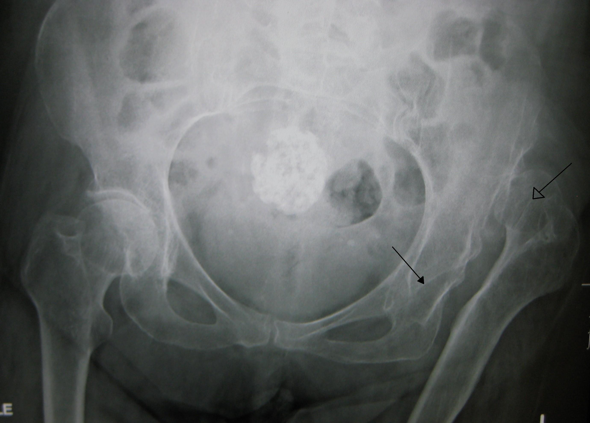
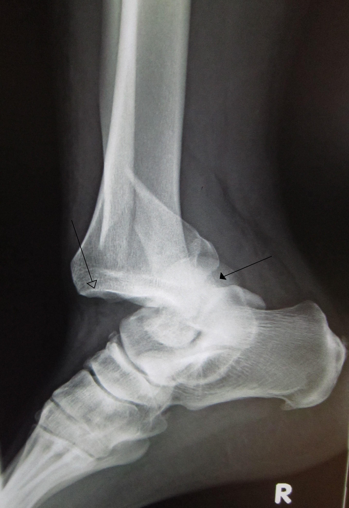
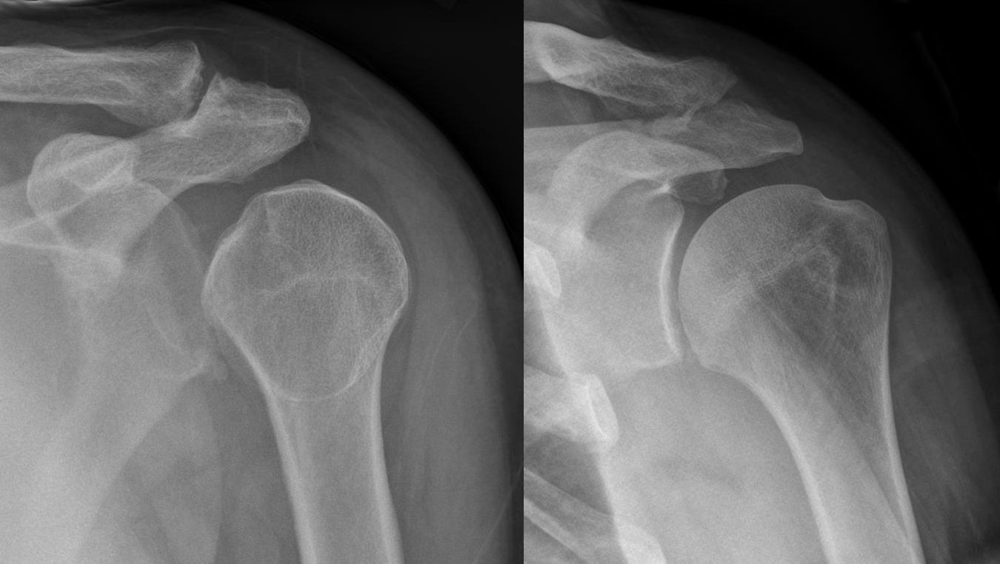

# LUXAÇÕES

Para começarmos a falar de luxações, você precisa tirar uma ideia da cabeça: a de que luxação é um "entorse forte". Na prova de residência e na vida real, luxação é uma **emergência ortopédica**.

Quando falamos que uma articulação luxou, estamos dizendo que houve a perda completa do contato entre as superfícies articulares. Se o contato for parcial, chamamos de subluxação. Por que essa distinção é vital? Porque a luxação implica, obrigatoriamente, em lesão capsuloligamentar grave e, frequentemente, coloca em risco a viabilidade do membro por compressão ou estiramento de estruturas neurovasculares.

Como professor, vejo muitos alunos negligenciarem o exame neurovascular inicial. Lembre-se: o osso a gente coloca no lugar depois, mas um nervo isquêmico ou uma artéria rompida têm um cronômetro correndo contra você.

## Princípios Gerais e Fisiopatologia

Por que uma articulação luxa? Geralmente, precisamos de um trauma de alta energia (acidentes automobilísticos, quedas de altura) que vença a resistência dos ligamentos e da cápsula articular.

A fisiopatologia da luxação envolve três componentes que você deve avaliar em toda questão de prova:

- **Dano Mecânico:** A saída da cabeça articular do seu encaixe (ex: cabeça do fêmur saindo do acetábulo).

- **Dano Vascular:** O deslocamento ósseo pode "dobrar" (kinking) ou romper artérias adjacentes. No quadril, isso gera necrose; no joelho, pode gerar amputação.

- **Dano Neurológico:** Nervos que passam "colados" à articulação são estirados.

Um conceito que o Dr. Will sempre reforça nas discussões do MedEvo é o da **redução incruenta imediata**. Salvo raras exceções (como fraturas associadas que impedem a manobra), a luxação deve ser reduzida o mais rápido possível, preferencialmente sob sedação, para relaxar a musculatura que está "prendendo" a articulação na posição anômala.

## Luxação Posterior de Quadril

Esta é a "queridinha" das bancas de ortopedia. Por que? Porque ela tem uma apresentação clínica clássica e complicações graves que testam se você é um médico atento ou apenas um decorador de nomes.

### Mecanismo de Trauma

O cenário típico é o "trauma do painel" (dashboard injury). O paciente está no banco do passageiro, com o quadril flexionado, e o joelho bate no painel do carro em uma colisão frontal. A força é transmitida pelo eixo do fêmur, empurrando a cabeça femoral para trás, rompendo a cápsula posterior e saindo do acetábulo.

*Figura 1 - Radiografia AP da bacia demonstrando luxação do quadril esquerdo. A seta fechada marca o acetábulo vazio, a seta aberta marca a cabeça femoral deslocada. Fonte: James Heilman, MD, CC BY-SA 3.0 | Wikimedia Commons*

## Quadro Clínico: A Posição do "Banhista Envergonhado"

Você não pode errar isso. Na luxação posterior, o membro encontra-se em:

- **Flexão**

- **Adução**

- **Rotação Interna**

- **Encurtamento aparente**

**Dica de Professor:** Por que rotação interna? Porque a cabeça do fêmur agora está atrás do acetábulo, e a tensão dos músculos rotadores externos e da cápsula anterior restante "puxa" o fêmur para essa posição característica. Se a questão descrever rotação externa, pense em luxação anterior (rara) ou fratura de colo de fêmur.

### Complicações: O que a banca vai te perguntar

Aqui mora o perigo. Existem duas complicações que você deve procurar ativamente:

-

**Lesão do Nervo Ciático:** O nervo ciático passa exatamente atrás do acetábulo. Na luxação posterior, ele pode ser comprimido ou estirado.

- **Pegadinha de prova:** A banca vai perguntar qual parte do nervo ciático é mais afetada. Resposta: O **componente fibular**. O paciente apresentará "pé caído" (incapacidade de dorsiflexão).

-

**Necrose Avascular da Cabeça do Fêmur (NAV):** A vascularização da cabeça femoral é precária, dependendo principalmente das artérias circunflexas. A luxação rompe ou comprime esses vasos.

- **O número mágico:** Você tem até **6 horas** para reduzir essa luxação. Após 6 horas, o risco de necrose aumenta exponencialmente. Se a questão diz que o paciente chegou há 10 horas, o prognóstico já é reservado.

*Figura 2 - Luxação traumática da articulação tibiotalar do tornozelo com fratura fibular distal. Fonte: James Heilman, MD, CC BY-SA 3.0 | Wikimedia Commons*

## Diagnóstico Diferencial e Conduta

O diagnóstico é clínico + radiológico (RX de bacia AP, Alar e Obturatriz). No AP, você verá a cabeça do fêmur menor que a contralateral (porque está mais próxima do filme/chassi) e acima do teto acetabular.

**Tabela 1: Diferenciação das Luxações de Quadril**

| Característica | Luxação Posterior (90%) | Luxação Anterior (10%) |
| --- | --- | --- |
| **Mecanismo** | Impacto no joelho com quadril flexionado | Extensão e rotação externa forçada |
| **Atitude do Membro** | Flexão, Adução, Rotação Interna | Flexão, Abdução, Rotação Externa |
| **Nervo Afetado** | Ciático (Fibular) | Femoral (raro) |
| **Imagem (RX AP)** | Cabeça femoral parece menor | Cabeça femoral parece maior |

## Luxação de Joelho

Se a luxação de quadril é clássica, a de joelho é **temida**. Ela é considerada uma das maiores emergências da ortopedia.

### Por que é tão grave?

Para o joelho luxar, pelo menos dois dos quatro principais ligamentos (LCA, LCP, LCM, LCL) devem ser rompidos. Mas o problema não é o ligamento; é a **Artéria Poplítea**.

A artéria poplítea está "ancorada" acima (no hiato dos adutores) e abaixo (no arco do músculo sóleo). Quando o fêmur e a tíbia se desalinham, a artéria não tem para onde fugir e sofre estiramento ou transecção.

### O Exame Vascular é Obrigatório

Cuidado: 50% das luxações de joelho reduzem espontaneamente antes de chegar ao hospital. O paciente chega com o joelho inchado, instável, mas "no lugar". Se você ignorar isso, o paciente pode evoluir com síndrome compartimental e amputação.

**A regra de ouro:** Todo trauma de joelho com instabilidade multidirecional deve ser tratado como luxação de joelho até que se prove o contrário.

- Palpar pulsos (pedioso e tibial posterior).

- Medir o **Índice Tornozelo-Braquial (ITB)**.

- ITB > 0,9: Observação seriada por 24h.

- ITB < 0,9: Angiotomografia obrigatória.

### Complicações Neurológicas

O **Nervo Fibular Comum** é o mais afetado, pois ele contorna a cabeça da fíbula e é muito sensível ao estiramento lateral. O paciente terá perda da sensibilidade no dorso do pé e perda da dorsiflexão.

## Luxação de Ombro (Glenoumeral)

Esta é a luxação mais comum no pronto-socorro, devido à grande mobilidade e pouca estabilidade óssea da articulação.

### Luxação Anterior (95%)

Ocorre geralmente por queda com o braço em abdução e rotação externa.

- **Sinal do Ombro em Cabide (ou Sinal da Epauleta):** A perda do contorno arredondado do deltoide, pois a cabeça do úmero não está mais lá para "preencher" o músculo.

- **Nervo Afetado:** Nervo Axilar. Teste a sensibilidade na região do "distintivo militar" (face lateral do deltoide).

### Luxação Posterior (Rara e Perigosa)

Muitas vezes passa despercebida no RX inicial.

- **Cenário clássico:** Crise convulsiva ou choque elétrico. A contração violenta dos músculos rotadores internos (que são mais fortes) "puxa" a cabeça do úmero para trás.

- **Sinal da Lâmpada:** No RX AP, o úmero em rotação interna fixa parece uma lâmpada redonda, perdendo a anatomia do colo.

### Lesões Associadas que caem em prova

- **Lesão de Bankart:** Avulsão do lábio (labrum) anteroinferior da glenoide. É o que causa a instabilidade crônica.

- **Lesão de Hill-Sachs:** Fratura por impacção da parte posterolateral da cabeça do úmero contra a borda da glenoide.

**Tabela 2: Lesões Associadas na Luxação de Ombro**

| Nome da Lesão | Descrição | Importância Clínica |
| --- | --- | --- |
| **Bankart** | Lesão do labrum anterior | Principal causa de luxação recidivante |
| **Hill-Sachs** | "Entalhe" na cabeça do úmero | Indica que houve luxação anterior |
| **Lesão Nervosa** | Nervo Axilar | Fraqueza do deltoide e hipoestesia lateral |

## Luxação de Cotovelo

O cotovelo é a segunda luxação mais comum em adultos e a primeira em crianças. A grande maioria é **posterior** ou posterolateral.

### A Tríade Terrível do Cotovelo

Este é um termo que você precisa conhecer, pois o prognóstico é muito pior. Consiste em:

- Luxação do cotovelo.

- Fratura da cabeça do rádio.

- Fratura do processo coronoide da ulna.

Por que "terrível"? Porque a estabilidade do cotovelo é destruída. Quase sempre exige cirurgia. Se a luxação for simples (sem fratura), o tratamento costuma ser redução e imobilização curta (1-2 semanas) para evitar a rigidez, que é a complicação mais comum do cotovelo.

### Exame Físico e Nervos

No cotovelo, os nervos em risco são o **Ulnar** (mais comum) e o **Mediano**. Sempre teste a sensibilidade do 5º dedo (ulnar) e a pinça do polegar (mediano/interósseo anterior) antes e depois de reduzir.

## Diagnóstico por Imagem: O que pedir?

Não peça apenas "RX de membro". Seja específico. Em luxações, precisamos de pelo menos duas incidências ortogonais (90 graus entre si).

- **Quadril:** AP de Bacia + Alar e Obturatriz (incidências de Judet) para avaliar o acetábulo.

- **Ombro:** Série de trauma (AP verdadeiro, Perfil Escapular em Y e Axilar). Nunca aceite apenas o AP, ele pode esconder uma luxação posterior.

- **Joelho:** AP e Perfil. Se houver suspeita vascular, o padrão-ouro para diagnóstico de lesão arterial é a Arteriografia, mas na prática usamos a **Angiotomografia**.

## Tratamento: A Arte da Redução

A redução deve ser feita sob sedação e analgesia. Tentar reduzir um quadril com o paciente acordado é lutar contra os músculos mais fortes do corpo; você não vai ganhar, e ainda pode causar uma fratura iatrogênica do colo do fêmur.

### Manobras de Redução (Conhecimento Complementar)

- **Quadril (Manobra de Allis):** Paciente em decúbito dorsal, o médico sobe na maca, flexiona o joelho e o quadril do paciente e traciona o fêmur para cima (em direção ao teto).

- **Ombro (Manobra de Kocher ou Hipócrates):** Existem dezenas, mas a tração-contratração é a mais segura. Evite alavancas violentas.

### Quando a Redução Incruenta Falha?

Se você tentou duas vezes e não conseguiu, algo está atrapalhando (partes moles presas, fragmentos ósseos). O próximo passo é a **Redução Cruenta (Cirúrgica)**.

**Tabela 3: Metas e Tempos no Tratamento das Luxações**

| Articulação | Tempo Ideal para Redução | Conduta Pós-Redução |
| --- | --- | --- |
| **Quadril** | < 6 horas (Urgência máxima) | CT para ver fragmentos intra-articulares |
| **Joelho** | Imediato | Avaliação vascular seriada (24h) |
| **Ombro** | O quanto antes | Tipóia e fortalecimento de manguito |
| **Cotovelo** | Imediato | Testar estabilidade e evitar rigidez |

## Complicações Tardias

Mesmo que você faça tudo certo, o paciente pode ter problemas no futuro.

- **Rigidez Articular:** Especialmente no cotovelo. O sangue dentro da articulação (hemartrose) gera fibrose.

- **Ossificação Heterotópica:** Formação de osso dentro do músculo ou cápsula após o trauma. Comum no cotovelo e quadril.

- **Artrose Pós-Traumática:** A cartilagem sofreu um impacto brutal. Mesmo no lugar, ela pode degenerar precocemente.

- **Instabilidade Recidivante:** Comum no ombro de pacientes jovens. Quanto mais jovem o primeiro episódio, maior a chance de luxar de novo.

## Situações Especiais

### Idosos

No idoso, um trauma que causaria luxação em um jovem frequentemente causa **fratura**. Se um idoso chega com o membro encurtado e em rotação externa após uma queda da própria altura, 99% de chance de ser fratura de colo de fêmur ou transtrocantérica, não luxação. A luxação no idoso geralmente ocorre em quem já tem uma prótese (luxação de artroplastia).

### Crianças

Cuidado com a **Luxação da Cabeça do Rádio (Pronação Dolorosa)**. A criança é puxada pelo braço, e o ligamento anular "escorrega" para dentro da articulação. O tratamento é simples: supinação e flexão do antebraço. Não precisa de RX se a história for clássica.

## Erros Comuns que Reprovam

Um erro clássico é focar no osso e esquecer a **Síndrome Compartimental**. Em luxações de joelho e cotovelo, o edema e o sangramento podem aumentar a pressão nos compartimentos musculares. Se o paciente tem dor desproporcional ao exame físico e dor ao alongamento passivo dos dedos, não espere o pulso sumir (pulso sumir é sinal tardio!). Chame a ortopedia para fasciotomia.

Outro erro: reduzir uma luxação de ombro sem fazer o RX prévio. E se houver uma fratura de colo cirúrgico do úmero associada? Ao tentar reduzir, você pode deslocar a fratura e lesar o feixe vasculonervoso. **Sempre faça RX pré-redução**, a menos que o paciente esteja em um local sem nenhum recurso e o neurovascular esteja comprometido.

## Pontos-Chave para Prova 💡

- **Luxação Posterior de Quadril:** Posição em Flexão + Adução + Rotação Interna.

- **Nervo Ciático:** É o mais lesado no quadril (especialmente o ramo fibular -> pé caído).

- **Necrose Avascular (NAV):** O risco aumenta drasticamente após 6 horas de luxação de quadril não reduzida.

- **Luxação de Joelho:** É uma emergência vascular. A artéria poplítea é a estrutura de maior risco.

- **Índice Tornozelo-Braquial (ITB):** Se < 0,9 na luxação de joelho, peça Angio-TC imediatamente.

- **Luxação Anterior de Ombro:** Mais comum (95%). Lesa o nervo axilar (sensibilidade do deltoide).

- **Luxação Posterior de Ombro:** Associada a crises convulsivas e choque elétrico. Sinal da lâmpada no RX.

- **Lesão de Bankart e Hill-Sachs:** Patognomônicas de instabilidade anterior do ombro.

- **Tríade Terrível do Cotovelo:** Luxação + Fratura da Cabeça do Rádio + Fratura do Coronoide.

- **Redução Incruenta:** Deve ser feita sob sedação para evitar fraturas iatrogênicas e dor.

- **RX em duas incidências:** Obrigatório para não comer bola em luxações posteriores (especialmente ombro).

- **Pronação Dolorosa:** Trauma por tração em crianças; tratamento é manobra de redução, sem necessidade de RX inicial.

- **Contraindicação Absoluta:** Não tente redução incruenta se houver fratura do colo do fêmur associada (risco de desvascularização total).

- **Primeira Escolha no Joelho:** Avaliação do status vascular antes de qualquer outra medida definitiva.

- **O que NÃO fazer:** Nunca dar alta para uma luxação de joelho reduzida sem 24h de observação vascular, mesmo com pulsos presentes.

- **Sinal da Epauleta:** Típico da luxação anterior do ombro (perda do contorno do deltoide).

Lembre-se do que discutimos aqui: a ortopedia em provas de residência não quer que você saiba operar, mas sim que você saiba identificar o que coloca a vida ou o membro do paciente em risco. Se você dominar o exame neurovascular e as posições clássicas, as questões de luxação serão pontos garantidos no seu checklist.

 Cópia offline para consulta pessoal.
 Fonte original:
 [https://www.medevo.com.br/material-apoio/ler/6a7ec147-7b27-4058-85e5-1d1673f5c6b5](https://www.medevo.com.br/material-apoio/ler/6a7ec147-7b27-4058-85e5-1d1673f5c6b5)
