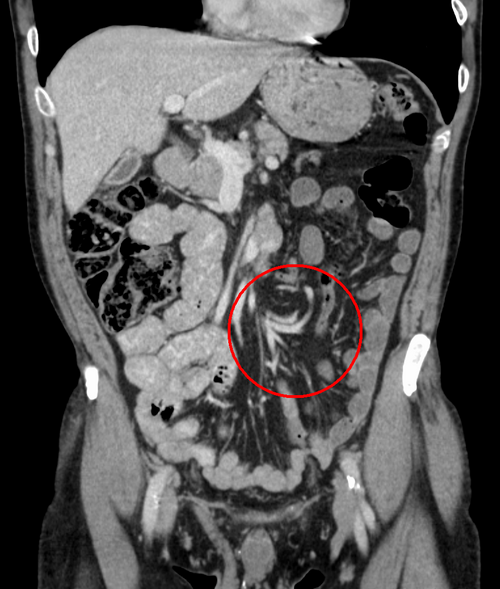
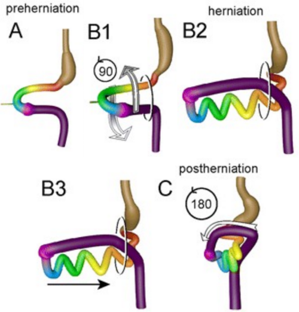

# MÁ-ROTAÇÃO INTESTINAL E VÓLVULO

Para entender a má-rotação intestinal, você precisa parar de tentar decorar posições anatômicas e começar a visualizar o movimento. Na prova de residência, o examinador quer saber se você entende a embriologia, pois é ela que explica por que a cirurgia é feita de determinada maneira. Se você compreender o "passeio" que o intestino dá para fora e para dentro do abdome, você nunca mais errará uma questão sobre as Bandas de Ladd ou a posição da artéria mesentérica superior.

## O "Porquê" Embriológico: A Dança dos 270 Graus

Tudo começa entre a 4ª e a 12ª semana de gestação. O intestino cresce muito mais rápido que a cavidade abdominal. Como não há espaço, ele sofre uma herniação fisiológica para dentro do cordão umbilical.

O ponto crucial aqui é a **Artéria Mesentérica Superior (AMS)**. Ela serve como o eixo central de um carrossel. O intestino precisa girar 270 graus no sentido anti-horário em torno dessa artéria.

- **Primeira fase:** Ocorre fora do abdome (90°).

- **Segunda fase:** Ocorre durante o retorno para a cavidade abdominal (mais 180°).

- **Terceira fase:** Fixação. O ceco vai para o quadrante inferior direito e o duodeno se fixa atrás da AMS.

Quando esse processo é interrompido em qualquer etapa, temos a má-rotação. O problema não é apenas o intestino estar "no lugar errado". O problema real, e o que mata o paciente, é que a base do mesentério (onde passam os vasos que nutrem o intestino) fica extremamente estreita.

Imagine um balão de festa: se você segura a base com dois dedos e gira o balão, você torce o gargalo. É exatamente isso que acontece no **Vólvulo de Intestino Médio**. O intestino gira sobre seu próprio suprimento sanguíneo, levando à isquemia total em questão de horas.

*Figura 1 - Radiografia abdominal demonstrando vólvulo intestinal com distensão de alças e nível hidroaéreo. Fonte: James Heilman, MD, CC BY-SA 3.0 | Wikimedia Commons*

## Quadro Clínico: O Sinal de Alerta que Você Não Pode Ignorar

Se você estiver de plantão e um recém-nascido (RN) apresentar **vômitos biliosos**, sua primeira, segunda e terceira hipóteses devem ser Má-Rotação com Vólvulo.

Muitos alunos erram em provas ao confundir com Estenose Hipertrófica do Piloro. Guarde isso: na Estenose de Piloro, o vômito é **não-bilioso** (leitoso), porque a obstrução é acima da ampola de Vater. No vólvulo, a obstrução é distal à drenagem biliar, logo, o vômito é verde.

### O RN com Vólvulo Agudo

O cenário clássico de prova é um RN previamente saudável, entre o 2º e o 10º dia de vida, que subitamente para de aceitar a dieta e começa com vômitos verdes.

- **Fase inicial:** O abdome pode estar plano e inocente. Não espere distensão abdominal importante no início, pois a obstrução é alta (duodenal).

- **Fase tardia:** Se houver distensão, dor à palpação e, principalmente, **hematoquezia** (sangue nas fezes), o intestino já está sofrendo isquemia. Aqui, o prognóstico cai drasticamente.

### O Paciente Crônico (Crianças Maiores e Adultos)

Nem toda má-rotação vira vólvulo na primeira semana de vida. Alguns pacientes chegam à vida adulta com sintomas vagos:

- Dor abdominal intermitente (cólica).

- Dificuldade de ganhar peso (má-absorção por congestão linfática crônica).

- Episódios de vômitos que melhoram sozinhos.

Aqui entra o Dr. Will, que sempre lembra nas discussões de caso do MedEvo: "A má-rotação é o grande simulador da pediatria". Às vezes, o paciente é diagnosticado erroneamente com refluxo gastroesofágico grave por meses antes de alguém pedir um exame contrastado.

*Figura 2 - Diagrama ilustrando as fases da rotação intestinal durante o desenvolvimento embrionário, incluindo a herniação fisiológica e o retorno das alças à cavidade abdominal. Fonte: Soffers et al., CC BY 4.0 | Wikimedia Commons*

## Diagnóstico: A Escolha do Exame Certo

Aqui as bancas adoram fazer pegadinhas. Qual o melhor exame? Depende do que você está procurando e da estabilidade do paciente.

### 1. Radiografia Simples (Rotina de Abdome Agudo)

Geralmente é o primeiro exame, mas raramente dá o diagnóstico definitivo.

- Pode mostrar o sinal da "bolha única" ou "dupla bolha" (sugerindo obstrução duodenal).

- Pode estar completamente normal. **Cuidado:** Um raio-X normal NÃO exclui má-rotação.

### 2. Seriografia Gastrointestinal Alta (REED) - O Padrão-Ouro

Para o diagnóstico de má-rotação (sem vólvulo necessariamente), este é o exame de escolha. O que buscamos?

- A junção duodeno-jejunal (ângulo de Treitz) deve estar à esquerda da coluna vertebral e no nível do piloro.

- Na má-rotação, o duodeno assume uma aparência em "saca-rolhas" ou simplesmente não cruza a linha média, descendo à direita da coluna.

### 3. Ultrassonografia de Abdome

Muito útil na emergência. O sinal patognomônico é o **Sinal do Redemoinho (Whirlpool Sign)**. Ele representa os vasos mesentéricos e o próprio mesentério se enrolando em torno da artéria mesentérica superior.

- Outro achado: Inversão da relação entre a Veia Mesentérica Superior (VMS) e a Artéria Mesentérica Superior (AMS). Normalmente, a veia fica à direita da artéria. Se estiver à esquerda, suspeite fortemente de má-rotação.

### 4. Tomografia Computadorizada

Mais comum em adultos. Também mostra o sinal do redemoinho e a inversão dos vasos mesentéricos. Em provas de residência focadas em cirurgia geral (adulto), o vólvulo de sigmoide é um diferencial importante, mas o "redemoinho" na TC de um adulto com dor súbita deve te fazer pensar em vólvulo de intestino médio por má-rotação congênita não diagnosticada.

| Exame | Achado Principal | Utilidade |
| --- | --- | --- |
| **Raio-X** | Dupla bolha ou gás distal escasso | Triagem inicial (pouco específico) |
| **Seriografia (REED)** | Ângulo de Treitz à direita e "Saca-rolhas" | **Padrão-Ouro** para anatomia |
| **Ultrassom** | Sinal do Redemoinho / Inversão VMS/AMS | Rápido, beira leito, vê vólvulo |
| **Tomografia** | Sinal do Redemoinho | Adultos ou casos duvidosos |

## Diagnóstico Diferencial: Não Confunda!

Na hora da prova, o examinador vai colocar várias causas de vômitos no RN. Você precisa ser cirúrgico na diferenciação:

| Patologia | Característica do Vômito | Achado Radiológico Típico |
| --- | --- | --- |
| **Má-Rotação/Vólvulo** | Bilioso (Verde) | Saca-rolhas na seriografia |
| **Estenose de Piloro** | Não-bilioso (Jato) | Sinal da oliva (USG) / Alcalose metabólica |
| **Atresia Duodenal** | Bilioso | Sinal da Dupla Bolha (sem gás distal) |
| **Atresia Jejunal** | Bilioso | Múltiplos níveis hidroaéreos |
| **Íleo Meconial** | Bilioso | Miolo de pão (Neuhauser) / Microcólon |

## Tratamento: O Procedimento de Ladd

Se o diagnóstico é Vólvulo de Intestino Médio, o tratamento é **Laparotomia de Emergência**. Não há tempo para "observar" ou tentar manobras conservadoras. Tempo é intestino.

O procedimento padrão é a **Cirurgia de Ladd**, descrita por William Ladd em 1936. É fundamental entender que esta cirurgia NÃO coloca o intestino na posição anatômica normal (ele nunca será "normal"). O objetivo é colocar o intestino em uma posição de **Não-Rotação**, que é segura.

### Os 4 Passos Obrigatórios da Cirurgia de Ladd:

-

**Destorção do Vólvulo:** O cirurgião entrega o intestino para fora (eventração) e gira no sentido **anti-horário** (pois o vólvulo geralmente ocorre no sentido horário).

- *Dica de ouro:* Se o intestino estiver isquêmico, coloca-se compressas mornas e espera-se. Se a necrose for óbvia e extensa, pode-se optar por um "Second Look" em 24-48 horas em vez de ressecar tudo de imediato.

-

**Lise das Bandas de Ladd:** Estas são bridas fibrosas que prendem o ceco (que está no lugar errado, no hipocôndrio direito) à parede abdominal, passando por cima do duodeno. São elas que causam a obstrução duodenal extrínseca. Precisamos seccioná-las para liberar o duodeno.

-

**Alargamento da Base do Mesentério:** Este é o passo mais importante para evitar que o vólvulo volte. O cirurgião separa o duodeno do cólon, abrindo o leque do mesentério para que a base deixe de ser um "pedículo estreito" e se torne larga.

-

**Apendicectomia Profilática:** Por que tirar um apêndice saudável? Porque, ao final da cirurgia, o ceco será posicionado no quadrante inferior **esquerdo**. Se esse paciente tiver apendicite no futuro, a dor será à esquerda, o que confundiria qualquer médico e atrasaria o diagnóstico. Por isso, removemos o apêndice agora.

**O que NÃO faz parte do Procedimento de Ladd?**
As bancas adoram dizer que se faz "fixação do ceco" ou "ileostomia de rotina". Isso está incorreto. O intestino é deixado livre. O intestino delgado fica todo à direita e o cólon todo à esquerda.

## Complicações e Prognóstico

A maior complicação é a **Síndrome do Intestino Curto**. Se o vólvulo não for diagnosticado a tempo, o cirurgião pode ser obrigado a ressecar metros de intestino necrótico. Isso deixa o RN dependente de Nutrição Parenteral Total (NPT) por longo prazo, com risco de colestase e infecções de cateter.

Outra complicação pós-operatória comum são as bridas (aderências), que podem causar novos quadros de obstrução intestinal mecânica ao longo da vida.

## Situações Especiais e Pegadinhas de Prova

### O Vólvulo de Sigmoide vs. Vólvulo de Intestino Médio

Embora o tema principal aqui seja a má-rotação pediátrica, as bancas de cirurgia geral misturam os conceitos.

- **Vólvulo de Sigmoide:** Típico de idosos, chagásicos ou pacientes com constipação crônica. O sinal no raio-X é o "Grão de Café" ou "U invertido". O tratamento inicial pode ser descompressão por colonoscopia se não houver peritonite.

- **Vólvulo de Intestino Médio:** É o da má-rotação. Emergência cirúrgica imediata. O sinal é o do "Redemoinho".

### Malformações Associadas

A má-rotação raramente vem sozinha. Ela está presente em quase 100% dos casos de:

- **Gastrosquise e Onfalocele:** Como o intestino estava fora do abdome, ele não teve como rotacionar e se fixar.

- **Hérnia Diafragmática Congênita:** O intestino estava no tórax, logo, a rotação foi prejudicada.

- **Heterotaxia (Situs Inversus):** Se o coração está do lado direito, espere que o intestino também tenha problemas de rotação.

### O Papel da Laparoscopia

Atualmente, a cirurgia de Ladd pode ser feita por via laparoscópica em pacientes **estáveis** e sem evidência de vólvulo (aqueles casos crônicos ou achados incidentais). Se houver suspeita de vólvulo agudo com comprometimento vascular, a laparotomia aberta ainda é a via mais segura para a maioria dos serviços, permitindo uma avaliação mais rápida da viabilidade intestinal.

## Resumo da Conduta no RN com Vômito Bilioso

- Estabilização inicial (Sonda Orogástrica para descompressão + Hidratação venosa).

- Raio-X de abdome (para excluir pneumoperitônio - perfuração).

- Se estável: Seriografia (REED) ou Ultrassom com Doppler.

- Se instável ou com sinais de peritonite: Laparotomia imediata.

- Cirurgia: Procedimento de Ladd.

Lembre-se do que o Dr. Will sempre enfatiza: "No vólvulo, o tempo é o seu maior inimigo. Se a questão de prova te der um RN com vômito verde e sinais de choque, não perca tempo pedindo REED, vá direto para a laparotomia".

## Pontos-Chave para Prova

- **Vômito Bilioso no RN:** É vólvulo de intestino médio por má-rotação até que se prove o contrário.

- **Idade de Ouro:** A maioria dos casos de vólvulo ocorre na primeira semana de vida (75% no primeiro mês).

- **Base do Mesentério:** O problema da má-rotação é a base estreita que permite a torção da artéria mesentérica superior.

- **Bandas de Ladd:** Causam obstrução **extrínseca** do duodeno; devem ser seccionadas, mas não são a causa do vólvulo em si.

- **Sinal do Redemoinho (Whirlpool):** Achado clássico no USG ou TC que indica a torção do mesentério.

- **Padrão-Ouro Diagnóstico:** Seriografia (REED) mostrando o ângulo de Treitz à direita e o duodeno em saca-rolhas.

- **Procedimento de Ladd (4 passos):** Destorção (anti-horária), Lise de bandas, Alargamento do mesentério e Apendicectomia.

- **Apendicectomia Profilática:** Obrigatória porque o ceco mudará de lugar (irá para a esquerda), mascarando futuras apendicites.

- **Posição Final:** Após a cirurgia, o intestino delgado fica à direita e o cólon à esquerda (Não-rotação).

- **Contraindicação Absoluta:** Não se faz redução manual de vólvulo por manobras externas; o tratamento é sempre cirúrgico.

- **Erro Comum:** Achar que a má-rotação sempre causa vólvulo. Alguns pacientes são assintomáticos e o achado é incidental.

- **Sinal da Dupla Bolha:** Pode aparecer na má-rotação, mas é clássico da Atresia Duodenal (onde não há gás distal).

- **Hematoquezia:** Sinal de mau prognóstico; indica isquemia e necrose de alças intestinais.

- **Laparoscopia:** Reservada para casos de má-rotação sem vólvulo ou pacientes muito estáveis.

- **Inversão VMS/AMS:** No ultrassom, a veia mesentérica superior à esquerda da artéria é forte indício de má-rotação. 🌀

 Cópia offline para consulta pessoal.
 Fonte original:
 [https://www.medevo.com.br/material-apoio/ler/79e3962f-78b1-4a19-9328-ef3d04910c2a](https://www.medevo.com.br/material-apoio/ler/79e3962f-78b1-4a19-9328-ef3d04910c2a)
