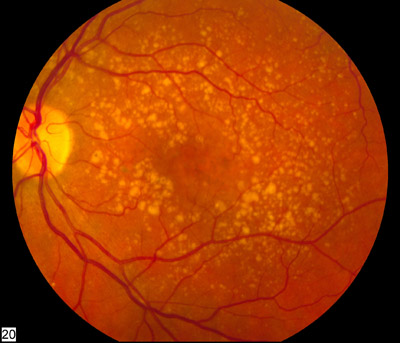

# MÁCULA E DEGENERAÇÕES

Para entender as doenças da mácula, você precisa primeiro visualizar essa região não como um simples ponto no fundo do olho, mas como a área de maior demanda metabólica do corpo humano. A mácula é pequena, cerca de 5,5 mm de diâmetro, mas é responsável por toda a sua visão de detalhes e cores. No centro dela, temos a fóvea e, mais internamente, a foveola, que é avascular e composta apenas por cones.

Por que isso importa para a prova? Porque qualquer processo que interrompa o fluxo de nutrientes ou o descarte de resíduos nessa região terá um impacto catastrófico na visão central. É aqui que entra a Degeneração Macular Relacionada à Idade (DMRI), o carro-chefe deste tema.

## Anatomia Funcional e Fisiopatologia

Imagine a retina externa como uma engrenagem tripla: os fotorreceptores, o Epitélio Pigmentar da Retina (EPR) e a Membrana de Bruch. Abaixo deles, temos a coriocapilar, que fornece o "combustível". O EPR é o herói anônimo aqui, ele digere os segmentos externos dos fotorreceptores que são descartados diariamente.

Com o envelhecimento, essa capacidade de "limpeza" do EPR diminui. O resultado? Acúmulo de restos metabólicos, que chamamos de drusas. As drusas se depositam entre o EPR e a membrana de Bruch.

Cuidado para não confundir: drusas pequenas (menores que 63 micra) podem ser achados normais do envelhecimento. O problema começa quando elas se tornam grandes, moles e confluentes. Isso gera um processo inflamatório crônico, ativação do sistema complemento e, eventualmente, a morte do EPR (forma seca) ou o estímulo para o crescimento de vasos anômalos (forma úmida).

## Degeneração Macular Relacionada à Idade (DMRI)

A DMRI é a principal causa de cegueira irreversível em países desenvolvidos e em populações brasileiras acima dos 60 anos. Segundo o Conselho Brasileiro de Oftalmologia (CBO), a prevalência aumenta exponencialmente com a idade.

### Fatores de Risco

A banca vai tentar te confundir com fatores menores, mas foque nos principais:

- Idade (o fator isolado mais importante).

- Genética (polimorfismos no fator H do complemento).

- Tabagismo (o principal fator de risco modificável, aumenta o risco em até 4 vezes).

- Dieta pobre em antioxidantes e exposição solar excessiva.

*Figura 1 - Simulação de como um paciente com degeneração macular relacionada à idade enxerga. Fonte: National Eye Institute/NIH, Domínio Público | Wikimedia Commons*

## Classificação Clínica

Muitos alunos erram ao achar que a DMRI é uma coisa só. Nós a dividimos didaticamente em duas formas, mas lembre-se: um paciente pode ter a forma seca em um olho e a úmida no outro, ou evoluir da seca para a úmida.

#### 1. DMRI Seca (Atrófica ou Não-Exsudativa)

Corresponde a cerca de 90% dos casos. É de progressão lenta e gradual. O sinal patognomônico são as drusas e as alterações pigmentares do EPR. No estágio avançado, ocorre a Atrofia Geográfica, onde áreas do EPR e da retina sobrejacente simplesmente desaparecem, deixando os vasos da coroide visíveis ao exame de fundo de olho.

#### 2. DMRI Úmida (Exsudativa ou Neovascular)

Apesar de ser apenas 10% dos casos, é responsável por 90% da perda visual grave. Aqui, o fator de crescimento endotelial vascular (VEGF) entra em cena. Vasos novos e frágeis crescem a partir da coroide (Membrana Neovascular Sub-retiniana - MNVS), rompem a membrana de Bruch e causam hemorragia, fluido sub-retiniano e, por fim, uma cicatriz fibrosa chamada cicatriz disciforme.

Aqui vai uma dica do Dr. Will: se o paciente relata metamorfopsia (visão distorcida) de início súbito, pense imediatamente em DMRI úmida até que se prove o contrário. A forma seca não costuma causar distorção súbita, mas sim uma mancha cega central (escotoma) que cresce lentamente.

*Figura 2 - Fundoscopia mostrando drusas e alterações pigmentares na degeneração macular intermediária. Fonte: National Eye Institute/NIH, Domínio Público | Wikimedia Commons*

## Diagnóstico e Exames Complementares

Para a residência, você precisa dominar o que cada exame mostra. Não basta saber o nome.

- **Tela de Amsler:** Ferramenta de triagem. O paciente olha para a grade e relata se as linhas estão tortas. É excelente para o autocontrole em casa.

- **Retinografia Colorida:** Essencial para documentar drusas e atrofia.

- **Tomografia de Coerência Óptica (OCT):** É o padrão-ouro para manejo. No MedEvo, sempre reforçamos: o OCT é um corte histológico em vida. Ele detecta fluido intra-retiniano, fluido sub-retiniano e descolamentos do epitélio pigmentar (PED). Se há fluido, há atividade da doença.

- **Angiofluoresceínografia (AFG):** Útil para classificar a membrana neovascular em "clássica" (hiperfluorescência precoce e bem definida) ou "oculta" (fluorescência tardia e mal definida).

- **Autofluorescência:** Fundamental na DMRI seca para monitorar a progressão da atrofia geográfica. Áreas de hipoautofluorescência indicam morte do EPR.

### Tratamento da DMRI

Aqui é onde as bancas mais cobram valores e nomes de estudos.

#### Tratamento da Forma Seca

Não existe cura, mas existe prevenção de progressão. Os estudos AREDS e AREDS 2 definiram a suplementação vitamínica.

**Cuidado:** Não prescrevemos vitaminas para qualquer drusa. A indicação é para pacientes com DMRI intermediária (muitas drusas médias ou pelo menos uma drusa grande >125 micra) ou DMRI avançada em apenas um olho.

A fórmula AREDS 2 (preferida hoje) contém:

- Vitamina C (500 mg)

- Vitamina E (400 UI)

- Zinco (80 mg de óxido de zinco)

- Cobre (2 mg de óxido cúprico, para evitar anemia por deficiência de cobre causada pelo zinco)

- Luteína (10 mg) e Zeaxantina (2 mg)

**Dica de Prova:** O AREDS original usava Beta-caroteno. O AREDS 2 o substituiu por Luteína/Zeaxantina porque o Beta-caroteno aumentava o risco de câncer de pulmão em fumantes ou ex-fumantes. Se a questão mencionar um paciente fumante, o Beta-caroteno é contraindicação absoluta.

#### Tratamento da Forma Úmida

O tratamento revolucionou com os anti-VEGF. Eles bloqueiam o estímulo para o crescimento dos vasos e diminuem a permeabilidade vascular (o "vazamento").

Os principais agentes são:

- **Ranibizumabe:** Fragmento de anticorpo.

- **Aflibercepte:** Proteína de fusão (conhecida como "trap"), que se liga ao VEGF-A, VEGF-B e ao fator de crescimento placentário (PlGF).

- **Brolucizumabe:** Fragmento de anticorpo de cadeia única, com maior penetração tecidual, mas com risco de vasculite retiniana.

- **Faricimabe:** O mais recente, com mecanismo duplo (anti-VEGF e anti-Ang-2).

- **Bevacizumabe:** Uso "off-label", mas amplamente utilizado no SUS devido ao custo-benefício.

**Regimes de Aplicação:**

- **Pro Re Nata (PRN):** Aplica-se uma dose mensal inicial (geralmente 3 doses) e depois só se houver sinais de recidiva no OCT.

- **Treat-and-Extend (T&E):** É o mais usado na prática. Você aplica e vai estendendo o intervalo entre as doses (de 4 em 4 semanas para 6, 8, 10...) enquanto a retina estiver seca. Se o fluido voltar, você reduz o intervalo. Isso diminui o número de exames e mantém a visão estável.

| Característica | DMRI Seca | DMRI Úmida |
| --- | --- | --- |
| Frequência | 90% dos casos | 10% dos casos |
| Evolução | Lenta (anos) | Rápida (semanas/meses) |
| Principal Achado | Drusas e Atrofia Geográfica | Membrana Neovascular e Fluido |
| Perda Visual | Escotoma central tardio | Metamorfopsia e baixa súbita |
| Tratamento | Vitaminas (AREDS 2) | Injeções Anti-VEGF |

## Variantes da DMRI e Diagnósticos Diferenciais

Nem tudo que brilha é ouro, e nem toda membrana neovascular é DMRI clássica.

### Vasculopatia Coroidiana Polipoidal (VCP)

Muito comum em asiáticos e negros. Caracteriza-se por dilatações aneurismáticas da coroide (pólipos). O paciente apresenta descolamentos sero-sanguinolentos do EPR recorrentes.
**Dica de Ouro:** Se a DMRI úmida não responde bem ao anti-VEGF, suspeite de VCP. O exame padrão-ouro aqui é a Angiografia com Indocianina Verde (ICG), que consegue ver melhor a circulação coroidiana.

### Proliferação Angiomatosa Retiniana (RAP)

Também chamada de Neovascularização Tipo 3. Diferente da DMRI clássica, onde o vaso vem da coroide, na RAP o vaso começa na própria retina e cresce para baixo. É comum em pacientes muito idosos e costuma ser bilateral.

### Coroidopatia Serosa Central (CSC)

Aparece em pacientes mais jovens (20 a 50 anos), geralmente homens, com perfil de personalidade tipo A (estressados) ou em uso de corticoides. Ocorre um vazamento de fluido sob a retina, causando um descolamento seroso macular.
**Erro Comum:** Nunca trate CSC com corticoide, isso piora a doença. O tratamento inicial é observação e controle do estresse, já que a maioria regride espontaneamente em 3 a 4 meses.

## Maculopatia Miópica

A alta miopia (geralmente definida como erro refracional > -6,00 dioptrias ou comprimento axial > 26,5 mm) causa uma degeneração progressiva por estiramento das camadas oculares.

### Achados Clínicos Importantes

- **Crescente Miópico:** Atrofia peripapilar temporal.

- **Estafiloma Posterior:** Abaulamento da parede posterior do globo.

- **Lacquer Cracks (Rupturas em Laca):** Rupturas lineares na membrana de Bruch. São locais de alto risco para o desenvolvimento de membranas neovasculares.

- **Mancha de Fuchs:** Uma cicatriz pigmentada na mácula após uma hemorragia sub-retiniana por neovascularização.

O tratamento da membrana neovascular miópica também é feito com anti-VEGF, mas geralmente requer menos injeções do que a DMRI.

## Toxicidade por Cloroquina e Hidroxicloroquina

Este é um tema quente para provas de residência devido ao uso dessas medicações em doenças reumatológicas.

### Fisiopatologia

Essas drogas se ligam à melanina do EPR e permanecem lá por muito tempo, mesmo após a interrupção do uso. A toxicidade é cumulativa e causa uma degeneração do EPR que poupa o centro da fóvea inicialmente, criando o aspecto clássico de "Maculopatia em Olho de Boi" (Bull's eye maculopathy).

### Protocolo de Rastreio (Academia Americana de Oftalmologia - AAO)

A diretriz atual foca na dose real por peso corporal.

- **Dose de Risco:** > 5,0 mg/kg de peso real para Hidroxicloroquina.

- **Fatores de Risco Adicionais:** Uso por mais de 5 anos, doença renal (estágio 3 ou pior), uso concomitante de Tamoxifeno.

**Exames de Rastreio:**

- **Campo Visual 10-2:** Detecta escotomas paracentrais. Em pacientes asiáticos, deve-se pedir o 24-2 ou 30-2, pois a toxicidade neles costuma ser mais periférica.

- **OCT de Domínio Espectral:** Procura o sinal do "disco voador" (perda das camadas externas da retina na região paracentral com preservação foveal).

- **Eletrorretinograma Multifocal (mfERG):** Exame funcional precoce.

- **Autofluorescência:** Mostra áreas de dano ao EPR.

**Importante:** O exame de fundo de olho e a tela de Amsler não são mais considerados adequados para rastreio precoce, pois quando as alterações aparecem neles, o dano já é avançado e irreversível.

| Medicamento | Dose Máxima Diária | Início do Rastreio |
| --- | --- | --- |
| Hidroxicloroquina | 5 mg/kg (peso real) | No início (baseline) e após 5 anos |
| Cloroquina | 2,3 mg/kg (peso real) | No início (baseline) e após 5 anos |

*Nota: Se houver fatores de risco, o rastreio deve ser anual desde o início.*

## Buraco Macular e Membrana Epirretiniana

Embora sejam doenças da interface vítreo-retiniana, elas entram no diagnóstico diferencial das degenerações maculares.

### Buraco Macular

É uma abertura de espessura total na fóvea, geralmente causada por tração vítrea anteroposterior.

- **Sintoma:** Escotoma central e metamorfopsia.

- **Sinal de Watzke-Allen:** O paciente vê uma quebra ou afinamento de uma fenda de luz projetada sobre a mácula.

- **Tratamento:** Cirurgia de Vitrectomia Posterior com peeling da membrana limitante interna e tamponamento com gás. O paciente deve fazer posição de "face para baixo" no pós-operatório.

### Membrana Epirretiniana (MER)

É o crescimento de tecido fibrocelular sobre a superfície da retina (membrana limitante interna). Esse tecido contrai e "enruga" a retina.

- **OCT:** Mostra uma linha hiperreflexiva sobre a retina e perda da depressão foveal.

- **Tratamento:** Apenas se houver baixa visual significativa ou metamorfopsia importante. O tratamento é cirúrgico (peeling da membrana).

## Estratificação de Risco e Metas Terapêuticas

Na DMRI, o objetivo não é "recuperar a visão de 20/20", mas sim manter a visão funcional e evitar a cegueira legal.

- **Prevenção Primária:** Cessação do tabagismo (redução de risco em 2-3 vezes após 10 anos de interrupção) e dieta rica em folhas verdes e peixes (ômega-3).

- **Prevenção Secundária:** Uso de vitaminas AREDS 2 em pacientes de alto risco para evitar progressão para formas avançadas.

- **Tratamento Ativo:** Injeções de anti-VEGF com o objetivo de "retina seca" no OCT. A persistência de fluido sub-retiniano crônico pode ser tolerada em alguns protocolos de Treat-and-Extend, mas o fluido intra-retiniano é sempre sinal de atividade que requer tratamento.

## Diagnóstico Diferencial de Metamorfopsia

Quando um paciente chega reclamando que as linhas estão tortas, seu raciocínio clínico deve ser rápido:

- **DMRI Úmida:** Idoso, início súbito, hemorragia ou fluido no OCT.

- **Coroidopatia Serosa Central:** Jovem, estressado, fluido sub-retiniano claro, sem sangue.

- **Membrana Epirretiniana:** Brilho celofane na retinografia, retina enrugada no OCT.

- **Edema Macular Diabético:** História de DM, exsudatos duros, microaneurismas.

- **Buraco Macular:** Escotoma central associado, interrupção total das camadas da retina no OCT.

## Complicações e Prognóstico

O pior desfecho da DMRI úmida não tratada é a **Cicatriz Disciforme**. Uma vez que o tecido fibroso substitui os fotorreceptores, não há mais benefício com anti-VEGF. Por isso, o tempo é retina.

Na DMRI seca, a complicação é a expansão da atrofia geográfica. Recentemente, surgiram os primeiros tratamentos aprovados pelo FDA (como o Pegcetacoplano) que inibem a cascata do complemento (C3 e C5) para lentificar essa atrofia, mas eles ainda estão chegando à prática clínica brasileira.

Para a prova, lembre-se: a DMRI não causa cegueira total (o paciente não perde a percepção de luz ou a visão periférica), mas causa cegueira legal, impedindo a leitura e o reconhecimento de faces.

## Pontos-Chave para Prova

- **Drusas:** Pequenas (<63µm) são normais; Grandes (>125µm) ou moles/confluentes indicam alto risco de progressão para DMRI avançada.

- **Tabagismo:** É o fator de risco modificável mais importante. Aumenta o risco de DMRI e reduz a eficácia do tratamento.

- **AREDS 2:** Indicado para DMRI intermediária ou avançada em um olho. Contém Vit C, E, Zinco, Cobre, Luteína e Zeaxantina.

- **Beta-caroteno:** Proibido para fumantes e ex-fumantes pelo risco de câncer de pulmão (substituído por Luteína no AREDS 2).

- **Metamorfopsia:** Sinal clássico de DMRI úmida ou membrana epirretiniana. Use a Tela de Amsler para triagem.

- **OCT:** Exame de escolha para guiar o tratamento com anti-VEGF. Busque por fluido intra ou sub-retiniano.

- **Anti-VEGF:** Primeira escolha para DMRI úmida. Regimes Treat-and-Extend são preferidos para reduzir carga de exames.

- **Hidroxicloroquina:** Dose segura é < 5 mg/kg de peso real. Rastreio com Campo Visual 10-2 e OCT de domínio espectral.

- **Olho de Boi:** Aspecto da toxicidade avançada por cloroquina. O dano é irreversível e pode progredir mesmo após parar a droga.

- **Coroidopatia Serosa Central:** Homens, personalidade tipo A, uso de corticoide. Tratamento inicial é observação.

- **Miopia Patológica:** Comprimento axial > 26,5 mm. Risco de Lacquer Cracks e Mancha de Fuchs.

- **VCP (Polipoidal):** Suspeitar se a DMRI úmida não responder ao anti-VEGF. Diagnóstico por Indocianina Verde (ICG).

- **Buraco Macular:** Espessura total. Sinal de Watzke-Allen positivo. Cirurgia com peeling de limitante interna.

- **Cicatriz Disciforme:** Estágio final fibrótico da DMRI úmida. Não responde mais a injeções.

- **Atrofia Geográfica:** Estágio avançado da DMRI seca. Visível como áreas de "clareamento" no fundo de olho onde se vê a coroide. 👁️

 Cópia offline para consulta pessoal.
 Fonte original:
 [https://www.medevo.com.br/material-apoio/ler/92dce1e4-51d4-4cf7-8788-5b678df94cf9](https://www.medevo.com.br/material-apoio/ler/92dce1e4-51d4-4cf7-8788-5b678df94cf9)
