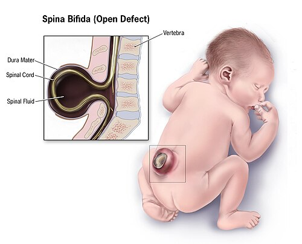

# MALFORMAÇÕES FETAIS

Para entender malformações fetais, você não deve pensar nelas como eventos isolados e aleatórios. Como professor, eu sempre digo aos meus alunos: a malformação é a ponta de um iceberg que envolve embriologia, fisiologia placentária e, muitas vezes, o controle metabólico materno. Nas provas de residência, o examinador quer saber se você consegue identificar a malformação, entender a repercussão hemodinâmica para o feto e, principalmente, qual é a conduta imediata, seja no pré-natal ou na sala de parto.

*Figura 1 - Ilustração de espinha bífida, um dos principais defeitos do tubo neural. Fonte: CDC, Domínio Público | Wikimedia Commons*

## Defeitos do Fechamento do Tubo Neural (DTN)

Os defeitos do tubo neural ocorrem muito cedo na gestação, geralmente até a quarta semana após a concepção, muitas vezes antes mesmo de a mulher saber que está grávida. É por isso que a prevenção deve ser periconcepcional.

*Figura 2 - Gastrosquise: malformação da parede abdominal fetal com exposição de alças intestinais. Fonte: CDC, Domínio Público | Wikimedia Commons*

## Anencefalia

A anencefalia é a ausência parcial ou total da calota craniana e do tecido cerebral subjacente. É uma condição incompatível com a vida extrauterina. Nas provas, o ponto chave não é apenas o diagnóstico ultrassonográfico, que pode ser feito a partir de 12 semanas, mas as suas consequências e o aspecto legal.

Por que a anencefalia causa polidrâmnio? O feto depende da deglutição do líquido amniótico para manter o equilíbrio do volume. Sem o reflexo de deglutição, que é coordenado pelo tronco cerebral (ausente ou rudimentar na anencefalia), o líquido se acumula. Se você vir uma questão com "ausência de calota craniana + polidrâmnio", o diagnóstico está dado.

No Brasil, conforme a decisão do STF na ADPF 54 e as normas do Conselho Federal de Medicina, a interrupção da gestação em casos de anencefalia é permitida legalmente. Você não precisa de autorização judicial. O protocolo exige o diagnóstico por ultrassonografia realizado a partir da 12ª semana, assinado por dois médicos. É importante lembrar que o médico tem o direito à objeção de consciência, mas a instituição deve garantir o atendimento por outro profissional.

### Espinha Bífida

A espinha bífida é o defeito de fechamento da coluna vertebral, sendo mais comum na região lombossacral. Ela pode ser oculta ou aberta (mielomeningocele). Na ultrassonografia do segundo trimestre, além de ver o defeito na coluna, procuramos sinais indiretos no crânio: o "sinal do limão" (formato do crânio) e o "sinal da banana" (cerebelo curvado devido à tração para baixo).

A prevenção é o tema favorito das bancas. Segundo a FEBRASGO e o Ministério da Saúde, a suplementação de ácido fólico deve começar pelo menos 30 dias antes da concepção e continuar até o final do primeiro trimestre.

| Risco do Paciente | Dose de Ácido Fólico |
| --- | --- |
| Baixo Risco (população geral) | 0,4 mg/dia |
| Alto Risco (filho anterior com DTN, uso de anticonvulsivantes como carbamazepina, diabetes pré-gestacional, obesidade) | 4,0 mg/dia |

Cuidado: o tabagismo, embora seja péssimo para a gestação, não é considerado um fator de risco direto para defeitos do tubo neural nas questões de prova. Foque em folato, diabetes e anticonvulsivantes.

## Defeitos da Parede Abdominal

Aqui é onde os alunos mais erram por confusão visual. Existem duas patologias principais: Gastrosquise e Onfalocele. No MedEvo, sempre reforçamos que a diferença fundamental está na presença ou ausência de um saco herniário.

### Gastrosquise

A gastrosquise é uma fenda na parede abdominal, quase sempre à direita da inserção do cordão umbilical. Não há membrana cobrindo as alças intestinais. Elas ficam "soltas" no líquido amniótico.

Por que isso importa? O contato direto do intestino com o líquido amniótico causa uma reação inflamatória química. O intestino fica espessado, edemaciado e coberto por uma capa de fibrina (peel). A principal morbidade pós-natal não é o fechamento da parede, mas o distúrbio de motilidade intestinal e a má absorção que se seguem.

### Onfalocele

Na onfalocele, o defeito é central, na base do cordão umbilical, e as vísceras estão protegidas por um saco formado por peritônio e membrana amniótica. Diferente da gastrosquise, a onfalocele tem uma associação altíssima com outras malformações (cardíacas) e síndromes genéticas (Trissomia 13 e 18, Síndrome de Beckwith-Wiedemann).

| Característica | Gastrosquise | Onfalocele |
| --- | --- | --- |
| Localização | À direita do cordão | Central (no cordão) |
| Membrana Protetora | Ausente | Presente |
| Alças Intestinais | Espessadas/Inflamadas | Aspecto normal |
| Malformações Associadas | Raras (atresias intestinais) | Frequentes (cardíacas, genéticas) |
| Risco de Aneuploidia | Baixo | Alto |

## Malformações do Trato Gastrointestinal

As obstruções intestinais fetais costumam se manifestar com dois sinais clássicos: polidrâmnio (por falta de absorção do líquido) e dilatação de alças.

### Atresia de Esôfago

Suspeitamos de atresia de esôfago no pré-natal quando a ultrassonografia mostra polidrâmnio e ausência de bolha gástrica (o líquido não chega ao estômago). No entanto, em 90% dos casos, existe uma fístula traqueoesofágica distal (Tipo III), que permite que um pouco de ar ou fluido chegue ao estômago, fazendo com que a bolha gástrica apareça, o que pode enganar o examinador.

No pós-natal imediato, o recém-nascido apresenta sialorreia (salivação abundante), engasgos e dificuldade respiratória. A conduta inicial é tentar passar uma sonda nasogástrica. Se a sonda encontrar resistência e "enrolar" na bolsa esofágica superior, o diagnóstico está sugerido. O RX de tórax com a sonda no lugar confirma a posição.

### Obstrução Duodenal

O sinal patognomônico na ultrassonografia ou no RX simples de abdome é o sinal da "dupla bolha". Uma bolha corresponde ao estômago e a outra à porção proximal do duodeno dilatada. Se o examinador mencionar "polidrâmnio + vômitos biliosos + dupla bolha", pense imediatamente em atresia duodenal. Lembre-se: cerca de 30% desses fetos têm Trissomia 21 (Síndrome de Down).

## Malformações do Trato Genitourinário

Este é, sem dúvida, o tema mais cobrado em Medicina Fetal. A maioria das hidronefroses detectadas no pré-natal é transitória e fisiológica, mas precisamos identificar as patologias graves.

### Válvula de Uretra Posterior (VUP)

Esta é a causa mais comum de obstrução infravesical em fetos do sexo masculino. Imagine uma membrana na uretra que impede a saída da urina. O que acontece "atrás" da obstrução?

- A bexiga fica gigante (megabexiga) e com parede espessada.

- Os ureteres dilatam (megaureter).

- Os rins sofrem hidronefrose bilateral.

- O líquido amniótico desaparece (oligodrâmnio), pois a urina fetal é a principal fonte de líquido no segundo e terceiro trimestres.

O oligodrâmnio grave leva à hipoplasia pulmonar (o pulmão precisa de líquido para expandir e crescer) e à fácies de Potter. Se o feto for viável e houver sinais de boa função renal residual (avaliada pela bioquímica da urina fetal colhida por punção), pode-se indicar o shunt vesicoamnótico para esvaziar a bexiga e restaurar o volume de líquido amniótico.

### Obstrução da Junção Ureteropélvica (JUP)

É a causa mais comum de hidronefrose neonatal. Diferente da VUP, a obstrução é lá em cima, na saída do rim para o ureter. Portanto, a bexiga é normal e o ureter não está dilatado. Geralmente é unilateral.

Dica de ouro do Dr. Will: Se o RN nasce com diagnóstico de hidronefrose antenatal, mas está assintomático e com exames de urina normais, a conduta inicial NÃO é cirurgia nem exames invasivos imediatos. O primeiro passo é repetir a ultrassonografia de rins e vias urinárias após as primeiras 48-72 horas de vida (esperamos passar a fase de desidratação fisiológica do RN para avaliar melhor).

### Agenesia Sacral e Síndrome de Regressão Caudal

Embora raras na população geral, são extremamente específicas do diabetes materno mal controlado no primeiro trimestre. Se a questão mencionar uma gestante diabética com feto apresentando encurtamento de membros inferiores ou defeitos na coluna lombo-sacra, marque Regressão Caudal.

## Hérnia Diafragmática Congênita (HDC)

A HDC ocorre por uma falha no fechamento do diafragma, mais comumente à esquerda (Hérnia de Bochdalek). Isso permite que as alças intestinais, o estômago e, às vezes, o fígado subam para o tórax.

O problema não é a hérnia em si, mas o espaço que ela ocupa. Os órgãos abdominais comprimem o pulmão em desenvolvimento, levando à hipoplasia pulmonar e à hipertensão pulmonar persistente.

No exame físico do RN, você encontrará:

- Desconforto respiratório imediato.

- Abdome escavado (clássico: se as tripas estão no tórax, o abdome fica vazio).

- Sons hidroaéreos no tórax.

- Desvio do ictus cordis para a direita (se a hérnia for à esquerda).

A conduta na sala de parto é fundamental: NUNCA ventile com máscara e balão (Ambu). Por quê? Porque você vai jogar ar para dentro do estômago e das alças que estão no tórax, comprimindo ainda mais o pulmão. A conduta correta é intubação orotraqueal imediata e passagem de sonda nasogástrica para descompressão.

## Cardiopatias Congênitas e Circulação Fetal

Para entender as cardiopatias, você precisa lembrar que o feto vive em um estado de circulação em paralelo, onde o canal arterial (ducto arterioso) e o forame oval são essenciais.

### Cardiopatias Ducto-Dependentes

Algumas doenças, como a Transposição das Grandes Artérias, a Coarctação da Aorta grave e a Síndrome da Hipoplasia do Coração Esquerdo, dependem do canal arterial aberto para manter a perfusão sistêmica ou pulmonar.

Quando o bebê nasce e o canal arterial começa a fechar (geralmente nas primeiras horas ou dias), o bebê entra em choque súbito, cianose que não melhora com oxigênio e acidose.

- Se a suspeita for cardiopatia ducto-dependente, a droga de escolha é a Prostaglandina E1 (Alprostadil). Ela mantém o ducto pérvio e salva a vida do bebê até a cirurgia.

- Cuidado: Na Hipoplasia do Coração Esquerdo, o oxigênio suplementar pode ser perigoso, pois ele é um potente vasodilatador pulmonar, o que "rouba" ainda mais fluxo da circulação sistêmica.

### O Papel dos AINEs

Nunca prescreva indometacina ou outros anti-inflamatórios não esteroides (AINEs) para gestantes no terceiro trimestre. Eles inibem as prostaglandinas, o que pode causar o fechamento precoce do canal arterial in utero, levando a insuficiência cardíaca fetal, hidropsia e oligodrâmnio (por redução da perfusão renal fetal).

## Infecções Congênitas e Malformações

As infecções virais são causas importantes de malformações e danos fetais.

- Citomegalovírus (CMV): É a infecção congênita mais comum. Causa microcefalia, calcificações intracranianas periventriculares e surdez neurossensorial.

- Rubéola Congênita: Clássica tríade de Gregg: Catarata, Surdez e Cardiopatia (geralmente persistência do canal arterial ou estenose de artéria pulmonar).

- Parvovírus B19: Este vírus tem tropismo pelos precursores eritroides na medula óssea fetal. Ele causa uma aplasia medular transitória, levando a uma anemia fetal grave. O feto entra em insuficiência cardíaca de alto débito, resultando em Hidropsia Fetal Não Imune (Coombs direto negativo). O diagnóstico de anemia é feito pelo aumento do Pico de Velocidade Sistólica na Artéria Cerebral Média (ACM) ao Doppler.

## Teratogênese e Fatores Ambientais

Um teratógeno é qualquer agente capaz de produzir uma anomalia congênita ou alterar a função fisiológica do feto.

- Talidomida: Causou uma epidemia de focomelia (membros curtos, como nadadeiras) na década de 60. Ainda é usada no Brasil para hanseníase, por isso o controle é rigoroso.

- Retinoides (Isotretinoína): Usados para acne, são altamente teratogênicos, causando malformações de orelha, cardíacas e de SNC.

- Álcool: É a causa evitável mais comum de deficiência mental. Não existe dose segura.

- Radiação: Exames de imagem comuns (como um RX de tórax ou uma TC de abdome com proteção) raramente atingem a dose de 5 rads (50 mGy), que é o limiar para risco de malformações. Não se deve retardar um diagnóstico materno importante por medo da radiação, mas deve-se sempre usar proteção abdominal.

## Hidropsia Fetal

A hidropsia é definida pelo acúmulo de líquido em dois ou mais compartimentos fetais (ascite, derrame pleural, derrame pericárdico, edema cutâneo).

Historicamente, a principal causa era a imunização Rh (Hidropsia Imune). Com o uso da imunoglobulina anti-D, a Hidropsia Não Imune tornou-se a mais frequente (90% dos casos). As causas incluem arritmias cardíacas, malformações cardíacas estruturais, infecções (Parvovírus) e anomalias cromossômicas (Síndrome de Turner é uma causa comum de higroma cístico que evolui para hidropsia).

Se você encontrar um feto hidrópico e o teste de Coombs Direto for negativo, você está diante de uma hidropsia não imune. O próximo passo é uma investigação detalhada com ecocardiografia fetal e rastreio infeccioso.

## Aspectos do Cordão Umbilical

A anatomia normal do cordão umbilical é composta por duas artérias e uma veia (lembre-se: a veia traz sangue oxigenado da placenta).

- Artéria Umbilical Única (AUA): É a malformação mais comum do cordão. Embora possa ser um achado isolado, ela aumenta o risco de malformações renais e cardíacas. Se encontrar AUA, deve-se fazer uma ultrassonografia morfológica detalhada.

- Inserção Velamentosa: O cordão se insere nas membranas, e não diretamente no disco placentário. Se esses vasos desprotegidos passarem sobre o orifício cervical interno, temos a Vasa Prévia. Isso é uma emergência: se as membranas rompem, os vasos fetais rompem junto, e o feto pode sangrar até a morte em minutos (sangramento de origem fetal).

## Manejo de Más Notícias e Ética

A comunicação de malformações requer sensibilidade. As diretrizes de Bioética e do Ministério da Saúde enfatizam a autonomia da paciente e a transparência. No caso de anomalias incompatíveis com a vida (como anencefalia ou trissomia do 18 em alguns contextos), a família deve ser acolhida por equipe multidisciplinar.

Lembre-se para a prova: No Brasil, o aborto é legal em três situações:

- Risco de vida para a mulher.

- Gravidez resultante de estupro.

- Anencefalia fetal.

Para qualquer outra malformação, mesmo que grave ou incompatível com a vida (como a Síndrome de Potter ou Trissomia 13), a interrupção da gestação depende de autorização judicial (alvará).

## Pontos-Chave para Prova

- Ácido Fólico: 0,4 mg para baixo risco e 4 mg para alto risco (filho anterior com DTN ou uso de anticonvulsivantes).

- Gastrosquise: Defeito à direita do cordão, sem membrana, alta morbidade intestinal pós-natal.

- Onfalocele: Defeito central, com membrana, alta associação com síndromes genéticas.

- Válvula de Uretra Posterior: Megabexiga + Hidronefrose Bilateral + Oligodrâmnio em feto masculino.

- Hérnia Diafragmática: Abdome escavado ao nascimento. Conduta: Intubação imediata (NUNCA usar Ambu).

- Atresia de Esôfago: Sialorreia e impossibilidade de passar sonda nasogástrica.

- Atresia Duodenal: Sinal da "dupla bolha" e associação com Síndrome de Down.

- Cardiopatias Ducto-Dependentes: Iniciar Prostaglandina E1 para manter o canal arterial aberto.

- Parvovírus B19: Causa anemia fetal e hidropsia não imune (Coombs negativo).

- Diabetes Materno: Risco de Síndrome de Regressão Caudal (específico) e hipertrofia miocárdica (3º trimestre).

- Indometacina: Contraindicada no 3º trimestre pelo risco de fechamento precoce do canal arterial.

- Anencefalia: Interrupção legal permitida sem autorização judicial, diagnóstico após 12 semanas por dois médicos.

- Hidronefrose Neonatal: Se o RN estiver bem, o primeiro exame é a USG de rins e vias urinárias após 48-72h de vida.

- Artéria Umbilical Única: Obriga a pesquisa de outras malformações, especialmente renais.

- Vasa Prévia: Sangramento vaginal após ruptura de membranas com sofrimento fetal agudo (sangue é do feto). 🩺

 Cópia offline para consulta pessoal.
 Fonte original:
 [https://www.medevo.com.br/material-apoio/ler/b2d252d6-3ddb-4512-b219-636d87d0d7f7](https://www.medevo.com.br/material-apoio/ler/b2d252d6-3ddb-4512-b219-636d87d0d7f7)
