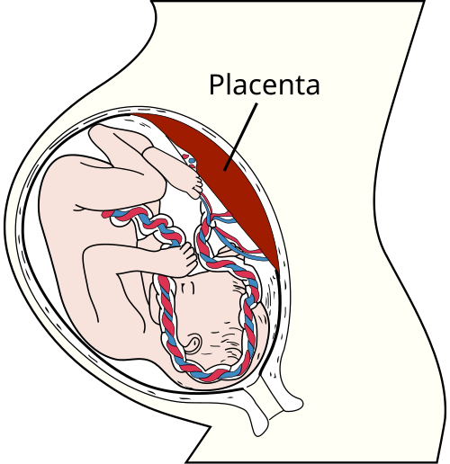

# MANEJO ATIVO DO TERCEIRO PERÍODO DO PARTO

O terceiro período do parto, também chamado de secundamento ou dequitação, é o intervalo que vai do nascimento do feto até a expulsão completa da placenta e das membranas ovulares. Embora seja o período mais curto do trabalho de parto, é, sem dúvida, o mais perigoso para a mulher.

A maioria das mortes maternas por hemorragia ocorre justamente aqui. Por isso, como professor, eu digo: você pode até relaxar um pouco após a saída do bebê, mas sua atenção deve triplicar até que a placenta saia e o útero esteja firme.

*Figura 1 - Anatomia da placenta mostrando a circulação materno-fetal e as vilosidades coriônicas. Fonte: OpenStax College, CC BY 3.0 | Wikimedia Commons*

## Fisiologia da Dequitação: O que acontece "lá dentro"?

Para entender por que agimos de determinada forma, você precisa entender a fisiologia. O descolamento da placenta ocorre devido à súbita redução da área da superfície uterina após a saída do feto. O útero, que antes envolvia um bebê de 3kg, agora se contrai sobre si mesmo.

A placenta, porém, não é elástica. Quando o local de sua inserção encolhe bruscamente, ela se dobra e as pontes vasculares entre a decídua e o miométrio se rompem. Isso cria um hematoma retroplacentário que ajuda a "empurrar" o restante da placenta para fora.

Existem dois mecanismos clássicos de dequitação que as bancas de residência amam cobrar:

- **Mecanismo de Baudelocque-Schultze (75% dos casos):** O descolamento começa pelo centro da placenta. O hematoma fica escondido atrás dela. O que você vê primeiro na vulva? A face fetal (lisa e brilhante, coberta pelo âmnio). O sangramento só aparece *depois* que a placenta sai.

- **Mecanismo de Baudelocque-Duncan (25% dos casos):** O descolamento começa pelas bordas. O sangue escapa lateralmente e você vê sangramento *antes* da saída da placenta. Na vulva, o que aparece primeiro é a face materna (com os cotilédones).

**Dica de Prova:** Lembre-se que "Schultze" começa com "S" de "Superfície fetal" e "S" de "Sangue depois". "Duncan" começa com "D" de "Detrito" (face materna) e "D" de "Durante" (sangue durante o processo).

*Figura 2 - Diagrama anatômico da placenta com detalhes das estruturas maternas e fetais relevantes para o secundamento. Fonte: Gray's Anatomy, Domínio Público | Wikimedia Commons*

## Manejo Ativo vs. Manejo Expectante

Antigamente, esperava-se a natureza agir (manejo expectante). Hoje, a recomendação da OMS e da FEBRASGO é clara: o **Manejo Ativo do Terceiro Período (MATP)** deve ser oferecido a todas as mulheres em todos os partos.

Por que fazemos isso? Porque as evidências (estudos com Risco Relativo < 1 e IC95% que não cruza a unidade) mostram que o manejo ativo reduz o risco de hemorragia pós-parto (HPP) em cerca de 60%, diminui a necessidade de transfusão e reduz a anemia neonatal (quando associado ao clampeamento oportuno).

O MATP baseia-se em três pilares fundamentais que você deve decorar para a vida e para a prova:

- Administração de uterotônicos (Ocitocina).

- Tração controlada do cordão umbilical.

- Massagem uterina (vigilância do tônus).

### 1. Ocitocina: A Estrela do Show

A ocitocina é o uterotônico de primeira escolha. Ela deve ser administrada preferencialmente por via **Intramuscular (IM)** na dose de **10 UI**.

**O "Pulo do Gato" para a Prova:** Quando administrar? A recomendação clássica é "logo após o desprendimento do ombro anterior" ou "em até 1 minuto após o nascimento do feto".

Cuidado com a via endovenosa (EV). Se você optar por fazer EV, nunca faça em bolus rápido. A ocitocina EV rápida pode causar hipotensão severa, arritmias e até parada cardíaca. Se for fazer EV, faça diluído e lento. Mas, para a prova de residência, se perguntarem a conduta padrão do manejo ativo: **10 UI de Ocitocina IM**.

E se a paciente for hipertensa? Você pode usar a Metilergonovina? Na profilaxia de primeira linha, não. A Metilergonovina é uma droga de segunda linha e é **contraindicada em hipertensas** (pode causar crise hipertensiva grave). A ocitocina não tem essa contraindicação.

### 2. Clampeamento do Cordão Umbilical

Aqui existe uma conexão importante com a Pediatria. O clampeamento não deve ser imediato em RNs vigorosos.

- **Clampeamento Tardio (ou Oportuno):** Realizado entre 1 a 3 minutos (ou quando cessar a pulsação). Isso aumenta as reservas de ferro do bebê e previne a anemia neonatal.

- **Clampeamento Imediato:** Reservado para situações de descolamento prematuro de placenta (DPP), placenta prévia com sangramento, mães HIV positivas ou RNs não vigorosos que precisam de reanimação imediata.

**Atenção:** O clampeamento tardio faz parte das boas práticas, mas o componente "ativo" do terceiro período foca na tração controlada *após* o clampeamento.

### 3. Tração Controlada do Cordão (Manobra de Brandt-Andrews)

Muitos alunos erram aqui por medo de causar uma inversão uterina. E o medo é justificado! Você nunca deve tracionar o cordão sem realizar a **contratração**.

A técnica correta (Brandt-Andrews) consiste em:

- Pinçar o cordão perto da vulva.

- Colocar uma mão sobre o abdome materno, logo acima da sínfise púbica, empurrando o corpo do útero para cima (contratração).

- Com a outra mão, exercer uma tração suave e constante no cordão para baixo.

**Pegadinha de Prova:** Se a questão disser que ao tracionar o cordão, a pinça "sobe" junto com o útero, isso é sinal de que a placenta **não** descolou (Placenta Aderida). Se a pinça desce enquanto você empurra o útero para cima, a placenta já está no segmento inferior ou vagina.

## Complicações do Terceiro Período

Se o secundamento não ocorrer conforme o esperado, entramos no terreno das emergências obstétricas.

### Retenção Placentária

Quanto tempo devemos esperar?

- No manejo ativo: Se a placenta não sair em **30 minutos**, diagnosticamos retenção placentária.

- No manejo expectante: Algumas diretrizes aceitam até 60 minutos, mas para sua prova, guarde o número **30**.

Se passaram 30 minutos e a placenta está lá, o que fazer? Primeiro, garantimos que a bexiga está vazia (bexiga cheia desvia o útero e dificulta a contração). Podemos tentar uma nova dose de ocitocina ou, se houver sangramento importante, partir para a **Extração Manual da Placenta** sob anestesia.

Lembre-se: a extração manual não é isenta de riscos. Pode causar infecção, trauma uterino e hemorragia. Deve ser feita em ambiente cirúrgico se possível.

### Inversão Uterina Aguda

Esta é a complicação "iátrica" mais temida. Geralmente ocorre por tração intempestiva do cordão com o útero relaxado ou por pressão excessiva no fundo uterino (Manobra de Kristeller — que é proscrita!).

O quadro clínico é choque neurogênico e hemorrágico imediato. Você verá uma massa carnosa saindo pela vulva e não sentirá o fundo uterino no abdome.

**Conduta Imediata:**

- **Manobra de Taxe (ou Manobra de Johnson):** Reposição manual imediata do útero. Você "empurra" o fundo uterino de volta para dentro da pelve com a palma da mão.

- Se o anel de contração cervical impedir a volta (anel de Bandl), pode ser necessário o uso de relaxantes uterinos (como anestésicos voláteis ou terbutalina) para conseguir reposicionar.

- Só depois de reposicionar é que você faz uterotônicos para manter o útero contraído.

### Atonia Uterina: O Pesadelo do 4º Período

A atonia é a principal causa de HPP. O útero fica "bobo", não contrai e os vasos do sítio placentário ficam abertos. No MedEvo, sempre reforçamos o mnemônico dos **4Ts da HPP**:

- **Tônus (Atonia) - 70% dos casos.**

- Trauma (Lacerações).

- Tecido (Restos placentários).

- Trombina (Coagulopatias).

Se você se deparar com uma atonia, a sequência é: Massagem uterina bimanual (Manobra de Hamilton) + Ocitocina EV. Se não resolver, partimos para outros uterotônicos (Metilergonovina, Misoprostol, Ácido Tranexâmico) e, em última instância, medidas cirúrgicas ou Balão de Bakri.

## O Quarto Período de Greenberg

Muitos esquecem que o parto não acaba na placenta. A primeira hora após a dequitação é o **Período de Greenberg**. É aqui que a hemostasia se consolida através de quatro mecanismos:

- **Miotamponagem:** As fibras miometrias se contraem e "estrangulam" os vasos. São as "ligaduras vivas de Pinard".

- **Trombotamponagem:** Formação de coágulos nos vasos uterinos.

- **Indiferença Uterina:** O útero alterna momentos de contração e relaxamento (mas deve predominar o tônus firme).

- **Contração Uterina Fixa:** O útero forma o "Globo de Segurança de Pinard", que deve estar ao nível da cicatriz umbilical ou logo abaixo.

| Mecanismo | Descrição | Importância Clínica |
| --- | --- | --- |
| **Miotamponagem** | Contração das fibras em "oito" | Principal defesa contra hemorragia imediata |
| **Trombotamponagem** | Ativação da cascata de coagulação | Consolida a hemostasia nos vasos rompidos |
| **Indiferença Uterina** | Fase de instabilidade do tônus | Momento de maior vigilância (risco de atonia) |
| **Globo de Pinard** | Útero firme e palpável | Sinal clínico de que a hemostasia está ocorrendo |

## Tabelas Comparativas para Revisão Rápida

### Tabela 1: Manobras no Terceiro e Quarto Períodos

| Manobra | Objetivo | Status |
| --- | --- | --- |
| **Brandt-Andrews** | Tração controlada do cordão com contratração | **Recomendada** no MATP |
| **Taxe (Johnson)** | Reposição manual do útero na inversão | **Emergência** |
| **Hamilton** | Compressão bimanual do útero (uma mão interna, outra externa) | **Tratamento** da Atonia |
| **Kristeller** | Pressão no fundo uterino para expulsão fetal | **Proscrita** (Violência Obstétrica) |
| **Credé** | Pressão no fundo uterino para expulsar a placenta | **Não recomendada** (Risco de inversão) |

### Tabela 2: Uterotônicos na Prevenção da HPP

| Droga | Dose/Via | Contraindicação |
| --- | --- | --- |
| **Ocitocina** | 10 UI IM (ou 20-40 UI em soro EV lento) | Nenhuma absoluta na profilaxia |
| **Metilergonovina** | 0,2 mg IM | **Hipertensão**, Pré-eclâmpsia, Coronariopatia |
| **Misoprostol** | 600-800 mcg (geralmente retal na HPP) | Hipersensibilidade |

## Exemplos Clínicos para Fixação

**Cenário 1:** Você acaba de assistir um parto vaginal. O bebê está bem, no colo da mãe. Você administra 10 UI de ocitocina IM. Após 5 minutos, percebe um sangramento súbito pela vulva e, em seguida, a placenta aparece com a face materna voltada para você. Qual o mecanismo?

- **Resposta:** Mecanismo de Baudelocque-Duncan. Lembre-se: sangue antes da placenta + face materna = Duncan.

**Cenário 2:** Primigesta, parto sem intercorrências. Passados 40 minutos da saída do feto, a placenta ainda não dequitou, apesar do manejo ativo. A paciente está estável e não sangra. Qual a conduta?

- **Resposta:** Diagnóstico de Retenção Placentária (passou de 30 min). Deve-se proceder à extração manual da placenta sob analgesia/anestesia, pois o risco de hemorragia aumenta exponencialmente após esse tempo.

**Cenário 3:** Durante a tração do cordão, você esquece de fazer a contratração suprapúbica. Subitamente, a paciente grita de dor, apresenta sinais de choque e você visualiza uma massa avermelhada na vulva. O fundo uterino não é palpável no abdome.

- **Resposta:** Inversão Uterina Aguda. Conduta imediata: Manobra de Taxe. Não espere a placenta descolar para reposicionar o útero; reposicione tudo junto para evitar maior perda sanguínea.

## Bioestatística Aplicada ao Tema

As bancas adoram misturar temas. No manejo ativo do terceiro período, o conceito de **Risco Relativo (RR)** é fundamental.
Se um estudo diz que o RR de hemorragia no manejo ativo é 0,34 (IC95% 0,14-0,87) em comparação ao manejo expectante, o que isso significa?

- O manejo ativo é um **fator de proteção** (RR < 1).

- A redução do risco é de 66% (1 - 0,34).

- O resultado é **estatisticamente significativo**, pois o intervalo de confiança não inclui o valor 1.

Segundo o Dr. Will, entender esses números ajuda a validar por que a Ocitocina IM é o padrão-ouro mundial. Não é apenas "opinião de especialista", é medicina baseada em evidências sólidas.

## Pontos-Chave para Prova

- **Definição de 3º Período:** Do nascimento fetal à expulsão da placenta.

- **Definição de 4º Período (Greenberg):** Primeira hora após a dequitação (foco em hemostasia).

- **Manejo Ativo (Tríade):** Ocitocina 10 UI IM + Tração controlada do cordão + Massagem uterina.

- **Ocitocina:** Primeira escolha. Evitar bolus EV rápido (risco de colapso cardiovascular).

- **Clampeamento do Cordão:** 1 a 3 minutos para RNs vigorosos (previne anemia neonatal).

- **Vitamina K:** Essencial na sala de parto (IM) para prevenir a doença hemorrágica do recém-nascido.

- **Mecanismo de Schultze:** Central, face fetal primeiro, sangue depois. Mais comum.

- **Mecanismo de Duncan:** Lateral, face materna primeiro, sangue antes.

- **Retenção Placentária:** Diagnóstico após 30 minutos no manejo ativo. Conduta: Extração manual.

- **Inversão Uterina:** Causa principal é tração intempestiva do cordão. Conduta: Manobra de Taxe imediata.

- **Manobra de Kristeller:** Proscrita. Aumenta risco de ruptura uterina, inversão e trauma fetal.

- **Manobra de Hamilton:** Compressão bimanual do útero, usada no tratamento da atonia, não na profilaxia.

- **Globo de Segurança de Pinard:** Útero contraído e firme, sinal de boa hemostasia no 4º período.

- **Perda Sanguínea:** Média de 500 ml no parto vaginal. Acima disso é considerado HPP.

- **Metilergonovina:** Nunca usar em hipertensas. É droga de segunda linha para HPP.

- **Atonia Uterina:** Principal causa de HPP (70%). O manejo ativo é a principal forma de preveni-la.

- **Pegadinha:** A manobra de tração controlada (Brandt-Andrews) exige SEMPRE a contratração suprapúbica para evitar a inversão uterina.

 Cópia offline para consulta pessoal.
 Fonte original:
 [https://www.medevo.com.br/material-apoio/ler/c0386f95-9517-42ef-be96-a77e07963a59](https://www.medevo.com.br/material-apoio/ler/c0386f95-9517-42ef-be96-a77e07963a59)
