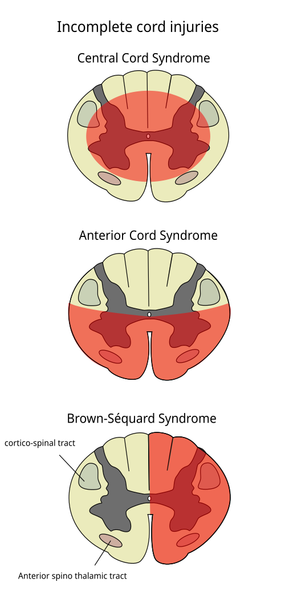

# MANEJO DEFINITIVO DE TRAUMA RAQUIMEDULAR

Para entender o Trauma Raquimedular (TRM), você precisa parar de tentar decorar nomes de síndromes e começar a visualizar a medula como um cabo de fibra óptica complexo. Se o cabo rompe, a informação não passa. Se ele apenas "amassa", o sinal fica ruidoso.

Nas provas de residência, o examinador não quer apenas que você saiba que o paciente não mexe as pernas. Ele quer que você identifique, pelo nível sensitivo e motor, exatamente onde está o problema e se há esperança de recuperação.

## Anatomia Funcional: O Mapa da Mina

Antes de falarmos de conduta, precisamos revisar a neuroanatomia que cai em toda prova. Se você não souber os tratos e os dermátomos, você vai errar a questão de Síndrome de Brown-Séquard, que é a favorita das bancas.

### Os Três Tratos Principais

- **Trato Corticoespinhal (Motor):** Localizado na porção posterolateral da medula. Ele é responsável pela força motora **ipsilateral** (do mesmo lado). Por que ipsilateral? Porque ele já cruzou lá em cima, nas pirâmides bulbares.

- **Trato Espinotalâmico Lateral (Dor e Temperatura):** Este é o "rebelde". Ele cruza assim que entra na medula (ou 1-2 níveis acima). Portanto, ele carrega sensibilidade **contralateral**.

- **Colunas Posteriores (Propriocepção e Vibração):** Localizadas na parte de trás da medula. Carregam sensibilidade **ipsilateral**.

**Dica de Prova:** Se a lesão for do lado direito da medula, o paciente perde a força no lado direito, mas para de sentir dor no lado esquerdo. Guarde isso: Motor é Ipsi, Dor é Contra.

### Dermátomos e Miotomas "Curingas"

Você não precisa decorar a tabela inteira da ASIA agora, mas estes níveis são obrigatórios:

- **C6:** Extensores do punho (motor) e face lateral do antebraço/polegar (sensitivo).

- **C8:** Flexores dos dedos (médio/anular) e dedo mínimo.

- **T4:** Nível dos mamilos. (Cai muito!)

- **T10:** Nível do umbigo.

- **L4:** Extensão do joelho (Quadríceps) e face medial da perna/maléolo medial.

- **S1:** Flexão plantar e maléolo lateral.

**Exemplo Clínico:** Um paciente chega após queda de altura com dificuldade de estender o joelho. Onde está a lesão? No miotoma L4 ou acima. Se ele tem sensibilidade preservada na face medial da perna, o dermátomo L4 está íntegro.

## Avaliação Inicial e a Escala ASIA

No trauma, a primeira coisa é o ABCDE do ATLS. Mas, no "D" (Déficit Neurológico), o manejo definitivo do TRM exige a classificação da **American Spinal Injury Association (ASIA)**.

Muitos alunos confundem a Escala de Frankel com a ASIA. A Frankel é mais antiga e simplista. A ASIA é o padrão-ouro atual.

### Classificação de Deficiência ASIA

| Categoria | Descrição | Prognóstico |
| --- | --- | --- |
| **ASIA A** | Completa. Sem função motora ou sensitiva em segmentos sacrais (S4-S5). | Pobre |
| **ASIA B** | Incompleta Sensitiva. Sensibilidade preservada abaixo do nível, mas sem motor. | Reservado |
| **ASIA C** | Incompleta Motora. Mais da metade dos músculos-chave abaixo do nível têm força < 3. | Favorável |
| **ASIA D** | Incompleta Motora. Mais da metade dos músculos-chave abaixo do nível têm força ≥ 3. | Muito Bom |
| **ASIA E** | Normal. Funções motoras e sensitivas normais. | Excelente |

**Cuidado:** Você só pode dizer que um paciente é ASIA A (lesão completa) após o término do **Choque Medular**.

## Choque Medular vs. Choque Neurogênico

Este é o erro clássico que reprova candidatos. São entidades completamente diferentes que compartilham o nome "choque".

-

**Choque Medular:** É um fenômeno elétrico/fisiológico. A medula "desliga" após o trauma. Há perda de todos os reflexos abaixo da lesão (incluindo o reflexo bulbocavernoso).

- **Como saber que acabou?** Quando o **Reflexo Bulbocavernoso** retorna.

- **Importância:** Enquanto o paciente estiver em choque medular, você não pode dar o prognóstico definitivo. Se o reflexo voltou e o paciente continua sem motor/sensitivo, agora sim você confirma uma lesão completa (ASIA A).

-

**Choque Neurogênico:** É um fenômeno hemodinâmico. Ocorre em lesões acima de T6 devido à perda do tônus simpático.

- **Tríade Clássica:** Hipotensão + **Bradicardia** + Vasodilatação periférica (extremidades quentes).

- **Diferencial:** No choque hipovolêmico, o paciente está hipotenso, mas taquicárdico e frio. No neurogênico, ele está "relaxado" demais porque o simpático sumiu.

## Síndromes Medulares Traumáticas (O Coração da Prova)

As bancas amam as lesões incompletas. Vamos entender o "porquê" de cada uma.

### 1. Síndrome Medular Central

É a mais comum. Ocorre tipicamente em idosos com estenose de canal cervical prévia que sofrem um trauma por **hiperextensão** (ex: queda da própria altura batendo o queixo).

- **Quadro:** Fraqueza nos Membros Superiores (MMSS) **maior** que nos Membros Inferiores (MMII).

- **Por que os braços sofrem mais?** No trato corticoespinhal, as fibras que controlam os braços são mais centrais, e as das pernas são mais periféricas. O edema central "aperta" primeiro as fibras dos braços.

- **Prognóstico:** Geralmente bom para deambulação, mas ruim para a motricidade fina das mãos.

### 2. Síndrome de Brown-Séquard (Hemissecção Medular)

Geralmente por trauma penetrante (faca ou projétil).

- **Ipsilateral (mesmo lado):** Perda motora e de propriocepção/vibração.

- **Contralateral (lado oposto):** Perda de dor e temperatura.

- **Pegadinha:** A perda de dor/temperatura começa 1 ou 2 níveis abaixo da lesão real, porque as fibras cruzam em ascensão.

### 3. Síndrome Anterior da Medula

Causada por infarto da artéria espinal anterior ou compressão por fragmento ósseo/hérnia.

- **Perda:** Motora, dor e temperatura (abaixo da lesão).

- **Preserva:** Colunas posteriores (vibração e propriocepção).

- **Prognóstico:** O pior das síndromes incompletas.

### 4. Síndrome da Cauda Equina

Não é uma lesão da medula propriamente dita, mas das raízes nervosas abaixo de L1-L2.

- **Sinais:** Anestesia em sela, disfunção vesical/intestinal, perda de tônus retal e hiporreflexia de MMII.

- **Conduta:** Emergência cirúrgica!

*Figura 1 - Diagrama esquemático das lesões medulares incompletas, mostrando os tratos acometidos em cada síndrome. Fonte: Fpjacquot, CC BY-SA 3.0 | Wikimedia Commons*

## Diagnóstico por Imagem

Segundo as diretrizes da Sociedade Brasileira de Neurocirurgia e o ATLS, nem todo paciente precisa de RX de coluna, mas quase todo paciente de trauma de alta energia precisa de **Tomografia Computadorizada (TC)**.

- **TC de Coluna:** É o exame de escolha para avaliar a parte óssea e fraturas (como a Fratura de Jefferson em C1 ou a Fratura de Chance em T12-L2).

- **Ressonância Magnética (RM):** É o melhor exame para ver a medula, ligamentos e discos. É fundamental se houver déficit neurológico sem fratura visível na TC (o famoso SCIWORA).

**O que é SCIWORA?** *Spinal Cord Injury Without Radiographic Abnormality*. É comum em crianças, pois a coluna vertebral é elástica e estica, mas a medula não. O osso volta ao lugar (RX/TC normais), mas a medula sofre a lesão.

*Figura 2 - Ressonância magnética em T2 da coluna cervical mostrando fratura e luxação em C4 com compressão medular. Fonte: CC BY-SA 3.0 | Wikimedia Commons*

## Manejo Farmacológico: O Uso de Corticosteroides

Este é o tema mais polêmico. Se você ler livros americanos antigos, verá o Protocolo NASCIS como regra. Hoje, a recomendação é mais cautelosa.

Conforme o Protocolo NASCIS II (ainda muito cobrado em provas brasileiras):

- **Indicação:** Apenas em TRM fechado, se iniciado em até 8 horas.

- **Dose:** Metilprednisolona 30 mg/kg em bólus (15 min), pausa de 45 min, seguido de 5,4 mg/kg/h.

- **Tempo de infusão:**

- Se iniciado < 3 horas do trauma: manter por 24 horas.

- Se iniciado entre 3 e 8 horas: manter por 48 horas.

**Posicionamento Atual:** Muitas diretrizes (como a AANS/CNS) consideram o corticoide opcional devido ao alto risco de complicações (pneumonia, sepse, hemorragia digestiva). No entanto, para a prova, se perguntarem a dose do NASCIS, use os valores acima.

## Manejo Definitivo e Cirurgia

O tratamento definitivo visa dois objetivos: **Descompressão** e **Estabilização**.

- **Descompressão:** Se há um osso ou disco apertando a medula e o paciente tem déficit progressivo, a cirurgia deve ser precoce.

- **Estabilização:** Se a coluna está instável (critérios de Denis ou TLICS), ela precisa ser fixada (artrodese) para que o paciente possa ser mobilizado precocemente, evitando escaras e trombose.

### Casos Especiais: Mielomeningocele

Embora seja uma malformação congênita, o manejo da mielomeningocele exposta no recém-nascido cai frequentemente junto com TRM.

- **Conduta Imediata:** Proteção com compressa estéril e úmida (soro fisiológico) + Antibioticoterapia.

- **Cirurgia:** Fechamento cirúrgico precoce (nas primeiras 24-48 horas) para reduzir o risco de meningite e preservar a função nervosa residual.

## Resumo de Diferenciação Clínica

| Síndrome | Mecanismo Comum | Achado Principal |
| --- | --- | --- |
| **Central** | Hiperextensão (Idoso) | MMSS > MMII |
| **Anterior** | Flexão / Isquemia | Motor/Dor perdidos; Propriocepção OK |
| **Brown-Séquard** | Penetrante | Motor Ipsi / Dor Contra |
| **Cauda Equina** | Hérnia L4-L5 / Trauma | Anestesia em sela + Bexiga neurogênica |

Como diz o Dr. Will em suas discussões clínicas no MedEvo, o segredo do TRM é não se apressar no prognóstico enquanto o paciente estiver "eletricamente instável" (choque medular).

## Complicações e Cuidados Críticos

O manejo definitivo não acaba na cirurgia. O paciente com TRM é um paciente crítico:

- **Tromboembolismo Venoso (TEV):** Risco altíssimo. Profilaxia com HBPM é mandatória assim que a estabilidade hemorrágica permitir.

- **Disreflexia Autonômica:** Ocorre em lesões acima de T6. É uma resposta simpática exagerada a um estímulo abaixo da lesão (ex: bexiga cheia ou fecaloma). O paciente apresenta hipertensão severa e bradicardia reflexa. **Tratamento:** Elevar a cabeceira e esvaziar a bexiga/reto.

- **Bexiga Neurogênica:** Inicialmente arreflexa (retenção). Necessita de cateterismo intermitente para evitar infecção e hidronefrose.

## Pontos-Chave para Prova

- **Reflexo Bulbocavernoso:** Sua ausência define o Choque Medular. Seu retorno marca o fim do choque e permite a classificação ASIA definitiva.

- **Síndrome Medular Central:** Clássica de idosos, trauma por hiperextensão, déficit motor em mãos e braços muito pior que nas pernas.

- **Brown-Séquard:** Hemissecção. Lembre-se: a dor e temperatura cruzam (perda contralateral), o motor não (perda ipsilateral).

- **Dermátomo T4:** Mamilos. **T10:** Umbigo. **L4:** Maléolo medial e extensão do joelho.

- **Choque Neurogênico:** Hipotensão com **BRADICARDIA**. Se houver taquicardia, procure sangramento (choque hipovolêmico).

- **Metilprednisolona (NASCIS II):** Bólus 30mg/kg + Manutenção 5,4mg/kg/h. Só tem benefício se iniciado < 8h.

- **Triângulo de Calot:** (Revisão rápida de cirurgia que as bancas misturam) Formado pelo Ducto Cístico, Ducto Hepático Comum e Face Visceral do Fígado.

- **SCIWORA:** Lesão medular sem alteração radiológica. Pense em crianças. Peça RM.

- **Fratura de Chance:** Fratura por distração (comum em uso de cinto de segurança de dois pontos). Frequentemente associada a lesões viscerais abdominais.

- **Mielomeningocele:** Cirurgia em 24-48h. Antes disso, proteção estéril e úmida.

- **Disfunção Vesical:** No trauma agudo, a bexiga é atônica (retenção). A incontinência por transbordamento é o erro comum de interpretação.

- **Prognóstico:** Lesões incompletas (ASIA C e D) têm boa chance de recuperação. ASIA A com reflexo bulbocavernoso presente tem prognóstico motor nulo.

- **O que NÃO fazer:** Não use corticoide em traumas penetrantes (faca/tiro). Não dê prognóstico de paraplegia definitiva enquanto o paciente estiver sem o reflexo bulbocavernoso.

 Cópia offline para consulta pessoal.
 Fonte original:
 [https://www.medevo.com.br/material-apoio/ler/e217c881-26bd-443a-8823-3c3dc78de392](https://www.medevo.com.br/material-apoio/ler/e217c881-26bd-443a-8823-3c3dc78de392)
