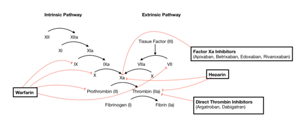
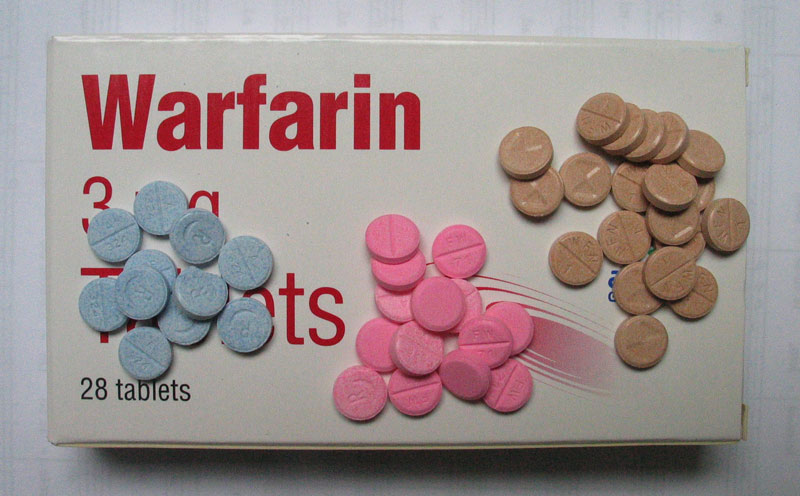

# MANEJO PERIOPERATÓRIO DE ANTICOAGULANTES E ANTIAGREGANTES

O manejo de medicações que interferem na hemostasia é, sem dúvida, um dos temas mais frequentes e práticos nas provas de residência médica. Como professor, vejo muitos alunos se perderem tentando decorar tabelas infinitas, mas o segredo aqui não é a decoreba, é entender o equilíbrio. De um lado, temos o risco de sangramento operatório, do outro, o risco de um evento trombótico catastrófico, como a trombose de um stent ou um AVC isquêmico.

Neste material, vamos dissecar as recomendações da Diretriz Brasileira de Avaliação Cardiovascular Perioperatória da Sociedade Brasileira de Cardiologia (SBC, 2024), garantindo que você compreenda o porquê de cada conduta.

*Figura 1 - Cascata de coagulação e os principais locais de ação dos anticoagulantes (varfarina, heparina, inibidores diretos de trombina e do fator Xa). Fonte: SteveKong3, CC BY-SA 4.0 | Wikimedia Commons*

## O Equilíbrio entre Sangramento e Trombose

Antes de falarmos de dias de suspensão, você precisa entender que toda decisão perioperatória baseia-se em dois pilares: o risco do procedimento e o risco do paciente.

O risco de sangramento depende da cirurgia. Uma neurocirurgia ou uma cirurgia de coluna são consideradas de altíssimo risco porque qualquer mililitro de sangue em local fechado pode causar dano neurológico irreversível. Já uma colecistectomia laparoscópica ou uma cirurgia de hérnia têm risco intermediário. Procedimentos odontológicos simples ou cirurgias dermatológicas menores são de baixo risco.

O risco trombótico depende da condição clínica. Um paciente com uma prótese valvar metálica em posição mitral tem um risco altíssimo de trombose se ficar sem anticoagulação. Já um paciente com fibrilação atrial (FA) e escore CHA2DS2-VASc baixo tem um risco muito menor.

*Figura 2 - Comprimidos de varfarina nas dosagens de 5mg (rosa), 3mg (azul) e 1mg (marrom), medicação que requer ponte com heparina no perioperatório. Fonte: Gonegonegone, CC BY-SA 3.0 | Wikimedia Commons*

## Manejo de Antiagregantes Plaquetários

Os antiagregantes são a base do tratamento da Doença Arterial Coronariana (DAC). O erro clássico de prova é achar que devemos suspender o AAS de todo mundo. Não é bem assim.

Para entender os antiagregantes de forma aprofundada, precisamos olhar para a "cascata" de ativação plaquetária.

Diferente dos anticoagulantes (que focam nos fatores de coagulação e na rede de fibrina), os antiagregantes impedem que as plaquetas se agrupem para formar o trombo branco, que é o grande vilão nas doenças arteriais (IAM e AVC isquêmico).

### Fisiologia da Agregação Plaquetária

Para um antiagregante funcionar, ele precisa bloquear uma das três etapas da resposta plaquetária:

- Adesão: Plaqueta gruda no colágeno exposto (via fator de Von Willebrand).

- Ativação: A plaqueta muda de forma e libera grânulos (ADP, Tromboxano A2).

- Agregação: Ocorre a "ponte" final via receptor GP IIb/IIIa, unindo uma plaqueta à outra através do fibrinogênio

### Ácido Acetilsalicílico (AAS)

O AAS inibe de forma irreversível a enzima ciclo-oxigenase 1 (COX-1) nas plaquetas. Isso impede a formação de Tromboxano A2 (TXA2), um potente vasoconstritor e agregante. Como a plaqueta não tem núcleo, ela não consegue produzir nova enzima. Isso significa que o efeito do AAS dura por toda a vida da plaqueta, cerca de 7 a 10 dias.

Segundo a SBC (2024), a conduta depende do objetivo do uso:

- Prevenção Primária: Se o paciente toma AAS "por conta própria" ou apenas porque tem fatores de risco, mas nunca teve um evento cardiovascular, a recomendação é suspender 7 dias antes da cirurgia. O benefício de evitar o sangramento supera o risco cardiovascular baixo.

- Prevenção Secundária: Se o paciente já teve um infarto, tem um stent ou doença arterial periférica, o AAS deve ser mantido na maioria das cirurgias. A exceção são as cirurgias onde o sangramento é inaceitável, como neurocirurgias, cirurgias de canal medular e, por vezes, ressecção transuretral de próstata (RTUP).

O Dr. Will costuma lembrar que, em cirurgias de baixo risco, como uma tireoidectomia, se o paciente usa AAS 100mg por prevenção secundária, prosseguimos com a cirurgia mantendo a droga e caprichando na hemostasia.

### Inibidores do Receptor P2Y12 (Clopidogrel, Prasugrel e Ticagrelor)

Os Inibidores do Receptor P2Y12 são, hoje, a peça-chave no tratamento das Síndromes Coronarianas Agudas (SCA) e na prevenção de trombose de stent.

Enquanto o AAS age na via do Tromboxano, esses medicamentos bloqueiam a via do ADP (Adenosina Difosfato). Quando o ADP se liga ao receptor P2Y12 na superfície da plaqueta, ele inibe a adenilato ciclase, reduz o AMPc intracelular e ativa a plaqueta. Bloquear esse receptor é interromper o principal mecanismo de "amplificação" da agregação plaquetária.

Em resumo, o P2Y12 é o "amplificador" do sinal. Sem ele, a plaqueta até começa a agrupar, mas o trombo não se sustenta.

Com isso, é perceptível que aqui a conversa muda. Esses fármacos são muito mais potentes que o AAS. O Clopidogrel e o Prasugrel são pró-fármacos que se ligam irreversivelmente ao receptor P2Y12. O Ticagrelor é uma droga de ação direta e ligação reversível, mas com afinidade tão alta que, na prática, também exige tempo para o washout.

Os tempos de suspensão para cirurgias eletivas são:

- Clopidogrel: 5 dias.

- Prasugrel: 7 dias.

- Ticagrelor: 3 a 5 dias (a diretriz de 2024 sugere 3 dias para a maioria, mas 5 dias se o risco de sangramento for muito alto).

Cuidado com a pegadinha: se a cirurgia for de urgência e o paciente estiver usando esses fármacos, a conduta pode incluir a transfusão de plaquetas ou o uso de desmopressina (DDAVP), já que não há tempo para a renovação natural da população plaquetária.

### O Desafio do Stent Coronariano

Este é o tópico favorito das bancas. Se um paciente colocou um stent recentemente, ele está em Dupla Antiagregação Plaquetária (DAPT), geralmente AAS + Clopidogrel. Suspender a DAPT precocemente é o maior fator de risco para trombose de stent, que tem uma mortalidade altíssima (cerca de 40%).

A regra de ouro é:

- Stent Convencional (BMS): Aguardar pelo menos 1 mês para cirurgias eletivas.

- Stent Farmacológico (DES): O ideal é aguardar 6 meses (em casos de alto risco isquêmico) ou pelo menos 3 meses (se o risco de sangramento for alto), mas a recomendação clássica para segurança total em cirurgias eletivas de grande porte ainda costuma ser de 6 a 12 meses nas questões mais conservadoras.

Se a cirurgia não puder ser adiada, a orientação é manter o AAS e suspender apenas o inibidor do P2Y12 pelo tempo necessário. Nunca suspenda os dois simultaneamente no perioperatório de um stent recente.

## Manejo de Anticoagulantes Orais

Aqui dividimos os pacientes em dois grupos: os que usam Varfarina (antagonista da vitamina K) e os que usam os Novos Anticoagulantes Orais (NOACs ou DOACs).

### Varfarina (Cumarínicos)

A varfarina inibe a síntese de fatores dependentes de vitamina K (II, VII, IX e X). Como ela age na produção e não nos fatores já circulantes, seu efeito demora a passar.

Para cirurgias eletivas com risco de sangramento:

- Suspender a varfarina 5 dias antes do procedimento.

- Checar o RNI (INR) um dia antes da cirurgia. O objetivo para a maioria das cirurgias é um RNI < 1,5.

- Se o RNI ainda estiver alto (ex: 1,9) para uma cirurgia abdominal, a conduta é administrar Vitamina K oral (1 a 2,5mg) e reavaliar.

### Terapia de Ponte (Bridging)

Este é o conceito que mais gera confusão. Fazer "ponte" significa trocar o anticoagulante oral por uma heparina (geralmente de baixo peso molecular, como a Enoxaparina) enquanto o RNI cai.

Atenção: A ponte NÃO é para todos. O estudo BRIDGE mostrou que, para pacientes com FA de risco baixo/moderado, a ponte aumenta o sangramento sem reduzir eventos embólicos.

Quem REALMENTE precisa de ponte?

- Pacientes com prótese valvar metálica em posição mitral.

- Pacientes com prótese valvar metálica em posição aórtica que tenham outros fatores de risco (FA, AVC prévio, IC).

- Pacientes com FA e escore CHA2DS2-VASc muito alto (7, 8 ou 9) ou AVC recente (menos de 3 meses).

- Tromboembolismo Venoso (TEV) recente (menos de 3 meses) ou trombofilias de alto risco.

Como fazer a ponte?

- Suspenda a varfarina 5 dias antes.

- Quando o RNI cair abaixo de 2,0 (geralmente no 3º dia sem a droga), inicie a Enoxaparina em dose terapêutica (1mg/kg de 12/12h).

- Suspenda a Enoxaparina 24 horas antes da cirurgia. Se for Heparina Não Fracionada (HNF) venosa, suspenda 4 a 6 horas antes.

### Anticoagulantes Orais Diretos (DOACs)

Rivaroxabana, Apixabana, Edoxabana (inibidores do fator Xa) e Dabigatrana (inibidor direto da trombina). A grande vantagem deles no perioperatório é a meia-vida curta.

Em geral, não se faz ponte para DOACs. Você apenas suspende a droga com base na função renal (especialmente para Dabigatrana) e no risco de sangramento da cirurgia.

- Risco de sangramento baixo: Suspender 24 horas antes.

- Risco de sangramento moderado/alto: Suspender 48 a 72 horas antes.

## Reversão de Urgência

Se o paciente chega sangrando ou precisa de uma cirurgia de emergência (ex: apendicite perfurada) e está anticoagulado, não podemos esperar 5 dias.

Para Varfarina:

- A primeira escolha é o Concentrado de Complexo Protrombínico (CCP) associado à Vitamina K endovenosa. O CCP age imediatamente.

- Se não houver CCP disponível, usamos o Plasma Fresco Congelado (PFC), mas cuidado: o PFC exige grande volume e demora para descongelar.

Para DOACs:

- Dabigatrana: O antídoto específico é o Idarucizumabe.

- Inibidores do Xa (Rivaroxabana/Apixabana): O antídoto é o Andexanet Alfa (ainda pouco disponível no Brasil). Na ausência dele, usamos CCP em doses altas (50 UI/kg).

## Outras Medicações no Perioperatório

Não são apenas os anticoagulantes que importam. O manejo de outras drogas é vital para evitar complicações.

### Anti-hipertensivos

Este é um ponto que mudou recentemente em diretrizes e as bancas estão de olho.

- Betabloqueadores (ex: Atenolol, Metoprolol): NUNCA suspenda. A suspensão abrupta causa um efeito rebote com taquicardia e hipertensão, aumentando o risco de infarto perioperatório. Se o paciente já usa, ele deve tomar inclusive no dia da cirurgia com um gole de água.

- IECA e BRA (ex: Enalapril, Losartana): A recomendação da SBC 2024 é individualizar, mas a tendência para cirurgias de grande porte é suspender 24 horas antes para evitar a "hipotensão refratária" durante a indução anestésica. Se a cirurgia for de pequeno porte e o paciente for muito hipertenso, pode-se considerar manter.

- Diuréticos: Suspender no dia da cirurgia para evitar hipovolemia e distúrbios eletrolíticos durante o procedimento.

### Outras Drogas

- Estatinas: Manter sempre. Elas têm efeito pleiotrópico (estabilizam a placa de ateroma).

- Hipoglicemiantes Orais: Suspender no dia da cirurgia. A Metformina deve ser suspensa 24 a 48 horas antes em cirurgias de grande porte pelo risco de acidose lática.

- Insulina: Ajustar a dose (geralmente reduzir a NPH ou Glargina para 50 a 70% da dose habitual) e manter controle glicêmico capilar.

## Tabelas Comparativas para Revisão Rápida

Abaixo, organizei os dados que você precisa ter na ponta da língua para a prova.

### Tabela 1: Tempo de Suspensão de Antiagregantes (Cirurgia Eletiva)

| Medicamento | Tempo de Suspensão | Observação Importante |
| --- | --- | --- |
| AAS (Prev. Primária) | 7 dias | Suspender sempre |
| AAS (Prev. Secundária) | Manter | Exceto neurocirurgia e cirurgia de coluna |
| Clopidogrel | 5 dias | Risco de trombose de stent se suspenso precocemente |
| Ticagrelor | 3 a 5 dias | Ligação reversível, mas washout necessário |
| Prasugrel | 7 dias | Inibição mais potente e duradoura |

### Tabela 2: Estratificação de Risco para Terapia de Ponte (Varfarina)

| Risco Tromboembólico | Critérios | Conduta de Ponte |
| --- | --- | --- |
| Alto Risco | Prótese Mitral Metálica, CHA2DS2-VASc 7 a 9, TEV < 3 meses | Sempre fazer ponte (HBPM ou HNF) |
| Risco Moderado | Prótese Aórtica Metálica + Fator de Risco, CHA2DS2-VASc 5 a 6 | Individualizar (tendência a fazer) |
| Baixo Risco | FA com CHA2DS2-VASc < 4, TEV > 12 meses | Não fazer ponte (apenas suspender Varfarina) |

### Tabela 3: Reversão de Anticoagulantes em Urgência

| Droga | Agente de Reversão (1ª Escolha) | Alternativa |
| --- | --- | --- |
| Varfarina | Complexo Protrombínico + Vit. K | Plasma Fresco Congelado |
| Heparina (HNF) | Protamina | - |
| Enoxaparina (HBPM) | Protamina (reversão parcial) | - |
| Dabigatrana | Idarucizumabe | CCP ou Hemodiálise |
| Rivaroxabana | Andexanet Alfa ou CCP | - |

## Situações Especiais e Pegadinhas

Nas mentorias do MedEvo, sempre alertamos para o paciente com Doença de Von Willebrand. Em cirurgias, esse paciente precisa de reposição de crioprecipitado ou concentrado de Fator Von Willebrand/Fator VIII. Não adianta dar apenas plaquetas.

Outro ponto é a Trombocitopenia Induzida pela Heparina (TIH). Lembre-se que a TIH é um estado pró-trombótico. Se o paciente tem história de TIH, ele não pode usar nem Heparina Não Fracionada nem HBPM (Enoxaparina). Nesses casos, usamos anticoagulantes alternativos como a Fondaparinux ou inibidores diretos da trombina.

Sobre os fitoterápicos: muitos pacientes acham que "natural não faz mal", mas o Ginko Biloba e o Ginseng aumentam o risco de sangramento e devem ser suspensos 7 dias antes. Já a Erva-de-São-João (St. John's Wort) pode alterar o metabolismo de vários fármacos via citocromo P450.

## Pontos-Chave para Prova

- AAS na prevenção primária: Suspender 7 dias antes. Na prevenção secundária: Manter na maioria das cirurgias.

- Clopidogrel: Suspender 5 dias antes. Prasugrel: 7 dias. Ticagrelor: 3 a 5 dias.

- Stent Farmacológico (DES): Adiar cirurgia eletiva por pelo menos 6 meses, se possível. Se precisar operar antes, manter AAS e suspender o segundo antiagregante.

- Ponte de Heparina: Indicada apenas para alto risco trombótico (ex: prótese metálica mitral, AVC recente, CHA2DS2-VASc muito alto).

- Varfarina: Suspender 5 dias antes. Meta de RNI para cirurgia: geralmente < 1,5.

- Reversão de Varfarina em urgência: Complexo Protrombínico (CCP) é superior ao Plasma Fresco Congelado por agir mais rápido e com menor volume.

- Antídoto da Heparina: Protamina (reverte 100% da HNF e cerca de 60% da HBPM).

- DOACs (Rivaroxabana/Apixabana): Suspender 24 a 48h antes. Não precisam de ponte de heparina devido ao início e fim de ação rápidos.

- Betabloqueadores: Manter sempre no dia da cirurgia. Nunca suspender abruptamente.

- IECA e BRA: Geralmente suspensos 24h antes para evitar hipotensão refratária na anestesia.

- Diuréticos: Suspender no dia da cirurgia para evitar hipovolemia.

- Paciente com RNI de 1,9 na véspera de cirurgia eletiva: Dar 1 a 2,5mg de Vitamina K via oral.

- Sangramento por antiagregantes em cirurgia de emergência: Transfusão de plaquetas e considerar DDAVP.

- Trombose de Stent: É a complicação mais temida da suspensão precoce da DAPT, com altíssima mortalidade.

- Filtro de Veia Cava: Indicado em pacientes com TEV agudo que possuem contraindicação absoluta à anticoagulação (ex: sangramento ativo). 🩺

 Cópia offline para consulta pessoal.
 Fonte original:
 [https://www.medevo.com.br/material-apoio/ler/8d0a83b9-abee-4b3e-b94f-dbfa62119533](https://www.medevo.com.br/material-apoio/ler/8d0a83b9-abee-4b3e-b94f-dbfa62119533)
