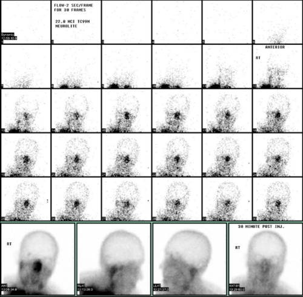

# MANUTENÇÃO DO POTENCIAL DOADOR E CRITÉRIOS DE DOAÇÃO

A morte encefálica (ME) não é apenas um diagnóstico clínico-legal; do ponto de vista fisiológico, ela representa o início de uma falência multissistêmica catastrófica. Quando o tronco cerebral deixa de funcionar, perdemos o centro de controle de tudo o que mantém o corpo em homeostase. Se você quer que os órgãos desse paciente cheguem ao receptor em condições de funcionar, você precisa atuar como o "cérebro substituto" desse doador.

*Figura 1 - Cintilografia cerebral com Tc-99m mostrando ausência de fluxo intracraniano e sinal do nariz quente, consistente com morte encefálica. Fonte: JasonRobertYoungMD, CC BY-SA 4.0 | Wikimedia Commons*

## A Fisiopatologia do Caos: O que acontece após a Morte Encefálica?

Para entender a manutenção, você precisa entender o porquê do colapso. O processo de morte encefálica geralmente segue um padrão bifásico que as bancas de residência adoram explorar.

### A Tempestade Autonômica (O "Tsunami" Adrenérgica)

No momento em que ocorre a herniação cerebral e a isquemia do tronco, há uma descarga maciça de catecolaminas. O corpo tenta, desesperadamente, manter a perfusão cerebral aumentando a pressão arterial de forma brutal.

Nesta fase, o paciente apresenta hipertensão severa, taquicardia e aumento da resistência vascular sistêmica. Isso é deletério para o coração (isquemia miocárdica por demanda) e para os pulmões (edema pulmonar neurogênico).

**Dica de Prova:** Se a questão trouxer um doador com PAS > 180 mmHg ou PAD > 120 mmHg (ou PAM > 95 mmHg por mais de 30 minutos), a conduta imediata é o controle com drogas de ação curta, como Nitroprussiato de Sódio ou Esmolol. Por que drogas de ação curta? Porque essa tempestade dura pouco e, logo em seguida, o paciente vai evoluir para o oposto: o colapso hemodinâmico.

### O Colapso e a Desautonomia

Após a tempestade, vem a calmaria... ou melhor, o deserto. Com a destruição dos centros vasomotores no bulbo, ocorre uma perda total do tônus simpático. O resultado é uma vasodilatação periférica extrema (choque neurogênico) e bradicardia (pela perda do estímulo simpático cardíaco).

Além disso, a interrupção do eixo hipotálamo-hipofisário leva a um estado de "pan-hipopituitarismo" agudo. A falta de ADH (hormônio antidiurético) é a primeira a se manifestar, gerando o Diabetes Insipidus, que discutiremos adiante.

## Manutenção Hemodinâmica: O Equilíbrio Delicado

O objetivo aqui não é apenas manter a pressão, mas garantir a perfusão tecidual sem encharcar os órgãos. Aqui no MedEvo, sempre reforçamos: o excesso de líquido para manter a pressão pode inviabilizar um transplante de pulmão ou pâncreas por edema.

### Metas Hemodinâmicas

Segundo as diretrizes da ABTO (Associação Brasileira de Transplante de Órgãos), as metas principais são:

- PAM entre 65 e 95 mmHg.

- Débito urinário entre 1 e 3 ml/kg/h.

- PVC entre 6 e 10 mmHg (evitar sobrecarga).

- Fração de ejeção (Ecocardiograma) > 45%.

- Doses mínimas de vasopressores.

### Escolha das Drogas Vasoativas

Se o paciente está hipotenso após a reposição volêmica inicial (cristaloides, preferencialmente Ringer Lactato para evitar acidose hiperclorêmica), qual droga escolher?

- **Noradrenalina:** É a mais utilizada, mas cuidado! Doses altas (> 0,5 mcg/kg/min) causam vasoconstrição intensa, o que prejudica a microcirculação dos órgãos (especialmente rins e pâncreas) e pode levar à disfunção primária do enxerto.

- **Vasopressina:** Aqui está o "pulo do gato" das provas. A vasopressina é excelente no doador porque ela cumpre dois papéis: ajuda a elevar a PAM e trata o Diabetes Insipidus. O uso precoce de vasopressina permite reduzir a dose de noradrenalina, protegendo os órgãos.

**Tabela 1: Manejo da Pressão Arterial no Doador**

| Situação Clínica | Conduta de Primeira Escolha | Justificativa |
| --- | --- | --- |
| Tempestade Adrenérgica (Hipertensão Grave) | Nitroprussiato ou Esmolol | Ação rápida e meia-vida curta; evita lesão de órgão-alvo. |
| Hipotensão (PAM < 65) - Inicial | Expansão Volêmica (Cristaloides) | Corrigir a hipovolemia absoluta e relativa. |
| Hipotensão Refratária a Volume | Noradrenalina ou Vasopressina | Manter perfusão orgânica; Vasopressina poupa Nora. |

## O Manejo Endócrino-Metabólico: O Papel do Diabetes Insipidus

O Diabetes Insipidus (DI) ocorre em até 80% dos doadores em morte encefálica. A ausência de ADH faz com que o rim não consiga concentrar a urina.

**Como identificar o DI na prova?**

- Poliúria (> 3-4 ml/kg/h ou > 250 ml/h).

- Hipernatremia (Sódio plasmático > 145 mEq/L).

- Densidade urinária baixa (< 1005).

- Osmolaridade plasmática alta e urinária baixa.

**Por que tratar o DI é vital?**
A hipernatremia grave do doador está diretamente associada à disfunção do enxerto hepático. O hepatócito sofre com o estresse osmótico. Se o sódio estiver acima de 155 mEq/L, o risco de o fígado não funcionar no receptor aumenta drasticamente.

**Tratamento:**

- Reposição de água livre (SG 5% ou água por sonda nasogástrica).

- **Desmopressina (DDAVP):** É o tratamento de escolha. Pode ser feito via endovenosa ou intranasal.

- **Vasopressina:** Se o paciente também estiver hipotenso.

**Cuidado com o Erro Comum:** Muitos alunos acham que a poliúria no doador é sinal de que o rim está "ótimo". Errado! Se a densidade estiver baixa e o sódio subindo, é DI. Se você não tratar, o paciente choca por hipovolemia em poucas horas.

*Figura 2 - Hospital Sarah Kubitschek em Brasília, centro de referência do SUS para reabilitação e captação de órgãos. Fonte: Luis Dantas, Domínio Público | Wikimedia Commons*

## Manejo Ventilatório: Protegendo o Pulmão

O pulmão é o órgão mais difícil de aproveitar (apenas cerca de 15-20% dos doadores têm pulmões viáveis). A morte encefálica gera uma resposta inflamatória sistêmica que predispõe ao edema pulmonar e à lesão alveolar.

A estratégia deve ser a **Ventilação Protetora**:

- Volume Corrente (VC): 6 a 8 ml/kg de peso predito (NÃO use o peso real se o paciente for obeso).

- PEEP: 8 a 10 cmH2O (ajuda a recrutar alvéolos e prevenir atelectasias).

- Manobras de recrutamento alveolar devem ser feitas de forma gentil.

- Manter a cabeceira elevada (30-45°) para evitar pneumonia associada à ventilação.

## Critérios de Doação: Quem pode e quem não pode?

Este é o tópico onde as bancas mais tentam te confundir entre contraindicações absolutas e relativas. Como diz o Dr. Will, a tendência moderna é o uso de "doadores de critérios expandidos", mas existem limites inegociáveis.

### Contraindicações Absolutas (Memorize estas!)

- **Neoplasia Maligna Ativa:** Com exceção de tumores primários do SNC (que não metastatizam fora do eixo), carcinoma basocelular de pele e carcinoma in situ de colo uterino. Um paciente com Hepatocarcinoma ou câncer de mama ativo **não pode** doar.

- **Infecção Incontrolável (Sepse Refratária):** Se o doador está em choque séptico, com germe multirresistente e sem resposta ao tratamento, os órgãos não servem.

- **HIV Positivo:** No Brasil, o HIV ainda é contraindicação absoluta (embora existam protocolos de pesquisa para doador HIV+ para receptor HIV+, isso não é a regra de prova).

- **Tuberculose Ativa não tratada.**

- **Doença de Creutzfeldt-Jakob.**

### Contraindicações Relativas (Avaliar caso a caso)

- Idade avançada (depende do órgão).

- Marcadores de hepatite B ou C (podem ser usados para receptores que já têm a doença).

- Diabetes Mellitus e Hipertensão (podem comprometer rim e coração, mas não impedem a doação de outros órgãos).

**Tabela 2: Contraindicações Absolutas vs. Relativas**

| Absolutas | Relativas |
| --- | --- |
| Neoplasia maligna com metástase ou ativa | Idade > 70-80 anos |
| Sepse sem controle terapêutico | Hipertensão ou Diabetes controlados |
| HIV (na rotina padrão) | Infecção tratada com antibiótico por > 24-48h |
| Falência múltipla de órgãos estabelecida | Marcadores de Hepatite B ou C positivos |

## O Doador de Pâncreas: Um Capítulo à Parte

As questões de cirurgia de transplante focam muito no pâncreas porque ele é um órgão extremamente sensível à isquemia e ao manejo do doador.

**Critérios Ideais para Doação de Pâncreas:**

- **Idade:** Geralmente entre 10 e 45-50 anos. Doadores muito velhos têm pâncreas gordurosos e com menor reserva insulínica.

- **Peso/IMC:** O IMC ideal é < 30 kg/m². Um IMC > 30 é um fator de risco importante para falha do enxerto pancreático e complicações técnicas (gordura peripancreática dificulta a cirurgia).

- **Estabilidade Hemodinâmica:** O pâncreas não tolera bem altas doses de noradrenalina.

- **Amilase e Lipase:** Atenção aqui! Valores alterados de amilase e lipase **NÃO** são contraindicações absolutas. Elas podem subir por trauma abdominal ou pela própria morte encefálica. O que manda é a **avaliação macroscópica** feita pelo cirurgião no momento da retirada.

**Pegadinha de Prova:** A alternativa vai dizer que "Doador com amilase de 500 U/L deve ser descartado para transplante de pâncreas". **Falso.** Se o pâncreas estiver com aspecto bom (cor rosada, consistência firme, sem gordura excessiva), ele pode ser utilizado.

## Aspectos Legais e Éticos: A Lei de Transplantes no Brasil

A legislação brasileira (Lei 9.434/97 e Decreto 9.175/2017) é clara e cai muito em provas de Preventiva e Cirurgia.

### Doador Cadáver

No Brasil, a doação é **consentida**. Isso significa que a decisão final é da família. Não existe mais a "doação presumida" (aquela que vinha escrita no RG).

- Quem pode autorizar? Cônjuge ou parentes consanguíneos, maiores de idade, até o **segundo grau** na linha reta ou colateral. (Nota: A prática clínica e algumas interpretações estendem o acolhimento, mas para prova, foque na autorização de parentes próximos).

### Doador Vivo

Para ser doador vivo, o indivíduo deve ser juridicamente capaz e ter sido submetido a rigorosa avaliação médica e psicológica.

- **Parentesco:** Pode doar para parentes até o **4º grau** ou cônjuge.

- **Não parentes:** Só podem doar com **autorização judicial** e autorização da comissão de ética do hospital. Isso serve para evitar o comércio de órgãos.

- **Órgãos que podem ser doados em vida:** Um dos rins, parte do fígado (geralmente o lobo esquerdo para crianças ou direito para adultos), parte do pulmão (raro) e medula óssea.

## Exemplo Clínico 1: O Manejo do Sódio

Paciente, 24 anos, vítima de TCE grave, diagnóstico de morte encefálica confirmado. Nas últimas 3 horas, apresentou débito urinário de 500 ml/h. Exames: Na+ 158 mEq/L, K+ 3.8 mEq/L, Glicemia 140 mg/dL. PAM 62 mmHg em uso de Noradrenalina 0,2 mcg/kg/min.

**O que fazer?**
Este paciente tem Diabetes Insipidus (poliúria + hipernatremia) e está hipotenso. A conduta ideal é iniciar **Vasopressina**. Ela vai agir nos receptores V1 (vasoconstrição para subir a pressão) e nos receptores V2 (reabsorção de água no rim para tratar o DI e baixar o sódio). Além disso, deve-se repor volume com solução hipotônica (SG 5%) para corrigir o déficit de água livre.

## Exemplo Clínico 2: A Avaliação do Pâncreas

Doador de 52 anos, IMC 32 kg/m², vítima de AVC hemorrágico. Amilase 180 U/L (VR: 100). Durante a laparotomia de retirada, o cirurgião observa pâncreas com infiltração gordurosa importante (esteatose pancreática).

**Conduta:**
Provavelmente este pâncreas será descartado. Embora a amilase esteja pouco alterada, a idade limítrofe, o IMC > 30 e, principalmente, a **avaliação macroscópica** (esteatose) são fatores de alto risco para pancreatite pós-transplante e trombose do enxerto.

## Manutenção de Outros Sistemas

### Controle Glicêmico

A hiperglicemia é comum devido ao estresse e ao uso de corticoides (frequentemente usados na manutenção para reduzir a inflamação sistêmica).

- **Meta:** Glicemia entre 140 e 180 mg/dL.

- Use insulina regular em bomba de infusão se necessário. Evite hipoglicemia, que é tão deletéria quanto a hiperglicemia.

### Temperatura

A perda do controle hipotalâmico leva à poiquilotermia (o doador assume a temperatura do ambiente). A hipotermia causa arritmias, distúrbios de coagulação e disfunção renal.

- **Meta:** Temperatura central > 35°C.

- Use mantas térmicas e aquecimento de fluidos infusos.

### Coagulação e Sangue

A morte encefálica libera tromboplastina tecidual na circulação, o que pode levar a uma Coagulação Intravascular Disseminada (CIVD) subclínica.

- Manter Hemoglobina > 7-8 g/dL.

- Corrigir distúrbios de coagulação (TAP/PTT) se houver sangramento ativo ou antes da captação, usando Plasma Fresco Congelado ou Crioprecipitado.

## Pontos-Chave para Prova

- **Diabetes Insipidus:** Diagnóstico por poliúria, hipernatremia e densidade urinária baixa (< 1005). Tratar com Vasopressina ou DDAVP.

- **Sódio e Fígado:** Sódio plasmático > 155 mEq/L no doador é fator de risco para mau funcionamento do enxerto hepático.

- **Tempestade Adrenérgica:** Hipertensão grave inicial deve ser tratada com drogas de ação curta (Nitroprussiato/Esmolol).

- **Doador Vivo:** Parentes até 4º grau ou cônjuge. Não parentes precisam de autorização judicial.

- **Contraindicação Absoluta:** Neoplasia maligna ativa (ex: hepatocarcinoma, CA de pulmão) e HIV positivo (regra geral de prova).

- **Tumores de SNC:** Se forem primários e não metastáticos (ex: astrocitoma), NÃO contraindicam a doação.

- **Pâncreas e IMC:** IMC > 30 kg/m² é um dos principais fatores de risco para falha do enxerto pancreático.

- **Amilase/Lipase:** Valores elevados isolados NÃO contraindicam a doação de pâncreas; a macroscopia é soberana.

- **Ventilação Protetora:** VC 6-8 ml/kg de peso predito e PEEP 8-10 cmH2O para proteger o pulmão.

- **Drogas Vasoativas:** Vasopressina é a droga "queridinha" das bancas para o doador, pois trata a hipotensão e o DI simultaneamente.

- **Consentimento:** No Brasil, a palavra final é da família (consentimento familiar).

- **Hepatite B e C:** Não são contraindicações absolutas. Órgãos de doadores reagentes podem ser usados em receptores também reagentes.

- **Idade do Doador de Pâncreas:** O ideal é < 45-50 anos. Acima disso, o risco de complicações aumenta.

- **O que NÃO fazer:** Não encharcar o doador com cristaloide para manter a PAM (risco de edema pulmonar e pancreático). Use vasopressores precocemente se o volume inicial não resolver. 💉

 Cópia offline para consulta pessoal.
 Fonte original:
 [https://www.medevo.com.br/material-apoio/ler/be1b7cc4-497c-4894-8a98-56768c6d9ec4](https://www.medevo.com.br/material-apoio/ler/be1b7cc4-497c-4894-8a98-56768c6d9ec4)
