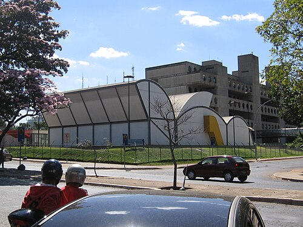

# MARCOS LEGAIS DO SUS: LEIS 8.080/1990, 8.142/1990 E FINANCIAMENTO CONSTITUCIONAL

O Sistema Único de Saúde (SUS) nasce da Constituição Federal de 1988 e é operacionalizado pelas Leis Orgânicas da Saúde. A Lei nº 8.080/1990 organiza as ações e serviços de saúde; a Lei nº 8.142/1990 disciplina a participação da comunidade e as transferências intergovernamentais; a Lei Complementar nº 141/2012 regulamenta a aplicação mínima de recursos em ações e serviços públicos de saúde. O financiamento federal vigente deve ser entendido a partir do art. 198 da Constituição: a União aplica, anualmente, no mínimo, **15% da receita corrente líquida (RCL) do respectivo exercício financeiro** em ações e serviços públicos de saúde.

*Figura 1 - Motolâncias do SAMU no Distrito Federal, exemplo de estrutura de urgência integrante da rede pública de saúde. Fonte: Antonio Cruz/Agência Brasil, CC BY 3.0 BR | Wikimedia Commons.*

## 1) Base constitucional do SUS

A Constituição Federal de 1988, nos arts. 196 a 200, consolidou a saúde como direito social e dever estatal.

| Dispositivo | Núcleo do conteúdo |
| --- | --- |
| Art. 196 | Saúde é direito de todos e dever do Estado, garantida por políticas sociais e econômicas e por acesso universal e igualitário às ações e serviços. |
| Art. 197 | Ações e serviços de saúde são de relevância pública; cabe ao Poder Público regulamentar, fiscalizar e controlar. |
| Art. 198 | O SUS integra rede regionalizada e hierarquizada, com descentralização, atendimento integral e participação da comunidade. Também fixa bases constitucionais de financiamento. |
| Art. 199 | A assistência à saúde é livre à iniciativa privada, com participação complementar no SUS segundo diretrizes públicas. |
| Art. 200 | Define competências do SUS, como vigilância sanitária e epidemiológica, saúde do trabalhador, formação de recursos humanos, saneamento, ciência e tecnologia, alimentos e meio ambiente do trabalho. |

As três diretrizes constitucionais do art. 198 são essenciais: descentralização com direção única em cada esfera, atendimento integral e participação da comunidade.

## 2) Lei nº 8.080/1990: organização e funcionamento do SUS

A Lei nº 8.080/1990 regula, em todo o território nacional, as ações e serviços de saúde executados por pessoas naturais ou jurídicas, de direito público ou privado. Ela define objetivos, campo de atuação, princípios, direção, competências e relação com a iniciativa privada.

### Determinantes e objetivos

A saúde não se limita ao cuidado médico-assistencial. A lei reconhece fatores determinantes e condicionantes, como alimentação, moradia, saneamento básico, meio ambiente, trabalho, renda, educação, atividade física, transporte, lazer e acesso a bens e serviços essenciais.

Objetivos do SUS no art. 5º:

- Identificar e divulgar fatores condicionantes e determinantes da saúde.

- Formular política de saúde destinada a promover, nos campos econômico e social, a redução de riscos e o acesso universal e igualitário.

- Prestar assistência por ações integradas de promoção, proteção e recuperação, articulando atividades preventivas e assistenciais.

### Campo de atuação

| Área incluída no SUS | Base legal e interpretação |
| --- | --- |
| Vigilância sanitária | Intervém em riscos decorrentes do meio ambiente, produção, circulação de bens e prestação de serviços de interesse da saúde. |
| Vigilância epidemiológica | Detecta, conhece e previne mudanças nos determinantes de saúde coletiva e recomenda medidas de prevenção e controle. |
| Saúde do trabalhador | Abrange promoção, proteção, recuperação e reabilitação relacionadas a riscos e agravos do trabalho. |
| Assistência terapêutica integral | Inclui assistência farmacêutica, protocolos clínicos, procedimentos e tecnologias incorporadas. |
| Saúde bucal | Inserida expressamente na Lei nº 8.080 por atualização legislativa recente. |
| Assistência toxicológica e logística de antídotos | Incluída por atualização legislativa para prevenção, diagnóstico e tratamento das intoxicações. |
| Saneamento básico | O SUS participa da formulação da política e da execução de ações, sem ser o único responsável pelo saneamento. |
| Recursos humanos | Ordena a formação de profissionais de saúde. |
| Alimentos, água e produtos | Fiscaliza e inspeciona produtos e substâncias de interesse à saúde. |

### Princípios e diretrizes da Lei nº 8.080

A Lei nº 8.080, art. 7º, lista princípios que orientam ações e serviços públicos e privados contratados/conveniados ao SUS.

| Princípio/diretriz | Significado prático |
| --- | --- |
| Universalidade | Acesso aos serviços em todos os níveis de assistência, independentemente de contribuição previdenciária. |
| Integralidade | Conjunto articulado e contínuo de ações preventivas e curativas, individuais e coletivas, em todos os níveis de complexidade. |
| Autonomia | Preservação da autonomia das pessoas na defesa da integridade física e moral. |
| Igualdade da assistência | Atendimento sem preconceitos ou privilégios de qualquer espécie. |
| Direito à informação | Informação ao usuário sobre sua saúde e sobre o potencial dos serviços. |
| Epidemiologia como critério | Uso da epidemiologia para prioridades, alocação de recursos e orientação programática. |
| Participação da comunidade | Controle social e gestão participativa, detalhados pela Lei nº 8.142. |
| Descentralização | Direção única em cada esfera, com ênfase na descentralização para os municípios. |
| Regionalização e hierarquização | Organização da rede por regiões e níveis crescentes de complexidade. |
| Resolutividade | Capacidade de resolução em todos os níveis de assistência. |
| Evitar duplicidade | Organização dos serviços para evitar duplicidade de meios para fins idênticos. |
| Atenção humanizada | Inserida expressamente como princípio por atualização legislativa recente. |

A equidade é conceito central na política pública de saúde e aparece de modo transversal na organização do SUS, embora a redação clássica do art. 7º utilize a expressão “igualdade da assistência”. Em termos práticos, equidade significa alocar mais recursos e cuidado onde as necessidades são maiores.

## 3) Direção e competências federativas

A direção do SUS é única em cada esfera de governo:

| Esfera | Órgão de direção | Papel predominante |
| --- | --- | --- |
| União | Ministério da Saúde | Formula política nacional, normatiza, coordena sistemas nacionais, financia e presta cooperação técnica e financeira. |
| Estados e Distrito Federal | Secretarias estaduais/distrital de saúde | Coordenam redes estaduais, apoiam municípios, executam ações supletivas e gerem referências regionais/estaduais. |
| Municípios | Secretarias municipais de saúde | Planejam, organizam, controlam, avaliam, gerem e executam serviços públicos locais de saúde. |

O desenho federativo do SUS não é centralizado. A União coordena e financia; os estados apoiam, coordenam e complementam; os municípios são protagonistas na execução cotidiana dos serviços.

## 4) Iniciativa privada, capital estrangeiro e participação complementar

A assistência à saúde é livre à iniciativa privada, mas a participação no SUS ocorre de forma complementar, quando as disponibilidades públicas forem insuficientes para garantir a cobertura assistencial.

Regras essenciais:

- A participação complementar deve ser formalizada por contrato ou convênio, sob normas de direito público.

- Entidades filantrópicas e sem fins lucrativos têm preferência.

- Serviços contratados submetem-se às normas técnicas, administrativas e aos princípios do SUS.

- É vedada a destinação de subvenções e auxílios a instituições prestadoras de serviços de saúde com finalidade lucrativa.

- O capital estrangeiro na assistência à saúde teve disciplina ampliada pela Lei nº 13.097/2015: é permitido nos casos legais, incluindo hospitais, clínicas, policlínicas, ações/pesquisas de planejamento familiar, doações/cooperação internacional, serviços sem finalidade lucrativa para empregados e outros casos previstos em legislação específica.

Portanto, a afirmação genérica de que capital estrangeiro é sempre proibido ficou desatualizada após a alteração legislativa de 2015.

*Figura 2 - Hospital Sarah Kubitschek em Brasília, exemplo de unidade pública vinculada à assistência especializada. Fonte: Luis Dantas, Domínio Público | Wikimedia Commons.*

## 5) Assistência terapêutica e incorporação de tecnologias

A assistência terapêutica integral foi detalhada pela Lei nº 12.401/2011, que inseriu regras sobre protocolos clínicos, diretrizes terapêuticas e incorporação de tecnologias.

Pontos relevantes:

- A assistência terapêutica inclui medicamentos e procedimentos constantes de protocolos, diretrizes e tabelas do SUS.

- A incorporação, exclusão ou alteração de medicamentos, produtos e procedimentos é atribuição do Ministério da Saúde, assessorado pela Conitec.

- A avaliação considera evidências de eficácia, acurácia, efetividade, segurança e avaliação econômica.

- Em regra, é vedado pagar, ressarcir ou dispensar medicamento/procedimento experimental ou sem registro sanitário, ressalvadas exceções legais.

- Protocolos clínicos e diretrizes terapêuticas orientam diagnóstico, tratamento, acompanhamento e verificação de resultados.

## 6) Lei nº 8.142/1990: participação da comunidade e transferências

A Lei nº 8.142/1990 trata de duas matérias centrais: controle social e transferências intergovernamentais de recursos financeiros.

### Conferências e Conselhos de Saúde

| Instância | Características legais |
| --- | --- |
| Conferência de Saúde | Reúne-se a cada 4 anos, com representação dos vários segmentos sociais, para avaliar a situação de saúde e propor diretrizes para a política de saúde. Pode ser convocada pelo Poder Executivo ou, extraordinariamente, por este ou pelo Conselho de Saúde. |
| Conselho de Saúde | Órgão permanente e deliberativo. Atua na formulação de estratégias e no controle da execução da política de saúde, inclusive aspectos econômicos e financeiros. Suas decisões devem ser homologadas pelo chefe do poder legalmente constituído. |

A representação dos usuários nos conselhos e conferências é paritária em relação ao conjunto dos demais segmentos. A regra prática é:

| Segmento | Proporção usual |
| --- | --- |
| Usuários | 50% |
| Trabalhadores da saúde | 25% |
| Gestores e prestadores | 25% |

### Transferências do Fundo Nacional de Saúde

Os recursos do Fundo Nacional de Saúde podem custear despesas do Ministério da Saúde, investimentos e cobertura de ações e serviços implementados por municípios, estados e Distrito Federal. Os recursos destinados a ações e serviços de saúde podem ser repassados de forma regular e automática.

Para receber os recursos, estados, Distrito Federal e municípios devem contar com os requisitos do art. 4º da Lei nº 8.142:

- Fundo de Saúde.

- Conselho de Saúde com composição paritária.

- Plano de Saúde.

- Relatórios de gestão.

- Contrapartida de recursos para saúde no respectivo orçamento.

- Comissão de elaboração do Plano de Carreira, Cargos e Salários.

O não atendimento desses requisitos implica administração dos recursos por outra esfera, conforme a lei.

## 7) Lei Complementar nº 141/2012 e mínimos constitucionais de saúde

A Lei Complementar nº 141/2012 regulamenta o §3º do art. 198 da Constituição e define o que conta ou não como ação e serviço público de saúde, além de disciplinar transparência, fiscalização, fundos de saúde, relatórios e aplicação mínima de recursos.

### O que conta como ação e serviço público de saúde

A despesa deve atender simultaneamente aos princípios do SUS, estar voltada à promoção, proteção ou recuperação da saúde, ser de acesso universal e gratuito, estar de acordo com planos de saúde e ser responsabilidade específica do setor saúde.

Exemplos que contam:

- Vigilância em saúde, incluindo sanitária e epidemiológica.

- Atenção integral e universal em todos os níveis de complexidade.

- Capacitação de pessoal de saúde do SUS.

- Desenvolvimento científico e tecnológico no SUS.

- Produção, aquisição e distribuição de insumos específicos, medicamentos, imunobiológicos, sangue e equipamentos.

- Investimento na rede física do SUS.

- Remuneração de pessoal ativo da saúde em atividade nas ações correspondentes.

- Gestão do sistema público de saúde.

Exemplos que não contam:

- Aposentadorias e pensões.

- Pessoal ativo da saúde em atividade alheia à área.

- Assistência que não atenda ao princípio de acesso universal.

- Merenda escolar, limpeza urbana, assistência social e obras de infraestrutura sem enquadramento específico.

- Pagamentos com recursos de fundos específicos distintos da saúde, quando não integrados à base constitucional.

## 8) Financiamento vigente: regra atual da União, estados e municípios

A principal atualização normativa é a regra atual para aplicação mínima federal. O art. 198, §2º, I, da Constituição, com redação da Emenda Constitucional nº 86/2015 e retomada após a revogação do Novo Regime Fiscal da EC nº 95/2016, estabelece que a União deve aplicar, anualmente, em ações e serviços públicos de saúde, **a receita corrente líquida do respectivo exercício financeiro, não podendo ser inferior a 15%**.

| Ente federativo | Mínimo constitucional em saúde |
| --- | --- |
| União | Mínimo de 15% da receita corrente líquida do respectivo exercício financeiro. |
| Estados e Distrito Federal | Mínimo de 12% da base constitucional de impostos e transferências, deduzidas as parcelas transferidas aos municípios. |
| Municípios e Distrito Federal | Mínimo de 15% da base constitucional de impostos e transferências municipais. |

### Como interpretar a evolução histórica

| Período/regra | Interpretação correta |
| --- | --- |
| Lei Complementar nº 141/2012 | Regulamentou os mínimos de saúde e originalmente descreveu a regra federal vinculada ao valor empenhado no ano anterior acrescido da variação nominal do PIB. |
| Emenda Constitucional nº 86/2015 | Alterou o art. 198 e passou a prever a aplicação mínima federal com base na receita corrente líquida, chegando a 15%. |
| Emenda Constitucional nº 95/2016 | Instituiu o Novo Regime Fiscal e substituiu temporariamente a dinâmica dos mínimos por regra de correção pelo IPCA, vinculada ao piso de 2017. |
| Emenda Constitucional nº 126/2022 | Revogou os arts. 106 a 114 do ADCT, encerrando o teto de gastos da EC 95 e permitindo a retomada da regra constitucional de 15% da RCL para saúde. |
| Lei Complementar nº 200/2023 | Instituiu o regime fiscal sustentável, mas não substitui o mínimo constitucional da saúde previsto no art. 198. |

Assim, para a regra vigente, não se deve afirmar que a União aplica apenas o valor do ano anterior corrigido pelo PIB, nem que a saúde permanece submetida ao piso do antigo teto de gastos da EC 95. A referência atual é **15% da receita corrente líquida**.

## 9) Planejamento, transparência e controle financeiro

O financiamento do SUS deve estar vinculado ao planejamento ascendente e ao controle social.

| Instrumento | Função |
| --- | --- |
| Plano de Saúde | Base das atividades e programações de cada esfera de direção. |
| Programação Anual de Saúde | Detalha metas e ações do plano para o exercício. |
| Relatório de Gestão | Demonstra execução e resultados; deve ser apreciado pelo Conselho de Saúde. |
| Fundo de Saúde | Unidade orçamentária e gestora dos recursos destinados às ações e serviços de saúde. |
| SIOPS | Sistema de Informações sobre Orçamentos Públicos em Saúde, usado para registro e controle dos dados orçamentários. |
| Audiência pública quadrimestral | O gestor apresenta relatório detalhado à Casa Legislativa correspondente. |

Os recursos de saúde devem ser movimentados em fundos de saúde e submetidos à fiscalização dos conselhos, tribunais de contas, controle interno, Ministério Público e auditoria do SUS.

## 10) Decreto nº 7.508/2011: organização em regiões e redes

O Decreto nº 7.508/2011 regulamenta a Lei nº 8.080 e organiza o SUS em regiões de saúde e redes de atenção.

Conceitos centrais:

| Conceito | Definição prática |
| --- | --- |
| Região de Saúde | Espaço geográfico contínuo, formado por municípios limítrofes, com identidade social, econômica e cultural, destinado a integrar organização, planejamento e execução de ações e serviços. |
| Portas de entrada | Atenção primária, urgência e emergência, atenção psicossocial e serviços especiais de acesso aberto. |
| Rede de Atenção à Saúde | Conjunto de ações e serviços articulados em níveis de complexidade crescente. |
| COAP | Contrato Organizativo da Ação Pública da Saúde, acordo interfederativo para organizar responsabilidades e metas. |
| RENASES | Relação Nacional de Ações e Serviços de Saúde. |
| RENAME | Relação Nacional de Medicamentos Essenciais. |
| Comissões Intergestores | Espaços de pactuação operacional: CIT, CIB e CIR. |

Uma Região de Saúde deve conter, no mínimo, ações e serviços de atenção primária, urgência e emergência, atenção psicossocial, atenção ambulatorial especializada e hospitalar, e vigilância em saúde.

## 11) NOBs, NOAS e Pacto pela Saúde

As Normas Operacionais Básicas e as Normas Operacionais de Assistência à Saúde detalharam etapas de descentralização, financiamento e regionalização.

| Norma/instrumento | Contribuição principal |
| --- | --- |
| NOB 91 | Manteve forte indução federal e pagamento por produção. |
| NOB 93 | Ampliou a municipalização por modalidades de gestão. |
| NOB 96 | Fortaleceu a gestão municipal e a atenção básica, com mecanismos como o Piso da Atenção Básica. |
| NOAS 2001/2002 | Reforçaram regionalização, hierarquização e Plano Diretor de Regionalização. |
| Pacto pela Saúde 2006 | Organizou compromissos em Pacto pela Vida, Pacto em Defesa do SUS e Pacto de Gestão. |

O Pacto pela Vida define prioridades sanitárias; o Pacto em Defesa do SUS reforça mobilização social e financiamento público; o Pacto de Gestão explicita responsabilidades sanitárias e busca reduzir burocracias.

## 12) Sistemas de informação e vigilância

Dados sustentam vigilância, planejamento e avaliação. Sistemas frequentemente associados aos marcos legais:

| Sistema | O que registra |
| --- | --- |
| SINASC | Declarações de Nascido Vivo e informações materno-infantis. |
| SIM | Declarações de Óbito e causas de morte. |
| SINAN | Agravos de notificação. |
| SIH/SUS | Internações hospitalares e AIH. |
| SIA/SUS | Produção ambulatorial. |
| e-SUS APS | Registros da Atenção Primária. |
| SIOPS | Orçamentos públicos em saúde e cálculo/controle de aplicação mínima. |

Na declaração de óbito, parada cardiorrespiratória é mecanismo terminal, não causa básica. A causa básica deve indicar a doença ou circunstância que iniciou a cadeia de eventos que levou ao óbito.

## 13) Atualizações legais recentes relevantes

| Atualização | Impacto |
| --- | --- |
| Lei nº 13.097/2015 | Ampliou hipóteses de participação de capital estrangeiro na assistência à saúde. |
| Lei nº 14.510/2022 | Inseriu disciplina de telessaúde na Lei nº 8.080. |
| Lei nº 14.572/2023 | Reforçou saúde bucal como campo de atuação do SUS. |
| Lei nº 14.715/2023 | Incluiu política de informação e assistência toxicológica e logística de antídotos/medicamentos para intoxicações. |
| Lei nº 14.737/2023 | Ampliou direito de acompanhamento da mulher em atendimentos, consultas, exames e procedimentos. |
| Lei nº 15.126/2025 | Acrescentou atenção humanizada entre os princípios da Lei nº 8.080. |
| EC nº 126/2022 e LC nº 200/2023 | Encerraram a lógica do teto da EC 95 e instituíram novo regime fiscal, sem retirar o mínimo constitucional de saúde. |

## 14) Síntese para revisão

- A Constituição de 1988 cria a base do SUS: saúde como direito de todos e dever do Estado.

- A Lei nº 8.080/1990 organiza o SUS: objetivos, atribuições, princípios, competências, direção única e participação complementar privada.

- A Lei nº 8.142/1990 disciplina conferências, conselhos e transferências intergovernamentais.

- Conferência de Saúde ocorre a cada 4 anos e propõe diretrizes; Conselho de Saúde é permanente e deliberativo.

- A representação dos usuários é paritária em relação ao conjunto dos demais segmentos.

- A Lei Complementar nº 141/2012 regulamenta o que conta como ação e serviço público de saúde e disciplina fiscalização, transparência e mínimos.

- Regra vigente da União: mínimo de **15% da receita corrente líquida** em ações e serviços públicos de saúde.

- Estados aplicam no mínimo 12%; municípios aplicam no mínimo 15%, conforme bases constitucionais e LC 141.

- A antiga regra de variação nominal do PIB e o piso do teto de gastos não devem ser apresentados como regra federal vigente.

- A participação privada no SUS é complementar, com preferência para entidades filantrópicas e sem fins lucrativos.

- A autonomia das pessoas é princípio expresso da Lei nº 8.080; não deve ser tratada como “não princípio”.

- O Decreto nº 7.508/2011 organiza regiões de saúde, portas de entrada, redes de atenção, RENASES, RENAME e comissões intergestores.

- O acesso ao SUS é universal; dificuldades de cadastro ou identificação administrativa não podem suprimir atendimento necessário.

Referências principais: Constituição Federal de 1988, arts. 196 a 200 e art. 198, §2º; Lei nº 8.080/1990; Lei nº 8.142/1990; Lei Complementar nº 141/2012; Emenda Constitucional nº 86/2015; Emenda Constitucional nº 126/2022; Lei Complementar nº 200/2023; Decreto nº 7.508/2011.

 Cópia offline para consulta pessoal.
 Fonte original:
 [https://www.medevo.com.br/material-apoio/ler/27f6e39d-07a7-4b1b-92f0-19480e2eb713](https://www.medevo.com.br/material-apoio/ler/27f6e39d-07a7-4b1b-92f0-19480e2eb713)
