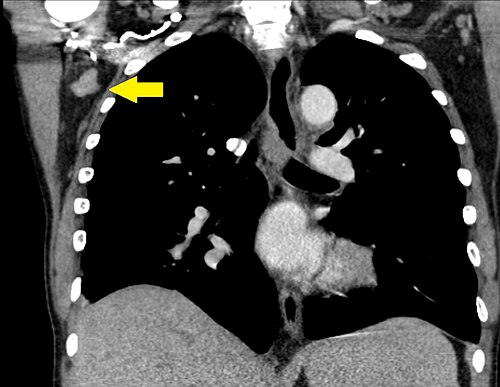
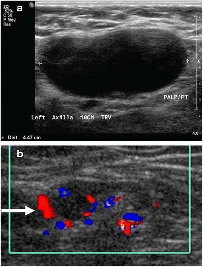

# MASSAS CERVICAIS

Para dominar massas cervicais, você não precisa decorar uma lista telefônica de doenças. Você precisa de um **mapa mental**. Na cirurgia de cabeça e pescoço, o diagnóstico é guiado por três pilares: **idade do paciente**, **localização da massa** e **tempo de evolução**.

Se você entender a embriologia e a anatomia dos níveis linfonodais, as questões de residência deixam de ser "decoreba" e passam a ser puramente lógicas. Vamos construir esse raciocínio juntos.

*Figura 1 - Tomografia computadorizada demonstrando linfadenopatia com linfonodos aumentados e anotações anatômicas. A avaliação por imagem é fundamental no diagnóstico diferencial de massas cervicais. Fonte: Mikael Häggström, CC0 | Wikimedia Commons*

## A Lógica do Diagnóstico Diferencial

O primeiro passo diante de qualquer paciente com um "caroço no pescoço" é olhar a idade. As bancas adoram testar se você sabe separar o joio do trigo aqui.

- **Crianças (0-15 anos):** A imensa maioria (cerca de 80-90%) das massas é **inflamatória/infecciosa** (linfadenites reacionais). Em segundo lugar, vêm as causas **congênitas**. Malignidade aqui é a exceção (linfomas, rabdomiossarcomas).

- **Adultos Jovens (16-40 anos):** O equilíbrio muda. As causas inflamatórias ainda são comuns, mas as doenças autoimunes e as massas congênitas que "esperaram" para manifestar (como o cisto branquial) ganham força.

- **Adultos (> 40 anos):** Aqui o sinal de alerta deve estar no máximo. Existe uma regra prática na cirurgia: em um adulto acima de 40 anos, uma massa cervical endurecida e persistente é **neoplasia maligna** até que se prove o contrário (regra dos 80%).

*Figura 2 - Imagem ultrassonográfica de linfonodo com características suspeitas de malignidade, demonstrando formato arredondado e perda do hilo ecogênico. Fonte: Mikael Häggström, CC0 | Wikimedia Commons*

## Tabela 1: Diagnóstico Diferencial por Faixa Etária

| Faixa Etária | Principal Etiologia | Exemplos Comuns |
| --- | --- | --- |
| **Pediátrica** | Inflamatória / Congênita | Linfadenite viral, Cisto Tireoglosso, Higroma Cístico |
| **Adulto Jovem** | Inflamatória / Congênita | Mononucleose, Cisto Branquial, Doença de Hodgkin |
| **Adulto (>40 anos)** | Neoplásica | Metástase de CEC, Carcinoma de Tireoide, Linfoma |

## Anatomia Aplicada: O Mapa do Pescoço

Você não pode ir para a prova sem saber os **Níveis Linfonodais**. As bancas não dizem mais "embaixo do queixo", elas dizem "Nível IA". Se você errar o nível, erra a origem provável da metástase.

- **Nível I:** Submentoniano (IA) e Submandibular (IB). Drenam assoalho da boca, lábios e língua anterior.

- **Nível II:** Jugular Superior (terço superior do músculo esternocleidomastoideo - ECM).

- **Nível III:** Jugular Médio (terço médio do ECM). **Dica de prova:** É o local clássico do Cisto Branquial e de metástases de laringe e orofaringe.

- **Nível IV:** Jugular Inferior (terço inferior do ECM, acima da clavícula).

- **Nível V:** Triângulo Posterior (atrás do ECM). Comum em linfomas e metástases de nasofaringe.

- **Nível VI:** Compartimento Anterior (ao redor da tireoide).

**O "Pulo do Gato" do Dr. Will:** Se a questão mencionar um linfonodo no **Nível III**, pense em Cisto Branquial se for jovem e cístico, ou metástase de laringe se for idoso e sólido.

## Massas Congênitas: As Favoritas das Bancas

Aqui é onde se concentram 40% das questões sobre o tema. O examinador quer saber se você entende a embriologia.

### Cisto do Ducto Tireoglosso (CDT)

É a anomalia congênita mais comum do pescoço.
**O Porquê:** A tireoide nasce na base da língua (forame cego) e desce até o pescoço baixo. Ela "fura" o osso hioide no caminho. Se o trajeto por onde ela passou não fechar, forma-se o cisto.

- **Clínica Clássica:** Massa na **linha média**, indolor, amolecida.

- **O Teste Patognomônico:** A massa **eleva-se à protrusão da língua** ou à deglutição. Por que? Porque o ducto está ancorado na base da língua e passa pelo hioide.

- **Tratamento (Cirurgia de Sistrunk):** Não basta tirar o cisto. Se você fizer apenas a exérese simples, a recidiva é quase certa. A técnica de Sistrunk exige a retirada do cisto + o trajeto ductal + a **porção central do osso hioide**.

**Cuidado com a pegadinha:** A alternativa vai dizer que basta aspirar o cisto ou retirar apenas a massa. Errado! Sem tirar o hioide, o paciente volta em 6 meses com o mesmo problema.

### Cistos Branquiais

Diferente do tireoglosso, o cisto branquial é **lateral**.

- **2º Arco Branquial (95% dos casos):** Localizado na borda anterior do terço superior/médio do ECM (Nível II/III).

- **Diagnóstico:** Frequentemente aparece em adultos jovens após uma infecção respiratória superior (o cisto "infla").

- **PAAF:** Se você puncionar, virá um líquido fluido com **cristais de colesterol**. Isso cai muito!

**Diferenciando os Arcos:**

- **1º Arco:** Perto da orelha e do nervo facial. Pode drenar para o conduto auditivo.

- **2º Arco:** Entre a carótida interna e externa, abrindo na fossa tonsilar (amígdala).

- **3º e 4º Arcos:** Raros. Geralmente relacionados ao seio piriforme e à tireoide (podem causar tireoidites de repetição à esquerda).

### Higroma Cístico (Linfangioma)

É uma malformação do sistema linfático.

- **Apresentação:** Massa cística, multiloculada, que **transilumina** ao exame físico.

- **Localização:** Geralmente no triângulo posterior (Nível V).

- **Tratamento:** A cirurgia é difícil porque o higroma "infiltra" os tecidos e nervos. Por isso, a **escleroterapia** (com OK-432 ou bleomicina) é frequentemente a primeira escolha ou um excelente adjuvante.

## Massas Inflamatórias e Infecciosas

### Angina de Ludwig

Não confunda com uma simples dor de garganta. É uma emergência cirúrgica!

- **Definição:** Infecção celulítica bilateral dos espaços submandibular, sublingual e submentoniano.

- **Origem:** Geralmente o 2º ou 3º molar inferior (infecção odontogênica).

- **Risco:** Edema de glote e obstrução de via aérea. O paciente tem "língua em aspecto de madeira" (elevada e endurecida).

- **Tratamento:** Antibiótico de largo espectro + Proteção de via aérea (muitas vezes cricotireoidostomia ou traqueostomia, pois a intubação é difícil pelo edema).

### Linfonodomegalias Reacionais

O erro comum aqui é querer biopsiar todo mundo.
Se um adolescente tem um linfonodo de 1,5 cm, fibroelástico e móvel após uma faringite, a conduta é **observação por 2 a 4 semanas**. Se não regredir ou se crescer, aí investigamos.

## Massas Neoplásicas: O Medo do Cirurgião

Aqui o cenário muda para o paciente tabagista e etilista.

### Metástases de Carcinoma Espinocelular (CEC)

Se um homem de 60 anos, fumante, aparece com uma massa endurecida no Nível II, ele tem um CEC de cabeça e pescoço até que se prove o contrário.

- **Investigação:** O primeiro passo **NUNCA** é a biópsia incisional (abrir o pescoço). Se você abrir, você "suja" o campo cirúrgico e piora o prognóstico do paciente.

- **O Caminho Certo:**

- Exame físico completo (incluindo oroscopia e laringoscopia).

- **PAAF** (Punção Aspirativa por Agulha Fina). A PAAF é citologia, não histologia, e não compromete a cirurgia futura.

- Imagem (TC ou RM).

- Se a PAAF for positiva e você não achou o tumor na boca/laringe, faz-se a "Panendoscopia" com biópsias dirigidas.

### Linfonodo de Virchow (Sinal de Troisier)

É o linfonodo supraclavicular esquerdo.
**Por que à esquerda?** Porque é onde o ducto torácico desemboca na veia subclávia. Metástases de tumores abdominais (estômago é o clássico, mas também pâncreas e ovário) viajam pelo ducto torácico e "estacionam" ali. No MedEvo, sempre reforçamos: viu Virchow, peça uma Endoscopia Digestiva Alta.

### Tumores de Tireoide

O **Carcinoma Papilífero** é o mais comum. Ele adora viajar por linfáticos. Às vezes, a massa cervical (linfonodo) é maior que o próprio tumor na tireoide. Se a PAAF do linfonodo mostrar "células foliculares" ou "corpos psamomatosos", o diagnóstico está feito.

## Tabela 2: Comparativo das Massas Cervicais Mais Cobradas

| Patologia | Localização | Característica Chave | Conduta de Escolha |
| --- | --- | --- | --- |
| **Cisto Tireoglosso** | Linha Média | Move à protrusão da língua | Cirurgia de Sistrunk |
| **Cisto Branquial** | Lateral (Ant. ao ECM) | Cristais de Colesterol na PAAF | Exérese Cirúrgica |
| **Higroma Cístico** | Triângulo Posterior | Transiluminação positiva | Escleroterapia / Cirurgia |
| **Linfoma** | Múltiplas cadeias | Sintomas B (febre, suor noturno) | Biópsia Excisionale (Linfonodo inteiro) |
| **Metástase CEC** | Níveis II, III, IV | Endurecido, fixo, tabagista | PAAF + Busca do Primário |

## Investigação Armada: Qual exame pedir?

Muitos alunos se perdem na ordem dos exames. Vamos organizar:

- **Ultrassonografia (USG):** É o melhor exame inicial, especialmente em crianças e para avaliar tireoide. Diferencia massa sólida de cística com precisão.

- **PAAF:** É o padrão-ouro para o diagnóstico citológico inicial. Baixo custo, segura e não dissemina tumor (diferente da biópsia de agulha grossa/core-biopsy em pescoço, que deve ser evitada para CEC).

- **Tomografia (TC) com Contraste:** Essencial para o planejamento cirúrgico. Mostra a relação da massa com os vasos (carótida e jugular). No Cisto Branquial tipo II, vemos a massa encostada no feixe jugulocarotídeo.

- **Biópsia Excisional (Retirar o gânglio inteiro):** Reservada para quando a PAAF é inconclusiva e suspeitamos fortemente de **Linfoma**. Para linfoma, o patologista precisa ver a arquitetura do linfonodo, o que a PAAF não permite.

## Trauma Cervical: As Zonas de Perigo

As bancas amam misturar massas com trauma. Você precisa saber as zonas para decidir quem vai direto para o centro cirúrgico.

- **Zona I (Base do Pescoço):** Da clavícula até a cartilagem cricoide. Perigosa porque abriga os grandes vasos da base e o ápice pulmonar.

- **Zona II (Meio do Pescoço):** Da cricoide até o ângulo da mandíbula. É a zona mais comum de lesão, mas a mais fácil de explorar cirurgicamente.

- **Zona III (Topo do Pescoço):** Do ângulo da mandíbula até a base do crânio. Difícil acesso cirúrgico (muitas vezes requer desarticulação da mandíbula).

**Regra de Ouro Atual:** Independente da zona, se o paciente tem **instabilidade hemodinâmica** ou **sinais francos de lesão** (hematoma em expansão, choque, sopro, saída de ar pela ferida), a conduta é **Exploração Cirúrgica Imediata**. Se estiver estável, podemos fazer Angio-TC.

## Situações Especiais e Pegadinhas

### Doença de Castleman

É uma causa rara de linfonodomegalia (Hiperplasia Linfonodal Angiofolicular). Pode mimetizar um linfoma ou uma massa vascularizada. O diagnóstico é histopatológico após a retirada.

### Ectopia Tireoidiana

Cuidado! Às vezes, aquela massa na linha média (que você acha que é um cisto tireoglosso) é a **única tireoide funcional** do paciente. Se você retirá-la sem conferir se existe tireoide no lugar normal (pela USG), o paciente ficará hipotireoideo severo para o resto da vida.

### Cristais de Colesterol

Viu essa expressão na prova? Marque **Cisto Branquial**. É o resíduo da descamação epitelial dentro do cisto que não tem para onde sair.

## Tabela 3: Sinais de Alerta (Red Flags) para Malignidade

| Sinal | Significado |
| --- | --- |
| **Consistência Pétrea** | Sugere metástase de carcinoma |
| **Fixação a planos profundos** | Sugere invasão capsular/neoplasia avançada |
| **Crescimento rápido (>2cm)** | Alerta para Linfoma ou CEC agressivo |
| **Otalgia reflexa ipsilateral** | Nervo IX ou X invadido por tumor de orofaringe/laringe |
| **Paralisia de corda vocal** | Invasão do nervo laríngeo recorrente |

## Pontos-Chave para Prova

- **Cisto do Ducto Tireoglosso:** Linha média, sobe com a língua. Cirurgia de Sistrunk (inclui corpo do hioide).

- **Cisto Branquial:** Lateral, borda anterior do ECM. 2º arco é o mais comum. PAAF com cristais de colesterol.

- **Higroma Cístico:** Criança, massa mole, transilumina. Tratamento pode ser escleroterapia.

- **Regra de Ouro do Adulto:** Massa cervical em >40 anos é câncer até prova em contrário.

- **Investigação de Malignidade:** PAAF primeiro, NUNCA biópsia incisional de cara.

- **Linfonodo de Virchow:** Supraclavicular esquerdo = metástase abdominal (Gástrico).

- **Nível III:** Localizado no terço médio do músculo esternocleidomastoideo.

- **Angina de Ludwig:** Infecção submandibular bilateral, risco de via aérea, origem dentária.

- **Zonas de Trauma:** I (baixo), II (médio), III (alto). Zona II é a mais explorada.

- **Sistrunk:** A técnica remove o cisto, o trajeto e a parte central do osso hioide para evitar a **alta taxa de recidiva**.

- **Carcinoma Papilífero:** Se encontrar células tireoidianas em linfonodo cervical, é metástase de papilífero.

- **USG Cervical:** Melhor exame para triagem inicial e avaliação de características de benignidade vs malignidade (perda do hilo gorduroso, vascularização central vs periférica).

- **Contraindicação Absoluta:** Não se faz biópsia incisional de massa cervical suspeita de CEC sem antes esgotar a busca pelo sítio primário e realizar PAAF.

- **Linfonodo Delphiano:** Linfonodo pré-laríngeo (Nível VI) que, se aumentado, sugere patologia tireoidiana ou laríngea.

- **Sinal de Protrusão da Língua:** Único para Cisto Tireoglosso. Se a massa não mexer, desconfie de Cisto Dermóide (que também fica na linha média, mas é mais superficial e não tem ligação com o hioide).

 Cópia offline para consulta pessoal.
 Fonte original:
 [https://www.medevo.com.br/material-apoio/ler/6abe5d99-6376-4a74-89eb-561afc2aaf5e](https://www.medevo.com.br/material-apoio/ler/6abe5d99-6376-4a74-89eb-561afc2aaf5e)
