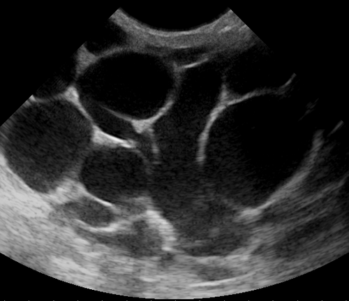

# MASTITES E ABCESSOS MAMÁRIOS

Para entender as infecções mamárias, você precisa primeiro separar o joio do trigo. Na prática clínica e, principalmente, nas provas de residência, dividimos o tema em dois grandes universos: o ciclo gravídico-puerperal e o período fora da lactação. A lógica de raciocínio muda completamente entre eles. Enquanto na lactante o problema quase sempre é mecânico (pega incorreta e estase), na não lactante o buraco é mais embaixo, envolvendo fatores como tabagismo e processos autoimunes.

## Mastite Puerperal: O Cenário Mais Comum

A mastite puerperal é a inflamação da glândula mamária que ocorre durante a lactação, geralmente nas primeiras seis semanas após o parto, embora possa ocorrer em qualquer fase. É aqui que as bancas concentram 70% das questões.

*Figura 1 - Fotografia clínica de mastite mamária demonstrando eritema, edema e sinais inflamatórios característicos da infecção mamária puerperal. Fonte: CC BY-SA 4.0 | Wikimedia Commons*

## Fisiopatologia: O Porquê da Infecção

Por que uma mama saudável, de repente, inflama e infecta? O gatilho quase nunca é a bactéria sozinha, mas sim a estase láctea. Imagine o ducto mamário como um rio. Se a água corre, ela é limpa. Se a água para (estase), ela vira um pântano propício para o crescimento bacteriano.

A sequência clássica que você deve memorizar para a prova é:

- Pega incorreta do recém-nascido.

- Formação de fissuras mamilares (porta de entrada).

- Esvaziamento incompleto da mama (estase láctea).

- Proliferação bacteriana (infecção).

O agente etiológico em mais de 90% dos casos é o *Staphylococcus aureus*. Ele faz parte da microbiota da pele da mãe e da orofaringe do bebê. Outros agentes possíveis, porém menos comuns, são o *Staphylococcus epidermidis* e o *Streptococcus pyogenes*.

### Quadro Clínico e Diagnóstico

O diagnóstico da mastite é eminentemente clínico. Não perca tempo pedindo exames laboratoriais ou de imagem para uma mastite simples. O quadro típico apresenta:

- Dor intensa e localizada em um quadrante da mama (frequentemente o súpero-externo).

- Sinais flogísticos: calor, rubor e edema (turgidez).

- Sintomas sistêmicos: febre alta (geralmente > 38,5°C), calafrios e mal-estar generalizado (parece uma gripe).

Aqui entra uma diferenciação fundamental que o MedEvo sempre destaca: a diferença entre ingurgitamento mamário e mastite. No ingurgitamento, a mama está cheia, pesada e dolorida, mas a dor é bilateral e não há febre alta ou sinais inflamatórios sistêmicos. Na mastite, o processo é geralmente unilateral e o componente sistêmico é marcante.

### Tratamento da Mastite Puerperal

O tratamento baseia-se em um tripé: esvaziamento da mama, antibioticoterapia e medidas de suporte.

**1. Esvaziamento Mamário (A conduta mais importante):**
Nunca, em hipótese alguma, oriente a suspensão da amamentação na mama afetada, a menos que haja saída de pus pelo mamilo (o que é raro). O esvaziamento é o que trata a causa base (estase). Se a dor for insuportável para amamentar diretamente, a paciente deve realizar a ordenha manual ou mecânica.

**2. Antibioticoterapia:**
Como o *S. aureus* é o principal culpado, usamos antibióticos com boa cobertura para gram-positivos.

- Primeira escolha: Cefalexina (500 mg, via oral, de 6 em 6 horas) por 7 a 10 dias.

- Alternativa (se alergia a penicilinas): Clindamicina (300 mg, via oral, de 6 em 6 horas).

- Casos graves (necessidade de internação): Oxacilina ou Cefalosporinas de 1ª geração intravenosas (Cefazolina).

**3. Medidas de Suporte:**

- Analgésicos e Anti-inflamatórios (AINEs): Ibuprofeno ou Paracetamol para controle da dor e febre.

- Suporte mamário: Uso de sutiãs firmes que sustentem a mama, reduzindo a tração nos ligamentos de Cooper e aliviando a dor.

- Compressas: Aqui há divergência, mas a tendência atual é recomendar compressas frias após as mamadas para reduzir o edema. Evite compressas quentes, que podem aumentar a vasodilatação e a inflamação.

### Tabela 1: Diagnóstico Diferencial no Puerpério

| Característica | Ingurgitamento Mamário | Mastite Puerperal | Abscesso Mamário |
| --- | --- | --- | --- |
| Lateralidade | Bilateral | Geralmente Unilateral | Unilateral |
| Febre | Ausente ou Baixa | Alta (> 38,5°C) | Alta e Persistente |
| Sinais Locais | Mama tensa e brilhante | Eritema e calor local | Flutuação e massa palpável |
| Conduta | Ordenha e ajuste de pega | ATB + Manter amamentação | Drenagem + ATB |

## Abscesso Mamário Puerperal

O abscesso é a principal complicação da mastite não tratada ou tratada de forma inadequada. Se a paciente está em uso de antibiótico há 48-72 horas e não apresenta melhora da febre ou da dor, você deve suspeitar de abscesso.

*Figura 2 - Imagem ultrassonográfica de mama com mastite puerperal, demonstrando coleção líquida compatível com abscesso mamário. A ultrassonografia é o exame de escolha para avaliação de complicações. Fonte: Nevit Dilmen, CC BY-SA 3.0 | Wikimedia Commons*

## Diagnóstico do Abscesso

Ao exame físico, a palavra-chave é flutuação. Se você palpa uma área amolecida dentro da placa inflamatória, o diagnóstico está feito. No entanto, em mamas muito volumosas, o abscesso pode ser profundo e a flutuação difícil de perceber.

Nesse cenário, o Ultrassom (USG) é o padrão-ouro. Ele identifica coleções líquidas, estima o volume e guia o tratamento. Lembre-se: em lactantes, a mamografia é evitada devido à densidade aumentada da mama e ao desconforto, sendo o USG a primeira linha para qualquer nódulo ou coleção.

### Tratamento do Abscesso

A regra de ouro da cirurgia se aplica aqui: "Ubi pus, ibi evacua" (Onde há pus, deve-se esvaziar).

- **Punção Aspirativa por Agulha Grossa:** É a tendência atual para abscessos menores que 3 a 5 cm. É menos invasiva, não deixa cicatrizes extensas e permite que a paciente continue amamentando com menos dor. Pode ser repetida se a coleção refazer.

- **Drenagem Cirúrgica:** Reservada para abscessos grandes (> 5 cm), multiloculados ou quando a punção falha. A incisão deve ser preferencialmente periareolar ou acompanhando as linhas de força da pele (linhas de Langer).

Importante: Mesmo com abscesso, a amamentação deve ser mantida. O leite não está infectado; a infecção está no tecido intersticial da mama. A única exceção é se a incisão cirúrgica for tão próxima do mamilo que impeça a pega ou se houver drenagem espontânea de pus pelo mamilo.

## Mastites Não Puerperais

Aqui entramos em um terreno onde o Dr. Will sempre alerta para as pegadinhas de prova. As mastites fora do puerpério são menos frequentes, mas muito mais propensas a recidivas e confusões diagnósticas.

### Mastite Periductal (Ectasia Ductal e Doença de Zuska)

Esta é a "queridinha" das bancas quando o assunto é mastite crônica.

- **Perfil da paciente:** Mulher jovem ou de meia-idade, quase invariavelmente tabagista.

- **Fisiopatologia:** O tabagismo causa uma metaplasia escamosa dos ductos lactíferos subareolares. O epitélio produz queratina, que obstrui o ducto. O ducto obstruído dilata (ectasia), inflama e acaba infectando por bactérias anaeróbias e estafilococos.

- **Quadro Clínico:** Abscesso subareolar recidivante. A paciente drena o abscesso, melhora, e meses depois ele volta no mesmo lugar. Frequentemente evolui com uma fístula periareolar (saída de secreção por um orifício ao lado da aréola).

**Tratamento da Doença de Zuska:**
Não adianta apenas dar antibiótico ou drenar o abscesso agudo. A recidiva é a regra se o fator causal não for removido.

- Cessação do tabagismo (fundamental).

- Antibioticoterapia com cobertura para anaeróbios (ex: Amoxicilina + Clavulanato ou Metronidazol + Cefalexina).

- Cirurgia definitiva: Excisão de todos os ductos subareolares (Operação de Urban ou técnica de Hadfield). Se houver fístula, o trajeto fistuloso deve ser ressecado por completo (fistulectomia).

### Mastite Granulomatosa Idiopática

Esta é uma doença inflamatória rara, de causa desconhecida (provavelmente autoimune), que mimetiza perfeitamente um câncer de mama.

- **Quadro:** Nódulos endurecidos, múltiplos, que podem ulcerar a pele.

- **Diagnóstico:** É um diagnóstico de exclusão. Você precisa descartar Tuberculose mamária, Sarcoidose e, principalmente, Carcinoma de Mama. O diagnóstico definitivo vem pela biópsia (Histopatologia), que mostra granulomas não caseosos centrados no lóbulo mamário.

- **Tratamento:** Diferente das outras, o tratamento principal não é antibiótico, mas sim Corticosteroides em doses altas (Prednisona 0,5 a 1 mg/kg/dia). Em casos refratários, pode-se usar imunossupressores como o Metotrexato.

### Tabela 2: Antibioticoterapia nas Mastites

| Condição | Antibiótico de Escolha | Via | Duração |
| --- | --- | --- | --- |
| Mastite Puerperal Leve | Cefalexina 500mg 6/6h | VO | 7-10 dias |
| Mastite Puerperal (Alergia Penicilina) | Clindamicina 300mg 6/6h | VO | 7-10 dias |
| Mastite Puerperal Grave | Cefazolina 1g 8/8h ou Oxacilina | IV | Até melhora clínica |
| Abscesso Mamário (Pós-drenagem) | Cefalexina ou Amox+Clavulanato | VO | 10-14 dias (até 21 se grave) |
| Mastite Periductal (Zuska) | Amoxicilina + Clavulanato | VO | 14 dias |

## Diagnósticos Diferenciais Cruciais

Nesta seção, vamos abordar o que separa o aluno que passa do aluno que fica. Existem condições que "parecem" mastite, mas são muito mais graves ou requerem tratamentos específicos.

### Carcinoma Inflamatório da Mama

Este é o maior medo do mastologista. É uma forma agressiva de câncer de mama onde as células tumorais invadem os linfáticos dérmicos, causando um bloqueio da drenagem linfática.

- **Sinais de Alerta:** Mama vermelha, quente e edemaciada (aspecto de "casca de laranja" ou *peau d'orange*), mas SEM febre e SEM melhora após 7 a 10 dias de antibiótico.

- **Conduta:** Toda "mastite" que não responde ao tratamento convencional em 10 dias DEVE ser submetida a biópsia (core biopsy do nódulo ou biópsia de pele se houver apenas edema).

- **Erro clássico:** Continuar trocando o antibiótico várias vezes enquanto o câncer progride. Se não melhorou com o primeiro ciclo, investigue malignidade.

### Doença de Paget do Mamilo

Muitas vezes confundida com um processo inflamatório ou alérgico (eczema).

- **Quadro:** Lesão eczematosa, descamativa e pruriginosa no mamilo.

- **Diferença fundamental:** O eczema comum (alérgico) costuma ser bilateral e melhora com corticoide tópico. A Doença de Paget é unilateral, destrói a arquitetura do mamilo e NÃO melhora com corticoide.

- **Significado:** Paget é um carcinoma *in situ* (ou invasor) dos ductos que migrou para a epiderme do mamilo. O diagnóstico é por biópsia (punch) da lesão.

### Monilíase (Candidíase) Areolomamilar

Comum em lactantes. A paciente queixa-se de dor em "agulhadas" ou "queimação" que irradia para o interior da mama, piorando logo após a mamada.

- **Exame físico:** O mamilo pode parecer normal ou levemente avermelhado e brilhante, com descamação fina. Frequentemente o bebê tem "sapinho" (monilíase oral).

- **Tratamento:** Nistatina ou Miconazol tópico para a mãe e para o bebê. Em casos persistentes, Fluconazol oral para a mãe.

## Situações Especiais e Complicações

### Fístulas Mamárias

A fístula é a comunicação anômala entre um ducto ou cavidade de abscesso e a pele. Na mastite periductal, a fístula periareolar é a marca registrada. O tratamento é sempre cirúrgico após o controle do processo infeccioso agudo. A simples cauterização do trajeto não funciona; é necessário ressecar o trajeto e o ducto doente que o originou.

### Tuberculose Mamária

Rara, mas cobrada em provas de regiões com alta prevalência de TB. Apresenta-se como uma mastite crônica, com abscessos "frios" (sem muito calor ou rubor) e fístulas que drenam secreção caseosa. O diagnóstico é feito pela pesquisa de BAAR ou cultura no pus/tecido, e o tratamento é o esquema RIPE padrão do Ministério da Saúde.

### Tabela 3: Resumo de Condutas em Mastites Não Puerperais

| Suspeita Clínica | Fator de Risco / Característica | Conduta Inicial |
| --- | --- | --- |
| Mastite Periductal | Tabagismo / Abscesso Recidivante | ATB + Cessar Tabaco + Cirurgia |
| Mastite Granulomatosa | Diagnóstico de Exclusão / Granulomas | Corticoterapia |
| Carcinoma Inflamatório | Pele em casca de laranja / Sem febre | Biópsia de Pele/Nódulo |
| Doença de Paget | Eczema unilateral de mamilo | Biópsia (Punch) |
| Monilíase | Dor em queimação / Pós-mamada | Antifúngico tópico/oral |

## Anatomia e Fisiologia Aplicada

Para entender por que a mastite ocorre preferencialmente no quadrante súpero-externo, lembre-se que este é o quadrante com maior volume de tecido glandular (onde fica o prolongamento axilar da mama ou cauda de Spence). Mais glândula significa mais produção de leite e, consequentemente, maior risco de estase se o esvaziamento for incompleto.

Sobre a fisiologia da lactação, as bancas adoram trocar as funções da Prolactina e da Ocitocina:

- **Prolactina:** Produzida na hipófise anterior, é responsável pela PRODUÇÃO do leite nos alvéolos.

- **Ocitocina:** Produzida no hipotálamo e liberada pela hipófise posterior, é responsável pela EJEÇÃO do leite (contração das células mioepiteliais). O estímulo da sucção do bebê é o principal gatilho para a liberação de ambos.

Na mastite, a dor e o estresse podem inibir o reflexo de ejeção da ocitocina, dificultando ainda mais o esvaziamento da mama e criando um ciclo vicioso. Por isso, o suporte emocional e o controle da dor são partes integrantes do tratamento médico.

## Manejo Prático: O Passo a Passo no Consultório

Imagine que chega uma paciente, 15 dias de pós-parto, com febre de 39°C e mama esquerda vermelha.

- **Exame Físico:** Procure por flutuação. Se houver dúvida, peça um USG imediatamente.

- **Avalie a Pega:** Peça para a mãe amamentar na sua frente. Observe se o bebê abocanha apenas o mamilo (errado) ou a maior parte da aréola (correto). Corrija a pega.

- **Prescreva:** Cefalexina 500mg 6/6h por 10 dias + Ibuprofeno 600mg 8/8h.

- **Oriente:** "Não pare de amamentar. Comece pela mama saudável para estimular o reflexo de descida e depois passe para a mama com mastite. Se doer demais, faça ordenha manual antes para aliviar a pressão".

- **Retorno:** Marque um retorno ou contato em 48-72 horas. Se não houver melhora da febre, você precisa puncionar ou drenar, pois um abscesso se formou.

Este fluxograma resolve 90% das questões de prova e 100% dos casos simples de consultório.

## Pontos-Chave para Prova

- O principal agente etiológico de todas as mastites infecciosas é o *Staphylococcus aureus*.

- A causa primária da mastite puerperal é a estase láctea, geralmente secundária à pega incorreta e fissuras mamilares.

- O diagnóstico da mastite é clínico. O USG é reservado para a suspeita de abscesso (coleção/flutuação).

- **NUNCA** suspenda a amamentação na mastite ou no abscesso, exceto se houver pus saindo pelo mamilo ou se a cirurgia impedir a pega.

- O tratamento de primeira escolha para mastite puerperal é a Cefalexina por 7 a 10 dias.

- Abscesso mamário deve ser esvaziado, preferencialmente por punção aspirativa (se < 5cm) ou drenagem cirúrgica.

- Mastite periductal (Doença de Zuska) está intimamente ligada ao tabagismo e tende a ser recidivante.

- Fístula periareolar recidivante exige ressecção cirúrgica do trajeto e dos ductos subareolares (fistulectomia).

- Suspeite de Carcinoma Inflamatório se houver "mastite" que não responde a antibiótico ou se houver aspecto de casca de laranja sem febre.

- Doença de Paget é um diagnóstico diferencial de lesões mamilares; é unilateral e não melhora com corticoide.

- A mastite granulomatosa idiopática é tratada com corticoides, após excluir câncer e tuberculose.

- A ordenha manual da aréola antes da mamada é a conduta padrão no ingurgitamento para facilitar a pega do bebê.

- O quadrante súpero-externo é o local mais frequente de mastites por concentrar maior volume glandular.

- Prolactina produz o leite; Ocitocina ejeta o leite. O estresse da dor na mastite inibe a ocitocina.

- Erro clássico de prova: Indicar interrupção do aleitamento ou uso de compressas quentes prolongadas. 🍼

 Cópia offline para consulta pessoal.
 Fonte original:
 [https://www.medevo.com.br/material-apoio/ler/a375dfcf-082c-4bb6-90d6-ff050ef363a9](https://www.medevo.com.br/material-apoio/ler/a375dfcf-082c-4bb6-90d6-ff050ef363a9)
