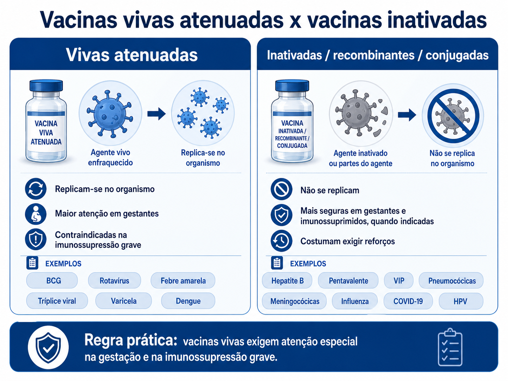
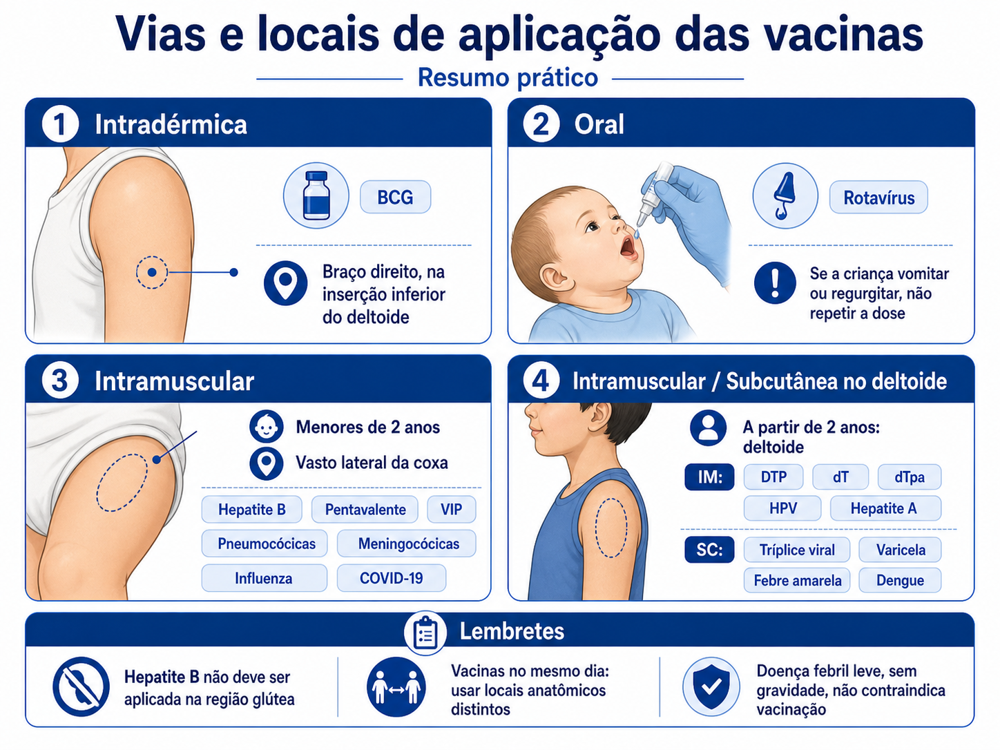
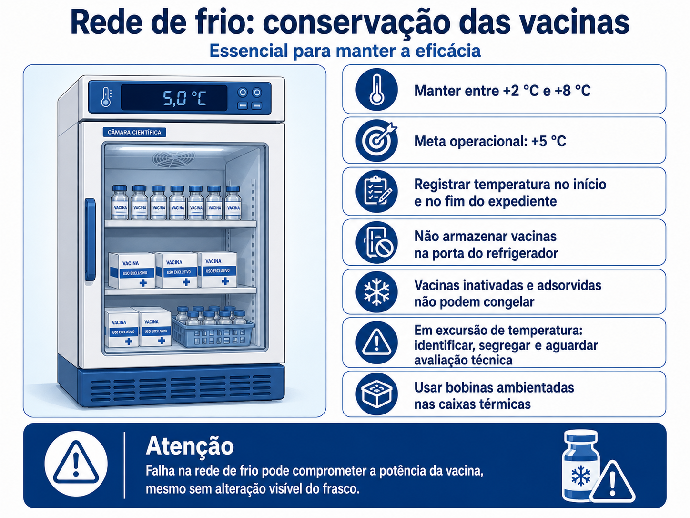

# MedEvo — A plataforma que acelera sua evolução médica

## 1. Vacinas atenuadas e inativadas: a lógica das contraindicações

*Figura 1 - Diferença prática entre vacinas vivas atenuadas e vacinas inativadas, recombinantes ou conjugadas.*

A primeira divisão que deve guiar o raciocínio é simples:

- **Vacinas vivas atenuadas**: contêm microrganismo vivo enfraquecido, capaz de replicar. Em geral, são contraindicadas na gestação e na imunossupressão grave.

- Exemplos: BCG, rotavírus, febre amarela, tríplice viral, varicela e dengue.

- **Vacinas inativadas, recombinantes, conjugadas ou de subunidade**: não se replicam. Podem ser usadas com mais segurança em imunossuprimidos e gestantes, quando indicadas.

- Exemplos: hepatite B, pentavalente, VIP, pneumocócica, meningocócicas, influenza, hepatite A, HPV, COVID-19, dT, dTpa e VSR.

Regra prática: **vacina viva exige atenção para gestante, imunossuprimido e uso de corticoide em dose imunossupressora**. Vacina inativada costuma exigir mais doses e reforços, mas não causa doença por replicação do agente.

## 2. Calendário da criança: o que precisa estar automático

### Mapa rápido do primeiro ciclo

| Idade | Vacinas principais |
| --- | --- |
| Ao nascer | BCG + hepatite B |
| 2 meses | Pentavalente + VIP + Pneumo 20 + rotavírus |
| 3 meses | Meningocócica C |
| 4 meses | Pentavalente + VIP + Pneumo 10 durante a transição para Pneumo 20 + rotavírus |
| 5 meses | Meningocócica C |
| 6 meses | Pentavalente + VIP + influenza + COVID-19 |
| 7 meses | COVID-19, conforme imunizante usado |
| 9 meses | Febre amarela + COVID-19, se esquema com Pfizer |
| 12 meses | Tríplice viral + reforço com Pneumo 20 + meningocócica ACWY |
| 15 meses | DTP 1º reforço + VIP reforço + hepatite A + tríplice viral 2ª dose + varicela 1ª dose |
| 4 anos | DTP 2º reforço + febre amarela reforço + varicela 2ª dose |

### Ao nascer: BCG e hepatite B

**BCG**

- Protege principalmente contra formas graves e disseminadas da tuberculose, como tuberculose miliar e meníngea.

- Não impede infecção primária nem tuberculose pulmonar comum.

- Aplicação: intradérmica, preferencialmente no braço direito, na inserção inferior do deltoide.

- Se não houver cicatriz após dose válida, **não se revacina rotineiramente**.

- Exceções envolvem situações específicas, como dose inválida e imunoprofilaxia de contatos domiciliares de hanseníase, conforme avaliação do serviço.

**Hepatite B**

- Deve ser aplicada preferencialmente nas primeiras 12 horas de vida.

- Se não foi feita ao nascer, pode ser aplicada até 1 mês de vida.

- Após esse período, a proteção contra hepatite B será iniciada com a pentavalente aos 2 meses.

- Recém-nascido de mãe HBsAg positiva deve receber vacina hepatite B e imunoglobulina anti-hepatite B em locais diferentes, idealmente nas primeiras 12 horas.

### 2, 4 e 6 meses: pentavalente, VIP e pneumocócica conjugada

**Pentavalente**

- Protege contra difteria, tétano, coqueluche, hepatite B e Haemophilus influenzae tipo b.

- Hib não é influenza. Hib causa principalmente meningite, pneumonia e outras infecções bacterianas invasivas.

**VIP**

- A rotina atual usa vacina poliomielite inativada.

- Esquema: 2, 4 e 6 meses, com reforço aos 15 meses.

- A VOP saiu da rotina do calendário infantil, reduzindo o risco de poliomielite associada à vacina oral.

**Pneumocócica 20-valente (P20) e transição da P10**

- A Pneumo 20 foi incorporada ao Calendário Nacional de Vacinação para ampliar a proteção contra doença pneumocócica em crianças menores de 5 anos.

- Durante a transição de estoque, o esquema infantil é: Pneumo 20 aos 2 meses, Pneumo 10 aos 4 meses e reforço com Pneumo 20 aos 12 meses, respeitando intervalo mínimo de 60 dias entre a segunda dose e o reforço.

- Depois do esgotamento da Pneumo 10, o esquema passa a ser feito exclusivamente com Pneumo 20.

- As vacinas pneumocócicas 13-valente e 23-valente permanecem reservadas para indicações específicas, como grupos de risco e CRIE, conforme protocolo vigente.

### Rotavírus: mudou o limite etário

A vacina rotavírus é oral, viva atenuada, feita na rotina aos 2 e 4 meses.

Limites importantes:

- 1ª dose: de 1 mês e 15 dias até 11 meses e 29 dias.

- 2ª dose: de 3 meses e 15 dias até 23 meses e 29 dias.

- Intervalo mínimo entre as doses: 30 dias.

- Se a criança regurgitar, cuspir ou vomitar após a dose, **não repetir**.

Contraindicações relevantes: história de invaginação intestinal, malformação gastrointestinal predisponente, imunodepressão grave e uso de corticoide em dose imunossupressora.

### Meningocócicas: C no lactente, ACWY no reforço e na adolescência

- Meningocócica C: 3 e 5 meses.

- Reforço aos 12 meses: preferencialmente com meningocócica ACWY.

- Adolescente: meningocócica ACWY em dose única entre 11 e 14 anos.

A mudança mais importante é lembrar que, no calendário atual, o reforço de 12 meses é com **ACWY**, não mais apenas com meningocócica C.

### Febre amarela

- Rotina infantil: 1 dose aos 9 meses e reforço aos 4 anos.

- Se recebeu 1 dose a partir dos 5 anos de idade, considera-se esquema completo.

- Se recebeu apenas 1 dose antes dos 5 anos, precisa de reforço.

- Crianças de 6 a 8 meses, gestantes e idosos podem receber em situações excepcionais de alto risco epidemiológico, após avaliação risco-benefício.

A vacina é viva atenuada. Em geral, é contraindicada em imunossupressão grave, gestação e menores de 6 meses.

### Tríplice viral e varicela

**Tríplice viral (SCR)**

- 1ª dose aos 12 meses.

- 2ª dose aos 15 meses.

- Protege contra sarampo, caxumba e rubéola.

**Varicela**

- 1ª dose aos 15 meses.

- 2ª dose aos 4 anos.

- Em caso de indisponibilidade da varicela monovalente, pode ser usada a tetraviral conforme orientação do serviço.

Em situação de risco epidemiológico para sarampo, pode ser indicada a **dose zero** da tríplice viral entre 6 meses e 11 meses e 29 dias. Essa dose não conta para o calendário de rotina; a criança ainda deve receber as doses de 12 e 15 meses.

### Influenza e COVID-19 na criança

**Influenza**

- Crianças de 6 meses a menores de 6 anos devem ser vacinadas anualmente.

- Na primeira vacinação contra influenza, fazem 2 doses com intervalo de 30 dias.

- Nos anos seguintes, fazem 1 dose anual.

**COVID-19**

- Indicada na rotina para crianças de 6 meses a 4 anos, 11 meses e 29 dias.

- Esquema depende do imunizante:

- Pfizer: 3 doses, aos 6, 7 e 9 meses.

- Moderna: 2 doses, aos 6 e 7 meses.

- Crianças imunocomprometidas: 3 doses no esquema básico, independentemente do imunizante, e doses periódicas conforme orientação vigente.

- Crianças que não completaram o esquema até 9 meses podem atualizar até 4 anos, 11 meses e 29 dias, respeitando intervalos mínimos.

## 3. Adolescente: HPV, dengue e meningocócica ACWY

Na adolescência, o calendário foca em prevenção de câncer, arboviroses, meningites e resgate de esquemas incompletos.

**HPV4**

- 1 dose para meninas e meninos de 9 a 14 anos.

- Estratégia de resgate pode incluir adolescentes de 15 a 19 anos não vacinados, conforme organização local.

- Grupos especiais, como imunodeprimidos, pessoas vivendo com HIV, transplantados, pacientes oncológicos, usuários de PrEP e vítimas de violência sexual, seguem esquemas ampliados, geralmente com 3 doses, conforme faixa etária e indicação.

**Dengue**

- Vacina viva atenuada.

- Indicada para 10 a 14 anos, em 2 doses com intervalo de 3 meses.

- Contraindicada em gestantes, lactantes, imunodeprimidos e pessoas fora das faixas etárias indicadas pelo PNI.

**Meningocócica ACWY**

- 1 dose entre 11 e 14 anos.

**Resgate vacinal**

- Hepatite B: completar 3 doses.

- dT: completar 3 doses e manter reforço a cada 10 anos.

- Tríplice viral: 2 doses até 29 anos; 1 dose de 30 a 59 anos. Profissionais de saúde devem ter 2 doses.

## 4. Adultos e idosos: resgate e grupos de risco

Quando o adulto não sabe o histórico vacinal, a conduta usual é **atualizar o cartão, sem reiniciar esquemas já documentados**.

**Adultos de 25 a 59 anos**

- Hepatite B: 3 doses, se esquema incompleto ou desconhecido.

- dT: 3 doses, se esquema incompleto ou desconhecido; reforço a cada 10 anos.

- Tríplice viral: 2 doses até 29 anos; 1 dose de 30 a 59 anos.

- Febre amarela: 1 dose conforme histórico e risco epidemiológico.

- Varicela: indicada em situações específicas, como trabalhadores da saúde e povos indígenas sem história da doença, conforme avaliação.

**Idosos**

- Influenza: 1 dose anual.

- COVID-19: 1 dose a cada 6 meses.

- dT: manter reforço a cada 10 anos, antecipando para 5 anos em ferimentos de risco.

- Pneumocócica 23v: indicada para idosos acamados ou institucionalizados sem esquema completo e para povos indígenas, conforme calendário e CRIE.

- Febre amarela: somente se não vacinado e com risco epidemiológico, após avaliação de contraindicações.

## 5. Gestantes: proteger mãe e bebê

Vacinas indicadas na gestação:

- **Influenza**: 1 dose por temporada, em qualquer idade gestacional.

- **Hepatite B**: completar esquema, se necessário.

- **dT e dTpa**:

- Atualizar dT se esquema incompleto.

- dTpa: 1 dose em cada gestação, a partir da 20ª semana.

- Objetivo principal da dTpa: proteger o recém-nascido contra coqueluche por anticorpos transplacentários.

- **COVID-19**: 1 dose em cada gestação, em qualquer idade gestacional, respeitando intervalo mínimo recomendado.

- **VSR**: 1 dose em cada gestação, a partir da 28ª semana, para proteger o bebê contra bronquiolite e doença respiratória grave nos primeiros meses de vida.

Vacinas geralmente contraindicadas na gestação:

- Tríplice viral.

- Varicela.

- Dengue.

- BCG.

- Febre amarela, exceto em situação de alto risco epidemiológico após avaliação risco-benefício.

## 6. Vias e locais de aplicação: resumo prático

| Via | Vacinas mais cobradas | Observações |
| --- | --- | --- |
| Intradérmica | BCG | Preferencialmente braço direito, inserção inferior do deltoide |
| Oral | Rotavírus | Não repetir se vomitar ou regurgitar |
| Subcutânea | Tríplice viral, varicela, febre amarela, dengue | Em geral, região do deltoide |
| Intramuscular | Hepatite B, pentavalente, VIP, pneumocócicas, meningocócicas, influenza, COVID-19, DTP, dT, dTpa, hepatite A, HPV, VSR | Menores de 2 anos: vasto lateral da coxa; a partir de 2 anos: deltoide |

*Figura 2 - Resumo dos principais locais e vias de administração de vacinas no calendário infantil e geral.*

Pontos de prova:

- Hepatite B não deve ser aplicada na região glútea, pois pode reduzir resposta imunológica.

- Vacinas diferentes aplicadas no mesmo dia devem ser administradas em locais anatômicos distintos.

- Doença febril moderada ou grave adia vacinação, mas resfriado leve sem febre importante não contraindica.

## 7. Intervalos entre vacinas

Regras úteis:

- Vacinas inativadas podem ser aplicadas simultaneamente ou em qualquer intervalo entre si.

- Vacinas inativadas e vacinas vivas também podem ser aplicadas no mesmo dia ou em qualquer intervalo, salvo orientações específicas.

- Vacinas vivas injetáveis, quando não aplicadas no mesmo dia, geralmente exigem intervalo de 30 dias.

- Para febre amarela com tríplice viral ou tetraviral em menores de 2 anos, não se recomenda aplicação simultânea de rotina. Se não forem aplicadas juntas, observar intervalo de 30 dias, com exceções em emergência epidemiológica.

- Vacinas em atraso não exigem reinício do esquema. Completa-se a partir da última dose válida.

## 8. Contraindicações e precauções que mais caem

Contraindicações absolutas gerais:

- Anafilaxia a dose anterior ou a componente da vacina.

- Encefalopatia até 7 dias após vacina com componente pertussis: contraindica novas doses com pertussis.

Vacinas vivas atenuadas:

- Contraindicadas em imunossupressão grave.

- Contraindicadas na gestação, salvo situações excepcionais específicas, como febre amarela em alto risco.

- Mulheres vacinadas com tríplice viral, varicela ou febre amarela devem evitar gestação por período orientado pelo serviço.

Corticoterapia:

- Vacinas vivas devem ser evitadas se uso de dose imunossupressora, em geral prednisona ≥ 2 mg/kg/dia em crianças ou ≥ 20 mg/dia em adultos por mais de 14 dias.

- Uso inalatório, tópico, intra-articular, dose baixa ou curso curto geralmente não contraindica vacinação.

HIV:

- Vacinas inativadas podem ser aplicadas conforme indicação.

- Vacinas vivas dependem do grau de imunossupressão, CD4, sintomas e avaliação do serviço.

- Imunossupressão grave contraindica vacinas vivas.

BCG:

- Adiar em recém-nascido com peso menor que 2.000 g.

- Contraindicada em imunodeficiência grave e gestação.

## 9. ESAVI e complicações de aplicação

Nem todo evento após vacina é causado pela vacina, mas alguns padrões são clássicos.

**Reações esperadas**

- Dor local, eritema, edema e febre baixa são comuns.

- Exantema leve pode ocorrer após vacinas virais vivas, como tríplice viral e varicela.

**BCG**

- Pápula, pústula e pequena úlcera local fazem parte da evolução esperada.

- Úlcera extensa, abscesso, linfadenite supurativa ou lesões disseminadas exigem avaliação.

**Componente pertussis**

- Febre alta, choro persistente, convulsão febril e episódio hipotônico-hiporresponsivo podem ocorrer após vacinas com componente pertussis.

- Após evento importante, a próxima dose deve ser avaliada pelo serviço, com possibilidade de uso de vacina acelular no CRIE.

- Encefalopatia até 7 dias após vacina com pertussis contraindica esse componente. O esquema segue com vacina sem pertussis, conforme orientação do serviço.

**Anafilaxia**

- É rara, geralmente ocorre minutos a poucas horas após a vacinação.

- Contraindica dose subsequente da mesma vacina ou de vacina com o mesmo componente relacionado.

## 10. Rede de frio: conservação é parte da eficácia

*Figura 3 - Regras práticas de conservação, monitoramento e conduta diante de excursão de temperatura.*

A maioria das vacinas deve ser mantida entre **+2 °C e +8 °C**, com meta operacional próxima de **+5 °C**.

Pontos essenciais:

- Controlar e registrar temperatura no início e no fim do expediente.

- Usar equipamentos adequados, preferencialmente câmaras refrigeradas para imunobiológicos.

- Não armazenar vacinas na porta do refrigerador.

- Não congelar vacinas que não podem ser congeladas, especialmente vacinas adsorvidas e inativadas, como pentavalente, DTP, dT, dTpa, hepatite B e pneumocócicas.

- Se houver excursão de temperatura, as vacinas devem ser mantidas sob condição adequada, identificadas e segregadas. Não descartar automaticamente; aguardar avaliação técnica da estabilidade.

- Bobinas reutilizáveis devem ser ambientadas antes do uso em caixas térmicas, evitando congelamento acidental das vacinas sensíveis ao frio.

Falha de rede de frio pode levar à perda de potência da vacina, mesmo que o frasco pareça normal.

## 11. Profilaxia pós-exposição: tétano e raiva

### Tétano

A decisão depende de duas perguntas:

- O paciente tem 3 ou mais doses documentadas?

- O ferimento é limpo ou tem maior risco para tétano?

Conduta prática:

- Esquema completo e última dose há menos de 10 anos em ferimento limpo: não precisa reforço.

- Esquema completo e ferimento limpo com última dose há mais de 10 anos: reforço com dT.

- Esquema completo e ferimento de risco com última dose há mais de 5 anos: reforço com dT.

- Esquema incompleto ou desconhecido: vacinar.

- Esquema incompleto ou desconhecido com ferimento de alto risco: vacina + imunoglobulina antitetânica ou soro antitetânico, conforme disponibilidade e protocolo.

Ferimentos de risco incluem feridas profundas, contaminadas por terra, fezes, saliva, tecido desvitalizado, queimaduras, esmagamentos e perfurações.

### Raiva

A conduta depende do animal, da possibilidade de observação e da gravidade da exposição.

- Cão ou gato saudável, observável por 10 dias: observar o animal e conduzir conforme evolução.

- Morcego, animal silvestre, animal desaparecido, morto ou com suspeita de raiva: considerar profilaxia.

- Ferimentos graves, profundos, múltiplos, em cabeça, face, pescoço, mãos, pés, mucosas ou genitais tendem a exigir vacina e soro/imunoglobulina antirrábica, conforme protocolo.

- Lavar imediatamente o ferimento com água e sabão é medida obrigatória e não deve ser negligenciada.

## 12. Pontos-chave para prova

- Rotavírus: 1ª dose até 11 meses e 29 dias; 2ª dose até 23 meses e 29 dias; não repetir se vomitar.

- Poliomielite: rotina com VIP, incluindo reforço aos 15 meses; VOP não faz parte da rotina atual.

- Meningocócica: Men C aos 3 e 5 meses; reforço com MenACWY aos 12 meses; MenACWY também dos 11 aos 14 anos.

- HPV: dose única para 9 a 14 anos; grupos especiais podem exigir 3 doses.

- Dengue: 10 a 14 anos, 2 doses, vacina viva atenuada.

- COVID-19: rotina para crianças de 6 meses a menores de 5 anos, gestantes e idosos; idosos e imunocomprometidos recebem doses semestrais.

- VSR: gestantes a partir de 28 semanas, 1 dose por gestação.

- Gestante: pode influenza, hepatite B, dT/dTpa, COVID-19 e VSR; evitar vacinas vivas.

- Febre amarela: 9 meses e 4 anos na infância; dose única se vacinado a partir dos 5 anos.

- BCG: protege contra formas graves de tuberculose; não revacinar apenas por ausência de cicatriz.

- Tríplice viral: dose zero entre 6 e 11 meses em risco epidemiológico não conta para rotina.

- Rede de frio: manter entre +2 °C e +8 °C; vacinas inativadas adsorvidas não devem congelar.

- Esquema atrasado: não reiniciar, apenas completar doses válidas.

 Cópia offline para consulta pessoal.
 Fonte original:
 [https://www.medevo.com.br/material-apoio/ler/561b491e-65c5-4fc3-a2ca-dd4fc9f53bb3](https://www.medevo.com.br/material-apoio/ler/561b491e-65c5-4fc3-a2ca-dd4fc9f53bb3)
