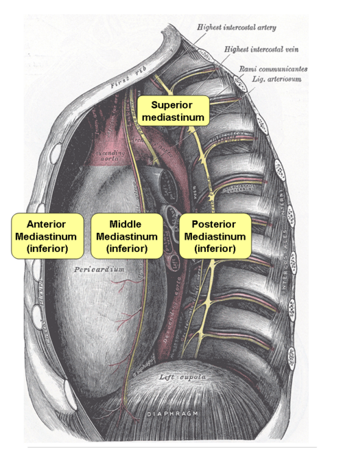
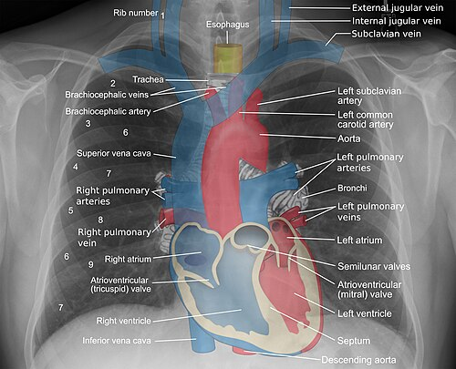

# MEDIASTINO

Para entender o mediastino, você não deve visualizá-lo como uma "caixa" estática, mas como um corredor dinâmico e congestionado. É o espaço entre as duas pleuras pulmonares, contendo quase todas as estruturas vitais do tórax, exceto os próprios pulmões.

Nas provas de residência, o segredo não é decorar uma lista infinita de doenças, mas sim dominar a **anatomia compartimentar**. Se você sabe onde a lesão está, você já tem 80% do diagnóstico. Como costumamos dizer no MedEvo, o mediastino é o endereço das patologias: o CEP (Código de Endereçamento Postal) da massa dita o nome do culpado.

*Figura 1 - Diagrama anatômico do mediastino demonstrando suas divisões (superior, anterior, médio e posterior) e as estruturas contidas em cada compartimento. Fonte: Arcadian, Domínio Público | Wikimedia Commons*

## Anatomia e Divisões: O Mapa da Mina

Historicamente, dividimos o mediastino em compartimentos para facilitar o diagnóstico diferencial. Embora existam classificações modernas baseadas em TC (como a da ITMIG), as bancas brasileiras ainda são apaixonadas pela divisão clássica de Shields.

O mediastino é dividido pelo plano horizontal que passa pelo ângulo de Louis (manúbrio-esternal) e pelo disco intervertebral de T4-T5 em:

- **Mediastino Superior:** Acima desse plano.

- **Mediastino Inferior:** Abaixo desse plano, subdividido em Anterior, Médio e Posterior.

No entanto, para fins práticos de prova e de raciocínio clínico, trabalhamos com a divisão longitudinal:

*Figura 2 - Radiografia de tórax PA com anotações das estruturas mediastinais, incluindo coração, grandes vasos, traqueia e esôfago. Fundamental para a identificação de alargamento mediastinal e massas. Fonte: Mikael Häggström, CC BY-SA 3.0 | Wikimedia Commons*

## Mediastino Anterior (Pré-vascular)

Limites: Esterno anteriormente e o pericárdio/grandes vasos posteriormente.
O que tem lá? Timo, linfonodos, gordura e a artéria mamária interna.
**A "Pérola" de Prova:** Aqui moram os famosos **4 Ts**. Se a questão descreve uma massa anterior, você DEVE pensar neles.

### Mediastino Médio (Visceral)

Limites: Entre o pericárdio anterior e a fáscia pré-vertebral posterior.
O que tem lá? Coração, grandes vasos (arco aórtico, veia cava), traqueia, brônquios principais, esôfago e nervos (frênico e vago).
**Dica do Professor:** O mediastino médio é o reino dos cistos (broncogênicos, pericárdicos) e das linfonodopatias.

### Mediastino Posterior (Paravertebral)

Limites: Entre a fáscia pré-vertebral e a parede posterior do tórax (goteiras paravertebrais).
O que tem lá? Cadeia simpática, nervos intercostais e a aorta descendente.
**Fique atento:** Quase tudo que nasce aqui tem origem **neurogênica**.

### Anatomia do Hilo Pulmonar (Lado Direito)

As bancas adoram cobrar a relação anatômica no hilo direito:

- **Nervo Frênico:** Passa **anterior** ao hilo.

- **Nervo Vago:** Passa **posterior** ao hilo.

- **Artéria Pulmonar:** Situa-se **superior** à veia pulmonar.

## Massas de Mediastino Anterior: Os 4 Ts

Este é o tópico mais cobrado. Se você encontrar uma massa no mediastino anterior em um adulto, sua lista mental deve ser automática:

### 1. Timoma (Neoplasias Tímicas)

É o tumor primário mais comum do mediastino anterior em adultos (30-50 anos).

- **Associação Clínica:** A Miastenia Gravis (MG) é a síndrome paraneoplásica clássica. Cerca de 30-45% dos pacientes com timoma têm MG. Por outro lado, apenas 15% dos pacientes com MG têm timoma (a maioria tem hiperplasia tímica).

- **O que a prova vai te perguntar:** "Paciente com ptose palpebral, diplopia e fraqueza muscular que piora ao longo do dia apresenta massa em mediastino anterior". Diagnóstico? Timoma.

- **Estadiamento de Masaoka-Koga:** Fundamental para definir conduta e prognóstico.

| Estádio | Descrição | Conduta Sugerida |
| --- | --- | --- |
| I | Macroscopicamente e microscopicamente encapsulado | Ressecção cirúrgica completa |
| II | Invasão macroscópica da gordura mediastinal ou pleura mediastinal; ou invasão microscópica da cápsula | Cirurgia + considerar Radioterapia (RT) |
| III | Invasão macroscópica de órgãos adjacentes (pericárdio, vasos, pulmão) | Cirurgia + RT + Quimioterapia (QT) |
| IVa | Disseminação pleural ou pericárdica | QT neoadjuvante + Cirurgia |
| IVb | Metástases linfáticas ou hematogênicas à distância | QT paliativa / Protocolos multimodais |

**Cuidado:** O tratamento do timoma é essencialmente cirúrgico (Timectomia). O acesso padrão para estádios iniciais é a esternotomia média ou VATS (videocirurgia). A toracotomia posterolateral **não** é o acesso de escolha para tumores de mediastino anterior.

### 2. Teratoma (e Tumores de Células Germinativas - TCG)

Os TCGs mediastinais ocorrem principalmente em homens jovens.

- **Teratoma Benigno:** É o TCG mais comum. Contém tecidos das três camadas embrionárias (pele, dente, cabelo, gordura). Na TC, a presença de gordura e calcificações é patognomônica.

- **Seminoma:** Altamente **radiossensível** e quimiossensível. O tratamento de escolha muitas vezes envolve QT/RT, reservando a cirurgia para massas residuais.

- **TCG Não-Seminomatoso:** São agressivos. Aqui os **marcadores tumorais** são a chave do diagnóstico.

| Tumor | Alfa-fetoproteína (AFP) | Beta-hCG |
| --- | --- | --- |
| Seminoma | Normal | Levemente aumentado (10%) |
| Carcinoma Embrionário | Aumentado | Aumentado |
| Tumor do Saco Vitelino | Muito Aumentado | Normal |
| Coriocarcinoma | Normal | Muito Aumentado |
| Teratoma | Normal | Normal |

**Dica de Ouro:** Homem jovem com Síndrome da Veia Cava Superior (SVCS) e massa anterior? Pense em TCG ou Linfoma. Se a AFP estiver lá no alto, é TCG não-seminomatoso.

### 3. Tireoide (Bócio Mergulhante)

Definido como tecido tireoidiano que se estende abaixo da fúrcula esternal.

- **Diagnóstico:** Geralmente é uma extensão de um bócio cervical. A TC mostra continuidade com a tireoide no pescoço.

- **Tratamento:** A maioria pode ser ressecada por via **cervicotomia**, sem necessidade de esternotomia, pois o suprimento sanguíneo vem das artérias tireoidianas inferiores (no pescoço).

### 4. "Terrible" Linfoma

Ocupa o mediastino anterior e médio. Comum em jovens.

- **Quadro Clínico:** Febre, perda de peso, sudorese noturna (sintomas B). O Linfoma de Hodgkin (esclerose nodular) é frequente em mulheres jovens e pode cursar com prurido.

- **Diagnóstico:** **NUNCA** trate linfoma com cirurgia de ressecção. O tratamento é QT/RT. O papel do cirurgião é a biópsia.

- **Pegadinha de Prova:** Se o paciente tem linfonodos cervicais ou axilares aumentados, a biópsia deve ser feita neles (menos invasivo) antes de propor uma mediastinoscopia. Se o linfoma for Difuso de Grandes Células B (CD20+), o Rituximab será a droga chave.

## Mediastino Posterior: O Reino dos Nervos

Se a massa está na goteira paravertebral, ela é **neurogênica** até que se prove o contrário. Representam 75% das massas do mediastino posterior.

- **Em Adultos:** 95% são benignos (Schwannoma, Neurofibroma). Originam-se da bainha do nervo intercostal.

- **Em Crianças:** Frequentemente são malignos (Neuroblastoma, Ganglioneuroblastoma). Originam-se da cadeia simpática.

**Exemplo Clínico:** Paciente de 40 anos, assintomático, faz RX de tórax de rotina que mostra massa arredondada em região paravertebral posterior. Qual a conduta? TC de tórax para caracterização e, provavelmente, ressecção por videocirurgia (VATS), que é excelente para essas lesões.

## Mediastinite: A Emergência que Mata

A mediastinite é uma das condições mais graves da cirurgia torácica, com altíssima mortalidade se não tratada precocemente.

### Mediastinite Aguda Descendente Necrotizante (MADN)

Ocorre por disseminação de infecções cervicais profundas (odontogênicas, retrofaríngeas) para o mediastino através dos espaços fasciais (principalmente o espaço retrofaríngeo ou "pré-vertebral").

- **Etiologia:** Polimicrobiana (aeróbios e anaeróbios).

- **Clínica:** História de dor de dente ou dor de garganta, seguida de dor torácica, febre alta, prostração e "pescoço em madeira".

- **Conduta:** Não perca tempo. O tratamento exige **ATB de amplo espectro + Drenagem Cirúrgica de Urgência** (cervicotomia + toracotomia ou VATS para limpar o mediastino). Apenas ATB não salva o paciente.

### Perfuração Esofágica (Síndrome de Boerhaave)

Ruptura espontânea do esôfago após vômitos vigorosos (vômitos incoercíveis).

- **Tríade de Mackler:** Vômitos + Dor torácica súbita + Enfisema subcutâneo.

- **Achado Radiológico Precoce:** **Pneumomediastino** (ar no mediastino) e enfisema subcutâneo.

- **Diagnóstico:** Esofagograma com contraste hidrossolúvel (Gastrografin) ou TC de tórax com contraste oral.

- **Por que dói tanto?** O conteúdo gástrico (ácido, enzimas, bactérias) causa uma mediastinite química e bacteriana fulminante.

## Síndrome da Veia Cava Superior (SVCS)

A SVCS é uma urgência oncológica causada pela obstrução do fluxo sanguíneo através da veia cava superior.

- **Causas:** 90% são malignas (Câncer de pulmão de pequenas células é o #1, seguido por Linfoma).

- **Clínica:** Edema de face e membros superiores ("edema em escravina"), turgência jugular patológica, circulação colateral no tórax e dispneia.

- **Manejo:** Cabeceira elevada, oxigênio, corticoides (para reduzir edema tumoral) e, o mais importante: **Diagnóstico Histológico**.

- **Cuidado:** Se o paciente estiver estável, você precisa de uma biópsia antes de iniciar RT ou QT, a menos que haja risco iminente de morte (edema cerebral ou de glote).

## Métodos Diagnósticos e Vias de Acesso

Como o Dr. Will costuma enfatizar em suas aulas, a escolha do exame depende da suspeita clínica.

- **Radiografia de Tórax:** O primeiro passo. Mostra alargamento mediastinal ou massas.

- **TC de Tórax com Contraste:** O padrão-ouro para localizar a massa e ver sua relação com vasos.

- **PET-CT:** Fundamental no estadiamento de câncer de pulmão e linfomas. Ajuda a diferenciar massa residual fibrótica de doença ativa pós-tratamento.

- **Marcadores Tumorais (AFP, hCG, LDH):** Obrigatórios em massas de mediastino anterior em jovens.

### Vias de Acesso Cirúrgico

- **Mediastinoscopia Cervical:** Padrão para biópsia de linfonodos das estações paratraqueais (2R, 2L, 4R, 4L) e subcarinais (7). É para o mediastino **superior e médio**. Não alcança o mediastino posterior.

- **Mediastinotomia Anterior (Cirurgia de Chamberlain):** Acesso direto para massas que tocam a parede anterior (estação 5 e 6).

- **VATS (Videocirurgia):** Hoje é usada para quase tudo: biópsias, ressecção de cistos, timectomias iniciais e tumores neurogênicos.

- **Esternotomia Média:** Acesso clássico para grandes tumores de mediastino anterior e cirurgia cardíaca.

## Diagnóstico Diferencial de Alargamento Mediastinal

Nem tudo que alarga o mediastino é tumor. O diagnóstico diferencial é amplo e cai muito em provas de emergência.

| Causa | Pista Clínica / Radiológica |
| --- | --- |
| **Aneurisma de Aorta** | Paciente hipertenso, dor "em rasgadura", alargamento em qualquer compartimento |
| **Dissecção de Aorta** | Dor súbita, assimetria de pulsos, alargamento mediastinal no RX |
| **Pneumomediastino** | Sinal de Hamman (crepitação à ausculta cardíaca), trauma ou vômitos |
| **Bócio Mergulhante** | Desvio da traqueia, massa que se move à deglutição |
| **Linfadenopatia Sarcoidose** | Linfonodomegalia hilar bilateral e simétrica ("casca de ovo") |

## Situações Especiais e Complicações

### Estenose Traqueal Pós-Intubação

Um tema que transita entre via aérea e mediastino. Ocorre por isquemia da mucosa traqueal pelo balonete (cuff) hiperinsuflado.

- **Clínica:** Dispneia e estridor semanas após a extubação.

- **Manejo Inicial:** Oxigênio, corticoide e **Broncoscopia Rígida** (essencial para avaliar a extensão e realizar dilatação).

- **Tratamento Definitivo:** Se a estenose for fixa e sem inflamação ativa, a traqueoplastia (ressecção e anastomose) é a escolha.

### Fístula Traqueoesofágica (Adquirida)

Geralmente por complicação de ventilação mecânica prolongada (pressão do cuff contra a sonda nasogástrica no esôfago).

- **Sinal Clássico:** "Sinal de cuff" (ar saindo pela sonda gástrica ou dieta saindo pela aspiração traqueal).

- **Tratamento:** Quase sempre exige reparo cirúrgico complexo após o desmame da ventilação.

### Pectus Excavatum

A deformidade mais comum da parede torácica. É uma depressão do esterno devido ao crescimento excessivo das cartilagens costais.

- **Indicação Cirúrgica:** Principalmente estética/psicológica, mas pode haver indicação funcional se houver compressão cardíaca (visto no Índice de Haller > 3.25 na TC).

## Pontos-Chave para Prova 🩺

- **Massas Anteriores (4 Ts):** Timoma, Teratoma, Tireoide, "Terrible" Linfoma.

- **Timoma e Miastenia:** 45% dos timomas têm MG. Timoma é o tumor mais comum do mediastino anterior em adultos.

- **Mediastino Posterior:** 75% das massas são tumores neurogênicos (Goteira paravertebral).

- **Síndrome de Boerhaave:** Vômito + Dor Torácica + Enfisema Subcutâneo = Ruptura de Esôfago. O achado precoce é o pneumomediastino.

- **Mediastinite Descendente:** Emergência cirúrgica. Origem odontogênica é comum. Exige drenagem imediata.

- **Marcadores Tumorais:** AFP elevada em mediastino anterior de homem jovem = TCG não-seminomatoso (Saco vitelino/Embrionário).

- **Seminoma:** É o TCG maligno mais comum e é extremamente sensível à Radioterapia e Quimioterapia.

- **Rouquidão em Tumores:** Sinal de invasão ou compressão do nervo laríngeo recorrente. Sugere malignidade.

- **Biópsia de Linfoma:** Se houver linfonodo periférico (axila/pescoço), biopse ele primeiro. É menos invasivo que mediastinoscopia.

- **Acesso ao Bócio Mergulhante:** Geralmente apenas Cervicotomia. A vascularização vem do pescoço.

- **Masaoka Estádio II:** Invasão da cápsula ou gordura peritímica. Requer atenção para terapia adjuvante.

- **SVCS em Jovens:** Suspeite fortemente de Linfoma ou Tumor de Células Germinativas.

- **Pneumomediastino no RX:** Procure o "sinal da pleura visível" ou ar contornando o coração.

- **O que NÃO fazer:** Nunca ressecar uma massa mediastinal sem antes descartar Linfoma (biópsia) ou TCG (marcadores), pois o tratamento inicial destes não é cirúrgico.

- **Contraindicação Absoluta de Mediastinoscopia:** Paciente com traqueostomia prévia ou mediastino severamente irradiado (contraindicações relativas que podem se tornar absolutas dependendo da fibrose).

- **Primeira Escolha para Estenose Traqueal:** Broncoscopia rígida para diagnóstico e estabilização.

Este material foi estruturado para que você, ao ler uma questão sobre mediastino, consiga localizar a estrutura afetada e, por exclusão e probabilidade epidemiológica, marcar a alternativa correta. Lembre-se: no mediastino, localização é destino!

 Cópia offline para consulta pessoal.
 Fonte original:
 [https://www.medevo.com.br/material-apoio/ler/46a700fc-bc6e-43c6-b028-c1f071ec2e6b](https://www.medevo.com.br/material-apoio/ler/46a700fc-bc6e-43c6-b028-c1f071ec2e6b)
