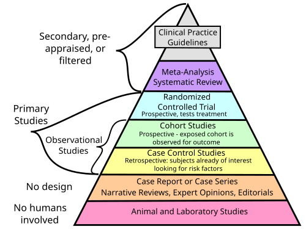

# MEDIDAS DE ASSOCIAÇÃO E IMPACTO

Para entender epidemiologia clínica e social, você precisa parar de ver fórmulas e começar a ver pessoas e grupos. Quando uma banca de residência pergunta sobre o Risco Relativo (RR) ou o Número Necessário para Tratar (NNT), ela não quer apenas saber se você sabe fazer conta de divisão. Ela quer saber se você entende o peso de uma exposição ou o benefício real de um tratamento para o seu paciente.

O ponto de partida de quase tudo o que discutiremos aqui é a famosa **Tabela 2x2** (ou Tabela de Contingência). Se você dominar a montagem dessa tabela, você resolve 80% das questões de cálculo.

| | Doente (Desfecho +) | Saudável (Desfecho -) | Total |
| --- | --- | --- | --- |
| **Exposto** | a | b | a + b |
| **Não Exposto** | c | d | c + d |
| **Total** | a + c | b + d | N |

Nesta tabela, "a" são os doentes expostos, "b" os saudáveis expostos, "c" os doentes não expostos e "d" os saudáveis não expostos. A partir daqui, derivamos as medidas de frequência (incidência e prevalência) e, consequentemente, as de associação.

## Medidas de Associação: O "Quanto" a Exposição se Liga ao Desfecho

As medidas de associação servem para quantificar a relação entre uma exposição (ex: tabagismo, uso de uma droga, vacinação) e a ocorrência de um desfecho (ex: câncer, cura, prevenção de infecção). Elas respondem à pergunta: "Quem está exposto tem mais ou menos chance/risco de ficar doente do que quem não está?".

*Figura 1 - Microscopia eletrônica de varredura de sangue humano normal: hemácias, linfócitos, monócito, neutrófilo e plaquetas. A epidemiologia clínica estuda como fatores de risco impactam populações inteiras. Fonte: NCI/Bruce Wetzel e Harry Schaefer, Domínio Público | Wikimedia Commons*

## Risco Relativo (RR)

O Risco Relativo é a medida clássica dos estudos de **Coorte** e dos **Ensaios Clínicos Randomizados**. Por quê? Porque esses estudos acompanham pessoas ao longo do tempo e permitem calcular a **Incidência**.

O RR é a razão entre a incidência nos expostos (I_e) e a incidência nos não expostos (I_u).
Fórmula: RR = \frac{a / (a+b)}{c / (c+d)}

**Interpretação do RR:**

- **RR > 1:** A exposição é um **fator de risco**. Se RR = 2, o grupo exposto tem o dobro do risco do não exposto.

- **RR = 1:** Ausência de associação. O risco é igual nos dois grupos (valor de nulidade).

- **RR < 1:** A exposição é um **fator de proteção**. Se RR = 0,30, o risco no exposto é apenas 30% do risco do não exposto (uma redução de 70%).

**Dica de Prova:** Em questões de eficácia de vacina, a fórmula é (1 - RR) × 100. Se o RR de contrair a doença após a vacina é 0,30, a eficácia é 70%. Como Dr. Will sempre reforça em aula, não confunda o risco residual (30%) com a eficácia (70%).

### Odds Ratio (OR) ou Razão de Chances

O OR é a medida de eleição para estudos de **Caso-Controle**. Por que não usamos RR no caso-controle? Porque nesse desenho você já parte de pessoas doentes. Você não sabe a incidência (casos novos num período), pois você selecionou quem já estava doente.

O OR compara a chance de um doente ter sido exposto com a chance de um saudável ter sido exposto.
Fórmula simplificada (produto cruzado): OR = \frac{a × d}{b × c}

**O "Pulo do Gato" do OR:** Em doenças raras, o valor do OR se aproxima muito do RR. As bancas adoram cobrar essa propriedade. Além disso, o OR é a única medida que você consegue extrair de uma Regressão Logística, muito usada para ajustar fatores de confusão.

### Razão de Prevalência (RP)

Utilizada em **Estudos Transversais**. Como esses estudos são como uma "fotografia" do momento, não falamos em risco (que exige tempo), mas sim em prevalência.
Fórmula: RP = \frac{Prevalência nos expostos}{Prevalência nos não expostos}

A lógica de interpretação (maior, menor ou igual a 1) segue a mesma do RR.

### Tabela Comparativa: Medidas de Associação por Desenho de Estudo

| Desenho de Estudo | Medida de Associação Principal | Por que? |
| --- | --- | --- |
| **Coorte** | Risco Relativo (RR) | Permite calcular incidência (acompanhamento). |
| **Ensaio Clínico** | Risco Relativo (RR) | É uma coorte experimental; avalia incidência. |
| **Caso-Controle** | Odds Ratio (OR) | Parte do desfecho; não há denominador de risco. |
| **Transversal** | Razão de Prevalência (RP) | Mede a "fatia" da população doente no momento. |
| **Ecológico** | Coeficiente de Correlação | Avalia grupos/populações, não indivíduos. |

## O Intervalo de Confiança (IC 95%) e a Significância Estatística

Aqui é onde muitos alunos erram por pressa. Não basta o RR ser 2,0 para dizer que algo é fator de risco. É preciso olhar o Intervalo de Confiança.

O IC 95% nos diz que, se repetíssemos o estudo 100 vezes, em 95 delas o resultado estaria dentro daquela faixa. Para as medidas de associação que são **razões** (RR, OR, RP), o valor de nulidade é **1,0**.

- Se o IC 95% **inclui o valor 1,0** (ex: 0,8 a 2,5): O resultado **não tem significância estatística**. Pode ter sido ao acaso.

- Se o IC 95% **está todo acima de 1,0** (ex: 1,5 a 3,2): É um fator de risco significativo.

- Se o IC 95% **está todo abaixo de 1,0** (ex: 0,4 a 0,7): É um fator de proteção significativo.

**Erro clássico de prova:** A banca dá um RR de 0,5 (parece proteção), mas o IC 95% é (0,3 a 1,2). O aluno marca que é proteção. Errado! Como o 1,0 está dentro do intervalo, não podemos afirmar nada; o resultado é estatisticamente insignificante.

Além disso, o IC nos fala sobre a **precisão**. Quanto mais estreito o intervalo, mais preciso é o estudo (geralmente porque a amostra é maior). No *Forest Plot* das metanálises, isso é representado por quadrados maiores e linhas horizontais curtas.

## Medidas de Impacto: A Relevância Clínica

As medidas de associação (RR, OR) dizem a *força* da ligação. As medidas de impacto dizem o *quanto* aquela intervenção ou exposição muda a realidade clínica. Elas são fundamentais para a Medicina Baseada em Evidências (MBE).

### Redução do Risco Absoluto (RRA ou RAR)

É a diferença aritmética simples entre o risco do grupo controle e o risco do grupo experimental.
Fórmula: RAR = Incidência no Controle - Incidência no Tratamento

Se o risco de infarto em quem não toma remédio é 10% e em quem toma é 7%, a RAR é de 3% (ou 0,03). Isso significa que, em cada 100 pessoas tratadas, evitamos 3 eventos.

### Redução do Risco Relativo (RRR)

É a eficácia relativa. Ela ignora o risco basal e foca apenas na proporção da redução.
Fórmula: RRR = \frac{Incidência Controle - Incidência Tratamento}{Incidência Controle} ou simplesmente 1 - RR.

No exemplo anterior: (10% - 7%) / 10% = 30%.
Cuidado: A RRR costuma ser um número "bonito" e alto, por isso a indústria farmacêutica adora usá-la. Mas, para o clínico, a RAR é mais honesta, pois leva em conta a gravidade da doença.

### Número Necessário para Tratar (NNT)

Este é o queridinho das provas. O NNT é o inverso da RAR. Ele nos diz quantos pacientes precisamos tratar para prevenir **um** desfecho negativo.
Fórmula: NNT = \frac{1}{RAR} (Se a RAR estiver em decimal) ou 100 / RAR (Se estiver em porcentagem).

**Interpretação do NNT:**

- NNT = 1: O tratamento é perfeito. Tratei um, curei um. Todos no controle ficaram doentes e todos no tratamento ficaram bons.

- NNT alto (ex: 500): Você precisa tratar 500 pessoas para evitar apenas um evento. Isso pode ser caro ou arriscado se a droga tiver muitos efeitos colaterais.

- O NNT ajuda a decidir o custo-benefício.

**Exemplo Clínico:** Imagine um novo antibiótico para otite média. No grupo placebo, 20% das crianças continuam com dor após 2 dias. No grupo antibiótico, apenas 10% continuam com dor.

- RAR = 20% - 10% = 10% (0,10).

- NNT = 1 / 0,10 = 10.
Conclusão: Você precisa tratar 10 crianças para que uma se beneficie do uso do antibiótico (as outras 9 ou ficariam boas sozinhas ou não ficariam boas nem com o remédio).

*Figura 1 - Microscopia eletrônica de varredura de sangue humano normal: hemácias, linfócitos, monócito, neutrófilo e plaquetas. A epidemiologia clínica estuda como fatores de risco impactam populações inteiras. Fonte: NCI/Bruce Wetzel e Harry Schaefer, Domínio Público | Wikimedia Commons*

## Risco Atribuível (RA) e Fração Etiológica

Enquanto o NNT e a RAR focam no tratamento, o RA e a Fração Etiológica focam na **exposição nociva**.

- **Risco Atribuível no Exposto (RAE):** É a incidência no exposto menos a incidência no não exposto. Indica o quanto do risco de doença é devido exclusivamente àquela exposição.

- **Fração Etiológica na População (FEP):** Indica qual a proporção de casos de uma doença na população inteira que poderiam ser evitados se eliminássemos o fator de risco. É a medida de ouro para a Saúde Pública. Se o tabagismo tem uma FEP de 90% para câncer de pulmão, remover o cigarro eliminaria 90% desses cânceres na cidade.

*Figura 2 - Ilustração da redução de risco: grupo exposto ao tratamento (esquerda) e grupo não exposto (direita). A diferença entre as proporções de desfechos adversos é a Redução Absoluta de Risco (RAR), e seu inverso é o NNT. Fonte: Psarka, CC BY-SA 4.0 | Wikimedia Commons*

## Epidemiologia Clínica e Tomada de Decisão

Ao ler um artigo ou uma questão de prova, você deve integrar esses conceitos. Um estudo pode mostrar um RR de 0,5 (redução de 50% do risco), o que parece excelente. Mas se a doença for raríssima (incidência de 0,0002% no controle e 0,0001% no tratamento), a RAR será ínfima e o NNT será gigantesco.

É por isso que, na prática do MedEvo, enfatizamos: **RRR é similar em prevenção primária e secundária, mas RAR e NNT são muito melhores na prevenção secundária.** Por quê? Porque na prevenção secundária o paciente já tem alto risco basal. Qualquer redução percentual em cima de um número grande gera um impacto absoluto maior.

### Comparativo de Medidas de Impacto

| Medida | Fórmula | O que representa? |
| --- | --- | --- |
| **RAR** | I_c - I_t | Diferença absoluta de risco entre os grupos. |
| **RRR** | (I_c - I_t) / I_c | Proporção da redução do risco (Eficácia). |
| **NNT** | 1 / RAR | Quantos tratar para evitar 1 evento. |
| **RAE** | I_e - I_u | Excesso de risco causado pela exposição. |
| **FEP** | (I_{pop} - I_u) / I_{pop} | Impacto de remover o risco da população. |

## Revisão Sistemática e Metanálise

A Revisão Sistemática é o topo da pirâmide de evidência porque ela sintetiza vários estudos primários. A Metanálise é o braço estatístico dessa revisão.

Ao analisar uma metanálise, você encontrará o **Forest Plot** (Gráfico de Floresta).

- Cada linha horizontal é um estudo.

- O quadrado no meio da linha é o resultado pontual (RR ou OR).

- O tamanho do quadrado representa o **peso** do estudo (amostras maiores = quadrados maiores).

- A linha horizontal é o IC 95%. Se a linha tocar a linha vertical central (o 1,0), aquele estudo sozinho não teve significância.

- O **Diamante** no final é o resultado combinado. Se o diamante não tocar a linha do 1,0, a metanálise como um todo é estatisticamente significativa.

**Heterogeneidade:** Se os estudos apontam para direções muito diferentes, dizemos que há alta heterogeneidade (medida pelo I²). Se I² for alto (ex: > 50%), a metanálise pode estar misturando "alhos com bugalhos", e o resultado deve ser visto com cautela.

## Validade e Precisão: Onde os Alunos se Confundem

Um estudo pode ser muito preciso, mas estar completamente errado.

- **Validade Interna:** O estudo foi bem feito? A randomização funcionou? O cegamento foi mantido? Se houver viés de seleção ou de aferição, o estudo perde validade interna. A randomização é a principal ferramenta para reduzir o viés de seleção, equilibrando fatores conhecidos e desconhecidos entre os grupos.

- **Validade Externa (Generalizabilidade):** Eu posso aplicar esse resultado no meu paciente do SUS? Se o estudo foi feito apenas com homens brancos suecos de 20 anos, a validade externa para uma idosa brasileira pode ser baixa.

- **Precisão:** Tem a ver com o erro aleatório. Amostras grandes geram resultados precisos (IC estreito).

**Pegadinha de Prova:** A banca diz que um estudo com 10.000 pessoas achou um RR de 1,05 com IC 95% (1,04 - 1,06). O resultado é estatisticamente significativo? Sim, pois não cruza o 1,0. Mas tem relevância clínica? Provavelmente não. Um aumento de 5% no risco é muito pequeno. Não confunda significância estatística (p < 0,05) com importância clínica.

## Rastreamento e Sobrediagnóstico (Overdiagnosis)

Um tema que transita entre medidas de associação e prática clínica é o rastreamento. As bancas, baseadas em diretrizes como as do Ministério da Saúde e da USPSTF, têm cobrado muito a noção de que "nem tudo o que se rastreia traz benefício".

O exemplo clássico é o PSA para câncer de próstata. Estudos de coorte e ensaios clínicos mostram que o rastreamento populacional sistemático com PSA pode aumentar o diagnóstico, mas não reduz significativamente a mortalidade específica por câncer de próstata em muitos grupos, levando ao **sobrediagnóstico** (tratar tumores que nunca matariam o paciente). Isso gera um NNT muito alto para o rastreamento e um NNH (Número Necessário para Causar Dano) baixo, devido às complicações das biópsias e cirurgias.

## Aplicação Prática: O Raciocínio Epidemiológico

Imagine que você está lendo um estudo sobre uma nova droga para Diabetes Mellitus Tipo 2.

- O estudo é um Ensaio Clínico Randomizado (ECR).

- Incidência de complicações no grupo placebo: 20%.

- Incidência no grupo droga nova: 15%.

- RR = 15 / 20 = 0,75. (A droga reduz o risco em 25% -> RRR).

- RAR = 20% - 15% = 5% (0,05).

- NNT = 1 / 0,05 = 20.

Se a banca te perguntar: "Qual a interpretação do NNT neste caso?", a resposta correta é: "É necessário tratar 20 pacientes com a nova droga para prevenir uma complicação adicional em comparação ao placebo".

Se a banca perguntar sobre a eficácia: "A eficácia da droga é de 25%".

Se a banca mostrar um IC 95% de (0,60 a 0,90): "O resultado é estatisticamente significativo como fator de proteção, pois o intervalo está inteiramente abaixo de 1,0".

## Pontos-Chave para Prova

- **Valor de Nulidade:** Para RR, OR e RP, o valor de nulidade é **1,0**. Se o IC 95% contiver 1,0, não há significância estatística.

- **NNT e RAR:** O NNT é o inverso da Redução Absoluta do Risco (1/RAR). Nunca use o Risco Relativo para calcular NNT.

- **Eficácia da Vacina:** Calculada como (1 - RR) × 100.

- **Odds Ratio (OR):** Medida típica do estudo de Caso-Controle. Estima o RR em doenças raras.

- **Risco Relativo (RR):** Medida típica de Coorte e Ensaio Clínico. Exige cálculo de incidência.

- **Razão de Prevalência (RP):** Medida típica de estudos Transversais.

- **Fator de Proteção:** RR ou OR < 1,0.

- **Fator de Risco:** RR ou OR > 1,0.

- **Precisão:** Indicada pela largura do IC 95%. Quanto mais estreito, mais preciso (geralmente maior a amostra).

- **Randomização:** Serve para evitar o viés de seleção e equilibrar variáveis de confusão (conhecidas e desconhecidas).

- **Cegamento:** Serve para evitar o viés de aferição (ou observação).

- **Viés de Memória:** Comum em estudos de Caso-Controle (doentes lembram mais de exposições passadas).

- **Fração Etiológica na População (FEP):** Medida de impacto para saúde pública; quanto da doença sumiria se tirássemos a exposição.

- **NNT = 1:** Significa eficácia de 100% em um cenário onde todos no grupo controle tiveram o desfecho.

- **Forest Plot:** O diamante representa o resultado combinado da metanálise. Se ele não toca a linha vertical, o resultado global é significativo.

- **Erro Tipo I (Alfa):** Rejeitar a hipótese nula quando ela é verdadeira (achar uma diferença que não existe).

- **Erro Tipo II (Beta):** Aceitar a hipótese nula quando ela é falsa (não achar uma diferença que existe). 💡

Ao revisar este conteúdo, lembre-se de que a epidemiologia nas provas de residência está cada vez mais voltada para a interpretação de resultados e menos para fórmulas decoradas. Entender o conceito de "risco" versus "chance" e "absoluto" versus "relativo" é o que diferencia os candidatos aprovados.

 Cópia offline para consulta pessoal.
 Fonte original:
 [https://www.medevo.com.br/material-apoio/ler/e4ed335b-0574-455c-9ea6-6172fa7f2bca](https://www.medevo.com.br/material-apoio/ler/e4ed335b-0574-455c-9ea6-6172fa7f2bca)
