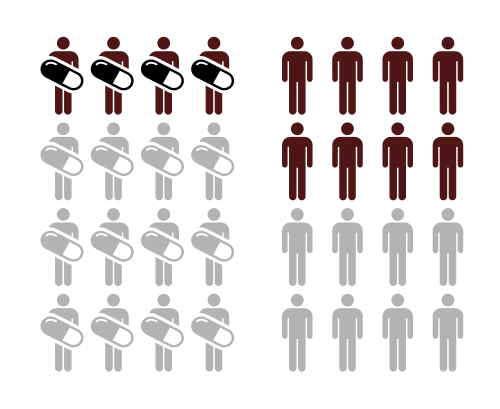
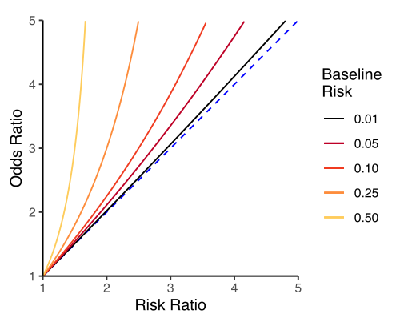

# MEDIDAS DE ASSOCIAÇÃO: RISCO RELATIVO, ODDS RATIO E RISCO ATRIBUÍVEL

Para dominar a epidemiologia nas provas de residência, você precisa parar de decorar fórmulas isoladas e começar a entender o desenho do estudo. Se você sabe "quem" o pesquisador está acompanhando, você sabe qual medida ele pode calcular.

A base de tudo é a famosa **Tabela 2x2** (ou tabela de contingência). No MedEvo, sempre reforçamos: se a questão te der números brutos, a primeira coisa que você faz é montar essa tabela. Ela é o seu mapa.

| | Doente (Desfecho +) | Saudável (Desfecho -) | Total |
| --- | --- | --- | --- |
| **Exposto** | a | b | a + b |
| **Não Exposto** | c | d | c + d |
| **Total** | a + c | b + d | N |

## Medidas de Associação: O "Quanto a mais?"

As medidas de associação quantificam a força da relação entre uma exposição (ex: tabagismo, vacina, poluição) e um desfecho (ex: câncer, cura, óbito). Elas não dizem se a relação é de causa e efeito — isso depende de outros critérios, como os de Hill — mas dizem o quão "andando juntas" essas variáveis estão.

*Figura 1 - Diagrama ilustrando os conceitos de risco em dois grupos (expostos e não-expostos), demonstrando a relação entre exposição e desfecho. Base para o cálculo do Risco Relativo. Fonte: Psarka, CC BY-SA 4.0 | Wikimedia Commons*

## Risco Relativo (RR)

O Risco Relativo é a estrela dos estudos de **Coorte** e dos **Ensaios Clínicos Randomizados**. Por quê? Porque nesses estudos nós partimos de pessoas saudáveis e as acompanhamos no tempo para ver quem adoece. Isso nos permite calcular a **Incidência**.

O RR é, literalmente, a razão entre a incidência nos expostos e a incidência nos não expostos.

**Cálculo:**

- Incidência nos Expostos (I_e) = a / (a + b)

- Incidência nos Não Expostos (I_{ne}) = c / (c + d)

- **RR = I_e / I_{ne}**

**Interpretação:**

- **RR > 1:** A exposição é um **fator de risco**. Ex: RR de 3,0 significa que o exposto tem 3 vezes mais risco de adoecer que o não exposto.

- **RR < 1:** A exposição é um **fator protetor**. Ex: RR de 0,4 significa que o exposto tem 40% do risco do não exposto (ou uma redução de 60% no risco).

- **RR = 1:** Ausência de associação (valor de nulidade).

*Figura 2 - Gráfico demonstrando a relação entre Risco Relativo (RR) e Odds Ratio (OR) para diferentes riscos basais. Note como o OR superestima o RR quando o desfecho é frequente. Fonte: D Wells, CC BY-SA 4.0 | Wikimedia Commons*

## Odds Ratio (OR) ou Razão de Chances

Aqui está a primeira grande pegadinha de prova. O Odds Ratio é a medida de escolha para estudos de **Caso-Controle**.

Em um estudo de caso-controle, você já começa com os doentes (casos). Você não sabe quem vai adoecer no futuro, então você não tem o "denominador" da população sob risco para calcular incidência. Sem incidência, não existe Risco Relativo.

O OR compara a chance de exposição entre os casos com a chance de exposição entre os controles.

**Cálculo (O "Produto Cruzado"):**
**OR = (a × d) / (b × c)**

**Interpretação:**
A lógica é a mesma do RR (maior que 1 é risco, menor que 1 é proteção).

**Pérola do Dr. Will:** As bancas adoram perguntar quando o OR pode ser usado como uma boa estimativa do RR. A resposta é: quando a **doença é rara** na população (geralmente prevalência < 10%). Nesses casos, os valores de OR e RR ficam muito próximos.

### Razão de Prevalência (RP)

Se o estudo for **Transversal** (seccional), onde exposição e desfecho são medidos ao mesmo tempo (como uma fotografia), não falamos em risco ou incidência, mas sim em **Prevalência**.

**Cálculo:**

- Prevalência nos expostos = a / (a + b)

- Prevalência nos não expostos = c / (c + d)

- **RP = Prev. Expostos / Prev. Não Expostos**

## Medidas de Impacto: O "E daí?"

Enquanto o RR e o OR medem a força da associação (importante para a etiologia), as medidas de impacto medem o quanto aquela exposição pesa na saúde pública.

### Risco Atribuível (RA) ou Diferença de Riscos

O RA responde: "Se eu tirar o cigarro desse paciente, quanto risco eu retiro dele?". É uma medida de excesso de risco.

**Cálculo:**
**RA = Incidência nos Expostos (I_e) - Incidência nos Não Expostos (I_{ne})**

Diferente do RR, que é uma razão (sem unidade), o RA mantém a unidade da incidência (ex: casos por 1.000 pessoas). Ele indica a quantidade de doença que pode ser evitada se eliminarmos a exposição nos expostos.

### Risco Atribuível Populacional (RAP)

Este é o favorito dos gestores de saúde. Ele leva em conta não apenas o risco da exposição, mas também o quão comum ela é na população.

**Exemplo:** O fumo tem um RR altíssimo para câncer de pulmão, mas se apenas 1% da população fumasse, o impacto populacional seria pequeno. Já o sedentarismo pode ter um RR menor, mas como atinge 60% da população, seu RAP é gigantesco.

### Redução do Risco Absoluto (RRA) e NNT

Quando falamos de intervenções (como um novo fármaco ou vacina), o RA muda de nome para **RRA**.

**RRA = Incidência no Controle - Incidência no Tratado**

A partir do RRA, calculamos o **NNT (Number Needed to Treat)**, que é o número de pacientes que preciso tratar para evitar um desfecho negativo.

**NNT = 1 / RRA**

**Dica de Prova:** O NNT deve ser sempre arredondado para cima. Se o cálculo der 10,2, o NNT é 11. Quanto menor o NNT, melhor a intervenção.

## Eficácia e Efetividade Vacinal

Com as atualizações pós-pandemia e as novas diretrizes de vigilância (como o V Plano Diretor de Epidemiologia 2025-2029), o cálculo de eficácia voltou com tudo.

A **Eficácia Vacinal** é, na verdade, uma Redução do Risco Relativo (RRR). Ela mede o quanto a vacina reduziu o risco em relação ao grupo placebo em condições ideais (ensaios clínicos).

**Fórmula:**
**Eficácia = (1 - RR) × 100%**
Ou: **[(Incidência não vacinados - Incidência vacinados) / Incidência não vacinados] × 100%**

Se a questão te der um estudo de caso-controle para avaliar uma vacina na "vida real" (efetividade), você usa o OR:
**Efetividade = (1 - OR) × 100%**

## O Intervalo de Confiança de 95% (IC95%)

Nenhuma medida de associação vale nada sem o seu IC95%. Ele nos diz se o resultado é estatisticamente significativo e qual a precisão do estudo.

### A Regra do 1

Como RR, OR e RP são razões, o valor que indica "nenhuma diferença" é o **1**.

- Se o IC95% **inclui o valor 1** (ex: 0,8 a 1,5), o resultado **NÃO é estatisticamente significativo**. O valor de p será > 0,05.

- Se o IC95% **NÃO inclui o valor 1** (ex: 1,2 a 2,4 ou 0,3 a 0,7), o resultado **É significativo**.

### Precisão vs. Força

- **Precisão:** Quanto mais estreito o intervalo (ex: 1,1 a 1,3), mais preciso é o estudo (geralmente por ter uma amostra grande).

- **Força:** Quanto mais longe do 1 está o valor central (ex: RR = 5,0), mais forte é a associação.

## Tabelas Comparativas para Revisão Rápida

### Tabela 1: Medida de Associação por Desenho de Estudo

| Desenho de Estudo | Medida de Associação | O que mede? |
| --- | --- | --- |
| **Coorte** | Risco Relativo (RR) | Razão de Incidências |
| **Ensaio Clínico** | Risco Relativo (RR) | Razão de Incidências (Eficácia) |
| **Caso-Controle** | Odds Ratio (OR) | Razão de Chances |
| **Transversal** | Razão de Prevalência (RP) | Razão de Prevalências |
| **Ecológico** | Coeficiente de Correlação | Associação em nível populacional |

### Tabela 2: Diferença entre Risco Relativo e Risco Atribuível

| Característica | Risco Relativo (RR) | Risco Atribuível (RA) |
| --- | --- | --- |
| **Operação** | Divisão (I_e / I_{ne}) | Subtração (I_e - I_{ne}) |
| **Interesse** | Etiologia / Força da causa | Saúde Pública / Impacto |
| **Pergunta** | "Quantas vezes mais risco?" | "Quanto risco a mais?" |
| **Unidade** | Adimensional | Mesma da incidência |

## Vieses e Fatores de Confusão

Um erro comum em provas é achar que um RR alto prova causalidade. Cuidado! O pesquisador pode ter esquecido de ajustar para um **Fator de Confusão**.

Um fator de confusão é uma variável que está associada tanto à exposição quanto ao desfecho.
*Exemplo clássico:* Um estudo mostra que tomar café (exposição) está associado a câncer de pâncreas (desfecho). Mas quem toma muito café costuma fumar mais. O fumo é o fator de confusão.

Para resolver isso, usamos a **Análise Multivariada** (Regressão de Cox ou Regressão Logística). Se o RR "bruto" era 3,0 e o RR "ajustado" caiu para 1,1 (com IC cruzando o 1), a associação original era falsa, causada pela confusão.

## Situações Especiais e Pegadinhas

### 1. Mortalidade Competitiva

Em estudos com idosos, o risco de morrer por uma causa (ex: Alzheimer) pode ser "mascarado" porque o paciente morre antes de outra coisa (ex: Infarto). Isso pode subestimar o RR.

### 2. Perdas de Seguimento

Em uma coorte, se as pessoas que saem do estudo são justamente as que estão ficando doentes, a incidência será subestimada e o RR será falso. Isso é o **Viés de Atrição**.

### 3. Intenção de Tratamento (ITT)

Em ensaios clínicos, mesmo que o paciente pare de tomar o remédio, ele deve ser analisado no grupo original. Isso preserva a randomização e evita superestimar a eficácia. Se a questão falar que analisaram apenas quem tomou o remédio certinho (análise por protocolo), desconfie: isso gera viés.

## Pontos-Chave para Prova

- **RR (Risco Relativo):** Incidência expostos / Incidência não expostos. Usado em Coorte e Ensaio Clínico.

- **OR (Odds Ratio):** ad / bc. Usado em Caso-Controle. Estima bem o RR se a doença for rara (< 10%).

- **RP (Razão de Prevalência):** Usada em estudos Transversais.

- **RA (Risco Atribuível):** I_e - I_{ne}. Mede o excesso de risco no indivíduo exposto.

- **RAP (Risco Atribuível Populacional):** Mede o impacto da retirada do fator na população total.

- **NNT (Número Necessário para Tratar):** 1 / RRA. Quanto menor, melhor. Sempre arredonde para cima.

- **Eficácia Vacinal:** (1 - RR) × 100. Se for estudo de vida real (efetividade) com caso-controle, usa-se (1 - OR) × 100.

- **Significância Estatística:** Se o IC95% do RR ou OR contiver o número **1**, o resultado não tem significância estatística (p > 0,05).

- **Fator de Proteção:** RR ou OR < 1. Ex: RR = 0,7 significa redução de 30% no risco.

- **Fator de Risco:** RR ou OR > 1. Ex: RR = 2,5 significa aumento de 150% no risco (ou 2,5 vezes o risco basal).

- **Análise Ajustada:** Serve para limpar os **Fatores de Confusão**. Se o RR ajustado for muito diferente do bruto, havia confusão.

- **Viés de Seleção em Caso-Controle:** Ocorre se os controles não representarem a população que originou os casos.

- **Incidência:** É o numerador para o cálculo de RR. Se você não tem como calcular incidência (como no caso-controle), você não calcula RR.

- **Pérola MedEvo:** Se a banca pedir a medida de associação de um estudo que "partiu do desfecho para a exposição", marque Odds Ratio sem medo.

- **Erro Clássico:** Achar que Risco Atribuível e Risco Relativo são a mesma coisa. O RR é "força", o RA é "quantidade/excesso".

 Cópia offline para consulta pessoal.
 Fonte original:
 [https://www.medevo.com.br/material-apoio/ler/9fe17647-e837-495e-acdf-1a2c3a27fe88](https://www.medevo.com.br/material-apoio/ler/9fe17647-e837-495e-acdf-1a2c3a27fe88)
