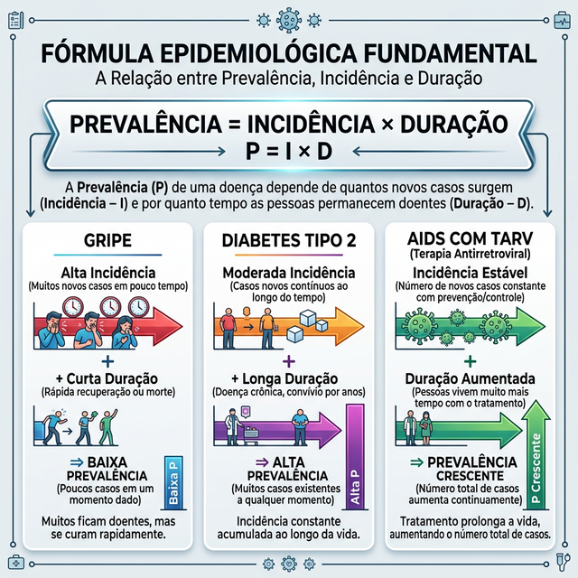
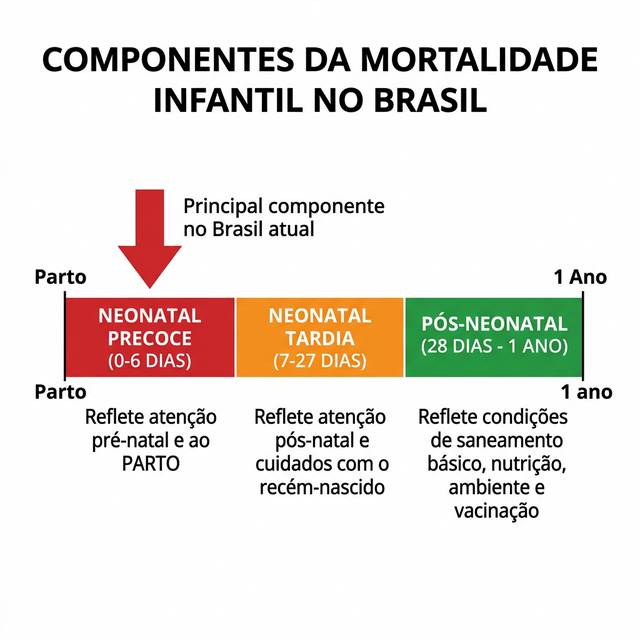
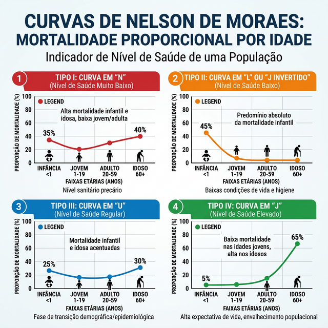
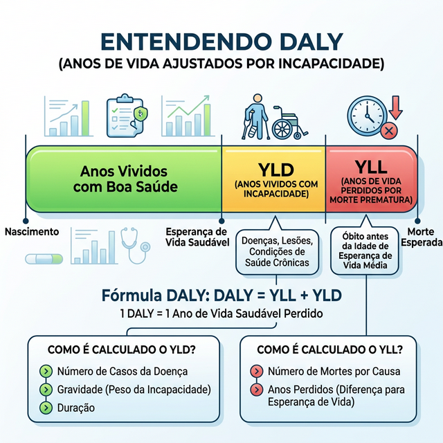
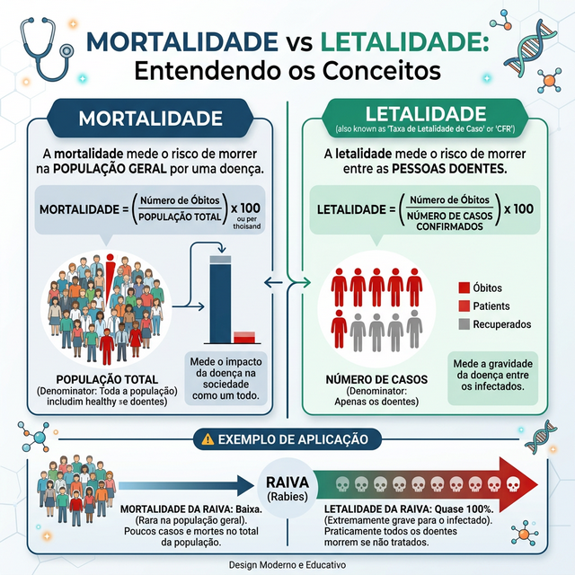

# MEDIDAS DE FREQUÊNCIA

Para entender epidemiologia, você precisa primeiro dominar a linguagem dos números. Na prova de residência, o examinador não quer apenas que você saiba fórmulas, ele quer saber se você entende o que aquele número representa para a saúde pública. Se eu te disser que a mortalidade por infarto em uma cidade é alta, isso significa que o hospital é ruim ou que a população é idosa? É essa distinção que as medidas de frequência nos dão.

Antes de entrarmos nos coeficientes específicos, precisamos alinhar três conceitos fundamentais que as bancas adoram misturar. Se você não souber a diferença entre razão, proporção e taxa, você vai errar a questão antes mesmo de começar a conta.

### Razão, Proporção e Taxa: A base de tudo

A **Razão** é o quociente entre duas grandezas independentes. O numerador não está contido no denominador. Um exemplo clássico é a Razão de Sexos: número de homens dividido pelo número de mulheres. Se temos 100 homens e 50 mulheres, a razão é 2. Note que o "homem" não faz parte do grupo "mulher".

A **Proporção** é quando o numerador está contido no denominador. É sempre um valor entre 0 e 1 (ou 0% a 100%). Se eu digo que 30% dos óbitos de uma cidade são por causas cardiovasculares, estou usando uma proporção. O numerador (mortes por infarto) faz parte do total (todas as mortes). Guarde isso: toda mortalidade proporcional é uma proporção, não uma taxa.

A **Taxa (ou Coeficiente)** introduz a variável tempo e o conceito de risco. Aqui, o denominador é a população sob risco de apresentar o evento. Quando falamos em Taxa de Mortalidade Geral, estamos medindo a "velocidade" com que a população está morrendo.

## Medidas de Morbidade: O Retrato vs. O Filme

*Figura 1: Prevalência é uma "fotografia" (retrato instantâneo de todos os casos), enquanto a Incidência é um "filme" (acompanha o surgimento de novos casos ao longo do tempo).*

Na prática clínica e nas questões do MedEvo, você verá dois grandes protagonistas: a Prevalência e a Incidência. O erro mais comum do aluno é achar que são intercambiáveis. Não são.

### Prevalência: O Retrato

A prevalência mede o número total de casos (novos e antigos) em um determinado momento. Imagine que eu entro em uma sala de aula e pergunto: "Quem aqui tem diabetes?". Se 5 pessoas levantarem a mão em um grupo de 100, a prevalência é de 5%.

A prevalência é excelente para o planejamento de saúde. Se eu sou o gestor de um hospital, preciso saber a prevalência de insuficiência renal crônica para saber quantas máquinas de hemodiálise preciso comprar. Ela não me diz quem adoeceu hoje, mas me diz quem precisa de cuidado agora.

**Fatores que aumentam a prevalência:**

- Maior duração da doença (doenças crônicas têm alta prevalência).

- Prolongamento da vida dos pacientes sem cura (o tratamento da AIDS aumentou a prevalência da doença, pois as pessoas param de morrer e continuam sendo "casos").

- Imigração de casos (pessoas doentes vindo para a região).

- Melhora no diagnóstico (você passa a enxergar casos que já existiam, mas eram subnotificados).

**Fatores que diminuem a prevalência:**

- Morte (letalidade alta "limpa" a prevalência).

- Cura (o indivíduo deixa de ser caso).

- Emigração de casos.

### Incidência: O Filme

A incidência foca nos **casos novos**. É a medida dinâmica. Ela indica o risco de uma pessoa saudável se tornar doente em um período de tempo. Se eu acompanho 100 pessoas saudáveis por um ano e 10 desenvolvem hipertensão, minha incidência é de 10% ao ano.

Existem duas formas de medir a incidência que caem em prova:

- **Incidência Acumulada:** É a proporção de pessoas que adoecem em um período. (Casos novos / População em risco no início do período).

- **Densidade de Incidência (Pessoa-Tempo):** Usada quando os indivíduos são acompanhados por tempos diferentes. O denominador é a soma do tempo que cada pessoa ficou sob observação sem adoecer. É a medida mais precisa para estudos de coorte.

### A Relação Fundamental

Existe uma fórmula que você deve tatuar no braço para a prova:
**Prevalência = Incidência x Duração média da doença (P = I x D)**

*Figura 2: A fórmula fundamental da epidemiologia. Gripe (alta I, curta D = baixa P), Diabetes (moderada I, longa D = alta P), AIDS com TARV (I estável, D aumentada = P crescente).*

Por que isso é importante? Imagine uma doença como a gripe: alta incidência (muita gente pega), mas duração curta. Resultado? Prevalência baixa no ano. Agora pense no Diabetes: incidência moderada, mas duração de décadas. Resultado? Prevalência altíssima.

**Dica do Dr. Will:** Se uma questão diz que surgiu um novo tratamento que não cura a doença, mas impede que o paciente morra, o que acontece? A incidência permanece igual (o risco de pegar a doença não mudou), mas a prevalência aumenta (as pessoas vivem mais tempo com a doença).

| Medida | Numerador | Denominador | Utilidade Principal |
| --- | --- | --- | --- |
| **Prevalência** | Casos novos + antigos | População total | Planejamento, doenças crônicas |
| **Incidência** | Apenas casos novos | População sob risco | Etiologia, risco, doenças agudas |
| **Letalidade** | Óbitos pela doença X | Total de doentes de X | Gravidade da doença |

## Medidas de Mortalidade: Onde os alunos mais erram

Aqui é o campo de batalha das bancas. Elas vão tentar te confundir entre Coeficiente de Mortalidade e Mortalidade Proporcional.

### Coeficiente Geral de Mortalidade (CGM)

É o número total de óbitos dividido pela população total, multiplicado por uma base (geralmente 1.000).
O CGM é uma medida "suja". Por quê? Porque ele é muito influenciado pela estrutura etária. Uma cidade com muitos idosos terá um CGM maior do que uma cidade de jovens, mesmo que o sistema de saúde da cidade idosa seja melhor. Por isso, para comparar cidades diferentes, precisamos padronizar a idade.

### Coeficientes de Mortalidade Específicos

Para ser mais preciso, usamos coeficientes por causa, idade ou sexo.
Exemplo: Coeficiente de Mortalidade por Doenças Circulatórias = (Óbitos por doenças circulatórias / População total) x 1.000.
Note que o denominador continua sendo a **população**, o que nos dá a ideia de **risco** de morrer por aquela causa naquela população.

### Mortalidade Proporcional (MP)

Aqui está a pegadinha. Na MP, o denominador NÃO é a população, mas sim o **total de óbitos**.
MP por Neoplasias = (Óbitos por Neoplasias / Total de Óbitos) x 100.

Se eu te disser que a MP por doenças cardiovasculares no Brasil é de cerca de 30%, isso significa que de cada 100 pessoas que morrem, 30 são pelo coração. Isso não me diz o risco de um vivo morrer; me diz apenas a distribuição das causas entre os mortos.

**Cuidado:** A Mortalidade Proporcional de uma causa pode aumentar simplesmente porque outra causa diminuiu. Se as mortes por causas externas caírem drasticamente, a proporção de mortes por câncer vai subir, mesmo que o número absoluto de mortes por câncer continue o mesmo.

## Mortalidade Infantil: O Indicador Sensível

A Taxa de Mortalidade Infantil (TMI) é um dos melhores indicadores de desenvolvimento socioeconômico e qualidade de assistência à saúde. Ela mede os óbitos em menores de 1 ano por cada 1.000 nascidos vivos.

Ela se divide em três componentes cruciais para a prova:

*Figura 3: Os três componentes da mortalidade infantil no Brasil. O componente neonatal precoce (0-6 dias) é hoje o principal, refletindo a qualidade da assistência ao pré-natal e parto.*

- **Mortalidade Neonatal Precoce (0 a 6 dias):** Reflete a assistência ao pré-natal e ao parto. É o componente mais difícil de reduzir, pois envolve causas congênitas e manejo hospitalar complexo.

- **Mortalidade Neonatal Tardia (7 a 27 dias):** Também ligada a fatores biológicos e cuidados pós-natais imediatos.

- **Mortalidade Pós-Neonatal (28 dias a 1 ano):** Reflete as condições de vida (saneamento, nutrição, vacinação). É o componente que mais cai quando um país melhora o saneamento básico.

**Pérola de Prova:** No Brasil, a mortalidade infantil vem caindo nas últimas décadas, mas essa queda foi principalmente às custas do componente pós-neonatal. Hoje, o maior peso está no componente neonatal (especialmente o precoce). Se a questão perguntar qual a principal causa de morte infantil hoje, a resposta é: afecções perinatais (prematuridade, asfixia).

### Mortalidade Materna

É o óbito de uma mulher durante a gestação ou até 42 dias após o parto, por causas ligadas à gravidez.
O denominador aqui é o número de **Nascidos Vivos** (uma aproximação do número de gestantes).
As causas são divididas em:

- **Diretas:** Complicações obstétricas (Hemorragia, Hipertensão/Pré-eclâmpsia, Infecção). São a maioria no Brasil.

- **Indiretas:** Doenças pré-existentes que pioram com a gravidez (ex: cardiopatias).

## Indicadores de Saúde e Qualidade de Vida

As bancas pararam de pedir apenas fórmulas e começaram a pedir indicadores compostos. Você precisa conhecer o ISU e as Curvas de Nelson de Moraes.

### Índice de Swaroop & Uemura (ISU)

Também chamado de Razão de Mortalidade Proporcional (RMP) aos 50 anos ou mais.
**Fórmula:** (Óbitos em pessoas com 50 anos ou mais / Total de óbitos) x 100.

Quanto maior o ISU, melhor o nível de saúde da população. Em países desenvolvidos, o ISU passa de 75%. Isso é lógico: se as pessoas estão morrendo, que morram velhas. Se muita gente morre antes dos 50, algo está errado com a saúde ou segurança daquele local.

### Curvas de Nelson de Moraes

Este indicador analisa a mortalidade proporcional por faixas etárias e desenha um gráfico. Existem quatro padrões clássicos:

*Figura 4: Curvas de Nelson de Moraes. Tipo IV (J) = nível de saúde elevado (maioria dos óbitos em idosos). Tipo I (N) = nível muito baixo (muita morte infantil e jovem).*

- **Tipo I (Nível de saúde muito baixo):** Curva em formato de "N" (a aparência real é de um N invertido, mas é chamada de N nas provas e alguns trabalhos acadêmicos). Muita gente morre jovem (infantil) e poucos chegam à velhice.

- **Tipo II (Nível de saúde baixo):** Curva em "L" ou "J invertido". A mortalidade infantil ainda é alta, mas a mortalidade de idosos começa a aparecer, justificando aqueles que a denominam de "J invetido", por ter leve ascensão final.

- **Tipo III (Nível de saúde regular):** Curva em "U".

- **Tipo IV (Nível de saúde elevado):** Curva em "J". A mortalidade infantil é baixíssima e a grande maioria dos óbitos se concentra nos idosos. É o padrão dos países desenvolvidos e o que o Brasil vem perseguindo.

### Carga de Doença: DALY e APVP

A mortalidade sozinha não conta a história toda. Se um jovem de 20 anos fica paraplégico em um acidente, ele não entra na estatística de mortalidade, mas ele representa uma enorme "carga" para a sociedade e para si mesmo.

-

**APVP (Anos Potenciais de Vida Perdidos):** Foca na mortalidade prematura. Se a expectativa de vida é 75 anos e alguém morre aos 30, foram perdidos 45 anos. Isso dá peso às mortes de jovens (como acidentes e violência).

*Figura 6: DALY (Disability-Adjusted Life Years). Soma os anos de vida perdidos por morte prematura (YLL) com os anos vividos com incapacidade (YLD). 1 DALY = 1 ano de vida saudável perdido.*

-

**DALY (Disability-Adjusted Life Years):** É a soma do YLL (Anos de vida perdidos por morte prematura) + YLD (Anos vividos com incapacidade). É a medida definitiva da "carga global da doença". Um DALY significa um ano de vida saudável perdido.

| Indicador | O que mede? | O que reflete? |
| --- | --- | --- |
| **TMI Neonatal** | Óbitos < 28 dias | Parto e Pré-natal |
| **TMI Pós-Neonatal** | Óbitos 28d a 1 ano | Saneamento e Ambiente |
| **ISU** | Óbitos > 50 anos | Nível de desenvolvimento |
| **Letalidade** | Óbitos / Doentes | Virulência / Gravidade |
| **DALY** | Morte + Incapacidade | Carga total da doença |

## A Letalidade e a Gravidade Clínica

A Taxa de Letalidade é frequentemente confundida com a Taxa de Mortalidade, mas para o clínico, a diferença é vital.

*Figura 5: Mortalidade (óbitos / população total) vs Letalidade (óbitos / nº de doentes). Exemplo: a Raiva tem mortalidade baixíssima (incidência rara), mas letalidade de quase 100%.*

A mortalidade diz: "Qual a chance de um cidadão desta cidade morrer de Raiva?". (Quase zero, porque a incidência é baixa).
A letalidade diz: "Qual a chance de o meu paciente, que acabou de ser diagnosticado com Raiva, morrer?". (Quase 100%).

A letalidade mede a **gravidade** da doença. Doenças agudas e graves, como o Ebola ou a Raiva, possuem letalidade altíssima. Doenças crônicas, como a hipertensão, possuem letalidade baixa no curto prazo, mas alta prevalência.

**Exemplo Clínico:** Imagine um surto de uma nova variante de Influenza em uma cidade de 100.000 habitantes.

- 1.000 pessoas ficam doentes (Incidência = 1%).

- Dessas, 100 morrem.

- A Taxa de Mortalidade na cidade é 100 / 100.000 = 0,1%.

- A Taxa de Letalidade da doença é 100 / 1.000 = 10%.
Percebeu? A letalidade é 100 vezes maior que a mortalidade. Se você usar o denominador errado na prova, vai marcar a alternativa errada que a banca colocou lá de propósito.

## Declaração de Óbito (DO): O Documento Base

Toda a estatística de mortalidade que discutimos depende de um papel: a Declaração de Óbito. No Brasil, o Ministério da Saúde padroniza esse preenchimento.

**Quem deve preencher?**

- **Morte por causa natural com assistência médica:** O médico que assistiu o paciente.

- **Morte por causa natural sem assistência médica:** O Serviço de Verificação de Óbitos (SVO). Se não houver SVO, o médico do serviço público de saúde local.

- **Morte por causa externa (acidentes, homicídios, suicídios):** EXCLUSIVAMENTE o Instituto Médico Legal (IML), independentemente se o paciente morreu na rua ou dentro do hospital após 1 mês de internação.

**Erro clássico de prova:** Paciente de 80 anos, internado há 30 dias por fratura de fêmur após queda da própria altura, morre de pneumonia hospitalar. Quem assina a DO? O médico assistente? Não! Foi uma causa externa (queda). Quem assina é o IML.

No preenchimento das causas, temos:

- **Causa Terminal (Imediata):** O evento final (ex: Choque séptico).

- **Causas Intermediárias:** O que levou à causa terminal (ex: Pneumonia).

- **Causa Básica:** A doença ou lesão que iniciou a cadeia de eventos (ex: Diabetes Mellitus). É a causa básica que vai para as estatísticas oficiais da OMS.

## Transição Epidemiológica e Demográfica

Você precisa entender o contexto atual do Brasil para responder questões sobre "Perfil Epidemiológico".

- **Transição Demográfica:** A população brasileira está envelhecendo. A base da pirâmide está estreitando (menos nascimentos) e o topo está alargando (maior expectativa de vida).

- **Transição Epidemiológica:**

- Queda das doenças infectocontagiosas (embora ainda tenhamos doenças negligenciadas como Hanseníase e Chagas).

- Aumento das Doenças Crônicas Não Transmissíveis (DCNT) como Câncer e Doenças Cardiovasculares.

- Aumento das Causas Externas (Violência e Acidentes).

O Brasil vive hoje uma "Tripla Carga de Doença": ainda lidamos com doenças da pobreza, convivemos com a epidemia de doenças crônicas e sofremos com o impacto da violência.

## Medidas de Frequência em Doenças Específicas

Algumas doenças possuem formas particulares de serem cobradas:

- **Hanseníase:** Como é uma doença de evolução muito lenta, a prevalência é usada para monitorar o controle, mas o indicador de "casos novos entre menores de 15 anos" é o mais sensível para medir a circulação atual do *Mycobacterium leprae*.

- **HIV/AIDS:** Com o advento da terapia antirretroviral (TARV), a letalidade caiu drasticamente. Isso causou um aumento na prevalência (as pessoas vivem mais com o vírus). A incidência de novos casos de AIDS (doença manifesta) caiu, mas a incidência de infecção pelo HIV em populações jovens ainda é um desafio.

- **Covid-19:** Durante a pandemia, vimos a importância da "Taxa de Ataque", que é uma forma de incidência usada em surtos localizados (ex: número de pessoas que comeram a maionese estragada e ficaram doentes).

## Comparando Indicadores: O que eles realmente dizem?

Muitas vezes, a banca vai te dar uma tabela com dados de duas cidades e pedir para você dizer qual é a mais desenvolvida.

**Cidade A:**

- Mortalidade Infantil: 10/1.000 NV

- ISU: 80%

- Causa básica de morte mais comum: Neoplasias

**Cidade B:**

- Mortalidade Infantil: 45/1.000 NV

- ISU: 30%

- Causa básica de morte mais comum: Doenças Infecciosas

Claramente, a Cidade A é mais desenvolvida. Ela já passou pela transição epidemiológica. A Cidade B ainda sofre com problemas básicos de saneamento e assistência materno-infantil.

**Dica de Ouro:** Se a questão falar em "Anos de Vida Ajustados por Incapacidade" ou "DALY", ela está falando de **Carga de Doença**. Se falar em "Mortalidade Proporcional em maiores de 50 anos", está falando de **Swaroop-Uemura**. Se falar em "Casos novos por população em risco", está falando de **Incidência**.

## Resumo de Fórmulas Essenciais

Para não ter erro na hora da prova, memorize estas estruturas:

- **Coeficiente de Mortalidade Geral:** (Óbitos Totais / População Total) x 1.000

- **Coeficiente de Mortalidade Infantil:** (Óbitos < 1 ano / Nascidos Vivos) x 1.000

- **Razão de Mortalidade Materna:** (Óbitos Maternos / Nascidos Vivos) x 100.000 (Cuidado com a base 100 mil!)

- **Taxa de Letalidade:** (Óbitos por Doença X / Casos da Doença X) x 100

- **Mortalidade Proporcional por Causa:** (Óbitos por Causa X / Óbitos Totais) x 100

- **Prevalência:** (Casos Existentes / População Total) x 100

- **Incidência Acumulada:** (Casos Novos / População sob Risco) x 1.000

## Pontos-Chave para Prova

- **Prevalência vs. Incidência:** Prevalência é estoque (casos novos + antigos), Incidência é fluxo (casos novos). Se a doença cura rápido ou mata rápido, a prevalência será baixa, mesmo que a incidência seja alta.

- **P = I x D:** A prevalência depende da incidência e da duração da doença. Tratamentos que prolongam a vida sem curar aumentam a prevalência.

- **Mortalidade Infantil:** O componente neonatal (0-27 dias) é o principal no Brasil atual e reflete assistência ao parto e pré-natal. O pós-neonatal reflete condições ambientais.

- **Mortalidade Materna:** O denominador é Nascidos Vivos, não a população total. A base é 100.000. Causas diretas (hipertensão, hemorragia) predominam.

- **Letalidade:** Mede a gravidade da doença. É uma proporção entre mortos por uma doença e o total de doentes. Não confunda com mortalidade (onde o denominador é a população).

- **Swaroop-Uemura (ISU):** Mede a proporção de mortos com 50 anos ou mais. Quanto maior, melhor o nível de saúde.

- **Nelson de Moraes:** Curva em "J" (Tipo IV) indica nível de saúde elevado. Curva em "N" ou "J invertido" (Tipo I) indica nível muito baixo.

- **DALY:** É o melhor indicador para medir a carga global de uma doença, pois soma morte prematura e anos vividos com incapacidade.

- **Causa Externa na DO:** Se a morte foi por acidente, suicídio ou homicídio, quem assina é SEMPRE o IML, mesmo que tenha ocorrido dentro do hospital após longo tempo.

- **Mortalidade Proporcional:** Não mede risco! Se a mortalidade proporcional por câncer subiu, não significa necessariamente que o risco de câncer aumentou; pode ser que as mortes por outras causas caíram.

- **Transição Epidemiológica no Brasil:** Caracteriza-se pelo aumento das DCNT e causas externas, com queda das doenças infectocontagiosas, mas persistência de doenças negligenciadas.

- **Pessoa-Tempo:** Denominador usado na Densidade de Incidência. É a soma dos períodos de tempo em que cada indivíduo esteve em risco.

- **Fator de Correção (K):** Geralmente 1.000 para mortalidade geral e infantil, e 100.000 para mortalidade materna e por causas específicas (como câncer).

- **O que NÃO fazer:** Nunca use a população total como denominador para cálculo de Letalidade. Isso é o erro número 1 que elimina candidatos.

- **Pegadinha de Prova:** A banca diz que a incidência de uma doença aumentou após um novo teste diagnóstico ser implementado. Isso não significa que a doença está se espalhando mais, apenas que estamos diagnosticando casos que antes eram invisíveis.

 Cópia offline para consulta pessoal.
 Fonte original:
 [https://www.medevo.com.br/material-apoio/ler/be1f7f11-9fe0-4050-ad7b-b9c9bc37feed](https://www.medevo.com.br/material-apoio/ler/be1f7f11-9fe0-4050-ad7b-b9c9bc37feed)
