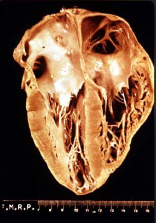
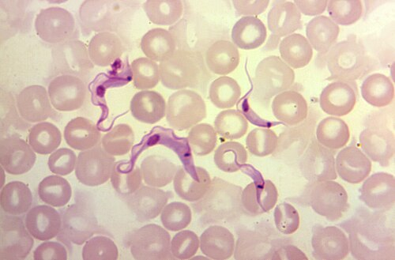

# MEGACÓLON CHAGÁSICO

O megacólon chagásico é a manifestação intestinal da infecção pelo *Trypanosoma cruzi*. Para entender essa doença, você não deve pensar nela apenas como um "intestino grande". O buraco é mais embaixo: trata-se de uma doença neuromuscular progressiva. O parasita destrói os plexos mientéricos (Auerbach) e submucosos (Meissner), levando a uma descoordenação motora e, eventualmente, à dilatação e ao alongamento do cólon.

Nas provas de residência, o examinador quer saber se você sabe diferenciar o tratamento clínico do cirúrgico e, principalmente, se você sabe manejar as complicações agudas, como o vólvulo de sigmoide.

*Figura 1 - Peça anatômica demonstrando cardiomiopatia chagásica com dilatação ventricular. A doença de Chagas afeta não apenas o coração, mas também o trato gastrointestinal, causando megacólon e megaesôfago. Fonte: CDC, Domínio Público | Wikimedia Commons*

## Fisiopatologia: O Porquê da Dilatação

Por que o cólon dilata? Não é por uma obstrução mecânica distal (como um tumor), mas por uma falha na condução nervosa. A destruição dos neurônios do plexo de Auerbach impede o relaxamento receptivo do reto e do sigmoide.

Imagine o intestino como uma esteira rolante. Se uma parte da esteira para de se mover, o material começa a se acumular atrás dela. Com o tempo, a parede muscular, tentando vencer essa "barreira funcional", sofre hipertrofia inicial, seguida de fibrose e atrofia. O resultado é um órgão gigante (megacólon) e alongado (dolicocólon), com capacidade de armazenar litros de fezes por semanas.

Aqui no MedEvo, sempre reforçamos: o megacólon chagásico é uma doença de **esvaziamento**. O reto, embora pareça normal macroscopicamente em muitos casos, é a zona de maior disfunção motora (acalasia retal).

## Quadro Clínico e Exame Físico

O paciente clássico é o idoso, geralmente vindo de área endêmica (embora a migração urbana tenha mudado esse perfil), com uma queixa principal: **constipação intestinal crônica de longa data**.

### Sinais e Sintomas Típicos

- **Constipação progressiva:** O paciente passa 10, 15, até 30 dias sem evacuar.

- **Uso crônico de laxantes e lavagens:** Muitas vezes o paciente já chega "viciado" em métodos invasivos para evacuar.

- **Distensão abdominal:** É crônica e, muitas vezes, indolor.

- **Fecaloma:** O acúmulo de fezes endurecidas é a regra.

### O Exame Físico "Padrão de Prova"

Ao examinar esse paciente, você encontrará um abdome globoso, timpanítico, mas com massas palpáveis firmes, geralmente no flanco esquerdo ou hipogástrio.

**Pérola de Prova:** O "Sinal do Cacifo" (ou sinal de Godet) no abdome. Ao pressionar a massa fecal através da parede abdominal, a depressão permanece por alguns segundos. Isso é patognomônico de fecaloma.

No toque retal (obrigatório!), você pode encontrar a ampola retal vazia (se o fecaloma estiver mais alto) ou preenchida por uma massa pétrea. Lembre-se: em Chagas, a ampola retal costuma estar dilatada, ao contrário da Doença de Hirschsprung (megacólon congênito), onde ela é colabada.

*Figura 2 - Formas tripomastigotas de Trypanosoma cruzi em esfregaço de sangue periférico. O diagnóstico sorológico (ELISA, IFI) é fundamental na fase crônica da doença de Chagas. Fonte: CDC, Domínio Público | Wikimedia Commons*

## Diagnóstico: Além da Sorologia

O diagnóstico de certeza da infecção é sorológico (ELISA ou Imunofluorescência), mas o diagnóstico do megacólon é **radiológico**.

### 1. Radiografia Simples de Abdome

Útil nas complicações. No vólvulo de sigmoide, você verá o clássico sinal do "grão de café" ou "U invertido", apontando para o quadrante superior direito.

### 2. Enema Opaco (O Padrão-Ouro para Morfologia)

É o melhor exame para avaliar a extensão da doença.

- **Critério radiológico:** Consideramos megacólon quando o diâmetro do sigmoide ultrapassa **6,5 a 7 cm**.

- O enema mostra o "megassigmoide" e o "megarreto". É fundamental para o planejamento cirúrgico, pois avalia o grau de alongamento (dolicocólon).

### 3. Manometria Anorretal

Diferente do megaesôfago, onde a manometria é essencial, no megacólon ela é usada principalmente para diagnóstico diferencial.

- **Achado na Chagas:** Ausência do Reflexo Inibitório do Esfíncter Anal Interno (RIEAI). Quando o reto distende, o esfíncter interno deveria relaxar. No chagásico, isso não acontece.

### Tabela 1: Diagnóstico Diferencial do Megacólon

| Condição | Perfil do Paciente | Fisiopatologia | Toque Retal |
| --- | --- | --- | --- |
| **Megacólon Chagásico** | Adulto/Idoso, área endêmica | Destruição de plexos (adquirida) | Ampola dilatada, pode ter fecaloma |
| **Doença de Hirschsprung** | Recém-nascido/Criança | Ausência congênita de plexos | Ampola vazia e "apertada" |
| **Megacólon Tóxico** | Paciente com RCU ou Crohn | Inflamação transmural grave | Doloroso, sinais de peritonite |
| **Pseudo-obstrução (Ogilvie)** | Hospitalizado, distúrbio metabólico | Desequilíbrio autonômico agudo | Ampola vazia, sem lesão mecânica |

## Tratamento Clínico: Quando Não Operar?

O tratamento clínico não cura a doença, apenas maneja os sintomas. É indicado para pacientes com sintomas leves, idosos com alto risco cirúrgico ou como preparo para a cirurgia.

- **Dieta:** Rica em fibras (25-30g/dia) e alta ingestão hídrica (mínimo 2L/dia). **Cuidado:** Fibras sem água em um cólon hipomotora podem PIORAR o fecaloma.

- **Laxantes:** Preferência para os osmóticos (Lactulose, Polietilenoglicol). Evite irritantes (Sene, Picossulfato) a longo prazo, pois eles podem lesar ainda mais os plexos nervosos.

- **Lavagens (Enemas):** Devem ser feitas com solução salina. Nunca use água pura em grandes volumes pelo risco de intoxicação hídrica e hiponatremia dilucional.

## Tratamento Cirúrgico Eletivo

Como diz o Dr. Will, "em cirurgia de megacólon, o objetivo é remover a zona de acalasia (reto) e o reservatório inercial (sigmoide)".

As indicações cirúrgicas clássicas que caem em prova são:

- Fecalomas de repetição.

- Vólvulo de sigmoide prévio (mesmo que reduzido endoscopicamente).

- Constipação refratária ao tratamento clínico que impacta a qualidade de vida.

### As Técnicas Principais

#### 1. Cirurgia de Duhamel-Haddad (A Favorita das Provas)

É a técnica mais cobrada. Consiste na retossigmoidectomia com abaixamento retroretal do cólon.

- **Por que fazemos?** Porque o reto chagásico é doente. Se você fizer uma anastomose muito alta (acima do reto), a doença volta.

- **A técnica:** O reto é grampeado e deixado no lugar (exclusão). O cólon sadio é trazido por trás do reto e anastomosado no canal anal. Isso cria um "novo reto" com uma parede anterior sensível (o reto original) e uma parede posterior motora (o cólon abaixado).

- **Vantagem:** Menor risco de lesão dos nervos pélvicos (preserva função sexual e urinária) em comparação com a proctocolectomia total.

#### 2. Cirurgia de Swenson-Cutait

É o abaixamento transanal com ressecção do reto. É mais trabalhosa e tem maior risco de lesão nervosa pélvica, mas remove completamente o tecido doente.

#### 3. Colectomia Total com Ileoproctoanastomose

Reservada para casos onde todo o cólon está dilatado (megacólon total). É uma cirurgia maior, com maior morbidade nutricional (diarreia).

## Complicações Agudas: O Pesadelo do Plantonista

Aqui é onde a maioria dos alunos erra. O examinador vai te dar um cenário de urgência e você precisa decidir entre o endoscópio e o bisturi.

### 1. Vólvulo de Sigmoide

É a torção do cólon sobre o seu próprio eixo mesentérico. Como o sigmoide no Chagas é muito longo (dolicocolon) e o mesocolon é estreito, a torção é facilitada.

**Conduta no Vólvulo:**

- **Paciente Estável + Sem sinais de peritonite:** A conduta inicial é a **Descompressão Endoscópica** (colonoscopia ou retossigmoidoscopia).

- *Por que?* Para transformar uma urgência em uma cirurgia eletiva, que tem menor mortalidade. Após a descompressão, o paciente deve ser operado na mesma internação (Duhamel), pois a taxa de recorrência do vólvulo é de quase 100%.

- **Paciente Instável OU Sinais de Peritonite (Isquemia/Necrose):** Esqueça o endoscópio. A conduta é **Laparotomia de Urgência**.

- A cirurgia de escolha na vigência de necrose é a **Operação de Hartmann** (ressecção do sigmoide gangrenado + colostomia terminal + fechamento do coto retal). Não se faz anastomose primária em tecido infectado ou isquêmico!

### 2. Fecaloma

O tratamento inicial é clínico: lavagens retrógradas, óleo mineral via oral e, se necessário, fragmentação manual sob sedação. A cirurgia só entra se houver perfuração (fecaloma estercoráceo).

## Conexão com o Megaesôfago

Muitas questões misturam os dois temas. Lembre-se que o tratamento do megaesôfago segue a Classificação de Rezende:

- **Grau I e II:** Cardiomiotomia de Heller-Pinotti (Miotomia + Fundoplicatura).

- **Grau III:** Heller-Pinotti ou Serra-Dória (em alguns serviços).

- **Grau IV (Dolicomegaesôfago):** Esofagectomia subtotal (se o paciente tiver condições cirúrgicas). Se o risco for muito alto, pode-se tentar a cirurgia de Serra-Dória (anastomose esofagogástrica + gastrectomia parcial em Y de Roux).

**Erro clássico:** Achar que o tratamento do megacólon grau IV é a colectomia total. Não! O tratamento do megacólon foca na ressecção do sigmoide e tratamento do reto (Duhamel).

### Tabela 2: Manejo do Vólvulo de Sigmoide

| Cenário Clínico | Conduta Inicial | Objetivo |
| --- | --- | --- |
| Estável, sem peritonite | Descompressão Endoscópica | Destorcer e preparar para cirurgia eletiva |
| Instável ou Peritonite | Laparotomia (Hartmann) | Ressecar segmento necrótico e salvar a vida |
| Sucesso na descompressão | Cirurgia de Duhamel (eletiva) | Evitar recidiva (que é quase certa) |

## Pontos-Chave para Prova

- **Definição:** Diâmetro do sigmoide > 6,5 - 7 cm no enema opaco.

- **Fisiopatologia:** Destruição dos plexos de Auerbach e Meissner pelo *T. cruzi*.

- **Sinal do Cacifo:** Massa abdominal que "guarda a marca" do dedo; indica fecaloma.

- **Vólvulo de Sigmoide:** Complicação aguda mais comum. Imagem em "grão de café".

- **Conduta no Vólvulo Estável:** Descompressão endoscópica é a primeira escolha.

- **Conduta no Vólvulo com Necrose:** Cirurgia de Hartmann (ressecção + colostomia).

- **Cirurgia Eletiva Padrão:** Duhamel-Haddad (abaixamento retroretal).

- **Por que Duhamel?** Trata a acalasia retal e preserva a inervação pélvica (sexual/urinária).

- **Toque Retal:** Fundamental para diferenciar de causas obstrutivas baixas e avaliar o reto.

- **Manometria:** Mostra ausência do reflexo inibitório do esfíncter anal interno (RIEAI).

- **Contraindicação Absoluta:** Nunca faça anastomose primária em vigência de peritonite ou isquemia intestinal.

- **Pegadinha de Prova:** A banca dirá que a conduta no vólvulo é "sempre cirúrgica". Falso! Se estiver estável, a descompressão endoscópica vem primeiro.

- **Diferencial:** No megacólon tóxico (RCU), a conduta de urgência é colectomia total + ileostomia (Hartmann modificada), preservando o reto para uma cirurgia futura.

- **Laxantes:** Evite os irritantes (antraquinônicos) no tratamento crônico para não acelerar a denervação.

- **Enema de Água Doce:** Risco de hiponatremia grave por absorção sistêmica no cólon gigante. Use soro fisiológico. 🩺

Este material cobre os pontos fundamentais exigidos pelas principais bancas do país (USP, SURCE, ENARE, AMP). Ao ler uma questão sobre megacólon, identifique primeiro se o paciente está estável ou se há uma complicação aguda. Isso definirá 90% das suas respostas.

 Cópia offline para consulta pessoal.
 Fonte original:
 [https://www.medevo.com.br/material-apoio/ler/4e6f3cf8-8cda-4b58-b15b-bd2032df3013](https://www.medevo.com.br/material-apoio/ler/4e6f3cf8-8cda-4b58-b15b-bd2032df3013)
