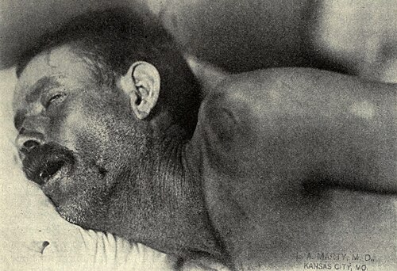
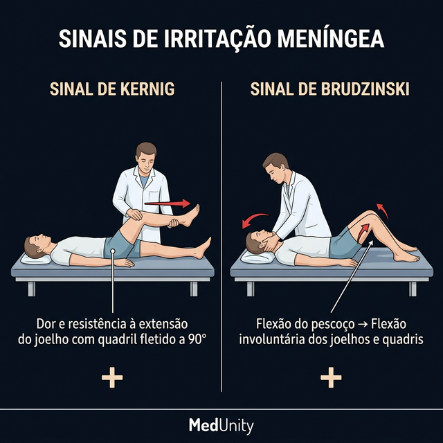
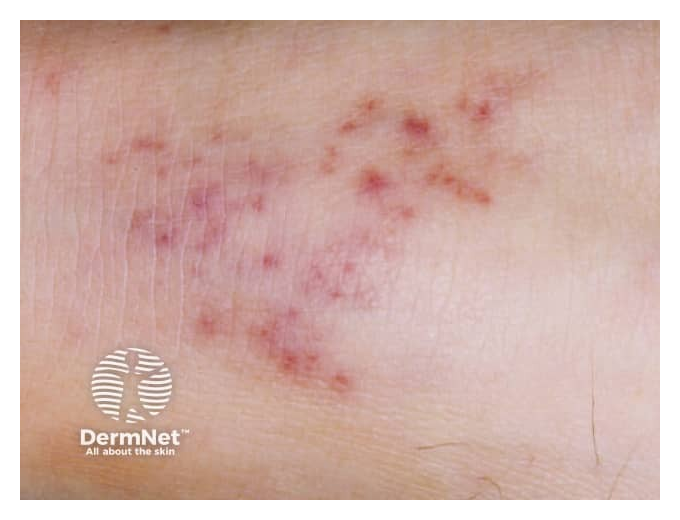
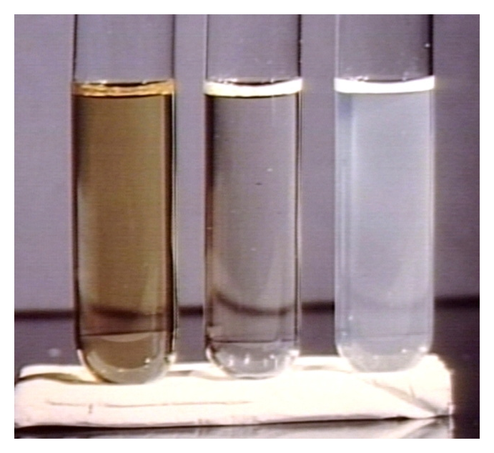
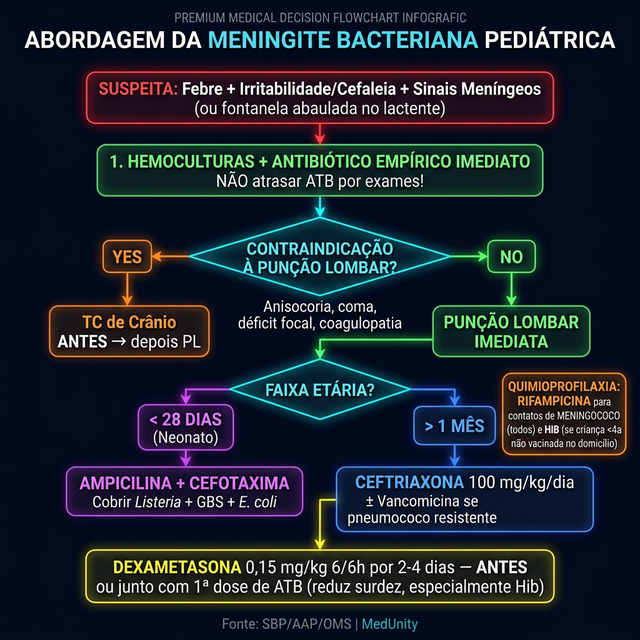

# MENINGITES

Para entender meningites em pediatria, você precisa parar de tentar decorar listas de bactérias e começar a entender o cenário clínico. A meningite não é apenas uma "infecção no líquor", é uma emergência médica onde cada hora de atraso no antibiótico aumenta a chance de sequelas permanentes ou óbito.

Nas provas de residência, o examinador quer saber se você sabe diferenciar o agente pelo grupo etário, se sabe interpretar um líquor (LCR) e se conhece as medidas de saúde pública, como a quimioprofilaxia. Vamos construir esse raciocínio juntos.

## Fisiopatologia e a Barreira Hematoencefálica

Por que a meningite é tão grave? O sistema nervoso central (SNC) é um local privilegiado. A barreira hematoencefálica protege o cérebro, mas, quando uma bactéria consegue atravessá-la, seja por via hematogênica (mais comum), por contiguidade (uma sinusite ou otite que complicou) ou por trauma (fístula liquórica), ela encontra um ambiente com poucas defesas.

No LCR, há poucas proteínas de complemento e poucos anticorpos. A bactéria se multiplica livremente, liberando componentes da parede celular (como o lipopolissacarídeo das Gram-negativas). Isso gera uma cascata inflamatória brutal. O edema cerebral que vemos na meningite não é apenas pelo pus, é citotóxico, vasogênico e intersticial. É por isso que, em alguns casos, usamos corticoides: para frear essa resposta inflamatória que o próprio corpo gera e que acaba lesando os neurônios.

## Etiologia: O Jogo das Idades

Este é o tópico mais cobrado. Se você souber a idade da criança, você já sabe 80% do provável agente.

### Neonatos (0 a 28 dias)

Aqui o canal de parto é o culpado. Os germes são os mesmos da sepse neonatal:

- Streptococcus agalactiae (Grupo B ou GBS): O campeão absoluto.

- Escherichia coli: E outros Gram-negativos entéricos.

- Listeria monocytogenes: Menos comum, mas cai muito em prova porque exige um antibiótico específico (Ampicilina).

### Lactentes e Crianças (1 mês a 18 anos)

Com a introdução das vacinas no Programa Nacional de Imunizações (PNI), o cenário mudou. O Haemophilus influenzae tipo b (Hib) despencou, mas ainda aparece em crianças não vacinadas.

- Streptococcus pneumoniae (Pneumococo): Atualmente o principal agente em várias faixas etárias. Causa quadros graves e tem maior associação com sequelas auditivas.

- Neisseria meningitidis (Meningococo): O rei das epidemias e do exantema petequial.

- Haemophilus influenzae tipo b: Raro em vacinados, mas lembre-se dele se a história citar "atraso vacinal".

Cuidado: O Streptococcus pyogenes (Grupo A) NÃO é uma causa comum de meningite primária. Se ele aparecer, geralmente é complicação de uma infecção de pele ou orofaringe muito grave, mas para a prova, foque no trio "Pneumo, Meningo e Hib".

## Quadro Clínico: Do Sutil ao Clássico

O erro clássico do estudante é esperar rigidez de nuca em um bebê de 2 meses. Esqueça isso.

### O Lactente Jovem (Menor de 3-6 meses)

Os sinais são inespecíficos. A criança apresenta febre (ou hipotermia), irritabilidade (choro que piora ao colo, pois a manipulação dói), recusa alimentar e a famosa fontanela abaulada (sinal tardio de hipertensão intracraniana). Se um lactente está com "febre sem sinal localizado" e parece "caído", a punção lombar deve ser fortemente considerada.

### Crianças Maiores

Aqui temos a tríade clássica: febre, cefaleia e sinais de irritação meníngea.

- Sinal de Kernig: Você flexiona o quadril e tenta estender o joelho, a criança sente dor e resiste.

- Sinal de Brudzinski: Você flexiona o pescoço e a criança, involuntariamente, flexiona os joelhos e o quadril.

Dica de prova: Se o quadro clínico vier acompanhado de petéquias ou púrpura fulminans, pense imediatamente em Neisseria meningitidis.

 Porém, cuidado: o pneumococo também pode causar petéquias em casos de sepse grave, mas a banca usa o exantema para te levar ao meningococo.

## Diagnóstico: A Hora da Punção Lombar

O diagnóstico de certeza é o estudo do Líquido Cefalorraquidiano (LCR). Mas antes de furar, você deve saber quando NÃO furar de imediato.

### Contraindicações à Punção Lombar (PL) imediata

Você deve estabilizar o paciente primeiro ou pedir uma TC de crânio se houver:

- Sinais de hipertensão intracraniana grave (anisocoria, bradicardia com hipertensão, postura de decorticação).

- Déficit neurológico focal.

- Coma profundo.

- Infecção no local da punção.

- Coagulopatia grave ou plaquetopenia importante.

Importante: Se você decidir que a PL vai demorar porque precisa de uma TC, NÃO espere para dar o antibiótico. Colha a hemocultura e inicie a terapia empírica. O antibiótico demora algumas horas para "limpar" o líquor, então a cultura ainda pode vir positiva se colhida logo após.

### Interpretando o LCR

Como o Dr. Will sempre reforça, o LCR é o "espelho" da meninge. Veja a tabela comparativa que resume o que cai:

| Parâmetro | Normal | Bacteriana | Viral | Tuberculosa / Fúngica |
| --- | --- | --- | --- | --- |
| Aspecto | Límpido (cristal de rocha) | Turvo / Purulento | Límpido | Límpido / Opalescente |
| Células (leucócitos) | < 5 (RN até 20) | Muito alta (> 1000) | Aumentada (10-500) | Aumentada (50-500) |
| Predomínio | Linfomononuclear | Polimorfonucleares (PMN) | Linfomononuclear | Linfomononuclear |
| Glicose | > 2/3 da glicemia | Baixa (< 40 mg/dL) | Normal | Muito baixa |
| Proteína | < 40 mg/dL | Alta (> 100 mg/dL) | Leve aumento | Muito alta |
| Outros | - | Gram e Cultura + | PCR viral | Tinta nanquim (fungo) / BAAR |

Pegadinha de prova: A "Meningite Bacteriana Parcialmente Tratada". Se a criança tomou um antibiótico oral por 2 dias para uma "dor de garganta" e depois evoluiu com meningite, o LCR pode vir com predomínio linfocitário, mas a glicose continuará baixa. A glicose baixa é o grande marcador que diferencia da viral.

## Tratamento Farmacológico: A Escolha das Armas

O tratamento deve ser iniciado na suspeita clínica, logo após a coleta de culturas (ou antes, se houver atraso na coleta).

### Terapia Empírica por Faixa Etária

- Recém-nascidos (< 28 dias): Ampicilina + Cefotaxima (ou Gentamicina).

- Por que Ampicilina? Para cobrir Listeria.

- Por que Cefotaxima e não Ceftriaxona? A Ceftriaxona pode causar colelitíase induzida por drogas (lama biliar) e competir com a bilirrubina, aumentando o risco de kernicterus no neonato.

- Lactentes e Crianças: Ceftriaxona (100 mg/kg/dia).

- Em locais com alta resistência de pneumococo, associa-se Vancomicina.

### O Papel dos Corticoides

O uso de Dexametasona é indicado preferencialmente ANTES ou junto com a primeira dose de antibiótico. O objetivo principal é reduzir a inflamação e, consequentemente, diminuir a incidência de surdez, especialmente na meningite por Haemophilus influenzae tipo b.

### Situações Especiais

- Meningite Herpética: Suspeitar se houver encefalite (alteração de comportamento, convulsões focais). O diagnóstico é por PCR no LCR e o tratamento é Aciclovir EV.

- Tuberculose Meningoencefálica: Quadro arrastado, paralisia de pares cranianos. O LCR tem pleocitose linfocitária e glicose muito baixa. O tratamento é o esquema RIPE (Rifampicina, Isoniazida, Pirazinamida e Etambutol) por 2 meses, seguido de RI por mais 10 meses (totalizando 12 meses), associado a corticoide nos primeiros meses.

## Complicações e Manejo de Suporte

A meningite não anda sozinha. Ela traz complicações que você precisa monitorar:

- SIADH (Síndrome da Secreção Inapropriada de ADH): Suspeite se houver hiponatremia euvolêmica com urina muito concentrada. O tratamento é restrição hídrica.

- Abscesso Cerebral ou Empiema Subdural: Suspeite se a febre persistir após 48-72h de antibiótico adequado ou se surgir déficit focal.

- Choque Séptico: Comum na meningococcemia. Exige expansão volêmica vigorosa e, às vezes, drogas vasoativas.

Lembre-se: Criança com meningite e convulsão precisa de investigação de imagem. A convulsão pode ser apenas pela febre (crise febril simples), mas na meningite, ela geralmente indica lesão cortical ou vasculite.

## Medidas de Controle e Quimioprofilaxia

Este é o "filé mignon" das provas de Medicina Preventiva e Pediatria.

### Isolamento

Meningite bacteriana (Meningococo e Haemophilus) exige Precaução por Gotículas por 24 horas após o início do antibiótico eficaz. Depois disso, o paciente pode ir para a enfermaria comum.

### Quimioprofilaxia (Quem deve receber?)

Apenas para contatos de Neisseria meningitidis e Haemophilus influenzae tipo b. NÃO se faz profilaxia para contatos de Pneumococo.

-

Para Meningococo:

- Quem: Contatos domiciliares, contatos de creche, ou quem teve contato direto com secreções (beijo, ressuscitação boca-a-boca).

- Droga de escolha: Rifampicina (600 mg VO 12/12h por 2 dias em adultos; 10 mg/kg em crianças).

- Alternativas: Ceftriaxona (dose única IM) ou Ciprofloxacino (dose única VO - apenas para adultos).

-

Para Haemophilus influenzae tipo b:

- Só se faz se houver no domicílio alguma criança < 4 anos não vacinada ou incompletamente vacinada, ou se houver imunossuprimido.

- Droga: Rifampicina por 4 dias.

## Diagnósticos Diferenciais Importantes

Nem tudo que parece meningite é meningite.

- Intoxicação por Haloperidol: A criança chega com rigidez muscular, opistótono e hipertermia. Parece meningite, mas a história revela ingestão acidental de antipsicótico. É uma síndrome extrapiramidal. O LCR será normal.

- Botulismo: Paralisia flácida descendente, simétrica. Diferente da meningite, não costuma ter febre ou alteração de consciência inicial.

- Síndrome de Guillain-Barré (SGB): Paralisia ascendente e arreflexia. O LCR mostra dissociação proteico-citológica (muita proteína para pouca ou nenhuma célula).

## Tuberculose Pediátrica: Um Capítulo à Parte

A meningite tuberculosa é a forma mais grave da TB extrapulmonar. Em crianças, o diagnóstico muitas vezes é feito pelo Escore de Pontuação do Ministério da Saúde, que leva em conta:

- Quadro clínico (febre, emagrecimento).

- Raio-X de tórax (linfadenopatia, padrão miliar).

- Contato com adulto bacilífero (fator mais importante!).

- Teste tuberculínico (PPD/PT).

- Estado nutricional.

Se o PPD for ≥ 5mm em criança não vacinada ou vacinada há mais de 2 anos, é considerado reator. Se houver contato mas o RX for normal e a criança estiver assintomática, tratamos a Infecção Latente (ILTB) com Isoniazida ou Rifampicina para evitar que vire meningite no futuro.

## Pontos-Chave para Prova

- Agentes Neonatais: GBS, E. coli e Listeria. Tratamento: Ampicilina + Cefotaxima.

- Agentes > 1 mês: S. pneumoniae e N. meningitidis. Tratamento: Ceftriaxona.

- LCR Bacteriano: Turvo, PMN alto, Glicose < 40, Proteína > 100.

- LCR Viral: Límpido, Linfomononuclear, Glicose Normal.

- LCR TB: Límpido/Opalescente, Linfomononuclear, Glicose muito baixa, Proteína muito alta.

- Quimioprofilaxia Meningococo: Rifampicina para todos os contatos próximos, independente do estado vacinal.

- Contraindicação absoluta de Ceftriaxona: Neonatos com hiperbilirrubinemia ou uso de cálcio IV.

- Corticoide na Meningite: Dexametasona antes do ATB para reduzir surdez (principalmente Hib).

- Sinal de Brudzinski: Flexão do pescoço gera flexão involuntária das pernas.

- Petéquias + Choque: Pensar em Meningococcemia (Neisseria meningitidis).

- Isolamento: Gotículas até 24h de antibiótico (Meningo e Hib).

- Complicação comum: SIADH (hiponatremia euvolêmica).

- Erro clássico: Achar que toda meningite precisa de TC antes da PL. Só precisa se houver sinais de alerta (focalidade, coma, HIC grave).

- Vacinação: A principal forma de prevenção a longo prazo (Meningo C, ACWY, Pneumo-10, Pentavalente).

- Tuberculose: Tratamento dura 12 meses (2RIPE + 10RI) e sempre associar corticoide.

- Tinta Nanquim positiva: Diagnóstico de Criptococose (comum em imunossuprimidos/HIV). 🧠

 Cópia offline para consulta pessoal.
 Fonte original:
 [https://www.medevo.com.br/material-apoio/ler/a6ad0ca4-5308-4fb4-95d3-0078712bd708](https://www.medevo.com.br/material-apoio/ler/a6ad0ca4-5308-4fb4-95d3-0078712bd708)
