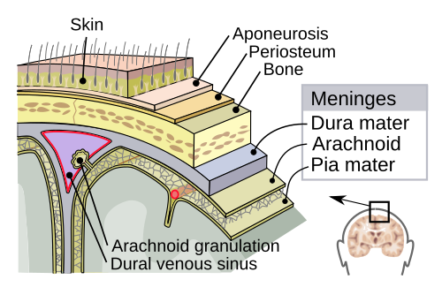

# MENINGITES E ENCEFALITES NO ADULTO: ANTIBIÓTICO EMPÍRICO E JANELA TERAPÊUTICA

Quando falamos de infecções do Sistema Nervoso Central (SNC), o tempo não é apenas dinheiro; o tempo é neurônio e vida. Na prática médica e, principalmente, nas provas de residência, você será testado na sua capacidade de tomar decisões rápidas sob pressão.

O grande desafio aqui não é decorar uma lista de bactérias, mas sim entender a **janela terapêutica**. Se você atrasa o antibiótico para esperar um exame, o paciente morre ou fica com sequelas graves. Se você faz a conduta na ordem errada, a questão (e o tratamento) vai por água abaixo.

*Figura 1 - Diagrama anatômico das camadas meníngeas (dura-máter, aracnoide e pia-máter). Na meningite, a inflamação acomete principalmente as meninges e o espaço subaracnóideo; na encefalite, o parênquima cerebral é afetado. Fonte: Mysid/Jmarchn, CC BY-SA 3.0 | Wikimedia Commons*

## A Diferença Fundamental: Meningite vs. Encefalite

Antes de falarmos de remédio, precisamos saber o que estamos tratando. Muitos alunos confundem, mas a distinção clínica é o que direciona o seu raciocínio inicial.

A **Meningite** é a inflamação das meninges. O parênquima cerebral está, teoricamente, preservado. O paciente tem febre, cefaleia e rigidez de nuca (a tríade clássica), mas ele está "lúcido". Ele pode estar sonolento pela febre, mas não tem déficit focal ou alteração profunda de comportamento.

A **Encefalite** é a inflamação do parênquima. Aqui, o cenário muda. O paciente apresenta **alteração do nível de consciência**, mudanças de personalidade, crises convulsivas focais ou déficits neurológicos.

**Dica de prova:** Se a questão descreve um paciente com febre e cefaleia que começou a falar coisas desconexas ou teve uma crise convulsiva focal, pare de pensar apenas em bactéria e ligue o alerta para **Herpes Simplex (HSV)**. A encefalite herpética é a principal causa de encefalite esporádica no mundo e adora o lobo temporal.

*Figura 2 - Paciente com meningite meningocócica apresentando rigidez de nuca e opistótono. Os sinais meníngeos (Kernig, Brudzinski, rigidez nucal) são fundamentais para a suspeita diagnóstica e indicação de punção lombar. Fonte: L.A. Marty, 1913, Domínio Público | Wikimedia Commons*

## O Fluxograma de Decisão: Onde a Prova te Pega

Imagine o cenário: Paciente de 45 anos, febre, rigidez de nuca e confusão mental leve. Qual o primeiro passo?

Muitos respondem "Punção Lombar (PL)". Cuidado. Existe uma regra de ouro para a segurança do paciente: **TC de Crânio antes da PL em situações específicas.** Por que? Porque se houver uma massa ou edema cerebral importante (efeito de massa), a retirada de líquor na lombar pode causar uma herniação cerebral fatal.

### Quando pedir TC antes da Punção Lombar?

Segundo as diretrizes brasileiras e internacionais (IDSA), você deve solicitar TC antes da PL se o paciente apresentar:

- Déficit neurológico focal (ex: hemiparesia, paralisia de par craniano).

- Crise convulsiva de início recente (menos de 1 semana).

- Papiledema (sinal claro de hipertensão intracraniana).

- Alteração importante do nível de consciência (Glasgow < 12).

- Imunocomprometimento grave (HIV/AIDS, transplantado, uso de quimioterapia).

**Atenção:** Se você decidiu que o paciente precisa de TC, você **NÃO** pode esperar o resultado para tratar. Você colhe hemoculturas e inicia o **antibiótico empírico imediatamente**. A janela terapêutica não espera o radiologista.

## O Líquido Cefalorraquidiano (LCR): O "Raio-X" da Infecção

A análise do líquor é o coração do diagnóstico. As bancas amam colocar uma tabela com valores e pedir a etiologia. Você precisa bater o olho e identificar o padrão.

| Parâmetro | Normal | Bacteriana Aguda | Viral | Tuberculosa / Fúngica |
| --- | --- | --- | --- | --- |
| **Células (leucócitos)** | < 5 | > 1.000 | 10 - 500 | 50 - 500 |
| **Predomínio** | Linfócitos | **Neutrófilos (PMN)** | Linfócitos | Linfócitos / Misto |
| **Glicose** | > 2/3 da glicemia | **Baixa (< 40)** | Normal | **Baixa (< 40)** |
| **Proteína** | < 45 mg/dL | Alta (> 100) | Levemente alta | Muito alta (> 100) |
| **Aspecto** | Límpido/Cristal | Turvo/Purulento | Límpido | Límpido/Xantocrômico |

**Por que a glicose cai na bacteriana e na TB?** Porque as bactérias e os fungos consomem glicose para o seu metabolismo, e a inflamação altera o transporte de glicose através da barreira hematoencefálica. Na viral, o vírus não "come" glicose, por isso ela é normal.

**Erro Comum:** Achar que toda meningite com linfócitos é viral. Lembre-se: **Tuberculose e Fungo (Criptococo) também dão linfocitose, mas com glicose baixa.** A meningite viral mantém a glicose normal. Regra prática: Glicose baixa + Linfócitos = Pense em TB ou Fungo.

## Etiologia e Antibioticoterapia Empírica

No adulto, o grande vilão é o *Streptococcus pneumoniae* (Pneumococo), seguido pela *Neisseria meningitidis* (Meningococo). Em idosos e imunocomprometidos, entra um terceiro elemento perigoso: a *Listeria monocytogenes*.

### O Esquema Empírico no Adulto (18-50 anos)

A recomendação padrão é **Ceftriaxona 2g IV de 12/12h**.

- **Por que Ceftriaxona?** Cobre excelentemente o Meningococo e a maioria dos Pneumococos.

- **E a Vancomicina?** Em regiões com alta resistência de Pneumococo à penicilina (ou se o paciente estiver muito grave), adicionamos Vancomicina para garantir a cobertura do Pneumococo resistente.

### O Esquema no Idoso (> 50 anos) ou Imunocomprometido

Aqui a banca quer saber se você lembra da **Listeria**. A Ceftriaxona **NÃO** cobre Listeria.

- **Conduta:** Ceftriaxona + **Ampicilina** (2g IV de 4/4h).

- A Ampicilina é a droga de escolha para a Listeria, que é um bacilo Gram-positivo.

### A Janela da Dexametasona

Este é o ponto que mais gera dúvidas. Por que usar corticoide em uma infecção?
Quando o antibiótico mata a bactéria, ela sofre lise e libera fragmentos de parede celular. Isso gera uma cascata inflamatória absurda no espaço subaracnóideo, que causa edema e dano neuronal.

**A Regra de Ouro:** A Dexametasona (10mg IV 6/6h por 4 dias) deve ser administrada **20 minutos antes ou junto com a primeira dose do antibiótico**. Se o antibiótico já foi dado há horas, não há benefício comprovado em iniciar o corticoide.

- **Indicação principal:** Suspeita de meningite pneumocócica no adulto. Se o Gram vier com Diplococos Gram-positivos, mantenha. Se vier outra coisa, pode suspender.

## Encefalite Herpética: O Diagnóstico que não pode passar

Se o quadro sugere encefalite (confusão, febre, crise focal), o tratamento empírico deve incluir **Aciclovir 10mg/kg IV de 8/8h**.

O HSV-1 tem predileção pelos lobos temporais. Na prova, procure por:

- Alteração de comportamento/personalidade.

- Crises convulsivas focais.

- Líquor com pleocitose linfocitária e hemácias (o vírus é necrotizante).

- RM de crânio com hipersinal em T2/FLAIR nos lobos temporais.

- **Padrão-ouro diagnóstico:** PCR para HSV no líquor.

## Quimioprofilaxia: Quem deve receber?

A profilaxia não é para o paciente, é para os contatos. Ela só está indicada para dois agentes: **Neisseria meningitidis** e **Haemophilus influenzae tipo b**.

-

**Meningococo:** Indicada para contatos próximos (quem mora na mesma casa, dormitório, ou teve contato com secreções orais).

- Droga de escolha: **Rifampicina 600mg de 12/12h por 2 dias**.

- Alternativas: Ceftriaxona (dose única IM) ou Ciprofloxacino (dose única VO).

-

**Haemophilus:** Hoje é rara devido à vacinação, mas se cair: Rifampicina 600mg 1x ao dia por 4 dias.

**Cuidado:** Não se faz profilaxia para contato de meningite pneumocócica! O Pneumococo está na nossa orofaringe, a doença é invasão, não transmissão direta entre contatos da mesma forma que o meningococo.

## Situações Especiais e Pegadinhas de Prova

### Meningite Tuberculosa (MEC-TB)

O quadro é mais arrastado (subagudo). O paciente tem semanas de cefaleia e emagrecimento. O líquor é clássico: **Glicose muito baixa, Proteína muito alta e Linfócitos.**
Um detalhe que as bancas amam: a MEC-TB frequentemente causa acometimento de pares cranianos (especialmente o VI par) devido ao exsudato inflamatório na base do crânio. O tratamento é o esquema RIPE por 12 meses, associado a corticoide nas primeiras semanas.

### Meningite Fúngica (Criptococose)

Pense em pacientes com HIV/AIDS (CD4 < 100). O sinal clínico clássico é a **hipertensão intracraniana grave**. O diagnóstico é feito pelo Teste do Látex ou Tinta da China (Nanquim) no líquor. O tratamento inicial é com Anfotericina B.

### O Gram no Líquor

Você precisa saber traduzir o Gram para o nome da bactéria:

- **Diplococos Gram-positivos:** *Streptococcus pneumoniae* (Pneumococo).

- **Diplococos Gram-negativos:** *Neisseria meningitidis* (Meningococo).

- **Coccobacilos Gram-negativos:** *Haemophilus influenzae*.

- **Bacilos Gram-positivos:** *Listeria monocytogenes*.

## Tabelas Comparativas para Fixação

### Tabela 1: Antibioticoterapia Empírica por Faixa Etária/Condição

| População | Agentes Prováveis | Esquema Sugerido |
| --- | --- | --- |
| **Adulto 18-50 anos** | Pneumococo, Meningococo | Ceftriaxona (2g 12/12h) +/- Vancomicina |
| **Adulto > 50 anos** | Pneumococo, Meningococo, **Listeria** | Ceftriaxona + **Ampicilina** |
| **Imunocomprometido** | Pneumococo, Listeria, Gram-negativos | Ceftriaxona + Ampicilina + Vancomicina |
| **Pós-neurocirurgia / TCE** | *S. aureus*, *S. epidermidis*, *Pseudomonas* | Vancomicina + Ceftazidima ou Meropenem |

### Tabela 2: Critérios para TC de Crânio antes da Punção Lombar

| Critério | Justificativa |
| --- | --- |
| **Papiledema** | Sinal direto de hipertensão intracraniana. |
| **Déficit Focal** | Sugere lesão expansiva (abscesso, tumor) ou AVC. |
| **Glasgow < 12** | Rebaixamento importante sugere edema ou herniação iminente. |
| **Imunossupressão** | Alto risco para neurotoxoplasmose ou linfoma (massas). |
| **Crise Convulsiva** | Pode indicar lesão focal irritativa. |

### Tabela 3: Quimioprofilaxia para Contatos (Meningococo)

| Droga | Dose (Adulto) | Duração |
| --- | --- | --- |
| **Rifampicina (Escolha)** | 600 mg VO 12/12h | 2 dias (4 doses) |
| **Ciprofloxacino** | 500 mg VO dose única | Dose única |
| **Ceftriaxona** | 250 mg IM dose única | Dose única (opção para gestantes) |

## O "Porquê" das Condutas

Por que a Ceftriaxona é a queridinha? Porque ela tem uma excelente penetração na barreira hematoencefálica inflamada e cobre os principais patógenos da comunidade. No entanto, o Pneumococo tem mostrado resistência crescente às cefalosporinas em algumas regiões, por isso a Vancomicina entra no time "empírico" em protocolos norte-americanos e em casos graves no Brasil.

Por que a Ampicilina no idoso? A *Listeria monocytogenes* tem uma característica bioquímica: ela não possui as proteínas de ligação à penicilina (PBPs) que as cefalosporinas atacam. Portanto, a Ceftriaxona é "água" para a Listeria. Você precisa de uma aminopenicilina (Ampicilina).

Por que o líquor da TB é linfocitário? Diferente da bactéria piogênica, que atrai neutrófilos rapidamente para uma resposta aguda, o *Mycobacterium tuberculosis* induz uma resposta de imunidade celular tardia, mediada por linfócitos T, o que explica o padrão subagudo e o predomínio celular.

## Meningites crônicas e fúngicas: o pedaço que a prova usa para fugir do “ceftriaxona para tudo”

Nem toda neuroinfecção do adulto é bacteriana aguda. Quando o enunciado fala em evolução subaguda ou crônica, imunossupressão, HIV avançado, transplante, uso de corticoide, viagem/exposição geográfica ou líquor linfocitário com glicose baixa, a banca quer que você saia do reflexo “ceftriaxona + vancomicina”.

### Padrão do LCR que deve acender alerta

| Padrão | Pense primeiro |
| --- | --- |
| Linfócitos + proteína muito alta + glicose baixa | Tuberculose ou fungo |
| Pressão de abertura muito elevada + HIV/CD4 baixo | Criptococose |
| História respiratória ou exposição em área endêmica + meningite crônica | Coccidioidomicose, histoplasmose ou tuberculose, conforme epidemiologia |
| Neutrófilos muito altos + início abrupto | Bacteriana aguda, até prova em contrário |
| Linfócitos + glicose normal + quadro mais benigno | Viral, mas sem esquecer HSV se houver encefalite |

### Criptococose: hipertensão intracraniana é tão importante quanto antifúngico

A neurocriptococose aparece muito em HIV avançado, mas também pode ocorrer em transplantados e outros imunossuprimidos. O quadro costuma ser arrastado: cefaleia, febre baixa, náuseas, vômitos, alteração visual ou rebaixamento progressivo. Rigidez de nuca pode faltar.

**Diagnóstico:** pressão de abertura elevada, tinta da China com leveduras capsuladas quando positiva, antígeno criptocócico no líquor/soro e cultura. Em prova, “HIV com CD4 muito baixo + cefaleia subaguda + pressão de abertura alta” quase grita criptococo.

**Tratamento em linhas gerais:** indução com anfotericina B associada a flucitosina quando disponível; consolidação e manutenção com fluconazol. O detalhe que derruba alternativa é que a hipertensão intracraniana precisa de punções de alívio seriadas quando há pressão elevada/sintomas. Corticoide e manitol não resolvem a fisiopatologia principal.

**TARV:** em meningite criptocócica associada ao HIV, iniciar antirretroviral imediatamente pode aumentar risco de SIRI grave no SNC. A prova costuma cobrar atraso planejado da TARV após início do antifúngico, com tempo definido pelo protocolo e gravidade.

### Coccidioidomicose: meningite crônica por fungo de contexto geográfico

Coccidioidomicose é mais lembrada em áreas áridas das Américas, especialmente sudoeste dos EUA e partes da América Latina. No Brasil é menos comum, mas pode aparecer em prova por epidemiologia/exposição. A forma meníngea é crônica, com cefaleia persistente, náuseas, hidrocefalia, pares cranianos e líquor de baixa glicose/proteína alta.

**Conduta de prova:** tratamento prolongado com azólico, principalmente fluconazol em dose alta, e acompanhamento por especialista. A recorrência após suspensão é frequente; por isso, muitas diretrizes recomendam terapia supressiva prolongada, frequentemente por tempo indefinido. Anfotericina B fica para falha, intolerância ou doença grave selecionada.

### Tuberculose meníngea: pensar cedo muda prognóstico

A meningite tuberculosa é subaguda, com febre, cefaleia, alteração do comportamento, pares cranianos e, às vezes, sinais de vasculite/AVC. O LCR costuma ter linfócitos, proteína alta e glicose baixa. O tratamento é esquema antituberculose prolongado e corticoide adjuvante em muitos casos, conforme protocolo.

**Pegadinha:** glicose baixa com linfócitos não é viral. Se a alternativa disser “viral porque é linfocitária”, confira glicose, proteína, tempo de evolução e imunossupressão.

### Como decidir na questão

- **Horas a poucos dias + toxemia:** bacteriana aguda.

- **Alteração comportamental, convulsão focal ou lobo temporal:** encefalite por HSV até prova em contrário.

- **Semanas + LCR linfocitário hipoglicorráquico:** TB/fungo.

- **HIV avançado + pressão de abertura alta:** criptococo.

- **Exposição geográfica compatível + meningite crônica:** coccidioidomicose e outros fungos endêmicos entram no diferencial.

## Pontos-Chave para Prova

- **A Tríade Clássica:** Febre, cefaleia e rigidez de nuca está presente em menos de 50% dos casos. A ausência dos três quase exclui meningite, mas a presença de apenas um ou dois já obriga a investigação.

- **Sinal de Kernig e Brudzinski:** São clássicos, mas têm baixa sensibilidade. Se estiverem presentes, ajudam muito; se estiverem ausentes, não excluem nada.

- **Dexametasona:** Sempre ANTES ou JUNTO com o antibiótico. Nunca depois de horas. O objetivo é reduzir a surdez e sequelas neurológicas no Pneumococo.

- **Listeria:** Pensou em idoso, alcoólatra ou transplantado com meningite? Adicione Ampicilina. O Gram mostrará bacilos Gram-positivos.

- **Encefalite Herpética:** Alteração de comportamento + Febre + Lesão temporal na RM = Aciclovir IV. Não espere o PCR para começar.

- **TC antes da PL:** Não é para todo mundo! Só se houver sinais de alarme (focalidade, papiledema, coma, imunossupressão).

- **Janela Terapêutica:** Se a TC for atrasar a PL, colha sangue para cultura e faça o ATB + Corticoide imediatamente.

- **LCR da Viral:** Pleocitose linfocitária com **glicose normal**. Se a glicose estiver baixa, mude o raciocínio para TB, Fungo ou Bactéria.

- **Meningococcemia:** Pode ocorrer sem meningite. O paciente choca rápido e tem petéquias/púrpura (síndrome de Waterhouse-Friderichsen - necrose de suprarrenais).

- **Profilaxia:** Apenas para Meningococo e Haemophilus. Rifampicina é a droga padrão. Contatos casuais (escola, trabalho) geralmente não precisam, apenas contatos íntimos/domiciliares.

- **Contraindicação Absoluta de PL:** Infecção no local da punção ou sinais clínicos de herniação cerebral iminente.

- **Valores de Referência:** Glicorraquia < 40 mg/dL e Proteinorraquia > 100 mg/dL no líquor são fortes preditores de meningite bacteriana.

- **O que NÃO fazer:** Não atrase o antibiótico para levar o paciente para a sala de tomografia se ele estiver instável. Trate antes.

- **Pegadinha de Prova:** A alternativa dirá que a TC é obrigatória para todos os pacientes antes da PL. **Falso.** Isso atrasa o tratamento desnecessariamente em pacientes jovens e sem sinais de alarme.

- **Isolamento:** Paciente com suspeita de meningite meningocócica deve ficar em isolamento de gotículas por 24 horas após o início do antibiótico eficaz.

Lembre-se: em neuroinfecção, a sua agilidade define o prognóstico do paciente. Em neuroinfecção, o diagnóstico é clínico, o líquor confirma, mas o tratamento é para ontem.

 Cópia offline para consulta pessoal.
 Fonte original:
 [https://www.medevo.com.br/material-apoio/ler/d24f17e3-3626-49f0-b2ed-9ddb82b49ddd](https://www.medevo.com.br/material-apoio/ler/d24f17e3-3626-49f0-b2ed-9ddb82b49ddd)
