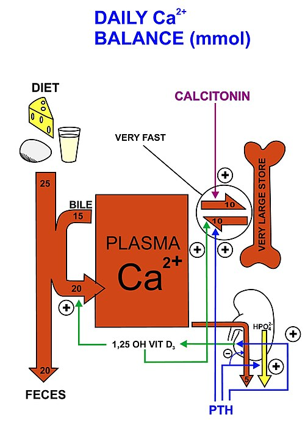
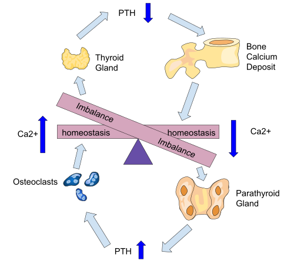

# METABOLISMO ÓSSEO E MINERAL

Para entender o metabolismo ósseo, você precisa parar de ver o esqueleto como uma estrutura morta de sustentação. O osso é um órgão dinâmico, um verdadeiro "banco de reserva" de minerais que o corpo saca e deposita a todo momento. Nas provas de residência, o examinador não quer apenas que você saiba valores; ele quer que você entenda quem manda no banco (hormônios) e o que acontece quando o gerente (paratireoide) enlouquece.

*Figura 1 - Diagrama do metabolismo do cálcio demonstrando o fluxo entre os compartimentos corporais (osso, intestino, rim) e a regulação hormonal pelo PTH, calcitonina e vitamina D. Fonte: Cruithne9, CC BY-SA 4.0 | Wikimedia Commons*

## O Trio de Ferro: Cálcio, Fósforo e Magnésio

O cálcio sérico que dosamos no sangue representa apenas 1% do cálcio total do corpo. O restante está guardado na forma de cristais de hidroxiapatita no osso. No sangue, o cálcio circula de duas formas: ligado à albumina (cerca de 40-45%) e na forma livre ou iônica (50%).

Aqui mora a primeira pegadinha de prova: se a albumina do paciente está baixa (comum em cirróticos ou desnutridos), o cálcio total virá baixo, mas o cálcio iônico (que é o que realmente importa para as células) pode estar normal. Por isso, sempre que vir um cálcio baixo com albumina baixa, você deve aplicar a fórmula de correção:
**Cálcio Corrigido = Cálcio medido + [0,8 x (4,0 - Albumina)].**

O fósforo é o parceiro inseparável do cálcio na estrutura óssea, mas no sangue eles costumam ter uma relação inversa por influência do PTH. Já o magnésio é o "ajudante silencioso". Ele é um cofator essencial para mais de 300 enzimas. Sem magnésio, a paratireoide não consegue secretar PTH e o receptor de PTH nos tecidos não funciona. É por isso que uma hipomagnesemia grave causa hipocalcemia refratária; você pode dar o cálcio que quiser, se não repuser o magnésio, o cálcio não sobe.

## Os Regentes: PTH e Vitamina D

O Paratormônio (PTH) é o hormônio da emergência. O sensor de cálcio nas paratireoides detecta qualquer queda mínima e libera PTH imediatamente. O objetivo do PTH é um só: aumentar o cálcio sérico. Ele faz isso de três formas:

- **No osso:** Estimula a reabsorção óssea (tira cálcio do banco).

- **No rim:** Aumenta a reabsorção de cálcio e, crucialmente, **elimina fósforo** (fosfatúria). Lembre-se: PTH é fosfatúrico.

- **No rim (indiretamente):** Estimula a enzima 1-alfa-hidroxilase, que transforma a Vitamina D inativa (25-OH-D) na forma ativa (1,25-OH2-D ou Calcitriol).

A Vitamina D, por sua vez, é o hormônio da manutenção. Sua principal função é garantir que o cálcio e o fósforo da dieta entrem no corpo através da absorção intestinal. Sem vitamina D, você pode comer quilos de queijo e o cálcio sairá nas fezes.

## Hipercalcemia: O Diagnóstico Diferencial

Quando você se depara com um cálcio alto na prova, o primeiro passo é olhar o PTH. Isso divide o mundo em dois:

### Hipercalcemia PTH-dependente (PTH alto ou "inadequadamente normal")

A causa número um no ambiente ambulatorial é o **Hiperparatireoidismo Primário (HPP)**. Geralmente é causado por um adenoma único em uma das quatro paratireoides. O corpo perde o controle, o PTH sobe, o cálcio sobe e o fósforo cai.

Um cenário clássico de prova: paciente com hipercalcemia leve, assintomática, descoberta em exames de rotina. Se o PTH estiver alto, o diagnóstico é HPP. Mas cuidado! Existe uma condição genética chamada **Hipercalcemia Hipocalciúrica Familiar (HHF)**. Nela, o sensor de cálcio do corpo é "desregulado" para cima. O paciente tem cálcio alto e PTH alto, mas o rim economiza cálcio obsessivamente.
**Como diferenciar?** Dose o cálcio na urina de 24h. No HPP, o cálcio urinário é alto (hipercalciúria). Na HHF, o cálcio urinário é muito baixo (fração de excreção de cálcio < 0,01). Guarde isso: HHF não opera!

### Hipercalcemia PTH-independente (PTH suprimido)

Se o cálcio está alto e o PTH está baixo, o problema não é a paratireoide. A causa número um em pacientes internados é a **Malignidade**. O câncer pode aumentar o cálcio por metástases ósseas diretas ou pela produção de uma proteína chamada PTHrP (proteína relacionada ao PTH), comum em carcinomas de células escamosas (pulmão, esôfago).

Outra causa importante são as **Doenças Granulomatosas (Sarcoidose, Tuberculose)**. Nelas, os macrófagos do granuloma possuem a enzima 1-alfa-hidroxilase e produzem Vitamina D ativa de forma descontrolada, independente do rim. O resultado é hipercalcemia com PTH suprimido e fósforo alto (pela absorção intestinal aumentada).

*Figura 2 - Esquema do feedback negativo do PTH: quando o cálcio está baixo, a paratireoide libera PTH que estimula osteoclastos a reabsorver osso; quando o cálcio está alto, a tireoide libera calcitonina que inibe a reabsorção. Fonte: Mkaram19, CC BY-SA 4.0 | Wikimedia Commons*

## Quadro Clínico e Tratamento da Hipercalcemia

Os sintomas são clássicos: "Bones, Stones, Abdominal Groans, and Psychic Moans" (Ossos, pedras nos rins, dores abdominais/constipação e alterações psiquiátricas/sonolência). No ECG, procure pelo **encurtamento do intervalo QT** e bradicardia.

O tratamento da crise hipercalcêmica (geralmente cálcio > 12-14 mg/dL) segue uma hierarquia rígida:

- **Hidratação Vigorosa (SF 0,9%):** É a conduta inicial mais importante. O sódio compete com o cálcio no rim, aumentando a excreção de cálcio.

- **Diuréticos de Alça (Furosemida):** Use apenas APÓS a volemia estar restaurada, para ajudar na calciúria. Nunca use tiazídicos (eles aumentam o cálcio!).

- **Bisfosfonatos (Ácido Zoledrônico ou Pamidronato):** Inibem os osteoclastos. Demoram 24-48h para agir, mas o efeito é duradouro.

- **Calcitonina:** Age rápido, mas tem efeito curto (taquifilaxia). Útil nas primeiras horas enquanto o bisfosfonato não age.

## Hiperparatireoidismo Primário Assintomático: Quando Operar?

Esta é a questão favorita das bancas. Se o paciente tem HPP mas não tem sintomas (sem pedras nos rins, sem fraturas), ele só opera se preencher UM dos critérios abaixo (Diretriz Brasileira/Internacional):

- Cálcio sérico > 1,0 mg/dL acima do limite superior da normalidade.

- Clareamento de Creatinina < 60 ml/min.

- Densitometria óssea (DMO) com T-score ≤ -2,5 em qualquer sítio (coluna, fêmur ou rádio 33%) ou fratura vertebral prévia.

- Idade < 50 anos (o jovem vai ter complicações no futuro, então opera logo).

- Calciúria de 24h > 400 mg/dia com risco aumentado de litíase.

Para localizar a glândula doente antes da cirurgia, o melhor exame é a **Cintilografia com Sestamibi-Tc99m**.

## Hipocalcemia: O Corpo em Curto-Circuito

A hipocalcemia aumenta a excitabilidade neuromuscular. O paciente sente parestesias periorais, cãibras e, em casos graves, laringoespasmo e convulsões. No ECG, o sinal clássico é o **prolongamento do intervalo QT**.

Os sinais semiológicos que você deve conhecer:

- **Sinal de Chvostek:** Percussão do nervo facial resulta em contração da musculatura facial ipsilateral.

- **Sinal de Trousseau:** Insuflação do manguito de pressão acima da PAS por 3 minutos causa carpopasmo (mão de parteiro). É mais sensível e específico que o Chvostek.

A causa mais comum de hipoparatireoidismo é a **cirurgia cervical (tireoidectomia ou paratireoidectomia)**. Pode ser transitório (por isquemia das glândulas) ou definitivo. No laboratório, teremos Cálcio baixo, Fósforo alto e PTH baixo.

**Tratamento da Emergência:** Se houver sintomas graves ou QT longo, use Gluconato de Cálcio 10% IV. Se for crônico e leve, reposição oral de Cálcio e Vitamina D ativa (Calcitriol), já que sem PTH o rim não ativa a vitamina D.

## Osteoporose: A Epidemia Silenciosa

A osteoporose é definida pela perda de massa óssea e deterioração da microarquitetura, levando ao aumento do risco de fraturas. É assintomática até que a primeira fratura ocorra (geralmente vértebra, fêmur ou rádio distal - fratura de Colles).

### Diagnóstico por Densitometria Óssea (DMO)

A DMO é o padrão-ouro. Segundo a OMS e a ABRASSO, usamos dois escores:

- **T-score:** Compara o paciente com um adulto jovem do mesmo sexo. Usado para mulheres pós-menopausa e homens > 50 anos.

- Normal: até -1,0 DP.

- Osteopenia: entre -1,1 e -2,4 DP.

- Osteoporose: ≤ -2,5 DP.

- Osteoporose Estabelecida: ≤ -2,5 DP + fratura por fragilidade.

- **Z-score:** Compara o paciente com pessoas da mesma idade e sexo. Usado para crianças, jovens e mulheres pré-menopausa. Se ≤ -2,0, dizemos que a massa óssea está "abaixo do esperado para a idade".

**Quem deve fazer DMO?**

- Mulheres ≥ 65 anos e homens ≥ 70 anos.

- Mulheres na pós-menopausa < 65 anos com fatores de risco (tabagismo, baixo peso, uso de corticoide, história familiar de fratura de fêmur).

- Adultos com fratura por fragilidade.

- Adultos com doenças ou medicações associadas à perda óssea.

### Fatores de Risco e Investigação Secundária

Não cometa o erro de achar que toda osteoporose é "da idade". Em homens e mulheres jovens, pesquise causas secundárias: Hipercortisolismo (Cushing), Hiperparatireoidismo, Doença Celíaca (má absorção de cálcio), Mieloma Múltiplo e uso de drogas como Fenitoína, Heparina e Inibidores da Bomba de Prótons (IBP).

O Dr. Will sempre lembra seus alunos: a raça negra é um fator PROTETOR para osteoporose devido à maior densidade mineral óssea basal. Os maiores riscos estão em mulheres brancas, magras e fumantes.

### Tratamento da Osteoporose

O objetivo não é "melhorar o exame", é **prevenir fraturas**.

-

**Medidas Não-Farmacológicas:**

- Cálcio na dieta: Meta de 1000-1200 mg/dia. Se não atingir na dieta, suplementar.

- Vitamina D: Manter níveis séricos acima de 30 ng/mL em pacientes de risco.

- Atividade física: Exercícios de impacto (caminhada) e resistência (musculação) são fundamentais.

- Cessar tabagismo e etilismo.

- Prevenção de quedas (retirar tapetes, melhorar iluminação).

-

**Tratamento Farmacológico:**

- **Bisfosfonatos (Alendronato, Risedronato, Ácido Zoledrônico):** Primeira escolha. Eles "grudam" no osso e matam os osteoclastos que tentam reabsorvê-lo.

- *Instrução crucial:* O Alendronato deve ser tomado em jejum, apenas com água, e o paciente deve ficar em pé ou sentado por 30-60 minutos para evitar esofagite grave.

- *Efeitos colaterais raros:* Osteonecrose de mandíbula e fraturas atípicas de fêmur (após uso muito prolongado > 5-10 anos).

- **Denosumabe:** Anticorpo monoclonal contra o RANKL (impede a formação do osteoclasto). Ótimo para quem tem disfunção renal, onde bisfosfonatos são contraindicados (ClCr < 30-35).

- **Teriparatida:** PTH recombinante. É um agente anabólico (forma osso). Reservado para casos graves ou falha terapêutica.

- **Raloxifeno:** Modulador seletivo do receptor de estrogênio. Bom para osteoporose de coluna em mulheres com risco de câncer de mama, mas não previne fratura de quadril e aumenta risco de trombose.

## Doença de Paget e Osteomalácia: Não Confunda!

A **Doença de Paget** é uma desorganização da remodelação óssea. O osso é reabsorvido e reposto de forma caótica, resultando em um osso maior, porém mais fraco e deformado.

- **Laboratório Típico:** Fosfatase Alcalina (FA) muito elevada com Cálcio e Fósforo NORMAIS.

- **Clínica:** Aumento do perímetro cefálico, surdez (compressão do nervo auditivo), dor óssea.

- **Tratamento:** Bisfosfonatos (Ácido Zoledrônico é o preferido).

A **Osteomalácia** (ou Raquitismo em crianças) é um defeito na mineralização da matriz óssea, geralmente por deficiência grave de Vitamina D. O osso fica "mole".

- **Laboratório:** Cálcio baixo/normal, Fósforo baixo, FA elevada e Vitamina D (25-OH) muito baixa.

- **RX:** Pseudofraturas (Linhas de Looser). No raquitismo, vemos o alargamento da linha epifisária e o "rosário raquítico".

## Osteodistrofia Renal: O Osso na IRC

Na Insuficiência Renal Crônica, o rim não consegue eliminar fósforo nem ativar a vitamina D. O fósforo alto "sequestra" o cálcio, e a falta de vitamina D ativa diminui a absorção de cálcio. O resultado? Hipocalcemia. A paratireoide reage a isso aumentando o PTH desesperadamente. Isso é o **Hiperparatireoidismo Secundário**.

Se não tratado, as glândulas paratireoides podem se tornar autônomas, mantendo o PTH altíssimo mesmo se o cálcio subir (Hiperparatireoidismo Terciário). O tratamento envolve quelantes de fósforo (como o Sevelamer) e o uso de Calcitriol ou calcimiméticos (Cinacalcet).

## Tabelas Comparativas para Fixação

### Tabela 1: Diagnóstico Diferencial das Alterações Laboratoriais

| Patologia | Cálcio | Fósforo | PTH | Fosfatase Alcalina |
| --- | --- | --- | --- | --- |
| HPP | Alto | Baixo | Alto | Normal/Alto |
| Malignidade (PTHrP) | Alto | Baixo | Baixo | Variável |
| Hipoparatireoidismo | Baixo | Alto | Baixo | Normal |
| Deficiência Vit. D | Baixo/Normal | Baixo | Alto | Alto |
| Doença de Paget | Normal | Normal | Normal | Muito Alta |
| Insuf. Renal (2º) | Baixo | Alto | Alto | Alto |

### Tabela 2: Indicações de Cirurgia no HPP Assintomático (Consenso Atual)

| Critério | Valor de Corte |
| --- | --- |
| Cálcio Sérico | > 1,0 mg/dL acima do limite |
| Idade | < 50 anos |
| Função Renal | ClCr < 60 mL/min |
| Densitometria | T-score ≤ -2,5 ou fratura prévia |
| Calciúria | > 400 mg/24h + risco de nefrolitíase |

### Tabela 3: Classes de Medicamentos para Osteoporose

| Medicamento | Mecanismo | Principal Indicação | Cuidado/Contraindicação |
| --- | --- | --- | --- |
| Alendronato | Antirreabsortivo | 1ª escolha geral | Esofagite / ClCr < 35 |
| Ácido Zoledrônico | Antirreabsortivo (IV) | Intolerância oral | Reação de fase aguda (gripe) |
| Denosumabe | Inibidor RANKL (SC) | Renal crônico | Não interromper abruptamente |
| Teriparatida | Anabólico (PTH) | Osteoporose grave | Risco de Osteossarcoma (teórico) |

## Pontos-Chave para Prova 💡

- **Cálcio Corrigido:** Sempre corrija pela albumina antes de dizer que é hipocalcemia.

- **HPP vs HHF:** O divisor de águas é a calciúria de 24h (baixa na HHF, alta no HPP).

- **Tratamento Hipercalcemia:** Hidratação com SF 0,9% é sempre o primeiro passo. Esqueça diuréticos se o paciente estiver desidratado.

- **Tiazídicos:** Retêm cálcio no corpo. Podem ser usados para tratar hipercalciúria idiopática, mas podem "desmascarar" um HPP leve.

- **Bisfosfonatos e Cirurgia:** Suspenda bisfosfonatos se houver procedimentos odontológicos invasivos pelo risco de osteonecrose de mandíbula (embora o risco absoluto seja baixo).

- **Vitamina D:** A forma que dosamos para ver estoque é a 25-OH-Vitamina D. A forma ativa (1,25-OH) só é dosada em doenças granulomatosas ou insuficiência renal.

- **Magnésio:** Se o cálcio não sobe com reposição, a culpa é do magnésio baixo.

- **Osteoporose em Homens:** Sempre investigar causas secundárias (hipogonadismo é comum).

- **Fratura por Fragilidade:** Se o paciente caiu da própria altura e quebrou o fêmur, o diagnóstico é Osteoporose, independente do valor da densitometria.

- **Marcadores de Remodelação (CTx, P1NP):** Não servem para diagnóstico, mas podem ser usados para monitorar a adesão ao tratamento precocemente (antes da DMO mudar).

- **Z-score vs T-score:** T-score para quem já passou da menopausa/andropausa. Z-score para os jovens.

- **Sarcoidose:** Causa hipercalcemia por produção ectópica de 1,25-OH-Vit D pelos granulomas. O PTH estará suprimido.

- **Contraindicação Absoluta Bisfosfonatos:** Insuficiência renal grave (ClCr < 30-35) e doenças do esôfago que impeçam o esvaziamento (para orais).

- **O que NÃO fazer:** Não use reposição de cálcio isolada para tratar osteoporose; ela é apenas um adjuvante aos bisfosfonatos. Não peça Sestamibi para diagnosticar HPP, peça para localizar a glândula após o diagnóstico bioquímico estar pronto.

O MedEvo reforça que o domínio desses padrões laboratoriais é o que garante 80% das questões deste tema. O examinador ama trocar "fósforo alto" por "fósforo baixo" para te confundir entre HPP e Malignidade. Se o PTH está alto, o fósforo tende a estar baixo (pela fosfatúria). Se o PTH está baixo e o cálcio alto, o fósforo tende a estar alto ou normal. Entenda essa lógica e você não precisará decorar tabelas infinitas.

 Cópia offline para consulta pessoal.
 Fonte original:
 [https://www.medevo.com.br/material-apoio/ler/920e1a2c-a5c4-4a2b-b2b7-0a610ec64b7f](https://www.medevo.com.br/material-apoio/ler/920e1a2c-a5c4-4a2b-b2b7-0a610ec64b7f)
