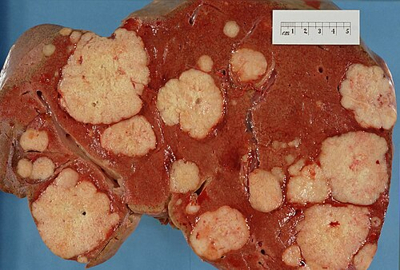
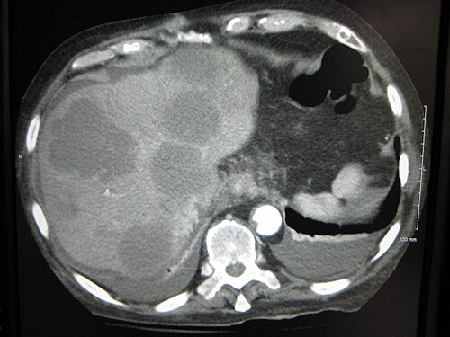

# METÁSTASES HEPÁTICAS

O fígado é o "filtro" do sistema portal. Por isso, ele é o sítio mais comum de metástases de tumores do trato gastrointestinal (TGI). Para a sua prova de residência, o tema não é apenas sobre "ter uma lesão no fígado", mas sim sobre **estratégia terapêutica**. O examinador quer saber se você sabe quem operar, quando operar e como preparar esse fígado para a cirurgia.

*Figura 1 - Corte transversal de fígado em exame de autópsia demonstrando múltiplos depósitos tumorais secundários (metástases) com aspecto nodular pálido no parênquima hepático. Fonte: Haymanj, Domínio Público | Wikimedia Commons*

## Anatomia Cirúrgica e Segmentação de Couinaud

Antes de falarmos de metástase, você precisa dominar a "geografia" do fígado. Se você não souber onde a lesão está, você não sabe qual cirurgia indicar. A classificação de Couinaud divide o fígado em 8 segmentos funcionais, cada um com seu próprio suprimento vascular (pedículo portal) e drenagem biliar.

### A Divisão Funcional

O fígado é dividido em fígado direito e esquerdo pela **Linha de Cantlie** (uma linha imaginária que vai da veia cava inferior até a fossa da vesícula biliar).

- **Lobo Esquerdo:** Segmentos II, III e IV.

- **Lobo Direito:** Segmentos V, VI, VII e VIII.

- **Lobo Caudado (Segmento I):** É o "rebelde". Ele recebe sangue tanto do lado direito quanto do esquerdo e drena diretamente para a veia cava.

**Dica de Prova:** Uma questão clássica descreve uma lesão no lobo esquerdo, à direita do ligamento falciforme e adjacente à vesícula biliar. Onde ela está? No **Segmento 4b** (o segmento quadrado inferior). Se a lesão estiver restrita aos segmentos II e III, a cirurgia de escolha é a **setorectomia lateral esquerda** (ou hepatectomia lateral esquerda).

### Nomenclatura das Ressecções

As bancas adoram confundir os nomes das grandes ressecções. Guarde estas definições:

- **Hepatectomia Direita:** Retira os segmentos V, VI, VII e VIII.

- **Hepatectomia Esquerda:** Retira os segmentos II, III e IV (o I pode ou não ser incluído).

- **Trissetorectomia Direita (Hepatectomia Direita Estendida):** Retira os segmentos IV, V, VI, VII, VIII e, às vezes, o I.

- **Trissetorectomia Esquerda (Hepatectomia Esquerda Estendida):** Retira os segmentos II, III, IV, V e VIII. Note que você "avança" sobre o setor anterior do lado direito.

| Ressecção | Segmentos Retirados |
| --- | --- |
| Setorectomia Lateral Esquerda | II e III |
| Hepatectomia Direita | V, VI, VII, VIII |
| Hepatectomia Esquerda | II, III, IV |
| Trissetorectomia Esquerda | I, II, III, IV, V, VIII |

## Metástases Hepáticas Colorretais (CRLM)

Este é o "carro-chefe" das provas. O câncer colorretal (CCR) é a indicação mais comum de hepatectomia por metástase. Por quê? Porque, diferente de outros tumores, a metástase hepática do CCR ainda pode ser curada com cirurgia.

### O Conceito de Ressecabilidade

Antigamente, dizíamos que "mais de 4 metástases" ou "metástases em ambos os lobos" eram contraindicações. **Esqueça isso.**

Hoje, o critério de ressecabilidade não é o que você tira, mas o que você **deixa**. Para operar, precisamos garantir:

- **Ressecção R0:** Conseguir margens livres (mesmo que exíguas, a margem R0 é o objetivo).

- **Remanescente Hepático Funcional (RHF):** O paciente precisa ficar com pelo menos 20-30% de parênquima saudável (em fígados normais) ou 40% se o fígado for cirrótico ou "sofrido" pela quimioterapia.

- **Preservação Vascular:** Manter pelo menos duas veias hepáticas e um pedículo portal preservados.

### Síncronas vs. Metacrônicas

- **Síncronas:** Detectadas ao mesmo tempo que o tumor primário (ou até 12 meses depois). Indicam uma biologia tumoral mais agressiva.

- **Metacrônicas:** Surgem após 12 meses do tratamento do primário. Têm **melhor prognóstico**.

**Exemplo Clínico:** Paciente de 60 anos com tumor de cólon sigmoide e metástase única em segmento VI. Se o paciente estiver estável, a tendência moderna é a abordagem multidisciplinar. Pode-se fazer a cirurgia síncrona (colectomia + hepatectomia) se a complexidade não for extrema, ou o "Liver-First" (opera o fígado antes do cólon) se a carga metastática for a maior ameaça.

## Estratégias para Aumentar o Remanescente Hepático

E se o paciente tem metástases bilaterais e, ao tirar tudo, o que sobra de fígado é insuficiente (menos de 30%)? Não desistimos dele. Usamos a capacidade regenerativa do fígado.

### 1. Embolização ou Ligadura da Veia Porta

Nós "fechamos" a veia porta do lado que será retirado. O sangue é desviado para o lado que vai ficar (o futuro remanescente). Isso induz **hipertrofia hepática** no lado saudável em 4 a 6 semanas. Só então operamos.

### 2. ALPPS (Associating Liver Partition and Portal vein ligation for Staged hepatectomy)

É uma técnica em dois tempos. No primeiro, fazemos a ligadura da veia porta E a transecção do parênquima (separando os dois lados), mas deixamos o lado doente lá, nutrido pela artéria. Isso gera uma hipertrofia muito mais rápida (1-2 semanas). É uma cirurgia de alta morbidade, reservada para casos selecionados.

### 3. Quimioterapia de Conversão

Cuidado para não confundir com quimioterapia neoadjuvante.

- **Neoadjuvante:** O tumor é ressecável, mas fazemos QT para "testar" a biologia ou facilitar a cirurgia.

- **Conversão:** O tumor é **irressecável** no momento, e a QT é feita para reduzir o tamanho e torná-lo operável. O tumor de cólon é o que melhor responde a essa estratégia.

*Figura 2 - Tomografia computadorizada de abdome demonstrando múltiplas metástases hepáticas hipodensas. A TC com contraste é fundamental para avaliação do número, tamanho e localização das lesões. Fonte: James Heilman, MD, CC BY-SA 3.0 | Wikimedia Commons*

## Diagnóstico e Acompanhamento

O padrão-ouro para estadiamento e detecção de metástases hepáticas colorretais é o **PET-CT** associado à RM com contraste hepatoespecífico (Primovist). O PET-CT é superior à TC convencional porque detecta doença extra-hepática oculta, o que mudaria completamente a conduta (se houver metástase óssea ou cerebral, a hepatectomia perde o sentido curativo).

**Dica do Dr. Will:** Em provas, se perguntarem qual o melhor exame para avaliar resposta à quimioterapia ou excluir doença extra-abdominal antes de uma cirurgia de grande porte, pense no PET-CT.

*Figura 2 - Tomografia computadorizada de abdome demonstrando múltiplas metástases hepáticas hipodensas. A TC com contraste é fundamental para avaliação do número, tamanho e localização das lesões. Fonte: James Heilman, MD, CC BY-SA 3.0 | Wikimedia Commons*

## Diagnóstico Diferencial: As Lesões Hepáticas Benignas

As bancas amam colocar um nódulo hepático em uma mulher jovem para ver se você sabe diferenciar metástase de lesões benignas.

| Lesão | Perfil Típico | Conduta | Característica Marcante |
| --- | --- | --- | --- |
| **Hemangioma** | Mulher, assintomática | Expectante | Lesão benigna mais comum; realce periférico "em pipoca". |
| **Hiperplasia Nodular Focal (HNF)** | Mulher jovem | Expectante | Cicatriz central estrelada; não maligniza. |
| **Adenoma Hepático** | Mulher, uso de ACO | Cirúrgica se > 5cm | **Risco de ruptura (hemoperitônio)** e malignização. |
| **Metástase** | Idoso, perda de peso | Cirurgia/QT | História de tumor primário; nódulos múltiplos. |

**Erro Clássico:** Achar que todo adenoma deve ser operado de urgência. Se o adenoma rompeu e o paciente está instável, você estabiliza e pode tentar embolização. A ressecção definitiva é preferencialmente eletiva após a estabilização do quadro agudo. Se for um adenoma > 5cm ou em homem, a cirurgia é indicada pelo risco de transformação maligna.

## Outras Metástases e Condições Especiais

### Metástases de Outros Sítios

- **Neuroendócrinos:** Frequentemente ressecáveis para controle de sintomas (mesmo que não seja R0, a citorredução ajuda).

- **Sarcomas:** Metástases pulmonares de sarcoma devem ser ressecadas (toracotomia) se forem as únicas lesões, pois isso melhora muito a sobrevida.

- **Melanoma:** Tem um tropismo bizarro pelo **cérebro**. Em necropsias, é o tumor que mais frequentemente causa metástase cerebral.

- **Mama e Próstata:** São os "reis" das metástases ósseas, especialmente para a **coluna vertebral**.

### Pseudomixoma Peritoneal

Imagine um paciente com ascite, mas quando você punciona, vem um material gelatinoso ("ascite mucoide"). Isso é o Pseudomixoma Peritoneal.

- **Origem:** Quase sempre o **apêndice cecal** (neoplasia mucinosa).

- **Tratamento:** Cirurgia de citorredução máxima + HIPEC (quimioterapia intraperitoneal hipertérmica).

### Carcinomatose Peritoneal

A disseminação transcelômica é comum no câncer de ovário e no CCR. Se o paciente for um **idoso frágil**, com demência e sinais de carcinomatose, a prova quer que você seja médico, não apenas técnico: a conduta é **cuidados paliativos e qualidade de vida**, evitando cirurgias mutilantes sem benefício.

## Terapias Ablativas e Suporte Intraoperatório

Nem toda metástase precisa de bisturi. A **Radiofrequência (RFA)** ou Micro-ondas são opções para:

- Pacientes sem condições cirúrgicas.

- Lesões pequenas (< 3cm) e profundas.

- Recidivas após hepatectomias prévias.

**No intraoperatório:** O uso do **Ultrassom Intraoperatório** é fundamental. Ele identifica lesões que a TC de fora não viu e ajuda a guiar a margem de segurança. Se o sangramento for intenso, o cirurgião faz a **Manobra de Pringle** (clampeamento do ligamento hepatoduodenal, comprimindo a artéria hepática e a veia porta).

## Prognóstico e Sobrevida

A ressecção R0 é o único tratamento com potencial curativo para CRLM, com sobrevida em 5 anos chegando a 40-50%.
**Fatores de Pior Prognóstico:**

- Tumor primário de TGI superior (estômago/esôfago) - metástases hepáticas aqui raramente têm indicação cirúrgica curativa.

- Doença linfonodal retroperitoneal.

- Intervalo curto entre o primário e a metástase (< 12 meses).

- CEA muito elevado (> 200 ng/ml).

- Presença de carcinomatose peritoneal.

Como ensinamos no MedEvo, o segredo é entender que a oncologia moderna é sobre **biologia tumoral**. Se o tumor responde à quimioterapia (quimiossensibilidade), o prognóstico melhora drasticamente, permitindo até ressecções de metástases pulmonares e hepáticas simultâneas.

## Pontos-Chave para Prova 🎯

- **Indicação de Ouro:** Metástase hepática única de câncer colorretal é a indicação mais comum e clássica para hepatectomia curativa.

- **Margens:** O objetivo é R0. Margens R1 (microscopiacamente positivas) têm pior prognóstico, mas ainda são melhores que não operar.

- **Adenoma Hepático:** Mulher jovem + anticoncepcional + dor súbita/choque = **Adenoma Roto**. Conduta: estabilizar e ressecção eletiva.

- **Hemangioma:** É a lesão benigna mais comum. Se assintomático, **não mexe**, apenas observa com imagem.

- **Pseudomixoma Peritoneal:** "Ascite gelatinosa". Origem no apêndice. Tratamento é citorredução + HIPEC.

- **Remanescente Hepático:** Mínimo de 20-30% em fígados sadios. Se for insuficiente, fazer embolização da veia porta pré-op.

- **Segmento 4b:** Localizado à direita do ligamento falciforme, perto da vesícula.

- **PET-CT:** Exame de escolha para excluir doença extra-hepática antes de cirurgias curativas complexas.

- **Manobra de Pringle:** Clampeamento do pedículo hepático para controle de sangramento. Cuidado: não interrompe sangramento das veias hepáticas/cava!

- **Metástase Pulmonar:** Se for de sarcoma ou CCR e for ressecável (oligometástase), a cirurgia está indicada e é curativa.

- **O que NÃO fazer:** Não indicar hepatectomia se houver doença extra-hepática irressecável (ex: metástases ósseas múltiplas ou carcinomatose extensa).

- **Câncer de Ovário:** Principal causa de metástase omental por disseminação transcelômica.

- **Melanoma:** Maior tropismo para metástases cerebrais.

- **Trissetorectomia Esquerda:** Envolve os segmentos I, II, III, IV, V e VIII. Memorize isso, as bancas adoram os números de Couinaud.

- **Bevacizumab:** Anticorpo monoclonal (anti-VEGF) usado no CCR metastático; deve ser suspenso semanas antes da cirurgia pelo risco de complicações na cicatrização.

 Cópia offline para consulta pessoal.
 Fonte original:
 [https://www.medevo.com.br/material-apoio/ler/2a7dbb64-09ed-4490-8081-1c47b18b8b48](https://www.medevo.com.br/material-apoio/ler/2a7dbb64-09ed-4490-8081-1c47b18b8b48)
