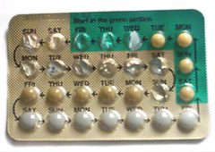

# MÉTODOS CONTRACEPTIVOS HORMONAIS

A contracepção hormonal fica mais simples quando é entendida a partir do eixo hipotálamo-hipófise-ovário. O ponto central não é decorar nomes comerciais, mas dominar critérios de elegibilidade, mecanismos de ação e contraindicações clinicamente relevantes.

*Figura 1 - Cartela de contraceptivo oral combinado (COC) aberta, mostrando as pílulas ativas e placebo. O COC é o método hormonal mais utilizado, contendo estrogênio e progestagênio. Fonte: Tristanb, CC BY-SA 3.0 | Wikimedia Commons*

## Fisiopatologia e Mecanismos de Ação

O princípio básico de qualquer método hormonal é a simulação de um estado hormonal que informe ao cérebro que a ovulação não é necessária. O protagonista da contracepção hormonal é o progestagênio. O estrogênio, quando presente, ajuda a estabilizar o endométrio e reforça a supressão folicular.

### O Papel do Progestagênio

O progestagênio é o responsável pela eficácia contraceptiva propriamente dita. Ele atua em três frentes principais:

- Inibição do pico de LH: Sem o pico do hormônio luteinizante, não há ovulação. Este é o mecanismo central.

- Alteração do muco cervical: O muco torna-se espesso, hostil e impenetrável aos espermatozoides.

- Atrofia endometrial: Torna o endométrio desfavorável à nidação, embora este seja um mecanismo secundário.

### O Papel do Estrogênio

Nos métodos combinados, o estrogênio (geralmente o etinilestradiol) tem funções específicas:

- Inibição do FSH: Impede o recrutamento folicular, potencializando a anovulação.

- Estabilização do endométrio: Este é o ponto que os alunos mais erram. O estrogênio serve para evitar o sangramento de escape (spotting). Ele mantém o endométrio íntegro para que ele não descame de forma desordenada.

- Potencialização dos receptores de progesterona: Permite que doses menores de progestagênio sejam eficazes.

Cuidado: Muitos alunos acham que o estrogênio é o principal contraceptivo. Na verdade, ele é o principal responsável pelos efeitos colaterais graves (trombose) e pelo controle do ciclo. Se a paciente tem spotting frequente em um anticoncepcional de baixa dose, o problema costuma ser a falta de estabilidade endometrial por baixo estrogênio ou progestagênio.

## Componentes dos Métodos Hormonais

### Estrogênios

O etinilestradiol (EE) é o padrão-ouro dos combinados. Ele é um estrogênio sintético de alta potência hepática, o que explica por que ele altera tanto os fatores de coagulação. Recentemente, surgiram opções com estradiol natural (valerato de estradiol ou estradiol nominal), que prometem menor impacto metabólico, mas o EE ainda reina nas questões de prova.

### Progestagênios e suas Gerações

As gerações dos progestagênios são definidas pela sua afinidade com outros receptores (androgênicos, mineralocorticoides, glicocorticoides). Isso define o perfil de efeitos colaterais.

| Geração | Exemplos | Características Clínicas |
| --- | --- | --- |
| 1ª Geração | Noretisterona | Baixa potência, usada em minipílulas. |
| 2ª Geração | Levonorgestrel | Mais androgênica (pode dar acne), mas é a mais segura quanto ao risco de trombose. |
| 3ª Geração | Gestodeno, Desogestrel | Menos androgênica, mas com risco de trombose levemente superior à 2ª geração. |
| 4ª Geração | Drospirenona, Ciproterona | Efeito antiandrogênico (ótimo para acne) e antimineralocorticoide (menos edema). |

Ponto de prova: em paciente com síndrome dos ovários policísticos e acne, progestagênios com ação antiandrogênica, como acetato de ciproterona ou drospirenona, podem ser úteis. Quando a prioridade é menor risco tromboembólico entre os combinados, levonorgestrel costuma ser a opção de referência.

## Métodos Hormonais Combinados (AHC)

Os combinados podem ser administrados por via oral, injetável mensal, anel vaginal ou adesivo transdérmico. Independentemente da via, o risco de trombose está presente porque o estrogênio, ao passar pelo fígado (ou mesmo na circulação sistêmica), aumenta a síntese de fatores pró-coagulantes e reduz a antitrombina III.

### Particularidades das Vias

- Oral (AOC): Sofre primeira passagem hepática. É o método mais estudado.

- Injetável Mensal: Contém um estrogênio natural (geralmente valerato ou enantato de estradiol) e um progestagênio. Tem boa adesão, mas pode causar ganho de peso em algumas pacientes.

- Anel Vaginal e Adesivo: Pulam a primeira passagem hepática, o que teoricamente reduz náuseas, mas o risco de TEV permanece semelhante ao da via oral, pois o efeito nos fatores de coagulação é sistêmico.

## Métodos de Progestagênio Isolado

Estes métodos são a salvação para pacientes com contraindicação ao estrogênio (lactantes, fumantes acima de 35 anos, hipertensas).

- Minipílula (Noretisterona): Dose muito baixa. Não inibe a ovulação de forma consistente em todas as mulheres. Seu principal mecanismo é o espessamento do muco. Por isso, a janela de esquecimento é de apenas 3 horas. Muito usada na amamentação.

- Pílula de Desogestrel (75mcg): Inibe a ovulação em 99% dos ciclos. A janela de esquecimento é de 12 horas, como a de um combinado.

- Injetável Trimestral (Acetato de Medroxiprogesterona 150mg): Causa anovulação persistente.

- Vantagem: Ótimo para quem esquece pílula e para pacientes com anemia falciforme ou epilepsia (ele aumenta o limiar convulsivo).

- Desvantagem: Pode causar ganho de peso real e perda de massa óssea reversível. O retorno à fertilidade pode demorar até 1 ano.

- Implante de Etonogestrel: O método mais eficaz que existe (Índice de Pearl menor que o da laqueadura). Dura 3 anos. O principal efeito colateral é o sangramento irregular (spotting).

## Critérios de Elegibilidade da OMS

Este é o tópico que define quem passa na residência. A OMS classifica as condições médicas em 4 categorias para cada método:

- Categoria 1: Sem restrição de uso. Pode usar à vontade.

- Categoria 2: As vantagens superam os riscos. Pode usar, mas com acompanhamento.

- Categoria 3: Os riscos superam as vantagens. Evitar o método, a menos que não haja outra opção disponível.

- Categoria 4: Risco inaceitável à saúde. Contraindicação ABSOLUTA.

### Contraindicações Absolutas (Categoria 4) para Combinados (Estrogênio)

As situações abaixo são as contraindicações absolutas mais cobradas para métodos combinados:

- Amamentação com menos de 6 semanas pós-parto.

- Tabagista com 35 anos ou mais (que fuma 15 cigarros ou mais por dia).

- Hipertensão grave (PAS ≥ 160 ou PAD ≥ 100) ou com doença vascular.

- Histórico atual ou passado de TVP ou Embolia Pulmonar.

- Cirurgia de grande porte com imobilização prolongada.

- Cardiopatia isquêmica ou AVC atual ou passado.

- Enxaqueca COM aura (em qualquer idade).

- Câncer de mama atual (é Categoria 4 para QUALQUER método hormonal).

- Diabetes com vasculopatia (nefropatia, retinopatia, neuropatia) ou mais de 20 anos de doença.

- Lúpus Eritematoso Sistêmico com anticorpos antifosfolípide positivos ou desconhecidos.

- Hepatite aguda, cirrose descompensada ou tumores hepáticos (adenoma ou carcinoma).

### A Pegadinha da Enxaqueca

Atenção aqui:

- Enxaqueca SEM aura em mulher < 35 anos: Categoria 2 (pode usar).

- Enxaqueca SEM aura em mulher ≥ 35 anos: Categoria 3 para início, 4 para continuação.

- Enxaqueca COM aura em qualquer idade: Categoria 4 (risco altíssimo de AVC isquêmico).

Se a paciente tem enxaqueca com aura, o método de escolha deve ser um progestagênio isolado ou um método não hormonal (DIU de cobre). O injetável trimestral e o implante são seguros nessas pacientes.

## Interações Medicamentosas

O erro clássico de prova é achar que todo antibiótico corta o efeito da pílula. Isso é mentira.
Apenas a Rifampicina e a Rifabutina comprovadamente reduzem a eficácia dos contraceptivos hormonais por indução enzimática no fígado (citocromo P450).

Outros indutores enzimáticos importantes:

- Anticonvulsivantes: Fenitoína, carbamazepina, fenobarbital, primidona, topiramato.

- Antirretrovirais: Alguns esquemas para HIV (como o efavirenz).

O que fazer? Nessas pacientes, o ideal é usar métodos que não sofram esse metabolismo (DIU de cobre ou SIU de levonorgestrel) ou o injetável trimestral (que tem uma dose tão alta que a indução não compromete a eficácia).

## Métodos de Longa Duração (LARCs)

Os LARCs (Long-Acting Reversible Contraception) incluem os DIUs e o implante. Eles são a primeira linha de recomendação da FEBRASGO e de sociedades internacionais porque não dependem da memória da paciente.

### SIU de Levonorgestrel (Mirena/Kyleena)

É um sistema intrauterino que libera progestagênio localmente.

- Mecanismo: Espessamento do muco cervical e atrofia endometrial. A anovulação ocorre em apenas 15% dos ciclos (a maioria das mulheres continua ovulando, mas não engravida).

- Vantagem: Reduz drasticamente o fluxo menstrual. É o tratamento de escolha para menorragia e para pacientes com endometriose ou adenomiose que desejam contracepção.

- Contraindicação: Distorções anatômicas da cavidade uterina (miomas submucosos), infecção pélvica atual (DIP), câncer de mama atual.

### DIU de Cobre (Não Hormonal)

Embora não seja hormonal, ele entra no diagnóstico diferencial.

- Vantagem: Sem hormônios, dura 10 anos.

- Desvantagem: Pode aumentar o fluxo menstrual e as cólicas (dismenorreia).

- Contraindicação específica: Tuberculose pélvica (risco de disseminação).

| Característica | Implante (Etonogestrel) | SIU (Levonorgestrel) | DIU de Cobre |
| --- | --- | --- | --- |
| Duração | 3 anos | 5 anos | 5 a 10 anos |
| Eficácia (Pearl) | 0,05 (Altíssima) | 0,2 | 0,8 |
| Padrão Menstrual | Imprevisível (Spotting) | Amenorreia ou fluxo leve | Aumento do fluxo/cólica |
| Uso no Pós-parto | Imediato (Cat 1) | Imediato (Cat 1) | Imediato (até 48h) ou após 4 semanas |

## Contracepção de Emergência (CE)

A CE deve ser entendida como uma "segunda chance", não como um método de rotina. No Brasil, o método mais comum é o Levonorgestrel 1,5mg (dose única ou duas doses de 0,75mg).

- Mecanismo: Inibe ou retarda a ovulação. Se a ovulação já ocorreu e houve fertilização, o levonorgestrel NÃO impede a implantação. Ele não é abortivo.

- Prazo: Eficácia máxima nas primeiras 72 horas, mas pode ser usado até 5 dias (120h), embora a eficácia caia muito.

- Ulipristal: Um modulador seletivo do receptor de progesterona. É mais eficaz que o levonorgestrel, especialmente perto da ovulação, e mantém boa eficácia até 120 horas.

Ponto de prova: esquecimento de pílula por 3 dias associado a relação desprotegida indica contracepção de emergência, reinício do método e uso de barreira por 7 dias.

## Situações Especiais e Manejo Clínico

### Pós-parto e Amamentação

A escolha do método depende do tempo decorrido e se a mulher está amamentando. O estrogênio exige cautela nesse contexto por dois motivos: aumenta o risco de trombose (que já é alto no puerpério) e reduz a quantidade e qualidade do leite.

- Amamentando < 6 semanas: Apenas métodos não hormonais ou progestagênio isolado (embora a OMS considere progestagênio Cat 2 antes de 6 semanas, na prática brasileira e em provas, costuma-se liberar o uso de minipílula ou implante após a saída da maternidade). Combinados são Categoria 4.

- Amamentando entre 6 semanas e 6 meses: Progestagênios são Cat 1. Combinados são Cat 3.

- Não amamentando: Pode iniciar combinados após 21 ou 42 dias, dependendo dos fatores de risco para TEV.

### Adolescência

O médico deve garantir o sigilo. A adolescente tem direito à prescrição de métodos contraceptivos sem a presença dos pais, desde que tenha capacidade de discernimento. A única exceção é se houver risco de vida ou suspeita de abuso/crime, onde o sigilo pode ser quebrado.

### Benefícios Não Contraceptivos dos AOCs

Os benefícios não contraceptivos são cobrados com frequência porque mostram que a pílula não atua apenas na prevenção de gravidez:

- Redução do risco de Câncer de Ovário (proteção persiste por anos após o uso).

- Redução do risco de Câncer de Endométrio.

- Melhora da dismenorreia e da tensão pré-menstrual (TPM).

- Controle da acne e hirsutismo.

- Redução da incidência de Doença Inflamatória Pélvica (DIP) — o muco espesso dificulta a subida de bactérias.

- Redução de cistos ovarianos funcionais.

Cuidado: O AOC NÃO protege contra câncer de mama (alguns estudos sugerem um aumento discreto do risco durante o uso) e NÃO protege contra ISTs. Para ISTs, o uso de condom é obrigatório (dupla proteção).

### Diagrama autoral: eixo hormonal e ponto de ação dos contraceptivos

Hipotálamo → GnRH pulsátil
 ↓
Hipófise → FSH e LH
 ↓
Ovário
├─ Fase folicular: crescimento folicular + estradiol
├─ Ovulação: pico de LH
└─ Fase lútea: progesterona pelo corpo lúteo

Contraceptivo hormonal
├─ Progestagênio: bloqueia pico de LH, espessa muco cervical e atrofia endométrio
└─ Estrogênio: estabiliza endométrio e reforça supressão de FSH

Resultado clínico: sem pico de LH → sem ovulação; muco cervical hostil → menor ascensão espermática.

Esse esquema substitui a imagem externa do ciclo menstrual: o objetivo didático é mostrar que os métodos hormonais suprimem o eixo hipotálamo-hipófise-ovário, principalmente por ação do progestagênio.

## Manejo de Efeitos Colaterais

### Sangramento de Escape (Spotting)

É a causa número 1 de abandono do método.

- Se ocorre no início do uso: Orientar que costuma melhorar após 3 meses (período de adaptação).

- Se persiste em usuárias de pílulas de baixíssima dose (15-20mcg de EE): Aumentar a dose de estrogênio para 30mcg para estabilizar o endométrio.

- Se ocorre por esquecimento: Orientar tomada regular.

### Ganho de Peso

Apenas o injetável trimestral tem evidência robusta de ganho de peso (cerca de 2-3kg em um ano). Para os outros métodos, os estudos mostram que o ganho de peso é semelhante ao de mulheres que não usam hormônios (envelhecimento natural e mudanças de hábito). No entanto, para a prova, se perguntarem qual método causa ganho de peso, a resposta é o Injetável Trimestral.

## Pontos-Chave para Prova 💡

- Mecanismo principal da pílula combinada: Inibição do pico de LH e consequente anovulação.

- Risco de Trombose: É um efeito do estrogênio (dose-dependente). O progestagênio de 2ª geração (levonorgestrel) é o mais seguro nesse aspecto.

- Enxaqueca com Aura: Contraindicação ABSOLUTA (Cat 4) para qualquer método com estrogênio, devido ao risco de AVC.

- Tabagismo e Idade: Mulher ≥ 35 anos que fuma ≥ 15 cigarros/dia NÃO pode usar estrogênio (Cat 4). Se fumar menos de 15, é Cat 3 (também evitar).

- Câncer de Mama: História atual é Categoria 4 para TODOS os métodos hormonais (incluindo DIU de Mirena e Implante). História familiar de câncer de mama NÃO contraindica nenhum método.

- Proteção Oncológica: AOCs reduzem o risco de câncer de ovário e endométrio.

- Interação Medicamentosa: Rifampicina e anticonvulsivantes indutores (fenitoína, carbamazepina) reduzem a eficácia da maioria dos hormonais.

- Pós-parto: Estrogênio é proibido antes de 6 semanas se a mulher estiver amamentando.

- Eficácia: O implante de etonogestrel é o método mais eficaz disponível (Índice de Pearl 0,05).

- Contracepção de Emergência: O levonorgestrel age inibindo a ovulação; não funciona se a fecundação já ocorreu.

- Hipertensão: PAS ≥ 160 ou PAD ≥ 100 é Categoria 4 para combinados.

- Diabetes: Só é contraindicação para combinados se houver vasculopatia ou longa data (> 20 anos).

- Adenoma Hepático: O uso de anticoncepcionais orais aumenta o risco de desenvolvimento deste tumor benigno, mas que pode sangrar.

- Esquecimento de 1 pílula: Tomar assim que lembrar (mesmo que sejam duas juntas) e seguir o restante normalmente. Sem necessidade de backup.

- Esquecimento de 2 ou mais pílulas: Tomar a última esquecida, descartar as outras, usar preservativo por 7 dias. Se foi na última semana da cartela, emendar a próxima sem pausa.

- Exame Físico: Antes de prescrever um AOC, o único procedimento obrigatório segundo a OMS é a aferição da pressão arterial. Exame de mamas e colposcopia são importantes para a saúde da mulher, mas não para a segurança da prescrição do método.

 Cópia offline para consulta pessoal.
 Fonte original:
 [https://www.medevo.com.br/material-apoio/ler/b06c1aaa-6f07-4a0e-9649-feab360c7306](https://www.medevo.com.br/material-apoio/ler/b06c1aaa-6f07-4a0e-9649-feab360c7306)
