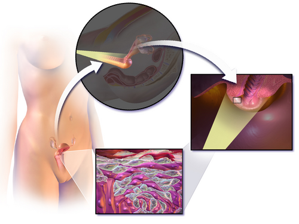
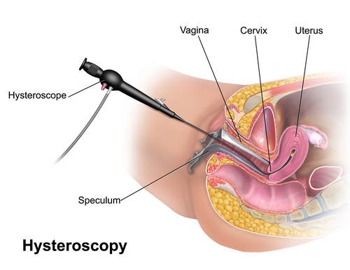

# MÉTODOS DIAGNÓSTICOS EM GINECOLOGIA

Para dominar a ginecologia em provas de residência, você precisa entender que a propedêutica não é uma lista aleatória de exames. Existe uma hierarquia lógica. O examinador quer saber se você sabe qual ferramenta escolher para cada "andar" do sistema reprodutor: a vulva, a vagina, o colo, a cavidade uterina, o miométrio ou os anexos.

Muitos alunos erram questões por não diferenciarem o que cada método consegue "enxergar". Por exemplo, a histeroscopia é fantástica para ver o que está *dentro* da cavidade, mas ela é cega para o que está *dentro da parede* do útero. Vamos organizar esse raciocínio agora.

## Citopatologia Oncótica (Papanicolau)

O rastreamento do câncer de colo uterino é, sem dúvida, o tema mais cobrado. Segundo as Diretrizes Brasileiras para o Rastreamento do Câncer do Colo do Útero (Ministério da Saúde), o objetivo é detectar lesões precursoras.

### Critérios de Satisfatoriedade e Zona de Transformação

Para um exame ser considerado satisfatório, ele precisa representar bem a região onde o câncer nasce: a Zona de Transformação (ZT). É ali que ocorre a metaplasia escamosa, onde o epitélio colunar (glandular) é substituído pelo epitélio escamoso.

Se o laudo vier "ausência de células da zona de transformação" (células glandulares ou metaplásicas) em uma paciente no menacme, a amostra é considerada insatisfatória para avaliação da ZT, mas não necessariamente para o rastreamento se houver células escamosas. No entanto, se o laudo indicar "amostra celular insuficiente", o exame deve ser repetido.

**Dica de prova:** Na pós-menopausa, a ZT frequentemente "sobe" para dentro do canal endocervical devido à atrofia. Por isso, é comum vermos laudos de Papanicolau em idosas com "ausência de células glandulares", o que exige cautela na interpretação. Se houver atrofia severa, o uso de estrogênio tópico por 7 a 14 dias antes de repetir o exame pode melhorar a qualidade da amostra.

### Periodicidade do Rastreamento

A regra de ouro do Ministério da Saúde:

- Início aos 25 anos para mulheres que já iniciaram atividade sexual.

- Os dois primeiros exames devem ser anuais.

- Se ambos forem normais, o intervalo passa a ser de 3 em 3 anos.

- O rastreamento encerra aos 64 anos se a paciente tiver pelo menos dois exames negativos nos últimos cinco anos.

**Cuidado com a pegadinha:** Se a paciente tem 20 anos e já é sexualmente ativa, você faz o Papanicolau? Segundo a diretriz, NÃO. O rastreamento começa aos 25. Antes disso, as lesões por HPV são muito frequentes, mas a regressão espontânea é a regra. Fazer o exame antes da hora gera procedimentos desnecessários (sobretratamento).

### Achados Microbiológicos Comuns

Muitas vezes, o Papanicolau traz laudos de "citólise". O aluno desatento marca como infecção. Errado. A citólise, na ausência de sintomas, indica apenas uma flora rica em Bacilos de Döderlein (lactobacilos), que degradam o glicogênio das células vaginais, liberando ácido lático. É o sinal de uma vagina saudável e ácida.

## Ultrassonografia em Ginecologia

A ultrassonografia (USG) é a extensão do exame físico do ginecologista. Mas você precisa saber quando pedir cada via.

### USG Transvaginal (USTV) vs. Transabdominal

A USTV é superior para avaliar detalhes do útero e ovários porque o transdutor fica mais próximo dos órgãos. Ela deve ser realizada com a **bexiga vazia**. Já a USG abdominal é reservada para virgens, grandes massas que saem da pelve ou gestações avançadas, e exige **bexiga cheia** para criar uma janela acústica.

### Avaliação do Endométrio

Este é um ponto crítico para o diagnóstico de câncer de endométrio.

- **Na pós-menopausa:** O endométrio deve ser fino. O ponto de corte clássico é 5 mm (sem uso de terapia hormonal). Se o endométrio estiver com 8 mm, por exemplo, a investigação com biópsia ou histeroscopia é obrigatória.

- **No menacme:** A espessura varia com o ciclo. Na fase proliferativa (estrogênica), ele é fino e trilaminar. Na fase secretora (progesterônica), ele fica espesso e hiperecogênico (branco).

**Exemplo Clínico:** Paciente de 60 anos, sangramento vaginal discreto, USTV mostra endométrio de 3 mm. Qual a causa mais provável? Atrofia endometrial. Mesmo sendo a principal causa de sangramento na pós-menopausa, se o endométrio fosse > 5 mm, você teria que excluir câncer.

### Achados Anexiais

Um pequeno volume de líquido livre no fundo de saco de Douglas é comum e fisiológico, especialmente logo após a ovulação. Não confunda isso com hemoperitônio ou doença inflamatória pélvica (DIP) se a paciente estiver assintomática.

## Histeroscopia: O Padrão-Ouro da Cavidade

Se a USG "desconfia", a histeroscopia "confirma". Ela permite a visualização direta do canal cervical e da cavidade uterina.

### Histeroscopia Diagnóstica vs. Cirúrgica

A diagnóstica usa óticas finas e, geralmente, não precisa de anestesia em ambiente ambulatorial. A cirúrgica exige dilatação do colo e ambiente hospitalar para tratar patologias.

**O que a Histeroscopia vê (e trata):**

- Pólipos endometriais.

- Miomas submucosos (aqueles que abaulam a cavidade).

- Sinéquias uterinas (Síndrome de Asherman).

- Septos uterinos (malformações mullerianas).

- Corpos estranhos (DIU perdido).

**O que a Histeroscopia NÃO vê:**

- **Adenomiose:** Erro clássico de prova. A adenomiose é a presença de glândulas endometriais dentro do miométrio (músculo). Como a histeroscopia só vê a superfície da cavidade, ela não diagnostica adenomiose. O diagnóstico aqui é por USG ou Ressonância Magnética (RM).

- **Endometriose:** A endometriose está fora do útero (peritônio, ovários). Para vê-la, precisamos de laparoscopia.

### Contraindicações Absolutas da Histeroscopia

Você nunca, em hipótese alguma, fará uma histeroscopia se:

- A paciente estiver grávida (risco de aborto).

- Houver infecção pélvica ativa (DIP, cervicite) – o meio de distensão pode levar bactérias para o peritônio.

- Houver sangramento uterino volumoso/ativo – o sangue impede a visão (é como tentar dirigir em um nevoeiro vermelho).

**Nota importante:** O sangramento uterino anormal (SUA) é uma **indicação** de histeroscopia, mas ela deve ser agendada para quando o sangramento estiver ausente ou mínimo.

## Histerossalpingografia (HSG)

Este é o exame fundamental na investigação da infertilidade conjugal. É um exame radiológico (raio-X) com contraste iodado injetado pelo colo uterino.

*Figura 1 - Ilustração demonstrando procedimento de colposcopia com visualização do colo uterino. A colposcopia é indicada após citologia oncótica alterada para avaliação de lesões cervicais. Fonte: BruceBlaus, CC BY-SA 4.0 | Wikimedia Commons*

## Indicações e Técnica

A HSG avalia a morfologia da cavidade uterina e, principalmente, a **perviedade tubária**. Deve ser realizada na fase folicular precoce (pós-menstruação e pré-ovulação), para garantir que a paciente não está grávida e que o endométrio esteja fino, facilitando a visualização.

### A Prova de Cotte

Este é o termo que você precisa decorar.

- **Prova de Cotte Positiva:** O contraste "derramou" na cavidade peritoneal. Isso significa que pelo menos uma das trompas é pérvea.

- **Prova de Cotte Negativa:** O contraste ficou retido nas trompas ou nem entrou nelas. Indica obstrução tubária (ex: hidrossalpinge).

**Dica do Dr. Will:** A HSG avalia o "encanamento" (útero e trompas). Ela não avalia os ovários. Se a questão perguntar sobre reserva ovariana, a HSG não serve para nada. Use anti-inflamatórios (AINEs) antes do exame para reduzir a dor e o espasmo tubário, que pode gerar um falso-positivo para obstrução.

## Laparoscopia em Ginecologia

Enquanto a histeroscopia entra "por baixo" (via vaginal), a laparoscopia entra "pelo umbigo" (via abdominal).

*Figura 1 - Ilustração demonstrando procedimento de colposcopia com visualização do colo uterino. A colposcopia é indicada após citologia oncótica alterada para avaliação de lesões cervicais. Fonte: BruceBlaus, CC BY-SA 4.0 | Wikimedia Commons*

## Indicações

É o padrão-ouro para o diagnóstico e tratamento da **endometriose** e para a avaliação de massas anexiais (cistos ovarianos complexos). Também é usada para lise de aderências e cirurgias tubárias.

### O Pneumoperitônio

Para operar, o cirurgião insufla CO2 na barriga. Isso gera repercussões fisiológicas que caem em prova:

- Aumento da pressão intra-abdominal.

- Diminuição do retorno venoso (compressão da veia cava).

- Elevação do diafragma (pode dificultar a ventilação).

- Risco de enfisema subcutâneo.

**Manejo de Perfuração Uterina:** Se durante uma curetagem ou histeroscopia ocorrer uma perfuração, a conduta depende da estabilidade da paciente. Se houver suspeita de lesão de alça intestinal ou grandes vasos, a laparoscopia (ou laparotomia) é mandatória para revisão da cavidade.

*Figura 2 - Ilustração de histeroscopia demonstrando a introdução do histeroscópio pela vagina e colo uterino até a cavidade endometrial. Permite visualização direta e biópsia dirigida de lesões intrauterinas. Fonte: BruceBlaus, CC BY-SA 4.0 | Wikimedia Commons*

## Diagnóstico Diferencial e Exames Complementares

Às vezes, a ginecologia se cruza com outras áreas. O MedEvo enfatiza que o médico generalista deve ter essa visão ampla.

### Sangramento e Coagulopatias

Em adolescentes com sangramento uterino anormal (SUA) desde a menarca, ou mulheres com sangramento mucocutâneo associado, pense em **Doença de von Willebrand**. O screening inicial inclui Hemograma, TP e TTPa. Um TTPa prolongado com plaquetas normais é uma pista clássica.

### Dor Pélvica na Emergência

Diante de uma mulher em idade fértil com dor abdominal aguda (ex: fossa ilíaca direita):

- **Sempre peça Beta-hCG:** Excluir gravidez ectópica é a prioridade número um.

- **USG Pélvica:** Para diferenciar entre cisto hemorrágico, torção de anexo ou apendicite.

### Tabelas Comparativas para Fixação

| Método | O que avalia melhor? | Principal Limitação |
| --- | --- | --- |
| **Papanicolau** | Lesões precursoras do câncer de colo | Não avalia bem o endométrio |
| **USTV** | Miométrio, endométrio e ovários | Depende do operador e do biotipo |
| **Histeroscopia** | Interior da cavidade uterina | Não vê o que está fora do útero |
| **HSG** | Perviedade das trompas | Não avalia ovários ou endometriose |
| **Laparoscopia** | Endometriose e anexos | Invasivo, exige anestesia geral |

| Achado na USG | Hipótese Principal | Conduta Sugerida |
| --- | --- | --- |
| Endométrio > 5mm (Pós-menopausa) | Hiperplasia ou Câncer | Histeroscopia + Biópsia |
| Imagem hiperecogênica intracavitária | Pólipo Endometrial | Histeroscopia Cirúrgica |
| Mioma que deforma a cavidade | Mioma Submucoso | Histeroscopia Cirúrgica |
| Massa anexial cística simples | Cisto Folicular | Observação (repetir USG) |

## Procedimentos de Biópsia e Punção

### PAAF de Tireoide

Embora pareça fora da ginecologia, as bancas adoram misturar nódulos de tireoide em casos clínicos de mulheres.

- **PAAF (Punção Aspirativa por Agulha Fina):** É o método de escolha para avaliar nódulos suspeitos.

- **Bethesda III (Atipia de significado indeterminado):** A conduta é repetir a PAAF em 3 a 6 meses.

- **Limitação da PAAF:** Ela não consegue diferenciar Adenoma Folicular de Carcinoma Folicular, pois essa distinção exige ver a invasão da cápsula (histopatológico).

### Biópsia de Endométrio

Pode ser feita por curetagem (mais invasiva, risco de Síndrome de Asherman) ou por cânulas de aspiração (Pipelle) no consultório. A biópsia dirigida por histeroscopia é a mais precisa, pois evita amostras "às cegas".

## Situações Especiais e Pegadinhas

### Amenorreia Pós-Procedimento

Se uma paciente para de menstruar após uma curetagem vigorosa e apresenta dor pélvica cíclica, suspeite de **Síndrome de Asherman** (sinéquias que colam as paredes do útero). O diagnóstico e o tratamento são feitos por histeroscopia.

### Hematocolpo

Adolescente que nunca menstruou (amenorreia primária), mas tem dor pélvica mensal e abaulamento vaginal azulado ao exame físico. O diagnóstico é clínico (hímen imperfurado), e a USG confirma o acúmulo de sangue na vagina (hematocolpo).

### O Papel da Ressonância Magnética (RM)

A RM é excelente para mapear miomas antes de uma cirurgia (diferenciar intramural de subseroso) e para o diagnóstico de adenomiose e endometriose profunda. No entanto, devido ao custo, raramente é o primeiro exame. Lembre-se: RM não usa radiação ionizante, ao contrário da Tomografia (TC).

## Pontos-Chave para Prova

- **Papanicolau:** Início aos 25 anos, 2 exames anuais negativos antes de passar para trienal. A presença de células da ZT (glandulares/metaplásicas) é o critério de satisfatoriedade no menacme.

- **Histeroscopia:** Padrão-ouro para patologias intracavitárias (pólipo, mioma submucoso, sinéquia).

- **Contraindicações Histeroscopia:** Gravidez, Infecção Pélvica Ativa e Sangramento Volumoso (Absolutas).

- **Adenomiose:** NÃO é diagnosticada por histeroscopia. Use USG ou RM.

- **Histerossalpingografia:** Avalia trompas. Prova de Cotte positiva = trompas pérveas. Realizar na 1ª fase do ciclo.

- **Espessura Endometrial:** Na pós-menopausa, o limite de normalidade é 5 mm. Acima disso, investigar sempre.

- **Doença de von Willebrand:** Causa comum de sangramento uterino anormal em adolescentes com exames ginecológicos normais.

- **Pneumoperitônio:** O uso de CO2 na laparoscopia pode reduzir o retorno venoso e causar dor referida no ombro (irritação do nervo frênico).

- **Cisto de Ducto Tireoglosso:** Nódulo cervical na linha média que sobe com a protrusão da língua (comum em pediatria/clínica).

- **Bethesda II (Tireoide):** Nódulo benigno. Seguimento clínico. Se for Bethesda III, repita a PAAF.

- **Líquido em Fundo de Saco:** Pequena quantidade na USG é fisiológico (ovulação).

- **Atrofia Vaginal:** Causa comum de Papanicolau duvidoso na idosa. Tratar com estrogênio local antes de repetir.

- **Perfuração Uterina:** Complicação da curetagem. Se estável, observação; se instável ou suspeita de lesão visceral, cirurgia.

- **Asherman:** Amenorreia + Sinéquias pós-curetagem. Diagnóstico por Histeroscopia.

- **Cotte Negativa:** Indica obstrução tubária. Se bilateral, a paciente precisará de Fertilização In Vitro (FIV) para engravidar. 💡

 Cópia offline para consulta pessoal.
 Fonte original:
 [https://www.medevo.com.br/material-apoio/ler/df62def8-24a7-4c5d-87fb-aa7fc1217d81](https://www.medevo.com.br/material-apoio/ler/df62def8-24a7-4c5d-87fb-aa7fc1217d81)
