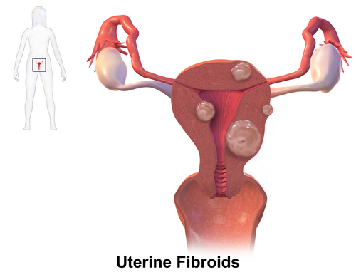
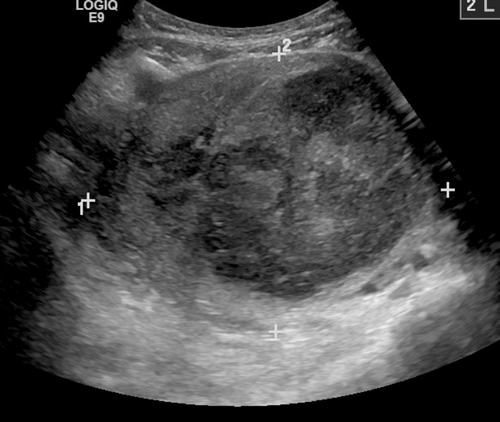

# MIOMAS UTERINOS

Os miomas uterinos, também chamados de leiomiomas ou fibroides, são os tumores benignos mais comuns do trato genital feminino. Se você vai prestar prova de residência no Brasil, este é um tema "obrigatório". Não há como fugir. Mas o segredo não é decorar todos os tipos de mioma, e sim entender como a localização deles dita o sintoma e, consequentemente, a conduta.

Para começar, entenda o que é o mioma: ele é uma neoplasia benigna de células musculares lisas do miométrio. O ponto chave aqui, que cai muito em prova, é a sua origem monoclonal. Isso significa que cada mioma surge de uma única célula que sofreu mutação e começou a se proliferar. Se uma paciente tem dez miomas, ela teve dez eventos mutacionais independentes.

## Epidemiologia e Fatores de Risco

A prevalência é altíssima. Estima-se que até 80% das mulheres terão miomas ao longo da vida, embora nem todas sejam sintomáticas. Aqui, as bancas adoram cobrar os fatores que aumentam ou diminuem o risco.

### Fatores que aumentam o risco

- Raça negra: É o fator de risco mais citado. Mulheres negras têm miomas mais precoces, maiores e mais sintomáticos.

- Menarca precoce: Quanto mais cedo a exposição ao estrogênio, maior o risco.

- Obesidade: O tecido adiposo converte androgênios em estrona (aromatização periférica), alimentando o tumor.

- História familiar: Se a mãe teve, a filha tem um risco muito maior.

- Idade: O pico de incidência ocorre entre os 35 e 50 anos.

### Fatores que diminuem o risco (As "pegadinhas")

- Tabagismo: Sim, o cigarro é péssimo para a saúde, mas ele diminui o risco de miomas porque reduz os níveis de estrogênio circulante (efeito antiestrogênico). Cuidado: a banca vai colocar isso para te confundir.

- Multiparidade: A gestação "descansa" o útero da exposição cíclica hormonal.

- Exercício físico: Atividade física regular (pelo menos 150 minutos por semana) reduz a resistência insulínica e os níveis hormonais, diminuindo a incidência.

*Figura 1 - Ilustração médica demonstrando diferentes tipos de miomas uterinos (leiomiomas): subseroso, intramural e submucoso, com suas respectivas localizações no útero. Fonte: BruceBlaus, CC BY-SA 4.0 | Wikimedia Commons*

## Fisiopatologia: O "Porquê" do Crescimento

Por que o mioma cresce? Ele é um tumor hormônio-dependente. Ele precisa de estrogênio e progesterona.

Diferente do miométrio normal, o tecido do leiomioma possui uma densidade maior de receptores de estrogênio e progesterona. Além disso, ele apresenta uma menor concentração de aromatase P450 em comparação ao tecido normal, o que altera o microambiente hormonal local.

Um conceito fundamental para a prova: a progesterona é tão importante quanto o estrogênio no crescimento do mioma. Ela estimula fatores de crescimento e inibe a apoptose das células tumorais. É por isso que, em alguns tratamentos, usamos bloqueadores de progesterona.

Como o mioma depende de hormônios, o que acontece na menopausa? Ele regride. Se uma paciente pós-menopausa chega ao consultório com um mioma que está crescendo, o sinal de alerta deve ligar imediatamente. Isso não é normal e pode sugerir um leiomiossarcoma (embora a transformação maligna de um mioma pré-existente seja raríssima, menos de 0,5%).

## Classificação FIGO: O Mapa da Mina

Se você não souber a classificação da FIGO (Federação Internacional de Ginecologia e Obstetrícia), você vai errar a questão de conduta. A conduta no mioma é baseada quase 100% na localização.

A classificação vai de 0 a 8:

| Classe FIGO | Localização | Descrição Clínica |
| --- | --- | --- |
| 0 | Submucoso | Pediculado, totalmente intracavitário |
| 1 | Submucoso | < 50% intramural (a maior parte está na cavidade) |
| 2 | Submucoso | ≥ 50% intramural (a maior parte está na parede) |
| 3 | Intramural | Toca o endométrio, mas é 100% intramural |
| 4 | Intramural | Totalmente dentro do miométrio, não toca serosa nem endométrio |
| 5 | Subseroso | ≥ 50% intramural |
| 6 | Subseroso | < 50% intramural |
| 7 | Subseroso | Pediculado (fora do útero) |
| 8 | Outros | Cervical, parasita (se nutre de outros órgãos) |

**Dica do Dr. Will:** Imagine o útero como uma casa. O submucoso (0, 1, 2) está "dentro do quarto" (cavidade endometrial). O intramural (3, 4) está "dentro da parede". O subseroso (5, 6, 7) está "do lado de fora, no jardim".

Quem causa sangramento? Quem está dentro do quarto atrapalhando o lençol (endométrio). Quem causa dor e compressão? Quem está crescendo para fora e apertando os vizinhos (bexiga e reto).

## Quadro Clínico: O que a paciente sente?

A maioria dos miomas é assintomática. Eles são achados de exame de rotina. Porém, quando causam sintomas, eles seguem um padrão:

### Sangramento Uterino Anormal (SUA)

É o sintoma mais comum, especialmente nos miomas submucosos e intramurais que distorcem a cavidade. O mioma aumenta a superfície do endométrio e dificulta a contratilidade do miométrio na hora da menstruação. O resultado é a hipermenorragia (sangramento prolongado e em grande quantidade).

### Dor Pélvica e Sintomas de Compressão

Miomas grandes (geralmente subserosos ou intramurais volumosos) podem comprimir a bexiga, causando polaciúria ou urgência miccional. Se comprimirem o reto, causam constipação. A dismenorreia (cólica) também é comum devido à tentativa do útero de "expulsar" o mioma, especialmente se for submucoso.

### Infertilidade e Abortamento

Os miomas submucosos (FIGO 0, 1, 2) são os grandes vilões aqui. Eles alteram a arquitetura da cavidade, geram um ambiente inflamatório e dificultam a implantação do blastocisto. Miomas intramurais que distorcem a cavidade também podem atrapalhar. Miomas subserosos, via de regra, não afetam a fertilidade.

*Figura 2 - Imagem ultrassonográfica demonstrando mioma uterino volumoso (9cm) causando congestão pélvica. A ultrassonografia transvaginal é o exame de primeira linha para diagnóstico e acompanhamento. Fonte: James Heilman, MD, CC BY-SA 3.0 | Wikimedia Commons*

## Diagnóstico: Como confirmar?

O diagnóstico começa no exame físico. Ao toque bimanual, você sentirá um útero aumentado de volume, com contornos irregulares (bocelado) e consistência endurecida. Se o útero estiver globoso e macio, pense em adenomiose ou gravidez.

### Ultrassonografia Transvaginal (USTV)

É o exame de primeira linha. É barato, acessível e tem boa sensibilidade. O mioma aparece como um nódulo hipoecoico (mais escuro que o miométrio), circunscrito e com sombra acústica posterior.

### Ressonância Magnética (RM) de Pelve

É o melhor exame para mapeamento pré-operatório. Se a paciente tem múltiplos miomas e quer operar preservando o útero, a RM é fundamental para o cirurgião saber exatamente onde entrar. Ela diferencia bem mioma de adenomiose (zona juncional > 12mm sugere adenomiose).

### Histeroscopia Diagnóstica

Padrão-ouro para avaliar a cavidade endometrial. Se a suspeita é mioma submucoso, a histeroscopia permite ver o "inimigo" de frente e já planejar a cirurgia.

*Figura 2 - Imagem ultrassonográfica demonstrando mioma uterino volumoso (9cm) causando congestão pélvica. A ultrassonografia transvaginal é o exame de primeira linha para diagnóstico e acompanhamento. Fonte: James Heilman, MD, CC BY-SA 3.0 | Wikimedia Commons*

## Diagnóstico Diferencial

Não confunda mioma com:

- Adenomiose: Útero globoso, dismenorreia intensa, paciente multípara. Na MedEvo, sempre reforçamos: mioma é "caroço", adenomiose é "infiltração".

- Pólipo Endometrial: Geralmente causa sangramento intermenstrual e é visualizado como uma estrutura hiperecoica na USG.

- Gravidez: Sempre peça Beta-HCG em mulheres em idade fértil com útero aumentado.

- Leiomiossarcoma: Suspeitar se houver crescimento rápido, especialmente na pós-menopausa.

| Característica | Mioma Uterino | Adenomiose |
| --- | --- | --- |
| Consistência | Endurecida/Firme | Macia/Pastosa |
| Formato do Útero | Irregular (Bocelado) | Globoso (Simétrico) |
| Sintoma Principal | Sangramento (SUA) | Dismenorreia Intensa |
| Limites na USG | Bem definidos | Mal definidos |

## Tratamento: O que fazer com cada paciente?

Aqui é onde as provas ganham ou perdem o aluno. A regra de ouro é: **Mioma assintomático não se opera**, exceto em situações muito específicas.

### 1. Conduta Expectante

Indicada para pacientes assintomáticas, com miomas pequenos ou que estão chegando na menopausa. Acompanhamos com exames clínicos e de imagem a cada 6 ou 12 meses.

### 2. Tratamento Clínico (Medicamentoso)

O objetivo aqui é controlar o sangramento e reduzir o volume do mioma (temporariamente).

- AINEs e Antifibrinolíticos (Ácido Tranexâmico): Usados apenas durante a menstruação para reduzir o fluxo. Não diminuem o tamanho do mioma.

- Anticoncepcionais Combinados e Progestogênios: Ajudam a controlar o ciclo e reduzir o sangramento. O DIU de Levonorgestrel é uma excelente opção para controle de SUA, mas cuidado: se o mioma distorcer muito a cavidade, o DIU pode ser expulso.

- Análogos de GnRH (Goserelina, Leuprolida): Causam uma "menopausa temporária". Reduzem o volume do mioma em até 50% e melhoram a anemia.

- **Pérola de Prova:** O GnRH não é tratamento definitivo. Ele é usado no pré-operatório (por 3 a 6 meses) para facilitar a cirurgia e reduzir perdas sanguíneas. Se parar de usar, o mioma volta a crescer.

### 3. Tratamento Cirúrgico Conservador (Miomectomia)

Indicado para mulheres que desejam preservar a fertilidade ou o útero.

- Miomectomia Histeroscópica: Padrão-ouro para miomas submucosos (FIGO 0, 1 e alguns casos de FIGO 2). Se o mioma for FIGO 0, a retirada é completa e tranquila.

- Miomectomia Laparoscópica ou Laparotômica: Para miomas intramurais ou subserosos. A via depende do tamanho e da experiência do cirurgião.

### 4. Tratamento Cirúrgico Definitivo (Histerectomia)

Indicado para pacientes com prole constituída, sintomas graves e falha do tratamento clínico. É a única forma de garantir que não haverá recidiva. Pode ser total (retira o colo) ou subtotal (preserva o colo). Em provas, a histerectomia é a resposta correta para mulheres > 40 anos, com prole completa e miomatose sintomática refratária.

### 5. Embolização de Artérias Uterinas (EAU)

Uma alternativa à cirurgia. Através de cateterismo, obstroem-se as artérias que nutrem o mioma, causando isquemia e necrose do tumor.

- **Contraindicação Importante:** Mulheres que ainda desejam engravidar (pode comprometer a reserva ovariana e a vascularização placentária) e pacientes com coagulopatias ou insuficiência renal.

| Opção de Tratamento | Indicação Principal | Observação de Prova |
| --- | --- | --- |
| Expectante | Assintomática | Maioria dos casos |
| Análogo GnRH | Pré-operatório | Uso limitado a 6 meses (risco de osteoporose) |
| Miomectomia Histeroscópica | Mioma Submucoso | Padrão-ouro para FIGO 0 e 1 |
| Miomectomia Abdominal | Desejo de gravidez + Mioma Intramural | Risco de aderências pélvicas |
| Histerectomia | Prole completa + Sintomas graves | Tratamento definitivo |

## Situações Especiais

### Mioma e Gravidez

A maioria das gestações com mioma transcorre sem problemas. No entanto, o mioma pode crescer no primeiro trimestre devido ao estímulo hormonal.
A complicação mais comum em provas é a **Degeneração Rubra (ou vermelha)**. O mioma cresce tanto que o suprimento sanguíneo se torna insuficiente, gerando infarto hemorrágico.

- Quadro: Dor abdominal aguda, febre baixa e útero doloroso à palpação.

- Conduta: Conservadora! Repouso, hidratação e analgesia (AINEs podem ser usados por curto período até a 32ª semana). **Nunca se faz miomectomia durante a gestação ou no parto**, exceto se o mioma for pediculado e sofrer torção. O risco de hemorragia é altíssimo.

### Mioma Parido

É o mioma submucoso pediculado que sofreu extrusão pelo colo uterino. A paciente chega com dor tipo expulsiva e sangramento. Ao exame especular, você vê uma massa saindo pelo orifício externo do colo.

- Conduta: Exérese por via vaginal (torção do pedículo ou ressecção). Não precisa abrir a barriga da paciente para isso.

### Mioma na Pós-menopausa

Como já dito, mioma na menopausa deve diminuir. Se houver sangramento pós-menopausa, sua primeira obrigação é excluir câncer de endométrio. Se o eco endometrial estiver > 4-5 mm, peça histeroscopia com biópsia. Se o mioma estiver crescendo rápido, suspeite de leiomiossarcoma.

## Resumo de Condutas por Tipo de Mioma (Foco em Prova)

- Mioma Submucoso (FIGO 0, 1, 2) + Sangramento ou Infertilidade: Miomectomia Histeroscópica.

- Mioma Intramural < 5 cm + Assintomática: Expectante.

- Mioma Intramural > 5 cm ou Sintomático + Desejo de Gravidez: Miomectomia (Laparoscopia ou Laparotomia).

- Mioma Subseroso + Assintomático: Expectante (não importa o tamanho, se não comprime nada, não mexe).

- Miomatose Múltipla + Prole Completa + Sintomas: Histerectomia.

## Complicações Pós-Operatórias

Em uma miomectomia histeroscópica, cuidado com a **Síndrome de Intoxicação Hídrica**. Ocorre pela absorção excessiva do meio de distensão (glicina ou soro fisiológico), levando a hiponatremia dilucional, edema cerebral e edema agudo de pulmão. Se a paciente começar com confusão mental no pós-operatório imediato, cheque o sódio.

Outro ponto: se houver perfuração uterina durante uma histeroscopia com uso de energia (bipolar ou monopolar), a laparoscopia é obrigatória para descartar lesões em alças intestinais que podem não ser visíveis de imediato.

## Pontos-Chave para Prova 💡

- Miomas são tumores monoclonais benignos dependentes de estrogênio e progesterona.

- Fatores de proteção: Tabagismo (antiestrogênico), multiparidade e atividade física.

- Fatores de risco: Raça negra, obesidade e história familiar.

- Mioma submucoso (FIGO 0, 1, 2) é o que mais causa sangramento (SUA) e infertilidade.

- O diagnóstico inicial é clínico + USTV. O padrão-ouro para mapeamento é a RM.

- Mioma assintomático não se opera, apenas acompanha.

- O tratamento medicamentoso com análogo de GnRH é apenas para preparo pré-operatório (reduz volume e anemia).

- Miomectomia histeroscópica é a escolha para miomas submucosos FIGO 0 e 1.

- Na gestação, a conduta para mioma é sempre conservadora. A degeneração rubra é tratada com analgesia.

- Miomectomia durante o parto ou cesárea é contraindicada (risco de hemorragia incoercível), exceto se pediculado.

- Sangramento na pós-menopausa exige exclusão de malignidade endometrial (biópsia se eco > 4-5 mm).

- Crescimento rápido de massa uterina na pós-menopausa: suspeitar de leiomiossarcoma.

- Adenomiose é o principal diagnóstico diferencial: útero globoso, macio e dismenorreia severa.

- A embolização de artérias uterinas é contraindicada para quem deseja gestar.

- Mioma parido: o tratamento é a retirada por via vaginal.

- Contraindicação absoluta de cirurgia: Paciente sem condições clínicas ou que não aceita o procedimento (óbvio, mas cai).

- Erro comum: Achar que mioma subseroso causa sangramento. Ele causa compressão; quem sangra é o submucoso e o intramural.

 Cópia offline para consulta pessoal.
 Fonte original:
 [https://www.medevo.com.br/material-apoio/ler/0554cdd1-db27-4d51-932b-11e23ab43ad4](https://www.medevo.com.br/material-apoio/ler/0554cdd1-db27-4d51-932b-11e23ab43ad4)
