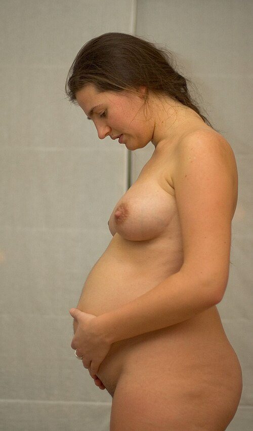
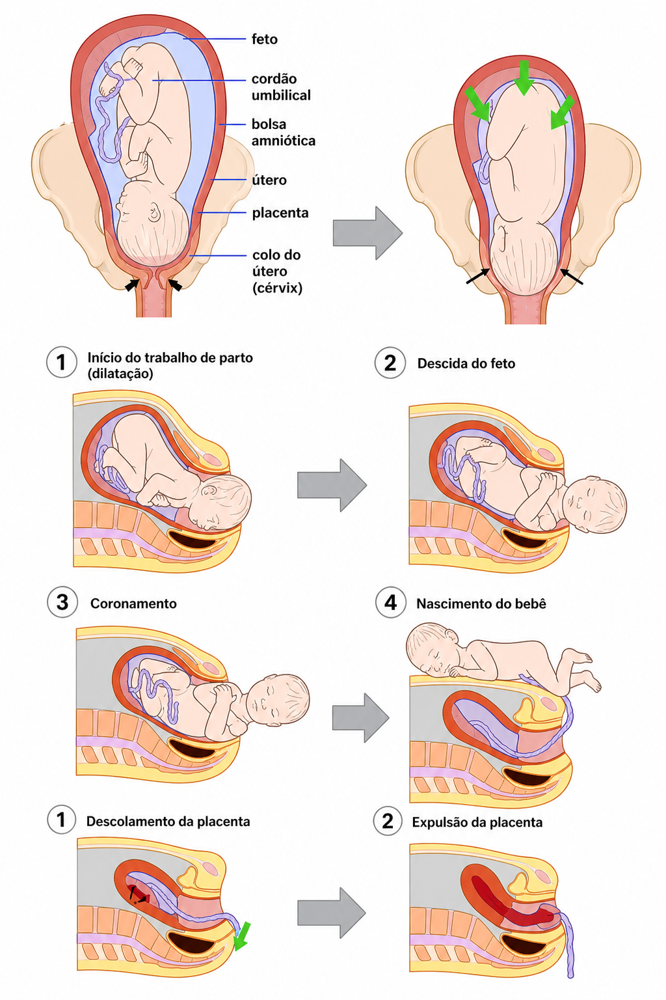

# MODIFICAÇÕES FISIOLÓGICAS DA GRAVIDEZ

[CONTEUDO]

A gravidez provoca adaptações em praticamente todos os sistemas maternos. Essas mudanças têm dois objetivos centrais: garantir perfusão e nutrição adequadas ao concepto e preparar a mãe para o parto e o puerpério.

*Figura 1 - Gestante com 26 semanas demonstrando o crescimento uterino significativo. As modificações fisiológicas da gravidez afetam todos os sistemas: cardiovascular, respiratório, renal, hematológico e endócrino. Fonte: Tom Adriaenssen, CC BY 3.0 | Wikimedia Commons*

## Alterações cardiovasculares

A circulação materna torna-se hiperdinâmica para suprir o território uteroplacentário, que funciona como um leito vascular de baixa resistência.

### Débito cardíaco, frequência cardíaca e pressão arterial

O débito cardíaco aumenta cerca de 30% a 50% na gestação. Esse aumento começa precocemente, atinge pico por volta de 20 a 24 semanas e decorre do aumento do volume sistólico e da frequência cardíaca.

A frequência cardíaca materna sobe, em média, 10 a 20 bpm. Taquicardia leve pode ser fisiológica, mas sintomas importantes, síncope, dor torácica, dispneia desproporcional ou arritmia sustentada exigem investigação.

Apesar do aumento do volume circulante, a pressão arterial tende a cair no primeiro e no segundo trimestres, principalmente a diastólica. Isso ocorre pela queda da resistência vascular sistêmica, mediada por progesterona, óxido nítrico, prostaglandinas e baixa resistência placentária. No terceiro trimestre, a pressão costuma retornar aos níveis pré-gestacionais.

**Ponto de prova:** aumento de débito cardíaco com queda da resistência vascular periférica é uma das combinações mais cobradas.

### Compressão aortocava e hipotensão supina

A partir da segunda metade da gestação, o útero pode comprimir a veia cava inferior e a aorta quando a gestante permanece em decúbito dorsal. Isso reduz retorno venoso, débito cardíaco e perfusão uteroplacentária.

Manifestações possíveis:

- tontura;

- náuseas;

- palidez;

- sudorese;

- hipotensão;

- mal-estar em decúbito dorsal.

A conduta é deslocar o útero para a esquerda, preferencialmente com decúbito lateral esquerdo ou inclinação lateral.

### Trabalho de parto e puerpério imediato

O maior estresse cardiovascular ocorre no trabalho de parto e logo após o nascimento. A contração uterina e a descompressão da veia cava promovem autotransfusão para a circulação sistêmica, elevando transitoriamente o retorno venoso e o débito cardíaco.

Esse ponto é especialmente relevante em cardiopatias maternas.

*Figura 2 - Diagrama das fases do parto.*

### Achados cardiovasculares fisiológicos

Podem ser normais na gestação:

- ictus cordis desviado para cima e para a esquerda;

- sopro sistólico funcional;

- hiperfonese de bulhas;

- presença de B3;

- extrassístoles isoladas;

- discreto desvio do eixo elétrico para a esquerda no ECG;

- aumento aparente da área cardíaca na radiografia de tórax.

**Atenção:** sopro diastólico, sopro sistólico intenso, cianose, síncope, dispneia progressiva, dor torácica ou sinais de insuficiência cardíaca não devem ser atribuídos à gestação normal.

## Alterações hematológicas

A gestação prepara a mulher para a perda sanguínea do parto. Para isso, há expansão da volemia e ativação de mecanismos pró-coagulantes.

### Hemodiluição e anemia fisiológica

O volume plasmático aumenta mais que a massa eritrocitária. Em média:

- volume plasmático: aumenta cerca de 40% a 50%;

- massa eritrocitária: aumenta cerca de 20% a 30%.

Como o plasma aumenta proporcionalmente mais, ocorre queda relativa da hemoglobina e do hematócrito. Essa é a anemia fisiológica ou dilucional da gravidez.

Considera-se anemia na gestação:

- Hb < 11 g/dL no 1º trimestre;

- Hb < 10,5 g/dL no 2º trimestre;

- Hb < 11 g/dL no 3º trimestre.

Anemia microcítica ou hipocrômica sugere deficiência de ferro, mesmo que algum grau de hemodiluição seja esperado.

### Leucócitos e plaquetas

Leucocitose leve a moderada pode ser fisiológica, especialmente por neutrofilia. No trabalho de parto e no puerpério imediato, a leucocitose pode ser mais acentuada.

**Ponto prático:** leucocitose isolada, sem febre, dor localizada, taquicardia persistente ou outros sinais clínicos, não define infecção.

As plaquetas podem cair discretamente por hemodiluição e maior consumo periférico. A plaquetopenia gestacional costuma ser leve e assintomática. Plaquetas abaixo de 100.000/mm³ exigem investigação de outras causas, como pré-eclâmpsia, HELLP, púrpura trombocitopênica imune ou outras doenças hematológicas.

### Hipercoagulabilidade

A gravidez é um estado pró-trombótico. Há aumento de fibrinogênio e de diversos fatores de coagulação, além de redução relativa da atividade fibrinolítica.

Consequência: maior risco de tromboembolismo venoso, principalmente no puerpério. A fisiologia protege contra hemorragia, mas aumenta o risco trombótico em pacientes com fatores adicionais, como cesariana, imobilização, obesidade, trombofilias e história prévia de TEV.

## Alterações respiratórias

A principal adaptação respiratória da gestação não é aumento importante da frequência respiratória, mas sim aumento do volume corrente e da ventilação minuto.

### Mecânica e volumes pulmonares

O crescimento uterino eleva o diafragma. Para compensar, há aumento do diâmetro torácico e do ângulo subcostal.

Alterações esperadas:

- aumento do volume corrente;

- aumento da ventilação minuto;

- redução da capacidade residual funcional;

- redução do volume de reserva expiratório;

- pouca ou nenhuma alteração da frequência respiratória;

- capacidade vital geralmente preservada.

### Alcalose respiratória compensada

A progesterona aumenta a sensibilidade do centro respiratório ao CO2. Com isso, a gestante hiperventila de forma fisiológica.

O resultado é:

- queda da pCO2 materna, geralmente para cerca de 27 a 32 mmHg;

- discreta alcalose respiratória;

- queda compensatória do bicarbonato.

Esse gradiente facilita a eliminação de CO2 fetal pela placenta.

### Dispneia fisiológica

Dispneia leve é comum na gestação e pode ocorrer mesmo sem doença cardiopulmonar. Deve ser valorizada quando for progressiva, intensa, associada a dor torácica, cianose, síncope, hipoxemia, tosse persistente ou sinais de tromboembolismo.

## Alterações renais e urinárias

As alterações renais explicam a queda fisiológica de ureia e creatinina e a maior predisposição a infecções urinárias.

### Filtração glomerular

O fluxo plasmático renal e a taxa de filtração glomerular aumentam cerca de 30% a 50%, com pico no segundo trimestre.

Consequências:

- ureia sérica mais baixa;

- creatinina sérica mais baixa;

- maior depuração de algumas substâncias.

**Ponto de prova:** creatinina “normal” para uma pessoa não gestante pode ser anormal na gestante. Valores ao redor de 0,9 mg/dL já merecem atenção, dependendo do contexto clínico.

### Glicosúria e proteinúria

A glicosúria pode ocorrer por aumento da filtração e redução do limiar tubular para glicose. Não deve ser usada isoladamente para diagnosticar diabetes gestacional.

A proteinúria fisiológica é discreta. O limite clássico de normalidade é até 300 mg em 24 horas. Proteinúria ≥ 300 mg/24h, especialmente após 20 semanas e associada a hipertensão, sugere pré-eclâmpsia.

### Dilatação pielocalicial e estase urinária

A progesterona relaxa a musculatura lisa do trato urinário, e o útero comprime mecanicamente os ureteres. O resultado é hidroureter e hidronefrose fisiológica, geralmente mais acentuados à direita.

Isso favorece estase urinária e aumenta o risco de pielonefrite, especialmente quando há bacteriúria assintomática não tratada.

## Alterações gastrointestinais e hepatobiliares

A progesterona reduz o tônus da musculatura lisa, o que explica boa parte dos sintomas digestivos da gestação.

### Trato gastrointestinal

Alterações comuns:

- náuseas e vômitos, principalmente no 1º trimestre;

- pirose por relaxamento do esfíncter esofágico inferior;

- refluxo gastroesofágico;

- constipação por redução do peristaltismo e compressão uterina;

- hemorroidas por constipação, compressão venosa e aumento da pressão pélvica.

No trabalho de parto e em procedimentos anestésicos, a gestante deve ser considerada paciente com maior risco de broncoaspiração, especialmente em gestação avançada, urgências e anestesia geral.

### Vesícula biliar e fígado

A vesícula torna-se mais hipotônica, com maior estase biliar. Associada ao aumento do colesterol na bile, essa alteração eleva o risco de colelitíase.

Nos exames laboratoriais:

- fosfatase alcalina aumenta por produção placentária;

- albumina cai por hemodiluição;

- TGO, TGP e bilirrubinas não devem se elevar na gestação normal.

Elevação de transaminases ou bilirrubinas deve ser investigada.

## Alterações metabólicas e endócrinas

A gravidez tem comportamento diabetogênico, principalmente na segunda metade da gestação.

### Metabolismo glicídico

No início da gestação, pode haver tendência à hipoglicemia de jejum. Com o crescimento placentário, aumentam hormônios contra-insulínicos, como lactogênio placentário humano, progesterona, cortisol e prolactina.

O resultado é resistência periférica à insulina, que direciona glicose para o feto. Quando a reserva pancreática materna não compensa essa resistência, surge o diabetes mellitus gestacional.

### Metabolismo lipídico

Há aumento fisiológico de colesterol total, LDL, HDL e triglicerídeos, mais evidente no terceiro trimestre. Essa mudança contribui para reserva energética materna e lactação.

Estatinas não são usadas rotineiramente na gestação para tratar hiperlipidemia fisiológica.

### Tireoide

No primeiro trimestre, o hCG pode estimular discretamente o receptor de TSH, levando a queda fisiológica do TSH. O estrogênio aumenta a globulina ligadora de tiroxina, o que eleva T4 total e T3 total.

Na gestação normal, o T4 livre tende a permanecer dentro da faixa esperada. A interpretação da função tireoidiana deve considerar o trimestre e o contexto clínico.

## Alterações tegumentares e osteomusculares

### Pele

A hiperpigmentação é frequente e decorre da ação hormonal, especialmente por aumento da atividade melanocítica.

Achados comuns:

- linha nigra;

- escurecimento de aréolas, mamilos, axilas, genitais e períneo;

- melasma gravídico;

- estrias gravídicas;

- eritema palmar;

- telangiectasias ou angiomas aracneiformes.

As estrias dependem de distensão cutânea, fatores hormonais e predisposição genética. Cremes podem melhorar hidratação e prurido, mas não previnem totalmente seu aparecimento.

### Sistema osteomuscular

O centro de gravidade desloca-se para frente. Para compensar, há acentuação da lordose lombar, alteração da marcha e maior sobrecarga de coluna, quadris e pelve.

A relaxina e a progesterona aumentam a frouxidão ligamentar, especialmente em pelve e articulações sacroilíacas. Isso facilita adaptações ao parto, mas favorece lombalgia e dor pélvica.

## Alterações no aparelho reprodutor

### Útero

O útero passa de cerca de 70 g para aproximadamente 1 kg ao final da gestação. O crescimento inicial ocorre por hipertrofia e hiperplasia das fibras miometriais; depois, predomina a distensão mecânica pelo feto, placenta e líquido amniótico.

Podem ocorrer contrações de Braxton Hicks: irregulares, geralmente indolores e sem modificação cervical progressiva.

### Colo, vagina e vulva

A vascularização aumentada gera coloração violácea em diferentes segmentos do trato genital. Para prova, é importante separar os sinais:

- **Sinal de Jacquemier ou Chadwick:** coloração violácea da mucosa vulvar e do meato uretral.

- **Sinal de Kluge:** coloração violácea da mucosa vaginal.

- **Sinal de Hegar:** amolecimento do istmo uterino.

- **Sinal de Goodell:** amolecimento do colo uterino.

A ectopia cervical é comum na gestação e pode causar pequeno sangramento após relação sexual ou exame especular. O tampão mucoso cervical ajuda a proteger contra infecção ascendente.

A secreção vaginal fisiológica tende a aumentar, com aspecto claro ou esbranquiçado, sem odor fétido e sem sintomas intensos. Prurido, odor forte, dor, disúria ou secreção purulenta sugerem infecção.

### Mamas

As mamas aumentam por ação de estrogênio, progesterona e prolactina.

Achados clássicos:

- aumento de volume e sensibilidade;

- maior vascularização, formando a rede venosa de Haller;

- hiperpigmentação areolar;

- aréola secundária, chamada sinal de Hunter;

- tubérculos de Montgomery evidentes;

- possibilidade de colostro a partir do segundo trimestre.

## Exercício físico na gestação

Na ausência de contraindicações, a atividade física é recomendada na gestação. A orientação usual é pelo menos 150 minutos por semana de exercício aeróbico moderado, distribuídos ao longo da semana.

Benefícios esperados:

- menor risco de ganho ponderal excessivo;

- menor risco de diabetes gestacional;

- melhora de condicionamento cardiorrespiratório;

- melhora de constipação, lombalgia e bem-estar;

- possível redução de sintomas depressivos no puerpério.

Devem ser evitadas atividades com alto risco de queda, trauma abdominal, colisão, mergulho autônomo e exercícios em calor extremo. Após a metade da gestação, também se evita permanência prolongada em decúbito dorsal.

### Contraindicações importantes ao exercício

Contraindicam exercício aeróbico ou exigem suspensão até avaliação:

- doença cardíaca hemodinamicamente significativa;

- doença pulmonar restritiva;

- insuficiência istmocervical ou cerclagem;

- gestação múltipla com risco de parto prematuro;

- sangramento persistente no 2º ou 3º trimestre;

- placenta prévia após 26 semanas;

- trabalho de parto prematuro na gestação atual;

- ruptura de membranas;

- pré-eclâmpsia ou hipertensão gestacional;

- anemia grave.

Sinais de alerta para interromper o exercício:

- sangramento vaginal;

- perda de líquido;

- dor torácica;

- dispneia antes do esforço;

- tontura ou síncope;

- cefaleia intensa;

- dor ou edema em panturrilha;

- contrações uterinas regulares e dolorosas;

- redução dos movimentos fetais após a viabilidade.

## Quadro-resumo

| Sistema | Alteração fisiológica | Ponto de prova |
| --- | --- | --- |
| Cardiovascular | Aumento do débito cardíaco e queda da resistência vascular periférica | PA tende a cair no 1º e 2º trimestres |
| Hematológico | Aumento maior do plasma que da massa eritrocitária | Anemia dilucional fisiológica |
| Coagulação | Estado pró-trombótico | Maior risco de TEV, sobretudo no puerpério |
| Respiratório | Aumento do volume corrente e queda da pCO2 | Alcalose respiratória compensada |
| Renal | Aumento da TFG | Ureia e creatinina caem |
| Urinário | Hidroureter e hidronefrose, mais à direita | Maior risco de pielonefrite |
| Gastrointestinal | Redução da motilidade e relaxamento esfincteriano | Refluxo e constipação |
| Metabólico | Resistência insulínica na segunda metade da gestação | Estado diabetogênico |
| Pele | Hiperpigmentação e estrias | Linha nigra, melasma e aréolas escurecidas |
| Reprodutor | Aumento uterino, vascularização genital e alterações mamárias | Hegar, Jacquemier/Chadwick, Kluge, Hunter |

## Pontos-chave para prova

- O débito cardíaco aumenta cerca de 30% a 50% e atinge pico por volta de 20 a 24 semanas.

- A resistência vascular periférica cai, por isso a PA tende a reduzir no primeiro e no segundo trimestres.

- Decúbito dorsal em gestação avançada pode causar compressão aortocava; a conduta é lateralizar para a esquerda.

- Anemia fisiológica ocorre por hemodiluição, mas Hb abaixo dos limites gestacionais exige investigação.

- Leucocitose isolada pode ser fisiológica, especialmente no parto e puerpério imediato.

- Plaquetas abaixo de 100.000/mm³ não devem ser atribuídas automaticamente à plaquetopenia gestacional.

- A gravidez é estado de hipercoagulabilidade, com maior risco de tromboembolismo venoso.

- A pCO2 materna cai por hiperventilação induzida pela progesterona.

- A frequência respiratória muda pouco; o volume corrente é que aumenta.

- A TFG aumenta e a creatinina sérica esperada é mais baixa que fora da gestação.

- Proteinúria ≥ 300 mg/24h é patológica.

- Glicosúria pode ser fisiológica e não diagnostica diabetes gestacional.

- Hidronefrose fisiológica é mais comum à direita.

- Fosfatase alcalina aumenta por origem placentária; TGO, TGP e bilirrubinas não devem subir na gestação normal.

- O lactogênio placentário humano contribui para resistência insulínica e estado diabetogênico.

- Sinal de Hegar é amolecimento do istmo uterino.

- Sinal de Jacquemier ou Chadwick é coloração violácea da mucosa vulvar e do meato uretral.

- Sinal de Kluge é coloração violácea da mucosa vaginal.

- Sinal de Hunter corresponde à aréola secundária.

- Exercício moderado é recomendado na gestação sem contraindicações, geralmente 150 minutos por semana.

 Cópia offline para consulta pessoal.
 Fonte original:
 [https://www.medevo.com.br/material-apoio/ler/1516c6fe-3bed-46f7-b060-0e2a0c2ce44b](https://www.medevo.com.br/material-apoio/ler/1516c6fe-3bed-46f7-b060-0e2a0c2ce44b)
