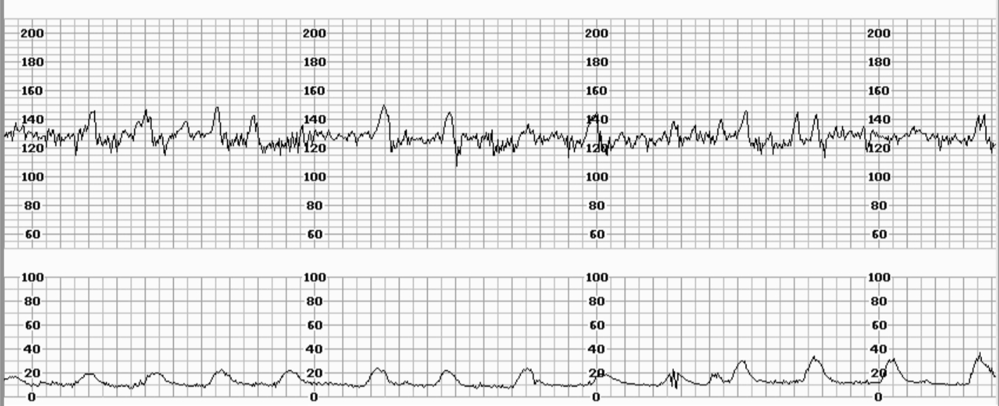
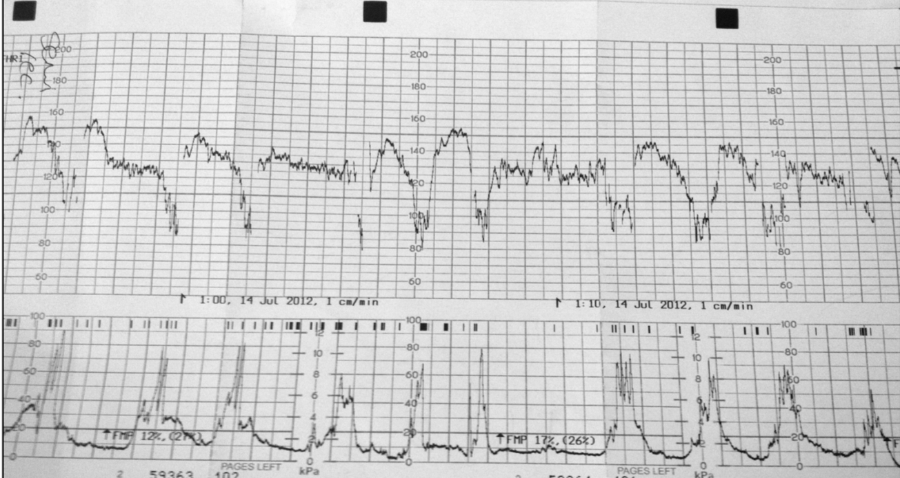
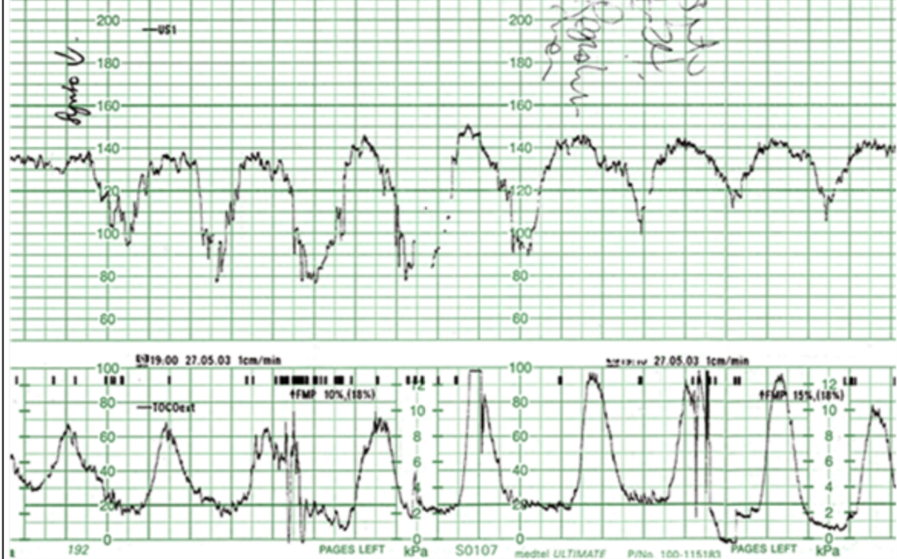

# MONITORIZAÇÃO FETAL INTRAPARTO

Para entender monitorização fetal, você precisa parar de decorar desenhos de ondas e começar a pensar como o feto. O feto no trabalho de parto é um mergulhador que precisa prender a respiração a cada contração. Se o cilindro de oxigênio (a placenta) está bom e o mergulhador é saudável, ele aguenta o percurso. Se o cilindro falha ou o mergulhador já está cansado, ele entra em sofrimento.

Nas provas de residência, o examinador quer saber se você sabe identificar quando esse mergulhador está em perigo e, mais importante, se você sabe o que fazer antes de sair correndo para uma cesariana desnecessária.

*Figura 1 - Explicação esquemática da cardiotocografia: a frequência cardíaca fetal (A) é determinada por ultrassom, e as contrações uterinas são medidas por transdutor de pressão (B). O registro gráfico permite avaliação do bem-estar fetal. Fonte: Steven Fruitsmaak, CC BY 3.0 | Wikimedia Commons*

## Fisiopatologia: Por que o coração do feto muda?

O controle da frequência cardíaca fetal (FCF) é um equilíbrio fino entre o sistema simpático (que acelera) e o parassimpático (que freia, via nervo vago). Quando o feto sofre um insulto, como a redução do fluxo sanguíneo durante uma contração, ele ativa quimiorreceptores e barorreceptores.

A variabilidade, que é aquele aspecto "serrilhado" do traçado, é o sinal mais fidedigno de que o sistema nervoso central está íntegro e oxigenado. Se há oxigênio, o cérebro consegue modular o coração batimento a batimento. Se a variabilidade some, o cérebro "apagou" a modulação para economizar energia. É por isso que, na MedEvo, sempre reforçamos: a variabilidade é o parâmetro isolado mais importante para afastar acidemia fetal.

*Figura 2 - Traçado de CTG típico: A = frequência cardíaca fetal, B = indicador de movimentos fetais percebidos pela mãe, C = movimentação fetal, D = contrações uterinas. A interpretação correta do traçado é essencial para identificar sofrimento fetal. Fonte: PhantomSteve, CC BY-SA 3.0 | Wikimedia Commons*

## Métodos de Monitorização: Onde os alunos erram

Existem dois caminhos: a Ausculta Intermitente (AI) e a Monitorização Fetal Eletrônica (MFE), a famosa cardiotocografia.

### Ausculta Intermitente (AI)

É o padrão-ouro para gestantes de baixo risco. Cuidado com a pegadinha: a AI não é "ouvir de vez em quando". Ela tem técnica e frequência rigorosas. Segundo a FEBRASGO e o Ministério da Saúde, a frequência deve ser:

- **Fase Ativa (1º estágio):** A cada 30 minutos.

- **Período Expulsivo (2º estágio):** A cada 15 minutos.

Se a gestante for de alto risco (ex: pré-eclâmpsia, diabetes, restrição de crescimento), os intervalos caem pela metade: 15 minutos na fase ativa e 5 minutos no expulsivo.

**A técnica correta:** Você deve auscultar o BCF imediatamente após a contração por pelo menos 60 segundos. Por que após? Porque é nesse momento que as desacelerações tardias (as perigosas) aparecem. Se você ouvir apenas durante a contração, pode confundir uma desaceleração precoce (benigna) com algo grave ou simplesmente perder o nadir da queda.

### Cardiotocografia (CTG) Intraparto

Indicada para gestações de alto risco ou quando a ausculta intermitente detecta alguma anormalidade. A CTG avalia quatro parâmetros fundamentais que discutiremos a seguir.

## Os Quatro Pilares da Cardiotocografia

Para interpretar qualquer traçado, você deve seguir esta ordem mental. Se pular etapas, vai errar a questão.

### 1. Linha de Base (FCF Basal)

É a média da FCF em um trecho de 10 minutos, excluindo acelerações e desacelerações.

- **Normal:** 110 a 160 bpm.

- **Bradicardia:** < 110 bpm. (Cuidado: bradicardia leve entre 100-110 com variabilidade mantida pode ser apenas um feto em sono ou uso de medicações maternas).

- **Taquicardia:** > 160 bpm. Frequentemente associada a febre materna, corioamnionite ou uso de beta-agonistas.

### 2. Variabilidade

É a variação batimento a batimento.

- **Ausente:** Amplitude indetectável (linha reta). Sinal de alerta máximo.

- **Comprimida/Mínima:** ≤ 5 bpm. Pode ser sono fetal (dura até 40 min) ou efeito de opioides.

- **Moderada (Normal):** 6 a 25 bpm. É o que queremos ver. Indica bem-estar.

- **Aumentada (Saltatória):** > 25 bpm. Frequentemente vista em episódios agudos de hipóxia ou compressão de cordão.

### 3. Acelerações

Aumento abrupto da FCF (pico em < 30 segundos).

- Em gestações > 32 semanas: Aumento de ≥ 15 bpm por ≥ 15 segundos.

- Em gestações < 32 semanas: Aumento de ≥ 10 bpm por ≥ 10 segundos.
A presença de acelerações é um excelente sinal de reatividade, mas sua ausência durante o trabalho de parto não define sofrimento fetal.

### 4. Desacelerações (DIPs)

Aqui é onde as bancas fazem a festa. Você precisa diferenciar o mecanismo fisiopatológico de cada uma.

| Tipo de Desaceleração | Mecanismo | Relação com a Contração | Significado Clínico |
| --- | --- | --- | --- |
| **Precoce (DIP I)** | Compressão Cefálica | Coincide (Nadir = Pico) | Benigna (Vagal) |
| **Tardia (DIP II)** | Insuficiência Placentária | Atrasada (Nadir após o Pico) | Patológica (Hipóxia) |
| **Variável (DIP III)** | Compressão de Cordão | Variável (Formato em 'V', 'W' ou 'U') | Suspeita (Depende da gravidade) |

**Dica do Dr. Will:** Se a questão mostrar uma desaceleração que "espelha" a contração (começa e termina junto com ela), é DIP I. O tratamento? Nada. Apenas acompanhe. É o feto apertando a cabeça no canal de parto, estimulando o vago e reduzindo a FC reflexamente.

## Desacelerações Variáveis: O "Coringa" do Cordão

As desacelerações variáveis (DIP III) são as mais comuns no trabalho de parto. Elas ocorrem por compressão do cordão umbilical. O feto "pisa" no cordão, a pressão sobe, o vago dispara e a FC cai bruscamente.

Elas são chamadas de "variáveis" porque não têm compromisso com a contração. Podem ocorrer antes, durante ou depois. O que define se elas são perigosas é a presença de sinais de alerta (overshoot, retorno lento à linha de base, perda de variabilidade dentro da desaceleração).

Se você encontrar uma DIP variável em "W" ou com perda de variabilidade, o feto está perdendo a capacidade de compensar aquela compressão. A primeira medida aqui é sempre a mudança de decúbito materno para tentar "desapertar" o cordão.

## Classificação em Categorias (ACOG/FEBRASGO)

Esta tabela você deve levar para a prova e para a vida. Ela dita a conduta imediata.

| Categoria | Descrição | Significado | Conduta |
| --- | --- | --- | --- |
| **I (Normal)** | Basal 110-160, Variabilidade moderada, Sem DIP II ou III. | Feto hígido, sem acidemia. | Expectante / Rotina. |
| **II (Indeterminada)** | Tudo que não é I nem III (ex: taquicardia, variabilidade mínima). | Não prediz acidemia, mas exige vigilância. | Reanimação intrauterina e reavaliação. |
| **III (Anormal)** | Variabilidade ausente + (DIP II recorrente, DIP III recorrente ou Bradicardia) OU Padrão Sinusoide. | Alta probabilidade de acidemia grave. | Resolução imediata do parto. |

**O Padrão Sinusoide:** É uma linha ondulada suave, como uma onda senoidal perfeita. Isso não é variabilidade normal. É sinal de anemia fetal grave (ex: isoimunização Rh) ou hipóxia terminal. É Categoria III direta.

## Ressuscitação Intrauterina: O que fazer antes da Cesárea?

Muitos alunos acham que viu um DIP II, é cesárea. Errado. O primeiro passo é tentar reverter a causa da hipóxia. Pense no mnemônico dos "O's":

- **O**citocina: Desligue imediatamente. Se o útero está contraindo demais (taquissistolia), o feto não tem tempo de oxigenar entre as contrações.

- **O**xigênio: Oferecer máscara de O2 para a mãe (embora controverso em evidências recentes, ainda é conduta de diretriz e de prova).

- **O**utro lado: Mude a paciente para decúbito lateral esquerdo (tira o peso do útero da veia cava, melhorando o retorno venoso e o débito cardíaco).

- **O**uro (Líquidos): Hidratação venosa vigorosa (bolus de Ringer Lactato ou SF 0,9%) para tratar hipotensão materna, comum após analgesia.

Se após essas medidas (e talvez o uso de um uterolítico como a Terbutalina se houver taquissistolia persistente) o traçado não melhorar em 20 a 30 minutos, aí sim partimos para a via de parto mais rápida.

## Casos Especiais e Tomada de Decisão

### O Período Expulsivo e o Fórceps

Imagine uma paciente em expulsivo (dilatação total), feto em plano +3 de De Lee, variedade de posição Occipital Esquerda Transversa (OET). De repente, bradicardia fetal mantida de 80 bpm.
Você vai fazer cesárea? Não. O feto já está "na porta". A via mais rápida é o parto vaginal operatório (Fórceps de Simpson ou vácuo-extrator). Lembre-se: para usar fórceps, o colo deve estar totalmente dilatado e a cabeça deve estar encaixada (plano 0 ou mais).

### Líquido Meconial

Líquido meconial isolado não é sofrimento fetal. É um sinal de alerta. Se o líquido é meconial, mas a CTG é Categoria I, a conduta é expectante. O sofrimento fetal agudo é um diagnóstico clínico-eletrônico (alteração de BCF), não apenas visual (cor do líquido).

### Estimulação do Couro Cabeludo Fetal

Se você tem uma CTG Categoria II com variabilidade mínima e está na dúvida se o feto está apenas dormindo, você pode realizar a estimulação digital do couro cabeludo durante o toque vaginal. Se o feto responder com uma aceleração da FCF, isso tem um valor preditivo positivo de quase 100% para ausência de acidemia no momento.

## Vitalidade Neonatal: O Escore de Apgar

O Apgar avalia a adaptação do recém-nascido à vida extrauterina. Ele é calculado no 1º e no 5º minuto.

| Sinal | 0 Pontos | 1 Ponto | 2 Pontos |
| --- | --- | --- | --- |
| **F**requência Cardíaca | Ausente | < 100 bpm | > 100 bpm |
| **R**espiração | Ausente | Fraca/Irregular | Forte/Choro |
| **T**ônus Muscular | Flácido | Flexão de extremidades | Movimentação ativa |
| **I**rritabilidade Reflexa | Sem resposta | Careta | Espirro/Tosse/Choro |
| **C**or | Cianose/Palidez | Corpo rosado, extrem. azuis | Totalmente rosado |

**Interpretação Crítica:**

- **Apgar de 1º minuto:** Reflete o que aconteceu no parto. Um valor baixo aqui indica necessidade de manobras de reanimação, mas não prevê o futuro da criança.

- **Apgar de 5º minuto:** É o melhor indicador de prognóstico neurológico a longo prazo e da eficácia da reanimação.

**Erro clássico de prova:** Dizer que o Apgar baixo define asfixia neonatal. Para diagnosticar asfixia, você precisa de mais: acidose metabólica no sangue do cordão (pH < 7,00), déficit de bases ≥ 12 mmol/L e manifestações neurológicas (encefalopatia). O Apgar é apenas um dos componentes.

## Pontos-Chave para Prova

- **Variabilidade Moderada:** É o sinal mais importante de que o feto NÃO está em acidemia.

- **DIP I (Precoce):** Nadir coincide com o pico da contração. Causa: compressão cefálica. Conduta: expectante.

- **DIP II (Tardia):** Nadir ocorre após o pico da contração. Causa: insuficiência uteroplacentária. Conduta: reanimação intrauterina; se não resolver, parto.

- **DIP III (Variável):** Sem relação fixa com a contração, formato em V ou W. Causa: compressão de cordão. Conduta: mudança de decúbito.

- **CTG Categoria I:** FCF 110-160, variabilidade moderada, sem DIP II ou III. Acelerações podem ou não estar presentes.

- **CTG Categoria III:** Variabilidade ausente + DIP II ou III recorrentes ou bradicardia. Conduta: parto imediato.

- **Taquissistolia:** > 5 contrações em 10 minutos. É a causa mais comum de DIP II iatrogênico por uso excessivo de ocitocina.

- **Reanimação Intrauterina:** Decúbito lateral esquerdo, suspender ocitocina, hidratação venosa e oxigênio.

- **Ausculta Intermitente:** No baixo risco, 30/30 min na fase ativa e 15/15 min no expulsivo. Sempre após a contração.

- **Apgar:** Avalia adaptação imediata. FC é o parâmetro mais importante na reanimação neonatal.

- **Bradicardia no Expulsivo:** Se o feto estiver em plano baixo (+3 ou +4), a conduta é abreviar o parto com fórceps ou vácuo, não cesárea.

- **Padrão Sinusoide:** Indica anemia fetal grave ou hipóxia terminal. Categoria III.

- **Mecônio:** Não é sinônimo de sofrimento fetal agudo, mas exige vigilância rigorosa da FCF.

- **O que NÃO fazer:** Não indicar cesárea para DIP I. Não ignorar perda de variabilidade mesmo com FC basal normal. 🧠

 Cópia offline para consulta pessoal.
 Fonte original:
 [https://www.medevo.com.br/material-apoio/ler/bd683e4c-f981-4e1f-b1ca-87805f12737d](https://www.medevo.com.br/material-apoio/ler/bd683e4c-f981-4e1f-b1ca-87805f12737d)
