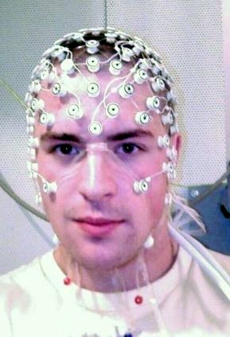

# MORTE ENCEFÁLICA E DOAÇÃO DE ÓRGÃOS

Entender Morte Encefálica (ME) não é apenas decorar um protocolo; é compreender o momento em que o indivíduo deixa de existir como unidade biológica integrada, embora o coração ainda pulse. Para as bancas de residência, esse tema é um "prato cheio" porque mistura legislação rigorosa, fisiologia aplicada e semiologia neurológica.

No Brasil, o diagnóstico de ME é definido pela Resolução CFM nº 2.173/2017. Esqueça qualquer norma anterior. O que vale hoje é o que discutiremos aqui. O ponto de partida é entender que a ME é a parada irreversível de todas as funções do encéfalo (cérebro e tronco encefálico).

*Figura 1 - Cintilografia cerebral com Tc-99m Neurolite demonstrando ausência de fluxo sanguíneo intracraniano e sinal do nariz quente (hot-nose sign), achado compatível com morte encefálica. Fonte: JasonRobertYoungMD, CC BY-SA 4.0 | Wikimedia Commons*

## Pré-requisitos para Iniciar o Protocolo

Antes de você sequer tocar no paciente para testar reflexos, você precisa garantir que ele tem condições de ser testado. Muitos alunos erram questões por "atropelarem" essa fase. O protocolo de ME não pode ser iniciado em qualquer paciente em coma.

### 1. Causa do Coma Conhecida e Irreversível

Você precisa de uma imagem (Tomografia ou Ressonância) ou um quadro clínico evidente (ex: parada cardiorrespiratória prolongada com anoxia documentada) que justifique o coma. Se o paciente chega em coma de causa desconhecida, você não abre protocolo de ME. Primeiro descobre a causa, depois testa.

### 2. Estabilidade Hemodinâmica e Oxigenação

O encéfalo precisa de oxigênio e pressão para funcionar. Se o paciente está chocado ou hipoxêmico, a ausência de reflexos pode ser apenas uma depressão funcional temporária.

- **Temperatura corporal:** Deve ser superior a 35°C. A hipotermia protege o cérebro e "imita" a morte encefálica.

- **Saturação de Oxigênio (SpO2):** Deve estar acima de 94%.

- **Pressão Arterial:** Pressão Arterial Média (PAM) ≥ 65 mmHg ou Pressão Arterial Sistólica (PAS) ≥ 100 mmHg (para adultos).

### 3. Ausência de Fatores Confundidores

Aqui é onde o Dr. Will sempre alerta: cuidado com as drogas! Sedativos e bloqueadores neuromusculares (BNM) invalidam o exame.

- **Sedação:** Você deve aguardar pelo menos 4 a 5 meias-vidas da droga utilizada. O Fentanil, por exemplo, tem uma meia-vida de cerca de 120 minutos, mas em infusão contínua prolongada, isso pode aumentar drasticamente.

- **Distúrbios Metabólicos:** Distúrbios eletrolíticos graves (como sódio < 110 ou > 160 mEq/L) ou distúrbios ácido-básicos extremos devem ser corrigidos antes.

### 4. Período de Observação Hospitalar

Para lesões agudas (como trauma ou AVC), o paciente deve estar sob observação hospitalar por no mínimo 6 horas. Se a causa for hipóxia-isquemia (pós-PCR), esse tempo sobe para 24 horas. As bancas adoram trocar esses números.

## O Exame Clínico: O "Checklist" do Tronco Encefálico

O diagnóstico exige dois exames clínicos realizados por médicos diferentes. Um deles deve ser obrigatoriamente um especialista (neurologista, neurocirurgião, intensivista ou emergencista) ou um médico com curso de capacitação em ME. O outro médico pode ser de qualquer área, desde que tenha um ano de experiência no atendimento de pacientes em coma.

O intervalo entre os dois exames em adultos é de **1 hora**. Guarde esse número; ele mudou na última resolução (antigamente eram 6 horas).

O exame clínico busca a ausência de reflexos que dependem do tronco encefálico. O paciente deve estar em Coma de Glasgow 3 (ou 4, se considerarmos o tubo orotraqueal).

### Tabela 1: Reflexos de Tronco Encefálico e sua Significado Anatômico

| Reflexo | Como testar | Localização no Tronco | Resposta na ME |
| --- | --- | --- | --- |
| **Fotomotor** | Luz intensa nas pupilas | Mesencéfalo | Pupilas fixas e arreativas (médias ou midriáticas) |
| **Corneo-palpebral** | Tocar a córnea com gaze/algodão | Ponte | Ausência de fechamento da pálpebra |
| **Oculocefálico** | "Olhos de boneca" (girar a cabeça) | Ponte / Mesencéfalo | Olhos acompanham o movimento da cabeça (fixos) |
| **Oculovestibular** | Água gelada no conduto auditivo | Ponte / Bulbo | Ausência de desvio ocular após 1 minuto |
| **Tosse** | Estimular a carina com sonda de aspiração | Bulbo | Ausência de contração diafragmática ou tosse |

**Cuidado:** O estímulo doloroso esternal ou no leito ungueal serve para avaliar o coma (Glasgow), mas a resposta motora de origem medular (reflexos espinais) **não exclui** o diagnóstico de ME. O paciente pode ter reflexos de retirada ou sinal de Lázaro e ainda assim estar em morte encefálica. O que não pode haver é resposta supraespinal (decorticação ou descerebração).

## Teste da Apneia: O Ponto Crítico

Este é, sem dúvida, o tema mais cobrado em provas sobre ME. O objetivo é provar que o centro respiratório (no bulbo) não funciona nem sob o estímulo máximo: a hipercapnia.

### Como realizar o teste?

- **Pré-oxigenação:** Ventile o paciente com O2 a 100% por 10 minutos para garantir que ele não dessature durante o teste.

- **Gasometria Basal:** A PaCO2 inicial deve estar entre 35 e 45 mmHg. Se o paciente já começa com PaCO2 > 60 mmHg, o teste está contraindicado naquele momento.

- **Desconexão do Ventilador:** Mantém-se apenas um fluxo de O2 (cateter na traqueia).

- **Observação:** Observar por cerca de 8 a 10 minutos se há qualquer movimento respiratório.

- **Gasometria Final:** Coleta-se nova gasometria.

**Resultado Positivo (Confirma ME):** Ausência de movimentos respiratórios E PaCO2 final > 55 mmHg.

**Por que 55 mmHg?** Porque este é o limiar de segurança onde, em um cérebro vivo, o drive respiratório seria obrigatoriamente disparado. Se chegar a 55 e ele não respirar, o bulbo está morto.

**Interrupção do teste:** Se o paciente apresentar hipotensão grave, arritmia instável ou dessaturação importante (SpO2 < 85%), o teste deve ser interrompido. Se a gasometria final não atingir 55 mmHg, o teste é inconclusivo e deve ser repetido após estabilização.

## Exames Complementares

No Brasil, o exame complementar é **obrigatório**. Não importa se os dois clínicos foram perfeitos. Você precisa de um método que demonstre:

- Ausência de atividade elétrica (ex: Eletroencefalograma - EEG).

- Ausência de fluxo sanguíneo cerebral (ex: Arteriografia, Doppler Transcraniano, Angiotomografia).

- Ausência de atividade metabólica (ex: Cintilografia).

**Dica de Prova:** O Doppler Transcraniano é muito querido pelas bancas por ser não invasivo e beira-leito. Os achados compatíveis com ME são: sístoles curtas (espículas sistólicas) ou fluxo reverberante.

## Morte Encefálica em Pediatria

Crianças não são "adultos pequenos" no protocolo de ME. O encéfalo infantil tem uma plasticidade e resistência diferentes, por isso os intervalos entre os exames clínicos são maiores.

### Tabela 2: Intervalos para Diagnóstico de ME em Pediatria

| Faixa Etária | Intervalo entre Exames Clínicos |
| --- | --- |
| 7 dias a < 2 meses | 24 horas |
| 2 meses a < 24 meses | 12 horas |
| > 2 anos | 1 hora (igual ao adulto) |

Lembre-se: abaixo de 7 dias de vida, a legislação brasileira não define critérios claros para ME, sendo um tema de extrema cautela clínica.

## Manutenção do Potencial Doador (O Paciente ASA VI)

Uma vez diagnosticada a ME, o paciente torna-se, legalmente, um cadáver. Se houver intenção de doação, ele passa a ser chamado de "Doador de Órgãos". Na classificação da ASA (American Society of Anesthesiologists), esse paciente é um **ASA VI**.

A fisiopatologia da ME é um caos sistêmico. Quando o tronco "morre", ocorre uma descarga maciça de catecolaminas (tempestade autonômica), seguida por um colapso vasomotor (vasoplegia).

### O Manejo Clínico (Regra dos 100)

Para manter os órgãos viáveis, o intensivista/cirurgião busca metas hemodinâmicas:

- PAM > 65 mmHg (uso de noradrenalina é comum, mas doses altas são deletérias para o enxerto).

- Débito urinário entre 1-3 ml/kg/h.

- Saturação de O2 > 94%.

**Diabetes Insipidus (DI):** É quase universal na ME pela ausência de ADH (vasopressina). O paciente começa a urinar volumes absurdos (poliúria) com urina diluída. O tratamento é a reposição de volume e o uso de Vasopressina ou Desmopressina. O Dr. Will lembra que a Vasopressina é excelente aqui porque ajuda na pressão e trata o DI simultaneamente.

## Doação de Órgãos: Legislação e Ética

No Brasil, a doação é **consentida pela família**. Não importa se o paciente escreveu em vida que queria ser doador ou se está no RG (essa lei do RG caiu há anos). A palavra final é dos familiares de primeiro ou segundo grau ou cônjuge.

### Notificação Compulsória

A morte encefálica é uma doença de notificação compulsória. Mesmo que a família diga de antemão que não quer doar, você **é obrigado** por lei a notificar a Central de Transplantes assim que suspeitar do diagnóstico. O diagnóstico de ME não é feito para doar órgãos; é feito para atestar o óbito.

### Contraindicações à Doação

Nem todo mundo pode ser doador. As bancas adoram as contraindicações absolutas.

### Tabela 3: Contraindicações Absolutas vs. Relativas

| Tipo de Contraindicação | Exemplos |
| --- | --- |
| **Absoluta** | HIV (exceto para receptor HIV+), HTLV I e II, Tuberculose ativa, Câncer invasivo (exceto alguns tumores de SNC e carcinoma basocelular), Sepse refratária. |
| **Relativa** | Idade avançada, Infecções controladas, Hepatite B ou C (pode-se doar para receptores já infectados), Hipertensão/Diabetes (avalia-se a função do órgão). |

**Atenção:** O câncer de pele basocelular e tumores primários do SNC (que raramente dão metástase fora do neuroeixo) **não** contraindicam a doação.

## Logística e Tempos de Isquemia

A retirada dos órgãos segue uma ordem lógica baseada na resistência de cada tecido à falta de sangue (isquemia fria).

- **Coração e Pulmão:** São os mais sensíveis. Tempo de isquemia ideal < 4-6 horas.

- **Fígado:** Suporta cerca de 12 horas.

- **Pâncreas:** Cerca de 12-15 horas.

- **Rins:** São os mais resistentes, podendo aguardar até 24-36 horas (especialmente se em máquinas de perfusão).

Se o paciente evoluir com parada cardiorrespiratória (morte circulatória) antes da captação de órgãos, no Brasil, geralmente só se aproveitam os **tecidos**: córneas, pele, ossos e válvulas cardíacas. Isso porque os órgãos sólidos sofrem lesão isquêmica irreversível muito rápido após a parada do fluxo.

*Figura 2 - Touca com eletrodos para eletroencefalograma (EEG). O EEG é um dos exames complementares utilizados na confirmação de morte encefálica, devendo demonstrar inatividade elétrica cerebral (silêncio elétrico). Fonte: Thuglas, Domínio Público | Wikimedia Commons*

## Diagnóstico Diferencial e Erros Comuns

O maior medo de um médico é declarar ME em alguém que está apenas profundamente sedado ou em "locked-in syndrome" (síndrome do encarceramento).

- **Síndrome do Encarceramento:** O paciente tem lesão na ponte, está consciente, mas não se mexe. **Diferença:** Ele preserva o reflexo fotomotor (mesencéfalo) e, geralmente, movimentos oculares verticais.

- **Hipotermia Grave:** Pode abolir todos os reflexos e o EEG. Por isso, a temperatura > 35°C é inegociável.

- **Drogas:** O uso de bloqueadores neuromusculares pode simular apneia e ausência de reflexos. O uso do "trem de quatro" (TOF) ajuda a descartar o bloqueio residual.

Na MedEvo, sempre reforçamos: se houver dúvida, não feche o protocolo. Estabilize o paciente, espere a droga clarear e recomece.

## Pontos-Chave para Prova 🧠

- **Critério Brasileiro (CFM 2173/17):** 2 exames clínicos + 1 teste de apneia + 1 exame complementar.

- **Médicos:** Dois diferentes, um deles deve ser especialista (Neuro, Intensivista, Emergencista) ou capacitado.

- **Intervalo Adulto:** 1 hora entre os dois exames clínicos.

- **Temperatura Mínima:** 35°C para iniciar o protocolo.

- **Teste da Apneia Positivo:** Ausência de movimentos respiratórios com PaCO2 final > 55 mmHg.

- **Contraindicação ao Teste da Apneia:** PaCO2 basal > 60 mmHg ou instabilidade hemodinâmica grave durante o procedimento.

- **Exame Complementar:** Obrigatório no Brasil (EEG, Doppler, Arteriografia ou Cintilografia).

- **Reflexos Espinais:** Movimentos de braços ou pernas (reflexos de medula) NÃO excluem morte encefálica.

- **Notificação:** É compulsória e deve ser feita na suspeita, antes mesmo de terminar o protocolo.

- **Consentimento:** No Brasil, a decisão é EXCLUSIVAMENTE da família (cônjuge ou parentes até 2º grau).

- **Contraindicações Absolutas:** HTLV I/II, Tuberculose ativa, Câncer invasivo (maioria), Sepse não controlada.

- **Diabetes Insipidus:** Comum na ME; tratar com Vasopressina (ajuda na PAM e na poliúria).

- **ASA VI:** Classificação exclusiva do doador de órgãos em morte encefálica.

- **Ordem de Isquemia:** Coração (mais sensível) -> Pulmão -> Fígado -> Rim (mais resistente).

- **Fator Confundidor Clássico:** Intoxicação por barbitúricos ou sedação contínua (exige espera de 4-5 meias-vidas).

- **Estímulo Doloroso:** Deve ser realizado em região supraorbital ou leito ungueal para avaliar resposta motora supraespinal. Estímulo esternal não é o padrão-ouro para reflexos de tronco.

 Cópia offline para consulta pessoal.
 Fonte original:
 [https://www.medevo.com.br/material-apoio/ler/5dc51638-e94e-402b-ae1c-0d57b04ba7e4](https://www.medevo.com.br/material-apoio/ler/5dc51638-e94e-402b-ae1c-0d57b04ba7e4)
