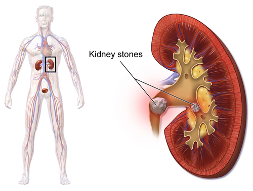
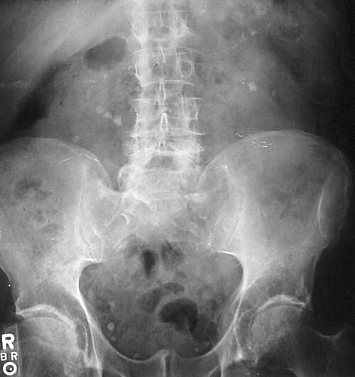
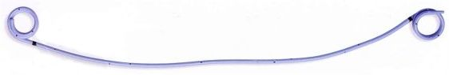
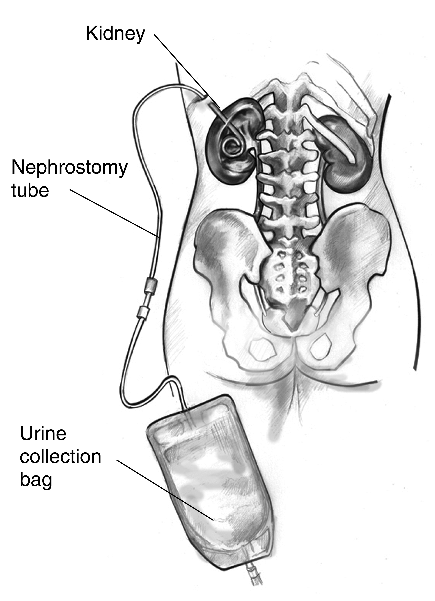
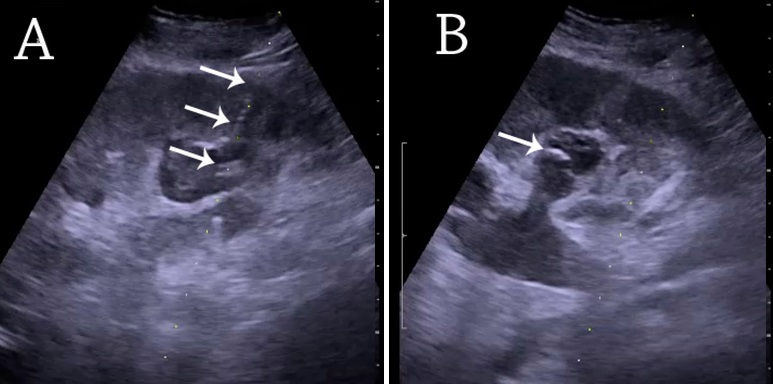

# NEFROLITÍASE

A nefrolitíase não é apenas uma "pedra no rim". Para a sua prova de residência e para a sua vida prática, entenda que ela é a manifestação clínica de um distúrbio metabólico subjacente. O cálculo é o sintoma, não a doença em si. Se você apenas retirar o cálculo e não tratar a causa, o paciente voltará em dois anos com o mesmo problema.

*Figura 1 - Ilustração anatômica demonstrando cálculos renais em diferentes localizações do sistema coletor renal. Fonte: BruceBlaus, CC BY 3.0 | Wikimedia Commons*

## Fisiopatologia: O Porquê da Formação

Para um cristal se formar na urina, precisamos de um desequilíbrio entre o que favorece a cristalização e o que a inibe. O conceito fundamental aqui é a **supersaturação urinária**.

Imagine um copo de água onde você joga sal. Chega um momento em que o sal não dissolve mais e precipita no fundo. Na urina, isso acontece quando a concentração de solutos (cálcio, oxalato, ácido úrico) excede a capacidade de dissolução do solvente (água).

Existem três pilares que você deve dominar:

- **Excesso de soluto:** Hipercalciúria, hiperoxalúria, hiperuricosúria.

- **Escassez de solvente:** Baixa ingestão hídrica (o fator de risco mais comum e evitável).

- **Falta de inibidores:** O principal é o **citrato**. O citrato se liga ao cálcio na urina, formando um complexo solúvel e impedindo que o cálcio se ligue ao oxalato. Por isso, a hipocitratúria é um fator de risco isolado fortíssimo.

Um detalhe que o Dr. Will sempre reforça nas discussões do MedEvo: a formação do cálculo de oxalato de cálcio (o mais comum) geralmente começa nas **Placas de Randall**. São depósitos de fosfato de cálcio na papila renal que servem como "âncora" para a deposição de oxalato.

## Tipos de Cálculos e Suas Particularidades

As bancas amam cobrar a composição química porque ela dita o tratamento preventivo.

### Cálculos de Cálcio (70 a 80%)

São os mais frequentes. O tipo principal é o **oxalato de cálcio**, seguido pelo fosfato de cálcio.

- **Fatores de risco:** Hipercalciúria idiopática (mesmo com cálcio sérico normal), hiperoxalúria e hipocitratúria.

- **Curiosidade de prova:** A bactéria *Oxalobacter formigenes* no intestino degrada o oxalato. Se o paciente usa muitos antibióticos e perde essa flora, ele absorve mais oxalato e forma mais cálculos.

### Cálculos de Ácido Úrico (5 a 10%)

Aqui está a maior pegadinha de prova: **Cálculos de ácido úrico são radiotransparentes**. Eles não aparecem no Raio-X simples, mas aparecem na Tomografia (TC).

- **O segredo:** O principal fator para sua formação não é apenas o excesso de ácido úrico, mas sim o **pH urinário persistentemente ácido** (abaixo de 5,5). Em meio ácido, o ácido úrico se torna insolúvel.

- **Tratamento clínico:** Alcalinização da urina com citrato de potássio. Se você aumentar o pH para 6,5 a 7,0, o cálculo pode literalmente dissolver.

### Cálculos de Estruvita (Infecciosos)

Compostos por fosfato de amônio e magnésio. Estão associados a infecções por bactérias produtoras de **urease** (como *Proteus mirabilis* e *Klebsiella*).

- **Mecanismo:** A urease quebra a ureia em amônia, o que eleva o pH urinário (urina muito alcalina, pH > 7,5).

- **O perigo:** Formam os **cálculos coraliformes**, que ocupam toda a pelve e cálices renais, destruindo o parênquima por infecção crônica e obstrução.

### Cálculos de Cistina (

| Tipo de Cálculo | Radiopacidade | pH Urinário Associado | Principal Fator de Risco |
| --- | --- | --- | --- |
| Oxalato de Cálcio | Radiopaco | Independente | Baixo volume urinário / Hipercalciúria |
| Ácido Úrico | Radiotransparente | Ácido (< 5,5) | Gota / Síndrome Metabólica |
| Estruvita | Pouco Radiopaco | Alcalino (> 7,5) | Infecção por Proteus/Klebsiella |
| Cistina | Pouco Radiopaco | Ácido | Defeito genético (Cistinúria) |

*Figura 2 - Radiografia abdominal demonstrando nefrolitíase bilateral com múltiplos cálculos radiopacos. Fonte: Bill Rhodes, CC BY 2.0 | Wikimedia Commons*

## Quadro Clínico: A Cólica Nefretica

O paciente clássico chega com uma dor lombar súbita, de forte intensidade, que irradia para o flanco, fossa ilíaca e, muitas vezes, para a região inguinal ou grandes lábios/testículos.

**Por que dói?**
A dor não é causada pela pedra "arranhando" o ureter. A dor é fruto da **obstrução aguda**, que gera aumento da pressão intraureteral e **distensão da cápsula renal**. É por isso que a dor é em cólica: o ureter tenta vencer a obstrução com movimentos peristálticos.

**Sintomas associados:**

- Náuseas e vômitos (reflexo autonômico pelo plexo celíaco).

- Hematúria (presente em 85 a 90% dos casos, mas sua ausência NÃO exclui o diagnóstico).

- Sintomas irritativos (polaciúria, urgência) se o cálculo estiver perto da junção ureterovesical (JUV).

**Exame Físico:**
O sinal clássico é a **Punho-percussão lombar positiva (Sinal de Giordano)**. O paciente geralmente está inquieto, tentando achar uma posição de alívio (diferente do paciente com peritonite, que fica imóvel).

## Diagnóstico Diferencial: Não se deixe enganar

Muitas vezes, a "cólica renal" é outra coisa. Em pacientes idosos com dor súbita e fatores de risco cardiovascular, sempre considere **Aneurisma de Aorta Abdominal roto**.

Outros diferenciais importantes:

- **Apendicite aguda:** Pode simular cálculo no ureter distal à direita.

- **Gravidez ectópica ou Torção de ovário:** Sempre peça teste de gravidez em mulheres em idade fértil.

- **Embolia arterial renal:** Suspeite se o paciente tiver Fibrilação Atrial, dor súbita e hematúria, mas sem evidência de cálculo na imagem.

- **Diverticulite:** Pode simular dor à esquerda.

## Diagnóstico por Imagem

Se a banca perguntar o padrão-ouro: **Tomografia Computadorizada (TC) de abdome e pelve sem contraste (Protocolo para Litíase)**.

**Por que a TC sem contraste?**

- Detecta cálculos de até 1 mm.

- Identifica cálculos radiotransparentes (ácido úrico).

- Avalia complicações (hidronefrose, densificação da gordura perirrenal).

- Permite medir a densidade do cálculo (Unidades Hounsfield - UH), o que ajuda a decidir o tratamento (cálculos > 1000 UH são muito duros para LECO).

**E o Ultrassom (USG)?**
É o exame de escolha para **gestantes e crianças**. É bom para ver cálculos na pelve renal ou na JUV, mas é péssimo para ver o ureter médio. O USG brilha ao detectar a hidronefrose (sinal indireto de obstrução).

**E a Ressonância (RMN)?**
Péssima para ver o cálculo em si (o cálcio não emite sinal), mas excelente para ver dilatação da via urinária em gestantes quando o USG é inconclusivo.

## Manejo da Crise Aguda (Emergência)

O objetivo inicial é **controlar dor, náuseas/vômitos, hidratar conforme necessidade clínica e identificar sinais de complicação**. Na cólica renal, não adianta tentar “lavar o rim” com hiper-hidratação: isso não remove a obstrução e pode aumentar a pressão na pelve renal, piorando a dor. Hidrate se houver hipovolemia, vômitos, febre, sepse ou injúria renal, mas evite soro/água “forçados” como tratamento expulsivo.

### Analgesia e suporte

- **Primeira escolha:** AINEs, se não houver contraindicação. Eles reduzem prostaglandinas, edema local, pressão intrapiélica e dor.

- **Alternativa/complemento:** paracetamol pode ser útil, especialmente quando AINE é arriscado.

- **Resgate:** opioides podem ser usados em dor refratária, mas não são a primeira escolha. Evite meperidina/petidina pelo maior risco de náuseas/vômitos e necessidade de nova analgesia.

- **Antiespasmódicos:** muito usados na prática, mas têm evidência limitada como tratamento isolado.

**Quando internar ou observar em ambiente hospitalar?**

- dor refratária à analgesia adequada;

- náuseas/vômitos persistentes, desidratação ou impossibilidade de via oral;

- febre, calafrios, sepse ou suspeita de infecção associada;

- rim único obstruído, obstrução bilateral, anúria ou injúria renal aguda;

- gestação, imunossupressão, alto risco clínico ou dúvida diagnóstica.

### A urgência urológica máxima: obstrução + infecção

Se o paciente tem **cálculo obstrutivo + febre/ITU/sepse**, trate como **pielonefrite obstrutiva** até prova em contrário. É emergência urológica: a urina infectada está sob pressão e o controle infeccioso depende de drenagem.

**Conduta:** culturas + antibiótico imediato + **descompressão urgente** por cateter duplo J ou nefrostomia percutânea. Não tente resolver definitivamente o cálculo nesse momento; primeiro drene e controle a infecção, depois programe a retirada do cálculo.

> **Frase de prova:** cálculo obstrutivo + infecção = **drenar primeiro, retirar depois**.

## Terapia Medicamentosa Expulsiva (TME / MET)

A TME busca facilitar a eliminação espontânea do cálculo ureteral, principalmente com **alfabloqueadores**. A melhor indicação é o paciente estável, informado, sem complicações, com cálculo ureteral distal maior que 5 mm e geralmente até 10 mm.

- **Melhor cenário:** cálculo ureteral distal de **5–10 mm**, dor controlada, sem infecção e sem perda de função renal.

- **Droga mais cobrada:** tansulosina; outros alfabloqueadores podem ser usados conforme disponibilidade.

- **Uso:** off-label em muitas recomendações, mas frequente na prática e em provas.

- **Suspender/evitar se:** febre, sepse, dor refratária, injúria renal, obstrução importante, rim único obstruído ou necessidade de intervenção ativa.

**Pegadinha:** TME não é tratamento de paciente complicado. Se há infecção, anúria, IRA ou dor intratável, o caminho é drenagem/intervenção, não “esperar sair”.

## Tratamento Intervencionista: procedimentos e como visualizar

A decisão depende de **tamanho, localização, densidade/composição, anatomia, sintomas, função renal, infecção e chance de eliminação espontânea**. O objetivo desta seção é conectar cada procedimento ao que ele faz na prática.

### 1) LECO / SWL / ESWL — litotripsia extracorpórea por ondas de choque

A LECO fragmenta o cálculo por ondas de choque geradas fora do corpo e focalizadas no cálculo. Os fragmentos menores são eliminados pela urina.

**Quando funciona melhor:** cálculos menores, localizáveis, em anatomia favorável, sem infecção/obstrução complicada, sem grande dureza e sem grande distância pele-cálculo.

**Limitações importantes:**

- pode precisar de retratamento;

- menor chance de “stone-free” imediato que a ureteroscopia em alguns cenários;

- pior desempenho em cálculos muito duros, grandes, polo inferior desfavorável ou obesidade importante;

- não é a conduta definitiva inicial em obstrução infectada/sepse.

### 2) Ureteroscopia rígida/flexível e RIRS

A ureteroscopia é um procedimento endoscópico retrógrado: o urologista entra pela uretra, passa pela bexiga, acessa o ureter e pode alcançar o rim com ureteroscópio flexível. Quando o procedimento é intrarrenal retrógrado, costuma ser chamado de **RIRS**.

**Como trata:** visualiza diretamente o cálculo, fragmenta com laser — como Ho:YAG ou thulium fiber laser — e pode retirar fragmentos com cesta.

**Vantagens:** maior chance de ficar livre de cálculo em uma sessão quando comparada à LECO em vários cenários, especialmente em cálculos ureterais maiores, cálculos duros, obesidade ou baixa chance de sucesso da LECO.

**Stent após ureteroscopia:** não é obrigatório em casos não complicados. Deve ser considerado quando há edema, lesão ureteral, infecção, fragmentos residuais, risco de obstrução, ureter estreito ou procedimento mais traumático.

### 3) Cateter duplo J — drenagem interna rim → bexiga

O cateter duplo J é um stent ureteral interno. Uma extremidade fica enrolada na pelve renal e a outra na bexiga, mantendo drenagem do rim para a bexiga mesmo quando o ureter está edemaciado, obstruído ou manipulado.

*Figura 3 - Cateter ureteral do tipo pigtail/duplo J. As duas extremidades enroladas ajudam a manter o cateter fixo na pelve renal e na bexiga, permitindo drenagem interna do rim para a bexiga. Fonte: Hildpeyi, CC BY-SA 3.0/GFDL, via Wikimedia Commons.*

**Usos principais:**

- drenagem urgente em obstrução infectada;

- alívio temporário de obstrução;

- pós-ureteroscopia complicada ou com risco de edema/obstrução;

- preparo/ponte até tratamento definitivo;

- dor/obstrução enquanto aguarda resolução definitiva.

**Efeitos adversos típicos:** urgência urinária, polaciúria, hematúria, desconforto suprapúbico e dor lombar ao urinar. Em provas, lembre que ele drena internamente, mas pode piorar qualidade de vida por sintomas relacionados ao stent.

### 4) Nefrostomia percutânea — drenagem externa do sistema coletor

A nefrostomia é um cateter colocado diretamente no sistema coletor renal por punção percutânea guiada por imagem, drenando urina para bolsa externa. É alternativa ao duplo J para descompressão, e os dois métodos são considerados eficazes para drenagem urgente.

*Figura 4 - Desenho didático de nefrostomia percutânea: o cateter entra pela pele, fica com a ponta enrolada no sistema coletor renal e drena urina para uma bolsa externa. Fonte: NIDDK / U.S. Department of Health and Human Services, domínio público, via Wikimedia Commons.*\n\nNa prática, a punção e o posicionamento podem ser guiados por imagem. O ultrassom ajuda a identificar hidronefrose, orientar o trajeto e confirmar a posição do cateter no sistema coletor.

*Figura 5 - Ultrassonografia de nefrostomia percutânea em rim com hidronefrose. As setas destacam o trajeto/cateter e o pigtail no sistema coletor, conectando a imagem real ao procedimento descrito acima. Fonte: Hansen, Nielsen e Ewertsen, CC BY 4.0, via Wikimedia Commons.*

**Quando preferir/considerar nefrostomia:**

- sepse obstrutiva com necessidade de drenagem rápida;

- falha ou impossibilidade de acesso retrógrado para duplo J;

- anatomia difícil;

- obstrução severa;

- paciente instável em que a drenagem percutânea seja mais viável;

- necessidade de acesso futuro para tratamento percutâneo.

### 5) Nefrolitotripsia percutânea — NLPC / PCNL

A NLPC é um procedimento terapêutico, não apenas de drenagem: faz-se acesso percutâneo ao rim, dilata-se o trajeto, introduz-se nefroscópio e o cálculo é fragmentado/removido diretamente.

**Indicação clássica:** cálculos renais grandes, especialmente **> 2 cm**, cálculos coraliformes, múltiplos/complexos ou quando LECO/URS não são adequadas.

**Riscos e cuidados:** exige planejamento, cultura urinária/antibiótico quando indicado e atenção a sangramento, febre, sepse, lesões adjacentes e complicações torácicas, especialmente em acessos altos.

## Escolha do procedimento: tabela de decisão

| Situação clínica | Conduta típica |
| --- | --- |
| Cálculo pequeno, paciente estável, sem infecção, dor controlada | Observação + analgesia ± TME |
| Cálculo ureteral distal 5–10 mm, sem complicações | TME com alfabloqueador pode ser opção |
| Cálculo ureteral com baixa chance de eliminação, dor persistente ou falha de TME | Ureteroscopia ou LECO conforme tamanho/localização/anatomia |
| Cálculo ureteral > 10 mm | Ureteroscopia frequentemente preferida; LECO pode ser opção em cenário favorável |
| Cálculo renal < 2 cm | LECO ou ureteroscopia flexível/RIRS conforme localização, densidade e anatomia |
| Cálculo renal > 2 cm ou coraliforme | NLPC/PCNL geralmente é primeira escolha |
| Obstrução + sepse/ITU/anúria | Antibiótico + descompressão urgente: duplo J ou nefrostomia |
| Dor intratável apesar de analgesia | Drenagem ou remoção ativa do cálculo |

## Procedimentos em uma frase

| Procedimento | O que faz | Melhor uso |
| --- | --- | --- |
| **Conservador** | Analgesia, antiemético, hidratação adequada e observação | Cálculo pequeno, sem infecção, sem IRA, dor controlada |
| **TME/MET** | Alfabloqueador facilita expulsão ureteral | Ureteral distal > 5 mm, especialmente 5–10 mm, sem complicações |
| **URS/RIRS** | Endoscopia retrógrada + laser + retirada de fragmentos | Cálculo ureteral/renal; maior chance de stone-free em uma sessão |
| **LECO/SWL** | Ondas de choque externas fragmentam cálculo | Cálculos favoráveis, menores, localizáveis, sem infecção complicada |
| **NLPC/PCNL** | Acesso percutâneo ao rim + fragmentação/remoção direta | Cálculo renal grande, > 2 cm, coraliforme ou complexo |
| **Duplo J** | Drena internamente rim → bexiga | Obstrução, sepse obstrutiva, pós-procedimento, edema ureteral |
| **Nefrostomia** | Drena externamente rim → bolsa | Sepse obstrutiva, falha/impossibilidade de duplo J, urgência |

## Avaliação Metabólica e Prevenção

Passada a crise, o paciente deve ser investigado, especialmente se for jovem, tiver cálculos recorrentes ou história familiar. O Dr. Will costuma dizer que a investigação metabólica é como um "trabalho de detetive" da urina de 24 horas.

### O que pedir?

- Sangue: Cálcio total e iônico, Creatinina, Ácido Úrico, PTH (se cálcio alto).

- Urina de 24 horas: Volume total, Cálcio, Oxalato, Citrato, Ácido Úrico, Sódio e Creatinina.

### Orientações Dietéticas (Cai muito!)

Aqui é onde os alunos mais erram. Preste atenção:

- **Ingestão Hídrica:** Meta de volume urinário > 2 a 2,5 litros por dia.

- **Cálcio na dieta:** **NÃO RESTRINGIR**. A restrição de cálcio aumenta a absorção de oxalato no intestino, piorando a formação de cálculos. O cálcio deve ser normal (1000-1200 mg/dia).

- **Sódio (Sal):** Restrição rigorosa (< 2g de sódio ou 5g de sal). O sódio "puxa" o cálcio para a urina. Menos sal = menos cálcio urinário.

- **Proteína Animal:** Evitar excessos. O metabolismo de proteínas gera carga ácida, o que reduz o citrato e aumenta o cálcio urinário.

- **Vitamina C:** Evitar suplementação > 1g/dia, pois ela é metabolizada em oxalato.

### Tratamento Farmacológico Preventivo

- **Hipercalciúria Idiopática:** Diuréticos Tiazídicos (**Clortalidona** ou Hidroclorotiazida). Eles aumentam a reabsorção de cálcio no túbulo distal, reduzindo sua excreção na urina.

- **Hipocitratúria:** Citrato de Potássio. Além de repor o inibidor, alcaliniza a urina.

- **Hiperuricosúria:** Alopurinol (se houver excesso de ácido úrico) e alcalinização da urina.

## Situações Especiais

### Gestantes

A nefrolitíase é a causa mais comum de dor abdominal não obstétrica que leva à internação.

- **Diagnóstico:** USG é a primeira linha. Se inconclusivo, RMN. TC é evitada (especialmente no 1º trimestre).

- **Tratamento:** Conservador na maioria das vezes. Se precisar intervir, o padrão é a colocação de cateter Duplo J ou ureteroscopia. LECO é **contraindicação absoluta**.

### Hiperparatireoidismo Primário

Sempre que vir um paciente com cálculos recorrentes e **hipercalcemia**, dose o PTH. O tratamento aqui não é dieta, é a retirada da paratireoide doente.

### Hiperoxalúria Entérica

Pacientes com Doença de Crohn ou que fizeram cirurgia bariátrica (Bypass em Y de Roux) absorvem mais oxalato porque as gorduras não absorvidas se ligam ao cálcio no intestino, deixando o oxalato livre para ser absorvido.

- **Dica:** Nesses casos, orientamos aumentar a ingestão de cálcio junto com as refeições para "sequestrar" o oxalato no lúmen intestinal.

## Pontos-Chave para Prova

- **Padrão-ouro diagnóstico:** TC de abdome e pelve sem contraste.

- **Cálculo de Ácido Úrico:** É radiotransparente no Raio-X, mas visível na TC. Tratamento é alcalinizar a urina (Citrato de K).

- **Cálculo de Estruvita:** Coraliforme, pH alcalino, bactéria produtora de urease (*Proteus*).

- **Cistinúria:** Cristais hexagonais. Tratamento com alcalinização intensa.

- **Analgesia na crise:** AINEs são a primeira escolha (ex: Cetoprofeno).

- **Pielonefrite Obstrutiva:** Emergência! Antibiótico + Desobstrução (Duplo J ou Nefrostomia). NÃO tentar litotripsia na infecção aguda.

- **Terapia Medicamentosa Expulsiva (TME):** Tansulosina (alfa-bloqueador) para cálculos ureterais < 10 mm.

- **Indicação de NLPC:** Cálculos renais > 2 cm ou coraliformes.

- **LECO:** Contraindicada em gestantes e aneurismas de aorta. Menos eficaz se densidade > 1000 UH.

- **Dieta:** Aumentar água, reduzir sal, reduzir proteína animal e **MANTER** cálcio normal.

- **Vitamina C:** Suplementação excessiva (> 1g) é fator de risco (aumenta oxalato).

- **Hipercalciúria:** Tratar com Tiazídicos (Clortalidona/Hidroclorotiazida).

- **Citrato:** É o principal inibidor natural. Sua falta (hipocitratúria) causa cálculos.

- **Locais de impactação:** Junção Ureteropélvica (JUP), cruzamento com vasos ilíacos e Junção Ureterovesical (JUV - local mais comum).

- **Hematúria isolada em idoso tabagista:** Pense em Câncer Urotelial, não apenas em cálculo. 💡

 Cópia offline para consulta pessoal.
 Fonte original:
 [https://www.medevo.com.br/material-apoio/ler/19bbbeee-c028-4696-a6d8-8e0d5d9406fc](https://www.medevo.com.br/material-apoio/ler/19bbbeee-c028-4696-a6d8-8e0d5d9406fc)
