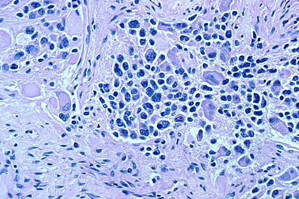
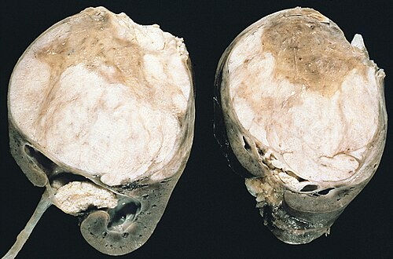

# NEOPLASIAS PEDIÁTRICAS

Diferente do que vemos na oncologia de adultos, onde o estilo de vida e exposições ambientais (como tabagismo e dieta) ditam as regras, o câncer infantil é uma "doença do desenvolvimento". Estamos falando de células embrionárias que, por algum erro no processo de diferenciação, decidem crescer de forma desordenada.

No Brasil, o Instituto Nacional de Câncer (INCA) estima cerca de 8.000 novos casos por ano para o triênio 2023-2025. Embora seja uma doença rara, o câncer é a primeira causa de morte por doença na faixa de 1 a 19 anos no país. Por isso, o diagnóstico precoce não é apenas um "clichê" médico; é o que separa uma sobrevida de 80% de um desfecho fatal.

*Figura 1 - Corte histopatológico de neuroblastoma, tumor sólido extracraniano mais frequente em crianças. Fonte: Public Domain | Wikimedia Commons*

## Epidemiologia e Sinais de Alerta

Para a sua prova de residência, você precisa ter a "trindade" da oncologia pediátrica na ponta da língua. A distribuição dos casos no Brasil segue um padrão bem definido:

- **Leucemias (25-30%):** A Leucemia Linfoide Aguda (LLA) é a rainha absoluta.

- **Tumores do Sistema Nervoso Central (SNC) (15-20%):** São os tumores sólidos mais comuns.

- **Linfomas (12-15%):** Com destaque para o Linfoma de Burkitt e o Linfoma de Hodgkin.

O grande desafio clínico é que os sintomas iniciais mimetizam doenças banais da infância. Uma febre que não passa, uma dor na perna atribuída ao "crescimento" ou uma palidez que parece "verminose". O Dr. Will sempre reforça: se o sintoma é persistente, progressivo e não responde ao tratamento habitual, a investigação oncológica é obrigatória.

### Tabela 1: Sinais de Alerta para Câncer Infantil (SBP/INCA)

| Sinal/Sintoma | Suspeita Clínica |
| --- | --- |
| Leucocoria (reflexo branco na pupila) | Retinoblastoma |
| Massa abdominal firme e indolor | Tumor de Wilms ou Neuroblastoma |
| Cefaleia matinal com vômitos em jato | Tumor de SNC (Hipertensão Intracraniana) |
| Dor óssea persistente (acorda a criança à noite) | Leucemia ou Osteosarcoma |
| Linfonodomegalia indolor e endurecida (> 2cm) | Linfoma |
| Equimoses e petéquias sem trauma | Leucemia (Pancitopenia) |

## Leucemia Linfoide Aguda (LLA)

A LLA é o protótipo do câncer infantil. Ela ocorre devido à proliferação descontrolada de linfoblastos na medula óssea, o que acaba "expulsando" a produção das células normais (hemácias, leucócitos e plaquetas).

### Por que a criança fica anêmica e sangra?

Não é que a medula "esqueceu" como fazer sangue. É uma ocupação de espaço físico e metabólico. Os blastos tomam conta de tudo. Por isso, o quadro clássico é a **pancitopenia**: palidez (anemia), febre/infecções (neutropenia) e sangramentos/petéquias (plaquetopenia).

*Figura 2 - Macroscopia de nefroblastoma (Tumor de Wilms), a neoplasia renal mais comum na infância, com septos proeminentes na superfície de corte. Fonte: AFIP, Public Domain | Wikimedia Commons*

## Diagnóstico e Estratificação de Risco

O diagnóstico padrão-ouro é o **mielograma** com a presença de mais de 20% (ou 25%, dependendo da diretriz) de blastos. No Brasil, seguimos o protocolo do Grupo Brasileiro para Tratamento da LLA (GBTLI).

A estratificação de risco é o que mais cai em prova. Por que tratamos uma criança de 4 anos diferente de um adolescente de 14? Porque o prognóstico é diferente.

- **Risco Favorável:** Idade entre 1 e 9 anos E contagem de leucócitos inicial < 50.000/mm³.

- **Alto Risco:** Idade < 1 ano ou ≥ 10 anos OU leucócitos ≥ 50.000/mm³.

**Dica de Prova:** A resposta precoce ao tratamento é o fator prognóstico mais importante. Se no 8º dia de tratamento (após a fase de citorredução com corticoide) ainda houver muitos blastos no sangue periférico, esse paciente é reclassificado para alto risco, independente da contagem inicial.

### Tratamento

O tratamento é longo (cerca de 2 anos) e dividido em fases: Indução (para limpar os blastos), Consolidação, Intensificação e Manutenção.

- **Profilaxia de SNC:** Obrigatória para todos, geralmente com quimioterapia intratecal (Metotrexato, Citosina Arabinosídeo e Dexametasona), pois a barreira hematoencefálica protege os blastos da quimioterapia sistêmica.

- **Manutenção:** Uso de 6-Mercaptopurina (diária) e Metotrexato (semanal).

## Tumor de Wilms (Nefroblastoma)

Aqui entramos no tema favorito das bancas quando o assunto é massa abdominal. O Tumor de Wilms é o tumor renal mais comum da infância, com pico de incidência entre 2 e 5 anos.

### Quadro Clínico: A Massa "Silenciosa"

Imagine um pré-escolar que a mãe, ao dar banho, percebe um aumento do volume abdominal. A massa é tipicamente:

- Unilateral (em 90% dos casos).

- Firme e lisa.

- **Não ultrapassa a linha média** (diferente do Neuroblastoma).

- Geralmente indolor.

**O "Porquê" da Hipertensão:** Cerca de 25% dos pacientes apresentam hipertensão arterial. Isso acontece por dois mecanismos: ou o tumor comprime a artéria renal (ativando o sistema renina-angiotensina) ou o próprio tumor produz renina.

## Diagnóstico Diferencial: Wilms vs. Neuroblastoma

Este é o duelo clássico das provas. Se você souber essa tabela, você acerta 80% das questões de tumores sólidos abdominais.

### Tabela 2: Diferenciação Clínica Wilms vs. Neuroblastoma

| Característica | Tumor de Wilms | Neuroblastoma |
| --- | --- | --- |
| **Idade média** | 3 a 4 anos | < 2 anos (lactentes) |
| **Linha média** | Raramente ultrapassa | Frequentemente ultrapassa |
| **Estado Geral** | Bom (criança "saudável") | Ruim (febre, perda de peso, dor) |
| **Calcificações** | Raras na TC | Comuns (85%) na TC |
| **Marcadores** | Nenhum específico | Catecolaminas urinárias (VMA/HVA) |
| **Metástases** | Pulmão (principal) | Ossos e Medula Óssea |

### Conduta: Biopsiar ou não?

Aqui reside a maior confusão entre os alunos. Existem duas escolas mundiais:

- **COG (América do Norte):** Cirurgia primeiro (Nefrectomia) → Biópsia e Estadiamento → Quimioterapia.

- **SIOP (Europa e maior parte do Brasil):** Quimioterapia pré-operatória → Cirurgia → Estadiamento.

**Por que o Brasil prefere SIOP?** Porque a quimioterapia prévia diminui o tamanho do tumor e cria uma "pseudocápsula", reduzindo drasticamente o risco de ruptura tumoral durante a cirurgia. Se o tumor rompe no intraoperatório, o estadiamento sobe automaticamente para III e a criança precisará de radioterapia abdominal total.

**Cuidado:** Em provas brasileiras, se a criança tem o quadro clássico (massa renal, idade compatível, sem sinais de alerta para neuroblastoma), a conduta inicial após a imagem é o encaminhamento para oncopediatria para início de quimioterapia neoadjuvante, **sem biópsia prévia**.

### Síndromes Associadas

O Wilms adora aparecer em crianças com malformações. Memorize o acrônimo **WAGR**:

- **W**ilms tumor.

- **A**niridia (ausência da íris).

- **G**enitourinary anomalies (criptorquidia, hipospádia).

- **R**etardation (atraso mental).

Outra associação importante é a **Síndrome de Beckwith-Wiedemann** (macroglossia, onfalocele e hemi-hipertrofia). Se você vir uma criança com uma perna maior que a outra e uma massa abdominal, marque Wilms sem medo.

## Neuroblastoma

Se o Wilms é o tumor do "rim", o Neuroblastoma é o tumor do "sistema nervoso simpático". Ele se origina da crista neural e pode aparecer em qualquer lugar da cadeia simpática, mas a adrenal é o sítio primário em 50% dos casos.

### O Paciente "Doente"

Diferente do Wilms, a criança com neuroblastoma costuma estar em mau estado geral. O tumor é invasivo, engloba vasos (como a aorta e a veia cava) e cruza a linha média.

**Pérolas Clínicas do Neuroblastoma:**

- **Equimoses periorbitárias ("Olhos de Guaxinim"):** Indicam metástase para ossos da órbita.

- **Síndrome de Opsoclonus-Mioclonus:** Movimentos oculares caóticos e abalos musculares. É uma síndrome paraneoplásica de bom prognóstico neurológico, mas assustadora.

- **Nódulos subcutâneos azulados:** Em recém-nascidos (estágio 4S), dão o aspecto de "muffin de mirtilo".

*Figura 2 - Macroscopia de nefroblastoma (Tumor de Wilms), a neoplasia renal mais comum na infância, com septos proeminentes na superfície de corte. Fonte: AFIP, Public Domain | Wikimedia Commons*

## Diagnóstico

O diagnóstico é feito pela biópsia do tumor ou pela presença de células tumorais na medula óssea associada ao aumento de catecolaminas na urina (Ácido Vanilmandélico - VMA e Ácido Homovanílico - HVA).

**Fator Prognóstico Crucial:** A amplificação do oncogene **MYCN** (ou N-myc). Se estiver presente, o tumor é considerado de alto risco, independente da idade ou estágio, exigindo tratamento agressivo, incluindo transplante de medula óssea autólogo e imunoterapia (anti-GD2).

## Tumores do Sistema Nervoso Central (SNC)

São a segunda neoplasia mais comum, mas a que mais mata. Na pediatria, a localização dos tumores muda conforme a idade, mas a regra geral para provas é:

- **Adultos:** Supratentoriais.

- **Crianças (> 1 ano):** Infratentoriais (fossa posterior).

### Tipos Histológicos Comuns

- **Astrocitoma Pilocítico:** O mais comum. Geralmente benigno (Grau I da OMS), localizado no cerebelo. O tratamento é cirurgia.

- **Meduloblastoma:** O tumor maligno mais comum. Altamente invasivo, tem tendência a disseminar pelo líquor (metástases em "drop metastasis" na coluna).

- **Ependimoma:** Origina-se no assoalho do 4º ventrículo. Causa hidrocefalia obstrutiva precoce.

**Quadro Clínico:** A tríade clássica de hipertensão intracraniana (cefaleia, vômitos matinais e papiledema). Em lactentes, fique atento ao aumento do perímetro cefálico e à "síndrome do sol poente" (olhar fixo para baixo por compressão do teto do mesencéfalo).

## Linfomas Pediátricos

Os linfomas na criança são quase sempre de alto grau (crescem rápido), mas respondem muito bem à quimioterapia.

### Linfoma de Hodgkin (LH)

Tem uma distribuição bimodal, mas na pediatria foca em adolescentes.

- **Clínica:** Adenomegalia cervical ou supraclavicular, indolor, de consistência elástica ("borrachosa").

- **Sintomas B:** Febre persistente, sudorese noturna profusa e perda de peso (>10% em 6 meses).

- **Histologia:** Célula de Reed-Sternberg (olho de coruja).

### Linfoma Não-Hodgkin (LNH)

O destaque absoluto no Brasil é o **Linfoma de Burkitt**. É o tumor humano de crescimento mais rápido.

- **Apresentação:** Massa abdominal volumosa (região ileocecal) que pode causar intussuscepção intestinal.

- **Histologia:** Aspecto de "céu estrelado" (macrófagos fagocitando restos celulares em meio a um mar de linfócitos B).

- **Genética:** Translocação t(8;14) envolvendo o gene c-myc.

## Retinoblastoma

O tumor ocular mais comum da infância. A genética aqui é fundamental: mutação no gene supressor de tumor **RB1** (cromossomo 13).

- **Leucocoria:** O sinal do "olho de gato". Ao tirar uma foto com flash, em vez do reflexo vermelho normal, aparece um reflexo branco.

- **Estrabismo:** Qualquer estrabismo de início súbito na criança deve ser avaliado com fundo de olho para excluir tumor.

**Tratamento:** O objetivo é salvar a vida, depois a visão e, por fim, o globo ocular. Em casos avançados, a enucleação (retirada do olho) ainda é necessária para evitar a disseminação pelo nervo óptico para o SNC.

## Tabela 3: Resumo Genético e Marcadores

| Patologia | Alteração Genética / Marcador | Associação / Característica |
| --- | --- | --- |
| **Tumor de Wilms** | WT1 (11p13) | WAGR, Denys-Drash |
| **Neuroblastoma** | Amplificação MYCN (N-myc) | VMA/HVA urinários elevados |
| **Linfoma de Burkitt** | t(8;14) / c-myc | Aspecto de "céu estrelado" |
| **Retinoblastoma** | RB1 (13q14) | Leucocoria bilateral = Hereditário |
| **Sarcoma de Ewing** | t(11;22) | Aspecto em "casca de cebola" no RX |
| **Osteosarcoma** | Fosfatase Alcalina / LDH | "Triângulo de Codman" no RX |

## Tumores Ósseos: Osteosarcoma vs. Ewing

Muitos alunos confundem os dois, mas a localização e o aspecto radiológico ajudam a diferenciar.

-

**Osteosarcoma:**

- Local: Metáfise de ossos longos (perto do joelho: fêmur distal/tíbia proximal).

- RX: Reação periosteal em "raios de sol" ou Triângulo de Codman.

- Clínica: Dor e aumento de volume. Fosfatase alcalina elevada é sinal de turnover ósseo alto.

-

**Sarcoma de Ewing:**

- Local: Diáfise de ossos longos ou ossos chatos (pelve).

- RX: Reação periosteal em "casca de cebola".

- Clínica: Pode cursar com febre e leucocitose, mimetizando uma osteomielite. **Cuidado com essa pegadinha!** Se a questão der uma "osteomielite" que não melhora com antibiótico, pense em Ewing.

## Pontos-Chave para Prova

- **Massa abdominal em pré-escolar:** Se for lisa, unilateral e a criança estiver bem, pense em Wilms. Se for nodular, cruzar a linha média e a criança estiver doente, pense em Neuroblastoma.

- **Conduta no Wilms (Brasil/SIOP):** Imagem (USG + TC) → Quimioterapia neoadjuvante → Cirurgia. NÃO biopsiar rotineiramente antes da quimio se o quadro for clássico.

- **Hipertensão no Wilms:** Ocorre em 25% dos casos por compressão da artéria renal ou produção de renina.

- **Leucocoria:** É o sinal clínico mais comum do retinoblastoma. O diagnóstico é pelo fundo de olho sob narcose.

- **Linfoma de Burkitt:** Massa abdominal de crescimento explosivo. t(8;14) e aspecto de "céu estrelado".

- **LLA - Critérios de Risco:** Idade (1-9 anos) e Leucócitos (<50.000) definem o risco básico. Fora disso, é alto risco.

- **Febre e dor óssea:** Sempre investigar Leucemia. A dor da leucemia costuma ser noturna e não melhora com repouso.

- **Neuroblastoma e Catecolaminas:** O diagnóstico pode ser feito por biópsia de medula + VMA/HVA urinários, sem precisar de cirurgia abdominal inicial.

- **Síndrome de Lise Tumoral:** Complicação grave no início do tratamento de tumores volumosos (Burkitt, LLA). Causa: Hipercalemia, Hiperfosfatemia, Hiperuricemia e **Hipocalcemia**.

- **Contraindicação Absoluta:** Nunca palpar vigorosamente o abdome de uma criança com suspeita de Wilms. O risco de ruptura da cápsula e disseminação peritoneal é real.

- **Primeira escolha para imagem abdominal:** Ultrassonografia (USG) é o exame inicial para triagem de massa palpável, mas a Tomografia (TC) ou Ressonância (RM) são necessárias para o planejamento cirúrgico.

- **O que NÃO fazer:** Não tratar "dor de crescimento" unilateral ou que desperta a criança à noite sem realizar pelo menos um Raio-X e Hemograma.

- **MedEvo Insight:** Lembre-se que o prognóstico do câncer infantil no Brasil é muito dependente do centro de tratamento. Encaminhar para um centro especializado (CACON/UNACON pediátrico) é a conduta mais correta em qualquer suspeita.

Este material cobre os pilares fundamentais da oncologia pediátrica para provas de residência. O segredo é focar nas diferenciações clínicas (Wilms vs. Neuroblastoma) e nos critérios de risco da LLA, que são os temas mais recorrentes.

 Cópia offline para consulta pessoal.
 Fonte original:
 [https://www.medevo.com.br/material-apoio/ler/f9c1bc73-7d1c-4879-9c63-dda8319a2e23](https://www.medevo.com.br/material-apoio/ler/f9c1bc73-7d1c-4879-9c63-dda8319a2e23)
