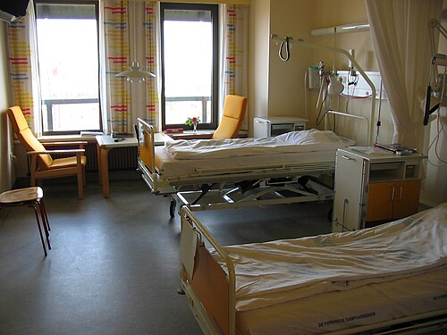

# NÍVEIS DE ATENÇÃO À SAÚDE

Para entender os Níveis de Atenção à Saúde no Brasil, você precisa primeiro desconstruir a ideia de que o SUS é uma escada onde o paciente vai subindo degraus. Se você pensar assim, vai errar questões de prova que abordam as Redes de Atenção à Saúde (RAS). O modelo atual, definido pela Portaria 4.279/2010, não é piramidal, mas sim circular ou "poliárquico".

Nesse modelo, a Atenção Primária à Saúde (APS) não é apenas a base; ela é o centro de comunicação, o "maestro" que coordena o fluxo do paciente por todos os outros pontos. Quando a banca pergunta sobre a organização do sistema, ela quer saber se você entende que a APS é a ordenadora do cuidado e a porta de entrada preferencial.

*Figura 1 - Representação da saúde comunitária e atenção primária, base da organização dos sistemas de saúde. Fonte: Edward Boatman, CC0 | Wikimedia Commons*

## A Lógica da Organização: Níveis de Complexidade vs. Níveis de Atenção

Muitos alunos confundem densidade tecnológica com importância. Na Medicina Preventiva, aprendemos que a Atenção Primária tem **baixa densidade tecnológica** (equipamentos mais simples, como sonar, ECG, glicosímetro), mas possui **alta complexidade clínica**, pois lida com a incerteza e com a subjetividade do ser humano em seu contexto social.

Já a Atenção Terciária (hospitais de grande porte) possui **alta densidade tecnológica** (ressonância, hemodinâmica, robótica), mas uma complexidade clínica muitas vezes mais restrita a um órgão ou sistema específico.

*Figura 2 - Ambiente hospitalar, representando os níveis de atenção secundária e terciária do sistema de saúde. Fonte: Tomasz Sienicki, Public Domain | Wikimedia Commons*

### Atenção Primária à Saúde (APS) ou Atenção Básica (AB)

No Brasil, os termos APS e AB são usados como sinônimos na Política Nacional de Atenção Básica (PNAB). Ela é o primeiro nível de atenção e deve resolver cerca de 80% a 85% dos problemas de saúde da população.

Por que isso cai tanto? Porque uma APS forte reduz as **Internações por Condições Sensíveis à Atenção Primária (ICSAP)**. Se o médico de família controla bem a hipertensão e o diabetes na Unidade Básica de Saúde (UBS), esse paciente não descompensa e não ocupa um leito hospitalar por crise hipertensiva ou cetoacidose. Guarde isso: ESF forte é igual a menos internação desnecessária.

A Estratégia Saúde da Família (ESF) é o modelo prioritário de expansão da APS no Brasil. Diferente das UBS tradicionais (que muitas vezes funcionam apenas com especialistas focais e sem território definido), a ESF trabalha com:

- **Territorialização:** Mapeamento de uma área específica.

- **Adscrição de clientela:** Cada equipe é responsável por um número definido de pessoas (geralmente de 2.000 a 3.500 pessoas).

- **Equipe Multiprofissional:** No mínimo médico (generalista ou MFC), enfermeiro, auxiliar/técnico de enfermagem e Agentes Comunitários de Saúde (ACS).

### Atenção Secundária e Terciária

A Atenção Secundária é composta por serviços especializados em nível ambulatorial e hospitalar. Aqui entram os Centros de Especialidades Médicas, as UPAs 24h e os serviços de apoio diagnóstico de média complexidade (como o SADT: radiodiagnóstico, patologia clínica e citopatologia).

Um erro clássico de prova é achar que a UPA é Atenção Primária. Não é! A UPA 24h faz parte da Rede de Urgência e Emergência e é considerada Atenção Secundária. Ela serve para estabilização e diagnóstico rápido, com tempo de observação máximo de 24 horas. Se o paciente verde ou azul (pelo Protocolo de Manchester) chega na UPA, o ideal é que ele seja contra-referenciado para a UBS, que é o local adequado para o seu acompanhamento longitudinal.

A Atenção Terciária envolve a alta complexidade: hospitais de grande porte, transplantes, hemodiálise, cirurgias cardíacas e serviços de hemodinâmica. É o nível de maior custo por procedimento e menor capilaridade.

| Nível de Atenção | Densidade Tecnológica | Resolutividade Esperada | Exemplos de Serviços |
| --- | --- | --- | --- |
| **Primário** | Baixa | 80-85% | UBS, Unidade de Saúde da Família (USF) |
| **Secundário** | Média | 10-15% | UPA 24h, Centros de Especialidades, SADT |
| **Terciário** | Alta | 5% | Hospitais Terciários, Transplantes, Hemodinâmica |

## Os Atributos de Starfield: A Bíblia da APS

Se você vai fazer qualquer prova de residência no Brasil, você PRECISA saber os atributos da Atenção Primária definidos por Barbara Starfield. As bancas amam trocar as definições. No MedEvo, sempre reforçamos que esses atributos são o que diferenciam a "Atenção Médica Convencional" (focada na doença) da "Atenção Primária" (focada na pessoa).

### Atributos Essenciais

- **Acesso (ou Primeiro Contato):** A APS deve ser a porta de entrada preferencial. O serviço deve ser acessível geograficamente, financeiramente e temporalmente. Se o paciente prefere ir direto ao pronto-socorro porque a UBS está sempre fechada ou não tem vaga, o atributo do acesso falhou.

- **Longitudinalidade:** É o acompanhamento do paciente ao longo do tempo, independentemente da presença ou ausência de doença. Cria vínculo e confiança. O médico conhece não só a patologia, mas o histórico e o contexto do paciente.

- **Integralidade:** O sistema deve oferecer tudo o que o paciente precisa, desde a promoção e prevenção até a reabilitação e cuidados paliativos. Além disso, significa olhar o paciente como um todo, não apenas como um "joelho que dói" ou uma "glicemia alterada".

- **Coordenação do Cuidado:** Este é o papel de "maestro". Se o paciente precisa ir ao cardiologista (Atenção Secundária), a APS deve referenciar, mas continua responsável por ele. Quando o paciente volta, a APS faz a contra-referência e integra as informações. A coordenação evita a fragmentação do cuidado.

### Atributos Derivados

- **Orientação Familiar:** O foco não é apenas o indivíduo, mas sua família e o ambiente em que vivem. Ferramentas como o Genograma e o Ciclo de Vida Familiar são usadas aqui.

- **Orientação Comunitária:** O serviço deve conhecer as necessidades epidemiológicas da comunidade local. O diagnóstico de saúde comunitária (muitas vezes feito por amostragem probabilística para generalização) ajuda a planejar ações específicas.

- **Competência Cultural:** O profissional deve respeitar e entender as características culturais da população adscrita para que o cuidado seja efetivo.

## Redes de Atenção à Saúde (RAS) e o Decreto 7.508/2011

A RAS é a forma organizacional que o SUS adotou para superar a fragmentação. Imagine que o paciente com Insuficiência Cardíaca precisa da UBS para o dia a dia, do cardiologista para ajustar a medicação, do laboratório para os exames e, talvez, do hospital em uma descompensação. A RAS é o "fio invisível" que une esses pontos.

De acordo com o Decreto 7.508/2011, existem quatro **Portas de Entrada** oficiais no SUS. Decore isso, pois as bancas adoram colocar "Centros de Reabilitação" ou "Hospitais Terciários" como portas de entrada para te enganar.

**As 4 Portas de Entrada do SUS:**

- Atenção Primária (UBS/USF).

- Atenção de Urgência e Emergência (UPA, Pronto-Socorro).

- Atenção Psicossocial (CAPS).

- Serviços Especiais de Acesso Aberto (ex: Centros de Testagem e Aconselhamento - CTA).

**Atenção:** Centros de Reabilitação e Hospitais de Retaguarda NÃO são portas de entrada. O paciente chega neles via referência.

### Elementos Constitutivos das RAS

Para que uma rede funcione, a Portaria 4.279/2010 define que ela precisa de:

- **População adscrita:** Sabemos para quem estamos trabalhando.

- **Estrutura operacional:** Os pontos de atenção (UBS, hospitais, etc.).

- **Modelo de atenção:** A forma como o cuidado é prestado (ex: Medicina Centrada na Pessoa).

- **Sistema de Governança:** Como a rede é gerida.

## O Papel do Médico de Família e Comunidade (MFC) e a Clínica Ampliada

O MFC é o especialista da Atenção Primária. Ele deve ser um clínico qualificado, capaz de lidar com a maioria dos problemas de saúde, mas com uma atuação comunitária e uma relação médico-pessoa fundamental.

Um conceito que aparece muito em provas de "humanização" e "gestão" é a **Clínica Ampliada**. Ela propõe que o foco do atendimento não seja apenas o diagnóstico nosológico (a doença), mas o sujeito em sua singularidade. Isso envolve o acolhimento integral e a construção de um Projeto Terapêutico Singular (PTS).

Outro ponto vital é o **Apoio Matricial**. Imagine que a equipe da ESF tem um paciente com um quadro psiquiátrico complexo. Em vez de simplesmente "encaminhar e esquecer", a equipe do CAPS (especialista) faz uma reunião com a equipe da ESF para discutir o caso e compartilhar o manejo. Isso é matriciamento: suporte técnico especializado para qualificar o cuidado na ponta.

## Situações Clínicas e Decisões nos Níveis de Atenção

Vamos aplicar o conhecimento. Imagine um paciente de 55 anos, tabagista, que chega à UBS com dor precordial típica iniciada há 30 minutos.

O que a UBS (Atenção Primária) deve fazer?
Embora seja a porta de entrada, a UBS deve estar preparada para a emergência. O médico realiza o ECG inicial (baixa densidade tecnológica disponível) e, ao identificar um IAM com supra de ST, deve acionar imediatamente o SAMU para transferência para um serviço de hemodinâmica (Atenção Terciária).

Aqui vemos a **Coordenação do Cuidado** e a **Hierarquização** funcionando. A UBS não vai tratar o IAM definitivo, mas ela é o primeiro contato e organiza a transferência para o nível de complexidade adequado.

Outro exemplo: Paciente com hipotireoidismo que vai realizar uma colecistectomia eletiva.
O cirurgião (Atenção Secundária/Terciária) nota que o TSH está em 50 mUI/L. O correto é otimizar a função tireoidiana antes da cirurgia, pois o hipotireoidismo não compensado aumenta drasticamente os riscos perioperatórios (cardiovasculares e metabólicos). Quem faz esse ajuste fino e o seguimento crônico? A APS.

### Classificação de Risco: Manchester e Priorização

Nas UPAs e Prontos-Socorros, o atendimento não é por ordem de chegada, mas por necessidade clínica.

- **Vermelho:** Emergência (atendimento imediato).

- **Laranja:** Muito urgente (atendimento em até 10 min).

- **Amarelo:** Urgente (atendimento em até 60 min).

- **Verde:** Pouco urgente (pode aguardar ou ser encaminhado à UBS).

- **Azul:** Não urgente (encaminhamento preferencial para a UBS).

Cuidado com a pegadinha: O fato de um paciente ser classificado como "verde" na UPA não significa que ele NÃO pode ser atendido lá, mas sim que a UBS é o local preferencial para o seu problema, visando a continuidade do cuidado.

## Mortalidade Materna e Indicadores de Saúde

A mortalidade materna é um indicador sensível da qualidade da atenção à saúde de um país. Segundo a OMS, a morte materna é o óbito de uma mulher durante a gestação ou até 42 dias após o parto, por qualquer causa relacionada ou agravada pela gravidez.

**Importante para a prova:** Excluem-se as causas acidentais ou incidentais (ex: uma gestante que morre em um acidente de carro não entra na estatística de mortalidade materna). A maioria das mortes maternas no Brasil ocorre por causas obstétricas diretas (hipertensão, hemorragia, infecção), o que reflete falhas na Atenção Primária (pré-natal) e Secundária (parto).

## Diferenças entre Atenção Médica Convencional e APS

As bancas de residência adoram cobrar a visão de Starfield sobre as diferenças entre o modelo biomédico tradicional e o modelo de Atenção Primária.

| Característica | Atenção Médica Convencional | Atenção Primária (APS) |
| --- | --- | --- |
| **Foco** | Na doença e na cura | Na saúde, prevenção e pessoa |
| **Abordagem** | Fragmentada (especialista focal) | Integral (holística) |
| **Relação** | Episódica (momento da dor) | Longitudinal (vínculo contínuo) |
| **Tecnologia** | Alta densidade (exames caros) | Alta resolutividade com baixa densidade |
| **Equipe** | Geralmente centrada no médico | Multidisciplinar |

## Regulação e Acesso: O RegulaSUS

A regulação é o processo de gerenciar as filas e garantir que o paciente certo chegue ao lugar certo no tempo certo. O **RegulaSUS** visa diminuir o tempo de espera e priorizar casos graves.

Quando a APS funciona bem como coordenadora, ela qualifica a regulação. O médico da APS não apenas "pede um exame", ele justifica a necessidade clínica, o que permite ao regulador dar prioridade a quem realmente precisa de urgência na média complexidade. Isso aumenta a equidade do sistema.

## Documentação Médica e Responsabilidade

Independentemente do nível de atenção, o prontuário é um documento legal. Na APS, o registro deve ser preferencialmente no formato **SOAP** (Subjetivo, Objetivo, Avaliação e Plano), que facilita a longitudinalidade.

Sobre o **Atestado Médico**: Ele deve ser emitido pelo médico que avaliou o paciente, contendo a data da avaliação e o período de afastamento. Em casos de "alta a pedido" no ambiente hospitalar, o médico deve registrar detalhadamente a avaliação técnica, os riscos de morte e a capacidade de discernimento do paciente, respeitando a autonomia, mas garantindo a segurança jurídica.

## Desafios e Transição Demográfica

O Brasil passa por uma transição demográfica acelerada (envelhecimento da população) e uma transição epidemiológica (predomínio de doenças crônicas não transmissíveis).

Isso exige que o SUS deixe de ser um sistema focado em "agudização" (modelo de pronto-socorro) e passe a ser um sistema focado em "condições crônicas". Por isso, a organização em Redes (RAS) com uma APS forte é a única forma de garantir a sustentabilidade do sistema. Como Dr. Will sempre comenta em suas discussões, "não há sistema de saúde viável no mundo sem uma atenção primária que resolva o grosso da demanda".

## Pontos-Chave para Prova 💡

- **Portas de Entrada (Decreto 7.508):** APS, Urgência/Emergência, CAPS e Serviços Especiais de Acesso Aberto. Reabilitação NÃO é porta de entrada.

- **Atributos Essenciais da APS:** Acesso, Longitudinalidade, Integralidade e Coordenação do Cuidado.

- **Resolutividade da APS:** Deve resolver entre 80% e 85% dos problemas de saúde da comunidade.

- **SADT:** Radiodiagnóstico, patologia clínica e citopatologia pertencem à Média Complexidade (Atenção Secundária).

- **Morte Materna:** Até 42 dias pós-parto, por causas obstétricas. Exclui acidentes e incidentes.

- **ESF vs. UBS Tradicional:** A ESF exige territorialização, adscrição de clientela e equipe com ACS. A UBS tradicional não necessariamente.

- **UPA 24h:** Pertence à Atenção Secundária (Rede de Urgência). Observação máxima de 24 horas.

- **Matriciamento:** É suporte técnico-pedagógico; não é apenas encaminhamento, é compartilhamento de cuidado.

- **ICSAP:** Internações por Condições Sensíveis à Atenção Primária. Se a APS é boa, esse indicador CAI.

- **Territorialização:** É uma atribuição comum a TODOS os profissionais da equipe de Atenção Básica, não apenas do ACS.

- **Hipotireoidismo e Cirurgia:** TSH deve estar compensado para reduzir riscos perioperatórios em cirurgias eletivas.

- **Classificação de Risco (Manchester):** Prioriza por gravidade clínica, não por ordem de chegada. Áreas verde/azul devem ser preferencialmente referenciadas à UBS.

- **Primeira Escolha na Parada Cardiorrespiratória (RCP):** Compressões de alta qualidade (100-120/min), profundidade de 5-6 cm, permitir retorno total do tórax e minimizar interrupções.

- **Atenção Terciária:** Alta densidade tecnológica e especialização (ex: Hemodinâmica, Transplantes).

- **Clínica Ampliada:** Foco no sujeito e sua singularidade, além do diagnóstico biológico.

- **Pegadinha de Prova:** Dizer que a APS é o nível de "baixa complexidade". O correto é "baixa densidade tecnológica", mas "alta complexidade clínica".

- **Telemedicina:** Regulamentada para assistência, pesquisa e prevenção, garantindo continuidade do cuidado, especialmente após a pandemia.

- **PNAB 2017:** Define a ESF como o modelo prioritário, mas reconhece outras formas de organização da Atenção Básica.

 Cópia offline para consulta pessoal.
 Fonte original:
 [https://www.medevo.com.br/material-apoio/ler/fc9fb1dc-dcf8-4712-8aa0-8877331a363c](https://www.medevo.com.br/material-apoio/ler/fc9fb1dc-dcf8-4712-8aa0-8877331a363c)
