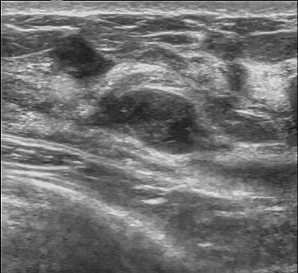

# NÓDULOS E MASSAS MAMÁRIAS

Para começar nossa conversa, você precisa entender que a mastologia em provas de residência não é sobre decorar nomes complexos de tumores raros, mas sim sobre dominar o fluxograma de decisão. O examinador quer saber se você sabe o que fazer quando uma paciente chega com um "caroço" na mama.

O pilar de tudo o que vamos discutir aqui é a chamada Tríplice Diagnóstica: Exame Clínico, Exame de Imagem e Avaliação Histocitológica. Se você pular uma dessas etapas ou escolher o exame errado para a idade da paciente, você erra a questão e, pior, erra na vida real.

*Figura 1 - Mamografia, exame fundamental no rastreamento e diagnóstico de nódulos e massas mamárias. Fonte: National Cancer Institute, Public Domain | Wikimedia Commons*

## O Exame Clínico: A Primeira Barreira

Quando uma paciente senta na sua frente com uma queixa de nódulo, a primeira coisa que você deve avaliar não é o nódulo em si, mas quem é essa paciente. A idade é o divisor de águas.

### Anamnese e Fatores de Risco

Não ignore a história familiar. Se a paciente tem parentes de primeiro grau com câncer de mama (especialmente se antes dos 50 anos), câncer de ovário ou câncer de mama em homens, seu nível de alerta deve subir imediatamente. Outros fatores como obesidade, tabagismo e nuliparidade também pesam, mas a genética e a idade são os soberanos.

### Inspeção e Palpação

Aqui está o que você busca para diferenciar o "bem" do "mal".

Um nódulo benigno costuma ser móvel, fibroelástico, bem delimitado e indolor. O exemplo clássico é o fibroadenoma em mulheres jovens. Já o nódulo maligno é o oposto: endurecido, irregular (espiculado), fixo a planos profundos ou à pele, e geralmente indolor.

Cuidado com a pegadinha: o fato de um nódulo ser indolor não o torna maligno, mas a maioria dos carcinomas de mama se apresenta como uma massa indolor. O quadrante superior externo (QSE) é o local mais frequente para o surgimento de neoplasias malignas, então dê atenção redobrada a essa área.

### Derrame Papilar

Este é um tema quente em provas. Nem toda secreção é preocupante. A secreção fisiológica costuma ser bilateral, multiductal e surge à expressão.

O que nos preocupa é o Derrame Papilar Patológico: unilateral, espontâneo, uniductal e de aspecto hemorrágico (sanguinolento) ou "água de rocha" (seroso/hialino).

A causa mais comum de derrame papilar sanguinolento unilateral é o Papiloma Intraductal. Guarde isso: apesar de assustar a paciente, o papiloma é uma lesão benigna, mas que exige ressecção do ducto acometido para diagnóstico definitivo e tratamento.

## Exames de Imagem: Escolhendo a Ferramenta Certa

Aqui é onde muitos alunos se perdem. A pergunta de ouro é: qual exame pedir primeiro?

### Ultrassonografia (USG) vs. Mamografia (MMG)

A regra é clara:

- Mulheres < 35 a 40 anos: O exame inicial é a Ultrassonografia. Por que? Porque a mama da mulher jovem é densa (muito parênquima e pouca gordura). Na mamografia, o parênquima aparece branco e o câncer também. É o famoso "procurar um urso polar na neve". A USG atravessa essa densidade com facilidade.

- Mulheres > 40 anos: O rastreamento e a investigação inicial de nódulos palpáveis começam com a Mamografia, geralmente complementada pela Ultrassonografia.

Se a prova te der uma paciente de 20 anos com um nódulo palpável, não marque mamografia. O primeiro passo é USG. Se a paciente tem 45 anos, a conduta padrão é MMG + USG.

### Características Ultrassonográficas de Suspeita

A banca vai descrever a imagem e você precisa classificar mentalmente.

- Benigno: Nódulo anecoico (preto puro), com paredes lisas e reforço acústico posterior. Isso é um cisto simples. Se for sólido, deve ser ovalado, com o maior eixo paralelo à pele (mais largo do que alto).

- Maligno: Nódulo hipoecoico, com margens irregulares ou espiculadas, orientação vertical (mais alto do que largo) e sombra acústica posterior. A orientação vertical indica que a lesão está "furando" os planos teciduais, um sinal clássico de invasão.

## A Linguagem Universal: BI-RADS

O BI-RADS (Breast Imaging-Reporting and Data System) é o que padroniza as condutas. Você precisa ter essa tabela tatuada no cérebro.

| BI-RADS | Avaliação | Risco de Malignidade | Conduta |
| --- | --- | --- | --- |
| 0 | Inconclusivo | N/A | Necessita exames complementares (MMG, USG ou RM) |
| 1 | Normal | 0% | Rastreamento de rotina conforme idade |
| 2 | Achados Benignos | 0% | Rastreamento de rotina conforme idade |
| 3 | Provavelmente Benigno | < 2% | Controle em curto prazo (6, 12, 24 e 36 meses) |
| 4 | Suspeito | 2% - 95% | Biópsia (Core Biopsy ou Mamotomia) |
| 5 | Altamente Suspeito | > 95% | Biópsia (Core Biopsy ou Mamotomia) |
| 6 | Malignidade Comprovada | 100% | Tratamento cirúrgico/oncológico |

### Detalhes Importantes do BI-RADS

- BI-RADS 0: É muito comum em mamas densas ou quando há dúvida que uma incidência adicional de mamografia resolveria. No MedEvo, sempre reforçamos: se o exame é 0, você não para a investigação; você pede outro exame.

- BI-RADS 3: A conduta é o acompanhamento semestral. Se após 2 ou 3 anos a lesão permanecer estável, ela é reclassificada como BI-RADS 2. Se ela crescer ou mudar de aspecto, sobe para BI-RADS 4 e vai para biópsia.

- BI-RADS 4 e 5: Não há discussão, o próximo passo é biópsia tecidual.

## Procedimentos Invasivos: PAAF, Core Biopsy e Mamotomia

Muitos alunos confundem quando indicar cada uma. Vamos simplificar o porquê de cada escolha.

### PAAF (Punção Aspirativa por Agulha Fina)

A PAAF colhe células (citologia).

- Indicação principal: Cistos mamários.

- Se você punciona um cisto e vem um líquido amarelado/esverdeado (não hemorrágico) e o nódulo desaparece, o diagnóstico está feito e o líquido pode ser desprezado.

- Se o líquido for hemorrágico ou se o nódulo não sumir completamente, esse líquido deve ir para a citologia e a investigação deve prosseguir.

- Em gestantes, a PAAF é frequentemente usada como abordagem inicial pela sua segurança e rapidez.

### Core Biopsy (Biópsia por Agulha Grossa)

É o padrão-ouro para nódulos sólidos (BI-RADS 4 ou 5). Ela retira fragmentos de tecido (histologia).

- Vantagem: Permite avaliar a arquitetura do tecido, diferenciando carcinoma in situ de carcinoma invasor, além de permitir a realização de imuno-histoquímica.

- Dica de prova: Nódulo palpável com crescimento progressivo ou características suspeitas na USG? A resposta é Core Biopsy.

### Mamotomia (Biópsia de Fragmento à Vácuo)

Utiliza agulhas de maior calibre (8-11G) e um sistema de vácuo.

- Indicação: Principalmente para microcalcificações suspeitas que não formam nódulo. Ela retira mais tecido que a Core Biopsy, diminuindo o erro de amostragem em lesões muito pequenas ou sutis.

### Biópsia Excisional

É a retirada cirúrgica de todo o nódulo. Hoje, com as biópsias percutâneas (Core e Mamotomia), a biópsia cirúrgica ficou reservada para casos onde a biópsia por agulha foi inconclusiva ou discordante com a imagem.

## Patologias Benignas: O Dia a Dia do Consultório

Nem tudo o que é nódulo é câncer. Na verdade, a maioria não é.

### Fibroadenoma

É o tumor benigno mais comum da mama. Típico de mulheres jovens (menacme, < 30 anos).

- Clínica: Móvel, indolor, consistência fibroelástica.

- Conduta: Se for pequeno e tiver características típicas no BI-RADS 3, podemos apenas acompanhar. Se houver desejo da paciente ou crescimento, fazemos a exérese.

- Cuidado: Se um "fibroadenoma" crescer muito rápido, pense em Tumor Filodes.

### Tumor Filodes

É um tumor fibroepitelial, parente do fibroadenoma, mas com comportamento muito mais agressivo localmente.

- Pérola de prova: Nódulo de crescimento rápido em mulher jovem. A PAAF pode vir como "lesão fibroepitelial", o que não diferencia do fibroadenoma.

- Conduta: Excisão cirúrgica com margens amplas (pelo menos 1 cm), pois ele tem alta taxa de recidiva local. Ele pode ser benigno, borderline ou maligno (antigamente chamado de cistossarcoma filodes).

### Cistos Mamários

Fazem parte das alterações funcionais benignas da mama.

- Cisto Simples: Conteúdo anecoico, reforço posterior. Conduta: Observação ou PAAF se causar dor.

- Cisto Espesso/Complexo: Pode exigir biópsia para descartar vegetações intracísticas (papilomas ou carcinomas papilíferos).

### Hamartoma e Esteatonecrose

- Hamartoma: Uma "mistura" de tecidos normais da mama (gordura, tecido fibroso e glandular) que forma um nódulo bem delimitado. É o "tumor dentro da mama". BI-RADS 2.

- Esteatonecrose (Necrose Gordurosa): Geralmente após um trauma ou cirurgia prévia. Pode simular um câncer clinicamente (nódulo endurecido e fixo), mas a história de trauma e a imagem de "cisto oleoso" ou calcificações grosseiras ajudam no diagnóstico.

## Situações Especiais e Pegadinhas de Prova

### A Mama Masculina

Homem com nódulo mamário? Atenção total. Se for um homem idoso (> 70 anos), com nódulo retroareolar, endurecido e com retração de mamilo, a suspeita de câncer de mama masculino é altíssima. A conduta é Core Biopsy. Não confunda com ginecomastia, que é o crescimento do tecido glandular de forma concêntrica e geralmente bilateral ou dolorosa em adolescentes ou usuários de certas medicações.

### A Paciente Jovem e a Telarca Precoce

Nódulo retroareolar em menina pré-púbere é, quase sempre, o broto mamário (telarca). Pelo amor de Deus, não indique biópsia ou exérese, pois você pode destruir o futuro desenvolvimento da mama dessa criança. A conduta é observação e acompanhamento.

### Gestação e Lactação

O diagnóstico de câncer de mama na gestação costuma ser tardio porque as mamas já estão aumentadas e densas. A USG é o exame de escolha inicial. Se houver suspeita, a biópsia (PAAF ou Core) pode ser realizada com segurança.

### Nódulos Tireoidianos (O "Intruso" das Provas de Mastologia)

Embora seja outro órgão, as bancas adoram misturar a estratificação de risco de nódulos cervicais.

- Sinais de suspeita na tireoide: Hipoecogenicidade, microcalcificações, margens irregulares, forma "mais alta que larga" e fluxo intranodular ao Doppler.

- Nódulos < 1cm, isoecoicos ou císticos, sem sinais de alerta, geralmente são acompanhados clinicamente.

*Figura 2 - Ultrassonografia mamária demonstrando fibroadenoma, nódulo benigno bem delimitado e hipoecoico. Fonte: Nevit Dilmen, CC BY-SA 3.0 | Wikimedia Commons*

## Diagnóstico Diferencial e Raciocínio Clínico

Imagine o seguinte cenário: Paciente de 46 anos, com dor mamária cíclica (mastalgia) e mamografia normal feita há 7 meses. Ela agora sente um nódulo. O que você faz?
Você não pode dizer que "está tudo bem" só porque a mamografia de 7 meses atrás era normal. O nódulo é novo. A conduta correta é: Exame clínico + nova Mamografia + Ultrassonografia. Como diz o Dr. Will, "o exame físico manda, mas a imagem confirma".

Outro cenário: Nódulo sólido, BI-RADS 4 na USG, mas a mamografia e a Ressonância Magnética (RM) vieram normais. E agora?
A biópsia guiada por ultrassom é mandatória. Se uma modalidade de imagem viu uma lesão suspeita, ela precisa ser biopsiada, independentemente das outras estarem normais.

### Tabelas Comparativas para Fixação

**Tabela 1: Diferenciando Descarga Papilar**

| Tipo de Descarga | Características | Causa Provável | Conduta |
| --- | --- | --- | --- |
| Fisiológica | Bilateral, multiductal, à expressão | Hormonal / Medicamentosa | Tranquilizar |
| Galactorreia | Aspecto leitoso, bilateral | Hiperprolactinemia | Dosar Prolactina / TSH |
| Sanguinolenta | Uniductal, espontânea | Papiloma Intraductal | Ressecção ductal |
| Água de Rocha | Serosa, transparente, unilateral | Papiloma ou Carcinoma | Investigação cirúrgica |

**Tabela 2: Métodos de Biópsia**

| Método | Tipo de Amostra | Principal Indicação | Vantagem |
| --- | --- | --- | --- |
| PAAF | Citologia (Células) | Cistos e Linfonodos | Rápida, barata, baixo trauma |
| Core Biopsy | Histologia (Tecido) | Nódulos Sólidos (BI-RADS 4/5) | Diferencia invasão, imuno-histoquímica |
| Mamotomia | Histologia (Vácuo) | Microcalcificações / Lesões sutis | Maior volume de amostra |
| Excisional | Peça Cirúrgica | Discordância imagem/biópsia | Diagnóstico definitivo |

## Localização Pré-Cirúrgica

Se a lesão não é palpável (ex: um BI-RADS 4 que só aparece na mamografia como microcalcificações), como o cirurgião vai saber onde cortar?
Usamos o Agulhamento (ou marcação com fio metálico) ou o ROLL (Radioguided Occult Lesion Localization). No agulhamento, um fio é colocado guiado por imagem horas antes da cirurgia. No ROLL, injeta-se um radiofármaco na lesão e o cirurgião usa um "gamma-probe" no centro cirúrgico para localizar o ponto exato.

## Mastalgia e Microcistos

Um erro comum em provas é achar que dor mamária ou microcistos bilaterais exigem investigação agressiva.
A mastalgia cíclica (que piora no período pré-menstrual) associada a microcistos na USG é o quadro clássico de Alteração Funcional Benigna da Mama (AFBM).

- Conduta: Tranquilizar a paciente, orientar sobre o uso de sutiãs adequados e, se necessário, medidas dietéticas (embora a evidência para restrição de cafeína seja baixa, é muito cobrada). Não há indicação de biópsia para microcistos simples.

## O Linfonodo Intramamário

Muitas vezes, o laudo da mamografia traz: "Linfonodo intramamário em quadrante superior externo".
Se ele tiver características benignas (centro radiolucente, que é a gordura no hilo, formato ovalado e limites precisos), ele é um BI-RADS 2.
Não invente moda: é um achado normal da anatomia mamária. Tranquilize a paciente e mantenha o rastreamento de rotina.

## Câncer de Mama: Sinais de Alerta Máximo

Embora o foco aqui sejam os nódulos, você precisa reconhecer quando o nódulo já é um sinal de carcinoma avançado.

- Pele em "casca de laranja" (edema e infiltração linfática).

- Retração de mamilo ou de pele.

- Linfonodopatia axilar endurecida e fixa.

- Nódulo endurecido, fixo e irregular.

Lembre-se: o diagnóstico definitivo de câncer de mama NUNCA é feito apenas por imagem ou exame físico. Você precisa da histologia (Core Biopsy ou biópsia cirúrgica).

## Pontos-Chave para Prova

- Tríplice Diagnóstica: Exame físico + Imagem + Histocitologia. Se houver discordância entre eles, a biópsia excisional (cirúrgica) é o próximo passo.

- Mulher < 35 anos com nódulo: Comece com Ultrassonografia.

- Mulher > 40 anos com nódulo: Mamografia + Ultrassonografia.

- BI-RADS 3: Controle semestral por 2 a 3 anos. Risco de câncer < 2%.

- BI-RADS 4 e 5: Indicação absoluta de biópsia tecidual (Core Biopsy preferencialmente).

- Cisto simples na USG: Anecoico, contornos regulares, reforço acústico posterior. Conduta: BI-RADS 2, observação.

- PAAF de cisto: Se o líquido for hemorrágico ou o nódulo não sumir, mande para citologia. Se for amarelo/verde e sumir, despreze.

- Papiloma Intraductal: Causa mais comum de derrame papilar sanguinolento unilateral. É benigno, mas a conduta é exérese do ducto.

- Fibroadenoma: Nódulo móvel e fibroelástico em jovens. Se crescer rápido, suspeite de Tumor Filodes.

- Tumor Filodes: Exige margens cirúrgicas amplas (1 cm) pelo alto risco de recidiva.

- Nódulo em homem idoso: Altíssima suspeita de câncer. Conduta: Core Biopsy.

- Nódulo em gestante: USG é o exame inicial; PAAF ou Core Biopsy podem ser feitas se necessário.

- Linfonodo intramamário típico: BI-RADS 2. Não requer conduta adicional.

- Nódulo tireoidiano: Indicação de PAAF geralmente para nódulos > 1cm com características de suspeita (hipoecoico, microcalcificações, mais alto que largo).

- Erro que reprova: Indicar mamografia como primeiro exame para adolescente com nódulo ou indicar biópsia para broto mamário em criança. 💡

Ao seguir esses fluxogramas, você cobre mais de 90% das questões de mastologia clínica. O segredo é sempre olhar a idade, a característica da imagem e aplicar a conduta do BI-RADS correspondente.

 Cópia offline para consulta pessoal.
 Fonte original:
 [https://www.medevo.com.br/material-apoio/ler/e155c6db-e222-4c1c-bef9-8ac0b82443ce](https://www.medevo.com.br/material-apoio/ler/e155c6db-e222-4c1c-bef9-8ac0b82443ce)
