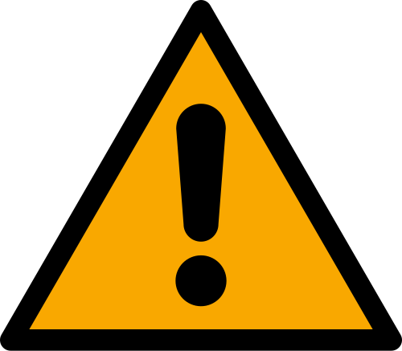
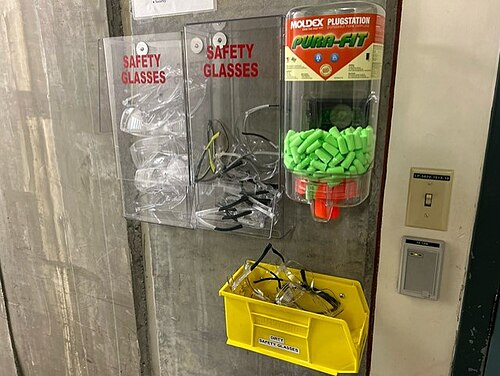

# NORMAS REGULAMENTADORAS (NRS) PRINCIPAIS

Para entender as Normas Regulamentadoras, ou NRs, você não deve pensar nelas como leis chatas e burocráticas, mas como o "manual de sobrevivência" do trabalhador e o "guia de conduta" do médico do trabalho. Elas derivam da CLT (Consolidação das Leis do Trabalho) e servem para dizer exatamente o que deve ser feito para que o ambiente laboral não adoeça as pessoas.

Nas provas de residência, o examinador quer saber se você entende a lógica de proteção. Ele vai te colocar em situações práticas: um acidente com perfurocortante, um trabalhador exposto a ruído ou uma empresa que se recusa a emitir a CAT. Vamos dissecar cada ponto onde os alunos costumam escorregar.

*Figura 1 - Sinal de alerta geral (ISO 7010 W001), símbolo universal de perigo utilizado em ambientes de trabalho conforme as Normas Regulamentadoras. Fonte: Maxxl2, Public Domain | Wikimedia Commons*

## A Base de Tudo: NR 1 e a Gestão de Riscos

A NR 1 é a norma "mãe". Ela estabelece que toda empresa deve realizar o Gerenciamento de Riscos Ocupacionais (GRO). O braço prático disso é o PGR (Programa de Gerenciamento de Riscos).

Antigamente, falava-se muito em PPRA (NR 9), mas hoje a estrela é o PGR. Por que isso mudou? Porque o PGR é mais amplo. Ele não olha apenas para riscos físicos, químicos e biológicos, mas também para riscos ergonômicos e de acidentes.

O PGR deve ser um documento vivo. Não é para ficar na gaveta. Ele serve para identificar perigos e avaliar riscos. Se o risco é alto, a empresa precisa agir. Aqui entra a **Hierarquia de Controle**, um conceito que cai muito em prova. Quando encontramos um risco, a ordem de ação deve ser:

- Eliminação do risco (ex: trocar uma máquina perigosa por uma segura).

- Substituição ou mitigação (ex: trocar um produto químico tóxico por um menos nocivo).

- Medidas de engenharia (ex: isolamento acústico da máquina).

- Medidas administrativas (ex: rodízio de funcionários para diminuir o tempo de exposição).

- EPI (Equipamento de Proteção Individual).

Cuidado: a banca vai tentar te convencer de que o EPI é a primeira solução por ser mais barata. Mentira. O EPI é a **última escolha**, a proteção de menor prioridade na hierarquia, usada apenas quando as outras falharam ou são insuficientes. Como dizemos no MedEvo, o EPI protege o indivíduo, mas a medida de engenharia protege o ambiente todo.

*Figura 2 - Área de armazenamento de EPIs incluindo óculos de segurança e protetores auriculares, essenciais nas Normas Regulamentadoras. Fonte: PortlandSaint, CC BY 4.0 | Wikimedia Commons*

## NR 4 e NR 5: Quem cuida de quem?

A NR 4 trata do SESMT (Serviços Especializados em Engenharia de Segurança e Medicina do Trabalho). São os profissionais contratados pela empresa (médico do trabalho, engenheiro, enfermeiro do trabalho, técnico de segurança). O dimensionamento do SESMT depende do número de funcionários e do **Grau de Risco** da empresa (que vai de 1 a 4).

Já a NR 5 trata da CIPA (Comissão Interna de Prevenção de Acidentes). A diferença fundamental que você precisa gravar: o SESMT é formado por especialistas técnicos. A CIPA é formada por **representantes dos empregados e do empregador**.

Na CIPA, metade dos membros é eleita pelos trabalhadores (voto secreto) e a outra metade é indicada pelo patrão. O presidente da CIPA é indicado pelo empregador, e o vice-presidente é escolhido pelos representantes dos empregados.

Um ponto que despenca em prova: a **estabilidade**. O membro da CIPA eleito pelos trabalhadores tem estabilidade no emprego desde o registro da candidatura até um ano após o fim do seu mandato. Ele não pode ser demitido sem justa causa. O membro indicado pelo patrão NÃO tem essa estabilidade.

## NR 7: O PCMSO e a Atuação Médica

Se existe uma norma que você precisa dominar para a vida e para a prova, é a NR 7. Ela estabelece o PCMSO (Programa de Controle Médico de Saúde Ocupacional).

O PCMSO é o planejamento das ações de saúde da empresa. Ele deve ser elaborado com base nos riscos identificados no PGR (NR 1). Se o PGR diz que há ruído, o PCMSO deve prever audiometrias. Se o PGR diz que há benzeno, o PCMSO prevê hemogramas.

### Os Exames Obrigatórios

O PCMSO exige cinco tipos de exames médicos:

- **Admissional:** Deve ser feito antes que o trabalhador inicie suas funções.

- **Periódico:** A periodicidade varia. Geralmente anual para menores de 18 e maiores de 45 anos, ou para quem está exposto a riscos específicos. Bienal para trabalhadores entre 18 e 45 anos sem riscos específicos.

- **Retorno ao Trabalho:** Obrigatório após afastamento por período igual ou superior a 30 dias por motivo de doença ou acidente (ocupacional ou não) ou parto. Cuidado: não se faz exame de retorno após férias.

- **Mudança de Riscos Ocupacionais:** Deve ser feito antes da alteração de função que implique exposição a riscos diferentes dos anteriores.

- **Demissional:** Deve ser realizado em até 10 dias contados do término do contrato. Pode ser dispensado se o último exame médico (periódico, por exemplo) tiver sido realizado há menos de 135 dias (para empresas de grau de risco 1 e 2) ou 90 dias (grau de risco 3 e 4).

### O ASO (Atestado de Saúde Ocupacional)

Após cada exame, o médico emite o ASO. O ASO deve dizer se o paciente está **Apto** ou **Inapto** para aquela função específica. Ele não deve conter diagnósticos (CID), respeitando o sigilo médico.

O prontuário do trabalhador deve ficar sob guarda do médico coordenador do PCMSO por, no mínimo, **20 anos** após o desligamento do funcionário. Isso cai muito!

### Níveis de Prevenção no PCMSO

As bancas adoram classificar as ações do PCMSO:

- **Primária:** Vacinação (ex: Hepatite B, Tétano) e educação em saúde. Você age antes da doença existir.

- **Secundária:** Exames de rastreamento (audiometria, espirometria, exames laboratoriais). Você quer detectar precocemente uma alteração que já começou.

- **Terciária:** Reabilitação profissional. O trabalhador já adoeceu e você quer limitar a incapacidade.

## NR 15: Insalubridade e Limites de Tolerância

A NR 15 define o que é atividade insalubre. Insalubridade gera um adicional financeiro sobre o **salário mínimo nacional** (e não sobre o salário base do trabalhador, pegadinha clássica).

| Grau de Insalubridade | Adicional (%) | Exemplos Comuns |
| --- | --- | --- |
| Mínimo | 10% | Ruído acima do limite (algumas situações), poeiras minerais. |
| Médio | 20% | Agentes químicos (maioria), frio, umidade, agentes biológicos (contato comum). |
| Máximo | 40% | Radiações ionizantes, agentes biológicos (isolamento de doenças infectocontagiosas), benzeno. |

Um conceito vital: **Limite de Tolerância**. É a intensidade ou concentração máxima ou mínima relacionada à natureza e ao tempo de exposição ao agente, que não causará dano à saúde da maioria dos trabalhadores.

Para o ruído contínuo, o limite é de **85 dB para uma jornada de 8 horas**. Se o ruído sobe para 90 dB, o tempo máximo permitido cai para 4 horas. A cada 5 dB que aumentamos (chamado de fator de dobra), o tempo de exposição permitido cai pela metade.

## Riscos Ocupacionais: As Cores do Mapa de Risco

O Mapa de Risco é uma representação gráfica dos riscos da empresa. Cada grupo de risco tem uma cor específica:

- **Grupo 1 (Verde) - Riscos Físicos:** Ruído, vibrações, radiações (ionizantes e não ionizantes), frio, calor, pressões anormais e umidade.

- **Grupo 2 (Vermelho) - Riscos Químicos:** Poeiras, fumos, névoas, neblinas, gases, vapores e substâncias químicas em geral.

- **Grupo 3 (Marrom) - Riscos Biológicos:** Vírus, bactérias, fungos, parasitas, bacilos.

- **Grupo 4 (Amarelo) - Riscos Ergonômicos:** Esforço físico intenso, levantamento de peso, postura inadequada, ritmo excessivo, trabalho noturno.

- **Grupo 5 (Azul) - Riscos de Acidentes:** Arranjo físico deficiente, máquinas sem proteção, iluminação inadequada, eletricidade, animais peçonhentos.

**Exemplo Clínico:** Imagine um trabalhador de uma lavanderia industrial que trabalha em ambiente com muita água no chão e vapor. A umidade é um risco **Físico** (Verde). Se ele escorregar no chão molhado, isso é um risco de **Acidente** (Azul). Se ele desenvolver uma lombalgia por carregar cestos pesados, é risco **Ergonômico** (Amarelo).

## NR 32: Segurança em Serviços de Saúde

Esta norma foi feita para nós, profissionais de saúde. Ela é cobrada exaustivamente.

- **Adornos:** É proibido o uso de adornos (anéis, pulseiras, relógios, brincos, colares) em todos os trabalhadores que mantenham contato direto com pacientes ou manipulem objetos de uso destes. Por que? Porque os adornos dificultam a higienização das mãos e podem albergar microrganismos.

- **Perfurocortantes:** É terminantemente proibido o **reencape** de agulhas. O descarte deve ser feito em recipientes rígidos, resistentes à punctura e com tampa, localizados o mais próximo possível do local de uso.

- **Vacinação:** A empresa deve fornecer gratuitamente as vacinas do esquema oficial (Hepatite B, Tétano/Difteria, Tríplice Viral). O trabalhador pode recusar? Pode, mas deve assinar um termo de recusa.

- **Higiene das Mãos:** Luvas não substituem a lavagem das mãos. Elas são barreiras, não limpeza.

- **Alimentação:** É proibido comer ou beber nos postos de trabalho ou locais de manipulação de agentes biológicos.

## Patologias Ocupacionais e a Classificação de Schilling

Para saber se uma doença é do trabalho, usamos a Classificação de Schilling. Isso é o "arroz com feijão" da Medicina Preventiva.

- **Schilling I:** O trabalho é **causa necessária**. Sem o trabalho, a doença não existiria. Ex: Silicose, Saturnismo (chumbo), Hidrargirismo (mercúrio).

- **Schilling II:** O trabalho é um **fator contributivo** (fator de risco). A doença existe na população geral, mas o trabalho ajuda a causar. Ex: Hipertensão arterial, Doença Coronariana, Varizes de membros inferiores, Câncer.

- **Schilling III:** O trabalho é um **agravante** ou gatilho de uma doença já latente. Ex: Asma, Dermatite de contato, Lombalgia, Transtornos Mentais (Burnout).

### Pérolas de Toxicologia Ocupacional

- **Silicose:** Exposição à sílica (mineração, jateamento de areia, cerâmica). Causa um padrão nodular na radiografia de tórax, principalmente em lobos superiores. Aumenta muito o risco de Tuberculose.

- **Asbestose (Amianto):** Usado em telhas e caixas d'água. Causa fibrose pulmonar e está fortemente associado ao **Mesotelioma de Pleura**.

- **Saturnismo (Chumbo):** Trabalhadores de baterias e tintas. Causa anemia, cólicas abdominais intensas (cólica saturnina) e a "linha de Burton" (linha azulada na gengiva).

- **Hidrargirismo (Mercúrio):** Garimpo, fabricação de termômetros. Causa tremores, alterações de personalidade e gengivite.

- **Benzenismo:** Postos de gasolina e siderurgias. É mielotóxico (causa leucopenia, anemia, plaquetopenia) e carcinogênico (Leucemia Mieloide Aguda).

- **Cianeto e Monóxido de Carbono:** Lembrar da Tragédia da Boate Kiss. A queima da espuma de isolamento acústico liberou cianeto. O tratamento da intoxicação por cianeto envolve hidroxocobalamina.

## CAT: Comunicação de Acidente de Trabalho

A CAT deve ser emitida em caso de acidente de trabalho típico, doença profissional ou acidente de trajeto.

- **Quem emite?** A empresa.

- **Qual o prazo?** Até o primeiro dia útil seguinte ao acidente. Em caso de morte, deve ser imediata.

- **E se a empresa se recusar?** O próprio trabalhador, o sindicato, o médico assistente ou qualquer autoridade pública pode emitir a CAT a qualquer tempo.

- **Precisa de afastamento?** NÃO. A CAT deve ser emitida para **todo** acidente, mesmo que o trabalhador não precise faltar um único dia.

Lembre-se: se o afastamento for superior a 15 dias, o trabalhador passa a receber o auxílio-doença acidentário pelo INSS (após perícia). Durante esse período, a empresa continua obrigada a depositar o FGTS. Ao retornar, o trabalhador tem estabilidade de 12 meses.

## Ergonomia (NR 17)

A ergonomia busca adaptar o trabalho ao homem, e não o contrário. Dr. Will sempre lembra que ergonomia não é só "cadeira confortável". Ela envolve:

- **Levantamento de peso:** Limites de carga.

- **Mobiliário:** Ajustes de altura e postura.

- **Condições ambientais:** Conforto térmico, acústico e iluminação.

- **Organização do trabalho:** Ritmo, pausas, normas de produção.

Um ponto polêmico: a NR 17 permite a remuneração por produtividade (ex: ganhar por peça produzida), desde que isso não comprometa a saúde do trabalhador e que existam pausas garantidas. Em atividades de teleatendimento (telemarketing), a jornada é de no máximo 6 horas diárias, com pausas obrigatórias.

## PAIR: Perda Auditiva Induzida por Ruído

A PAIR é uma das doenças ocupacionais mais comuns. Suas características de prova são:

- **Neurossensorial:** Afeta as células ciliadas da cóclea.

- **Bilateral e Simétrica:** Se for unilateral, desconfie de outra causa.

- **Irreversível:** Uma vez instalada, não volta atrás.

- **Não progressiva:** Se a exposição ao ruído cessar, a perda para de evoluir.

- **Gota acústica:** A perda começa nas frequências de 3.000, 4.000 ou 6.000 Hz, recuperando-se em 8.000 Hz.

Se você vir uma audiometria com um "buraco" em 4.000 Hz em um trabalhador de fábrica, pode marcar PAIR sem medo.

## Situações Especiais: Gestantes e Adolescentes

- **Gestantes:** Durante a pandemia, houve a lei do afastamento presencial. No fluxo normal, se a gestante trabalha em local insalubre, ela deve ser afastada ou remanejada para função salubre, sem perda salarial.

- **Adolescentes:** O trabalho é proibido para menores de 16 anos, exceto na condição de aprendiz (a partir dos 14 anos). Trabalho noturno, perigoso ou insalubre é proibido para menores de 18 anos.

## Pontos-Chave para Prova 🩺

- **Hierarquia de Controle:** EPC (Engenharia) sempre vem antes do EPI. O EPI é a última linha de defesa.

- **CAT:** Deve ser emitida mesmo sem afastamento do trabalho. Prazo: 1 dia útil.

- **Estabilidade CIPA:** Apenas para os membros eleitos pelos empregados (1 ano após o mandato).

- **Insalubridade:** Calculada sobre o salário mínimo (10%, 20% ou 40%). Periculosidade (explosivos, inflamáveis, eletricidade) é 30% sobre o salário base.

- **Ruído:** Limite de 85 dB para 8 horas. Fator de dobra é 5 dB.

- **NR 32:** Proibido reencape de agulhas e uso de adornos. Vacinação é obrigatória e gratuita.

- **Schilling I:** Trabalho é causa necessária (ex: Silicose).

- **Schilling II:** Trabalho é fator de risco (ex: Infarto, Câncer).

- **Schilling III:** Trabalho é agravante (ex: Asma, Burnout).

- **Prontuário Ocupacional:** Deve ser guardado por 20 anos pelo médico coordenador.

- **ASO:** Não pode ter CID. Deve dizer apenas Apto ou Inapto.

- **Amianto:** Associado ao Mesotelioma de Pleura.

- **Benzeno:** Causa leucopenia e pode levar à Leucemia (LMA).

- **PAIR:** Perda neurossensorial, bilateral, irreversível, com queda em 4.000 Hz.

- **Exame de Retorno:** Obrigatório após 30 dias de afastamento por doença/parto. Não se faz após férias.

- **Adolescente Aprendiz:** A partir dos 14 anos. Trabalho insalubre/noturno só após os 18 anos.

- **PCMSO:** Foco na preservação da saúde, não na produtividade da empresa.

- **Lombalgia:** Se piora no trabalho e melhora no repouso, classifique como Schilling III e emita a CAT.

 Cópia offline para consulta pessoal.
 Fonte original:
 [https://www.medevo.com.br/material-apoio/ler/4de0369d-8403-4f11-8827-49db8b0a6166](https://www.medevo.com.br/material-apoio/ler/4de0369d-8403-4f11-8827-49db8b0a6166)
