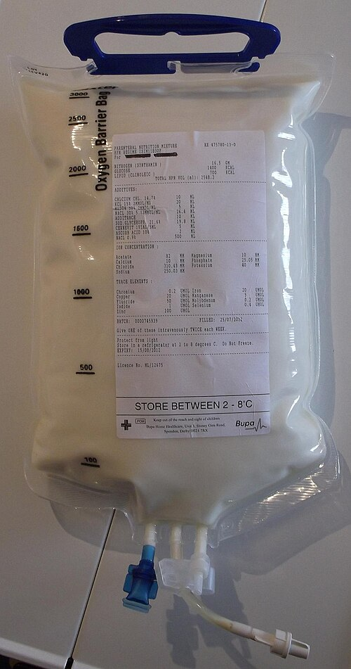
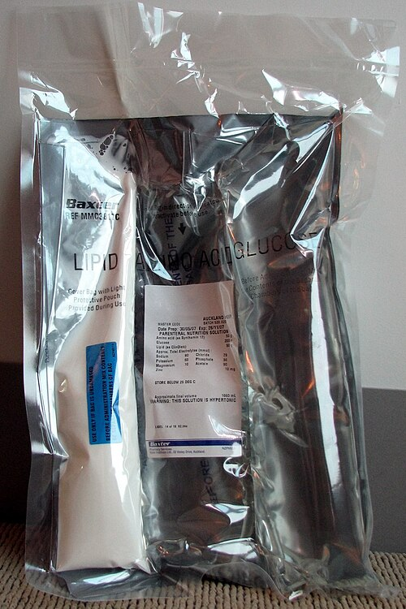

# NUTRIÇÃO CIRÚRGICA (ENTERAL E PARENTERAL)

Para entender nutrição cirúrgica, você precisa primeiro mudar sua mentalidade sobre o paciente que vai operar. Antigamente, o cirurgião focava apenas na técnica operatória, mas hoje sabemos que o melhor nó do mundo não cicatriza em um paciente desnutrido. A nutrição não é um "adjuvante", ela é parte fundamental do tratamento cirúrgico.

*Figura 1 - Bolsa de nutrição parenteral com emulsão lipídica, utilizada em pacientes cirúrgicos com impossibilidade de uso do trato gastrointestinal. Fonte: Le67, CC BY-SA 3.0 | Wikimedia Commons*

## Avaliação do Risco Nutricional: Quem Realmente Precisa de Suporte?

O primeiro erro comum em provas e na prática clínica é achar que todo paciente precisa de suplementação. Não é verdade. O suporte nutricional é uma intervenção com riscos e custos, portanto, indicamos para quem tem risco.

Mas como definir esse risco? A diretriz da BRASPEN (Sociedade Brasileira de Nutrição Parenteral e Enteral) e o protocolo ACERTO enfatizam que a perda de peso involuntária é o marcador mais fidedigno.

### Critérios Diagnósticos de Desnutrição

Muitos alunos decoram apenas o IMC, mas o IMC pode subestimar a desnutrição no paciente cirúrgico, especialmente naqueles com edema ou obesidade sarcopênica. Guarde estes números, pois as bancas adoram:

- **Perda de peso involuntária:** > 10% em 6 meses ou > 5% em 3 meses. Este é o critério isolado mais importante.

- **IMC:** < 18,5 kg/m² (para adultos) ou < 22 kg/m² (para idosos).

- **Albumina Sérica:** < 3,0 g/dL. Aqui vai uma dica do Dr. Will: a albumina é um péssimo marcador de estado nutricional agudo porque tem meia-vida longa (20 dias) e sofre influência da inflamação. No entanto, ela é um excelente marcador de **prognóstico**. Albumina baixa no pré-operatório é sinônimo de complicação no pós-operatório.

| Parâmetro | Risco Nutricional Grave |
| --- | --- |
| Perda de peso | > 10% em 6 meses |
| IMC | < 18,5 kg/m² |
| Albumina | < 3,0 g/dL |
| Avaliação Subjetiva Global (ASG) | Grau C (Desnutrido grave) |

### O Índice de Risco Nutricional (IRN)

O IRN utiliza a albumina e a relação entre o peso atual e o peso ideal. Se o valor for menor que 83,5, o risco é grave. Se estiver entre 83,5 e 97,5, o risco é moderado. As provas costumam focar mais nos critérios clínicos de perda de peso, mas saiba que o IRN existe para objetivar essa conduta.

## Necessidades Nutricionais: O Cálculo do Suporte

Quanto oferecer de comida para o seu paciente? Se você der de menos, ele não cicatriza. Se der demais, você causa sobrecarga metabólica e disfunção hepática (overfeeding).

Para a maioria dos pacientes cirúrgicos estáveis, utilizamos a "regra de bolso":

- **Calorias:** 25 a 30 kcal/kg/dia.

- **Proteínas:** 1,2 a 1,5 g/kg/dia.

Em pacientes críticos ou com grande estresse metabólico (como grandes queimados ou sepse grave), a oferta proteica pode chegar a 2,0 g/kg/dia para tentar frear o catabolismo proteico intenso.

### A Equação de Harris-Benedict

Você verá muito esse nome em questões. Ela estima o Gasto Energético Basal (GEB) baseada em idade, sexo, peso e altura. Na prática, multiplicamos o resultado por um "fator de estresse" (cirurgia, trauma, febre). No MedEvo, sempre lembramos: a fórmula é a base teórica, mas a regra de bolso é o que define a conduta rápida à beira do leito.

## Nutrição Enteral (NE): A Primeira Escolha

A regra de ouro da nutrição é: "Se o trato gastrointestinal (TGI) funciona, use-o". Por que fazemos isso e não partimos direto para a veia?

Porque a presença do alimento no lúmen intestinal estimula o trofismo das vilosidades. Sem comida, o enterócito atrofia. Quando ele atrofia, a barreira intestinal falha e as bactérias que moram ali "atravessam" para o sangue. Isso é a **translocação bacteriana**. Portanto, a NE não serve apenas para nutrir, ela serve para manter a barreira intestinal íntegra e evitar sepse de foco abdominal.

*Figura 2 - Bolsa de nutrição parenteral total (NPT) com três compartimentos separados contendo glicose, aminoácidos e lipídeos. Fonte: Tristanb, CC BY-SA 3.0 | Wikimedia Commons*

## Indicações e Contraindicações da NE

A NE é indicada para pacientes que não conseguem ou não podem atingir 60% das suas necessidades nutricionais por via oral por mais de 7 a 10 dias.

**Contraindicações Absolutas da NE:**

- Obstrução intestinal mecânica total.

- Íleo paralítico (adinâmico) grave e refratário.

- Isquemia intestinal mesentérica.

- Fístulas entéricas de alto débito (> 500 ml/dia) onde não se consegue posicionar a sonda distal à fístula.

- Instabilidade hemodinâmica grave (paciente chocado, com doses crescentes de aminas). Por que? Porque o sangue está sendo desviado para o cérebro e coração, e o intestino está hipoperfundido. Dar comida nesse momento pode causar necrose intestinal.

### Vias de Acesso para NE

- **Sonda Nasoentérica (SNE):** Curto prazo (< 4 semanas). Pode ser gástrica ou pós-pilórica (jejunal).

- **Gastrostomia/Jejunostomia:** Longo prazo (> 4 semanas). A jejunostomia de alimentação é muito comum em grandes cirurgias do TGI superior (como esofagectomias ou gastrectomias totais) para garantir nutrição precoce no pós-operatório.

Cuidado com a pegadinha: Não é necessário aguardar o retorno dos ruídos hidroaéreos ou a eliminação de gases para iniciar a NE. O intestino delgado recupera sua motilidade em poucas horas após a cirurgia. A NE precoce (nas primeiras 24h) é segura e reduz complicações.

## Nutrição Parenteral (NP): Quando o Intestino Falha

A NP é a oferta de nutrientes por via venosa. Ela é uma solução hiperosmolar, rica em glicose, aminoácidos, lipídios, eletrólitos e vitaminas.

### NP Total (NPT) vs. NP Periférica (NPP)

A grande diferença aqui é a **osmolaridade**.

- **NPP:** Usada por pouco tempo (< 7-10 dias). A osmolaridade deve ser baixa (< 900 mOsm/L) para não causar flebite e trombose na veia periférica. Por ter baixa osmolaridade, ela é muito diluída e raramente consegue suprir toda a necessidade calórica do paciente.

- **NPT:** Requer obrigatoriamente um **Acesso Venoso Central**. Como a solução é muito concentrada (hiperosmolar), ela precisa cair em uma veia de grande calibre e alto fluxo para ser diluída rapidamente.

### Complicações da Nutrição Parenteral

As bancas amam cobrar as complicações, que dividimos em três grupos:

- **Mecânicas (relacionadas à punção):** Pneumotórax (mais comum na veia subclávia), punção arterial, hemotórax. A veia jugular interna direita é frequentemente preferida por ter um trajeto mais direto para o átrio direito e menor risco de lesão pleural.

- **Infecciosas:** A infecção do sítio de inserção e a sepse relacionada ao cateter são as complicações mais temidas. O cateter de NPT deve ser, idealmente, de lúmen único e manipulação exclusiva.

- **Metabólicas:** Hiperglicemia (muito comum), hipoglicemia (se suspender abruptamente), distúrbios eletrolíticos e a temida Síndrome de Realimentação.

## Síndrome de Realimentação: O Perigo do Sucesso

Imagine um paciente que está em inanição há semanas (ex: um câncer de esôfago obstrutivo). As células dele estão "vazias" de eletrólitos. Quando você começa a dar glicose (seja por NE ou NP), ocorre um pico de insulina.

A insulina coloca a glicose para dentro da célula, mas leva junto **Fósforo, Magnésio e Potássio**.
O resultado é uma queda brusca desses eletrólitos no sangue.

- **Hipofosfatemia grave:** É a marca registrada. Causa falência respiratória (diafragma sem energia) e arritmias.

- **Hipocalemia e Hipomagnesemia:** Levam a distúrbios de condução cardíaca.

**Como evitar?** Em pacientes de alto risco (desnutridos graves), comece a dieta com apenas 25 a 50% das necessidades calculadas e suba devagar. Monitore eletrólitos diariamente.

## Nutrição no Perioperatório: O Protocolo ACERTO

O projeto ACERTO (Aceleração da Recuperação Total Pós-Operatória), baseado no ERAS europeu, revolucionou a nutrição cirúrgica. Esqueça as condutas de 1980 que ainda aparecem em livros antigos.

### Jejum Pré-operatório

O "jejum a partir da meia-noite" caiu por terra.

- **Líquidos claros (água, chá, suco sem resíduo):** Até 2 horas antes da cirurgia.

- **Carga de Carboidratos:** Oferecer uma bebida rica em carboidratos (maltodextrina a 12,5%) 2 horas antes da cirurgia reduz a resistência à insulina no pós-operatório e melhora o bem-estar do paciente.

- **Sólidos:** 6 a 8 horas de jejum.

### Imunonutrição

Pacientes com câncer do TGI ou desnutridos graves que passarão por grandes cirurgias se beneficiam da imunonutrição por 5 a 7 dias antes da cirurgia. Essas fórmulas contêm:

- **Arginina e Glutamina:** A glutamina é um aminoácido não essencial, mas torna-se "condicionalmente essencial" no estresse, sendo o principal combustível do enterócito.

- **Ácidos graxos Ômega-3:** Modulam a resposta inflamatória.

- **Nucleotídeos.**

Isso reduz a taxa de infecção de sítio cirúrgico e o tempo de internação.

### Dieta no Pós-operatório

Em cirurgias intestinais sem intercorrências (mesmo com anastomoses), a dieta deve ser iniciada precocemente (nas primeiras 24h). Não precisa esperar o paciente soltar gases. Se for uma apendicectomia simples, assim que o paciente estiver acordado e sem náuseas, a dieta leve já pode ser testada.

## Situações Clínicas Específicas

### 1. Câncer de Esôfago e Estômago

Estes pacientes são o protótipo da desnutrição cirúrgica. No câncer de esôfago, a avaliação cardiovascular e respiratória deve ser rigorosa, pois a desnutrição e o tabagismo costumam andar juntos. Se o paciente tem perda de peso > 10%, ele deve receber suporte nutricional (preferencialmente enteral) por 10 a 14 dias **antes** da cirurgia, mesmo que isso atrase o procedimento. Esse atraso é compensado pela queda drástica na mortalidade.

### 2. Ressecção Gástrica Total (Gastrectomia)

A falta do estômago traz dois problemas clássicos de absorção:

- **Ferro:** A acloridria (falta de ácido clorídrico) impede a conversão do ferro para a forma absorvível. É a deficiência mais comum.

- **Vitamina B12:** A falta do fator intrínseco (produzido nas células parietais) impede a absorção da B12 no íleo terminal, levando à anemia megaloblástica.

### 3. Síndrome do Intestino Curto (SIC)

Ocorre após ressecções extensas, deixando geralmente menos de 200 cm de intestino delgado remanescente.

- **Adaptação Intestinal:** O intestino que sobra tenta compensar aumentando o tamanho das vilosidades. Isso requer estímulo luminal (comida passando).

- **Manejo:** Inicialmente, o paciente precisa de NPT. Gradualmente, introduzimos a NE para estimular a adaptação. Se sobrar menos de 100 cm, a dependência de NP costuma ser prolongada.

- **Dica de prova:** A atrofia das vilosidades na SIC não é causada pela diarreia, mas sim pela falta de nutrientes passando pelo lúmen.

### 4. Fístulas Enterocutâneas

O tratamento da fístula baseia-se no mnemônico "SNAP":

- **S (Sepsis):** Tratar a infecção primeiro.

- **N (Nutrition):** Suporte nutricional é vital. Fístulas de baixo débito (< 500 ml) podem ser tratadas com NE. Alto débito geralmente exige NP.

- **A (Anatomy):** Definir onde é a fístula.

- **P (Plan):** Decidir quando operar (geralmente após 6 a 12 semanas, quando a inflamação cedeu).

## Manejo Hidroeletrolítico no Pós-Operatório

O paciente cirúrgico perde líquidos não apenas pela urina, mas por drenos, sondas nasogástricas e fístulas.

- **Sódio e Potássio:** Devem ser repostos ativamente em pacientes com drenagens vultuosas.

- **Íleo adinâmico:** Se o intestino não volta a funcionar no 3º ou 4º dia de pós-operatório, cheque o potássio. A hipocalemia é uma causa clássica de íleo paralítico.

| Distúrbio | Causa Comum no Cirúrgico | Consequência |
| --- | --- | --- |
| Hipocalemia | Drenagem gástrica, diuréticos | Íleo adinâmico, arritmias |
| Hipofosfatemia | Síndrome de Realimentação | Fraqueza muscular, falência respiratória |
| Hiponatremia | Reposição excessiva de soro glicosado | Edema cerebral, confusão mental |

## Pontos-Chave para Prova

- **Critério de Risco Nutricional Grave:** Perda de peso > 10% em 6 meses, IMC < 18,5 kg/m² ou Albumina < 3,0 g/dL.

- **Indicação de Nutrição Pré-operatória:** Pacientes desnutridos graves devem receber suporte por 7 a 14 dias antes de cirurgias de grande porte.

- **Enteral vs. Parenteral:** Enteral é sempre a primeira escolha. Previne translocação bacteriana e é mais barata e segura.

- **Acesso para NPT:** Sempre central (Subclávia ou Jugular) devido à alta osmolaridade da solução.

- **Complicação mais comum do cateter de NP:** Infecção (sepse relacionada ao cateter).

- **Complicação mecânica mais comum da punção de subclávia:** Pneumotórax.

- **Síndrome de Realimentação:** Ocorre na reintrodução rápida de calorias em desnutridos. O marcador principal é a **hipofosfatemia**.

- **Jejum Pré-operatório (ACERTO):** 2 horas para líquidos claros com carboidratos; 6 horas para dieta leve; 8 horas para refeição completa.

- **Glutamina:** Aminoácido não essencial que se torna essencial no estresse metabólico; principal combustível do enterócito.

- **Ressecção Gástrica:** Causa deficiência de Ferro (mais comum) e Vitamina B12 (anemia megaloblástica).

- **Íleo Pós-operatório:** O intestino delgado volta a funcionar em 6-24h, o estômago em 24-48h e o cólon em 48-72h.

- **Contraindicação Absoluta de NE:** Obstrução intestinal mecânica, isquemia mesentérica e choque grave.

- **Cálculo de Necessidades:** 25-30 kcal/kg/dia e 1,2-1,5 g de proteína/kg/dia para a maioria dos cirúrgicos.

- **O que NÃO fazer:** Não atrase a dieta no pós-operatório esperando gases ou ruídos se o paciente estiver estável. Não use NPT se o intestino estiver funcionando. Não ignore uma perda de peso de 15% só porque o IMC ainda é 24.

 Cópia offline para consulta pessoal.
 Fonte original:
 [https://www.medevo.com.br/material-apoio/ler/ce3e8108-a636-48cb-baee-64fe412647ce](https://www.medevo.com.br/material-apoio/ler/ce3e8108-a636-48cb-baee-64fe412647ce)
