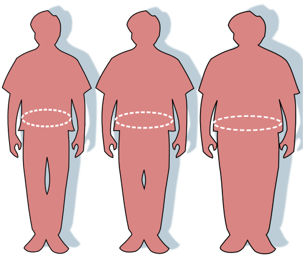
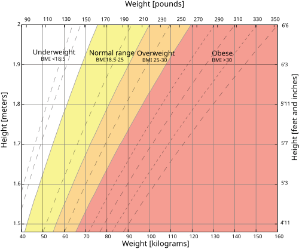

# OBESIDADE

A obesidade não é um desvio de caráter ou falta de força de vontade; é uma doença crônica, progressiva e recidivante. Se você entender que o corpo humano foi programado para poupar energia e não para perdê-la, toda a fisiopatologia e a dificuldade do tratamento farão sentido. Nas provas de residência, o foco mudou: saiu a visão simplista de "comer menos e exercitar mais" e entrou a regulação neuroendócrina, os critérios rigorosos para cirurgia e o manejo das comorbidades.

## Definição e Classificação

O diagnóstico de obesidade em adultos é essencialmente clínico e baseado no Índice de Massa Corporal (IMC). Embora o IMC não diferencie massa gorda de massa magra (um fisiculturista pode ter IMC de 32 e não ser obeso), ele é a ferramenta epidemiológica e clínica padrão ouro pela sua correlação com o risco de mortalidade.

A fórmula você já conhece: **IMC = Peso (kg) / Altura² (m²)**.

*Figura 1 - Comparação da circunferência abdominal entre indivíduo saudável, com sobrepeso e obeso, parâmetro importante na classificação de risco cardiovascular. Fonte: Renée Gordon/Victovoi, Public Domain | Wikimedia Commons*

## Classificação do IMC (Adultos - Diretriz ABESO)

| Categoria | IMC (kg/m²) | Risco de Comorbidades |
| --- | --- | --- |
| Baixo Peso | < 18,5 | Baixo (mas risco de outras doenças) |
| Eutrofia (Normal) | 18,5 – 24,9 | Médio |
| Sobrepeso (Pré-obesidade) | 25,0 – 29,9 | Aumentado |
| Obesidade Grau I | 30,0 – 34,9 | Moderado |
| Obesidade Grau II | 35,0 – 39,9 | Grave |
| Obesidade Grau III (Mórbida) | ≥ 40,0 | Muito Grave |

**Dica de Prova:** Se o IMC for > 50 kg/m², chamamos de **Superobesidade**. Guarde isso, pois algumas bancas usam esse termo para discutir casos de altíssimo risco cirúrgico.

### Circunferência Abdominal (CA)

O IMC nos diz "quanto" de peso existe, mas a CA nos diz "onde" ele está. A gordura visceral é metabolicamente muito mais ativa (e perigosa) que a gordura subcutânea.

Segundo a SBC (Sociedade Brasileira de Cardiologia) e a ABESO, os valores que indicam risco metabólico aumentado são:

- **Homens:** ≥ 94 cm (risco aumentado) e ≥ 102 cm (risco muito aumentado).

- **Mulheres:** ≥ 80 cm (risco aumentado) e ≥ 88 cm (risco muito aumentado).

**Cuidado:** Algumas questões de prova ainda usam os critérios do NCEP-ATP III (102 cm para homens e 88 cm para mulheres) como ponto de corte para Síndrome Metabólica. Fique atento ao enunciado.

*Figura 2 - Gráfico do Índice de Massa Corporal (IMC) mostrando as divisões entre peso normal, sobrepeso e obesidade conforme critérios da OMS. Fonte: InvictaHOG, Public Domain | Wikimedia Commons*

## Fisiopatologia: O Porquê da Fome

Por que seu paciente perde 5kg e depois estagna ou recupera tudo? É o chamado "set point" biológico. O hipotálamo, especificamente o **núcleo arqueado**, é o centro de controle.

### Hormônios Orexigênicos (Estimulam a fome)

O principal é a **Grelina**. Produzida no fundo gástrico, ela sobe no jejum e cai após a alimentação.

- **Pérola Clínica:** Em pacientes que fazem Bypass Gástrico, a exclusão do fundo gástrico reduz a grelina, o que explica parte da perda de apetite precoce.

### Hormônios Anorexígenos (Estimulam a saciedade)

- **Leptina:** Produzida pelo tecido adiposo. Quanto mais gordura, mais leptina. "Então o obeso não deveria ter fome, certo?". Errado. O obeso desenvolve **resistência à leptina**. O cérebro não recebe o sinal de saciedade, apesar de o hormônio estar alto.

- **Insulina:** Também atua no SNC reduzindo a ingestão alimentar.

- **GLP-1 e PYY:** Produzidos no íleo distal e cólon após a chegada de nutrientes. Eles lentificam o esvaziamento gástrico e avisam o cérebro que o alimento chegou.

**Erro comum de prova:** Achar que a obesidade é causada por "falta de leptina". A deficiência congênita de leptina existe, mas é raríssima. A regra na obesidade comum é a **hiperleptinemia com resistência**.

## Etiologia e Avaliação Clínica

A obesidade é multifatorial: genética, ambiente obesogênico, sono inadequado, estresse e medicamentos.

### Medicamentos que Ganham Peso (Cai muito!)

Sempre revise a lista de remédios do paciente. Se ele usa esses, a perda de peso será uma luta contra a maré:

- **Antipsicóticos:** Olanzapina, Quetiapina, Risperidona.

- **Anticonvulsivantes/Estabilizadores:** Valproato de Sódio, Carbamazepina, Lítio.

- **Antidiabéticos:** Insulina, Sulfonilureias, Pioglitazona.

- **Corticoides:** Prednisona e outros.

### Obesidade Secundária: Quando suspeitar?

Menos de 1% dos casos de obesidade têm uma causa endócrina específica, mas as bancas amam cobrar isso para testar seu raciocínio diferencial. Suspeite se houver:

- **Hipotireoidismo:** Ganho de peso leve (geralmente por edema/mixedema), bradicardia, pele seca. **Atenção:** Hipotireoidismo não causa obesidade grau III isoladamente.

- **Síndrome de Cushing:** Obesidade centrípeta, giba, estrias violáceas (> 1cm), fraqueza proximal e hipertensão.

- **Lesões Hipotalâmicas:** Tumores (craniofaringioma), trauma ou radiação. O paciente apresenta uma fome insaciável e ganho de peso súbito.

### O Papel da Microbiota

Como o Dr. Will sempre reforça em suas discussões, a microbiota intestinal de indivíduos obesos tende a ser menos diversa e mais eficiente em extrair energia de alimentos não digeríveis. Isso altera o FIAF (Fasting-Induced Adipose Factor) e aumenta o armazenamento de gordura.

## Complicações e Comorbidades

A obesidade é a "mãe" das Doenças Crônicas Não Transmissíveis (DCNTs).

- **Cardiovascular:** Aumento da atividade simpática e do Sistema Renina-Angiotensina-Aldosterona (SRAA), levando à HAS.

- **Metabólica:** Resistência à insulina, DM2 e Dislipidemia (clássico: ↑ Triglicerídeos, ↓ HDL, ↑ VLDL).

- **Hepática:** Doença Hepática Esteatótica Associada à Disfunção Metabólica (antiga NAFLD/Esteatose). Pode evoluir para cirrose e hepatocarcinoma.

- **Respiratória:** Apneia Obstrutiva do Sono (AOS) e Síndrome de Hipoventilação da Obesidade.

- **Neoplasias:** ↑ Risco de câncer de endométrio, mama (pós-menopausa), cólon, **rim** e pâncreas. **Pegadinha:** Obesidade NÃO está classicamente ligada ao câncer de pulmão (este é ligado ao tabagismo).

## Tratamento Não Farmacológico (MEV)

A base de tudo. Sem mudança de estilo de vida, o remédio falha e a cirurgia reganha peso.

### Dieta

Não existe "a melhor dieta" universal. O que funciona é o **déficit calórico** (geralmente 500 a 1000 kcal/dia a menos do que o gasto total).

- **In natura vs Ultraprocessados:** O Guia Alimentar para a População Brasileira recomenda a base da alimentação com alimentos *in natura* ou minimamente processados.

- **Frutose:** O excesso de frutose industrializada (xarope de milho) é um potente indutor de esteatose hepática e hipertrigliceridemia.

- **Café da manhã:** Inserir ou pular o café da manhã, isoladamente, não garante perda de peso em estudos controlados. O que importa é o balanço calórico total do dia.

### Atividade Física

- **Para saúde:** 150 min/semana de atividade moderada.

- **Para perda de peso sustentada:** 200 a 300 min/semana.

- **Intensidade:** Para otimizar a oxidação de gordura, deve-se atingir 60-80% da Frequência Cardíaca Máxima (220 - idade).

## Tratamento Farmacológico

**Indicações (Diretriz ABESO):**

- IMC ≥ 30 kg/m².

- IMC ≥ 27 kg/m² com comorbidades (HAS, DM2, Dislipidemia, AOS).

- Falha no tratamento não farmacológico isolado.

### Principais Medicamentos

| Fármaco | Mecanismo | Dose Típica | Principais Contraindicações / Efeitos |
| --- | --- | --- | --- |
| **Sibutramina** | Inibidor de recaptação de Serotonina e Noradrenalina (sacietógeno) | 10 - 15 mg/dia | **Absoluta:** Doença cardiovascular (IAM, AVC, Arritmia), HAS não controlada. |
| **Orlistate** | Inibidor da lipase gastrointestinal (reduz absorção de 30% da gordura) | 120 mg 3x/dia | Esteatorreia, urgência fecal. Reduz absorção de vitaminas lipossolúveis (A, D, E, K). |
| **Liraglutida** | Agonista do receptor de GLP-1 | 0,6 mg até 3,0 mg/dia (SC) | Náuseas, vômitos. Contraindicado em histórico de Carcinoma Medular de Tireoide ou NEM 2. |
| **Semaglutida** | Agonista do receptor de GLP-1 | 2,4 mg/semana (SC) | Semelhante à Liraglutida, mas com maior potência de perda de peso. |
| **Bupropiona + Naltrexone** | Atua no sistema de recompensa (reduz fissura/craving) | 8/90 mg (titular até 4 cp/dia) | **Absoluta:** Epilepsia/Convulsão, transtornos alimentares (bulimia/anorexia). |

**Dica MedEvo:** A Sibutramina é a medicação mais barata e disponível, mas o estudo SCOUT mostrou aumento de risco cardiovascular em pacientes que já tinham doença prévia. Por isso, em prova, se o paciente for cardiopata, a Sibutramina é a resposta ERRADA.

## Tratamento Cirúrgico (Cirurgia Bariátrica)

Este é o tema favorito das bancas. Você precisa decorar os critérios de indicação e as contraindicações.

### Indicações (Consenso Brasileiro)

- **IMC ≥ 40 kg/m²**, independente de comorbidades.

- **IMC ≥ 35 kg/m² + comorbidades** (DM2, HAS, AOS, Dislipidemia, Osteoartrite grave, NAFLD, etc.).

- **Idade:** Geralmente entre 18 e 65 anos. (Abaixo de 16 anos requer avaliação ética e de crescimento; acima de 65 requer avaliação de risco-benefício individual).

- **Tempo de doença:** Obesidade estável há pelo menos 2 anos.

- **Falha clínica:** Tratamento conservador (dieta, exercício, fármacos) por pelo menos 2 anos, sem sucesso.

### Técnicas Cirúrgicas

-

**Bypass Gástrico em Y de Roux (Misto):**

- Cria-se um pequeno "pouch" gástrico + desvio intestinal.

- **Vantagem:** É a técnica de escolha para pacientes com **DRGE grave (esofagite C ou D)** ou Esôfago de Barrett, pois o desvio impede o refluxo ácido e biliar.

- Excelente controle metabólico (DM2).

-

**Gastrectomia Vertical (Sleeve - Restritiva):**

- Remove-se o fundo e o corpo gástrico, transformando o estômago em um "tubo".

- **Cuidado:** Pode **piorar ou induzir o refluxo gastroesofágico**. Se a questão fala de paciente com IMC 38 e azia importante, não marque Sleeve; marque Bypass.

**Cirurgia Metabólica:** É a indicação de cirurgia para pacientes com **IMC entre 30 e 34,9** que possuem **Diabetes Mellitus Tipo 2 de difícil controle** (HbA1c > 7,0% apesar de tratamento otimizado), com menos de 10 anos de diagnóstico de DM2.

## Obesidade Infantil

O diagnóstico na criança não usa os valores fixos de 25 e 30. Usamos o **Escore-Z do IMC para idade** (Gráficos da OMS/SBP).

- **0 a 5 anos:**

- Z > +2: Sobrepeso.

- Z > +3: Obesidade.

- **5 a 19 anos:**

- Z > +1: Sobrepeso.

- Z > +2: Obesidade.

- Z > +3: Obesidade Grave.

**Tratamento na infância:** A primeira linha é SEMPRE a mudança de comportamento da família. Medicamentos e cirurgia são exceções raríssimas e restritas a casos graves com falha total e complicações severas. O aleitamento materno exclusivo por 6 meses é um dos principais fatores protetores contra a obesidade infantil.

## Situações Especiais e Pegadinhas

- **Álcool e Triglicerídeos:** O etanol aumenta a síntese hepática de VLDL e inibe a Lipase Lipoproteica (LPL). Resultado: Hipertrigliceridemia severa. Paciente com TG alto deve suspender álcool.

- **T3 (Tri-iodotironina):** Nunca use T3 para tratar obesidade em pacientes eutireoidianos. Isso causa tireotoxicose factícia, perda de massa magra e risco de arritmias.

- **Risco Perioperatório:** O obeso tem maior risco de complicações respiratórias, tromboembolismo (TEV) e dificuldade de intubação (pescoço curto, mobilidade cervical reduzida).

- **Adiponectina:** É o único hormônio do tecido adiposo que **diminui** na obesidade. Ela é anti-inflamatória e sensibilizadora de insulina. Sua queda contribui para a resistência insulínica.

## Pontos-Chave para Prova

- **Diagnóstico Adulto:** IMC ≥ 30 kg/m². Sobrepeso: 25-29,9 kg/m².

- **Indicação Cirúrgica:** IMC ≥ 40 ou IMC ≥ 35 com comorbidades + falha do tratamento clínico (2 anos).

- **Cirurgia Metabólica:** IMC 30-34,9 + DM2 refratário (HbA1c > 7%) + < 10 anos de doença.

- **Bypass vs Sleeve:** Bypass é melhor para quem tem Refluxo (DRGE) grave. Sleeve pode piorar o refluxo.

- **Sibutramina:** Contraindicação ABSOLUTA em pacientes com histórico de doença cardiovascular (IAM, AVC, angina) ou HAS não controlada.

- **Bupropiona/Naltrexone:** Contraindicação ABSOLUTA em pacientes com histórico de convulsão ou transtornos alimentares.

- **Hormônios:** Grelina (fome - estômago); Leptina (saciedade - gordura); GLP-1 (saciedade - intestino).

- **Perfil Lipídico Típico:** ↑ Triglicerídeos, ↓ HDL, ↑ VLDL.

- **Câncer:** Obesidade aumenta risco de câncer de Rim, Mama, Endométrio e Cólon. NÃO aumenta risco de câncer de pulmão.

- **Atividade Física:** Meta de 150-300 min/semana. Perda de peso exige mais tempo/intensidade que apenas manutenção da saúde.

- **Infância:** Diagnóstico por Escore-Z (Z > +2 é obesidade em > 5 anos; Z > +3 em < 5 anos).

- **Microbiota:** Obesos têm microbiota que extrai mais energia dos alimentos (maior eficiência energética).

- **Pérola de Ouro:** O tratamento farmacológico deve ser considerado se IMC ≥ 30 ou ≥ 27 com comorbidades. Nunca prescreva "fórmulas magistrais" com misturas de anfetaminas, diuréticos e hormônios tireoidianos. 🧠

 Cópia offline para consulta pessoal.
 Fonte original:
 [https://www.medevo.com.br/material-apoio/ler/56a7bfce-d914-4d36-8f89-d9249ab327c2](https://www.medevo.com.br/material-apoio/ler/56a7bfce-d914-4d36-8f89-d9249ab327c2)
