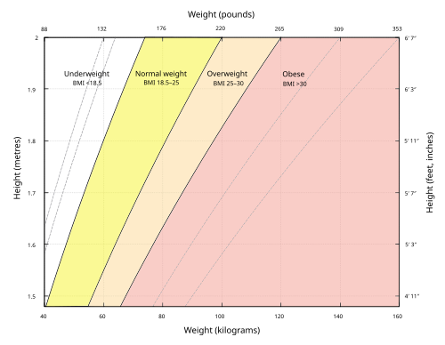

# OBESIDADE: PROMOÇÃO DE SAÚDE E POLÍTICAS NA APS

Para entender a obesidade na Atenção Primária à Saúde (APS), você precisa primeiro mudar a chave do "pensamento hospitalar". Na prova de residência, quando o tema é Medicina Preventiva, a banca não quer apenas que você saiba a dose da medicação, ela quer que você entenda como o sistema de saúde se organiza para enfrentar uma epidemia que é, acima de tudo, social e estrutural.

A obesidade não é apenas um desequilíbrio entre "comer muito e gastar pouco". Se você responder isso em uma questão de saúde pública, vai errar. Ela é uma doença crônica, complexa e multicausal. No MedEvo, sempre batemos na tecla de que a APS é o cenário ideal para esse manejo porque ela possui os atributos de longitudinalidade e coordenação do cuidado, essenciais para uma condição que dura a vida toda.

## O Cenário Epidemiológico e a Transição Nutricional

O Brasil passou por uma transição nutricional extremamente rápida. Saímos de um cenário de desnutrição prevalente para um cenário onde mais de 60% da população adulta apresenta excesso de peso. Isso cai muito em prova associado ao conceito de "Transição Epidemiológica", onde as doenças infectocontagiosas perdem espaço para as Doenças Crônicas Não Transmissíveis (DCNT).

Um dado que as bancas adoram: a meta de consumo de frutas e hortaliças. Em 2011, o Brasil parecia estar no caminho certo, mas o desempenho piorou nos últimos anos. Isso torna o cumprimento das metas globais para 2022 e 2030 incerto. Por que isso acontece? Porque o ambiente se tornou "obesogênico". É mais barato e fácil comprar um pacote de bolacha recheada (ultraprocessado) do que manter uma dieta rica em alimentos in natura.

*Figura 1 - Gráfico de Índice de Massa Corporal (IMC) com curvas de classificação segundo a OMS, utilizado no SISVAN para diagnóstico nutricional. Fonte: amfucla, CC BY-SA 4.0 | Wikimedia Commons*

## Diagnóstico e Classificação: Onde a Prova te Pega

O diagnóstico na APS é clínico e antropométrico. O Índice de Massa Corporal (IMC) continua sendo o padrão-ouro para triagem populacional, mas ele tem falhas que o examinador conhece bem.

### O IMC em Adultos e Idosos

Para adultos (20 a 59 anos), seguimos a classificação clássica da OMS. Mas atenção: para o idoso (60 anos ou mais), o ponto de corte é diferente. Por que? Porque o idoso tem perda de massa magra (sarcopenia) e uma redistribuição da gordura corporal. Um IMC de 23, que é normal para um jovem, pode indicar baixo peso para um idoso.

**Tabela 1: Classificação do IMC para Adultos (OMS)**

| Classificação | IMC (kg/m²) |
| --- | --- |
| Baixo Peso | < 18,5 |
| Peso Adequado | 18,5 a 24,9 |
| Sobrepeso | 25,0 a 29,9 |
| Obesidade Grau I | 30,0 a 34,9 |
| Obesidade Grau II | 35,0 a 39,9 |
| Obesidade Grau III (Mórbida) | ≥ 40,0 |

**Tabela 2: Classificação do IMC para Idosos (SISVAN/Ministério da Saúde)**

| Classificação | IMC (kg/m²) |
| --- | --- |
| Baixo Peso | < 22 |
| Peso Adequado | 22 a 27 |
| Sobrepeso | > 27 |

**Dica de Prova:** Se a questão trouxer um paciente de 65 anos com IMC de 26, ele está com "Peso Adequado". Se fosse um adulto de 30 anos, seria "Sobrepeso". Não caia nessa pegadinha.

### Circunferência Abdominal (CA)

A CA é o melhor preditor de risco metabólico e cardiovascular na APS, pois reflete a gordura visceral.

- Risco aumentado: Homens ≥ 94 cm | Mulheres ≥ 80 cm.

- Risco muito aumentado: Homens ≥ 102 cm | Mulheres ≥ 88 cm.

Muitas vezes, o paciente tem um IMC de sobrepeso, mas uma CA de risco muito aumentado. Nesses casos, a conduta deve ser mais agressiva no controle de outros fatores de risco, como pressão arterial e glicemia.

## Promoção da Saúde vs. Prevenção de Doenças

Este é o coração da Medicina Preventiva. Você precisa saber diferenciar esses conceitos para não zerar a prova.

- **Promoção da Saúde (PS):** Foca na população geral e nos determinantes sociais. O objetivo é aumentar o bem-estar e a autonomia. Exemplo: Criar uma ciclovia na cidade ou uma política de taxação de bebidas açucaradas.

- **Prevenção de Doenças (PD):** Foca em grupos de risco ou na doença já instalada. O objetivo é evitar a doença ou suas complicações. Exemplo: Orientar dieta para um paciente pré-diabético.

Como o Dr. Will costuma dizer, a Promoção da Saúde é "dar poder" (empoderamento) à comunidade, enquanto a Proteção Específica (que faz parte da Prevenção Primária) é uma medida direta, como a vacinação ou o uso de EPIs.

### Os Níveis de Prevenção na Obesidade

As bancas amam cobrar os níveis de Leavell & Clark aplicados à obesidade. Vamos organizar isso:

- **Prevenção Primária:** Atua no período pré-patogênico. Inclui a Promoção da Saúde (educação alimentar nas escolas) e a Proteção Específica (fortificação de alimentos com iodo ou ferro, embora o iodo seja para bócio, o conceito de fortificação alimentar é prevenção primária).

- **Prevenção Secundária:** Foca no diagnóstico precoce e tratamento imediato. É o rastreamento. Exemplo: Calcular o IMC de todos os pacientes que entram na Unidade Básica de Saúde (UBS).

- **Prevenção Terciária:** Reabilitação e redução de incapacidades. Exemplo: Fisioterapia para um paciente com obesidade mórbida que tem osteoartrite grave, ou o manejo de complicações pós-cirurgia bariátrica.

- **Prevenção Quaternária (P4):** Este é o conceito da moda. P4 é proteger o paciente de intervenções médicas excessivas, do sobrediagnóstico (overdiagnosis) e do sobretratamento (overtreatment). Na obesidade, isso significa evitar a medicalização desnecessária de um sobrepeso sem comorbidades ou evitar estigmatizar o paciente.

**Exemplo Clínico:** Paciente de 25 anos, IMC 26 (sobrepeso), sem nenhuma comorbidade, exames laboratoriais normais. A conduta de P4 seria não iniciar fármacos e focar em grupos operativos de mudança de estilo de vida, evitando transformar esse paciente em um "doente crônico" precocemente.

## O Guia Alimentar para a População Brasileira e a Classificação NOVA

Se você vai fazer prova de residência no Brasil, você TEM que conhecer o Guia Alimentar de 2014. Ele abandonou a pirâmide alimentar e focou no **nível de processamento dos alimentos**. Isso é a Classificação NOVA.

- **Alimentos In Natura ou Minimamente Processados:** São a base da alimentação. Frutas, legumes, carnes frescas, feijão, arroz.

- **Ingredientes Culinários Processados:** Sal, açúcar, óleos e gorduras. Usados para temperar e cozinhar.

- **Alimentos Processados:** Alimentos in natura modificados pela indústria com adição de sal ou açúcar (ex: conserva de pepino, queijos, pães artesanais).

- **Alimentos Ultraprocessados:** Formulações industriais com muitos ingredientes e nomes estranhos (corantes, aromatizantes). Ex: refrigerantes, salgadinhos de pacote, macarrão instantâneo, nuggets.

**Regra de Ouro do Guia:** Prefira alimentos in natura; limite processados; EVITE ultraprocessados. Os ultraprocessados estão diretamente ligados ao aumento da obesidade e DCNTs porque são hiperpalatáveis e inibem os mecanismos naturais de saciedade.

## Atividade Física: Prescrição na APS

A atividade física é um pilar do tratamento não medicamentoso. Mas não basta dizer "tem que caminhar". A prova vai cobrar números.

- **Adultos:** 150 a 300 minutos de atividade moderada por semana, ou 75 a 150 minutos de atividade vigorosa.

- **Benefícios Adicionais:** Acima de 300 minutos/semana, há benefícios adicionais para a saúde cardiovascular e controle de peso, sem um limite superior de dano claramente estabelecido para indivíduos saudáveis.

- **Crianças e Adolescentes (6-17 anos):** Pelo menos 60 minutos por dia de atividade moderada a vigorosa.

**Dica de Prova:** A atividade física regular tem evidência consistente na redução do risco de diversos tipos de câncer, especialmente o colorretal e de mama, além de proteção metabólica (DM2) e cardiovascular.

*Figura 2 - Pirâmide alimentar, ferramenta de educação nutricional utilizada na vigilância alimentar e promoção de hábitos saudáveis. Fonte: USDA, Public Domain | Wikimedia Commons*

## Manejo Clínico e Terapêutico na APS

O tratamento da obesidade na APS deve ser multiprofissional. O médico não trabalha sozinho; ele precisa do nutricionista, do educador físico e do psicólogo (Núcleo de Apoio à Saúde da Família - NASF, ou equipes multiprofissionais).

### Tratamento Não Farmacológico

É a primeira escolha para todos. A meta inicial de perda de peso costuma ser de 5% a 10% do peso corporal em 6 meses. Isso já traz benefícios metabólicos imensos.

- **Dieta:** Redução de gorduras saturadas, sódio e açúcares simples. Aporte calórico para situações específicas (como politraumatizados na fase aguda) pode chegar a 35-40 kcal/kg, mas para perda de peso, trabalhamos com déficit calórico.

- **Grupos Operativos:** Para pacientes com sobrepeso sem comorbidades, os grupos de mudança de estilo de vida são a melhor estratégia. Eles promovem a troca de experiências e aumentam a adesão.

### Tratamento Farmacológico

Quando indicar? Segundo a ABESO (Associação Brasileira para o Estudo da Obesidade):

- IMC ≥ 30 kg/m².

- IMC ≥ 27 kg/m² com comorbidades (HAS, DM2, dislipidemia, apneia do sono).

**Principais Drogas e Doses:**

| Droga | Mecanismo | Dose Comum | Observações |
| --- | --- | --- | --- |
| **Sibutramina** | Inibidor da recaptação de Serotonina e Noradrenalina | 10mg a 15mg/dia | Contraindicada em DCV estabelecida e HAS descontrolada. |
| **Orlistate** | Inibidor de lipases gastrointestinais | 120mg até 3x/dia | Age na absorção de gordura (30%). Causa esteatorreia. |
| **Liraglutida** | Agonista do receptor de GLP-1 | Até 3,0mg/dia (SC) | Excelente para DM2 e risco CV. |

**Cuidado:** O uso de fórmulas magistrais ("fórmulas para emagrecer") contendo benzodiazepínicos, diuréticos e hormônios tireoidianos é condenado e considerado má prática médica (iatrogenia).

## Políticas Públicas e Fatores Estruturais

A obesidade não se resolve apenas no consultório. Ela exige políticas públicas intersetoriais. As bancas cobram o conhecimento sobre:

- **Regulação de Propaganda:** Restrição de publicidade de alimentos ultraprocessados para crianças.

- **Rotulagem Nutricional:** A adoção da "lupa" nos rótulos brasileiros para indicar alto teor de açúcar adicionado, gordura saturada e sódio.

- **Ambiente Escolar:** Proibição de venda de refrigerantes e alimentos ultraprocessados em cantinas escolares.

- **Taxação:** Aumento de impostos sobre bebidas açucaradas (medida recomendada pela OMS).

Lembre-se: Promoção da saúde pós-Ottawa foca na saúde multidimensional e na intervenção participativa. Não é apenas "dar uma palestra", é criar condições para que a escolha saudável seja a mais fácil.

## Situações Especiais e Pegadinhas de Prova

### Obesidade Infantil

O foco deve ser o ambiente familiar e escolar. O aleitamento materno exclusivo até os 6 meses é um fator protetor crucial. Deve-se evitar o tempo de tela excessivo e o consumo de leite de vaca integral precocemente. O exercício para a criança deve ser lúdico, não uma "prescrição de academia".

### Gestantes

A obesidade na gestação aumenta o risco de pré-eclâmpsia, diabetes gestacional e prematuridade. O ganho de peso deve ser rigorosamente monitorado, mas dietas restritivas severas são evitadas para não prejudicar o desenvolvimento fetal.

### Prevenção Quaternária e Rastreamento

Muitas questões trazem o cenário de rastreamento de doenças em pacientes obesos. Lembre-se: rastreamento em saudáveis sem risco é incompatível com a boa prática se não houver evidência. No entanto, para o obeso, o rastreamento de DM2 (glicemia de jejum) e dislipidemia é indicado precocemente (muitas vezes a partir dos 35 anos ou antes se houver outros fatores de risco).

### Iatrogenia e Estigma

O "viés de peso" por parte dos profissionais de saúde é uma forma de iatrogenia. Atribuir todos os problemas do paciente à obesidade sem investigar outras causas é um erro comum que as bancas podem explorar em casos clínicos de ética ou APS.

## Pontos-Chave para Prova 🎯

- **IMC Adulto:** 18,5-24,9 (Normal), 25-29,9 (Sobrepeso), ≥ 30 (Obesidade).

- **IMC Idoso:** < 22 (Baixo peso), > 27 (Sobrepeso).

- **Circunferência Abdominal:** Homem ≥ 102 cm e Mulher ≥ 88 cm indicam risco MUITO aumentado.

- **Classificação NOVA:** Ultraprocessados devem ser evitados; In natura são a base.

- **Prevenção Primária:** Atua antes da doença (Promoção da Saúde + Proteção Específica).

- **Prevenção Secundária:** Diagnóstico precoce (Rastreamento/Screening).

- **Prevenção Terciária:** Reabilitação (evitar sequelas de uma doença já instalada).

- **Prevenção Quaternária:** Evitar iatrogenia, sobretratamento e medicalização desnecessária.

- **Atividade Física:** Meta de 150-300 min/semana para adultos.

- **Tratamento Farmacológico:** Indicado se IMC ≥ 30 ou ≥ 27 com comorbidades, após falha do tratamento não farmacológico.

- **Sibutramina:** Contraindicada se o paciente tiver doença cardiovascular (infarto prévio, AVC, arritmia).

- **Metas de Perda de Peso:** 5% a 10% do peso inicial em 6 meses é um sucesso terapêutico.

- **Fatores Estruturais:** Regulação de propaganda e rotulagem clara são estratégias de saúde pública fundamentais.

- **Erro Comum:** Achar que amigdalectomia previne febre reumática (o correto é tratar a faringoamigdalite) ou que bronzeamento artificial previne câncer (ele aumenta o risco). Conecte isso ao conceito de Proteção Específica correta.

- **Multicausalidade:** A obesidade é influenciada por genética, ambiente, metabolismo e fatores psicossociais. Nunca responda que é "apenas falta de vontade".

Ao estudar este material, você percebe que a obesidade na APS é um mosaico. Você precisa dominar desde o cálculo do IMC até a compreensão de por que uma taxa sobre o refrigerante é uma medida de prevenção primária. Mantenha o foco na autonomia do paciente e na coordenação do cuidado pela equipe de saúde da família.

 Cópia offline para consulta pessoal.
 Fonte original:
 [https://www.medevo.com.br/material-apoio/ler/84e7a336-c57c-4814-b8de-d59ec110c07e](https://www.medevo.com.br/material-apoio/ler/84e7a336-c57c-4814-b8de-d59ec110c07e)
