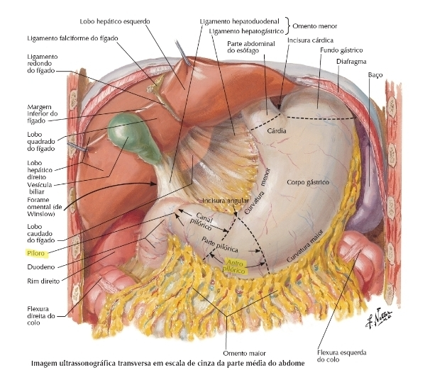
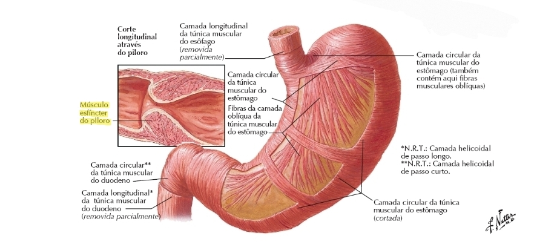
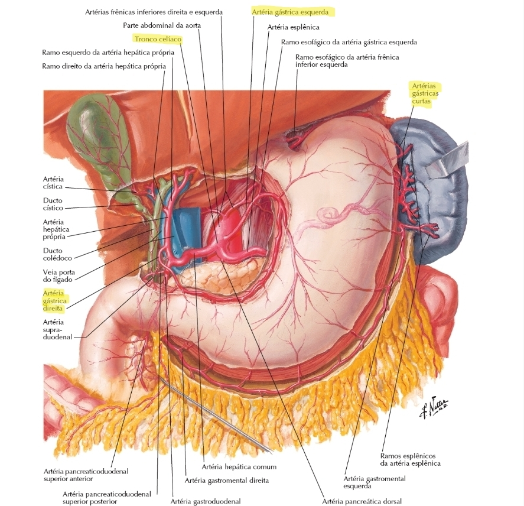
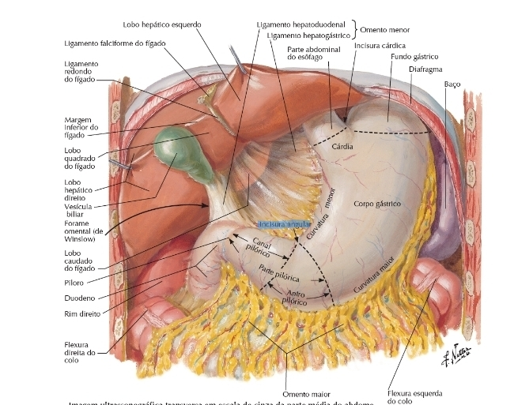

# OBSTRUÇÃO DA SAÍDA GÁSTRICA

A obstrução da saída gástrica (OSG) não é uma doença em si, mas o estágio final de diversos processos patológicos que impedem o esvaziamento do estômago. Se você entender a anatomia do "funil" que é o antro e o piloro, entenderá por que qualquer processo inflamatório ou neoplásico ali vira uma emergência ou uma condição de desnutrição grave.

Nas provas de residência, o examinador não quer apenas que você saiba que o paciente vomita. Ele quer que você entenda o **distúrbio metabólico** (que é clássico e cai muito) e que saiba diferenciar as complicações das cirurgias usadas para tratar essa obstrução.

## Anatomia e Fisiologia Aplicada

Para entender a obstrução, precisamos lembrar do "porteiro" do estômago: o piloro. Ele é um esfíncter muscular verdadeiro que controla a passagem do quimo para o duodeno.

O estômago é vascularizado exclusivamente por ramos do **tronco celíaco**. Guarde isso: as artérias gástricas direita e esquerda (pequena curvatura) e as gástricas curtas e gastroepiplóicas (grande curvatura) vêm todas, direta ou indiretamente, do tronco celíaco. Em cirurgias de grande porte, como a gastrectomia com linfadenectomia D2, o cirurgião precisa dominar essa anatomia para não causar isquemia do coto gástrico ou de órgãos adjacentes.

O marco anatômico para o antro gástrico é a **incisura angularis**. Em provas de técnica operatória, quando falamos de antrectomia, é a partir dessa marca que o cirurgião planeja a ressecção.

## Etiologia: O que está "fechando a porta"?

Dividimos as causas em benignas e malignas. Antigamente, a úlcera péptica era a causa número um. Hoje, com os inibidores de bomba de prótons (IBP) e o tratamento do *H. pylori*, o cenário mudou.

### Causas Benignas

- **Doença Ulcerosa Péptica (DUP):** É a causa benigna mais comum em adultos. A obstrução ocorre por dois mecanismos: agudamente pelo edema e inflamação ao redor de uma úlcera ativa no canal pilórico; ou cronicamente pela cicatrização e fibrose (estenose cicatricial).

- **Pâncreas Anular:** Uma malformação congênita onde o pâncreas "abraça" a segunda porção do duodeno. No adulto, isso pode se manifestar como obstrução. **Dica de prova:** O tratamento de escolha aqui não é mexer no pâncreas (risco de fístula pancreática altíssimo), mas sim fazer um bypass, geralmente uma **duodenojejunostomia**.

- **Volvo Gástrico:** O estômago gira sobre seu próprio eixo. Está muito associado a hérnias hiatais paraesofágicas volumosas (tipo IV).

- **Síndrome da Artéria Mesentérica Superior (SAMS):** Também chamada de Pinçamento Aorto-Mesentérico. Ocorre a compressão da terceira porção do duodeno entre a aorta e a artéria mesentérica superior, geralmente após perda ponderal rápida (perda do coxim gorduroso).

### Causas Malignas

O **Adenocarcinoma Gástrico** (especialmente o de localização antral) é a causa maligna mais frequente. Outras causas incluem tumores de cabeça de pâncreas que invadem o duodeno e linfomas. Nas questões de prova, se o paciente tem perda de peso importante, anemia e uma massa palpável (tumor de coto gástrico ou massa antral), pense logo em neoplasia.

## Fisiopatologia e o "Pulo do Gato" das Provas

Aqui é onde o Dr. Will sempre avisa: "Se você não souber o distúrbio hidroeletrolítico da OSG, você vai perder a questão mais fácil da prova".

Quando o paciente obstrui a saída do estômago, ele vomita apenas conteúdo gástrico. O suco gástrico é rico em H+ (ácido clorídrico) e Cl- (cloreto).

**A sequência do desastre metabólico:**

- **Vômitos repetidos:** Perda de H+, Cl- e água.

- **Alcalose Metabólica Hipoclorêmica:** Pela perda de ácido e cloro.

- **Desidratação:** O corpo tenta compensar a perda de volume.

- **Hipocalemia:** O rim, tentando poupar sódio (para manter volume), acaba excretando potássio no túbulo distal. Além disso, a própria alcalose joga o potássio para dentro da célula.

- **Acidúria Paradoxal:** Esta é a pegadinha clássica. O paciente está em ALCALOSE (sangue básico), mas a urina sai ÁCIDA. Por quê? Porque o rim chega num ponto de desidratação tão grave que ele precisa reabsorver sódio a qualquer custo. Para reabsorver Na+, ele deveria trocar por K+, mas o K+ já acabou. Então, ele começa a trocar Na+ por H+. O corpo sacrifica o pH sanguíneo para tentar manter a volemia.

| Parâmetro | Alteração na OSG |
| --- | --- |
| pH Sanguíneo | Elevado (Alcalose) |
| Cloro Sérico | Baixo (Hipocloremia) |
| Potássio Sérico | Baixo (Hipocalemia) |
| pH Urinário | Baixo (Acidúria Paradoxal) |
| Bicarbonato | Elevado |

## Quadro Clínico: Como o paciente chega?

O paciente típico de OSG por câncer é o idoso com emagrecimento. O de OSG por úlcera é o paciente com história de dor epigástrica crônica que piora após comer.

**Sintomas Cardinais:**

- **Vômitos pós-prandiais tardios:** O paciente vomita restos alimentares de refeições feitas há 8, 12 ou até 24 horas.

- **Vômitos NÃO biliosos:** Se o conteúdo é bilioso, a obstrução é ABAIXO da ampola de Vater (pós-duodenal). Na OSG, a bile não consegue voltar para o estômago porque o piloro está fechado.

- **Plenitude epigástrica e saciedade precoce:** O estômago vira um "saco" dilatado.

- **Perda de peso e desidratação.**

**Exame Físico:**

- **Sinal do Sucussão (ou "Chapoteio"):** Você balança o abdome do paciente e ouve o barulho de líquido chacoalhando no estômago horas após a última refeição. É patognomônico de estômago retencionista.

- **Massa palpável:** Pode indicar um tumor antral avançado.

**O Caso Especial do Volvo Gástrico:**
Se a prova descrever um quadro agudo de dor epigástrica súbita, você deve procurar a **Tríade de Borchardt**:

- Dor epigástrica súbita e intensa.

- Vômitos improdutivos (o paciente tenta, mas não sai nada).

- Dificuldade ou impossibilidade de passar a Sonda Nasogástrica (SNG).
*Conduta:* Laparoscopia de urgência + Gastropexia (fixar o estômago para não rodar de novo).

## Diagnóstico: Confirmando a Obstrução

O diagnóstico começa com a suspeita clínica, mas precisa de imagem e endoscopia.

- **Endoscopia Digestiva Alta (EDA):** É o padrão-ouro. Permite ver a causa (úlcera vs. câncer), realizar biópsias e, em alguns casos, tratar (dilatação por balão ou colocação de stent). **Cuidado:** Antes da EDA, o estômago deve ser esvaziado com uma SNG de grosso calibre para evitar aspiração durante o exame.

- **Radiografia Simples:** Pode mostrar uma grande bolha gástrica e ausência de gás distalmente.

- **Serigrafia (REED):** Útil para ver a anatomia e o grau de esvaziamento, especialmente em casos de suspeita de SAMS ou pâncreas anular.

- **Tomografia de Abdome:** Essencial se houver suspeita de malignidade para estadiamento (ver invasão local e metástases).

## Tratamento Inicial: Estabilizar antes de Operar

Nunca, eu repito, **NUNCA** leve um paciente com OSG direto para a mesa de cirurgia sem antes corrigir o distúrbio metabólico. Um paciente alcalótico e hipocalêmico tem um risco altíssimo de arritmias e complicações anestésicas.

**Protocolo de Manejo Inicial:**

- **Descompressão Gástrica:** SNG de grosso calibre em aspiração contínua ou intermitente. Isso diminui o edema da parede gástrica e previne pneumonia aspirativa.

- **Reposição Volêmica:** Soro Fisiológico 0,9% (precisamos de Cloro!). Não use Ringer Lactato inicialmente, pois o lactato é convertido em bicarbonato, o que pode piorar a alcalose.

- **Correção de Eletrólitos:** Reposição agressiva de Potássio (KCl).

- **Nutrição:** Se a obstrução for total, o paciente precisará de Nutrição Parenteral Total (NPT) ou acesso enteral pós-pilórico (se possível passar a sonda).

## Tratamento Cirúrgico e Reconstruções

Se o tratamento clínico (IBP, erradicação de *H. pylori*, dilatação endoscópica) falhar na causa benigna, ou se for câncer, a cirurgia é mandatória. Aqui o MedEvo destaca que as bancas amam as técnicas de reconstrução.

### 1. Piloroplastia

Usada em casos de estenose benigna ou associada à vagotomia.

- **Heineke-Mikulicz:** Incisão longitudinal sobre o piloro e fechamento transversal. É a mais comum.

- **Finney:** Uma gastroduodenostomia mais ampla, usada quando há muita fibrose.

### 2. Gastrectomias e Reconstruções

Quando retiramos parte do estômago (antrectomia ou gastrectomia subtotal), precisamos reconstruir o trânsito.

- **Billroth I (B-I):** Gastroduodenoanastomose. O estômago é ligado direto no duodeno. É a mais fisiológica, mas tem maior risco de deiscência se houver tensão na sutura.

- **Billroth II (B-II):** Gastrojejunoanastomose. O coto duodenal é sepultado e o estômago é ligado a uma alça de jejuno. Cria-se uma **alça aferente** (que traz bile e suco pancreático) e uma **alça eferente** (por onde sai o alimento).

- *Problema:* A bile passa direto pela boca da anastomose, podendo causar gastrite alcalina.

- **Y de Roux:** É a "reconstrução padrão-ouro" para evitar refluxo. O jejuno é cortado; a parte distal sobe para o estômago e a parte proximal (que traz a bile) é ligada no jejuno cerca de 40-60 cm abaixo. Isso desvia a bile do estômago.

### 3. Tratamento do Câncer Gástrico

- **Antro (Borrmann I, II ou III):** Gastrectomia subtotal + Linfadenectomia D2 (mínimo 15 linfonodos) + Reconstrução a B-II ou Y de Roux.

- **Corpo ou Fundo:** Gastrectomia Total + D2 + Reconstrução em Y de Roux.

## Complicações Pós-Gastrectomia: O "Terror" dos Alunos

As questões de prova adoram colocar um paciente que operou o estômago há 6 meses e agora tem sintomas novos. Você precisa saber diferenciar cada síndrome.

### 1. Síndrome de Dumping

Ocorre pela perda da função esfincteriana do piloro. O alimento (especialmente carboidratos simples) "cai" de uma vez no intestino.

- **Dumping Precoce (15-30 min após comer):** O conteúdo hiperosmolar no intestino puxa água do sangue para o lúmen intestinal.

- *Sintomas:* Dor abdominal, diarreia, taquicardia, sudorese, palidez (sintomas gastrointestinais + vasomotores).

- **Dumping Tardio (1-3 horas após comer):** A chegada rápida de glicose no intestino causa um pico de insulina, gerando uma **hipoglicemia reacional**.

- *Tratamento:* Dieta fracionada, evitar líquidos durante as refeições e reduzir carboidratos simples.

### 2. Síndrome da Alça Aferente

Exclusiva da reconstrução **Billroth II**. A alça que traz a bile fica obstruída (por angulação ou hérnia).

- **Quadro Clínico:** Dor epigástrica pós-prandial que aumenta de intensidade e é subitamente aliviada por **vômitos biliosos em jato**. O vômito alivia a dor porque esvazia a pressão da alça.

- **Tratamento:** Conversão para Y de Roux.

### 3. Gastrite Alcalina (Refluxo Biliar)

Também comum no Billroth II. A bile irrita a mucosa gástrica constantemente.

- **Quadro Clínico:** Dor epigástrica contínua, que **NÃO melhora com o vômito**. O paciente vomita bile, mas a queimação continua.

- **Tratamento:** Conversão para Y de Roux (para desviar a bile).

### 4. Síndrome da Alça Eferente

É uma obstrução mecânica da alça de saída. O paciente tem vômitos alimentares (não biliosos se for precoce) e sinais de obstrução intestinal alta.

| Síndrome | Vômito Bilioso? | Alivia a dor? | Reconstrução Associada |
| --- | --- | --- | --- |
| **Alça Aferente** | Sim | Sim (em jato) | Billroth II |
| **Gastrite Alcalina** | Sim | Não | Billroth II |
| **Dumping** | Não (geralmente) | N/A | Qualquer uma sem piloro |

## Situações Especiais e Pegadinhas

- **Tumor de Coto Gástrico:** Paciente que fez gastrectomia por úlcera há 15-20 anos e agora volta com dor e perda de peso. O risco de câncer no estômago remanescente aumenta muito após 15 anos, especialmente no Billroth II (devido à inflamação crônica pela bile).

- **Gastrostomia Cirúrgica:** Se a prova perguntar sobre acesso enteral definitivo em paciente com obstrução esofágica ou gástrica irresecável, a **Técnica de Glasmann** é uma das opções de gastrostomia definitiva.

- **Fístula de Alto Débito:** Se após uma gastrectomia o paciente evoluir com saída de secreção clara (cloreto baixo, pH alcalino) pelo dreno, suspeite de fístula pancreática ou biliar. Se o Cloro for muito baixo (ex: 70 mEq/L), reforça a origem pancreática/biliar.

## Diagnóstico Diferencial de Vômitos Pós-Operatórios

Imagine um paciente no 5º dia de pós-operatório de gastrectomia que começa a vomitar.

- **Deiscência de Sutura/Fístula:** Geralmente acompanhada de febre, taquicardia e dor abdominal súbita.

- **Gastroparesia (Íleo Gástrico):** O estômago "não acorda". Comum após vagotomia. O tratamento é procinético e SNG.

- **Obstrução Mecânica (Hérnia interna):** Dor em cólica e parada de eliminação de flatos.

## Pontos-Chave para Prova 💡

- **Distúrbio Clássico:** Alcalose metabólica, hipoclorêmica, hipocalêmica com acidúria paradoxal. Memorize isso como um mantra.

- **Vômito na OSG:** É sempre **não bilioso** e contém restos alimentares de horas atrás.

- **Tríade de Borchardt (Volvo Gástrico):** Dor epigástrica súbita + Vômitos improdutivos + Impossibilidade de passar SNG. Conduta: Cirurgia.

- **Pâncreas Anular:** Não ressecar o pâncreas. Fazer bypass (Duodenojejunostomia).

- **Billroth I vs. II:** B-I é gastroduodeno (mais fisiológico); B-II é gastrojejuno (risco de alça aferente e gastrite alcalina).

- **Y de Roux:** É a solução para quase todas as complicações de refluxo biliar (Gastrite alcalina e Alça aferente).

- **Dumping Precoce:** Sintomas vasomotores (taquicardia, sudorese) + GI, 15-30 min após comer. Causa: distensão osmótica do jejuno.

- **Dumping Tardio:** Hipoglicemia reacional, 1-3 horas após comer. Causa: excesso de insulina.

- **Alça Aferente:** Vômito bilioso que **ALIVIA** a dor.

- **Gastrite Alcalina:** Vômito bilioso que **NÃO ALIVIA** a dor.

- **Vascularização Gástrica:** Origem exclusiva no tronco celíaco.

- **Linfadenectomia D2:** Padrão para câncer gástrico, exige retirada de pelo menos 15 linfonodos.

- **Sinal de Sucussão:** Indica estômago retencionista (obstrução crônica).

- **Tratamento Inicial:** SNG + Soro Fisiológico + KCl. Nunca opere o paciente desequilibrado metabolicamente.

- **Acidúria Paradoxal:** Ocorre porque o rim troca H+ por Na+ na tentativa desesperada de manter a volemia na ausência de K+.

- **Contraindicação Absoluta:** Não realizar anastomose B-I se houver tensão na linha de sutura ou se o duodeno estiver muito inflamado/fibrótico.

- **Primeira Escolha no Câncer Antral:** Gastrectomia subtotal com reconstrução a B-II ou Y de Roux + Linfadenectomia D2.

 Cópia offline para consulta pessoal.
 Fonte original:
 [https://www.medevo.com.br/material-apoio/ler/fa9c37c4-e8a5-43b4-bd1a-b64fc1374151](https://www.medevo.com.br/material-apoio/ler/fa9c37c4-e8a5-43b4-bd1a-b64fc1374151)
