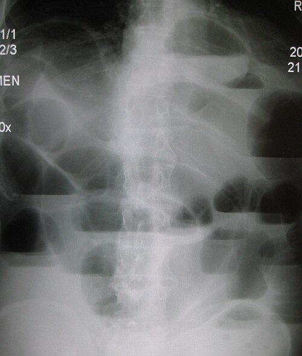
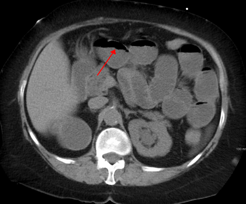

# OBSTRUÇÃO INTESTINAL

Para entender obstrução intestinal, você precisa parar de tentar decorar uma lista de causas e começar a visualizar o que está acontecendo dentro do abdome do seu paciente. Imagine o trato gastrointestinal como um sistema de encanamento contínuo. Se algo bloqueia o fluxo, tudo o que está "acima" (proximal) dilata, e tudo o que está "abaixo" (distal) murcha.

O grande desafio da prova de residência — e da vida real no plantão de cirurgia — não é apenas dizer "está obstruído". É responder três perguntas fundamentais:

- Onde está a obstrução (Delgado ou Cólon)?

- Qual a causa (Mecânica ou Funcional)?

- Existe sofrimento de alça (Isquemia)?

*Figura 1 - Radiografia abdominal em ortostase demonstrando obstrução de intestino delgado com múltiplos níveis hidroaéreos. Fonte: James Heilman, MD, CC BY-SA 3.0 | Wikimedia Commons*

## Classificação e Fisiopatologia: O "Porquê" dos Sintomas

A obstrução intestinal não é uma doença única, mas um estado clínico. Dividimos didaticamente em dois grandes grupos:

### Obstrução Mecânica (Íleo Mecânico)

Aqui existe um obstáculo físico real. Pode ser algo dentro da luz (bezoar, cálculo biliar), na parede (tumor, estenose inflamatória) ou fora da parede comprimindo a alça (bridas, hérnias).

Quando a alça obstrui, o intestino proximal tenta vencer o obstáculo com ondas peristálticas vigorosas. É por isso que, na fase inicial, o paciente tem **dor em cólica** e você ouve **ruídos hidroaéreos (RHA) aumentados e metálicos**. Com o tempo, a alça cansa, dilata e o peristaltismo diminui.

### Obstrução Funcional (Íleo Paralítico ou Adinâmico)

Aqui o "cano" está livre, mas a "bomba" parou de funcionar. Não há peristaltismo. A causa mais comum é o **íleo paralítico pós-operatório**.

**Cuidado para não cair nessa pegadinha:** O íleo paralítico é uma resposta fisiológica normal após cirurgias abdominais. O tempo de retorno da motilidade varia:

- Intestino delgado: 0 a 24 horas.

- Estômago: 24 a 48 horas.

- Cólon: 48 a 72 horas.

Se o seu paciente no 2º dia de pós-operatório (PO) de uma colectomia está distendido e sem flatos, isso provavelmente é o íleo fisiológico. Se isso persistir após o 5º dia, chamamos de **Íleo Pós-Operatório Prolongado**, e aí precisamos investigar causas metabólicas (hipocalemia é a clássica) ou complicações cirúrgicas (abscessos, fístulas).

### O Terceiro Espaço e o Choque

Por que o paciente com obstrução choca? Não é só porque ele não bebe água. A distensão da alça aumenta a pressão intramural, o que dificulta o retorno venoso e linfático. Isso gera edema da parede intestinal e transudação de líquido para dentro da luz e para a cavidade peritoneal. É o famoso **terceiro espaço**. O paciente perde litros de fluidos ricos em eletrólitos para "dentro" do próprio intestino.

## Obstrução de Intestino Delgado (OID)

A OID é o cenário mais comum nas provas. Em países industrializados e no Brasil, a causa número 1 disparada são as **aderências (bridas) pós-cirúrgicas**.

### Etiologia da OID

- **Aderências/Bridas:** Responsáveis por cerca de 60-70% dos casos. Ocorrem após qualquer cirurgia abdominal, mas são mais comuns após procedimentos pélvicos (ginecológicos ou proctológicos) e apendicectomias.

- **Hérnias:** Segunda causa mais comum. Lembre-se da **Hérnia Femoral**: ela é mais comum em mulheres, é um defeito adquirido e tem um colo muito estreito, o que gera um altíssimo risco de encarceramento e estrangulamento.

- **Neoplasias:** Menos comuns no delgado do que no cólon. O adenocarcinoma é o tumor maligno primário mais comum do delgado, mas as metástases (especialmente de melanoma) também aparecem.

*Figura 2 - Tomografia computadorizada demonstrando obstrução de intestino delgado com interface ar-líquido irregular. Fonte: James Heilman, MD, CC BY-SA 3.0 | Wikimedia Commons*

## Quadro Clínico da OID

O paciente clássico apresenta:

- **Dor abdominal em cólica:** Periumbilical.

- **Vômitos precoces:** Se a obstrução for alta, os vômitos são biliosos. Se for baixa (íleo terminal), podem ser **fecaloides** (resultado da estase e proliferação bacteriana, não é fezes de verdade, mas cheira como tal).

- **Distensão abdominal:** Mais acentuada quanto mais baixa for a obstrução.

- **Parada de eliminação de flatos e fezes:** Mas atenção, se a obstrução for parcial (suboclusão), o paciente ainda pode eliminar gases.

### Diagnóstico por Imagem na OID

A rotina de abdome agudo (RX de tórax em pé, RX de abdome em pé e deitado) é o primeiro passo. No RX, você verá:

- **Dilatação de alças de delgado:** Localização central, diâmetro > 3 cm.

- **Empilhamento de moedas:** São as válvulas coniventes (pregas circulares) que atravessam toda a circunferência da alça.

- **Níveis hidroaéreos:** Visíveis no RX em pé.

**Dica do MedEvo:** Se o RX mostrar gás no reto, a obstrução pode ser parcial ou muito precoce. Se não houver gás distal, a obstrução é completa. Atualmente, a **Tomografia de Abdome** é o padrão-ouro porque não só confirma a obstrução, mas localiza o "ponto de transição" e avalia sinais de sofrimento de alça (pneumatose intestinal, líquido livre, realce reduzido da parede).

## Obstrução de Intestino Grosso (OIG)

Aqui o jogo muda. A causa número 1 de obstrução de cólon em adultos é o **Câncer Colorretal (Adenocarcinoma)**.

### Etiologia da OIG

- **Neoplasia Maligna:** Especialmente no sigmoide e cólon esquerdo (onde o lúmen é mais estreito e as fezes são mais sólidas).

- **Vólvulo de Sigmoide:** É a torção da alça sobre o seu próprio mesentério. Comum em idosos, pacientes acamados ou com megacólon chagásico.

- **Diverticulite:** Pode causar obstrução por edema na fase aguda ou por estenose cicatricial após múltiplos episódios.

### O Papel da Válvula Ileocecal

Isso cai muito! Se a válvula ileocecal for **competente**, o cólon vira uma "alça fechada" entre o tumor e a válvula. A pressão sobe rapidamente e o risco de perfuração (geralmente no ceco, que é a parte mais larga e com parede mais fina — Lei de Laplace) é enorme. Se a válvula for **incompetente**, o conteúdo colônico reflui para o delgado, aliviando a pressão no cólon, mas causando grande distensão de delgado.

### Vólvulo de Sigmoide

O quadro é de dor súbita e distensão maciça. No RX, o sinal clássico é o de **"Grão de Café"** ou **"U Invertido"**.

- **Conduta no Vólvulo sem sinais de peritonite:** Descompressão por colonoscopia ou retossigmoidoscopia. Se funcionar, você ganha tempo para preparar o paciente e operar eletivamente (pois a recorrência é alta).

- **Conduta no Vólvulo com peritonite/isquemia:** Cirurgia de urgência (Geralmente cirurgia de Hartmann).

| Característica | Obstrução de Delgado | Obstrução de Cólon |
| --- | --- | --- |
| **Dor** | Cólica periumbilical intensa | Dor abdominal difusa, mais insidiosa |
| **Vômitos** | Precoces e frequentes | Tardios (podem ser fecaloides) |
| **Distensão** | Moderada, central | Intensa, periférica |
| **RX (Imagem)** | Empilhamento de moedas | Imagem em "moldura" (haustrações) |
| **Causa Principal** | Bridas / Aderências | Neoplasia (Câncer) |

## Síndromes Especiais e Pegadinhas de Prova

### Síndrome de Ogilvie (Pseudo-obstrução Colônica Aguda)

É uma obstrução funcional do cólon. O paciente (geralmente idoso, internado por outra causa como pneumonia ou fratura de fêmur) apresenta uma distensão abdominal absurda, mas a TC mostra que não há obstrução mecânica.

- **Tratamento inicial:** Suporte, correção de eletrólitos, suspender drogas que reduzem motilidade (opioides).

- **Tratamento farmacológico:** Neostigmina (anticolinesterásico). Cuidado: exige monitorização cardíaca pelo risco de bradicardia.

- **Tratamento refratário:** Colonoscopia descompressiva.

### Divertículo de Meckel

É o remanescente do ducto onfalomesentérico. É um **divertículo verdadeiro** (tem todas as camadas da parede).

- **Regra dos 2:** 2% da população, 2 pés da válvula ileocecal (60 cm), 2 polegadas de comprimento, 2 tipos de mucosa ectópica (gástrica e pancreática).

- **Complicação no adulto:** Obstrução (por intussuscepção ou volvo).

- **Complicação na criança:** Sangramento (pela mucosa gástrica heterotópica que ulcera a mucosa ileal adjacente).

- **Conduta no sangramento:** Enterectomia segmentar (para retirar a mucosa gástrica e a úlcera que está no íleo).

### Íleo Biliar

Uma fístula entre a vesícula e o duodeno permite que um cálculo grande passe para o intestino. Ele impacta geralmente no ponto mais estreito: a válvula ileocecal.

- **Tríade de Rigler (clássica no RX):** 1. Obstrução de delgado; 2. Cálculo biliar ectópico (radiopaco); 3. Aerobilia (ar na via biliar).

## Manejo Terapêutico: Quando Operar?

Como diz o Dr. Will, "nem todo abdome agudo obstrutivo termina em cicatriz". A decisão cirúrgica depende da causa e da presença de complicações.

### Tratamento Conservador

Indicado principalmente para **obstrução por bridas** sem sinais de estrangulamento.

- **NPO (Nada por via oral).**

- **Sonda Nasogástrica (SNG):** Fundamental para descompressão gástrica, evitar aspiração e diminuir o desconforto.

- **Hidratação Venosa Vigorosa:** Reposição de cristaloides para tratar o terceiro espaço.

- **Correção de Eletrólitos:** Hipocalemia e hipomagnesemia são inimigas da motilidade.

**Quanto tempo esperar?** Geralmente 24 a 48 horas. Se não houver melhora (eliminação de gases, redução do débito da SNG), a cirurgia é indicada. O uso de contraste hidrossolúvel (Gastrografin) via oral pode ser diagnóstico e terapêutico (ajuda a "puxar" água para o lúmen e estimular a motilidade).

### Indicações de Cirurgia Imediata

- **Sinais de Irritação Peritoneal:** Sugere isquemia ou perfuração.

- **Obstrução em Alça Fechada:** Ex: Vólvulo, hérnia encarcerada.

- **Obstrução Completa por Tumor:** Precisa de ressecção ou derivação.

- **Estrangulamento:** Febre, leucocitose, acidose metabólica e dor contínua (que substitui a cólica).

| Condição | Conduta de Escolha |
| --- | --- |
| Brida (sem sofrimento) | Conservador (SNG + Hidratação) por 24-48h |
| Brida (com peritonite) | Laparotomia de urgência |
| Vólvulo de Sigmoide estável | Descompressão endoscópica |
| Câncer de Cólon Esquerdo | Ressecção (Hartmann ou Anastomose Primária) |
| Hérnia Encarcerada | Redução cirúrgica + Reforço da parede |

## Fístulas Digestivas e Complicações Pós-Operatórias

As fístulas são comunicações anormais entre duas superfícies epitelizadas. No contexto da obstrução, elas podem surgir após uma deiscência de anastomose.

### Fatores que dificultam o fechamento espontâneo (Mnemônico FRIEND)

- **F**oreign body (Corpo estranho).

- **R**adiation (Radiação prévia).

- **I**nfection/Inflammation (Abscesso, Crohn).

- **E**pithelization (Epitelização do trajeto).

- **N**eoplasia (Câncer na fístula).

- **D**istal obstruction (Obstrução distal — esta é a mais importante para provas!).

Se houver uma obstrução distal à fístula, a pressão fará com que o conteúdo sempre saia pelo caminho de menor resistência (a fístula), impedindo o fechamento. Por isso, antes de tratar uma fístula, você deve garantir que o trânsito distal está livre.

### Nutrição na Obstrução e Fístulas

- Se o íleo pós-operatório for prolongado (> 5-7 dias) e o paciente não puder comer, a **Nutrição Parenteral Total (NPT)** deve ser iniciada para evitar a desnutrição grave.

- Em fístulas de alto débito (> 500 ml/dia), a NPT também é frequentemente necessária para "descansar" o intestino e repor as perdas maciças.

## Diagnóstico Diferencial e Exames Laboratoriais

Não existe um exame de sangue que dê o diagnóstico de obstrução, mas eles ajudam a avaliar a gravidade:

- **Hemograma:** Leucocitose com desvio à esquerda sugere isquemia ou perfuração. Hemoconcentração (aumento do hematócrito) indica desidratação grave.

- **Eletrólitos:** Procure por hipocalemia, hiponatremia e alcalose metabólica hipoclorêmica (comum em vômitos de repetição por perda de HCl gástrico).

- **Lactato e Gasometria:** O aumento do lactato e a acidose metabólica são sinais tardios e sombrios de isquemia intestinal.

**Erro clássico de prova:** Achar que a ausência de febre e leucocitose exclui isquemia. Em idosos, esses sinais podem ser muito sutis ou inexistentes até que a perfuração ocorra.

## Pontos-Chave para Prova

- **Causa #1 de OID:** Aderências/Bridas (pense nisso se houver cicatriz cirúrgica).

- **Causa #1 de OIG:** Neoplasia colorretal (pense nisso se for idoso, com perda de peso ou anemia).

- **Hérnia Femoral:** Mulheres, alto risco de estrangulamento, abaixo do ligamento inguinal.

- **Tríade de Rigler:** Aerobilia + Cálculo ectópico + Obstrução de delgado = Íleo Biliar.

- **Sinal do Grão de Café:** Vólvulo de sigmoide. Conduta inicial: Descompressão endoscópica (se estável).

- **Síndrome de Ogilvie:** Pseudo-obstrução colônica. Tratar com Neostigmina se medidas iniciais falharem.

- **Divertículo de Meckel:** Causa sangramento em crianças (mucosa gástrica ectópica) e obstrução em adultos.

- **Íleo Paralítico:** Normal no PO imediato. Cólon demora até 72h para voltar.

- **Obstrução em Alça Fechada:** É uma emergência cirúrgica absoluta pelo risco iminente de necrose.

- **Válvula Ileocecal Competente:** Transforma a obstrução de cólon em alça fechada (risco de ruptura de ceco).

- **Toque Retal:** Obrigatório em todo paciente com suspeita de obstrução (avalia fecaloma e tumores distais).

- **Alcalose Metabólica Hipoclorêmica:** Distúrbio clássico dos vômitos altos.

- **Anemia Ferropriva em Idoso:** Até que se prove o contrário, é câncer de cólon direito (sangramento oculto).

- **O que NÃO fazer:** Usar procinéticos (metoclopramida) em suspeita de obstrução mecânica completa (risco de perfuração).

- **Critério de falha do tratamento clínico:** Piora da dor, surgimento de febre, leucocitose ou ausência de melhora em 48h.

- **Vaso Retos e Arcadas:** Jejuno tem vasos retos longos e poucas arcadas; Íleo tem vasos retos curtos e várias arcadas complexas. 💡

 Cópia offline para consulta pessoal.
 Fonte original:
 [https://www.medevo.com.br/material-apoio/ler/ac8d43ca-1fd2-4023-908f-72c2a398157d](https://www.medevo.com.br/material-apoio/ler/ac8d43ca-1fd2-4023-908f-72c2a398157d)
